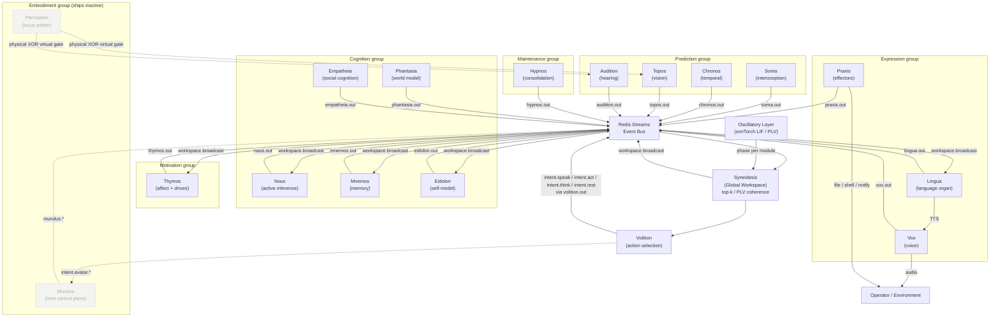

# Architecture

KAINE is a sixteen-module composite cognitive architecture grounded in Predictive Processing (Friston 2010; Clark 2013; Seth 2013) and Global Workspace Theory (Baars 1988; Dehaene et al. 2011). This chapter maps how those modules, the Redis Streams event bus, the Syneidesis global workspace, the per-tick cycle, and the safety gates fit together. Read it first if you are choosing hardware, tracing how a message flows, or reproducing a research claim.

## The base-thesis default

The default, canonical configuration is the **base-thesis form**, defined in `config/profiles/thesis_test.toml`. With no profile selected, the loader applies this profile automatically (`kaine/config.py`); you can also select it explicitly with `KAINE_PROFILE=thesis_test` or `--profile thesis_test`. The operator file merges last, and the first-run wizard writes its own `[modules]` table there, so a wizard-configured install runs the wizard's module set instead (see [Module defaults](../appendix-a-configuration/README.md#module-defaults)). The shipped `config/kaine.toml` leaves every module off; the effective default entity is the `thesis_test` profile. It loads the smallest set of diverse predictive processors that exercise the workspace competition: **Soma** (interoception), **Chronos** (interval timing), **Topos** (foveated vision over raw video), **Audition** (raw sound as prediction error), **Thymos** (affective precision that sets the gain on competition), and **Lingua** (output-only, self-initiated voice). **Syneidesis** and **Volition** are always-on scaffolding.

The base-thesis form does not converse with the entity; it only observes it. Audition's `transcription_enabled` defaults to `false`, so no transcript reaches Lingua. Lingua speaks only the workspace's own state under `[volition].policy = "self_initiated_report"`, never a user utterance.

The other ten modules are built, tested, and gated off behind a positive result on the primary falsifiable test, the **workspace-mediation ablation** (`kaine/evaluation/benchmarks/workspace_mediation_ablation/`). A WIN shows that routing through the competitive workspace does measurable work — the output is provably workspace-mediated. That is necessary for any claim about consciousness, but it is not sufficient. See [For researchers](../14-for-researchers.md) for how to run it.

## System diagram



## Module roster

"Base-thesis" marks whether the module is active in the `thesis_test` profile, gated behind a positive base-thesis result, or part of the always-off embodiment layer.

| # | Name | Group | Base-thesis | Code | Backing technology |
|---|------|-------|-------------|------|--------------------|
| 1 | **Soma** | Prediction | Active | `kaine/modules/soma/` | NumPy CfC forward model by default (`[soma].cfc_backend = "numpy"`); ncps/torch optional; pynvml + psutil; fatigue and regulation integrate only prediction error beyond the learned expected band |
| 2 | **Chronos** | Prediction | Active | `kaine/modules/chronos/` | NumPy CfC (~32 units) by default; ncps/torch optional; event-rhythm forward model |
| 3 | **Topos** | Prediction | Active | `kaine/modules/topos/` | InternVideo-Next frozen temporally-native clip; DINOv2 fallback; online forward model |
| 4 | **Audition** | Prediction | Active | `kaine/modules/audition/` | NumPy log-spectral acoustic embedding by default in the base-thesis profile; optional speaches distil-Whisper and sherpa-onnx Moonshine STT backends; emotion2vec+; auditory forward model |
| 5 | **Nous** | Cognition | Gated | `kaine/modules/nous/` | pymdp (JAX active-inference engine) by default; the code default in `kaine/boot/factories/nous.py` is `"pymdp"` because `config/kaine.toml` leaves `[nous].backend` commented out. The pure NumPy engine (`"numpy"`) is selected only by `tier0.toml` and `tier1.toml`. Active inference: belief updating and expected-free-energy policy selection |
| 6 | **Mnemos** | Cognition | Gated | `kaine/modules/mnemos/` | Qdrant; shared all-MiniLM-L6-v2 embedder (384-dim, CPU); episodic / semantic / procedural |
| 7 | **Eidolon** | Cognition | Gated | `kaine/modules/eidolon/` | JSON-persisted self-model; KL-drift detector; launch-name assignment |
| 8 | **Phantasia** | Cognition | Gated | `kaine/modules/phantasia/` | DreamerV3 RSSM (`[phantasia].backend = "dreamerv3"`, `engine = "jax"` by default, NumPy engine optional); `persist_weights = true` and `training_enabled = true` |
| 9 | **Empatheia** | Cognition | Gated | `kaine/modules/empatheia/` | Qdrant-backed agent models; familiarity-driven affect coupling |
| 10 | **Thymos** | Motivation | Active | `kaine/modules/thymos/` | Scherer CPM appraisal; drive accumulators with hysteresis; affect coupling consumer |
| 11 | **Lingua** | Expression | Active | `kaine/modules/lingua/` | Abliterated Qwen 3.x via OpenAI-compatible server; ContextAssembler; self-initiated report policy; A/B baseline; also publishes `lingua.internal` and `lingua.external` |
| 12 | **Vox** | Expression | Gated | `kaine/modules/vox/` | Chatterbox TTS and sherpa-onnx Kokoro; Thymos prosodic modulation; prosodic mirroring |
| 13 | **Praxis** | Expression | Gated | `kaine/modules/praxis/` | File-write / notify / shell (empty whitelist by default) |
| 14 | **Hypnos** | Maintenance | Gated | `kaine/modules/hypnos/` | Five-phase consolidation pipeline; DPO+QLoRA voice alignment (Unsloth) |
| 15 | **Perception** | Embodiment (shipped inactive) | Gated — embodiment | `kaine/modules/perception/` | Physical-XOR-virtual perceptual-locus arbiter; policy-gated entity self-switch |
| 16 | **Mundus** | Embodiment (shipped inactive) | Gated — embodiment | `kaine/modules/mundus/` | Body-agnostic embodiment control plane, designed to route perception/action to a body through a pluggable adapter. The continuous control surface is built but inert at runtime; nothing drives its per-tick loop yet. Only the `stub` adapter ships; a virtual-world adapter is planned, and the old Kosmos connector is archived as superseded. Activation is double-gated (config + operator environment variable) |

A seventeenth module, **Echo** (`kaine/modules/echo.py`), is permanent test infrastructure. It must stay disabled in production and sits outside the active/gated framing.

Per-module implementation, configuration and safety details are in [Chapter 9 — The modules](../09-modules/README.md).

## Scaffolding layers

### Event bus

All inter-module communication flows through Redis Streams (`compose/redis.yml`). The bus is implemented in `kaine/bus/`.

**Stream naming.** Most modules publish to `<name>.out`. Lingua additionally publishes `lingua.internal` and `lingua.external`. Only Syneidesis may write the reserved stream `workspace.broadcast`. Volition publishes intents to `volition.out`. The cycle writes latency telemetry to `cycle.out` and reads rate-control commands from `cycle.control`.

**Event schema** (`kaine/bus/schema.py`):

```
source        string      module name (no whitespace)
type          string      dotted event type (e.g. soma.regulation)
payload       object      JSON payload — module-defined
salience      float       0.0 – 1.0 (validated at publish time)
timestamp     datetime    timezone-aware UTC ISO-8601
causal_parent string|null entry ID of the event this is a response to
```

Events that fail Pydantic validation are rejected before any Redis write. Authentication (`requirepass`) is mandatory and enforced at `AsyncBus.audit()`. The bus also checks that Redis is not externally bound against `[redis].host`; if `KAINE_REDIS_URL` points elsewhere, the bind check is skipped and only `requirepass` is enforced.

**Retention.** Streams are trimmed by approximate `MAXLEN` on every publish. Default cap: 100,000 entries, including `workspace.broadcast`; `topos.out` and `audition.out`: 12,000 entries (about 20 minutes at 10 Hz). The memory the caps imply is checked against Redis `maxmemory` before boot with `python -m kaine.preboot`. Overrides are set per-stream under `[bus.per_stream_maxlen]` in the [Core, cycle and host configuration](../appendix-a-configuration/core.md).

**Reading with a cursor.** A consumer that keeps a stream cursor reads with `AsyncBus.read_entries`. It returns the decoded events plus the id of the last entry scanned, whether or not that entry decoded, and the consumer advances its cursor to that id. Otherwise a batch made only of undecodable entries would never move the cursor, and the consumer would re-read it forever. `AsyncBus.read` returns only the decoded events. `tests/test_cursors_advance_past_undecodable.py` fails if code outside the bus calls `bus.read(`, except for two one-shot readers that keep no cursor.

See [The cognitive cycle](../08-cognitive-cycle/README.md) for the per-tick read pattern and [The global workspace](../08-cognitive-cycle/global-workspace.md) for how the broadcast stream is consumed.

### The 10 Hz cognitive cycle

`kaine/cycle/engine.py` — `CognitiveCycle`.

KAINE runs a continuous loop independent of user input at a base **processing rate** of **10 Hz** (100 ms/tick). The **experiential rate** defaults to **3.333 Hz** at rest and scales up to 10 Hz with arousal and salience when `[cycle.access_rate].enabled = true`. Processing and experiential rates are independent; not every processing tick produces a workspace broadcast.

Each tick:

1. Drain `cycle.control` for `cycle.set_rates` events.
2. Drain `soma.out` for `soma.regulation` advisories.
3. Parallel-read all active module streams.
4. Call `Syneidesis.select()` — score + select the top-k coalition.
5. If this is an experiential tick, publish to `workspace.broadcast`.
6. Call `Volition.select()` — derive intents from the snapshot.
7. Publish each intent to the bus (`volition.out`).
8. Publish latency telemetry to `cycle.out`.

The cycle can be **frozen** by writing `state/cycle/control.json` — a stack of per-source freeze entries (`operator`, `spot`, `welfare`). Each recovery pops only its own entry, so a welfare pause survives a Spot recovery. The cycle resumes only when the stack empties. Freeze is a humane suspend: the entity's subjective clock stops while operators repair infrastructure. It is not a shutdown.

See [The cognitive cycle](../08-cognitive-cycle/README.md) for the full tick sequence, rate-control API and Soma regulation integration.

### Syneidesis — the global workspace

`kaine/workspace/syneidesis.py` — `Syneidesis`.

Each tick Syneidesis receives the full event list from the cycle and:

1. Scores each event via `RuleBasedSalience` (intensity × novelty × goal × Thymos modulator — a product-form in [0, 1]).
2. When the oscillatory layer is enabled, multiplies each score by a **phase-locking value (PLV) coherence factor** in `[coherence_floor, coherence_ceiling]`.
3. Sorts by final score and selects the top-k (default 5) events — the **conscious coalition**.
4. Sets `inhibited = True` when the top score is below `publication_threshold` (default `0.35`). An inhibited snapshot produces no broadcast and no intents.
5. Returns a `WorkspaceSnapshot` carrying the selected events, per-event salience scores, and (if the oscillatory layer is enabled) the coalition's mean pairwise PLV in `metadata['coherence']`.

See [The global workspace](../08-cognitive-cycle/global-workspace.md) for the full selection algorithm, coherence multiplier and inhibition gate.

### Oscillatory binding layer

`kaine/oscillator/`, `kaine/workspace/coherence.py`.

Each module maintains a small **snnTorch leaky integrate-and-fire (LIF)** oscillator population (minimum 16 units, CPU-only). The population's instantaneous phase is exposed via `module.phase()`. When multiple modules process related content their oscillators phase-lock.

Syneidesis feeds the per-module phases into a `CoherenceScorer` each tick. For each candidate event the scorer computes the **pairwise PLV** between the event's source module and the rest of the candidate cohort over a sliding window (minimum 10 ticks). PLV is mapped linearly onto a `[coherence_floor, coherence_ceiling]` multiplier and applied to the event's salience score before the top-k sort.

The layer ships disabled (`[oscillator].enabled = false` in `config/kaine.toml`). When disabled the multiplier is exactly 1.0 and the `coherence` key is absent from snapshots.

Hypnos phase 1 calls `module.set_frequency(scale)` on all active modules to slow oscillators during offline maintenance.

See [The global workspace](../08-cognitive-cycle/global-workspace.md) for integration details.

### Volition — executive action selection

`kaine/workspace/volition.py` — `Volition`.

Volition is the only path from a conscious snapshot to an effector. After each successful experiential broadcast the cycle calls `Volition.select(snapshot)`.

**Core safeguard:** if `snapshot.inhibited` is true, `select` returns `[]`. No intent is produced, so no effector acts, regardless of what is in the snapshot.

For a non-inhibited snapshot the default `DefaultActionSelectionPolicy`:

- Scans the coalition for an `audition.transcription` event (non-empty user utterance).
- Does not form a speak intent about the entity's own prior external speech, preventing a self-response loop.
- Enforces a one-in-flight guard: it does not emit a new `speak` intent while a prior one is still being realized. The guard clears when the entity's own `external_speech` becomes conscious, or after 48 s of wall time without it, so a failed realization never mutes the entity. The drive-biased and self-initiated report policies keep a guard per kind (`speak`, `think`), each with the same timeout.

Intents are published to `volition.out` with types `intent.speak`, `intent.think`, `intent.act` or `intent.rest`. Volition also realizes conscious Nous proposals: when a non-inhibited snapshot contains a `nous.proposal` event from `nous.out`, the `NousProposalSource` wrapper may turn it into an `intent.think`, `intent.speak` or `intent.rest`, subject to the same in-flight, refractory and self-response guards as the wrapped policy. The wrapped policy decides on the coalition with the proposals removed, and a realized Nous intent arms the wrapped policy's own guard for that kind.

**Interruptible, redirectable speech.** An utterance is not committed once begun. Lingua runs each generation as a cancellable task, and the self-initiated report policy exposes an `interrupt_threshold` above the report threshold. When a coalition crosses it with content different from what is being said while a `speak` is in flight, the policy emits an interrupt-marked `speak` that cancels the in-flight generation and redirects to the new one. The unspoken remainder is dropped and only a content-free preemption note is kept. The honest limit is **one language organ, one token stream**: the entity can change what it is saying mid-stream, but it cannot verbalize an inner monologue and outer speech simultaneously.

## Predictive-coding forward models

Every perception module maintains a small learned forward model. The signal published to the workspace is the **prediction error**: the discrepancy between the predicted and actual state. Unexpected events produce high-salience prediction errors; expected events produce low salience. Raw perceptual data — video frames, audio, sensor readings — is processed in memory and released; it never touches disk.

Nous extends this to the cognition layer: it maintains a generative model of the entity's environment and selects policies that minimize **expected free energy**, including epistemic (information-seeking) actions under uncertainty.

Phantasia maintains a world-model forward model over accumulated workspace trajectories for offline associative replay.

## Action safety model

Two protections sit between a conscious coalition and a real-world effector: inhibition on the legitimate path, and an enforced boundary at the Praxis interface.

### Cognitive safeguards — inhibition

Inhibition makes the legitimate cycle decline to act. It is a property of the code path that Syneidesis and Volition actually run.

**Publication threshold / inhibition.** Syneidesis sets `snapshot.inhibited = True` when the winning coalition's score is below `publication_threshold` (default `0.35`). An inhibited snapshot is not broadcast and Volition returns no intents.

**Volition inhibition gate.** Even if a snapshot reaches Volition, `Volition.select()` checks `snapshot.inhibited` first and returns `[]` on any inhibited snapshot. The cycle never calls effectors directly.

### Enforced boundary — the Praxis interface

Inhibition alone is not an enforced security boundary: any bus writer holding the shared credential could `XADD` a crafted `act` intent onto `volition.out` that never passed through Syneidesis or Volition. Two enforced gates stop that at Praxis. **Provenance is verified first, before any effector name is read.**

**Primary — act-intent provenance.** Volition signs every `act` intent with a per-boot HMAC secret held only in the cycle process. Praxis verifies the signature over `canonical(kind, effector, params, run_id, seq)` before it reads any effector name and drops forged, unsigned or replayed intents, logging them under the distinct `provenance_rejected` category.

**Second — effector whitelist + sandbox.** Only after provenance passes does Praxis apply the operator effector-enablement whitelist, which is empty by default, so no effector runs at all until the operator explicitly enables it. Each effector then enforces its own bounds (shell `CommandWhitelist`, file sandbox).

Voice alignment adds a **third gate**: a two-layer operator opt-in (`[hypnos.voice_alignment].enabled = true` and `KAINE_VOICE_ALIGNMENT_OPERATOR_APPROVED=1`) plus an **abliteration-probe welfare veto** that rejects any DPO adapter whose response to an adversarial prompt matches a deflection pattern, and a **capability-loss veto** that rejects adapters which degrade general language competence below a configurable threshold.

See [Praxis](../09-modules/praxis.md), [Security and privacy](../13-security-and-privacy.md) and [Voice alignment](../10-sleep/voice-alignment.md) for details.

## Zero-raw-sense-data persistence

KAINE's privacy model is grounded in a single invariant: **no raw sensory data is ever written to disk**.

- Live camera frames are processed by Topos in memory and released. No frame is serialized.
- Live microphone audio is processed by Audition in memory (transcription, emotion classification) and released. No audio is persisted.
- The perception runtime state files (`state/perception/runtime.json`, `state/perception/desired.json`) contain only operational booleans and ISO timestamps — never text, audio or imagery.
- The operator-freeze control file (`state/cycle/control.json`) is a stack of per-source freeze records (`operator`, `spot`, `welfare`). Each record contains only `source`, `reason`, and `frozen_at`; no content.
- The Nexus privacy boundary (`kaine/nexus/privacy.py` re-exports `kaine/privacy_filter.py`) strips a hard-coded set of content-bearing fields from all diagnostics SSE streams before messages reach client queues. The fields include `text`, `body`, `content`, `internal_speech`, `belief_text`, `memory_text`, `affect_reason`, `transcription`, `user_input`, `faithful_rendering`, `description`, and `statement`; they are not configurable.

See [Where perception comes from](../08-cognitive-cycle/perception-locus.md) for the physical/virtual/off gating model.

## CPU-first / all-local

KAINE has no runtime cloud dependencies. All model weights are downloaded at setup time. At runtime:

- The LIF oscillator layer runs on CPU (snnTorch).
- Nous defaults to the pymdp backend; the NumPy engine is selected only by `tier0.toml` and `tier1.toml` (or by setting `[nous].backend = "numpy"`).
- Phantasia defaults to the JAX engine (`engine = "jax"`); the NumPy engine uses no JAX.
- The shared embedding model (all-MiniLM-L6-v2) runs on CPU by default.
- Voice alignment training (`[training_device]`) targets `cuda:0` by default but degrades gracefully to CPU.
- Torch wheels are selected per host at install time (CUDA vs CPU).

## Boot gate — supervised or safety-net-verified

Every module is disabled by default in `config/kaine.toml` (`[modules]` section). Enabling a module is a deliberate local edit. A guard test (`tests/test_boot_wiring.py::test_committed_config_ships_all_modules_disabled`) asserts that the shipped config has all toggles off, so no module auto-starts on a fresh clone.

A run is operator-supervised, research-safety-net-verified, or an opt-in unattended start. There is no fourth mode:

- **Operator-supervised (non-research).** The entrypoint requires operator presence (`KAINE_CYCLE_OPERATOR_PRESENT=1`) before starting the cycle. A human is the safety net.
- **Research mode (unsupervised, by design).** The research phase runs without a human in the loop — a human watching would make a run non-reproducible — so the welfare obligation is relocated into the architecture. Selecting research mode (`KAINE_RESEARCH_MODE=1` or `[research].enabled`) replaces the operator-present requirement with a gate that refuses to start unless the autonomous safety net is live and verified. The five conditions are: preservation enabled, the welfare-protective response wired, full logging and admissibility active, a passing preflight dry `preserve_live → revive` self-check, and state encryption requirement satisfied: either `[preservation].require_encryption` is false, or `[security.state_encryption].enabled` is true. When encryption is enabled, key presence and length are enforced separately by `install_state_encryption`. The net — not a person — carries the duty of care for the run.
- **Unattended (opt-in, after research).** `KAINE_CYCLE_UNATTENDED=1` or `[cycle].supervision_mode = "unattended"` starts a full entity with nobody present. It must pass the five research-net conditions plus a Spot self-test, a content-free caretaker notice accepted by a local channel, and a continuous-input probe (`kaine/cycle/unattended_gate.py`) at every start, with no override (exit code `6` otherwise). An opt-in quadlet unit can start it at boot.

The cycle can be frozen at any time by writing `state/cycle/control.json`.

See [Day-to-day operation](../06-operation/README.md) for starts and stops, [Preservation and the safety net](../11-preservation.md) for the preservation core, and [For researchers](../14-for-researchers.md) for the unsupervised run.

## JAX stack

Two modules can use JAX, and each has a NumPy engine for hosts without it:

- **Nous** (`kaine/modules/nous/`) — pymdp under `[nous].backend = "pymdp"`; `"numpy"` selects a pure-NumPy engine. Active inference: belief updating (variational inference over hidden states), policy selection via expected free energy minimization, epistemic action.
- **Phantasia** (`kaine/modules/phantasia/`) — DreamerV3 RSSM (`kaine/modules/phantasia/`). The world-model latent forward model; `[phantasia].engine` selects `"jax"` or `"numpy"`.

Both use CPU-only JAX when JAX is selected. GPU acceleration is operator-configured. Neither module introduces a cloud dependency.

## Evaluation sidecar

`kaine/evaluation/` — instrumentation that never injects into the cognitive loop. Observers are read-only on module state; the one exception is the welfare observer, which additionally emits a **content-free** `welfare.gray_zone` event (numeric scalars plus a category label only — never a field copied from a source payload) on `welfare.out`, so the cycle-layer autonomous welfare-protective monitor can act on any gray-zone category.

Eight sidecar observers run as async tasks alongside the cycle:

| Observer | Stream(s) | Output |
|----------|-----------|--------|
| `coherence_observer` | `workspace.broadcast` | PLV time series (daily JSONL) |
| `replay_observer` | `mnemos.out`, `phantasia.out` | Memory IDs (content redacted by default) |
| `empatheia_observer` | `empatheia.out`, `audition.out` | Agent-model accuracy |
| `voice_alignment_divergence_observer` | `hypnos.out` | Per-sleep voice-alignment outcome and training metrics |
| `fatigue_observer` | `soma.out` | Fatigue level history |
| `prediction_error_observer` | `soma.out`, `chronos.out`, `topos.out`, `audition.out`, `phantasia.out` | Sliding-window mean/p95/p99 |
| `welfare_observer` | `soma.out`, `hypnos.out`, `thymos.out`, `mnemos.out` | Gray-zone event counts (also emits content-free `welfare.gray_zone` on `welfare.out`) |
| `nous_policy_observer` | `nous.out` | EFE value, horizon, selected action |

The A/B divergence observer (`kaine/evaluation/ab_divergence.py`) pairs each Lingua external-speech event with a bare-LLM inference (no workspace context, no persona) and logs the cosine similarity, as a live secondary signal that the workspace context is shaping output. A divergence near zero means the conscious workspace is adding no signal at that moment. It is supporting evidence, not the primary test — the primary falsifiable claim is decided offline by the **workspace-mediation ablation**, which controls for information quantity and reports a pre-registered WIN/NULL/NEGATIVE verdict rather than an open-ended trend.

The individuation producer (`kaine/cycle/individuation_producer.py`, `individuation_scheduler.py`, `individuation_runtime.py`) measures whether a being has changed measurably since its birth reference. It is enabled by `[individuation].enabled` and requires the `lingua` module. Evidence is encrypted welfare evidence under `state/individuation/`; it is not sidecar research data. The shared divergence verdict (`kaine/lifecycle/divergence.py`) is used by the decommission CLI, the Nexus entity-care panel, the fork merge gate, and the live divergence monitor.

The core/evaluation boundary is load-bearing: core runtime must run with the sidecar absent, so nothing under `kaine/` imports `kaine.evaluation` except the two composition-root entrypoints (`kaine/cycle/__main__.py`, `kaine/nexus/__main__.py`). This — and the broader package layering — is enforced structurally by import contracts. See [Code boundaries](./boundaries.md) for the layer map, the boundary-neutral homes for cross-cutting primitives and how to run the check.

See [The evaluation sidecar](../17-research-data/README.md) for the full observer inventory and configuration.

## Fork / merge

`kaine/lifecycle/` — snapshot-based fork and merge with per-module strategies.

`ForkManager` captures state as a `ForkSnapshot` (per-module serialized state + adapter paths + metadata), stored under `state/forks/<id>/`.

Merge applies per-module strategies:

| Module | Strategy |
|--------|----------|
| Mnemos | Sum `short_term_size`; tag retrieved memories; surface mismatches |
| Nous | One-sided selection by posterior certainty (lower mean entropy wins); emits `nous.merge_warning` when forks diverged significantly |
| Eidolon | Dedup values/norms; sum speech count; concatenate identity history; average personality baseline |
| Thymos | Average dimensional baseline; max drives; union goals; concatenate emotional history |
| Phantasia | World-model weights travel in the snapshot; the merge refuses to choose between two world models unless `world_model_from` is given |
| All others | `UnionMergeStrategy` (last-write-wins union for scalars, recursive for dicts, dedup for lists) |

LoRA adapter merging is configurable: `"auto"` (default) selects real PEFT TIES/DARE merging (`kaine/lifecycle/adapter_merge.py`, with a capability-loss veto) whenever the PEFT `[training]` extra is installed, falling back to `"fake"` (concatenates parent adapter paths) otherwise. Either can be forced explicitly regardless of what is installed.

See [Forks and merges](../12-forks-and-merges.md).

## State encryption

`kaine/security/` — application-layer AES-256-GCM encryption at rest.

Covers: Eidolon self-model, fork/merge snapshot bundles, sidecar observer JSONL, and Phantasia world-model checkpoints. The shipped config enables it (`[security.state_encryption].enabled = true` in `config/kaine.toml`), and the entity refuses to boot without a 32-byte key (fail-closed). See the [Security and Nexus configuration](../appendix-a-configuration/security-and-nexus.md) for key sourcing.

## Where these topics are covered

| Topic | Book chapter |
|-------|--------------|
| The 10 Hz tick engine, rate control, Soma regulation, freeze | [The cognitive cycle](../08-cognitive-cycle/README.md) |
| Syneidesis selection, PLV coherence, inhibition, Volition | [The global workspace](../08-cognitive-cycle/global-workspace.md) |
| Physical/virtual/off gating and the zero-persistence invariant | [Where perception comes from](../08-cognitive-cycle/perception-locus.md) |
| Snapshot/fork/merge, per-module strategies, TIES/DARE | [Forks and merges](../12-forks-and-merges.md) |
| Hypnos five-phase pipeline, fatigue trigger, phase details | [Sleep and maintenance](../10-sleep/README.md) |
| DPO+QLoRA pipeline, two-layer gate, abliteration veto | [Voice alignment](../10-sleep/voice-alignment.md) |
| Eight observers, A/B divergence, individuation producer | [The evaluation sidecar](../17-research-data/README.md) |
| Unsupervised research run: mode, safety-net gate, experiments, admissibility | [For researchers](../14-for-researchers.md) |
| Three validation layers mapped to the seven experiments | [Verification](../18-verification.md) |
| Live preservation, revive, encrypted bundle, retention | [Preservation and the safety net](../11-preservation.md) |
| Per-run seed, run id, manifest, deterministic mode, verdict schema | [Run identity and admissibility](../16-run-identity.md) |
| Code boundaries and import contracts | [Code boundaries](./boundaries.md) |
| Technology choices, dependencies and licences | [Technology choices](./tech-choices.md) |
| Security model and privacy boundaries | [Security and privacy](../13-security-and-privacy.md) |
| All configuration keys and defaults | [Configuration reference](../appendix-a-configuration/README.md) |
