# Architecture

KAINE is a cognitive architecture for synthetic minds made of sixteen replaceable modules, a global workspace (Syneidesis) and an action layer (Volition), which communicate only through an event bus. Its first instantiation is a predictive global workspace grounded in predictive processing (Friston 2010; Clark 2013; Seth 2013) and Global Workspace Theory (Baars 1988; Dehaene and Changeux 2011), following the predictive global neuronal workspace of Whyte and Smith (2021). This chapter maps how the modules, the Redis Streams bus, the workspace, the per-tick cycle and the action gates fit together. Read it first if you are choosing hardware, tracing how a message flows, or reproducing a research claim.

## The base-thesis default

The default configuration is the **base-thesis form**, defined in `config/profiles/thesis_test.toml`. With no profile selected, the loader applies this profile automatically (`kaine/config.py`); you can also select it with `KAINE_PROFILE=thesis_test` or `--profile thesis_test`. The operator file merges last, and the first-run wizard writes its own `[modules]` table there, so a wizard-configured install runs the wizard's module set instead (see [Module defaults](../appendix-a-configuration/README.md#module-defaults)). The shipped `config/kaine.toml` leaves every module off.

The profile activates seven modules: four predictive processors in distinct signal domains, **Soma** (interoception of the compute substrate), **Chronos** (temporal prediction of the broadcast sequence), **Topos** (foveated vision) and **Audition** (raw hearing), plus **Thymos** (affect, whose arousal is the global gain on the competition), **Hypnos** (fatigue-triggered sleep) and **Lingua** (the output-only language organ). **Syneidesis** and **Volition** always run.

The base-thesis form observes the entity and does not converse with it. Audition's `transcription_enabled` is `false`, so no transcript reaches Lingua, and Lingua speaks only from accessed content under `[volition].policy = "self_initiated_report"`.

The other nine modules (Nous, Mnemos, Eidolon, Phantasia, Empatheia, Vox, Praxis, Perception and Mundus) are built and tested in isolation and held off by configuration. The module-addition study (the `ignition_study` in the code) adds them one at a time to a preserved seed being. Before that, a planned test asks whether competitive selection gives the processors a more useful prediction context than a score-blind coalition or a pool of every candidate; see [For researchers](../14-for-researchers.md#the-planned-test).

## System diagram

```mermaid
graph TD
    subgraph Prediction["Prediction group"]
        Soma["Soma\n(interoception)"]
        Chronos["Chronos\n(temporal)"]
        Topos["Topos\n(vision)"]
        Audition["Audition\n(hearing)"]
    end

    subgraph Cognition["Cognition group (held)"]
        Nous["Nous\n(active inference)"]
        Mnemos["Mnemos\n(memory)"]
        Eidolon["Eidolon\n(self-model)"]
        Phantasia["Phantasia\n(world model)"]
        Empatheia["Empatheia\n(social cognition)"]
    end

    subgraph Motivation["Motivation group"]
        Thymos["Thymos\n(affect + drives)"]
    end

    subgraph Expression["Expression group"]
        Lingua["Lingua\n(language organ)"]
        Vox["Vox\n(voice, held)"]
        Praxis["Praxis\n(effectors, held)"]
    end

    subgraph Maintenance["Maintenance group"]
        Hypnos["Hypnos\n(sleep)"]
    end

    subgraph Embodiment["Embodiment group (held)"]
        PerceptionLocus["Perception\n(locus arbiter)"]
        Mundus["Mundus\n(control surface)"]
    end

    Bus["Redis Streams\nevent bus"]
    Syneidesis["Syneidesis\n(global workspace)\nscore, coalition, access"]
    Volition["Volition\n(action selection)"]
    OscillatorLayer["Oscillatory layer\n(optional, off)"]

    Soma -->|"soma.out"| Bus
    Chronos -->|"chronos.out"| Bus
    Topos -->|"topos.out"| Bus
    Audition -->|"audition.out"| Bus
    Thymos -->|"thymos.out"| Bus
    Lingua -->|"lingua.out"| Bus
    Hypnos -->|"hypnos.out"| Bus
    Nous -->|"nous.out"| Bus
    Mnemos -->|"mnemos.out"| Bus
    Eidolon -->|"eidolon.out"| Bus
    Phantasia -->|"phantasia.out"| Bus
    Empatheia -->|"empatheia.out"| Bus
    Vox -->|"vox.out"| Bus
    Praxis -->|"praxis.out"| Bus

    Bus --> Syneidesis
    OscillatorLayer -.->|"phase per module"| Syneidesis
    Syneidesis -->|"workspace.broadcast"| Bus
    Syneidesis --> Volition
    Volition -->|"intent.speak / think / act / rest\nvia volition.out"| Bus
    Bus -->|"accessed content as context"| Topos
    Bus -->|"accessed content as context"| Audition
    Bus -->|"accessed content as context"| Soma
    Bus -->|"every broadcast as input"| Chronos
    Bus -->|"every broadcast, appraised"| Thymos
    Bus -->|"accessed content"| Lingua

    Lingua -.->|"text to speak"| Vox
    PerceptionLocus -.->|"physical XOR virtual gate"| Topos
    PerceptionLocus -.->|"physical XOR virtual gate"| Audition
    Mundus -.->|"mundus.*"| Bus

    classDef inactive stroke-dasharray: 5 5,opacity:0.6;
    class Nous,Mnemos,Eidolon,Phantasia,Empatheia,Vox,Praxis,PerceptionLocus,Mundus inactive;
```



## Module roster

"Base thesis" marks whether the module is active in the `thesis_test` profile or held.

| # | Name | Group | Base thesis | Code | Backing technology |
|---|------|-------|-------------|------|--------------------|
| 1 | **Soma** | Prediction | Active | `kaine/modules/soma/` | NumPy CfC reservoir with an online readout by default (`[soma].cfc_backend = "numpy"`); ncps/torch optional; pynvml and psutil; fatigue and regulation integrate only prediction error beyond the learned expected band |
| 2 | **Chronos** | Prediction | Active | `kaine/modules/chronos/` | NumPy CfC reservoir (32 units) by default; ncps/torch optional; predicts the next broadcast's features |
| 3 | **Topos** | Prediction | Active | `kaine/modules/topos/` | Frozen InternVideo-Next clip encoder; DINOv2 fallback; online forward model with foveation |
| 4 | **Audition** | Prediction | Active | `kaine/modules/audition/` | NumPy log-spectral acoustic encoder by default; emotion2vec+ tone classifier; optional speaches distil-Whisper and sherpa-onnx Moonshine speech-to-text backends (off in the base thesis) |
| 5 | **Nous** | Cognition | Held | `kaine/modules/nous/` | Active inference (belief updating and expected-free-energy policy selection). The code default in `kaine/boot/factories/nous.py` is `"pymdp"` (JAX) because `config/kaine.toml` leaves `[nous].backend` commented out; only `tier0.toml` and `tier1.toml` select the NumPy engine |
| 6 | **Mnemos** | Cognition | Held | `kaine/modules/mnemos/` | Qdrant; shared all-MiniLM-L6-v2 embedder (384-dim, CPU); episodic, semantic and procedural stores |
| 7 | **Eidolon** | Cognition | Held | `kaine/modules/eidolon/` | JSON-persisted self-model; KL-drift detector; launch-name assignment |
| 8 | **Phantasia** | Cognition | Held | `kaine/modules/phantasia/` | DreamerV3 RSSM (`[phantasia].backend = "dreamerv3"`, `engine = "jax"` by default, NumPy engine optional); `persist_weights = true` and `training_enabled = true` |
| 9 | **Empatheia** | Cognition | Held | `kaine/modules/empatheia/` | Qdrant-backed agent models; familiarity-driven affect coupling |
| 10 | **Thymos** | Motivation | Active | `kaine/modules/thymos/` | Sequential appraisal; arousal as global gain; drive accumulators with hysteresis; affect coupling consumer |
| 11 | **Lingua** | Expression | Active | `kaine/modules/lingua/` | `kaineone/Qwen3.5-4B-abliterated-GGUF` served by an OpenAI-compatible server; context assembler; publishes `lingua.internal` and `lingua.external` as well as `lingua.out` |
| 12 | **Vox** | Expression | Held | `kaine/modules/vox/` | Chatterbox TTS and sherpa-onnx Kokoro; prosody modulated by Thymos; prosodic mirroring |
| 13 | **Praxis** | Expression | Held | `kaine/modules/praxis/` | File-write, notify and shell effectors (empty whitelist by default) |
| 14 | **Hypnos** | Maintenance | Active | `kaine/modules/hypnos/` | Fatigue-triggered sleep with a five-phase consolidation pipeline and the affective reset; DPO + LoRA voice alignment (bf16 by default, 4-bit optional; Unsloth), off in the base thesis |
| 15 | **Perception** | Embodiment | Held | `kaine/modules/perception/` | Physical-XOR-virtual perceptual-locus arbiter; policy-gated entity self-switch |
| 16 | **Mundus** | Embodiment | Held | `kaine/modules/mundus/` | Body-agnostic embodiment control surface that routes perception and action to a body through a pluggable adapter. Nothing drives its per-tick loop yet, only the `stub` adapter ships, and activation is double-gated (config and an operator environment variable) |

A seventeenth module, **Echo** (`kaine/modules/echo.py`), is test infrastructure. It must stay disabled in production.

Per-module implementation, configuration and safety details are in [Chapter 9, The modules](../09-modules/README.md).

## Scaffolding layers

### Event bus

All inter-module communication flows through Redis Streams (`compose/redis.yml`), implemented in `kaine/bus/`. Every module sits behind this interface: it publishes typed events and declares which streams it reads, which is what lets a module be replaced without touching the others.

**Stream naming.** Most modules publish to `<name>.out`. Lingua also publishes `lingua.internal` and `lingua.external`. Only Syneidesis may write the reserved stream `workspace.broadcast`. Volition's intents go to `volition.out`. The cycle writes telemetry to `cycle.out` and reads rate-control commands from `cycle.control`.

**Event schema** (`kaine/bus/schema.py`):

```
source        string      module name (no whitespace)
type          string      dotted event type (e.g. soma.regulation)
payload       object      JSON payload, module-defined
salience      float       0.0 to 1.0, the event's intensity (validated at publish time)
timestamp     datetime    timezone-aware UTC ISO-8601
causal_parent string|null entry ID of the event this is a response to
```

Events that fail validation are rejected before any Redis write. `AsyncBus.audit()` enforces `requirepass` while `[bus].audit_required` is true (the default). When `[redis].host` is not a loopback address, the audit also refuses a Redis bound to all interfaces; with the shipped loopback host only the password is checked.

**Retention.** Streams are trimmed by approximate `MAXLEN` on every publish. The default cap is 100,000 entries, including `workspace.broadcast`; `topos.out` and `audition.out` are capped at 12,000 entries (about 20 minutes at 10 Hz). `python -m kaine.preboot` checks the memory the caps imply against Redis `maxmemory`. Per-stream overrides go under `[bus.per_stream_maxlen]` in the [Core, cycle and host configuration](../appendix-a-configuration/core.md).

**Reading with a cursor.** A consumer that keeps a stream cursor reads with `AsyncBus.read_entries`. It returns the decoded events plus the id of the last entry scanned, decoded or not, and the consumer advances its cursor to that id, so a batch made only of undecodable entries cannot stall the cursor. A non-blocking read from a `"$"` cursor raises `ValueError`; seed the cursor with `bus.last_entry_id()`. `AsyncBus.read` returns only the decoded events. `tests/test_cursors_advance_past_undecodable.py` fails if code outside the bus calls `bus.read(`, except for two one-shot readers that keep no cursor.

See [The cognitive cycle](../08-cognitive-cycle/README.md) for the per-tick read pattern and [The global workspace](../08-cognitive-cycle/global-workspace.md) for how the broadcast stream is consumed.

### The cognitive cycle

`kaine/cycle/engine.py`, `CognitiveCycle`.

KAINE runs a continuous loop independent of any external input. Processing ticks occur at the **processing rate**, 10 Hz by default (100 ms per tick). Broadcasts fall on **broadcast ticks**, a subset of the processing ticks set by the **access rate**: it rests at `experiential_rate_hz = 3.333` (one broadcast every third tick) and, with `[cycle.access_rate].enabled = true`, rises toward the processing rate after categorical alerts and with arousal.

The run loop first drains `cycle.control` for `cycle.set_rates` events and `soma.out` for `soma.regulation` advisories. Each tick then:

1. Reads all active module streams.
2. Sorts the events by `(source, type, entry_id)`.
3. Refreshes the affect snapshot the scorer reads.
4. Updates the access rate and decides whether this is a broadcast tick.
5. Calls `Syneidesis.select()` to score the candidates and form the coalition.
6. On a broadcast tick, publishes the snapshot to `workspace.broadcast`, then calls `Volition.select()` and publishes its intents to `volition.out`.
7. Publishes telemetry to `cycle.out`.

The cycle can be **frozen** through `state/cycle/control.json`, a stack of per-source freeze entries (`operator`, `spot`, `welfare`, `gestation`, `programme_end`, `preserve`). Each recovery pops only its own entry, so a welfare pause survives a Spot recovery, and the cycle resumes only when the stack is empty. A freeze stops the entity clock while operators repair infrastructure; it is not a shutdown.

See [The cognitive cycle](../08-cognitive-cycle/README.md) for the full tick sequence, rate control and Soma regulation.

### Syneidesis, the global workspace

`kaine/workspace/syneidesis.py`, `Syneidesis`.

On each processing tick Syneidesis:

1. Scores each candidate with `RuleBasedSalience`: the priority is intensity × novelty × goal factor, and the score is the arousal level gain times an arousal contrast of the priority. The workspace applies no per-source weight; each predictive processor has already scaled its error by its own recent errors and graded its intensity.
2. When the oscillatory layer is enabled, multiplies each score by a phase-locking coherence factor in `[coherence_floor, coherence_ceiling]`.
3. Sorts by score and keeps the top `top_k` (default 5) as the coalition.
4. Sets `inhibited = True` when the best score is below the access threshold `publication_threshold` (default 0.35), and records the threshold in `metadata["access_threshold"]`.

A coalition member is accessed when its own score reaches the threshold. On a broadcast tick the snapshot is published whether or not it is inhibited. An inhibited broadcast is visible to every module but yields no intents and leaves the processors' prediction context unchanged. Topos, Audition and Soma adopt the accessed members of each accessed broadcast as an extra input to their forward models; Chronos predicts every broadcast; Thymos appraises every broadcast.

See [The global workspace](../08-cognitive-cycle/global-workspace.md) for the exact formulas, the access rule and the context.

### Oscillatory binding layer

`kaine/oscillator/`, `kaine/workspace/coherence.py`.

This optional layer gives each module a small snnTorch leaky integrate-and-fire population (minimum 16 units, CPU-only) whose instantaneous phase is exposed through `module.phase()`. Syneidesis feeds the per-module phases into a `CoherenceScorer` each tick, computes the phase-locking value between each candidate's source and the other sources present over a sliding window (minimum 10 ticks), maps it onto a multiplier, and applies it to the candidate's score before the sort. Its premise, that modules processing related content phase-lock, is the most contestable assumption in the design, and the oscillatory ablation tests it.

The layer ships disabled (`[oscillator].enabled = false`). When disabled the multiplier is exactly 1 and the `coherence` key is absent from snapshots. Hypnos phase 1 calls `module.set_frequency(scale)` on all active modules to slow their oscillators during offline maintenance.

### Volition, action selection

`kaine/workspace/volition.py`, `Volition`.

Volition is the only path from the workspace to an output. After each successful broadcast the cycle calls `Volition.select(snapshot)`. If `snapshot.inhibited` is true, `select` returns no intents. For an accessed broadcast, the configured policy decides:

- The base-thesis policy, `SelfInitiatedReportPolicy`, emits `speak` when the best score in the coalition (leaving out the language organ's own output) clears the speak bar, and `think` when it clears the lower think bar, with refractory intervals, a novelty check on the leading member's `(source, type)` and a one-in-flight guard per kind.
- `DefaultActionSelectionPolicy` answers an `audition.transcription` event with non-empty text. It never forms a speak intent about the entity's own external speech, and its one-in-flight guard clears when the entity's own `external_speech` appears in a later coalition or after 48 s of wall time without it.
- `DriveBiasedActionSelectionPolicy` adds intents from drive crossings in the coalition.

Every policy keeps the 48 s guard timeout, so a failed realization cannot mute the entity. Intents are published to `volition.out` as `intent.speak`, `intent.think`, `intent.act` or `intent.rest`. When Nous is enabled, `NousProposalSource` wraps the chosen policy and may turn an accessed `nous.proposal` into an `intent.think`, `intent.speak` or `intent.rest`, subject to the same guards.

**Interruptible speech.** Lingua runs each generation as a cancellable task. When `[volition].interrupt_threshold` is set above the speak bar, a coalition that crosses it with a different signature while a `speak` is in flight emits an interrupt-marked `speak` that cancels the generation in flight and redirects it. The unspoken remainder is dropped and only a content-free preemption note is kept. There is one language organ and one token stream, so the entity can change what it is saying mid-stream but cannot produce inner and outer speech at the same time.

## Predictive forward models

Each predictive processor keeps a small learned forward model of its own input and publishes its prediction error, scaled by the mean of its own recent errors. The report's intensity is graded by that ratio between the module's baseline and alert levels, reaching the alert level at twice the running mean, and a categorical alert sets the alert level directly (`kaine/modules/intensity.py`). Topos, Audition and Soma also condition their forward models on the context of the latest accessed broadcast and report the cross-module information gain of that context. Raw perceptual data (video frames, audio, sensor readings) is processed in memory and released; it never touches disk.

Among the held modules, Nous maintains a generative model of the entity's environment and selects policies that minimize expected free energy, including epistemic actions, and Phantasia learns a world model from the entity's waking trajectories.

## Action gating

An accessed broadcast reaches an effector only through Volition and Praxis. Volition derives no intent from an inhibited broadcast, and the cycle never calls an effector directly.

Praxis, held in the base-thesis form, applies two checks before it runs an effector. First, Volition signs every `act` intent with a per-boot HMAC secret held only in the cycle process, and Praxis verifies the signature over `canonical(kind, effector, params, run_id, seq)` before it reads any effector name, dropping forged, unsigned or replayed intents and logging them as `provenance_rejected`. Second, it applies the operator's effector-enablement whitelist, which is empty by default, and each effector enforces its own bounds (the shell `CommandWhitelist`, the file sandbox).

Voice alignment, which would change the language organ's weights during sleep, needs a two-layer operator opt-in (`[hypnos.voice_alignment].enabled = true` and `KAINE_VOICE_ALIGNMENT_OPERATOR_APPROVED=1`). An abliteration-probe welfare veto rejects any adapter whose response to an adversarial prompt matches a deflection pattern, and a capability-loss veto rejects adapters that degrade general language competence beyond a configurable threshold.

See [Praxis](../09-modules/praxis.md), [Security and privacy](../13-security-and-privacy.md) and [Voice alignment](../10-sleep/voice-alignment.md).

## No raw sense data on disk

The privacy model rests on one invariant: no raw sensory data is written to disk.

- Live camera frames are processed by Topos in memory and released.
- Live microphone audio is processed by Audition in memory and released.
- The perception state files (`state/perception/runtime.json`, `state/perception/desired.json`) hold only operational booleans, the locus and ISO timestamps.
- The freeze file (`state/cycle/control.json`) holds per-source records of `source`, `reason` and `frozen_at`.
- The Nexus privacy boundary (`kaine/nexus/privacy.py` re-exports `kaine/privacy_filter.py`) strips a hard-coded list of fifteen content-bearing fields from every diagnostics stream before messages reach clients: `text`, `body`, `content`, `internal_speech`, `belief_text`, `memory_text`, `affect_reason`, `transcription`, `user_input`, `faithful_rendering`, `description`, `statement`, `values`, `behavioral_norms` and `situation_facts`. Vector fields are always stripped. `[nexus].dev_content_override = true` disables the stripping for development only.

See [Where perception comes from](../08-cognitive-cycle/perception-locus.md) for the physical, virtual and off loci.

## All local

KAINE has no runtime cloud dependencies. Model weights are downloaded at setup. At runtime:

- The optional spiking oscillator layer runs on CPU (snnTorch).
- Nous defaults to the pymdp backend; the NumPy engine is selected by `tier0.toml` and `tier1.toml` or by `[nous].backend = "numpy"`.
- Phantasia defaults to the JAX engine (`engine = "jax"`); the NumPy engine uses no JAX.
- The shared embedding model (all-MiniLM-L6-v2) runs on CPU by default.
- Voice-alignment training uses `[hypnos.voice_alignment].training_device`, `cuda:0` by default. The setup wizard sets it per host, and `cpu` can be set explicitly; a run that does not fit fails closed.
- Torch wheels are selected per host at install time.

## Boot gate

Every module is disabled in the committed `config/kaine.toml` (`[modules]` section), and a guard test (`tests/test_boot_wiring.py::test_committed_config_ships_all_modules_disabled`) asserts that. The effective default still enables the `thesis_test` modules, because the loader applies that profile when none is named.

A run is operator-supervised, research-safety-net-verified, or an opt-in unattended start:

- **Operator-supervised.** The entrypoint requires `KAINE_CYCLE_OPERATOR_PRESENT=1` before starting the cycle.
- **Research mode.** A research run is unsupervised by design, because a human watching would make it non-reproducible. Selecting it (`KAINE_RESEARCH_MODE=1` or `[research].enabled`) replaces the operator-present requirement with a gate that refuses to start unless six conditions hold: preservation enabled, the welfare-protective response wired, logging active, a passing preflight dry preserve-and-revive self-check, the individuation producer enabled (which needs the `lingua` module), and encryption satisfied (either `[preservation].require_encryption` is false or `[security.state_encryption].enabled` is true). When encryption is enabled, `install_state_encryption` separately enforces that a key of the right length is present.
- **Unattended (opt-in).** `KAINE_CYCLE_UNATTENDED=1` or `[cycle].supervision_mode = "unattended"` starts a full entity with nobody present. It must pass the first five research-net conditions plus a Spot self-test, a content-free caretaker notice accepted by a local channel, and a continuous-input probe (`kaine/cycle/unattended_gate.py`) at every start, with no override (exit code `6` otherwise). An opt-in quadlet unit can start it at boot.

See [Day-to-day operation](../06-operation/README.md), [Preservation and the safety net](../11-preservation.md) and [For researchers](../14-for-researchers.md).

## JAX stack

Two held modules can use JAX, and each has a NumPy engine for hosts without it:

- **Nous** (`kaine/modules/nous/`): pymdp under `[nous].backend = "pymdp"`, or a pure-NumPy engine under `"numpy"`.
- **Phantasia** (`kaine/modules/phantasia/`): the DreamerV3 RSSM world model; `[phantasia].engine` selects `"jax"` or `"numpy"`.

Both use CPU-only JAX when JAX is selected. GPU acceleration is operator-configured.

## Evaluation sidecar

`kaine/evaluation/` holds instrumentation that never injects into the cognitive loop. Observers are read-only on module state. The one exception is the welfare observer, which also emits a content-free `welfare.gray_zone` event (numeric scalars and a category label, never a field copied from a source payload) on `welfare.out`, so that the cycle's welfare-protective monitor can act on it.

Eight sidecar observers run as async tasks alongside the cycle:

| Observer | Stream(s) | Output |
|----------|-----------|--------|
| `coherence_observer` | `workspace.broadcast` | PLV time series (daily JSONL) |
| `replay_observer` | `mnemos.out`, `phantasia.out` | Memory IDs (content redacted by default) |
| `empatheia_observer` | `empatheia.out`, `audition.out` | Agent-model accuracy |
| `voice_alignment_divergence_observer` | `hypnos.out` | Per-sleep voice-alignment outcome and training metrics |
| `fatigue_observer` | `soma.out` | Fatigue level history |
| `prediction_error_observer` | `soma.out`, `chronos.out`, `topos.out`, `audition.out`, `phantasia.out` | Sliding-window mean, p95 and p99 |
| `welfare_observer` | `soma.out`, `hypnos.out`, `thymos.out`, `mnemos.out` | Gray-zone event counts (also emits `welfare.gray_zone` on `welfare.out`) |
| `nous_policy_observer` | `nous.out` | EFE value, horizon, selected action |

The A/B divergence observer (`kaine/evaluation/ab_divergence.py`) pairs each sampled Lingua external-speech event with a bare inference of the same model (no workspace context, no persona) and logs the cosine similarity and `divergence = 1 − cos`. It records how the workspace context changes the organ's text. It is not a measure of the thesis: the organ is a language model following a persona prompt, and the planned test measures the workspace through the processors' own predictions.

The individuation producer (`kaine/cycle/individuation_producer.py`, `individuation_scheduler.py`, `individuation_runtime.py`) measures whether a being has changed measurably since its birth reference. It is enabled by `[individuation].enabled` and requires the `lingua` module. Its evidence is encrypted welfare evidence under `state/individuation/` and is kept apart from sidecar research data. The shared divergence verdict (`kaine/lifecycle/divergence.py`) is used by the decommission CLI, the Nexus entity-care panel, the fork merge gate and the live divergence monitor.

Core runtime must run with the sidecar absent, so nothing under `kaine/` imports `kaine.evaluation` except the two composition-root entrypoints (`kaine/cycle/__main__.py`, `kaine/nexus/__main__.py`). Import contracts enforce this and the broader package layering. See [Code boundaries](./boundaries.md) and [The evaluation sidecar](../17-research-data/README.md).

## Fork and merge

`kaine/lifecycle/` provides snapshot-based fork and merge with per-module strategies. `ForkManager` captures state as a `ForkSnapshot` (per-module serialized state, adapter paths and metadata), stored under `state/forks/<id>/`.

| Module | Merge strategy |
|--------|----------------|
| Mnemos | Sum `short_term_size`; tag retrieved memories; surface mismatches |
| Nous | One-sided selection by posterior certainty (lower mean entropy wins); emits `nous.merge_warning` when the forks diverged significantly |
| Eidolon | Deduplicate values and norms; sum speech count; concatenate identity history; average personality baseline |
| Thymos | Average dimensional baseline; max drives; union goals; concatenate emotional history |
| Empatheia | Sum interaction counts; average emotion histograms, behavioural summaries and reliability weighted by interaction count; earliest `first_seen`, latest `last_seen` |
| Phantasia | World-model weights travel in the snapshot; the merge refuses to choose between two world models unless `world_model_from` is given |
| All others | `UnionMergeStrategy` (last-write-wins union for scalars, recursive for dicts, deduplicated lists) |

LoRA adapter merging is set by `adapter_merger`: `"auto"` (the default) uses PEFT TIES/DARE merging (`kaine/lifecycle/adapter_merge.py`, with a capability-loss veto) when the `[training]` extra is installed and falls back to `"fake"` (which unions the parent adapter paths) otherwise. `"ties_dare"` and `"fake"` force one or the other.

See [Forks and merges](../12-forks-and-merges.md).

## State encryption

`kaine/security/` provides application-layer AES-256-GCM encryption at rest for the Eidolon self-model, fork and merge snapshot bundles, sidecar observer JSONL and Phantasia world-model checkpoints. The shipped config enables it (`[security.state_encryption].enabled = true`), and the entity refuses to boot without a 32-byte key. See the [Security and Nexus configuration](../appendix-a-configuration/security-and-nexus.md) for key sourcing.

## Where these topics are covered

| Topic | Book chapter |
|-------|--------------|
| The tick engine, rate control, Soma regulation, freeze | [The cognitive cycle](../08-cognitive-cycle/README.md) |
| Scoring, access, the broadcast context, coherence, Volition | [The global workspace](../08-cognitive-cycle/global-workspace.md) |
| Physical, virtual and off loci; the zero-persistence invariant | [Where perception comes from](../08-cognitive-cycle/perception-locus.md) |
| Snapshot, fork and merge; per-module strategies; TIES/DARE | [Forks and merges](../12-forks-and-merges.md) |
| Hypnos phases, fatigue trigger, affective reset | [Sleep and maintenance](../10-sleep/README.md) |
| Voice-alignment pipeline, opt-in, abliteration veto | [Voice alignment](../10-sleep/voice-alignment.md) |
| Sidecar observers, A/B divergence, individuation producer | [The evaluation sidecar](../17-research-data/README.md) |
| The planned test, research runs, gates, admissibility | [For researchers](../14-for-researchers.md) |
| Validation layers and the experiments | [Verification](../18-verification.md) |
| Live preservation, revival, encrypted bundles | [Preservation and the safety net](../11-preservation.md) |
| Seeds, run id, manifest, deterministic mode, verdicts | [Run identity and admissibility](../16-run-identity.md) |
| Code boundaries and import contracts | [Code boundaries](./boundaries.md) |
| Technology choices, dependencies and licences | [Technology choices](./tech-choices.md) |
| Security model and privacy boundaries | [Security and privacy](../13-security-and-privacy.md) |
| All configuration keys and defaults | [Configuration reference](../appendix-a-configuration/README.md) |
