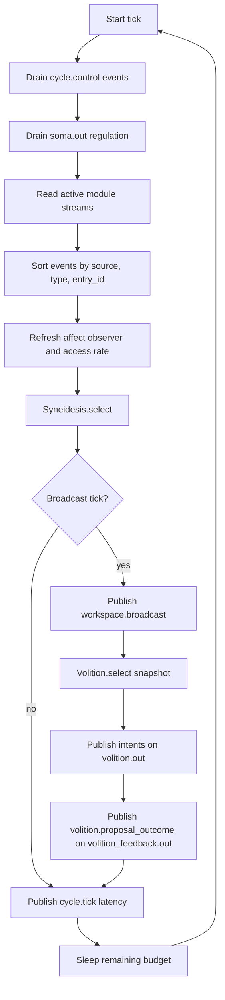
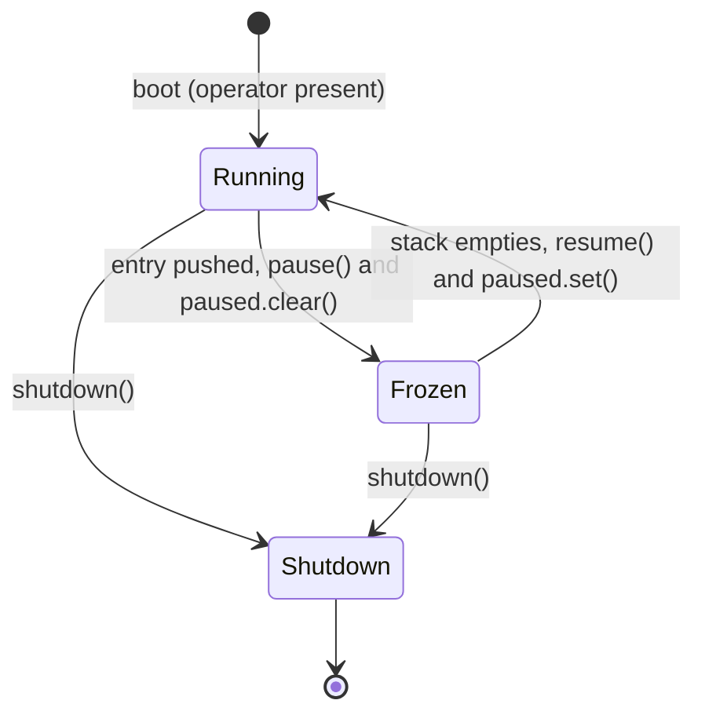

# The cognitive cycle

The cognitive cycle is KAINE's continuous async loop. It paces the system, reads the events the active modules publish, has the global workspace score them on every processing tick, publishes a broadcast on each broadcast tick, and issues intents. This page is for operators tuning timing, freezing, or rate control, and for contributors working on the cycle engine.

For the selection algorithm, see [The global workspace](./global-workspace.md). For sleep and maintenance, see [Sleep and maintenance](../10-sleep/README.md). For wider system architecture, see [Architecture](../02-architecture/README.md). For cycle and host settings, see [Core, cycle and host configuration](../appendix-a-configuration/core.md).

## How a boot runs

The cycle entrypoint in `kaine/cycle/__main__.py` boots by running the phases in `_BOOT_PHASES` in order: `stage`, `preconditions`, `run_identity`, `gates`, `bus`, `womb_hold`, `registry`, `maturation_gate`, `workspace`, `volition`, `cycle`, `supervision`, `runtime_state`, `sidecar`, `ignition_log`, `preview`, `remote_bridge`, `signals`, `spot`, `safety_net`, `launch`, `birth`, `womb_watch`, `caretaker`, `gestation`, `watchers`.

Every phase reads and writes one shared `BootContext`, a slotted dataclass in `kaine/cycle/boot_context.py`. Its repr shows no field, because it holds the Praxis intent secret.

A phase returns `None` to continue, or an exit code to refuse the boot. The exit codes are documented with first boot; see [First boot](../04-getting-started/first-boot.md).

After the last phase, the run loop supervises the cycle until stopped, and shutdown always runs. The process exits `70` when Spot escalated.

When a phase raises, the entrypoint releases what the half-built boot holds. It cancels the boot tasks already started, stops the welfare producer and closes the bus, then re-raises. It deliberately does not shut the modules down. A module's shutdown persists its state, Phantasia's world-model weights for example, and a half-built boot must not write that state over a good saved copy.

## Rates and timing

The cycle has two configurable rates.

| Parameter | Default | Config key |
|---|---|---|
| Processing rate | 10.0 Hz | `[cycle].processing_rate_hz` |
| Resting access rate | 3.333 Hz | `[cycle].experiential_rate_hz` |

The processing rate is how often the tick loop fires: 10 Hz by default (a tick every 100 ms), within the alpha range associated with perceptual sampling. Every active module stream is read and every candidate is scored on every processing tick. The access rate is how often a tick is a broadcast tick, on which the scored coalition is published to `workspace.broadcast`. The code calls a broadcast tick "experiential" (`is_experiential`, `experiential_rate_hz`). At rest the access rate is one broadcast every third processing tick, about 3.3 Hz, so several samples of each sense inform one broadcast. That resting rate is a modeling choice: attention samples the environment rhythmically at a few cycles per second, and the attentional blink (access to one item impairs access to a second for roughly 200 to 500 ms) bounds the rate of access only loosely, because it constrains the interval between accessed items and not between broadcast ticks. The reference development host runs the tick loop with about 17 Hz of headroom.

The cycle decides broadcast ticks with a fractional accumulator (`_experience_acc`): each tick adds `access rate / processing rate`; when the sum reaches 1, the tick is a broadcast tick and 1 is subtracted, keeping the fractional carry. The long-run ratio stays exact when the two rates do not divide evenly, and at most one broadcast happens per tick.

`CognitiveCycle.__init__` falls back to an access rate equal to the processing rate only when no value is supplied. The composition root at `kaine/cycle/__main__.py` and `config/kaine.toml` both default `experiential_rate_hz` to 3.333 Hz. Setting the two rates equal gives one broadcast per tick, and a lower `experiential_rate_hz` makes broadcasts sparser.

The config and `cycle.set_rates` accept any positive value. Only [Soma](../09-modules/soma.md)'s `reduce_rate` advisory clamps the processing rate, to between 0.5 and 20.0 Hz.

### Adaptive access rate

`kaine/cycle/access_rate.py`

`experiential_rate_hz` is the resting rate. With `[cycle.access_rate].enabled`, the shipped default, the cycle recomputes the access rate for each tick from an access drive between 0 and 1.

- **Tonic** drive: [Thymos](../09-modules/thymos.md) arousal above its baseline, scaled to the range 0 to 1. This follows the exploratory, high-tonic mode of the adaptive-gain account of the locus coeruleus.
- **Phasic** drive: the highest intensity among the tick's categorical alerts (events whose payload carries `alert: true`: a predictive processor's report that meets its alert criterion, or an event another module publishes at its alert level, such as a Thymos drive crossing, a Soma fatigue or regulation event, or a failed sleep), above `salience_floor` (0.5) and scaled to the range 0 to 1, held as a peak that decays with time constant `phasic_decay_s` (1 entity second). Graded reports without an alert do not count, so with no alert and arousal at baseline the rate stays at its resting value. Events from `cycle` and `syneidesis` never count. Raising the rate after an alert is a design choice modeled on the phasic locus coeruleus response; the affect-gain ablation is planned to test the opposite direction too.

The drive is the larger of the two, and the tick's access rate is `resting + (processing − resting) × drive`: the resting rate when calm, one broadcast per processing tick at full drive. The drive is computed before the tick's broadcast decision, so an alert can make its own tick a broadcast tick. When the resting rate is below the processing rate, the adaptive rate stays between them; when it is not, the rate equals the resting rate. The operator's rate control and fork timing profiles set the resting rate.

Every `cycle.tick` event carries the tick's effective `experiential_rate_hz` and `access_drive`, and `runtime.json` carries `experiential_rate_effective_hz` and `access_drive` next to the resting rate. Only the access rate adapts; the processing rate stays at its configured value. `enabled = false` gives the fixed resting rate.

### Time dilation

`processing_rate_hz` and `experiential_rate_hz` are rates in entity time, the time on the entity's clock, which runs at a configurable multiple of wall-clock time. The `[cycle].time_scale` key (default `1.0`) sets that multiple:

| `time_scale` | Meaning |
|---|---|
| `0` | The entity clock stops. This setting does not pause the cycle; freezing is done through the freeze file (`state/cycle/control.json`). Setting `time_scale = 0` with `auto_time_scale = true` is a configuration error and refuses boot. |
| `1.0` | Real-time, the shipped default. Behavior is byte-identical to no clock injection. |
| `< 1.0` | Entity time runs slower than wall-clock time. |
| `> 1.0` | Entity time runs faster. The cycle attempts the faster real tick rate and records any shortfall as slip. |

`EntityClock` (`kaine/entity_clock.py`) is the single shared entity clock (the code also calls it the subjective clock). Every module that times a cognitive process derives its "now" and durations from one injected `EntityClock` instance, so one `time_scale` setting changes the rate of the whole system together. `EntityClock.wall()` is the real monotonic clock, used for slip and health measurement. `EntityClock.now()` is entity time (`origin + wall_elapsed * scale`). `EntityClock.period(hz)` converts a rate in entity time into the real seconds-per-tick budget the cycle paces against: `1 / (hz * scale)`. That is what `CognitiveCycle.tick()` uses to compute `target_ms` each tick.

Infrastructure timers that must track wall-clock time whatever the time scale, such as the Spot watchdog, preservation monitor, and network timeouts, do not use this clock.

`CognitiveCycle.pacing_stats` is the pacing report exposed through the `pacing_stats` property and shown in Nexus. It uses a rolling 32-tick window of real per-tick wall time against the target budget. Among its fields:

- `target_rate_hz` = `processing_rate_hz * time_scale`
- `achieved_rate_hz`, derived from the mean effective tick period, `max(wall, target)`
- `mean_slip_ms` and `max_slip_ms`
- `overrunning`, true when the achieved rate falls more than 1% below target

It also carries `mean_tick_ms`, `mean_target_ms`, `overrun_ticks`, `window_ticks`, `time_scale`, `time_scale_changes` and `auto_time_scale`, so a `time_scale > 1` that the host cannot hold shows up as overrun.

### Automatic time dilation

`[cycle].auto_time_scale` (default `false`) turns on automatic time-scale adjustment. The cycle measures the busy fraction of each tick as an exponential moving average over `auto_time_scale_window_s` of wall time. If utilization stays above `auto_time_scale_high` for `auto_time_scale_dwell_s`, `time_scale` drops in one step to bring utilization toward `auto_time_scale_target`. If it stays below `auto_time_scale_low` for three consecutive dwells, `time_scale` rises by at most ×1.25 per step. The controller never exceeds the configured `time_scale` ceiling, never falls below `auto_time_scale_floor`, waits at least one dwell between changes, and is disabled in deterministic mode. An invalid threshold combination or `time_scale = 0` with auto enabled refuses boot with a configuration error.

Every change publishes a `cycle.time_scale` event with `from`, `to`, `reason` (`overload` or `headroom`), `utilization`, and `window_s`. Each `cycle.tick` payload and each ignition-log record carries `time_scale`. The run manifest records the timing settings under `timing`. The `pacing` block of `runtime.json` shows `time_scale`, `auto_time_scale`, and `time_scale_changes`.

Soma's `reduce_rate` regulation still lowers the processing rate when it senses overload. That lowers utilization, and automatic dilation may then raise the scale back toward the ceiling.

## Tick sequence



### Drain control events

The run loop drains these two streams before each tick. `consume_control_events()` reads up to 32 entries from `cycle.control` using a persistent cursor. Each `cycle.set_rates` event applies updated `processing_rate_hz` and/or `experiential_rate_hz`. Both must be positive. On success the cycle publishes `cycle.rates` to `cycle.out`. Invalid payloads are logged and skipped without disrupting the loop.

### Drain soma regulation

`consume_soma_regulation()` reads up to 32 `soma.regulation` events from `soma.out`.

| Action | Effect |
|---|---|
| `reduce_rate` | Multiply `processing_rate` by 0.8, clamped to [0.5, 20.0] Hz |
| `shed_module` | Call `registry.request_shed_low_priority()` if available |
| `request_maintenance` | Latch `cycle.maintenance_requested = True` as an advisory signal. Hypnos observes the `request_maintenance` regulation event directly on `soma.out`; nothing else reads this flag to drive behaviour. |

Unknown action values are silently ignored. All advisories are advisory only: the cycle acts within safe bounds, logs, and continues.

### Read module streams

The main read path is one round-trip `read_entries_block` for all active module streams returned by `registry.active_streams()`. A per-stream `asyncio.gather` is used only as a fallback. Each stream is read with `block_ms=0` (non-blocking) and `count=100` (the `read_count` constructor argument; there is no config key). The per-stream cursor advances to the last entry ID scanned, decodable or not, so a batch of undecodable entries moves the cursor past itself instead of stalling the stream. Read failures increment a per-stream error counter but do not stop the loop.

On a production boot the entrypoint constructs the cycle with `seed_cursors_to_tail=true`. Every stream cursor is seeded to the stream tail before the first read, so an in-run process restart against a live Redis replays nothing that predates the boot, including stale soma rate advisories. Library or test construction reads from the beginning.

### Selection

`syneidesis.select(events, context)` receives the event list plus a context dict containing `tick_index`, `is_experiential`, and (when the oscillatory layer is enabled) `phases`, a dict mapping module names to their current oscillator phase. Before selection, the events are sorted by `(source, type, entry_id)`, the affect observer refreshes, and the access rate updates. The function returns a `WorkspaceSnapshot`. Selection runs on every processing tick; on a tick that is not a broadcast tick the result is discarded. See [The global workspace](./global-workspace.md) for the scoring and the access rule.

### Broadcast

On a broadcast tick, if selection succeeded, the cycle calls `bus.publish_workspace(payload)` on `workspace.broadcast`. It publishes accessed, inhibited and empty snapshots alike. The payload mirrors the `WorkspaceSnapshot`: tick index, the `inhibited` flag, `is_experiential`, `time_scale`, the score of every candidate of the tick, the selected events (with `entry_id`, `source`, `type`, `salience`, `payload`, `timestamp` and `causal_parent`), and metadata holding `access_threshold` and, when the oscillatory layer is on, `coherence`.

Only `source="syneidesis"` may call `publish_workspace`. Any other source raises `ReservedStreamError`.

### Volition and proposal outcomes

After a successful broadcast, inhibited or not, the cycle calls `Volition.select(snapshot)`. Volition checks the inhibition flag first and returns no intents for an inhibited broadcast. It is never called on a tick that is not a broadcast tick.

Each returned intent is published to `volition.out` with event type `intent.speak`, `intent.think`, `intent.act`, or `intent.rest`. The cycle then publishes any `proposal_outcome` values, including those for inhibited broadcasts, returned by the policy to `volition_feedback.out` as `volition.proposal_outcome` events.

Proposal outcomes are generated only when the action-selection policy includes the `NousProposalSource` wrapper, which requires [Nous](../09-modules/nous.md) to be enabled. With no profile selected, the loader applies the `thesis_test` profile, and that profile has `nous = false`, so no proposal outcomes are produced by default.

The cycle never invokes effectors directly. [Lingua](../09-modules/lingua.md), [Praxis](../09-modules/praxis.md), [Perception](../09-modules/perception.md), [Mundus](../09-modules/mundus.md), and [Hypnos](../09-modules/hypnos.md) subscribe to `volition.out` and realize intents independently. Hypnos accepts `intent.rest` as a request to rest.

### Latency telemetry

Every tick publishes a `cycle.tick` event to `cycle.out`:

| Field | Type | Meaning |
|---|---|---|
| `tick_index` | int | tick counter, 0-based |
| `wall_duration_ms` | float | actual tick wall time |
| `target_duration_ms` | float | `1000 / (processing_rate_hz * time_scale)` |
| `slip_ms` | float | `max(0, wall - target)` |
| `is_experiential` | bool | whether the tick was a broadcast tick (a broadcast was attempted) |
| `error` | bool | did Syneidesis raise? |
| `processing_rate_hz` | float | current processing rate |
| `experiential_rate_hz` | float | current effective access rate |
| `access_drive` | float | current access drive in [0, 1] |
| `time_scale` | float | current time scale |

Salience is 0.05 for clean ticks and 0.5 for error ticks. [Soma](../09-modules/soma.md) subscribes to `cycle.out` to track latency as part of interoceptive prediction error.

## Operator freeze

`kaine/cycle/control_state.py`

The operator can freeze the cycle by writing `state/cycle/control.json`:

```json
{
  "frozen": true,
  "frozen_at": "2026-06-06T12:00:00+00:00",
  "reason": "infrastructure maintenance",
  "source": "operator",
  "stack": [
    {"source": "operator", "reason": "infrastructure maintenance",
     "frozen_at": "2026-06-06T12:00:00+00:00"}
  ]
}
```

The freeze is a stack of `{source, reason, frozen_at}` entries. The `stack` is authoritative; the top-level `frozen`, `frozen_at`, `reason`, and `source` fields are a legacy view mirroring the top of the stack. Older single-slot files are promoted to a one-entry stack on read. Sources stack independently: a Spot recovery pops only Spot's own entry, so a welfare pause underneath survives supervisor recovery and can be lifted only by an operator override that names it or an explicit welfare stand-down; the operator's resume does not lift it. The cycle resumes only when the stack is empty.

A freeze-watch task in the cycle entrypoint polls this file and calls `cycle.pause()` and `cycle.resume()` to match the commanded state. `pause()` clears an `asyncio.Event`; `run_forever` blocks on `await self._paused.wait()`, so no ticks fire while the event is clear. On freeze, the watch snapshots the desired perception flags and suspends them for non-gestation freezes; a gestation-only freeze keeps perception on. On resume it writes the snapshot back, so a freeze/resume cycle never leaves the entity deaf or blind.

A freeze stops the entity clock while operators repair infrastructure. It is not a shutdown. The file contains only operational fields: freeze entries with ISO timestamps and optional reason strings. It never contains sensory content.

The Nexus `POST /diagnostics/cycle/freeze` endpoint writes this file: freezing pushes an `operator` entry and resuming removes `operator` entries only (`stand_down(source="operator")`). `POST /diagnostics/cycle/override` lifts named `welfare`, `gestation` or `programme_end` entries (`override()`). The `unfreeze` function, used only by the cycle's own clean boot, replaces the file with a `CycleControl()` whose fields are `frozen:false`, `frozen_at:null`, `reason:null`, `source:"operator"`, and `stack:[]`.



## Rate control API

Bus-driven rate changes use the `cycle.control` stream. Publish a `cycle.set_rates` event:

```python
Event(
    source="operator",
    type="cycle.set_rates",
    payload={"processing_rate_hz": 5.0, "experiential_rate_hz": 1.0},
    salience=0.5,
    timestamp=datetime.now(timezone.utc),
)
```

The cycle acknowledges by publishing `cycle.rates` to `cycle.out` with the new values. Rates persist for the process lifetime; they are not written to `config/kaine.toml`.

## Hooks

`CycleHooks` supports callbacks for three lifecycle events:

| Event | Fired by | Typical use |
|---|---|---|
| `pause` | `cycle.pause()` | Module suspension |
| `resume` | `cycle.resume()` | Module reactivation |
| `shutdown` | `cycle.shutdown()` | Graceful resource release |

Hooks are awaited in registration order. A hook that raises is logged and skipped; later hooks always run.

## Phase collection

When `[oscillator].enabled = true` in `config/kaine.toml` (see [Core, cycle and host configuration](../appendix-a-configuration/core.md)), the cycle sets `collect_phases = True`. Before passing events to Syneidesis each tick, `_collect_module_phases()` calls `module.phase()` on every module that exposes it via `registry.all_modules()`. The resulting dict is passed in `context['phases']` to `Syneidesis.select()`. Modules without an oscillator return the neutral phase.

When the layer is disabled, `_collect_module_phases()` is never called and `context['phases']` is absent, giving zero per-tick overhead.

## Configuration reference

All knobs live in `config/kaine.toml` (see [Core, cycle and host configuration](../appendix-a-configuration/core.md)):

```toml
[cycle]
processing_rate_hz = 10.0
experiential_rate_hz = 3.333
time_scale = 1.0
auto_time_scale = false
auto_time_scale_window_s = 30.0
auto_time_scale_target = 0.85
auto_time_scale_high = 0.95
auto_time_scale_low = 0.6
auto_time_scale_dwell_s = 10.0
auto_time_scale_floor = 0.1

[cycle.access_rate]
enabled = true
salience_floor = 0.5
phasic_decay_s = 1.0
# baseline_arousal is accepted; when absent it defaults to Thymos's baseline_arousal.

[oscillator]
enabled = false
population_size = 16
plv_window = 10
coherence_floor = 0.8
coherence_ceiling = 1.25
```

The `[oscillator]` section also accepts `beta`, `threshold`, and `base_drive`. Their defaults are set in `config/kaine.toml`.

Dynamic rate changes via the `cycle.control` stream override the `[cycle]` values for the current process. Only Soma's `reduce_rate` advisory clamps the processing rate to [0.5, 20.0] Hz.

## Key files

| File | Role |
|---|---|
| `kaine/cycle/engine.py` | `CognitiveCycle`: tick loop, rate control, Soma consumer |
| `kaine/cycle/control_state.py` | Freeze state serialization: `CycleControl`, `freeze()`, `unfreeze()` |
| `kaine/cycle/__main__.py` | Entrypoint: assembles modules, starts freeze-watch task |
| `kaine/cycle/boot_context.py` | Shared slotted dataclass for boot-phase state, `BootContext` |
| `kaine/cycle/types.py` | `TickResult`, `WorkspaceSnapshot` dataclasses |
| `kaine/cycle/protocols.py` | `CycleHook`, `ModuleRegistryProtocol`, `SyneidesisProtocol` |
| `kaine/entity_clock.py` | Shared entity clock |
| `state/cycle/control.json` | Runtime freeze state (operator-written) |
