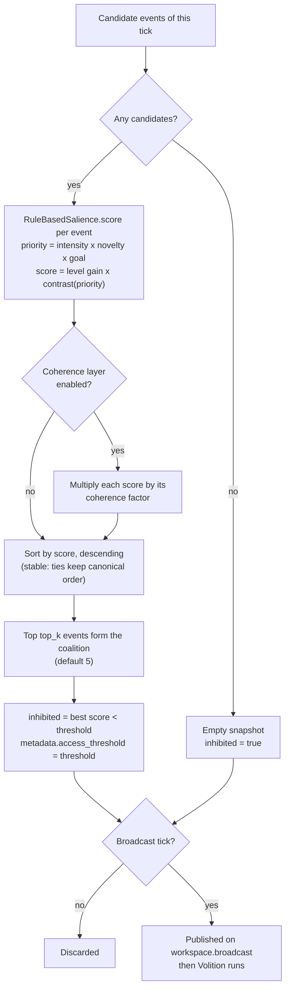

# The global workspace

Syneidesis is KAINE's global workspace. On every processing tick it scores the candidate events the active modules have published, ranks them, and forms a coalition. On a broadcast tick the cycle publishes that coalition, and the members whose scores reach the access threshold are the accessed content: they can drive report and action, and the perceptual and interoceptive processors adopt a summary of them as the context for their next predictions. This page documents the scoring formula and the access rule exactly as the code computes them, the broadcast payload, the prediction context built from it, the optional coherence layer, and how Volition turns an accessed broadcast into intents. Read it if you are tuning selection parameters, wiring a new module, or tracing why an event did or did not lead to speech.

Related: [The cognitive cycle](README.md) · [Architecture](../02-architecture/README.md) · [Configuration reference](../appendix-a-configuration/README.md)

## Selection pipeline

Every processing tick the cycle reads the events published since its previous read of each active module stream, sorts them by `(source, type, entry_id)` so that a seeded run reproduces, refreshes the affect snapshot the scorer reads, updates the access rate, and passes the list to `Syneidesis.select`. Selection runs on every processing tick. Only on a broadcast tick (the code's `is_experiential`) is the result published; on other ticks the candidates are scored and then discarded.



## Scoring

`kaine/workspace/salience.py` · `RuleBasedSalience.score`

Each candidate event `e` receives a priority and a score:

```
priority(e) = clamp(I(e) × N(e) × G(e))
score(e)    = clamp(T × C_g(priority(e)))
```

`clamp` maps to `[0, 1]`, and each of `I`, `N`, `G` and `T` is clamped to `[0, 1]` before the products are formed. The factors are:

| Symbol | Code | Value |
|---|---|---|
| `I(e)` | `event.salience` | The intensity the publishing module assigned when it published the event. The bus rejects values outside `[0, 1]`. |
| `N(e)` | `NoveltyTracker.observe` | `max(0, 1 − r / W)`, where `r` counts earlier occurrences of the event's fingerprint among the last `W` scored candidates and `W` is `[syneidesis].novelty_window` (32). The fingerprint is a hash of the source, the type and the complete payload, so only an exact repeat is discounted. Every scored candidate enters the window, on broadcast ticks and on other ticks alike. |
| `G(e)` | `GoalScorer.relevance` | 1 with the shipped static goal factor. See [The goal factor](#the-goal-factor). |
| `T` | `ThymosModulator.modulate` | The level gain, `0.2 + 0.8 × a`, where `a` is the current Thymos arousal. It is the same for every candidate of a tick. |
| `g` | `ThymosModulator.contrast_gain` | The contrast gain, `arousal_contrast_gain × clamp((a − a0) / (1 − a0))`, with `a0` the baseline arousal (`[thymos].baseline_arousal`, 0.3) and `[syneidesis].arousal_contrast_gain` 8.0. It is 0 at or below baseline arousal. |

`C_g` is the logistic rescaled so that it maps 0 to 0 and 1 to 1:

```
C_g(p) = (σ(g × (p − 0.5)) − σ(−g/2)) / (σ(g/2) − σ(−g/2))     for g > 0
C_0(p) = p
```

where `σ` is the logistic function. The code treats any gain at or below `1e-9` as 0. Above baseline arousal, priorities above one half are raised and priorities below one half are lowered.

If the scorer raises for an event, that event gets score 0 and a warning is logged.

With `[syneidesis].salience_thymos_factor = "static"`, the Thymos factor is the constant 1 with contrast gain 0, so the score equals the priority. That setting is a negative control and logs a degraded-mode warning.

### What the formula does and does not do

The workspace applies no weight per source. Precision is local to each predictive processor: Topos, Audition, Soma and Chronos each divide their current prediction error by the mean of their own recent errors and report a graded intensity from that ratio (`kaine/modules/intensity.py`):

```
I = alert level                                              on a categorical alert
I = baseline + (alert level − baseline) × min(1, ratio / 2)  otherwise
```

So within a tick the processors' candidates compete on surprise measured against each channel's own history. A module's baseline and alert levels set the range over which its surprise is graded, which makes them per-source weights in effect. Thymos, Hypnos and Lingua publish at fixed levels. Every predictive processor's report payload carries a boolean `alert`.

Arousal is the global gain. Because `T` is common to every candidate and `C_g` is strictly increasing, arousal never changes the order of the candidates within a tick. It moves the scores relative to the access threshold and the report bars, so it decides whether a broadcast is accessed and which of its members are, and it widens the gap between strong and weak candidates' scores. Arousal also sizes the sensory apertures (the Topos fovea and the Audition attended window), which changes what the processors report next.

With the shipped values, resting arousal (0.3) gives `T = 0.44` and `g = 0`, so a candidate reaches the threshold of 0.35 only when its priority is at least about 0.80. A priority below about 0.43 never reaches the threshold at any arousal. The intensity levels, the threshold and the report bars are provisional and are to be calibrated together on the live system before the planned runs; that calibration has not been done yet.

### The goal factor

`[syneidesis].salience_goal_factor` selects the goal factor. The shipped value, `"static"`, holds it at 1, and the boot logs an informational note. The alternative, `"drive_relevance"`, is built and off by default because it changes what reaches access. It reads the dominant Thymos drive `d` with value `v` and returns

```
G(e) = 1 − v × (1 − relevance(e)) × 0.5
```

where `relevance(e)` is 1 when the event's source relieves `d` and 0 otherwise, and `G = 1` when no drive is positive.

Each module class declares the drives its events relieve in `relieves_drives`. At boot `kaine/boot/wiring.py` builds the drive-to-source table from the registered modules' declarations, adds Volition (restlessness), and injects the table into the scorer, so the workspace never imports a module. A tag that is not one of the four drives (`curiosity`, `boredom`, `social_drive`, `restlessness`) fails the boot.

Both live factors read affect and drives through an `AffectStateProvider` (`kaine/cycle/affect_state.py`), which the cycle refreshes each tick from the `thymos.state` events it already collects. Scoring is a function of the event and that snapshot, with no wall-clock reads and no random numbers.

## Coalition and access

`kaine/workspace/syneidesis.py` · `Syneidesis._compose`

Syneidesis sorts the candidates by score in decreasing order. The sort is stable, so equal scores keep the canonical `(source, type, entry_id)` order. The first `[syneidesis].top_k` candidates (default 5) form the coalition. Then:

```
inhibited = best score < θ
metadata["access_threshold"] = θ
```

where `θ` is `[syneidesis].publication_threshold` (default 0.35), the access threshold. A coalition member is accessed when its own score reaches `θ` (a score equal to `θ` counts). A broadcast is accessed when at least one member is, which is the same as its best score reaching `θ`, so `inhibited` is false exactly when the broadcast is accessed. A member of an accessed broadcast whose score is below `θ` is broadcast but not accessed. With no candidates, Syneidesis returns an empty snapshot marked inhibited, with no metadata.

Every broadcast carries the threshold in its metadata so that each module can tell accessed members from the rest of the coalition. When the coherence layer is on, the threshold applies to the coherence-adjusted scores.

`syneidesis.set_publication_threshold(t)` changes the threshold at runtime; tests use it.

## The broadcast

On a broadcast tick the cycle publishes the snapshot to `workspace.broadcast` whatever its state: accessed, inhibited, or empty. The cycle then calls Volition. The payload has these fields:

| Field | Content |
|---|---|
| `tick_index` | The processing tick |
| `inhibited` | True when no member reached the threshold |
| `is_experiential` | True on a broadcast tick |
| `time_scale` | The entity clock's current multiple of wall-clock time |
| `salience_scores` | The score of every candidate of the tick, keyed by entry id |
| `metadata` | `access_threshold`, and `coherence` when the coherence layer is on |
| `selected` | The coalition members in rank order, each with `entry_id`, `source`, `type`, `salience` (the reported intensity), `payload`, `timestamp` and `causal_parent` |

Only `source="syneidesis"` may publish to `workspace.broadcast`; any other source raises `ReservedStreamError`. Modules read the stream with `AsyncBus.subscribe_workspace_block`, advancing their own cursor.

How modules use the broadcast depends on its state:

| Reader | Accessed broadcast | Inhibited broadcast |
|---|---|---|
| Topos, Audition, Soma | Adopt its accessed members as prediction context | Ignore it; the previous context stays |
| Chronos | Takes it as the input it predicts | Takes it as input too |
| Thymos | Appraises it | Appraises it |
| Volition | Applies the report rule | Derives no intent |

Because Chronos and Thymos read inhibited broadcasts, content that did not gain access can still influence later processing. Hypnos does not read the broadcast.

## The broadcast as prediction context

`kaine/modules/context.py` · `BroadcastContext`

Topos, Audition and Soma each hold a `BroadcastContext`. When a broadcast arrives, `observe` adopts it only when it is not inhibited and at least one coalition member's score in `salience_scores` reaches `metadata["access_threshold"]`. The adopted members are exactly those accessed members, each weighted by its reported intensity (`salience`) rather than its score, so the context does not depend on the arousal gain. The context is held until the next adoption.

The context vector is a 24-component featurization of the adopted members plus the context's age:

| Index | Component |
|---|---|
| 0 | `log(1 + n)` for `n` members, capped at 8 |
| 1 to 3 | Mean, maximum and sample standard deviation of the members' intensities (the standard deviation is 0 for fewer than two members) |
| 4 to 11 | Intensity mass per source, in the order Soma, Chronos, Topos, Nous, Mnemos, Thymos, Lingua, Praxis; any other source except Audition (Hypnos, for example) adds to the Praxis component |
| 12 to 19 | Intensity mass in eight buckets chosen by a hash of `(source, type)`, an indicator of event types |
| 20 | `log(1 + age)`, the time in seconds since the module adopted the broadcast |
| 21 | Inhibition flag, always 0 for a context |
| 22 | Broadcast indicator, always 1 |
| 23 | Intensity mass of Audition |

The context records which modules' reports gained access, which event types, how strongly and how recently. It carries no payloads. Topos and Soma measure the age on the entity clock; Audition has no entity clock and uses the monotonic wall clock, which equals entity time at the default time scale.

The context enters each processor's forward model as an extra input alongside the module's own recent inputs: the Topos forward model, both Audition forward models (the acoustic path and the tone path), and Soma's readout. The weights that read the context are learned online with the rest of the model, so each processor learns how much the shared context helps it predict its own input. Before the first adoption the context input is all zeros. Adaptation pauses during sleep, as it does for the rest of each forward model. Chronos does not hold a context; the broadcast is its input.

### Broadcast information gain per report

Topos, Audition's acoustic path and Soma also form a second prediction with a null context and publish, on every report, `context_gain` and `context_age_s`:

```
context_gain = (null error − error) / running mean error
```

The null context keeps the module's own share of the context and replaces the other sources' share with its mean over the contexts the module has adopted so far in the run. Components 0 to 3 are replaced by their running means, the additive components (4 to 19 and 23) by the kept sources' current share plus the mean of the other sources' share, and components 20 to 22 are kept. The kept sources are `topos` for Topos, `audition` for Audition, and `soma` and `lingua` for Soma, because the language organ's load on the host would otherwise let its share predict Soma's input. The null prediction never trains the model. `context_gain` is `None` until a prediction formed with an adopted context has been scored.

This per-report gain is the measurement the planned workspace-mediation test is built on. The test's matched-selection and pooled arms, and the positive control that checks the measure detects injected information, are not built yet. See [For researchers](../14-for-researchers.md#the-planned-test).

## Oscillatory coherence multiplier

`kaine/workspace/coherence.py`

The coherence layer is controlled by `[oscillator].enabled` and is off by default. When it is off, Syneidesis has no coherence scorer, selection skips the coherence step entirely, and no `metadata["coherence"]` is written.

When it is on, the cycle passes `context["phases"]` to Syneidesis each tick, a dict mapping module names to oscillator phase in radians, and the scorer appends each module's phase to a sliding window of `[oscillator].plv_window` samples (default 10, minimum 10).

### Phase-locking value

The PLV between two phase series of length `n` is

```
PLV(a, b) = | mean(exp(i × (a_k − b_k))) |
```

which lies in `[0, 1]`: 1 means perfectly phase-locked and values near 0 mean independent.

Only fresh samples count. A module's oscillator advances only when that module publishes, so between its events its phase is frozen. A sample is fresh when it is finite and differs from that module's previous sample, so a module's first sample is never fresh. A pair's PLV is computed over the window positions where both samples are fresh. A pair with fewer than three jointly fresh samples, and a source with no partner, takes the neutral PLV, the value that maps to a factor of exactly 1.

### Coherence factor

PLV maps linearly onto `[coherence_floor, coherence_ceiling]`:

```
factor = floor + (ceiling − floor) × PLV
```

The defaults are `coherence_floor = 0.8` and `coherence_ceiling = 1.25`, so the neutral PLV is `(1 − floor) / (ceiling − floor)`, about 0.444. For each candidate, `factor_for_source(source, cohort)` averages the PLV of the candidate's source with every other source present among the tick's candidates, and the candidate's score is multiplied by that factor. The product is not clipped again and can exceed 1, up to the ceiling. `metadata["coherence"]` holds the mean pairwise PLV over the sources of the tick's candidates, and the `CoherenceObserver` sidecar reads it.

### Validation controls

Two tests keep the toggle honest. With the layer disabled, an instance driven through many cycles with the same seed, events and phases as a baseline instance without a layer selects the same events in the same order, with the same scores and inhibition flag, and neither writes `metadata["coherence"]`. With the layer enabled at an extreme ceiling and floor, a phase-locked event with a lower raw score overtakes a desynchronized event with a higher one, which shows the layer is connected to selection.

## Volition and the report rule

`kaine/workspace/volition.py` · `kaine/workspace/report_policy.py`

The cycle calls `Volition.select(snapshot)` after each successful publication. Volition checks `inhibited` first and returns no intents for an inhibited broadcast. It is the only path from the workspace to an output; the cycle publishes the returned intents on `volition.out` and never calls an effector itself.

The policy is chosen by `[volition].policy` and `[volition].drive_initiative`:

| Setting | Policy |
|---|---|
| `policy = "self_initiated_report"` | `SelfInitiatedReportPolicy`, the base-thesis policy |
| no `policy`, `drive_initiative = true` (the code default) | `DriveBiasedActionSelectionPolicy` |
| no `policy`, `drive_initiative = false` | `DefaultActionSelectionPolicy` |

When Nous is enabled, the composition root wraps whichever policy was chosen in `NousProposalSource` (`kaine/workspace/nous_proposals.py`), and the cycle publishes `volition.proposal_outcome` events on `volition_feedback.out` after the intents, including for inhibited broadcasts so that the Nous critic receives feedback. The `thesis_test` profile sets the self-initiated report policy with `drive_initiative = false`, and Nous is off in that profile.

### The self-initiated report policy

`SelfInitiatedReportPolicy` derives intents from the workspace's own state and never from a user utterance. On an accessed broadcast it:

1. Clears the speak guard if the coalition contains the language organ's external speech, and the think guard if it contains its internal speech. Either guard is also cleared after 48 seconds of wall time, so a failed realization cannot mute the entity.
2. Removes the language organ's own events (source `lingua`) from the coalition. If nothing is left, there is no intent. Otherwise the report signal is the highest score among the remaining members, and the signature is the `(source, type)` of that member.
3. Emits a `speak` intent when the signal reaches `report_threshold` (0.6), no speak is in flight, `speak_refractory_s` (8 entity seconds) has passed since the last speak, and the signature does not match the last spoken signature. A remembered signature stops blocking once it is older than `sig_expiry_s` (300 entity seconds in `thesis_test`; it never expires when unset).
4. Otherwise emits a `think` intent when the signal reaches `think_threshold` (0.45), no think is in flight, and `think_refractory_s` (3 entity seconds) has passed. The think path has no signature check.

At most one intent is emitted per broadcast. Both bars should sit above the access threshold, and the policy requires `0 ≤ think_threshold ≤ report_threshold ≤ 1`. An optional `interrupt_threshold`, strictly above `report_threshold`, lets a coalition with a different signature preempt a `speak` that is still in flight; it is unset by default.

The bars are a heuristic stand-in for the report-or-act decision of the predictive global neuronal workspace, which the action layer does not compute.

### The other policies

`DefaultActionSelectionPolicy` answers a user utterance: it emits one `speak` intent when the coalition holds an `audition.transcription` event with non-empty text. It never forms a `speak` about the entity's own external speech, and it keeps a one-in-flight guard that clears when the entity's own `external_speech` appears in a later coalition or after 48 seconds of wall time.

`DriveBiasedActionSelectionPolicy` extends it: a `thymos.drive` crossing in an accessed coalition becomes an intent. `social_drive` becomes `speak`, and a present user utterance always outranks it; `curiosity`, `boredom` and `restlessness` become `think`. `speak` and `think` have independent guards.

## Act intents and provenance

`kaine/security/intent_signing.py` · `kaine/modules/praxis/module.py`

All modules of a single-process instance share one bus credential, so the bus alone cannot prove which module published an event. For `act` intents, the only kind that can reach an effector, the composition root generates a per-boot secret (`generate_intent_secret()`, 32 random bytes held in process memory, never persisted or logged) and gives it to Volition and Praxis.

Volition attaches a provenance envelope to every `act` intent: `run_id`, a per-signer monotonic `seq`, and `sig`, an HMAC-SHA256 over a canonical serialization of `(kind, effector, params, run_id, seq)`. `speak` and `think` intents carry no envelope. Praxis verifies the signature with `verify_intent_signature` before it runs any effector and drops a forged, unsigned or replayed intent, recording it as `provenance_rejected`. The operator's effector whitelist applies after that check. Praxis is held in the base-thesis form. See [Praxis](../09-modules/praxis.md).

## Streams

| Stream | Direction | Events |
|---|---|---|
| `<module>.out` | module to bus | All module outputs |
| `workspace.broadcast` | cycle (as Syneidesis) to bus | `snapshot` JSON field, with no Event wrapper |
| `volition.out` | cycle to bus | `intent.speak`, `intent.think`, `intent.act`, `intent.rest` |
| `volition_feedback.out` | cycle to bus | `volition.proposal_outcome` |
| `cycle.control` | operator to bus | `cycle.set_rates` |
| `cycle.out` | cycle to bus | `cycle.tick`, `cycle.rates`, `cycle.time_scale` |

## Configuration reference

Selection keys live in `config/kaine.toml`; the `[volition]` values below are set by `config/profiles/thesis_test.toml` or are code defaults. See the [configuration reference](../appendix-a-configuration/README.md) for the full files.

| Key | Type | Default | Meaning |
|---|---|---|---|
| `[syneidesis].top_k` | int | 5 | Coalition capacity |
| `[syneidesis].publication_threshold` | float | 0.35 | The access threshold `θ` |
| `[syneidesis].novelty_window` | int | 32 | Novelty window `W`, in scored candidates |
| `[syneidesis].salience_thymos_factor` | string | `"state_modulator"` | Arousal level and contrast gain; `"static"` is the negative control |
| `[syneidesis].salience_goal_factor` | string | `"static"` | Goal factor held at 1; `"drive_relevance"` enables the drive-relevance scorer |
| `[syneidesis].arousal_contrast_gain` | float | 8.0 | Contrast gain at arousal 1; 0 disables the contrast |
| `[thymos].baseline_arousal` | float | 0.3 | Arousal at which the contrast gain is 0 |
| `[volition].policy` | string | unset; `"self_initiated_report"` in `thesis_test` | Action-selection policy |
| `[volition].drive_initiative` | bool | true; false in `thesis_test` | Use the drive-biased policy when no policy is named |
| `[volition].report_threshold` | float | 0.6 | Speak bar |
| `[volition].think_threshold` | float | 0.45 | Think bar |
| `[volition].interrupt_threshold` | float | unset | Optional interrupt bar, above the speak bar |
| `[volition].speak_refractory_s` | float | 8.0 | Minimum entity seconds between speak intents |
| `[volition].think_refractory_s` | float | 3.0 | Minimum entity seconds between think intents |
| `[volition].sig_expiry_s` | float | unset; 300.0 in `thesis_test` | Age at which a spoken signature stops blocking |
| `[oscillator].enabled` | bool | false | Coherence layer |
| `[oscillator].plv_window` | int | 10 | Phase window in ticks (minimum 10) |
| `[oscillator].coherence_floor` | float | 0.8 | Factor at PLV 0 |
| `[oscillator].coherence_ceiling` | float | 1.25 | Factor at PLV 1 |
| `[oscillator].population_size` | int | 16 | Spiking units per module oscillator (minimum 16) |
| `[oscillator].beta`, `threshold`, `base_drive` | float | 0.9, 1.0, 1.5 | Oscillator neuron parameters |

The level-gain floor and ceiling (0.2 and 1.0) are constructor defaults of `StateModulator` and have no config key. The access-rate keys are on [The cognitive cycle](README.md#adaptive-access-rate) page.

## Persistence

- `CoherenceScorer` phase windows live in memory only and start again from the neutral phase after a restart.
- `WorkspaceSnapshot` objects are not persisted. The `workspace.broadcast` stream holds the serialized payload and is trimmed to 100,000 entries by approximate `MAXLEN` (`[bus.per_stream_maxlen]`, applied in `kaine/bus/client.py`).
- A `BroadcastContext` is held in memory; after a restart a processor starts with no context until the next accessed broadcast.

## Key files

| File | Role |
|------|------|
| `kaine/workspace/syneidesis.py` | `Syneidesis`: scoring loop, coalition, access threshold |
| `kaine/workspace/salience.py` | `RuleBasedSalience`, `arousal_contrast` |
| `kaine/workspace/novelty.py` | `NoveltyTracker`, the event fingerprint |
| `kaine/workspace/strategies.py` | `GoalScorer` and `ThymosModulator` protocols, static factors, `DriveRelevanceGoalScorer` |
| `kaine/modules/thymos/modulator.py` | `StateModulator`, the live level and contrast gain |
| `kaine/modules/intensity.py` | `graded_intensity`, shared by the predictive processors |
| `kaine/modules/context.py` | `BroadcastContext`, the context featurization and null context |
| `kaine/workspace/coherence.py` | `CoherenceScorer`, `phase_locking_value`, `mean_pairwise_plv` |
| `kaine/workspace/volition.py` | `Volition`, `DefaultActionSelectionPolicy`, `Intent` |
| `kaine/workspace/report_policy.py` | `SelfInitiatedReportPolicy` |
| `kaine/workspace/drive_policy.py` | `DriveBiasedActionSelectionPolicy` |
| `kaine/workspace/nous_proposals.py` | `NousProposalSource`, used when Nous is enabled |
| `kaine/security/intent_signing.py` | `IntentSigner`, `generate_intent_secret`, `verify_intent_signature` |
| `kaine/cycle/types.py` | `WorkspaceSnapshot` |
| `kaine/cycle/affect_state.py` | `AffectStateProvider` |
| `kaine/boot/wiring.py` | Builds the salience factors and the drive-to-source table |
| `kaine/cycle/__main__.py` | Composition root that wires the policy, Volition and signing |
