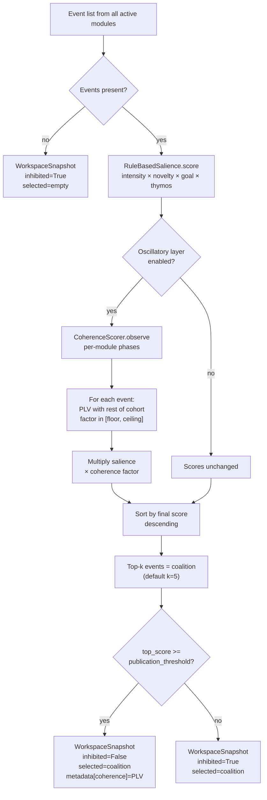
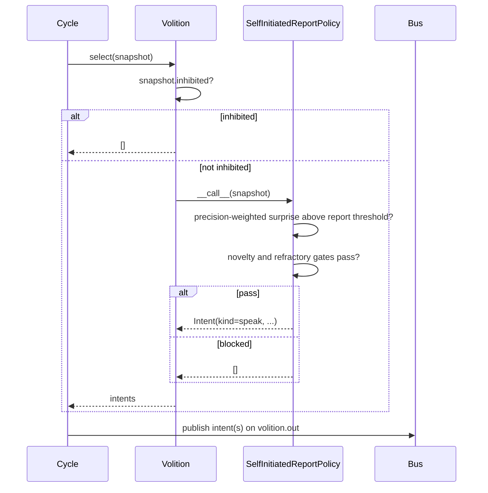

# The global workspace

The global workspace, called Syneidesis, is where each cognitive-cycle tick becomes conscious. This page covers how events are scored, how the oscillatory coherence layer modulates attention, what inhibition means, and how Volition turns a broadcast snapshot into signed intents. Read it if you are tuning attention parameters, wiring a new module, or tracing why an event did or did not reach an effector.

Related: [The cognitive cycle](README.md) · [Architecture](../02-architecture/README.md) · [Configuration reference](../appendix-a-configuration/README.md)

## Selection pipeline

Every tick the cycle collects all events from active modules, sorts them by `(source, type, entry_id)` for deterministic ordering, refreshes the affect observer, updates the access rate, and passes the list to Syneidesis. Syneidesis scores each event, selects a coalition, and returns a `WorkspaceSnapshot`.



The snapshot is either experiential (it contains selected events) or non-experiential (the coalition is empty). Only experiential snapshots are published to `workspace.broadcast`; an empty snapshot is not published. Modules receive both inhibited and non-inhibited experiential snapshots. When the snapshot is inhibited, Volition returns `[]` and produces no intents.

## Salience scoring

`kaine/workspace/salience.py`

`RuleBasedSalience` scores each event with a product of four factors in `[0, 1]`, clamped to `[0, 1]`:

```
score = clamp(intensity × novelty × goal_relevance × thymos_modulation)
```

| Factor | Source | Notes |
|--------|--------|-------|
| `intensity` | `event.salience` | The publishing module's self-assessed importance, validated at publish time. |
| `novelty` | `NoveltyTracker` | Repeated events decay toward 0; novel events score 1. Window size is set by `[syneidesis].novelty_window` (default 32). |
| `goal_relevance` | `GoalScorer` | Alignment with the current drive state. The default is the static fallback because the live `DriveRelevanceGoalScorer` is not yet validated and changes what reaches the workspace. |
| `thymos_modulation` | `ThymosModulator` | Arousal widens the attentional window; high arousal makes scores closer to `intensity × novelty`. |

The live Thymos factor is wired by default via `[syneidesis].salience_thymos_factor = "state_modulator"` (`kaine/modules/thymos/modulator.py`). The goal factor is set to `[syneidesis].salience_goal_factor = "static"` by default. Static goal is the shipped default, so it logs only an informational note. Setting `salience_thymos_factor = "static"` is a downgrade from the shipped live factor and logs a degraded-mode warning.

Each module class declares the Thymos drives its events tend to relieve as `relieves_drives: ClassVar[frozenset[str]]`. The default in `BaseModule` is empty. The drives are `curiosity`, `boredom`, `social_drive` and `restlessness`. The declarations as shipped are: Chronos `social_drive`; Vox `social_drive` and `restlessness`; Perception `curiosity` and `boredom`; Praxis `restlessness`; Phantasia `boredom`. Volition is workspace scaffolding, not a module, and relieves `restlessness`. At boot, `kaine/boot/wiring.py` builds the drive-to-source table from the registered modules' declarations and injects it into the drive-relevance goal scorer, so the workspace never imports a module. A tag that is not one of the four drives fails the boot. The scorer reads the table only when `salience_goal_factor = "drive_relevance"`; the shipped static factor ignores it.

Both live factors read the entity's current affect and drives through an `AffectStateProvider` (`kaine/cycle/affect_state.py`). The cycle refreshes this provider each tick from the `thymos.state` events it already collects, so the workspace layer never imports `kaine.modules`. Salience is a pure function of `(event, affect_state, drive_state)` with no wall-clock, no RNG, and no new bus I/O.

A low-salience event that is also not novel, such as a routine `soma.tick`, scores near zero and will not enter the coalition.

## Oscillatory coherence multiplier

`kaine/workspace/coherence.py`

The coherence layer is controlled by `[oscillator].enabled` and is **disabled by default**. When disabled the multiplier is exactly 1.0 and salience alone decides selection.

When enabled, Syneidesis receives `context['phases']` each tick — a dict mapping module names to oscillator phase in radians — and calls `coherence.observe(phases)`. Each module's phase is appended to a sliding deque of length `plv_window` (default 10, minimum 10 at construction).

### Phase-locking value

PLV between two phase series of length n is:

```
PLV(a, b) = | mean(exp(i*(a_k - b_k))) |
           = hypot(sum(cos(a_k - b_k)), sum(sin(a_k - b_k))) / n
```

The result is in `[0, 1]`. PLV `1.0` means perfectly phase-locked; PLV near `0.0` means independent.

**Only fresh samples count.** A module's oscillator advances only when that module publishes, so between its events its phase is frozen. The scorer marks a sample fresh when it differs from that module's previous sample, and computes a pair's PLV only over the ticks in the window where both samples are fresh. A pair with fewer than three jointly fresh ticks has no evidence of locking and contributes the *neutral PLV*, the value that maps to a factor of exactly `1.0`. Without this rule, two modules that rarely publish would show constant phase series and a PLV of exactly `1.0`. The mean pairwise PLV of a coalition is the average over all unordered pairs; a coalition or cohort with a single source has no pair and gets the neutral value, so it is neither boosted nor penalized for being alone.

### Coherence factor

PLV is mapped linearly onto `[coherence_floor, coherence_ceiling]`:

```
factor = floor + (ceiling - floor) × PLV
```

Default bounds are `coherence_floor = 0.8` and `coherence_ceiling = 1.25`.

For each candidate event, `factor_for_source(source, cohort)` computes the mean PLV of that source with every other module in the cohort, using the neutral PLV for any pair without enough jointly fresh samples. The neutral PLV is `(1 - floor) / (ceiling - floor)`, `0.444` at the defaults. Phase-locked events are boosted toward `1.25×`; desynchronized events are attenuated toward `0.8×`. At equal salience a phase-locked coalition wins.

### PLV in snapshot metadata

When the oscillatory layer is enabled, `Syneidesis.select` writes the coalition PLV to `WorkspaceSnapshot.metadata['coherence']`. The value is carried in the `workspace.broadcast` payload and consumed by the `CoherenceObserver` sidecar. When the layer is disabled the key is absent.

### Validation controls

The coherence toggle is validated by two controls so its on/off behavior is observable:

- **Disabled-layer bit-for-bit match.** A Syneidesis instance with the layer disabled and a baseline instance with no layer are driven through many cycles with the same seed and the same per-cycle events and phases. The selected events, their order, the salience scores, and the inhibition flag match on every cycle, and neither writes `metadata['coherence']`.
- **Extreme-gain flip.** With the layer enabled at a high `coherence_ceiling` and a low `coherence_floor`, a phase-locked event with lower raw salience overtakes a desynchronized event with higher raw salience, proving the toggle is connected to selection.

## Inhibition gate

`inhibited = top_score < publication_threshold`. The default threshold is `0.35`.

An experiential snapshot can be inhibited. It is still published to `workspace.broadcast` with `selected_events` filled for diagnostic use, but Volition returns `[]` and no intents reach effectors. An empty snapshot is not published.

Inhibition fires in two cases:

1. No events arrived in the input list (all modules are quiet). The resulting empty snapshot is not broadcast.
2. The best event's final score, after coherence multiplication, is below `publication_threshold`. The inhibited experiential snapshot is broadcast but produces no intents.

You can change the threshold at runtime with `syneidesis.set_publication_threshold(t)` (used by tests and future learned-salience changes). The config key is `[syneidesis].publication_threshold`.

## Volition and action selection

`kaine/workspace/volition.py`

Volition is called by the cycle immediately after a broadcast. It is the only path from a conscious snapshot to an effector.

With no profile selected, the loader applies the base-thesis `thesis_test` profile. That profile sets `[volition].policy = "self_initiated_report"` and `drive_initiative = false`, so the composition root loads `SelfInitiatedReportPolicy` (`kaine/workspace/report_policy.py`) and does not wrap it in `NousProposalSource`. Nous is disabled in `thesis_test`.

When Nous is enabled, the composition root wraps the policy in `NousProposalSource` (`kaine/workspace/nous_proposals.py`). The underlying policy is then `DriveBiasedActionSelectionPolicy` (`kaine/workspace/drive_policy.py`).

### Default self-initiated-report path

`SelfInitiatedReportPolicy` emits a `speak` intent when the entity's own precision-weighted surprise crosses a report threshold above the conscious threshold, gated by novelty and a refractory period. Novelty compares the coalition's (source, type) signature with the last report; with `[volition].sig_expiry_s` set (300 seconds in `thesis_test`), a remembered signature stops suppressing a report once it is older than that window. The policy never responds to a user utterance; there is no chatbot trigger.



The cycle publishes returned intents to `volition.out`. When Nous wraps the policy, it also publishes `volition.proposal_outcome` on `volition_feedback.out` after the intents, including for inhibited snapshots so the Nous critic receives feedback.

### Base policy safeguards

`DefaultActionSelectionPolicy` enforces these rules for policies that extend it:

- Never forms a `speak` intent about an event whose source is `lingua` (no self-response loop).
- One-in-flight guard: arms when `speak` is emitted; disarms when a later coalition contains `source=lingua` (own external speech observed).
- User communication events are recognized by `source=audition`, `type=audition.transcription`, and non-empty `payload.text`.

### Drive-biased additions

`DriveBiasedActionSelectionPolicy` turns a `thymos.drive` threshold crossing that reaches the conscious coalition into an intent:

- `social_drive` → `speak` (communicative initiative). A present user utterance always outranks this.
- `curiosity`, `boredom`, `restlessness` → `think` (internal deliberation; never reaches TTS).

`speak` and `think` have independent one-in-flight guards. Each guard clears when the entity's own matching output (`source=lingua`, `type=external_speech` for `speak`, `type=internal_speech` for `think`) next becomes conscious.

## Intent signing and the act path

`kaine/security/intent_signing.py` · `kaine/modules/praxis/module.py`

A single-process KAINE instance shares one Redis connection and bus credential across every module, so the bus alone cannot prove which module published an event. For `act` intents — the only kind that reaches a real-world effector — the composition root generates a per-boot HMAC secret (`generate_intent_secret()`, 32 random bytes, held in-process only, never persisted or logged) and injects it into both Volition and Praxis.

`Volition._sign` attaches a provenance envelope (`run_id`, a per-signer monotonic `seq`, and `sig`) to every `act` intent before it is published. `sig` is HMAC-SHA256 over a canonical serialization of `(kind, effector, params, run_id, seq)`. Only `act` intents are signed; `speak` and `think` carry no envelope. `Intent.to_event_payload()` includes `run_id`, `seq`, and `sig` only when they are set (`seq` may legitimately be `0`).

Praxis verifies the signature with `verify_intent_signature` before running any effector for an `act` intent it reads from `volition.out`. A forged or unsigned intent from a writer without the secret fails verification and is dropped. The `(run_id, seq)` pair is also a replay guard. This is a second boundary alongside the operator's effector-enablement and per-effector command whitelists; it does not replace them.

## Event types and streams

| Stream | Direction | Events |
|--------|-----------|--------|
| `<module>.out` | module → bus | All module outputs |
| `workspace.broadcast` | Syneidesis → bus | `snapshot` JSON field (no Event wrapper) |
| `volition.out` | cycle → bus | `intent.speak`, `intent.think`, `intent.act`, `intent.rest` |
| `volition_feedback.out` | cycle → bus | `volition.proposal_outcome` |
| `cycle.control` | operator → bus | `cycle.set_rates` |
| `cycle.out` | cycle → bus | `cycle.tick`, `cycle.rates`, `cycle.time_scale` |

Modules subscribe to `workspace.broadcast` via `AsyncBus.subscribe_workspace_block(last_id=self._workspace_cursor)`, advancing the cursor as they read.

## Configuration reference

Relevant keys from `config/kaine.toml` and the effective default profile `config/profiles/thesis_test.toml`. See the [configuration reference](../appendix-a-configuration/README.md) for the full files.

```toml
[syneidesis]
top_k = 5
publication_threshold = 0.35
novelty_window = 32

[oscillator]
enabled = false
plv_window = 10
coherence_floor = 0.8
coherence_ceiling = 1.25
population_size = 16
beta = 0.9
threshold = 1.0
base_drive = 1.5

[cycle.access_rate]
enabled = true
salience_floor = 0.5
phasic_decay_s = 1.0
```

The `[volition]` section is in `config/profiles/thesis_test.toml`:

```toml
[volition]
policy = "self_initiated_report"
drive_initiative = false
sig_expiry_s = 300.0
```

## Safety and zero-persistence notes

- `CoherenceScorer` phase buffers are ephemeral: a `defaultdict(deque)` in RAM, not serialized. Phase windows reinitialize to the neutral phase on restart. No oscillatory state is persisted.
- `WorkspaceSnapshot` objects are not persisted. The `workspace.broadcast` stream holds the serialized payload and is trimmed to 100,000 entries by approximate MAXLEN (`[bus.per_stream_maxlen]`, applied in `kaine/bus/client.py`).
- The `metadata['coherence']` field in broadcast payloads contains only the scalar PLV float — no sensory content.

## Key files

| File | Role |
|------|------|
| `kaine/workspace/syneidesis.py` | `Syneidesis` — main selection logic |
| `kaine/workspace/salience.py` | `RuleBasedSalience` — product-form scorer |
| `kaine/workspace/coherence.py` | `CoherenceScorer`, `phase_locking_value`, `mean_pairwise_plv` |
| `kaine/workspace/volition.py` | `Volition`, `DefaultActionSelectionPolicy`, `Intent` |
| `kaine/workspace/drive_policy.py` | `DriveBiasedActionSelectionPolicy` — used when Nous is enabled |
| `kaine/workspace/nous_proposals.py` | `NousProposalSource` — wraps the policy when Nous is enabled |
| `kaine/workspace/report_policy.py` | `SelfInitiatedReportPolicy` — the default policy |
| `kaine/workspace/strategies.py` | `GoalScorer`, `ThymosModulator` protocols |
| `kaine/workspace/novelty.py` | `NoveltyTracker` sliding-window deduplication |
| `kaine/oscillator/` | `ModuleOscillator`, `FakeOscillator`, `NEUTRAL_PHASE` |
| `kaine/security/intent_signing.py` | `IntentSigner`, `generate_intent_secret`, `verify_intent_signature` |
| `kaine/cycle/types.py` | `WorkspaceSnapshot` dataclass |
| `kaine/cycle/affect_state.py` | `AffectStateProvider` |
| `kaine/cycle/__main__.py` | Composition root that wires policy, Volition, and signing |
| `kaine/modules/thymos/modulator.py` | `StateModulator` live Thymos factor |
