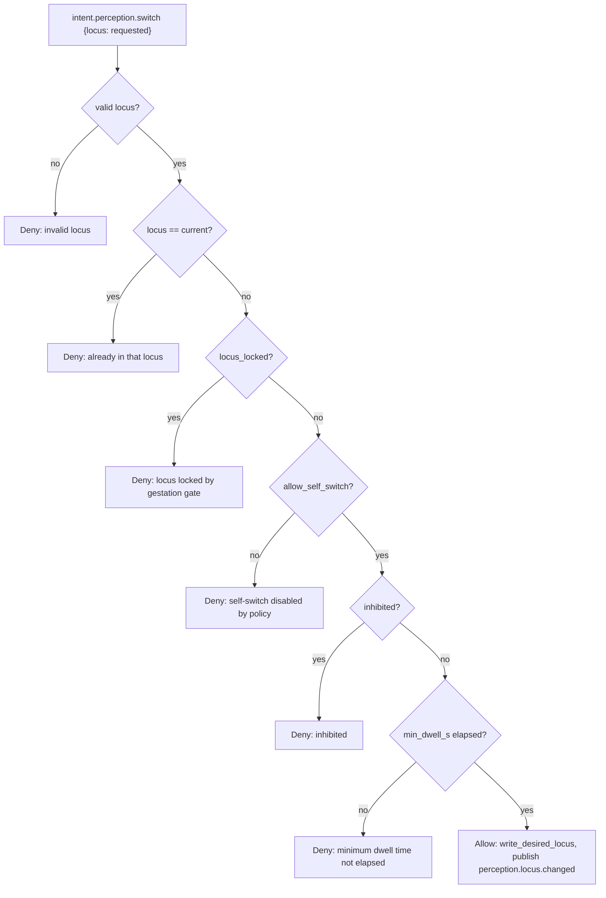

# Where perception comes from

The perceptual locus is KAINE's model of which world its senses are bound to at any moment: the real room, a deterministic feed, or nothing. This page explains the locus values, the state files that carry them, the gates that control entity self-switching, and how sleep maintenance uses the same machinery. Read it if you operate the camera or microphone, change the perception or sleep code, or audit the privacy guarantee.

Related: [Audition](../09-modules/audition.md) · [Topos](../09-modules/topos.md) · [Sleep and maintenance](../10-sleep/README.md) · [Architecture](../02-architecture/README.md)

## Locus values

Three loci are defined in `kaine/perception_state.py`:

| Locus | Meaning | Real camera and microphone |
|-------|---------|---------------------------|
| `physical` | The entity perceives the room: real microphone and camera, or a screen/window capture feed (`[perception_feed].mode = "screen"`) that substitutes the camera source at the same seam | Allowed, subject to the desired-state flags |
| `virtual` | The entity perceives a virtual source: the deterministic perception feed (`seeded`, `playlist`, or `womb`), or an embodied avatar feed when wired in | Forced off |
| `off` | No perception | Forced off |

Invalid locus strings are coerced at read time so the sensors are never left in an unknown state. Normally an invalid value becomes `physical`. Under a gestation lock it becomes `virtual`.

## State files

Two files under `state/perception/` carry the locus state.

### `state/perception/desired.json`

Written by `POST /diagnostics/perception/toggle` (audio/video desired flags), `POST /diagnostics/perception/locus` (locus and lock), and the `PerceptionLocus` module. It holds the operator-commanded state:

```json
{
  "audio_live_desired": false,
  "video_live_desired": false,
  "locus": "physical",
  "locus_locked": false,
  "locked_by": "operator"
}
```

The actual lock is the boolean `locus_locked`. `locked_by` records who holds the lock; it defaults to `"operator"`, is never `null`, and invalid values are coerced to `"operator"`. The perception tasks (`LiveMicrophone`, `LiveCamera`) poll this file and start or stop themselves to match.

### `state/perception/runtime.json`

Written by the perception tasks on every start or stop. It is the source of truth for the Nexus on-air banner and sidecar observers:

```json
{
  "audio_live_active": false,
  "video_live_active": false,
  "audio_last_started_at": null,
  "video_last_started_at": null,
  "audio_last_stopped_at": null,
  "video_last_stopped_at": null
}
```

Both files contain only operational booleans, the locus string, the lock fields, and ISO-8601 timestamps. They never contain transcribed text, audio bytes, frame data, or any other sensory content.

## Effective capture logic

The helper functions in `kaine/perception_state.py` enforce the locus gate:

```python
def effective_audio_capture(path=None) -> bool:
    d = read_desired(path)
    return d.audio_live_desired and d.locus == "physical"

def effective_video_capture(path=None) -> bool:
    d = read_desired(path)
    return d.video_live_desired and d.locus == "physical"
```

Even if `audio_live_desired` or `video_live_desired` is `true`, the real sensors do not run unless the locus is `physical`.

`kaine/perception_state.py` also defines the virtual-locus mirrors:

```python
def effective_virtual_audio_capture(path=None) -> bool:
    d = read_desired(path)
    return d.audio_live_desired and d.locus == "virtual"

def effective_virtual_video_capture(path=None) -> bool:
    d = read_desired(path)
    return d.video_live_desired and d.locus == "virtual"
```

[Audition](../09-modules/audition.md) and [Topos](../09-modules/topos.md) poll these mirrors exactly as the real-sensor tasks poll the physical functions. The same `audio_live_desired`/`video_live_desired` flags apply, so the operator mute toggle also works on the virtual feed.

`select_virtual_feed()` in `kaine/perception_state.py` is the boot-time helper that rezzes the entity into the `virtual` locus with both modalities desired. It is called when `[perception_feed].mode` is `seeded`, `playlist`, or `womb`. It honors `locus_locked`: if the locus is already locked, the configured feed is left unbound and the current desired state is returned unchanged.

## Operator-initiated locus switch

The Nexus endpoint `POST /diagnostics/perception/locus`, implemented in `kaine/nexus/perception.py`, writes the new locus to `state/perception/desired.json` directly via `write_desired_locus()`. This normally bypasses the entity self-switch gates. It does not bypass a gestation lock: when `locus_locked` is `true` and `locked_by` is `gestation`, every write from anyone other than the gestation holder is ignored, including operator writes. No bus event is published for an operator switch.

## Entity self-switch

`kaine/modules/perception/module.py` contains `PerceptionLocus`, the module that handles entity-initiated locus switches. It watches `volition.out` for `intent.perception.switch` intents and applies the `evaluate_locus_switch` gate.

This path is currently an unreachable producer gap. `PerceptionLocus` is a real consumer and the gate is tested, but nothing in the codebase emits `intent.perception.switch`: Volition emits only `intent.speak`, `intent.think`, `intent.act`, and `intent.rest`. Until a producer lands, the entity cannot self-switch, and `allow_self_switch` should stay at its default of `false`. Locus changes are operator-driven.



Gate parameters:

| Parameter | Default | Source |
|-----------|---------|--------|
| `allow_self_switch` | `false` | `PerceptionLocus` constructor |
| `min_dwell_s` | `30.0` | `PerceptionLocus` constructor |

On allow: `PerceptionLocus` writes `state/perception/desired.json` with the new locus and publishes `perception.locus.changed` to `perception.out`.

On deny: it publishes `perception.locus.denied` to `perception.out` with the reason.

The entity cannot self-switch when:

- the cycle snapshot is inhibited,
- `locus_locked` is `true`,
- `allow_self_switch` is `false` (the shipped default), or
- the minimum dwell time since the last switch has not elapsed.

## Locus and sleep maintenance

During Hypnos Phase 2, external perception is suspended while memory traces replay into the workspace. The suspension uses the same locus machinery:

- `suspend_perception()` remembers the pre-sleep desired locus and, on playlist runs, pauses the shared playlist clock so the stimulus freezes at the same moment perception stops.
- `restore_perception()` is always called in a `finally` block; it restores the remembered pre-sleep locus and resumes the playlist clock at the exact pause point.

Suspending perception prevents the entity from perceiving the room and re-processing memory traces at the same time, ensures perception is never left suspended if the replay phase raises, and keeps the stimulus clock in step with the locus. If a gestation lock is active when sleep calls `write_desired_locus("off")`, the write is ignored because the gestation holder is the only writer allowed.

## Event types

| Event type | Stream | Condition |
|------------|--------|-----------|
| `perception.locus.changed` | `perception.out` | Entity self-switch succeeded |
| `perception.locus.denied` | `perception.out` | Entity self-switch denied |

Operator-initiated switches write directly to `state/perception/desired.json` and do not emit a bus event.

## Zero-persistence invariant

All files under `state/perception/` contain only:

- operational booleans (`audio_live_active`, `video_live_desired`, `locus_locked`, etc.),
- ISO-8601 start/stop timestamps,
- the locus string (`physical`, `virtual`, or `off`),
- the `locked_by` field.

They never contain transcribed text, audio bytes, video frames, or frame metadata. Raw camera frames from [Topos](../09-modules/topos.md) and raw audio from [Audition](../09-modules/audition.md) are processed in memory and released; no frame or sample touches disk.

## Virtual perception feed

Setting `locus = "virtual"` forces the real camera and microphone off via `effective_audio_capture` and `effective_video_capture`. The default locus is `physical`.

The `virtual` locus is gated by `[perception_feed].mode`. The valid modes are `off`, `seeded`, `playlist`, `womb`, `live`, and `screen`. When the mode is `seeded`, `playlist`, or `womb`, boot calls `select_virtual_feed()` to bind the entity directly into the `virtual` locus, provided [Audition](../09-modules/audition.md) or [Topos](../09-modules/topos.md) is enabled. Mundus (`kaine/modules/mundus/`) is an unrelated embodiment control plane and is not required for virtual-locus availability.

Modes that use the virtual locus:

- `seeded` — `SeededProceduralSource` in `kaine/modules/topos/feed.py`. Its `frame_at(frame_index)` is a pure function of `(seed, frame_index)`, so it has no time cutoff. It needs no external media, but it is procedural noise rather than naturalistic content.
- `playlist` — `PlaylistSource` in `kaine/modules/topos/feed.py`. This is the intended replacement for `seeded`: an operator-curated, openly licensed media corpus pinned by one checksummed manifest. A digest mismatch fails the run closed.
- `womb` — a gestation feed that also rezzes into the `virtual` locus.

The seeded/playlist feed is a stimulus-delivery convenience for demos and shakedowns, not a dependency of the experiment battery.

## Configuration reference

The locus value itself (`physical`, `virtual`, or `off`) is set at runtime through Nexus or, once a producer exists, the `PerceptionLocus` self-switch path. The `[perception]` section in `kaine.toml` configures the self-switch gate:

```toml
[perception]
allow_self_switch = false
min_dwell_s = 30.0
```

`boot.make_perception()` in `kaine/boot.py` reads this section and passes the keys to the `PerceptionLocus` constructor.

The `PerceptionLocus` module is toggled via:

```toml
[modules]
perception = false   # shipped default; set true to enable PerceptionLocus
```

The `[modules].perception` entry enables `PerceptionLocus`. The actual perception tasks (`LiveMicrophone`, `LiveCamera`) are part of [Audition](../09-modules/audition.md) and [Topos](../09-modules/topos.md).

State files:

- `state/perception/desired.json` — commanded locus, sensor flags, and lock
- `state/perception/runtime.json` — live capture status

For `[perception_feed]` settings, see [Perception feed and sleep configuration](../appendix-a-configuration/perception-and-sleep.md).

## Key files

| File | Role |
|------|------|
| `kaine/perception_state.py` | `PerceptionState`, `DesiredState`, locus coercion, `effective_audio_capture`, `effective_video_capture`, `effective_virtual_*_capture`, `evaluate_locus_switch`, `select_virtual_feed` |
| `kaine/modules/perception/module.py` | `PerceptionLocus` — entity self-switch gating and intent consumer |
| `kaine/modules/audition/` | `LiveMicrophone` — polls desired state and calls `effective_audio_capture` |
| `kaine/modules/topos/` | `LiveCamera` — polls desired state and calls `effective_video_capture` |
| `kaine/nexus/perception.py` | Operator perception endpoints |
| `state/perception/desired.json` | Commanded locus, sensor flags, and lock |
| `state/perception/runtime.json` | Live capture status |
