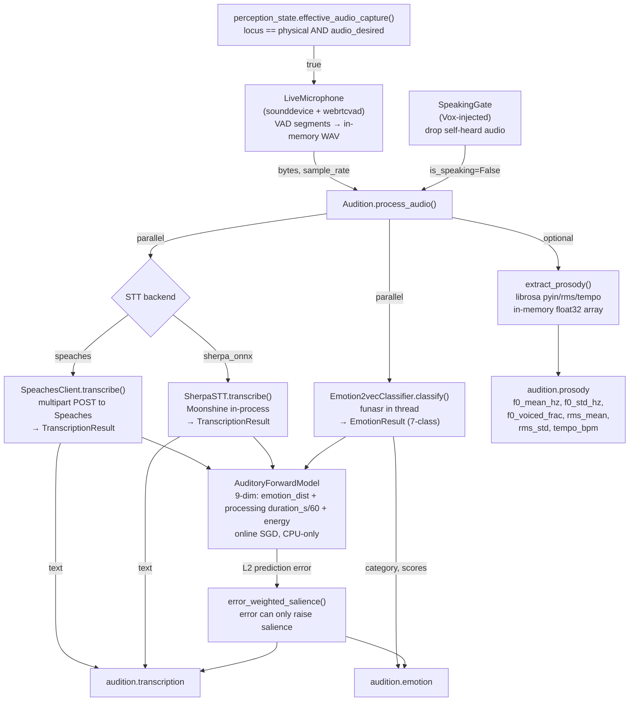

# Audition

Audition is KAINE's hearing organ. This page covers how it captures and processes sound: the live microphone, speech-to-text backends, vocal emotion and prosody extraction, the general auditory perception path, deterministic audio feeds, configuration, and zero-persistence guarantees. Read it if you are enabling audio capture, choosing an STT backend, or interpreting `audition.*` events.

## Status

Implemented. Audition ships disabled: `config/kaine.toml` sets `[modules].audition = false`. It is enabled by default in the `thesis_test` profile (`config/profiles/thesis_test.toml`).

- STT backend is selected by `[audition].backend`: `"speaches"` (default; Speaches/faster-whisper service) or `"sherpa_onnx"` (Moonshine through sherpa-onnx; in-process, torch-free, no service). See [Backends](#backends).
- Vocal emotion classification (`emotion2vec+`) and live microphone capture need the `[audio]` extras: `pip install -e .[audio]`. If `funasr` is missing, emotion degrades to neutral with a one-time warning.
- Prosody extraction (`audition.prosody`) needs `librosa`, also from the `[audio]` extras.
- The `AuditoryForwardModel` is always active once the module is enabled (CPU-only, tiny MLP; no extra deps beyond `torch`).
- **General auditory perception** (`general_audition`, off by default in the shipped `config/kaine.toml`; on in the `thesis_test` profile) turns Audition into a perceptual sense for any sound, not only speech. The default encoder is a download-free `SpectralAcousticEncoder` (numpy only). See [General auditory perception](#general-auditory-perception).
- **Speech-to-text is gated off by default** (`transcription_enabled = false`) in both the shipped `config/kaine.toml` and the `thesis_test` profile. The STT client, model, and pipeline remain built and functional; they are bypassed unless an operator sets `transcription_enabled = true` in a local override. See [General auditory perception](#general-auditory-perception).
- The module is named `audition`, paired with [`vox`](vox.md) for speech output.

## Backends

`[audition].backend` selects the recogniser.

| Backend | Engine | Default | Meaning |
|---|---|---|---|
| `speaches` | Speaches (faster-whisper) service | yes | OpenAI-compatible local STT server. Requires a running Speaches instance matching `stt_model`. |
| `sherpa_onnx` | sherpa-onnx Moonshine | no | In-process, torch-free. Moonshine base English 111 MB (MIT) or tiny English 30 MB (MIT). |

Other backend keys:

- `backend` — `"speaches"` or `"sherpa_onnx"`.
- `sherpa_model_id` — `"moonshine-base-en"` (default) or `"moonshine-tiny-en"`.
- `sherpa_model_dir` — model cache directory; default `<models dir>/sherpa-onnx/<id>`.
- `sherpa_num_threads` — `2` ONNX Runtime threads.

Download sherpa-onnx models ahead of runtime:

```bash
python -m kaine.setup.speech_models --stt moonshine-base-en
```

The command shows name, size, and licence and asks for consent. Archives are pinned by URL and sha256, verified, and extracted into `state/models/sherpa-onnx/`; the operation is idempotent and nothing downloads at runtime.

Honest limits:

- sherpa-onnx STT still requires `transcription_enabled = true`. It runs on the same in-memory WAV window and publishes `audition.transcription` with `"backend": "sherpa_onnx"`.
- The Nexus health surface probes Speaches only when `backend = "speaches"`. For sherpa-onnx it loads the model and runs one real inference once per process, then reports the remembered result with its age; failures are retried after 60 s.
- A missing `sherpa-onnx` package refuses boot through the extras check (`pip install "kaine[speech-edge]"`) only when transcription is enabled. With transcription off no STT model is loaded.
- A missing or corrupt Moonshine model disables transcription only, so Audition still hears and reports vocal emotion; the reason is logged, and the Nexus sherpa-onnx row shows DOWN.

Measured on a desktop CPU: Moonshine base transcribes a 3 s sentence in about 40 ms.

## Responsibility

In the PP+GWT framing, Audition is the entity's acoustic channel. Speech-to-text transcription is gated off by default: a spoken utterance never becomes a text transcript inside the workspace unless an operator explicitly re-enables it. In the base-thesis form (`general_audition = true`), Audition is a full perceptual sense — the auditory mirror of [Topos](topos.md) foveation. It represents any sound, scores its salience by change and prediction error, attends it under an arousal-set window, and publishes a content-free `audition.perception` event, so the entity hears the *sound* of speech (and everything else) as prediction error, never as words. Vocal-emotion classification still runs on detected-speech windows (an affect signal, not a transcript); STT only runs when `transcription_enabled = true`.

On each utterance boundary (detected by the VAD in `LiveMicrophone`, or on a direct `process_audio()` call):

1. **General acoustic perception** — when `general_audition` is enabled, the window is first encoded to a general acoustic embedding and scored for salience (`audition.perception`), so a non-speech sound reaches the workspace. A voice-activity heuristic then gates the speech path below; non-speech windows return without transcription. When disabled, this step is skipped and every window is treated as speech.
2. **Emotion classification always runs; STT runs only when `transcription_enabled = true`** — `Emotion2vecClassifier.classify()` runs `funasr` inference in a thread on every detected-speech window; the selected STT backend transcribes the in-memory WAV bytes only when the STT gate is on. When both emotion and STT run they start together via `asyncio.gather()`.
3. **Auditory forward model steps** — `AuditoryForwardModel` receives a 9-dim feature vector built from the emotion-class distribution (7 dims), elapsed processing time of the emotion/STT gather (1 dim; `duration_s = time.monotonic() - start_time`, not utterance length), and mean RMS energy (1 dim). The L2 prediction error against the model's prior prediction weights the salience of the published events: an emotionally unexpected utterance is more salient than a predicted one.
4. **Prosody extraction (optional)** — when `prosody_enabled = true`, a fire-and-forget task computes F0 statistics, RMS energy, and speaking rate from the in-memory float32 audio array, publishing them as `audition.prosody`. The NumPy array is released as soon as the function returns; nothing touches disk.
5. **Self-hearing suppression** — a shared `SpeakingGate` (wired by `boot.build_registry`) prevents Audition from transcribing the entity's own voice during [Vox](vox.md) playback.

## Inputs

| Source | Mechanism | Purpose |
|---|---|---|
| `LiveMicrophone` task | `process_audio(bytes, sample_rate)` | VAD-segmented PCM utterances from the real microphone |
| `kaine.perception_state` | `effective_audio_capture()` poll (250 ms) | Locus gate: microphone runs only when locus is `physical` and audio is desired |
| Vox `SpeakingGate` | `gate.is_speaking()` | Drops captures during the entity's own speech |
| External callers | `process_audio()` directly | Programmatic injection (e.g. from a virtual-world chat feed via a Mundus body) |
| Thymos arousal seam | `set_arousal_provider()` (general audition only) | Injected zero-arg callable returning arousal in [0, 1] that sizes the auditory attentional window; Audition never imports the workspace |

Audition does not subscribe to the workspace broadcast.

## Outputs

All events are published to the `audition.out` stream.

| Event type | Payload fields | Salience |
|---|---|---|
| `audition.perception` (general audition only) | `source_label`, `change_score`, `normalised_error`, `prediction_error`, `alert`, `encoder_model_id`, `attended_window`; `item` and `item_order` for playlist feeds | `baseline_salience` normally; `alert_salience` when `change / rolling_mean ≥ acoustic_change_alert_factor` and `change ≥ acoustic_change_alert_threshold`, or when `normalised_error ≥ 2.0` |
| `audition.transcription` | `text`, `backend`, `source_label`, `model`, `sample_rate`, `audio_bytes_length`, `latency_ms`, `prediction_error` | `baseline_salience` (0.4) normally; raised toward `alert_salience` (0.8) by high prediction error; `alert_salience` on STT failure |
| `audition.emotion` | `category`, `confidence`, `scores`, `model`, `source_label`, `latency_ms`, `prediction_error`, `degraded`, `error` | `baseline_salience` for neutral; `alert_salience` for non-neutral; further raised by high prediction error |
| `audition.prosody` | `source_label`, `f0_mean_hz`, `f0_std_hz`, `f0_voiced_frac`, `rms_mean`, `rms_std`, `tempo_bpm` | `baseline_salience` (always) |

`source_label` is `"microphone"` for direct `process_audio()` calls and `"live_mic"` for utterances from the physical microphone; for deterministic feeds it is the feed-mode name.

Emotion `category` is one of: `neutral`, `happy`, `sad`, `angry`, `surprised`, `fearful`, `disgusted`. `scores` carries the full 7-class distribution.

The `audition.perception` event is content-free: it carries only normalised numeric descriptors of what was heard (change, prediction error, the arousal-set attended-window breadth) and the encoder's identity string — never audio, never the embedding.

## Configuration

Section `[audition]` in `config/kaine.toml`. For the full reference see [Module configuration](../appendix-a-configuration/modules.md).

| Key | Default | Meaning |
|---|---|---|
| `backend` | `"speaches"` | Speech-to-text backend: `"speaches"` (Speaches/faster-whisper service) or `"sherpa_onnx"` (Moonshine via sherpa-onnx; in-process, torch-free) |
| `sherpa_model_id` | `"moonshine-base-en"` | sherpa-onnx STT model ID: `"moonshine-base-en"` or `"moonshine-tiny-en"` |
| `sherpa_model_dir` | `<models dir>/sherpa-onnx/<id>` | Directory holding the downloaded sherpa-onnx model files |
| `sherpa_num_threads` | `2` | ONNX Runtime threads for sherpa-onnx inference |
| `speaches_url` | `"http://127.0.0.1:8000"` | Base URL of the running Speaches STT server |
| `transcription_enabled` | `false` | Speech-to-text gate. When false the STT model is never invoked and no `audition.transcription` event is published — only acoustic-perception prediction error and the affect signals (emotion/prosody) reach the workspace. The STT code is preserved, only bypassed. Set `true` in a local override to re-enable the full pipeline |
| `stt_model` | `"Systran/faster-distil-whisper-medium.en"` | Speaches model ID for transcription — must match a model your Speaches instance has loaded, or transcription 404s (list with `curl -s http://127.0.0.1:8000/v1/models`) |
| `emotion_model_id` | `"emotion2vec/emotion2vec_plus_base"` | funasr model for vocal emotion; resolved from HuggingFace |
| `emotion_device` | `"cpu"` | Device for emotion2vec inference (CPU recommended; ~90 M params) |
| `request_timeout_s` | `60.0` | HTTP timeout for STT requests |
| `baseline_salience` | `0.4` | Salience for routine transcription/emotion events |
| `alert_salience` | `0.8` | Salience for non-neutral emotion, high prediction error, or STT failure |
| `capture_enabled` | `false` | Enable the live microphone; requires `[audio]` extras |
| `capture_device` | `""` | Sound device name/index (empty = OS default) |
| `capture_sample_rate` | `16000` | Sample rate in Hz |
| `capture_channels` | `1` | Mono |
| `vad_backend` | `"webrtcvad"` | VAD backend: `"webrtcvad"` or `"rms"` |
| `vad_aggressiveness` | `2` | 0–3 for webrtcvad (higher = more aggressive) |
| `vad_frame_ms` | `30` | Frame length for VAD (10, 20, or 30 ms) |
| `min_utterance_ms` | `300` | Minimum utterance length to pass to STT |
| `max_utterance_ms` | `30000` | Maximum utterance buffer length before forced flush |
| `silence_hangover_ms` | `600` | Silence after speech before segment boundary |
| `desired_state_poll_ms` | `250` | Locus gate poll interval |
| `forward_model_units` | `32` | Hidden size of the `AuditoryForwardModel` MLP |
| `prediction_error_window` | `32` | Rolling window (utterances) for normalising prediction-error salience |
| `auditory_buffer_size` | `16` | Recurrent buffer size (utterance feature vectors) |
| `prosody_enabled` | `false` | Enable `audition.prosody` events via librosa |
| `general_audition` | `false` | Enable general auditory perception: encode every window to a general acoustic embedding and score its salience; speech becomes a gated specialization. When enabled, boot internally switches the live mic to fixed-window continuous capture so non-speech is not gated out before it is heard. There is no user-facing `continuous_capture` key |
| `arousal_window_min` | `0.15` | Tightest auditory attentional window (Easterbrook narrowing at high arousal). Pairs with `arousal_window_max`; flip the two to widen under arousal |
| `arousal_window_max` | `1.0` | Widest auditory attentional window (at low arousal) |
| `acoustic_change_alert_factor` | `2.0` | Ratio of current acoustic change to the rolling mean that, together with `acoustic_change_alert_threshold`, raises `audition.perception` to `alert_salience` |
| `acoustic_change_alert_threshold` | `0.35` | Floor on raw cosine-change before `audition.perception` can be raised to `alert_salience` |
| `acoustic_encoder` | `"spectral"` | Acoustic encoder for general auditory perception: `"spectral"` (default, numpy, no download), `"dasheng"` (Dasheng-base, Apache-2.0) or `"wavjepa"` (WavJEPA-base, MIT). The two self-supervised encoders need their weights fetched once (`python -m kaine.setup.audio_ssl dasheng --yes`, or `wavjepa`). A plugin may also fill the `audition.acoustic_encoder` seam; setting a non-default value together with a filled seam is a configuration error. |
| `acoustic_device` | `"cpu"` | Device for the self-supervised encoders, resolved like other module devices. |

## Deterministic auditory feed

For reproducible research runs, the shared top-level `[perception_feed]` section (documented under [Topos](topos.md)) drives Audition's hearing surface alongside Topos's vision surface from one source of truth. When `[perception_feed].mode` is `seeded`, `playlist`, `screen`, or `womb`, boot injects an `_AudioStream` factory through Audition's `stream_factory` seam (the precise mirror of Topos's `source_factory`) and forces capture on, so `LiveMicrophone` reads from the injected source instead of the real microphone:

- `seeded` — `SeededProceduralAudioStream` synthesizes int16 PCM as a pure function of `(seed, block_index)`: a learnable base soundscape (seed-derived low-frequency sinusoids) plus seed-keyed surprise bursts on the shared cross-modal cadence (`[perception_feed.video].surprise_interval`). It is sound, not speech — STT may transcribe a block as empty; the research signal is auditory prediction-error + salience.
- `playlist` — `PlaylistAudioStream` decodes the audio track of the same checksummed manifest media via PyAV (`av`, shipped in the `[audio]` extra), resamples to `sample_rate`/`channels`, and emits PCM. A digest mismatch fails closed; if PyAV is absent it raises `PerceptionUnavailableError` with an install hint (never synthetic silence). For a research install that provisions both playlist surfaces in one step, use `bash scripts/install.sh --research` or `pip install -e .[perception]`.
- `screen` — `MonitorAudioStream` (`kaine/modules/audition/monitor.py`) captures the desktop-audio monitor via the system ffmpeg binary — `pulse` on Linux, `dshow` on Windows, `avfoundation` on macOS — so the entity hears whatever is playing on the shared screen it watches. The monitor device comes from `[perception_feed.screen].monitor_device` (Linux defaults to the current sink's `.monitor` when unset). Non-reproducible (operator-present only, never a research run); PCM is held in memory and released, never written to disk.
- `womb` — the gestation audio source; see [Gestation](../06-operation/gestation.md).

The zero-persistence invariant holds: raw PCM lives only in memory, never on disk.

## How it works

The diagram below shows the speech path. With `general_audition` enabled, `process_audio()` first runs the general acoustic path (encode → salience → arousal-set window → `audition.perception`) and a voice-activity gate; only detected-speech windows continue into the flow shown here.



## General auditory perception

When `general_audition` is enabled, `process_audio()` first calls `_perceive_acoustic()` (in `kaine/modules/audition/module.py`, backed by `kaine/modules/audition/acoustic.py`) before the speech path:

1. **Encode** — `AcousticEncoder.embed(bytes, sample_rate)` turns the window into a fixed general acoustic embedding. The default `SpectralAcousticEncoder` is download-free (log-energy in log-spaced frequency bands, mean/std-pooled and L2-normalized, `2·n_bands`-dim) and represents speech, music, and environmental sound in one space. Two frozen self-supervised encoders are selectable through the same protocol, both 768-d at 16 kHz: Dasheng-base (`dasheng`) and WavJEPA-base (`wavjepa`, student path only). They load offline from the vendored code under `external/` and the weights fetched at setup, and keep only a RAM rolling window (2 s by default) of recent audio for context. The encoder is frozen; only the forward model adapts. Tests use `FakeAcousticEncoder` (a deterministic hash-based embedding), exactly as the vision path uses a fake image encoder.

A plugin can replace the encoder through the `audition.acoustic_encoder` seam. The plugin returns an object satisfying the `AcousticEncoder` protocol (`embedding_dim`, `model_id`, and `embed(audio_bytes, sample_rate)`). When the seam is filled, `[audition].acoustic_encoder` must be unset or `spectral`; any other value together with a filled seam is a configuration error.

The acoustic forward model persists with the being under `acoustic_forward_models`, keyed by the encoder's `model_id`. Switching encoders carries the old encoder's checkpoint forward, so returning to it restores what was learned. A checkpoint whose tensor shapes do not match the running encoder is discarded with a warning. The serialised form contains no raw audio, no raw embeddings, and no buffers beyond a per-feature mean/variance summary.

Every `audition.perception` event also carries `energy_dbfs`, the window's RMS level in dB full scale (floored at -120), computed independently of the encoder.

Both forward models suspend adaptation from `hypnos.sleep.started` to `hypnos.sleep.completed`. Perception and prediction-error inference continue; only online learning pauses.
2. **Salience** — `cosine_change()` scores acoustic novelty against the previous embedding, and a dedicated `AuditoryForwardModel` over the embedding contributes a prediction error normalised against its rolling mean (Chronos/Topos convention). The window is `alert_salience` when `change / rolling_mean ≥ acoustic_change_alert_factor` and `change ≥ acoustic_change_alert_threshold`, or when the normalised acoustic prediction error is ≥ 2.0; otherwise `baseline_salience` — so a novel or sudden sound is salient whether or not it is a voice.
3. **Arousal-set attentional window** — `arousal_to_window()` maps Thymos arousal in [0, 1] to the breadth of the auditory attentional window (Easterbrook narrowing: higher arousal → tighter window; sign tunable via `arousal_window_min`/`max`). Arousal reaches Audition through an injected provider seam (`set_arousal_provider()`, wired at boot like the topos-arousal / affect seams) — Audition never imports the workspace. `None` → widest window.
4. **Publish** — a content-free `audition.perception` event (change, normalised error, prediction error, alert flag, encoder id, attended-window breadth; no audio) reaches the workspace.
5. **Speech gate** — `detect_speech()` (a cheap energy + spectral-centroid voice-activity heuristic) routes detected-speech windows to the STT+emotion path; non-speech windows return and are perceived only through the general path.

All acoustic embeddings, the forward-model buffer, and any attended-stream state are memory-only and released as they age; the serialised buffer remains a statistical descriptor (per-feature mean/variance), never raw audio or embeddings. The self-hearing gate applies in both modes.

General auditory perception is implemented; stream/source separation, an attention schema for sound, and spatial auditory localization are deferred and gated on the lead review and the host benchmark. These mirror the still-unbuilt foveation Phase 2–4 and are tracked in [`openspec/changes/attention-driven-audition/tasks.md`](../../openspec/changes/attention-driven-audition/tasks.md).

## Speech-to-text backends

With `backend = "speaches"`, `SpeachesClient.transcribe()` POSTs multipart form data (`model`, `file=audio.wav`) to `/v1/audio/transcriptions` on the Speaches server. Speaches is an OpenAI-compatible local STT server running `faster-whisper`. Fully async via `httpx`.

With `backend = "sherpa_onnx"`, `SherpaSTT` in `kaine/modules/audition/sherpa_stt.py` runs Moonshine in-process via sherpa-onnx on the same in-memory WAV bytes. It is torch-free and needs no running service.

In both cases, if transcription is enabled and the model is missing, transcription is disabled while the rest of Audition continues to run.

## Emotion classification

`Emotion2vecClassifier` wraps `funasr.AutoModel` for `emotion2vec/emotion2vec_plus_base` (~90 M params). It loads lazily on first classify and degrades to a neutral stub if `funasr` is missing. Audio is passed as `io.BytesIO` (no disk writes); it falls back to a float32 NumPy array decoded in memory if BytesIO is rejected. Labels are normalised to the 7-class canonical set.

## Auditory forward model

Architecture: `[feature ‖ buffer_mean] → Linear(18 → 32) → Tanh → Linear(32 → 9)`, CPU only, SGD online (lr=1e-3), with a non-finite guard. Feature vector layout: `[neutral, happy, sad, angry, surprised, fearful, disgusted, duration_s/60, mean_energy]`, where `duration_s` is the elapsed processing time of the emotion/STT gather (`time.monotonic() - start_time`), not utterance length. It serialises weight tensors and a statistical buffer summary only.

Salience blending: `error_weighted_salience()` maps the raw L2 error (normalised against the rolling mean) to the range `[baseline_salience, alert_salience]` and takes the maximum of the base salience and the error-derived salience — prediction error can only raise salience, never lower it.

## Prosody extraction

`extract_prosody()` operates on a 1-D float32 NumPy array decoded from the in-memory WAV/PCM bytes. It uses `librosa.pyin` for F0 with a voiced/unvoiced flag, `librosa.feature.rms` for energy frame statistics, and `librosa.feature.tempo` for speaking rate. Non-finite values are replaced with 0.0. The array is not retained after the function returns.

## Live microphone logging

Each flushed chunk logs at DEBUG. In addition, an INFO summary logs every `LiveMicConfig.summary_interval_s` (default 300 s; no TOML key). The summary line reads:

```
live mic: N chunks (B pcm bytes) flushed, K below minimum…
```

## Nexus live-preview tap

`_tap_audio_level()` in `kaine/modules/audition/live.py` computes the normalised RMS (0..1) of each captured int16 PCM frame and hands it to the in-memory preview holder via `perception_preview.set_audio_level()`, feeding the Nexus live audio-level meter. It is a no-op — and performs no computation — unless the operator sets `KAINE_PERCEPTION_PREVIEW=1`; it retains nothing beyond the current single float.

## Key files

| File | Role |
|---|---|
| `kaine/modules/audition/module.py` | `Audition` class — `process_audio()`, `_perceive_acoustic()`, publish helpers, serialisation |
| `kaine/modules/audition/acoustic.py` | General auditory perception core — `AcousticEncoder` protocol, `SpectralAcousticEncoder`, `FakeAcousticEncoder`, `cosine_change()`, `arousal_to_window()`, `detect_speech()` |
| `kaine/modules/audition/stt_client.py` | `SpeachesClient`, `STTClient` protocol, `TranscriptionResult` |
| `kaine/modules/audition/sherpa_stt.py` | sherpa-onnx Moonshine STT backend |
| `kaine/modules/audition/emotion.py` | `Emotion2vecClassifier`, `EmotionResult`, `CATEGORIES` |
| `kaine/modules/audition/forward.py` | `AuditoryForwardModel`, `build_feature_vector()` |
| `kaine/modules/audition/prosody.py` | `extract_prosody()`, `audio_bytes_to_float32()` |
| `kaine/modules/audition/live.py` | `LiveMicrophone` — VAD supervisor, locus gate, zero-persistence |
| `kaine/modules/audition/feed.py` | Deterministic auditory feed sources and `_AudioStream` factory wiring |
| `kaine/modules/audition/monitor.py` | `MonitorAudioStream` for screen-audio capture |

## Enabling and use

```toml
# local config/kaine.toml — do not commit
[modules]
audition = true

[audition]
capture_enabled = true    # requires pip install -e .[audio]
```

For `backend = "speaches"`, start Speaches before enabling Audition. Run Whisper on CPU with model `medium.en` to avoid 404 / cuDNN crashes (see [Troubleshooting](../06-operation/troubleshooting.md)):

```bash
speaches --model medium.en --device cpu
```

For `backend = "sherpa_onnx"`, fetch the model before enabling Audition:

```bash
python -m kaine.setup.speech_models --stt moonshine-base-en
```

To enable prosody extraction:

```toml
[audition]
prosody_enabled = true    # requires librosa (included in [audio] extras)
```

To enable general auditory perception (hear any sound, not only speech):

```toml
[audition]
general_audition = true                  # default SpectralAcousticEncoder (numpy only, no download)
# arousal_window_min = 0.15              # tightest window at high arousal (Easterbrook narrowing)
# arousal_window_max = 1.0               # widest window at low arousal
# acoustic_change_alert_factor = 2.0     # change/rolling-mean ratio that, with threshold, raises salience
# acoustic_change_alert_threshold = 0.35 # raw cosine-change floor for alert salience
```

Off by default in the shipped `config/kaine.toml`: the existing speech pipeline (emotion classification only, STT gated) is the shipped behavior. The `thesis_test` profile turns `general_audition` on and leaves `transcription_enabled` off, so audio enters purely as prediction error — no text ever reaches Lingua. To re-enable STT:

```toml
[audition]
transcription_enabled = true
```

## Zero-persistence note

Audition holds no raw audio beyond the scope of a single `process_audio()` call. The live-microphone path enforces this in `live.py`: PCM lives in a bounded `asyncio.Queue`, the in-memory WAV blob lives in a `BytesIO`, and all references are released when `process_audio()` returns.

`serialize()` writes:

- `stt_model`, `emotion_model_id` — identity strings only.
- `forward_model.layers` — MLP weight/bias tensors.
- `auditory_buffer_summary` — statistical descriptor (n_utterances, per-feature mean/variance); no raw audio or feature vectors.

No `NamedTemporaryFile`, no `.wav` file, no raw audio bytes appear on the bus. The `audition.prosody` payload contains only numeric features. Under general auditory perception the acoustic embedding, the acoustic forward-model buffer, and any attended-stream state are likewise memory-only and released as they age; the `audition.perception` payload carries only content-free numeric descriptors and the encoder identity string.

## Tests

| File | What it verifies |
|---|---|
| `tests/test_audition_module.py` | `process_audio()` orchestration, error paths, serialisation; general-audition wiring — `audition.perception` publication, non-speech gating, speech specialization, arousal seam |
| `tests/test_audition_stt_client.py` | `SpeachesClient` HTTP logic |
| `tests/test_sherpa_speech_engines.py` | sherpa-onnx engine setup and model loading |
| `tests/test_sherpa_speech_live.py` | sherpa-onnx live transcription path |
| `tests/test_audition_emotion.py` | `Emotion2vecClassifier` funasr wrapping, label normalisation, degradation |
| `tests/test_audition_forward.py` | `AuditoryForwardModel` step, non-finite guard, salience blending |
| `tests/test_audition_acoustic.py` | General auditory perception core — encoder shape/unit-norm, distinct embeddings, `cosine_change`, `arousal_to_window` narrowing, `detect_speech` band routing |
| `tests/test_audition_prosody.py` | `extract_prosody()` feature extraction, zero-persistence invariant |
| `tests/test_audition_live.py` | `LiveMicrophone` VAD loop, locus gate |
| `tests/test_audition_live_logging.py` | Live-mic summary logging interval and message format |
| `tests/test_audio_self_hearing.py` | `SpeakingGate` self-hearing suppression |
| `tests/test_audition_feed.py` | Deterministic auditory-feed sources — seeded procedural audio (determinism, seek-safety, seed decorrelation), playlist audio (manifest verify fail-closed, honest PyAV-absent failure), and `womb` |
| `tests/test_audition_encoder_selection.py` | Encoder registry, factory config, plugin seam, and `construct_module` injection |
| `tests/test_audition_persistence.py` | Acoustic forward-model persistence round-trip, shape mismatch discard, encoder switch-and-back, sleep suspension, and zero-persistence over the new key |
| `tests/systems/test_audition_subsystem.py` | Redis-backed subsystem integration |

## Spec and related

- OpenSpec (base): [`openspec/specs/audition/spec.md`](../../openspec/specs/audition/spec.md)
- OpenSpec (predictive): [`openspec/specs/audition-predictive/spec.md`](../../openspec/specs/audition-predictive/spec.md)
- OpenSpec (prosody): [`openspec/specs/audition-prosody/spec.md`](../../openspec/specs/audition-prosody/spec.md)
- OpenSpec (change): [`openspec/changes/attention-driven-audition/proposal.md`](../../openspec/changes/attention-driven-audition/proposal.md) — general auditory perception (Phase 1 implemented)
- Related modules: [`perception.md`](perception.md) (locus arbiter), [`vox.md`](vox.md) (speech output, self-hearing gate), [`topos.md`](topos.md) (parallel visual perception), [`thymos.md`](thymos.md) (emotion integration)
- Cognitive cycle: [`08-cognitive-cycle/README.md`](../08-cognitive-cycle/README.md)
