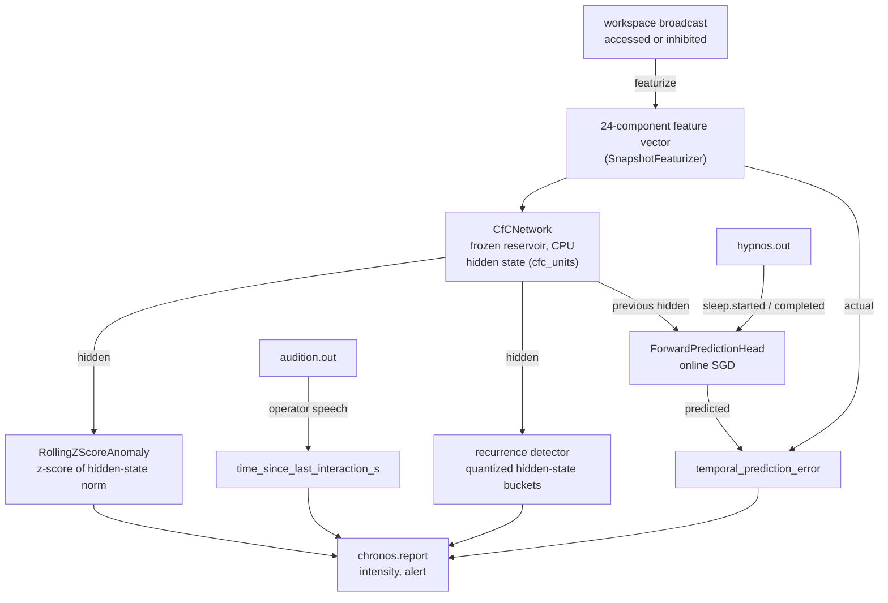

# Chronos

Chronos is KAINE's temporal prediction. Its input is the workspace itself: on every broadcast, accessed or inhibited, it encodes the broadcast as a feature vector, advances a frozen continuous-time reservoir, predicts the broadcast's features from the previous hidden state, and reports the prediction error back to the workspace. It also detects recurrence and tracks how long it has been since the entity last heard a voice. This page covers what Chronos computes, its intensity and alert rule, its events, sleep, persistence, and configuration. Read it if you are configuring KAINE, studying the temporal signal, or integrating Chronos with another module.

## Status

Implemented. The bare `config/kaine.toml` has every module off; with no profile selected the loader applies the `thesis_test` profile, which enables Chronos (`chronos = true`).

- The reservoir backend is `[chronos].cfc_backend`: `"numpy"` (shipped default; needs neither `torch` nor `ncps`) or `"torch"` (uses `ncps.torch.CfC` and needs the `core` extra).
- The network runs on the CPU by policy, whatever the host. It is small enough that a GPU adds nothing, and the CPU keeps the cycle's timing predictable. A warning is logged if the selected device is not `cpu`.
- Forward prediction is off in the shipped `config/kaine.toml` (`forward_prediction = false`) and on in `thesis_test`. With it off, Chronos reports only at its baseline or alert level.

## What Chronos does

Chronos models interval timing, the estimation of durations from seconds to minutes. It is the one predictive processor whose input is the broadcast sequence, so the broadcast is its observation, not a context it conditions on. It therefore holds no broadcast context and reports no `context_gain`; the planned information-gain measure excludes it.

On every broadcast it receives (`on_workspace`), Chronos:

1. Featurizes the broadcast into a fixed 24-component vector (below).
2. Advances the reservoir on that vector. The step's timespan is the latest inter-broadcast interval divided by the mean of the last 32 intervals, clipped to `[0, 10]`, and 1.0 on the first broadcast. Before an interval enters that window it is clipped to ten times the window's current mean (the first interval enters unchanged), so one long pause cannot dominate the mean for the next 31 steps. A steady cadence keeps the timespan near 1.0, and a gap reaches the cell's time gates. A network supplied by a plugin receives a timespan only if it declares `accepts_timespan = True`.
3. With forward prediction on, predicts the current vector from the previous hidden state through an online linear readout, measures the error, and takes one learning step.
4. Scores the hidden state for anomaly and for recurrence.
5. Reads the time since the last interaction.
6. Publishes `chronos.report`.

Inhibited broadcasts reach Chronos as well as accessed ones, so the whole broadcast sequence is predicted, and content that did not gain access can still influence later processing through Chronos's reports.

### Broadcast featurizer

`SnapshotFeaturizer` (`kaine/modules/chronos/featurizer.py`) builds the vector from the broadcast's coalition, weighting each member by the intensity its module reported (not by its score). The broadcast context of Topos, Audition, and Soma uses the same layout, computed over accessed members only.

| Components | Feature |
|---|---|
| 0 | `log1p(number of coalition members)`, clamped at 8 |
| 1 to 3 | Mean, maximum, and sample standard deviation of the members' intensities |
| 4 to 11 | Intensity mass per source for soma, chronos, topos, nous, mnemos, thymos, lingua, and praxis; other sources fall into component 11 (Audition too, in layout 1) |
| 12 to 19 | Intensity mass per (source, event type) pair, hashed with blake2b into eight buckets |
| 20 | `log1p(interval)`, the entity seconds since the previous broadcast (0 on the first) |
| 21 | 1.0 if the broadcast is inhibited |
| 22 | 1.0 for a broadcast (`is_experiential`), which every broadcast Chronos receives is |
| 23 | Audition's intensity mass in layout 2; always 0.0 in layout 1 |

Layout 2 is the default for new beings. Layout 1 is kept for beings restored from snapshots saved before layouts were versioned, so their trained readout keeps the input it learned on (see [Persistence](#persistence)). The vector length is 24 in both, so the reservoir, the readout, and plugin networks are unaffected.

### Reservoir

`CfCNetwork` (`kaine/modules/chronos/network.py`) runs either the NumPy step in `kaine/cfc_numpy.py` (`cfc_backend = "numpy"`) or `ncps.torch.CfC` (`cfc_backend = "torch"`). The two compute the same step and agree to 1e-5 from the same weights. Every reservoir parameter is frozen; the reservoir extracts temporal features and is never trained. Its weights are generated in NumPy from a reservoir seed, identically for both backends, and copied into the ncps module for torch. A custom `network` can be injected at boot, for example for a CL1 substrate; it must expose `units` (its hidden width) when forward prediction is on.

The hidden state (`cfc_units` components) accumulates across broadcasts during a run. It starts at zero after revival and is never persisted.

### Forward prediction

When `forward_prediction = true`, `ForwardPredictionHead` maps the previous broadcast's hidden state to a predicted feature vector. With the `"numpy"` backend it is a NumPy readout updated by `sgd_step`; with `"torch"` it is a single `nn.Linear` layer. On each broadcast after the first:

1. The head predicts the current feature vector from the previous hidden state.
2. `temporal_prediction_error` is the mean absolute error over the 24 components.
3. The head takes one stochastic-gradient step (learning rate 1e-3) toward the actual vector, skipped during sleep and whenever the loss or a gradient is not finite.

## Intensity and the alert flag

With forward prediction on and at least one temporal error recorded, the error ratio is `temporal_prediction_error` over the mean of the last `prediction_error_window` errors (the current one included). The report is an alert when either holds:

- the error ratio is at least `anomaly_alert_threshold`;
- recurrence is detected (below).

Before the first temporal error exists, or with forward prediction off, the error ratio is replaced by the anomaly score: the absolute z-score of the hidden state's L2 norm against the norms of the previous `anomaly_window` broadcasts.

An alert is reported at `alert_salience`. With forward prediction on, any other report is graded by the error ratio:

```text
baseline_salience + (alert_salience − baseline_salience) × min(1, ratio / 2)
```

Without a temporal error, a report that is not an alert is at `baseline_salience`. Every `chronos.report` carries `alert`, and the access rate's phasic input counts only reports whose `alert` is true. Because the graded intensity reaches the alert level at a ratio of 2 while the shipped alert criterion is a ratio of 3, a report with a ratio between 2 and 3 is reported at the alert level without being an alert.

### Recurrence detection

`RecurrenceRuminationDetector` (`kaine/modules/chronos/rumination.py`; the code calls recurrence "rumination") quantizes each dimension of the hidden state with step `rumination_bucket_resolution` and hashes the result to a bucket. Recurrence is detected when one bucket occurs at least `rumination_threshold` times among the last `rumination_window` hidden states, meaning the workspace keeps returning to the same state. The report's `habituation_score` is one minus the share of distinct buckets in that window.

### Time since the last interaction

Chronos reads the configured user-input streams (default `audition.out`) and resets its interaction clock on speech-path events from an operator channel:

- The event type must be in `interaction_event_types` (default `audition.transcription` and `audition.emotion`); an `audition.transcription` must also have non-empty `text`.
- The event's `payload.source_label` must be one of the operator sources (`live_mic`, `microphone`, `remote`).

`audition.perception`, `audition.prosody`, and speech from the seeded, playlist, womb, or screen feeds do not count. The operator-source set is a fixed constant in Chronos; it does not read `[empatheia].operator_sources`, which Volition and Empatheia use. `time_since_last_interaction_s` is measured on the entity clock and is `inf` until the first interaction. Thymos reads it for the social drive.

## Inputs

| Source | Mechanism | Purpose |
|---|---|---|
| Workspace broadcast | `on_workspace(snapshot)` | Every broadcast, accessed or inhibited; one `chronos.report` per broadcast |
| `user_input_streams` (default `audition.out`) | Operator speech, as above | Resets the interaction clock |
| `hypnos.out` | `hypnos.sleep.started` / `hypnos.sleep.completed` | Suspends and resumes the readout's learning |

## Outputs

All events are published to the `chronos.out` stream.

| Event type | Payload fields | Intensity |
|---|---|---|
| `chronos.report` | `alert`, `temporal_context`, `anomaly_score`, `habituation_score`, `rumination_detected`, `time_since_last_interaction_s`, `feature_vector`, `temporal_prediction_error` | `alert_salience` on an alert; otherwise graded by the error ratio, or `baseline_salience` without a temporal error |

`temporal_context` is the reservoir's hidden state (`cfc_units` components). `rumination_detected` is the recurrence flag. `temporal_prediction_error` is 0.0 when forward prediction is off and on the first broadcast.

## Sleep

The cycle keeps broadcasting during sleep, so Chronos keeps featurizing, advancing the reservoir, predicting, and reporting. From `hypnos.sleep.started` to `hypnos.sleep.completed` the readout takes no learning steps.

## Persistence

Chronos persists no workspace events. `serialize()` writes:

- `featurizer_layout`, the layout of the 24-component vector;
- `reservoir_seed`, from which the frozen reservoir is rebuilt;
- `pred_head`, the readout's weights and biases, when forward prediction is on;
- `time_since_last_interaction_s`, the time since the last interaction at the moment of saving (`null` if none);
- `last_interaction_at`, the interaction clock reading;
- `user_input_cursors`, the stream cursor positions.

On restore:

- The layout is restored first, so a snapshot with an unknown layout fails before anything else is restored. A snapshot without `featurizer_layout` was saved before layouts were versioned and restores as layout 1.
- The time since the last interaction is restored relative to the new boot's clock, so time the entity was not running does not count as time without interaction. A snapshot saved before that field existed restores `last_interaction_at`, capped at the current clock reading.
- The reservoir is rebuilt from `reservoir_seed`, so a preserved being keeps its reservoir. A snapshot without a seed starts a new reservoir and logs that it is new.
- A `pred_head` whose shape does not match the configured network is rejected.

The hidden state and the window of recent intervals are runtime state: they start empty after revival, and the hidden state re-accumulates from new broadcasts.

## Configuration

Section `[chronos]` in `config/kaine.toml`. For the full reference see the [module configuration appendix](../appendix-a-configuration/modules.md).

| Key | Type | Default | Meaning |
|---|---|---|---|
| `cfc_backend` | string | `"numpy"` | Reservoir backend: `"numpy"` or `"torch"` (needs the `core` extra) |
| `cfc_units` | integer | `32` | Hidden units of the reservoir, and the readout's input width |
| `baseline_salience` | float | `0.1` | Baseline intensity of the graded range |
| `alert_salience` | float | `0.7` | Alert intensity, the top of the graded range |
| `anomaly_window` | integer | `64` | Broadcasts in the window of the hidden-state norm z-score |
| `anomaly_alert_threshold` | float | `3.0` | Error ratio (or, without a temporal error, z-score) at which a report is an alert |
| `rumination_window` | integer | `32` | Hidden states in the recurrence window |
| `rumination_threshold` | integer | `4` | Occurrences of one bucket that count as recurrence |
| `rumination_bucket_resolution` | float | `0.25` | Quantization step of the hidden-state fingerprint |
| `user_input_streams` | array of strings | `["audition.out"]` | Streams read for interactions |
| `interaction_event_types` | array of strings | `["audition.transcription", "audition.emotion"]` | Event types that count as an interaction when they come from an operator channel |
| `forward_prediction` | boolean | `false` shipped; `true` in `thesis_test` | Enable the online readout, the temporal error, and the graded intensity |
| `prediction_error_window` | integer | `32` | Broadcasts in the running mean of the temporal error (at least 2) |

## How it works



## Key files

| File | Role |
|---|---|
| `kaine/modules/chronos/module.py` | `Chronos` class: `on_workspace()`, intensity and alert rule, user-input loop, Hypnos loop, serialization |
| `kaine/modules/chronos/featurizer.py` | `SnapshotFeaturizer`: the 24-component broadcast features |
| `kaine/modules/chronos/network.py` | `CfCNetwork` (NumPy or torch backend), `ForwardPredictionHead`, plugin injection |
| `kaine/modules/chronos/anomaly.py` | `RollingZScoreAnomaly`: z-score over hidden-state norms |
| `kaine/modules/chronos/rumination.py` | `RecurrenceRuminationDetector`: recurrence of quantized hidden states |
| `kaine/modules/intensity.py` | `graded_intensity()`, shared by the four predictive processors |

## Enabling and use

Add to your local `config/kaine.toml` (do not commit):

```toml
[modules]
chronos = true

[chronos]
forward_prediction = true
```

Chronos needs no external service.

## Tests

| File | What it verifies |
|---|---|
| `tests/test_chronos_module.py` | `on_workspace()` loop, intensity and alert logic, Hypnos interaction |
| `tests/test_chronos_featurizer.py` | `SnapshotFeaturizer` determinism and layout |
| `tests/test_chronos_network.py` | `CfCNetwork` CPU pinning, parameter count under 100 K, `ForwardPredictionHead` |
| `tests/test_chronos_anomaly.py` | `RollingZScoreAnomaly` empty-window and outlier cases |
| `tests/test_chronos_rumination.py` | Recurrence threshold and habituation score |
| `tests/test_graded_intensity.py` | The shared graded-intensity rule |
| `tests/systems/test_chronos_subsystem.py` | Redis-backed subsystem integration |

## Spec and related

- OpenSpec: [`openspec/specs/chronos/spec.md`](../../openspec/specs/chronos/spec.md)
- OpenSpec (predictive): [`openspec/specs/chronos-predictive/spec.md`](../../openspec/specs/chronos-predictive/spec.md)
- Related modules: [Thymos](thymos.md) (social drive), [Hypnos](hypnos.md) (sleep), [Soma](soma.md) (the same reservoir pattern), [Nous](nous.md)
- Cognitive cycle: [The cognitive cycle](../08-cognitive-cycle/README.md) and [The global workspace](../08-cognitive-cycle/global-workspace.md)
