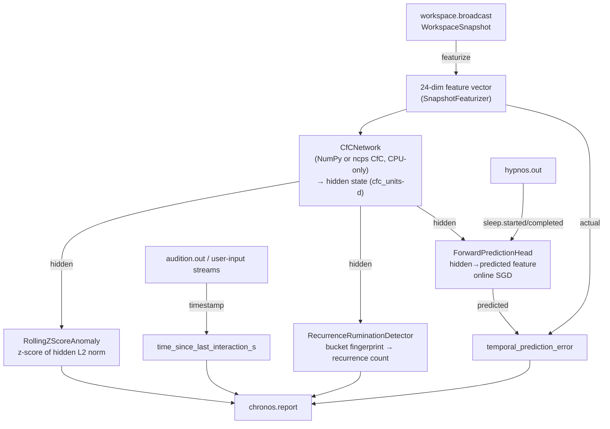

# Chronos

This page describes Chronos, the module that turns the workspace broadcast into a temporal self-model. It covers what Chronos computes, the events it emits, and how to enable and tune it. Read it if you are configuring KAINE, studying the temporal-context signal, or integrating Chronos into another module.

Chronos is part of the base-thesis stack; it is enabled by default in the `thesis_test` profile (`config/profiles/thesis_test.toml`).

## Status

Implemented. With no profile selected, the loader applies the `thesis_test` profile, which enables Chronos (`chronos = true`). The bare `config/kaine.toml` has every module off.

- The CfC backend is chosen by `cfc_backend` in `[chronos]`: `"numpy"` is the shipped default and needs no `torch` or `ncps`; `"torch"` uses `ncps.torch.CfC` and needs the `core` extra.
- The CfC is **CPU-only by policy** regardless of host hardware. The network is small enough that a GPU adds no benefit, and enforcing CPU keeps the cycle tick budget predictable. A warning is logged if the selected device is not `cpu`.
- Forward prediction is off by default (`forward_prediction = false`). It is purely additive and does not change base behaviour when disabled.
- Adaptation of the forward-prediction head is suspended during Hypnos offline cycles.

## Responsibility

In the PP+GWT framing, Chronos is the entity's **temporal self-model**. It tracks when things happen, what patterns repeat, and how surprising recent workspace activity is relative to learned expectations.

On every Syneidesis workspace broadcast, Chronos:

1. **Featurizes the snapshot** — deterministically converts the `WorkspaceSnapshot` into a fixed 24-dimensional float vector.
2. **Steps the CfC** — feeds the feature vector through a stateful Closed-form Continuous-time recurrent network, producing a hidden-state vector that encodes temporally compressed workspace history.
3. **Scores anomaly** — the `RollingZScoreAnomaly` detector computes the z-score of the hidden state's L2 norm against a rolling window of recent norms. A high z-score means temporally unusual activity.
4. **Scores rumination** — the `RecurrenceRuminationDetector` fingerprints the hidden state by quantizing each dimension and hashing, then counts bucket recurrences in a rolling window. Repeated identical or near-identical workspace states flag *rumination*, a welfare-relevant signal that the entity's experience has become stuck.
5. **Measures idle time** — tracks the timestamp of the most recent event on configured user-input streams (default `audition.out`) and reports `time_since_last_interaction_s` (`inf` if no interaction yet). Any event on those streams counts, so in the default `thesis_test` profile, where `general_audition = true`, almost every workspace broadcast carries an `audition.perception` event and the idle clock stays near zero. The idle clock and snapshot delta time use the subjective `entity_clock`, not wall time.
6. **Optionally runs a forward-prediction head** — when `forward_prediction = true`, the head maps the CfC hidden state to a predicted next feature vector. The `temporal_prediction_error` (mean absolute error between the prediction and the actual feature) drives salience in place of the z-score, and the head adapts online.

## Inputs

Chronos subscribes to the workspace broadcast, not raw module streams:

| Bus source | Event / mechanism | Purpose |
|---|---|---|
| `workspace.broadcast` | `on_workspace(snapshot)` | Primary trigger — one `chronos.report` per broadcast |
| `user_input_streams` (default `audition.out`) | Operator speech (see below) | Updates the idle-time clock |
| `hypnos.out` | `hypnos.sleep.started` / `hypnos.sleep.completed` | Suspends / resumes forward-prediction head adaptation |

## Outputs

All events are published to the **`chronos.out`** stream.

| Event type | Payload fields | Salience |
|---|---|---|
| `chronos.report` | `temporal_context`, `anomaly_score`, `habituation_score`, `rumination_detected`, `time_since_last_interaction_s`, `feature_vector`, `temporal_prediction_error` | `baseline_salience` (0.1) normally; `alert_salience` (0.7) when `rumination_detected` is `true` or the anomaly/prediction-error metric exceeds `anomaly_alert_threshold` |

`temporal_context` is the CfC hidden-state vector (length = `cfc_units`). Downstream modules such as [Nous](../09-modules/nous.md) use it as a temporal fingerprint of the current moment.

## What counts as an interaction

Chronos only resets `time_since_last_interaction_s` for speech-path events on an operator channel:

- The event type must be `audition.transcription` (with a non-empty `text` field) or `audition.emotion`.
- The event's `payload.source_label` must be one of the shared operator sources (`live_mic`, `microphone`, `remote`).

`audition.perception`, `audition.prosody`, and speech from seeded, playlist, womb, or screen perception feeds do not count. The social drive can build when the entity is not being addressed.

## Featurizer layouts

`SnapshotFeaturizer` produces a 24-dimension vector under a numbered layout:

- Layout 1 (legacy, default for restored beings): eight source bins plus an overflow bucket in the last bin. Audition events share the overflow bin with Praxis and other unknown sources. Slot 23 is always `0.0`.
- Layout 2 (default for new beings): Audition events contribute their salience to slot 23 instead of the overflow bucket. Praxis and other unknown sources still use the overflow bucket.

Chronos records `featurizer_layout` in its serialized state. A snapshot without the key restores to layout 1, preserving the input semantics the network was trained on. A snapshot with an unknown layout raises an error. The CfC, forward-prediction head, and network plugin seams are unaffected because the vector length stays 24.

## Configuration

Section `[chronos]` in `config/kaine.toml`. For the full reference see the [module configuration appendix](../appendix-a-configuration/modules.md).

| Key | Default | Meaning |
|---|---|---|
| `cfc_backend` | `"numpy"` | CfC backend: `"numpy"` needs no `torch`/`ncps`; `"torch"` uses `ncps` and needs the `core` extra |
| `cfc_units` | `32` | CfC hidden state size; also sets the forward-prediction head input size |
| `baseline_salience` | `0.1` | Salience for routine `chronos.report` events |
| `alert_salience` | `0.7` | Salience when anomaly / rumination fires |
| `anomaly_window` | `64` | Rolling window length (ticks) for the z-score anomaly detector |
| `anomaly_alert_threshold` | `3.0` | Z-score or normalised prediction-error ratio above which `alert_salience` is applied |
| `rumination_window` | `32` | Rolling window for the recurrence detector |
| `rumination_threshold` | `4` | Bucket-count threshold for flagging rumination |
| `rumination_bucket_resolution` | `0.25` | Quantization step for the hidden-state fingerprint |
| `user_input_streams` | `["audition.out"]` | Streams Chronos reads for interactions |
| `interaction_event_types` | `["audition.transcription", "audition.emotion"]` | Event types that count as an interaction when they come from an operator channel |
| `forward_prediction` | `false` | Enable the online-adapting forward-prediction head |
| `prediction_error_window` | `32` | Rolling window (ticks) for normalising `temporal_prediction_error` salience |

## How it works



### Snapshot featurizer (24-dim, deterministic)

The feature vector is assembled from the `WorkspaceSnapshot` without touching torch:

| Dims | Feature |
|---|---|
| 0 | `log1p(num_selected_events)`, clamped at 8 |
| 1–3 | Mean / max / std of event salience scores |
| 4–11 | Salience-weighted source one-hot for 8 known sources (soma, chronos, topos, nous, mnemos, thymos, lingua, praxis); unknown sources overflow into dim 11 |
| 12–19 | Salience-weighted 8-bucket blake2b hash projection of `(source, type)` pairs |
| 20 | `log1p(delta_t_seconds)` since previous snapshot |
| 21 | `1.0` if the workspace is inhibited |
| 22 | `1.0` if `is_experiential` |
| 23 | Reserved (always `0.0`) |

### CfC network

`CfCNetwork` runs either the NumPy CfC step in `kaine/cfc_numpy.py` (`cfc_backend = "numpy"`, shipped default, needs no `torch` or `ncps`) or `ncps.torch.CfC` (`cfc_backend = "torch"`, requires the `core` extra). The two backends compute the same step and match to 1e-5 from the same weights.

All CfC parameters are frozen; the CfC acts as a **feature extractor**, not a trained model. The reservoir is generated in NumPy from a reservoir seed, identically for both backends. For torch, the generated arrays are copied into the ncps module. The `reservoir_seed` is part of the module's serialized state, so a preserved being rebuilds the identical reservoir on revival.

A custom `network` can be injected at boot for substrates such as CL1. When present, Chronos uses the injected network instead of the built-in `CfCNetwork`.

The CfC hidden state accumulates across workspace broadcasts during life, but starts at zero on revive and is never persisted.

### Forward-prediction head (optional)

When `cfc_backend = "torch"`, the head is a single `nn.Linear` layer. With the default `"numpy"` backend, the head is a NumPy readout updated by `sgd_step`. Per tick when enabled:

1. Predict the next feature vector from the prior CfC hidden state.
2. Compute MAE against the actual feature vector → `temporal_prediction_error`.
3. Take one SGD step (`lr=1e-3`) toward the actual feature, guarded against non-finite loss or gradients.
4. Skip adaptation when `_in_hypnos` is true.

When enabled, `temporal_prediction_error` normalised against the rolling-window mean replaces the z-score as the primary salience driver. The z-score and rumination fields remain in the payload for diagnostics.

## Key files

| File | Role |
|---|---|
| `kaine/modules/chronos/module.py` | `Chronos` class: `on_workspace()`, user-input loop, Hypnos loop |
| `kaine/modules/chronos/featurizer.py` | `SnapshotFeaturizer` — 24-dim deterministic feature extraction |
| `kaine/modules/chronos/network.py` | `CfCNetwork` (numpy/torch backend wrapper), `ForwardPredictionHead`, plugin injection |
| `kaine/modules/chronos/anomaly.py` | `RollingZScoreAnomaly` — z-score over hidden-state norms |
| `kaine/modules/chronos/rumination.py` | `RecurrenceRuminationDetector` — quantized-fingerprint recurrence |

## Enabling and use

Add to your local `config/kaine.toml` (do not commit):

```toml
[modules]
chronos = true
```

To enable the forward-prediction head:

```toml
[chronos]
forward_prediction = true
```

No external services are needed. The CfC reservoir is frozen and is rebuilt from its saved `reservoir_seed`. Only the forward-prediction head weights (when enabled), `last_interaction_at`, `user_input_cursors`, and `reservoir_seed` are serialised.

## Zero-persistence note

Chronos persists **no raw workspace events**. `serialize()` writes:

- `last_interaction_at` — a single float timestamp.
- `user_input_cursors` — Redis stream cursor positions.
- `pred_head` — forward-prediction weight/bias tensors, only when forward prediction is enabled.
- `reservoir_seed` — the seed used to reproduce the frozen CfC reservoir.

A snapshot without a seed starts a new reservoir and logs that the reservoir is new. A `pred_head` snapshot whose shape does not match the configured network is rejected. The CfC hidden state is ephemeral and is not serialised; on restart, the CfC begins with a zero hidden state and re-accumulates context from subsequent workspace broadcasts.

## Tests

| File | What it verifies |
|---|---|
| `tests/test_chronos_module.py` | `on_workspace()` event loop, salience logic, Hypnos interaction |
| `tests/test_chronos_featurizer.py` | `SnapshotFeaturizer` determinism, vector layout |
| `tests/test_chronos_network.py` | `CfCNetwork` CPU pinning, parameter count < 100 K, `ForwardPredictionHead` |
| `tests/test_chronos_anomaly.py` | `RollingZScoreAnomaly` empty-window and outlier cases |
| `tests/test_chronos_rumination.py` | `RecurrenceRuminationDetector` threshold, habituation score |
| `tests/systems/test_chronos_subsystem.py` | Redis-backed subsystem integration |

## Spec and related

- OpenSpec: [`openspec/specs/chronos/spec.md`](../../openspec/specs/chronos/spec.md)
- OpenSpec (predictive): [`openspec/specs/chronos-predictive/spec.md`](../../openspec/specs/chronos-predictive/spec.md)
- Related modules: [Nous](../09-modules/nous.md), [Hypnos](../09-modules/hypnos.md), [Soma](../09-modules/soma.md)
- Cognitive cycle: [The cognitive cycle](../08-cognitive-cycle/README.md)
