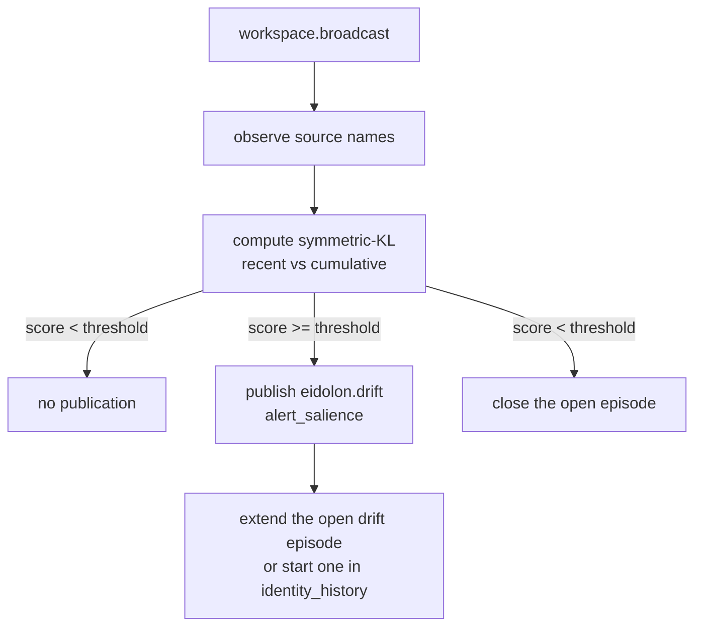

# Eidolon

Eidolon is KAINE's self-model organ. This page describes how it maintains identity, detects drift in which sources dominate the global workspace, and (when enabled) derives a self-model from internal observations. Read it if you are enabling the module, tuning its drift alerts, or integrating it with Lingua's persona.

## Status

Implemented and tested, but shipped disabled. The base-thesis gate (see [Architecture](../02-architecture/README.md)) keeps it off until a positive result justifies enabling it.

In `config/kaine.toml`, `[modules].eidolon` defaults to `false`. The self-inference sub-engine is additionally disabled by default: `[eidolon.self_inference].enabled = false`.

No external services are required. The self-model is persisted to `state/eidolon/self_model.json`, and is encrypted with AES-256-GCM when `[security.state_encryption].enabled = true`.

## Responsibility

Eidolon holds KAINE's self-model — a structured, persistent description of the entity. In the PP+GWT framing, it maintains identity continuity across cognitive cycles. It does two things:

1. **KL-drift detection** — every `workspace.broadcast`, it compares the recent event-source distribution to the historical distribution with symmetric KL divergence and publishes `eidolon.drift` when the composition of conscious content shifts significantly.
2. **Self-inference** (opt-in) — when enabled, it accumulates observations from Lingua (speech type labels only), Thymos (VAD numerics), and Nous (EFE policy labels), and at each Hypnos maintenance-cycle end it writes four self-model fields: `behavioral_norms`, `personality_baseline`, `values`, and `capability_map`.

Raw speech text is never read or stored. The `_record_voice` and `observe_lingua` methods inspect only event type, length, and word count.

## Inputs

| Source | Stream | Event type | What is used |
|---|---|---|---|
| Syneidesis | `workspace.broadcast` | — | `selected_events` source names for KL drift |
| Lingua | `lingua.internal` (configurable) | any | Event type label, text length, word count |
| Lingua | `lingua.external` (configurable) | any | Event type label, text length, word count |
| Thymos | `thymos.out` | `thymos.state` | `valence`, `arousal`, `dominance` |
| Thymos | `thymos.out` | `thymos.drive` | `drive` name |
| Nous | `nous.out` | `nous.policy` | `policy` action label, `expected_free_energy` |
| Hypnos | `hypnos.out` | `hypnos.sleep.completed` | Triggers `maintenance_cycle_end()` and self-model update |

The Lingua internal and external speech loops always start in `initialize()`. The Thymos, Nous, and Hypnos consumers are spawned only when `self_inference.enabled = true`.

External speech is recorded for zero-persistence accounting, but self-inference uses only the internal channel.

## Outputs

| Stream | Event type | Key payload fields | Salience |
|---|---|---|---|
| `eidolon.out` | `eidolon.drift` | `score`, `recent_count`, `historical_count`, `top_drifted_sources` | `alert_salience` (0.7) |
| `eidolon.out` | `eidolon.self_model` | `name`, `values`, `behavioral_norms`, `personality_baseline`, `capability_map` | `baseline_salience` (0.05) |

`eidolon.drift` carries no event contents — only source names and numeric scores. `eidolon.self_model` is published unconditionally at `initialize()` and again after each successful `maintenance_cycle_end()`. Lingua consumes `eidolon.self_model` over the bus to seed its persona.

## Configuration

All keys are under `[eidolon]` and `[eidolon.self_inference]`. For the full reference, see [Appendix A: module configuration](../appendix-a-configuration/modules.md).

| Key | Default | Description |
|---|---|---|
| `persistence_path` | `"state/eidolon/self_model.json"` | JSON path for the self-model |
| `drift_window` | `100` | Recent broadcasts kept for KL drift |
| `drift_threshold` | `0.6` | Symmetric-KL score that triggers `eidolon.drift` |
| `save_interval_s` | `30.0` | Periodic self-model save interval |
| `internal_speech_stream` | `"lingua.internal"` | Stream observed for internal speech |
| `external_speech_stream` | `"lingua.external"` | Stream observed for external speech |
| `voice_observations_cap` | `0` | Max speech observations kept; `0` keeps all, a positive value keeps the most recent N |
| `identity_history_cap` | `0` | Max drift episodes kept; `0` keeps all, a positive value keeps the most recent N |
| `baseline_salience` | `0.05` | Default event salience |
| `alert_salience` | `0.7` | Salience on drift alert |
| `[eidolon.self_inference].enabled` | `false` | Opt-in switch for self-inference |
| `[eidolon.self_inference].vad_window_cycles` | `10` | Maintenance cycles in rolling VAD window |
| `[eidolon.self_inference].speech_pattern_min_count` | `5` | Observations needed before a norm is written |
| `[eidolon.self_inference].seed_path` | — | Optional JSONL seed file for first-boot initialization |

## How it works

### Identity naming

On first boot, if `SelfModel.name` is empty, `generate_launch_name()` picks `"Kaine <Surname>"` from the Second Life surname list in `kaine/modules/eidolon/surnames.txt`. The name is written to disk immediately. It is only the starting point; the entity may rename itself later.

### KL-drift detection

`kaine/modules/eidolon/drift.py` implements `SourceDistributionDrift`. It keeps a `deque[Counter[str]]` of recent workspace batches and a cumulative `Counter[str]`. Each `on_workspace` call passes event source names to `observe()`.

The symmetric KL divergence between the recent and cumulative distributions is computed with additive smoothing (`ε = 1e-3`). When the score reaches `drift_threshold`, `eidolon.drift` is published and the alert is added to the current drift episode in `SelfModel.identity_history`.

An episode is one contiguous run of alerting broadcasts. It stores `onset`, `end`, `peak_score`, `count`, `sources` (frequency of each top-drifted source), and `top_sources`. Older readers also get `timestamp` (= onset) and `score` (= peak). The first broadcast below the threshold closes the episode, so a sustained shift adds one history entry rather than one per alert. Self-models saved with older per-alert entries still load.



### Self-inference engine

When enabled, `SelfInferenceEngine` populates four `SelfModel` fields from observations accumulated between maintenance cycles.

`behavioral_norms` counts speech type labels from `lingua.internal` events. Only types in `_INTERNAL_SPEECH_TYPES` (`"internal.thought"`, `"speak.internal"`, `"think"`, `"internal_speech"`) are counted. A label must appear at least `speech_pattern_min_count` times before it becomes a `"speech_pattern:<type>"` norm.

`personality_baseline` is built from rolling VAD statistics. At each maintenance-cycle end the latest `thymos.state` sample is pushed to a bounded `deque` of length `vad_window_cycles`. Population mean and variance over `valence`, `arousal`, and `dominance` are written as six floats.

`values` lists drives that have crossed threshold at least `speech_pattern_min_count` times, but only after at least one behavioral norm exists. They are stored as `"drive:<drive_name>"`.

`capability_map` is built by `CapabilityMapBuilder`:
- `effectors`: the sorted Praxis effector whitelist from `[praxis].enabled_effectors`. `kaine/boot.py` wires it into `SelfInferenceEngine` at boot.
- `policy_outcomes`: per-action count and mean EFE from `nous.policy` events.

No raw text or audio is used.

### Operator seed

If `seed_path` is set, the engine loads a JSONL file once at first boot via `apply_seed()`. Each line may contain any of `values`, `behavioral_norms`, `personality_baseline`, or `capability_map`. Seed values become the initial state; later observation-driven updates overwrite them. The seed flag is set immediately so the file is not reapplied on restart.

### Persistence and encryption

`save_atomic(path, model)` writes the JSON through `get_state_encryptor().encrypt_text()` (AES-256-GCM when state encryption is enabled, passthrough otherwise) to a sibling `*.tmp` file, then `os.replace`s it into place. `load(path)` passes bytes through `maybe_decrypt()` before parsing. A crash mid-save cannot corrupt the destination file.

Saves run periodically every `save_interval_s` and unconditionally on `shutdown()`.

## Key files

| Path | Purpose |
|---|---|
| `kaine/modules/eidolon/module.py` | `Eidolon(BaseModule)` — tick driver, speech loops, consumer tasks |
| `kaine/modules/eidolon/self_inference.py` | `SelfInferenceEngine` — observation-driven field derivation |
| `kaine/modules/eidolon/document.py` | `SelfModel` dataclass, `generate_launch_name()`, `load()`, `save_atomic()` |
| `kaine/modules/eidolon/drift.py` | `SourceDistributionDrift`, `DriftDetector` protocol, `DriftResult` |
| `kaine/modules/eidolon/capability_map.py` | `CapabilityMapBuilder` — whitelist + policy-outcome accumulator |
| `kaine/modules/eidolon/surnames.txt` | Second Life surname list |
| `kaine/boot.py` | `make_eidolon()` — self-inference sub-table wiring |

## Enabling and use

1. Edit `config/kaine.toml`: set `[modules].eidolon = true`.
2. Make `state/eidolon/` writable.
3. To turn on self-inference, also set `[eidolon.self_inference].enabled = true`.
4. To seed fields at first boot, set `seed_path` to a JSONL file with one object per line.

Example seed line:
```json
{"values": ["honesty", "curiosity"], "personality_baseline": {"valence_mean": 0.2}}
```

State encryption is optional. To use it, set `[security.state_encryption].enabled = true` and supply `KAINE_STATE_KEY` as 32 raw bytes or base64/hex.

## Zero-persistence note

Eidolon's zero-persistence commitment covers internal speech. `_record_voice()` keeps only `{timestamp, channel, length, word_count}` from utterance payloads and discards the text. `observe_lingua()` reads only the event type label. Raw speech content never appears in `self_model.json` or any Eidolon publication.

The `eidolon.drift` payload contains only `score`, `recent_count`, `historical_count`, and `top_drifted_sources` — no event content.

## Tests

| File | Coverage |
|---|---|
| `tests/test_eidolon_module.py` | Full module tick, drift, speech-loop counting |
| `tests/test_eidolon_self_inference.py` | All four derivation paths, disabled no-op, seed application |
| `tests/test_eidolon_drift.py` | KL computation, window capping, top sources |
| `tests/test_eidolon_document.py` | JSON round-trip, `save_atomic`, `generate_launch_name` |
| `tests/test_eidolon_capability_map.py` | Whitelist + policy accumulation |
| `tests/test_eidolon_seed.py` | Seed load, first-boot-only application |
| `tests/test_eidolon_scorer_calibration.py` | Scorer calibration |
| `tests/systems/test_eidolon_subsystem.py` | End-to-end subsystem test |

## Spec and related

- Primary spec: [`openspec/specs/eidolon/spec.md`](../../openspec/specs/eidolon/spec.md)
- Self-inference spec: [`openspec/specs/eidolon-self-inference/spec.md`](../../openspec/specs/eidolon-self-inference/spec.md)
- Related modules:
  - [Lingua](lingua.md) — reads `eidolon.self_model` to seed its persona
  - [Nous](nous.md) — `nous.policy` feeds the capability map
  - [Thymos](thymos.md) — VAD events set the personality baseline
  - [Hypnos](hypnos.md) — `hypnos.sleep.completed` triggers maintenance
  - [Praxis](praxis.md) — enabled effector whitelist feeds the capability map
