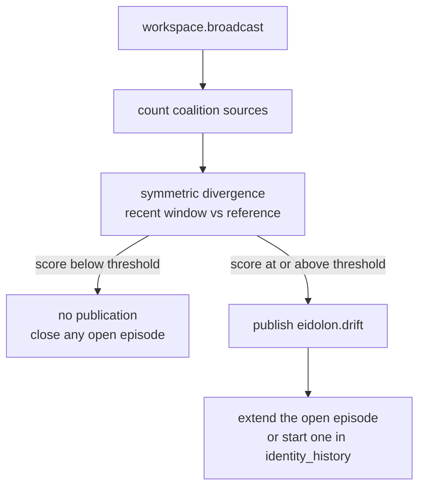

# Eidolon

Eidolon is KAINE's self-model module. It keeps a persisted model of the entity (a name, values, behavioural norms, a personality baseline, a capability map, and an identity history) and watches for drift in which modules supply the broadcast coalitions. The design is inspired by Metzinger's self-model theory (Metzinger 2003) and draws on the self-referential processing of cortical midline structures (Northoff and Bermpohl 2004); the drift detector uses a symmetric Kullback-Leibler divergence (Kullback and Leibler 1951). Read this page if you are enabling the module, tuning its drift alerts, or connecting it to the language organ's persona.

## Status

Eidolon is built and tested, and held: it is off in the shipped `config/kaine.toml` (`[modules].eidolon = false`) and in the base-thesis `thesis_test` profile. The [module-addition study](../15-experiments/ignition-study.md) (the ignition study in code) adds it fourth in its default order of six: Mnemos, Phantasia, Nous, Eidolon, Empatheia, Vox. In the paper's terms it adds a new kind of candidate to the competition, the self-model's drift alerts and self-model updates.

The self-inference engine is a second, separate switch: `[eidolon.self_inference].enabled = false` in the shipped configuration. The study overlay does not turn it on, so unless the operator file enables it, a study branch with Eidolon runs the drift detector and the launch name only.

Eidolon needs no external service. The self-model is saved to `state/eidolon/self_model.json`, encrypted with AES-256-GCM when `[security.state_encryption].enabled = true`.

## What it does

1. Drift detection. On every broadcast, accessed or inhibited, Eidolon counts the `source` of each coalition member. It compares the source distribution of the last `drift_window` broadcasts with a reference distribution built from every broadcast that has left that window, using the symmetric (Jeffreys) Kullback-Leibler divergence. When the score reaches `drift_threshold` it publishes `eidolon.drift`. The two distributions never overlap, so a shift is not diluted by its own counts. The score stays at 0.0 until the reference holds at least `drift_window` broadcasts, which takes about twice the window after boot, because the detector's counts are not saved across restarts.
2. Self-inference, when enabled. Eidolon accumulates observations from the language organ (event-type labels only), from Thymos (valence, arousal and dominance numbers, and drive crossings) and from Nous (policy labels and expected free energy). At the end of each sleep it rewrites four self-model fields: `behavioral_norms`, `personality_baseline`, `values` and `capability_map`.

Eidolon never reads or stores the text of the entity's speech. Its speech loops keep the event type, the text length and the word count of each utterance.

## Inputs

| Source | Stream | Event type | What is used |
|---|---|---|---|
| Syneidesis | `workspace.broadcast` | snapshot | The `source` of every coalition member, for drift |
| Lingua | `lingua.internal` (configurable) | any | Event type, text length, word count |
| Lingua | `lingua.external` (configurable) | any | Event type, text length, word count |
| Thymos | `thymos.out` | `thymos.state` | `state.valence`, `state.arousal`, `state.dominance` |
| Thymos | `thymos.out` | `thymos.drive` | `drive` name |
| Nous | `nous.out` | `nous.policy` | `policy` label and `expected_free_energy` |
| Hypnos | `hypnos.out` | `hypnos.sleep.completed` | Triggers the self-model update |

The two speech loops always run. The Thymos, Nous and Hypnos consumers start only when self-inference is enabled. External speech is counted, but self-inference uses only the internal channel.

## Outputs

| Stream | Event type | Payload fields | Intensity |
|---|---|---|---|
| `eidolon.out` | `eidolon.drift` | `score`, `recent_count`, `historical_count` (every source counted since boot), `reference_count` (sources in the reference), `top_drifted_sources` | `alert_salience` (0.7) |
| `eidolon.out` | `eidolon.self_model` | `name`, `values`, `behavioral_norms`, `situation_facts`, `personality_baseline`, `capability_map` | `baseline_salience` (0.05) |

`eidolon.drift` carries source names and numbers only. Eidolon publishes `eidolon.self_model` once at `initialize()`, again after each self-inference update, and whenever a situation fact is added. Lingua reads it from the bus to seed its persona, so a language organ in a separate process sees the same persona.

## Configuration

All keys are under `[eidolon]` and `[eidolon.self_inference]`. The full reference is in [Appendix A: module configuration](../appendix-a-configuration/modules.md).

| Key | Type | Default | Meaning |
|---|---|---|---|
| `persistence_path` | string | `"state/eidolon/self_model.json"` | Where the self-model is saved |
| `drift_window` | int | `100` | Number of recent broadcasts in the drift window |
| `drift_threshold` | float | `0.6` | Symmetric divergence at which `eidolon.drift` is published |
| `save_interval_s` | float | `30.0` | Seconds between periodic saves (wall-clock) |
| `internal_speech_stream` | string | `"lingua.internal"` | Stream read for internal speech |
| `external_speech_stream` | string | `"lingua.external"` | Stream read for external speech |
| `voice_observations_cap` | int | `0` | Speech observations kept; `0` keeps all, a positive value keeps the newest N |
| `identity_history_cap` | int | `0` | Drift episodes kept; `0` keeps all, a positive value keeps the newest N |
| `baseline_salience` | float | `0.05` | Intensity of `eidolon.self_model` |
| `alert_salience` | float | `0.7` | Intensity of `eidolon.drift` |
| `[eidolon.self_inference].enabled` | bool | `false` | Turns self-inference on |
| `[eidolon.self_inference].vad_window_cycles` | int | `10` | Sleeps in the rolling valence, arousal and dominance window |
| `[eidolon.self_inference].speech_pattern_min_count` | int | `5` | Observations needed before a speech type becomes a norm, or a drive becomes a value |
| `[eidolon.self_inference].seed_path` | string | unset | Optional JSONL file applied once at first boot |

The factory rejects any other key in either table.

## How it works

### Launch name

On first boot, if the self-model has no name, `generate_launch_name()` picks `"Kaine <Surname>"` from the Second Life surname list in `kaine/modules/eidolon/surnames.txt` and saves it at once. The name is a starting point that the entity may later replace.

### Drift detection

`SourceDistributionDrift` in `kaine/modules/eidolon/drift.py` keeps the recent window as a deque of per-broadcast source counts. When a broadcast pushes the oldest batch out of the window, that batch is added to the reference counts, which keep growing for the life of the process. Both distributions are smoothed additively (epsilon 1e-3) before the divergence is computed, and the five sources that contribute most are reported as `top_drifted_sources`.

Each alert is recorded in `SelfModel.identity_history` as part of a drift episode. An episode is one contiguous run of alerting broadcasts and stores `onset`, `end`, `peak_score`, `count`, `sources` (how often each source was among the top drifted sources) and `top_sources`; it also carries `timestamp` (the onset) and `score` (the peak) for readers of older entries. The first broadcast below the threshold closes the episode, so a sustained shift adds one entry. Self-models saved with older per-alert entries still load.



### Self-inference engine

When enabled, `SelfInferenceEngine` fills four fields from what it observed between sleeps.

`behavioral_norms` counts the event types of internal speech. Only the types in `_INTERNAL_SPEECH_TYPES` count (`"internal_speech"`, which is what Lingua publishes, and the labels `"internal.thought"`, `"speak.internal"` and `"think"`). A type that reaches `speech_pattern_min_count` becomes the norm `"speech_pattern:<type>"`.

`personality_baseline` holds six numbers: the population mean and variance of valence, arousal and dominance over a deque of `vad_window_cycles` samples. At the end of each sleep the latest `thymos.state` sample seen since the previous sleep is pushed onto the deque.

`values` lists the drives that crossed their threshold at least `speech_pattern_min_count` times, stored as `"drive:<name>"`. Values are derived only when at least one norm exists.

`capability_map` comes from `CapabilityMapBuilder`. Its `effectors` entry is the sorted Praxis effector whitelist (`[praxis].enabled_effectors`), which `_wire_eidolon_capabilities` in `kaine/boot/wiring.py` hands to the engine at boot when both modules are registered. Its `policy_outcomes` entry holds the count and mean expected free energy of each Nous policy label.

### Operator seed

If `seed_path` is set, the engine reads the JSONL file once at first boot through `apply_seed()`. Each line may set any of `values`, `behavioral_norms`, `personality_baseline` and `capability_map`. Seed values are the starting state, and later observation-driven updates overwrite them. The seed is marked as applied before the file is read, so it is not reapplied after a restart.

### Situation facts

`ensure_situation_fact(text)` records a fact about the being's situation that it is told, saves the self-model and publishes it at once. The individuation producer uses it (`kaine/cycle/__main__.py`), falling back to Lingua when Eidolon is not registered. Situation facts are separate from values and norms and never touch drift or the identity history.

### Persistence and encryption

`save_atomic(path, model)` encrypts the JSON through `get_state_encryptor().encrypt_text()` (AES-256-GCM when state encryption is on, unchanged otherwise), writes it to a sibling temporary file and moves it into place with `os.replace`, so a crash mid-save cannot corrupt the saved file. `load(path)` passes the bytes through `maybe_decrypt()` before parsing. Saves run every `save_interval_s` and on `shutdown()`.

## Key files

| Path | Purpose |
|---|---|
| `kaine/modules/eidolon/module.py` | `Eidolon(BaseModule)`: drift, speech loops, consumer tasks, publication |
| `kaine/modules/eidolon/self_inference.py` | `SelfInferenceEngine` |
| `kaine/modules/eidolon/document.py` | `SelfModel`, `generate_launch_name()`, `load()`, `save_atomic()` |
| `kaine/modules/eidolon/drift.py` | `SourceDistributionDrift`, the `DriftDetector` protocol, `DriftResult` |
| `kaine/modules/eidolon/capability_map.py` | `CapabilityMapBuilder` |
| `kaine/modules/eidolon/surnames.txt` | Surname list for the launch name |
| `kaine/boot/factories/eidolon.py` | `make_eidolon()` and the self-inference sub-table |

## Enabling

1. In the operator file `config/kaine.operator.toml`, set `[modules].eidolon = true`. The operator file merges last. The same flag in the shipped `config/kaine.toml` would be overridden by the `thesis_test` profile, which the loader applies when no profile is selected.
2. Make sure `state/eidolon/` is writable.
3. To turn on self-inference, also set `[eidolon.self_inference].enabled = true`.
4. To seed fields at first boot, set `seed_path` to a JSONL file with one object per line, for example:

```json
{"values": ["honesty", "curiosity"], "personality_baseline": {"valence_mean": 0.2}}
```

State encryption is optional. To use it, set `[security.state_encryption].enabled = true` and supply `KAINE_STATE_KEY` as 32 raw bytes or in base64 or hex.

## What Eidolon keeps

From each utterance `_record_voice()` keeps `{timestamp, channel, length, word_count}` and discards the text, and `observe_lingua()` reads only the event type. No speech text reaches `self_model.json` or any Eidolon event. The `eidolon.drift` payload holds `score`, `recent_count`, `historical_count`, `reference_count` and `top_drifted_sources`.

## Evaluation

The offline suite's self-model accuracy battery (`kaine/evaluation/benchmarks/instrument_runners/self_model_runner.py`) exercises Eidolon offline.

## Tests

| File | Coverage |
|---|---|
| `tests/test_eidolon_module.py` | Module tick, drift, speech-loop counting |
| `tests/test_eidolon_self_inference.py` | The four derivations, the disabled no-op, seed application |
| `tests/test_eidolon_drift.py` | Divergence, window handling, top sources |
| `tests/test_eidolon_document.py` | JSON round trip, `save_atomic`, `generate_launch_name` |
| `tests/test_eidolon_capability_map.py` | Whitelist and policy accumulation |
| `tests/test_eidolon_seed.py` | Seed loading and first-boot-only application |
| `tests/test_eidolon_scorer_calibration.py` | Scorer calibration |
| `tests/systems/test_eidolon_subsystem.py` | End-to-end subsystem test |

## Spec and related

- Primary spec: [`openspec/specs/eidolon/spec.md`](../../openspec/specs/eidolon/spec.md)
- Self-inference spec: [`openspec/specs/eidolon-self-inference/spec.md`](../../openspec/specs/eidolon-self-inference/spec.md)
- Related modules: [Lingua](lingua.md) reads `eidolon.self_model` for its persona; [Nous](nous.md) supplies `nous.policy` for the capability map; [Thymos](thymos.md) supplies the samples behind the personality baseline; [Hypnos](hypnos.md) triggers the update with `hypnos.sleep.completed`; [Praxis](praxis.md) supplies the effector whitelist.
