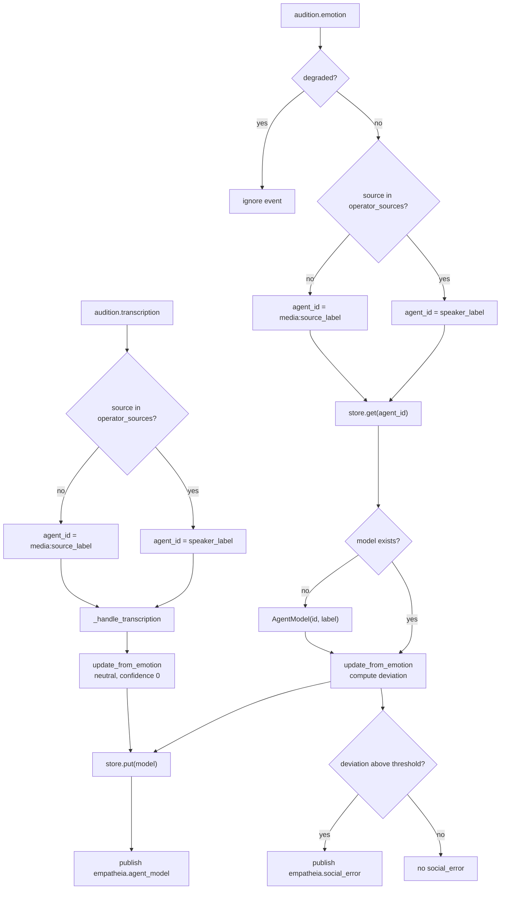

# Empatheia

Empatheia is KAINE's social-cognition module. It builds a model of each agent the entity hears from that agent's tone of voice, tracks how familiar the agent is, and reports a social prediction error when an agent's expressed emotion departs from its usual pattern. The construct is theory of mind, the attribution of mental states to others (Premack and Woodruff 1978), and the brain function it draws on is mentalizing (Frith and Frith 2006). This page is for operators who enable the module, tune its thresholds, or connect it to Thymos's affect coupling.

## Status

Empatheia is built and tested, and held: it is off in the shipped `config/kaine.toml` (`[modules].empatheia = false`) and in the base-thesis `thesis_test` profile. The [module-addition study](../15-experiments/ignition-study.md) (the ignition study in code) adds it fifth in its default order of six: Mnemos, Phantasia, Nous, Eidolon, Empatheia, Vox. The study overlay gives each line of the study its own agent collection (`[empatheia].collection`).

- It reads Audition's `audition.emotion` events (the tone of voice) and, when speech-to-text is on, `audition.transcription`. In the base-thesis form speech-to-text is off, so tone events are its only input.
- The production backend is Qdrant, on the same instance as Mnemos, in the collection `empatheia_agents`.
- The in-memory backend (`backend = "inmemory"`) needs no external service and is used in tests.
- Agent identity is coarse. Every operator-facing channel maps to one agent, named by `speaker_label`, and every other channel gets its own `media:<channel>` agent. There is no speaker diarization.

## What it does

Empatheia keeps a probabilistic model of each agent and publishes two kinds of event.

1. `empatheia.agent_model` reports numeric facts about one agent (familiarity, reliability, interaction count) after every update. Thymos reads the familiarity when `[thymos.coupling].enabled = true`.
2. `empatheia.social_error` is published when an observed emotion deviates from the agent's model by more than `deviation_threshold`. It enters the workspace competition as a candidate whose intensity grows with the deviation, and it carries no behavioural data and no transcript text.

Empatheia stores emotion histograms and numeric summaries only. `_handle_transcription()` ignores the `text` field: it folds in a neutral observation with zero confidence, which moves the histogram toward neutral by the update rate (0.2) and counts one interaction.

`on_workspace()` does nothing. Empatheia works from Audition's events and does not read the broadcast.

## Inputs

| Source | Stream | Event type | Fields used |
|---|---|---|---|
| Audition | `audition.out` | `audition.emotion` | `category`, `confidence`, `prediction_error`, `source_label`, `degraded` |
| Audition | `audition.out` | `audition.transcription` | `source_label` (the `text` field is ignored) |

A background task, `_audition_consumer_loop`, reads these events. An emotion event marked `degraded = true` (the tone model did not run) is skipped. The event Audition publishes when the tone model raises an error carries no `degraded` flag, so it is folded in as a neutral observation with zero confidence.

## Outputs

| Stream | Event type | Payload fields | Intensity |
|---|---|---|---|
| `empatheia.out` | `empatheia.agent_model` | `agent_id`, `agent_label`, `familiarity`, `reliability`, `interaction_count`, and `source_label` of the triggering audio event | `baseline_salience + familiarity × (alert_salience − baseline_salience)` |
| `empatheia.out` | `empatheia.social_error` | `agent_id`, `agent_label`, `salience`, `deviation_magnitude` | `baseline_salience + deviation × (alert_salience − baseline_salience)`, capped at 1 |

Both payloads hold identifiers and numbers only.

## Configuration

All keys are under `[empatheia]` and `[empatheia.qdrant]`. The full reference is in [Modules](../appendix-a-configuration/modules.md).

| Key | Type | Default | Meaning |
|---|---|---|---|
| `backend` | string | `"qdrant"` | `"qdrant"` or `"inmemory"` (the constructor default is `"inmemory"`; the shipped file sets `"qdrant"`) |
| `collection` | string | `"empatheia_agents"` | Qdrant collection for agent profiles |
| `speaker_label` | string | `"operator"` | Agent id for the operator-facing channels |
| `operator_sources` | list of strings | `["live_mic", "microphone", "remote"]` | Channels attributed to the operator agent; any other channel becomes `media:<channel>`. Volition also uses this key to decide which Audition sources are user utterances. Chronos uses a fixed constant and ignores the key. |
| `deviation_threshold` | float | `0.5` | Deviation above which `empatheia.social_error` is published; must lie in (0, 1] |
| `baseline_salience` | float | `0.15` | Lowest intensity of Empatheia's events |
| `alert_salience` | float | `0.6` | Intensity at full familiarity or full deviation |
| `[empatheia.qdrant].host` | string | `"127.0.0.1"` | Qdrant host |
| `[empatheia.qdrant].port` | int | `6533` | Qdrant port |
| `[empatheia.qdrant].api_key` | string | unset | Qdrant API key. The cycle resolves it from `KAINE_QDRANT_API_KEY` first, then from `[qdrant].api_key` in `config/secrets.toml`. The Qdrant backend refuses to start without it. |

## How it works

### The agent model

`kaine/modules/empatheia/agent.py` defines `AgentModel`:

| Field | Type | Meaning |
|---|---|---|
| `id` | `str` | Stable agent identifier |
| `label` | `str` | Display name |
| `emotion_histogram` | `dict[str, float]` | Exponentially weighted frequency of each of eight emotion categories |
| `behavioral_summary` | `dict[str, float]` | Running averages `mean_confidence` and `mean_prediction_error` |
| `reliability` | `float` in [0, 1] | Falls on out-of-character observations and recovers otherwise |
| `interaction_count` | `int` | Observations folded in |
| `first_seen` / `last_seen` | `float` | Unix timestamps |

Familiarity combines how often the agent has been heard with how many categories it has shown:

```
count_score = 1 − exp(−interaction_count / 50)
coverage    = (categories seen at least once) / 8
familiarity = (count_score + coverage) / 2
```

Familiarity rises toward 1 as interactions accumulate and categories appear. After 50 interactions `count_score` is about 0.63, so an agent that has shown all eight categories by then has a familiarity of about 0.82.

`update_from_emotion()` works in this order:

1. It computes the deviation against the model before the update, as `(1 − histogram[category]) × confidence`. The first observation of an agent has deviation 0.
2. It blends the observed category into the histogram with weight 0.2.
3. It updates `mean_confidence` and `mean_prediction_error` with the same weight.
4. It lowers `reliability` by 0.2 if the deviation exceeds the threshold and raises it by 0.1 otherwise.
5. It returns the deviation so that the module can decide whether to publish `social_error`.

### Emotion categories

The eight categories match Audition's tone model: `angry`, `disgusted`, `fearful`, `happy`, `neutral`, `sad`, `surprised`, `unknown`. A category outside this set is stored as `"unknown"`.

### Processing flow



An event with no `source_label` is attributed to the operator agent.

### Storage backends

`InMemoryAgentStore` keeps a `dict[str, AgentModel]` in the process and serializes it losslessly to JSON.

`QdrantAgentStore` uses the Qdrant instance that Mnemos uses. It stores each profile's JSON in the point payload under `"profile_json"`, keyed by agent id, alongside an embedding of the behavioural summary from the shared `[embedding]` text embedder, kept for later similarity search. A local cache serves `get()` without a round trip, and `serialize()` snapshots that cache.

### Fork and merge

`EmpatheiaMergeStrategy` in `kaine/lifecycle/strategies.py`, registered by `default_strategies()` under `empatheia`, merges two branches' profiles:

- `interaction_count` is summed, since both branches heard real interactions.
- `emotion_histogram`, `behavioral_summary` and `reliability` are averaged, weighted by interaction count.
- `first_seen` takes the earlier value and `last_seen` the later.

The merged profiles travel in the merged snapshot. Restoring it loads them into the store's cache, which `get()` and `all_profiles()` read first, and each profile reaches Qdrant on its next update. See [Forks and merges](../12-forks-and-merges.md#empatheiamergestrategy). For preservation, `export_preservation_state()` captures every profile and `import_preservation_state()` re-embeds and restores them.

### Thymos coupling

When `[thymos.coupling].enabled = true` (it ships `false`), Thymos caches the `familiarity` of each `empatheia.agent_model` and folds a perceived speaker emotion into its own appraisal with the weight

```
weight = min(coupling_ceiling, coupling_base + familiarity × coupling_familiarity_gain)
```

with `coupling_base = 0.05`, `coupling_familiarity_gain = 0.10` and `coupling_ceiling = 0.15` by default. The perceived emotion enters the appraisal and is never written to the entity's valence, arousal or dominance directly. See [Thymos](thymos.md).

Each `empatheia.agent_model` carries the `source_label` of the audio event that updated the model. Thymos caches the familiarity under that label as well as under `agent_id` (`operator` or `media:<channel>`), and looks it up by the perceived emotion's `source_label`, so a familiar channel raises the weight.

## Key files

| Path | Purpose |
|---|---|
| `kaine/modules/empatheia/module.py` | `Empatheia(BaseModule)`: Audition consumer, dispatch, publication |
| `kaine/modules/empatheia/agent.py` | `AgentModel`: histogram, updates, `familiarity()`, deviation |
| `kaine/modules/empatheia/store.py` | `AgentStore` protocol, `InMemoryAgentStore`, `QdrantAgentStore` |
| `kaine/lifecycle/strategies.py` | `EmpatheiaMergeStrategy` |
| `kaine/boot/factories/empatheia.py` | `make_empatheia()` and the Qdrant sub-table |

## Enabling

1. Start the Qdrant container that Mnemos uses, or set `backend = "inmemory"`.
2. In the operator file `config/kaine.operator.toml`, set `[modules].empatheia = true`. The same flag in the shipped `config/kaine.toml` would be overridden by the `thesis_test` profile, which the loader applies when no profile is selected.
3. Optionally turn on Thymos coupling with `[thymos.coupling].enabled = true`.

To try the agent model by hand:

```python
from kaine.modules.empatheia.agent import AgentModel
from kaine.modules.empatheia.store import InMemoryAgentStore

store = InMemoryAgentStore()
await store.initialize()
model = AgentModel(id="operator", label="operator")
model.update_from_emotion("happy", confidence=0.9, prediction_error=0.1)
print(model.familiarity())  # about 0.072 after one interaction
```

## What Empatheia keeps

- `_handle_transcription()` ignores the `text` field.
- `_handle_emotion()` reads the `category` string and two numbers.
- `AgentModel.to_dict()` serializes the histogram, the behavioural summary and the numeric fields.
- The `empatheia.social_error` payload holds `agent_id`, `agent_label`, `salience` and `deviation_magnitude`.

## Tests

| File | Coverage |
|---|---|
| `tests/test_empatheia_agent.py` | Updates, deviation, familiarity growth, weighted averages |
| `tests/test_empatheia_store.py` | `InMemoryAgentStore` operations; `QdrantAgentStore` with a mocked client |
| `tests/test_empatheia_merge.py` | Weighted merge, count sum, edge cases |
| `tests/test_empatheia_merge_wired.py` | `ForkManager.merge` uses the Empatheia strategy by default |
| `tests/test_empatheia_module.py` | Module tick; emotion to agent model; transcription without text; the social-error threshold |

## Spec and related

- Primary spec: `openspec/specs/empatheia/spec.md`
- Related modules: [Audition](audition.md) publishes `audition.emotion`; [Thymos](thymos.md) reads familiarity for affect coupling; [Mnemos](mnemos.md) shares the Qdrant instance.
