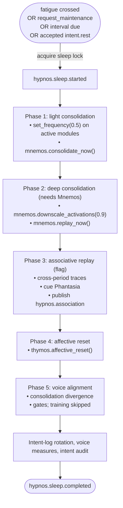

# Hypnos

Hypnos is the sleep analog: a fatigue-triggered offline period during which the four predictive processors stop adapting their forward models, and at whose end affect and drives return to baseline. This page is the module reference. It covers what starts a sleep, what a sleep does in the base-thesis form and with the held modules, the events Hypnos publishes, and its configuration. The full pipeline is described in [Sleep and maintenance](../10-sleep/README.md), and the gated training phase in [Voice alignment](../10-sleep/voice-alignment.md).

## Status

Hypnos ships disabled in the default config (`[modules].hypnos = false` in `config/kaine.toml`). The `thesis_test` profile enables it, because fatigue-triggered rest and the affective reset are part of the base-thesis form.

Three parts of the pipeline stay off unless an operator turns them on. Associative replay needs `[hypnos.consolidation].associative_replay = true` and Phantasia. Voice alignment needs `[hypnos.voice_alignment].enabled = true` and the environment variable `KAINE_VOICE_ALIGNMENT_OPERATOR_APPROVED=1`, and even then it trains nothing, because no validated preference source exists yet (see [Voice alignment](../10-sleep/voice-alignment.md)). Memory consolidation and replay need Mnemos.

## What a sleep is

A sleep runs between a `hypnos.sleep.started` and a `hypnos.sleep.completed` event. The cognitive cycle keeps running throughout. A sleep lock stops a second sleep from starting, and nothing else waits on it. When the sleep starts, `enter_sleep` switches the perception locus to `off` and pauses the shared stimulus playlist; when it ends, including after a failure or cancellation, it restores the remembered pre-sleep locus (falling back to `physical`) and resumes the playlist. Sleep time does not count as awake time.

The predictive processors read `hypnos.out` and suspend forward-model adaptation for the whole window: Topos, Audition (both its acoustic and its tone forward models), Soma and Chronos. Each keeps predicting and reporting, but none updates its weights until `hypnos.sleep.completed` arrives. Soma's fatigue decays three times faster while the window is open.

At the end of every sleep, phase 4 calls Thymos's `affective_reset()`, which returns valence, arousal and dominance to baseline, clears the drives and the learning-progress and alert-rate trackers, and publishes `thymos.state` with `reset: true` (see [Thymos](thymos.md#sleep-reset)). When `hypnos.sleep.completed` arrives, Soma resets its fatigue accumulator and its regulation state. Because every sleep ends this way, arousal cannot drift across a whole run.

### In the base-thesis form

With Mnemos, Phantasia and voice alignment off, the consolidation phases do no work:

- Phase 1 calls the oscillator hook, a no-op unless the oscillatory layer is active, and skips consolidation.
- Phase 2 returns at once. The perceptual feed is paused for the whole sleep in any case (see [Sleep](../10-sleep/README.md)).
- Phase 3 is skipped by its flag.
- Phase 4 resets Thymos.
- Phase 5 computes the consolidation-divergence metric and skips training.

After the phases Hypnos rotates the language organ's intent log into the per-sleep corpus, computes the content-free voice measures, and runs the sleep-time intent audit. A base-form sleep is therefore short, and what it does is suspend adaptation, reset affect and drives, and reset Soma's fatigue. The consolidation phases begin to work once Mnemos and Phantasia join.

## Triggers

| Trigger | Source | Condition |
|---|---|---|
| Fatigue | `soma.out`, `soma.fatigue` | `crossed == true` |
| Maintenance request | `soma.out`, `soma.regulation` | `action == "request_maintenance"` |
| Interval backstop | `RestScheduler.is_due()` | `interval_seconds` of entity time since the last completed sleep, or since boot (one entity hour by default) |
| Requested rest | `volition.out`, `intent.rest` | At least `requested_rest_min_interval_s` of entity time since the last sleep ended, and no sleep running |

The fatigue and maintenance triggers share one consumer loop, which runs only when `[hypnos.consolidation].fatigue_triggered = true`. A maintenance poll checks `is_due()` regardless. `is_due()` is true once the effective deadline has passed, or once the original deadline plus `max_deferral_seconds` has passed. `try_defer()` pushes the effective deadline back by `per_defer_seconds`, up to that cap; nothing in the running system calls it outside tests.

Rest requests come from Nous through Volition's `NousProposalSource` (`origin = "nous"`), so they arise only when Nous is enabled. Hypnos answers each with a `hypnos.rest_request` event at intensity 0.0, so the answer never competes for the workspace.

## Pipeline

Each phase catches its own errors, and the later phases still run after one fails. Phase 3 re-injects Phantasia's scenarios as `hypnos.association` events, which compete in the workspace like any other event. The phase functions are in `kaine/modules/hypnos/phases.py`; phase 5 is driven from `kaine/modules/hypnos/module.py`.

## Outputs

| Stream | Event type | Description | Intensity |
|---|---|---|---|
| `hypnos.out` | `hypnos.sleep.started` | Start of the pipeline; carries `started_at`, and `trigger: "requested"` for a requested rest | `baseline_salience` |
| `hypnos.out` | `hypnos.sleep.completed` | Summary: `phases`, `voice_alignment`, `total_elapsed_ms`, `fatigue_triggered`, `pairs_processed`, `dpo_loss`, the capability scores, `corpus`, `voice_measures` and `ignition_audit`. If the pipeline itself aborts, the payload is `{"aborted": true, "reason": <exception class name>}` | `baseline_salience` when every phase succeeded, else `alert_salience` |
| `hypnos.out` | `hypnos.association` | A phase-3 scenario re-injected into the workspace | `baseline_salience` |
| `hypnos.out` | `hypnos.rest_request` | Answer to a rest request: `accepted`, and `reason` of `accepted`, `busy`, `too_soon` or `aborted` | `0.0` |
| `hypnos.out` | `hypnos.consolidation_divergence` | Content-free divergence metric, every sleep | `baseline_salience` |
| `hypnos.out` | `hypnos.ignition_audit` | Content-free intent audit, every sleep | `baseline_salience` |

Hypnos reports at these fixed levels; its events are not graded by surprise. Soma resets fatigue and regulation in response to `hypnos.sleep.completed`, and the four processors resume adaptation on it, so an aborted sleep still ends the window.

## Configuration

The full reference is in [Perception feed and sleep](../appendix-a-configuration/perception-and-sleep.md). Intervals run in entity time.

`[hypnos]`:

| Key | Type | Default | Meaning |
|---|---|---|---|
| `interval_seconds` | float `> 0` | `3600.0` | Interval backstop: longest time between completed sleeps |
| `max_deferral_seconds` | float `>= 0` | `600.0` | Most the backstop can be deferred past its original deadline |
| `per_defer_seconds` | float `> 0` | `60.0` | Deferral added per `try_defer()` |
| `requested_rest_min_interval_s` | float `> 0` | `1800.0` | Minimum time from the end of a sleep before a rest request is accepted |
| `baseline_salience` | float `[0, 1]` | `0.5` | Intensity of routine sleep events |
| `alert_salience` | float `[0, 1]` | `0.8` | Intensity of a completed event after a failed phase |
| `nous_step_burst` | int | `200` | Accepted and stored but unused |

`[hypnos.consolidation]`:

| Key | Type | Default | Meaning |
|---|---|---|---|
| `fatigue_triggered` | bool | `true` | Run the `soma.out` consumer; `false` disables both the fatigue and the maintenance-request triggers |
| `downscale_factor` | float `(0, 1]` | `0.9` | Activation scaling in phase 2 (synaptic homeostasis, Tononi and Cirelli 2014) |
| `replay_window_s` | float | `5.0` | Recorded in phase-2 metadata; replay runs to completion regardless |
| `associative_replay` | bool | `false` | Enable phase 3 |

`[hypnos.voice_alignment]` is documented in full on the [Voice alignment](../10-sleep/voice-alignment.md#configuration) page.

## Sleep-time intent audit

Every sleep, Hypnos publishes `hypnos.ignition_audit` for the window since the previous sleep (or since boot). It classifies each realized intent, an `external_speech`, `internal_speech`, `vox.synthesized` or `praxis.action` event or a requested `hypnos.sleep.started` (never a `realization_failed`), by the coalition that produced it:

| Class | Rule |
|---|---|
| `nous_initiated` | The intent's `origin` is `"nous"`; checked first |
| `input_triggered` | The coalition holds `audition.transcription` or `mundus.chat` |
| `drive_triggered` | The coalition holds `thymos.drive` |
| `self_initiated` | None of the above |

`intent.*` events on `nous.out` are counted separately as unrealizable, since no effector reads that stream, and `volition.proposal_outcome` events add realized, declined and forwarded proposal counts. The payload holds counts, entry ids, event types, intensities and `sleep_index`, and no text, transcripts or latent vectors. It is also merged into the `hypnos.sleep.completed` summary.

## Consolidation divergence

At the start of phase 5, on every sleep, the pair builder scans the intent-expression log and counts the records in which the organ's generated text differs from the faithful rendering of the coalition it was conditioned on. Hypnos publishes the result as `hypnos.consolidation_divergence`:

| Field | Meaning |
|---|---|
| `records_scanned` | Records read |
| `usable_pairs` | Records with both fields present and different |
| `divergence_rate` | `usable_pairs / records_scanned` |
| `divergence_magnitude` | Mean cosine distance over the kept pairs with the shared semantic embedder (`kaine.text_embedding`); null when no embedder is available |
| `sleep_index` | Number of this sleep since boot |

The metric is computed whether or not training runs and is persisted to `state/hypnos/consolidation_divergence.json`. A scan that fails or finds no records keeps the earlier record in place (`record_kept: true`). The welfare-gated decommission check described in [Preservation and the safety net](../11-preservation.md) reads it against `consolidation_divergence_rate_threshold` and `consolidation_divergence_magnitude_threshold`.

## Key files

| File | Role |
|---|---|
| `kaine/modules/hypnos/module.py` | `Hypnos`: triggers, pipeline, perception suspension, divergence, phase 5 |
| `kaine/modules/hypnos/phases.py` | Phases 1 to 4 |
| `kaine/modules/hypnos/scheduler.py` | `RestScheduler`: interval and deferral |
| `kaine/modules/hypnos/ignition_audit.py` | Sleep-time intent audit |
| `kaine/modules/hypnos/corpus.py` | Intent-log rotation and the corpus ceiling check |
| `kaine/modules/hypnos/voice_measures.py` | Content-free voice measures |
| `kaine/modules/hypnos/voice_alignment.py` | `VoiceAlignmentConfig`, `DPOPairBuilder`, `FakeTrainer`, the divergence record |
| `kaine/modules/hypnos/subprocess_trainer.py` | `SubprocessVoiceTrainer`, used by the `in_process` and `subprocess` backends |
| `kaine/modules/hypnos/job_queue_trainer.py` | `JobQueueVoiceTrainer`, the cycle side of the `job_queue` backend |
| `kaine/modules/hypnos/trainer_service.py` | The `kaine-trainer` service |
| `kaine/modules/hypnos/capability_eval.py` | Capability and abliteration probe evaluators |
| `kaine/modules/hypnos/adapter_store.py` | Atomic promotion and retention |
| `kaine/modules/hypnos/hot_swap.py` | Hot-swap dispatch |
| `kaine/modules/hypnos/organ_adapter.py` | Per-entity adapter activation on the organ server |
| `kaine/modules/hypnos/organ_window.py` | Single-GPU unload, train and reload bracket |
| `kaine/modules/hypnos/voice_audit.py` | Abliteration-veto audit trail |
| `kaine/boot/factories/hypnos.py` | Config parsing, backend and hot-swap validation, trainer selection |

## Enabling and use

1. Set `[modules].hypnos = true`, or run the `thesis_test` profile.
2. Enable Soma for the fatigue and maintenance triggers and Thymos for the affective reset.
3. For memory consolidation and replay, enable Mnemos. For associative replay, also set `[hypnos.consolidation].associative_replay = true` and enable Phantasia.

## Tests

| File | Coverage |
|---|---|
| `tests/test_hypnos_phases.py` | Phase functions and `PhaseResult` shape |
| `tests/test_hypnos_module.py` | Full pipeline and the completed-event shape |
| `tests/test_hypnos_trigger.py` | Fatigue trigger |
| `tests/test_hypnos_scheduler.py` | Interval and deferral |
| `tests/test_hypnos_rest_requests.py` | `intent.rest` handling |
| `tests/test_hypnos_sleep_pause.py` | Perception locus and playlist pause and restore |
| `tests/test_hypnos_associative_replay.py` | Phase 3 |
| `tests/test_hypnos_oscillator_hook.py` | Phase-1 oscillator hook |
| `tests/test_hypnos_nar_removal.py` | Replay reaching the workspace through the normal cycle |
| `tests/test_soma_hypnos_flag.py` | Soma's `crossed` flag |
| `tests/test_sleep_suspension_cursor.py` | Topos, Audition and Chronos suspending adaptation during sleep |
| `tests/test_hypnos_voice_alignment.py`, `tests/test_hypnos_voice_alignment_integration.py` | Pair builder, gates and vetoes |
| `tests/test_hypnos_organ_window_bracket.py` | Organ window |

## See also

- [Sleep and maintenance](../10-sleep/README.md)
- [Voice alignment](../10-sleep/voice-alignment.md)
- [Soma](soma.md), [Thymos](thymos.md), [Mnemos](mnemos.md), [Phantasia](phantasia.md), [Lingua](lingua.md)
- [Preservation and the safety net](../11-preservation.md)
- [Perception feed and sleep](../appendix-a-configuration/perception-and-sleep.md)
