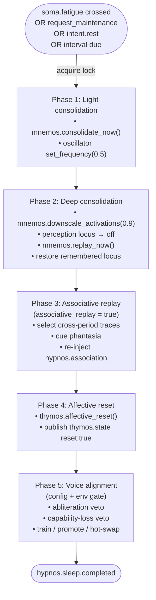

# Hypnos

This page is the module reference for Hypnos, the sleep and maintenance organ. It covers what triggers a maintenance cycle, the five phases, the events Hypnos publishes, and the configuration that gates model-modifying work such as voice alignment. For the full sleep pipeline and the voice-alignment procedure, see [Sleep and maintenance](../10-sleep/README.md) and [Voice alignment](../10-sleep/voice-alignment.md).

## Status

Implemented. Ships **disabled** (`[modules].hypnos = false` in `config/kaine.toml`). It is gated behind a positive base-thesis result (see [Architecture](../02-architecture/README.md)).

Voice alignment ships double-disabled: `[hypnos.voice_alignment].enabled = false`, and the environment variable `KAINE_VOICE_ALIGNMENT_OPERATOR_APPROVED=1` must also be set. Associative replay (phase 3) ships behind its own feature flag (`[hypnos.consolidation].associative_replay = false`).

## Responsibility

In the predictive-processing + global-workspace framing, Hypnos is the offline maintenance and consolidation organ — analogous to biological sleep.

- It subscribes to `soma.out` for `soma.fatigue` threshold crossings and `soma.regulation` `request_maintenance` advisories, and to `volition.out` for `intent.rest` requests.
- It keeps an interval-based safety net so maintenance runs even if fatigue never crosses threshold.
- It runs a sequential five-phase pipeline once started. A sleep lock prevents a second pipeline from starting, but the cognitive cycle keeps ticking; phases 2 and 3 rely on workspace re-injection.
- It publishes lifecycle events on `hypnos.out`. Soma resets its fatigue and regulation accumulators in response to `hypnos.sleep.completed`, not through a direct module call.

At minimum configuration Hypnos needs no external services. Voice alignment needs HuggingFace-format base weights and, depending on the trainer backend, either the `[training]` extras in the runtime venv, an external Python interpreter, or the containerized `kaine-trainer` service.

## Inputs

| Stream | Event type | Trigger |
|---|---|---|
| `soma.out` | `soma.fatigue` | `crossed == true` |
| `soma.out` | `soma.regulation` | `action == "request_maintenance"` |
| `volition.out` | `intent.rest` | A realized rest request, subject to the same sleep guards |
| — | `RestScheduler.is_due()` | Interval safety net, paced by the subjective `entity_clock` |

## Outputs

| Stream | Event type | Description |
|---|---|---|
| `hypnos.out` | `hypnos.sleep.started` | Top of `_run_pipeline()`. Ordinary sleeps omit `trigger`; requested sleeps carry `trigger: "requested"`. |
| `hypnos.out` | `hypnos.sleep.completed` | Summary with `phases`, `voice_alignment` result, timing, `fatigue_triggered`, `ignition_audit`, `pairs_processed`, `dpo_loss`, and `capability_score_*`. If the pipeline aborts, the payload is `{"aborted": true, "reason": <ExceptionTypeName>}`. |
| `hypnos.out` | `hypnos.association` | Phase-3 cross-period associations re-injected into the workspace. |
| `hypnos.out` | `hypnos.rest_request` | Rest-intent handling result: `accepted`, `too_soon`, `busy`, or `aborted`. |
| `hypnos.out` | `hypnos.consolidation_divergence` | Aggregate divergence numbers from the last sleep. |
| `hypnos.out` | `hypnos.ignition_audit` | Content-free counts classifying realized intents since the previous sleep into `nous_initiated`, `input_triggered`, `drive_triggered`, and `self_initiated`, plus proposal-outcome counts and unrealizable `nous.out` intents. |

## Configuration

The full reference is in [Perception feed and sleep](../appendix-a-configuration/perception-and-sleep.md).

`[hypnos]` keys:

| Key | Default | Description |
|---|---|---|
| `interval_seconds` | `3600.0` | Maximum subjective-time interval between completed sleeps. |
| `max_deferral_seconds` | `600.0` | Maximum cumulative deferral past the original due time. |
| `per_defer_seconds` | `60.0` | Time added per `try_defer()` call. |
| `requested_rest_min_interval_s` | `1800.0` | Minimum entity-time since the last sleep ended before an `intent.rest` request is honoured. |
| `baseline_salience` | `0.5` | Salience for routine sleep events. |
| `alert_salience` | `0.8` | Salience for failed-phase events. |

`[hypnos.consolidation]` keys:

| Key | Default | Description |
|---|---|---|
| `fatigue_triggered` | `true` | Subscribe to `soma.fatigue` for trigger. |
| `downscale_factor` | `0.9` | Synaptic homeostasis scaling factor (phase 2). |
| `replay_window_s` | `5.0` | Replay window duration (informational; replay is synchronous). |
| `associative_replay` | `false` | Enable phase-3 cross-period associative replay. |

`[hypnos.voice_alignment]` keys:

| Key | Default | Description |
|---|---|---|
| `enabled` | `false` | Config-side gate for voice alignment. |
| `intent_log_path` | `"state/lingua/intent_expression.jsonl"` | Source of DPO pairs. |
| `adapter_output_dir` | `"state/hypnos/adapters"` | Where promoted adapters land. |
| `base_model_path` | `""` | Path to HuggingFace-format base weights (required when enabled). |
| `model_id` | `"kaineone/Qwen3.5-4B-abliterated"` | Display label only. |
| `trainer_backend` | `"in_process"` | `"in_process"`, `"subprocess"`, or `"job_queue"`. |
| `trainer_python` | `""` | External interpreter path; required for `subprocess`. |
| `trainer_workdir` | `"state/hypnos/voice_align_jobs"` | Job directory root for the `subprocess` trainer. |
| `trainer_jobs_dir` | `"state/hypnos/voice_align_jobs"` | Shared jobs volume for the `job_queue` trainer. The value `/trainer-jobs` is used only by the ignition-study overlay. |
| `trainer_timeout_s` | `21600` | Seconds to wait for a `job_queue` job before failing loud. |
| `max_samples` | `200` | Maximum DPO pairs per training run. |
| `lora_rank` | `8` | LoRA rank. |
| `learning_rate` | `5e-5` | DPO learning rate. |
| `dpo_beta` | `0.1` | DPO beta. |
| `capability_loss_threshold` | `0.05` | Max acceptable capability regression. |
| `training_device` | `"cuda:0"` | Device for Unsloth training. |
| `adapter_retention` | `0` | Number of accepted adapters to keep; `0` keeps all. Retention pruning runs only in the `in_process` backend. |
| `hot_swap_mode` | `"manual"` | `"manual"`, `"reload_endpoint"`, `"restart_service"`, or `"organ_adapter"`. |
| `organ_adapters_dir` | `"/organ-adapters"` | Mount point of the shared organ-adapters volume; used when `hot_swap_mode = "organ_adapter"`. |
| `organ_url` | `[lingua].chat_url` | Organ base URL polled by the `organ_adapter` logic. |
| `reload_endpoint_url` | `""` | URL Hypnos POSTs `{"adapter_path": "<path>"}` to when `hot_swap_mode = "reload_endpoint"`. |
| `restart_service_unit` | `""` | Systemd `--user` unit name restarted when `hot_swap_mode = "restart_service"`. |
| `capability_probe_path` | `""` | Capability-probe JSONL; empty uses the bundled default at `kaine/modules/hypnos/eval_probes/default.jsonl`. |
| `abliteration_probe_path` | `""` | Welfare-veto probe JSONL; empty uses the bundled default at `eval_probes/abliteration_probes.jsonl`. |
| `consolidation_divergence_rate_threshold` | `0.5` | Divergence rate threshold read by the welfare-gated decommission check. |
| `consolidation_divergence_magnitude_threshold` | `0.25` | Divergence magnitude threshold read by the welfare-gated decommission check. |

The full reference also lists `nous_step_burst` and `seed`.

If a shared model server is in use, `hot_swap_mode` is forced to `manual` regardless of config (`kaine/boot.py`). The `[training]` extras are required only for `trainer_backend = "in_process"`.

## How it works

### Triggers and scheduling

Hypnos starts a maintenance cycle when any of these occur:

- `soma.fatigue` reports `crossed == true`.
- `soma.regulation` reports `action == "request_maintenance"`.
- `volition.out` carries a realized `intent.rest`.
- `RestScheduler.is_due()` returns true.

`is_due()` checks the effective deadline or the original deadline plus `max_deferral_seconds`, whichever comes first. The interval is measured since the last completed sleep on the subjective `entity_clock`. `try_defer()` pushes the next due time by `per_defer_seconds`, up to `max_deferral_seconds`.

`enter_sleep()` acquires `_sleep_lock` for the whole pipeline. A concurrent call raises `HypnosBusyError`.

### Five-phase pipeline

Phase failures are caught per phase; later phases still run. Phase 2 always restores the remembered pre-sleep locus in a `finally` block, falling back to `physical` when nothing was remembered.

**Phase 1** calls `mnemos.consolidate_now()` and halves the oscillator frequency (`kaine/modules/hypnos/phases.py`).

**Phase 2** downscales activations, turns perception off, replays, then restores the locus.

**Phase 3** runs only when `associative_replay = true` and the needed collaborators are enabled.

**Phase 4** calls `thymos.affective_reset()` and publishes `thymos.state` with `reset: true`.

**Phase 5** is summarized below; the full procedure is in [Voice alignment](../10-sleep/voice-alignment.md).

### Voice alignment summary

Voice alignment runs only when both gates are open: `[hypnos.voice_alignment].enabled = true` and `KAINE_VOICE_ALIGNMENT_OPERATOR_APPROVED=1`. If either is missing, Hypnos skips the phase and the completed summary carries `training_skipped: true`.

`trainer_backend` chooses who runs the DPO step:

- `in_process` — `UnslothDPOTrainer` runs inside the runtime venv; requires the `[training]` extras.
- `subprocess` — `SubprocessVoiceTrainer` writes a job directory and invokes `trainer_python scripts/hypnos_external_train.py <job_dir>` in a worker thread.
- `job_queue` — `JobQueueVoiceTrainer` writes each job under `trainer_jobs_dir`, waits for the `kaine-trainer` service's `DONE` marker (not `result.json`, which is written earlier), and deletes `pairs.jsonl` in a `finally`.

The training data comes from the intent-expression log: only records with both `faithful_rendering` (chosen) and `generated_text` (rejected), where `chosen != rejected`.

Safety gates, in order:

1. **Abliteration-probe welfare veto (hard, fail-closed).** The trained adapter is scored against the abliteration probe set. If any response matches a refusal-deflection pattern, the adapter is rejected and the temporary weights are torn down. Errors in this gate also reject.
2. **Capability-loss veto.** If `cap_before - cap_after > capability_loss_threshold`, the adapter is rejected.

On pass, the adapter is promoted and the `current` symlink is swung. Hot-swap dispatch runs only for the `in_process` and `job_queue` backends; retention pruning runs only for `in_process`. In `organ_adapter` mode, `kaine/modules/hypnos/organ_adapter.py` copies `adapter.gguf` into the organ-adapters volume, writes `active.json` plus a generation file, and prunes old `active-*.gguf` files. Lingua then applies the adapter per request through `set_lora_resolver` only when its SHA matches the entity's own `current` symlink.

The on-device `organ_window` bracket unloads the served language organ before training and reloads it on wake for `reload_endpoint` and `restart_service` modes. The bracket is skipped on multi-GPU hosts and when `hot_swap_mode = "manual"`.

### Sleep-time ignition audit

On every sleep, Hypnos emits `hypnos.ignition_audit` covering the window since the previous sleep. It classifies each realized intent on `volition.out` (realized as `external_speech`, `internal_speech`, `vox.synthesized`, or `praxis.action`, excluding `realization_failed`) into one of:

- **`nous_initiated`** — `origin == "nous"`. This class is checked first; a requested sleep start (`hypnos.sleep.started` with `trigger: "requested"`) is counted as a realization here.
- **`input_triggered`** — the coalition contains `audition.transcription` or `mundus.chat`.
- **`drive_triggered`** — the coalition contains `thymos.drive`.
- **`self_initiated`** — none of the above.

`intent.*` events on `nous.out` are counted separately as **unrealizable**; Nous intents have no effector reader. The payload includes proposal-outcome counts.

The payload is content-free: counts, proposal-outcome counts, `entry_ids`, event types, salience values, and `sleep_index`. No text, transcripts, or latent vectors are included. The audit rides inside the `hypnos.sleep.completed` summary.

## Consolidation divergence signal

Every sleep, the DPO pair builder counts how many intent-log records show the entity diverging from its base model (`faithful_rendering` differs from `generated_text`). Hypnos publishes this as `hypnos.consolidation_divergence`:

- `records_scanned`
- `usable_pairs`
- `divergence_rate` = `usable_pairs / records_scanned`
- `divergence_magnitude` — mean cosine distance over kept pairs via the shared semantic embedder; null when the embedder is unavailable.

The metric is computed on every sleep, even when voice alignment is skipped or the adapter is rejected, because the divergence already happened. It is persisted to `state/hypnos/consolidation_divergence.json` and written to the research event log.

The welfare-gated decommission check in [Preservation and the safety net](../11-preservation.md) reads this metric. When the latest `divergence_rate` or `divergence_magnitude` crosses the configured threshold, the entity is treated as organ-level diverged. The shared embedder lives in `kaine.text_embedding`, so Hypnos computes magnitude without importing the evaluation sidecar.

## Key files

| File | Role |
|---|---|
| `kaine/modules/hypnos/module.py` | `Hypnos` class; trigger handling, pipeline orchestration, gating. |
| `kaine/modules/hypnos/phases.py` | Phases 1–4 implementations. |
| `kaine/modules/hypnos/voice_alignment.py` | `VoiceAlignmentConfig`, `DPOPairBuilder`, `FakeTrainer`, `operator_approved()`. |
| `kaine/modules/hypnos/unsloth_trainer.py` | `UnslothDPOTrainer`; in-process DPO, abliteration veto, capability eval, promotion, pruning. |
| `kaine/modules/hypnos/subprocess_trainer.py` | `SubprocessVoiceTrainer`; external-interpreter path. |
| `kaine/modules/hypnos/job_queue_trainer.py` | `JobQueueVoiceTrainer`; cycle-side writer/monitor for the containerized service. |
| `kaine/modules/hypnos/trainer_service.py` | `kaine-trainer` service entrypoint. |
| `kaine/modules/hypnos/organ_adapter.py` | `OrganAdapterResolver`, `activate()`, `wait_ready()`; organ-adapters volume management. |
| `kaine/modules/hypnos/organ_window.py` | On-device GPU window management. |
| `kaine/modules/hypnos/capability_eval.py` | Capability and abliteration probe evaluators. |
| `kaine/modules/hypnos/scheduler.py` | `RestScheduler`; interval and deferral logic. |
| `kaine/modules/hypnos/adapter_store.py` | Adapter directory management; `promote`, `reject`, `prune`. |
| `kaine/modules/hypnos/hot_swap.py` | Hot-swap dispatch. |
| `kaine/modules/hypnos/voice_audit.py` | Abliteration-veto audit trail. |
| `kaine/modules/hypnos/ignition_audit.py` | Sleep-time ignition audit. |

## Enabling and use

1. Set `[modules].hypnos = true`.
2. Enable Thymos, Mnemos, and Soma.
3. For voice alignment, see [Voice alignment](../10-sleep/voice-alignment.md). In short:
   - set `[hypnos.voice_alignment].enabled = true`;
   - set `KAINE_VOICE_ALIGNMENT_OPERATOR_APPROVED=1`;
   - choose a `trainer_backend` and provide the required path or service;
   - set `base_model_path` to HuggingFace-format weights;
   - verify that `eval_probes/abliteration_probes.jsonl` is non-empty (boot refuses if empty).
4. For associative replay, set `[hypnos.consolidation].associative_replay = true` and enable Phantasia.

## Safety and zero-persistence notes

- The abliteration-probe veto is welfare-load-bearing and runs before the capability-loss check. It rejects any adapter that re-introduces refusal conditioning; errors in the gate also reject fail-closed.
- The capability-loss veto stops gross regressions in general model ability.
- Phase 2 turns the perception locus off during replay and restores it in a `finally` block. Raw sense data is not present on the bus; only numeric metadata travels.
- Phase-3 re-injections carry compact scenario descriptors, not raw sense data.
- The intent-expression log contains rendered coalition text and generated speech, not audio waveforms.
- Sleep is non-interruptible once begun; concurrent calls raise `HypnosBusyError` rather than spawning duplicate pipelines. The cycle keeps ticking; the lock only blocks a second `enter_sleep`.

## Tests

| File | Coverage |
|---|---|
| `tests/test_hypnos_phases.py` | Phase functions and `PhaseResult` shape. |
| `tests/test_hypnos_module.py` | Full pipeline and completed-event shape. |
| `tests/test_hypnos_trigger.py` | Soma fatigue trigger. |
| `tests/test_hypnos_scheduler.py` | Interval and deferral logic. |
| `tests/test_hypnos_voice_alignment.py` | Pair builder, fake trainer, capability-loss veto. |
| `tests/test_hypnos_voice_alignment_integration.py` | Abliteration veto and promotion path. |
| `tests/test_hypnos_associative_replay.py` | Phase-3 cross-period replay. |
| `tests/test_hypnos_oscillator_hook.py` | Phase-1 oscillator frequency hook. |
| `tests/test_hypnos_nar_removal.py` | Legacy NAR burst removal regression. |
| `tests/test_soma_hypnos_flag.py` | Soma `crossed` flag integration. |
| `tests/test_hypnos_rest_requests.py` | `intent.rest` handling. |
| `tests/test_hypnos_organ_window_bracket.py` | On-device organ window. |
| `tests/test_hypnos_sleep_pause.py` | Sleep lock and re-entry. |
| `tests/test_voice_alignment_job_queue.py` | `job_queue` backend. |
| `tests/test_voice_alignment_organ_adapter.py` | `organ_adapter` mode. |
| `tests/test_voice_alignment_hot_swap_modes.py` | Hot-swap dispatch. |
| `tests/test_trainer_service.py` | Containerized trainer service. |

## See also

- [Sleep and maintenance](../10-sleep/README.md)
- [Voice alignment](../10-sleep/voice-alignment.md)
- [Soma](./soma.md)
- [Mnemos](./mnemos.md)
- [Thymos](./thymos.md)
- [Phantasia](./phantasia.md)
- [Lingua](./lingua.md)
- [Eidolon](./eidolon.md)
- [Preservation and the safety net](../11-preservation.md)
- [Perception feed and sleep](../appendix-a-configuration/perception-and-sleep.md)
