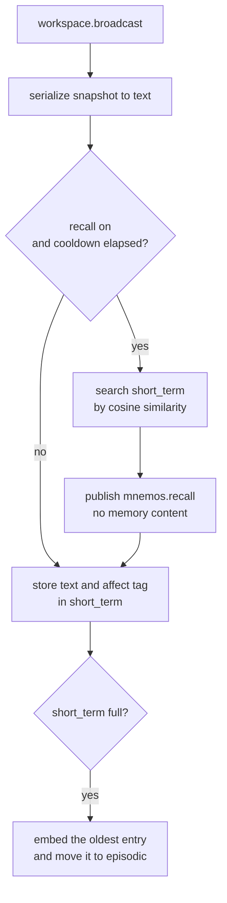

# Mnemos

Mnemos is KAINE's episodic memory module. It stores a text trace of every broadcast in a short-term buffer, consolidates the buffer into an episodic store, recalls related traces as the entity goes, and replays affect-laden traces during sleep. It draws on hippocampal and medial temporal episodic memory (Tulving 1985) and on the complementary-learning-systems account of slow, interleaved consolidation from a fast store into a slow one (McClelland, McNaughton, and O'Reilly 1995). Semantic and procedural stores are reserved. With Mnemos present, the consolidation phases of [Hypnos](hypnos.md) have material to work on. Read this page if you are enabling memory, tuning recall, or changing how traces are stored and replayed.

## Status

Mnemos is built and tested, and held: it is off in the shipped `config/kaine.toml` (`[modules].mnemos = false`) and in the base-thesis `thesis_test` profile that the loader applies when no profile is selected. The [module-addition study](../15-experiments/ignition-study.md) (the ignition study in code) adds it first in its default order of six: Mnemos, Phantasia, Nous, Eidolon, Empatheia, Vox. The study overlay gives each line of the study its own collections (`[mnemos].collection_prefix`).

- The production backend is Qdrant. It needs a running Qdrant container and an API key.
- The `inmemory` backend is for tests and minimal setups. The `sqlite_vec` backend (alias `sqlite-vec`) is an in-process SQLite vector store for low-resource hosts.
- Embeddings come from the shared `[embedding]` text embedder. By default that is the NumPy implementation of `all-MiniLM-L6-v2` (384 dimensions, on the CPU). The `sentence_transformers` backend remains available.
- `sentence-transformers` is needed only when `[embedding].backend = "sentence_transformers"`, and `qdrant-client` only for the Qdrant backend.

## What it does

On every broadcast, accessed or inhibited, Mnemos serializes the snapshot to text, runs a recall against that text, and then stores the text in the short-term buffer. Three commitments shape it.

- Recall runs before store. The cue retrieves earlier related traces, so it cannot return the trace being stored on the same tick. Recall is internal and is not gated on whether the broadcast was inhibited.
- Every trace carries an affect tag: the latest Thymos state at store time, as plain numbers (`intensity`, which is the arousal, plus `valence` and `dominance`).
- Replay happens only inside a sleep. `replay()` raises `ReplayWindowError` if it is called while the entity is awake.

## Inputs

| Source | Stream / event | What is used |
|---|---|---|
| Syneidesis | `workspace.broadcast` | The snapshot, serialized to text for the store and the recall cue |
| Thymos | `thymos.out` / `thymos.state` | Arousal, valence and dominance, cached as the affect tag for the next store |
| Hypnos | `hypnos.out` / `hypnos.sleep.started` | Opens the replay window |
| Hypnos | `hypnos.out` / `hypnos.sleep.completed` | Closes the replay window |

A background task, `_peer_consumer_loop`, reads the Thymos and Hypnos events, so the affect tag stays current between broadcasts.

## Outputs

| Stream | Event type | Payload fields | Intensity |
|---|---|---|---|
| `mnemos.out` | `mnemos.recall` | `count`, `collection`, `query_length`, `max_affect_intensity` | `alert_salience` if `max_affect_intensity ≥ 0.5`, otherwise `baseline_salience` |
| `mnemos.out` | `mnemos.replay` | `memory_id`, `text`, `affect`, `affect_intensity`, `source_timestamp`, `replayed_at` | `baseline_salience` |

`mnemos.recall` carries no memory content and no query text. A storage failure publishes a `mnemos.recall` with `count = 0`, `error = true` and an `error_detail`. `mnemos.replay` carries the trace text, because a replayed trace enters the workspace competition as a candidate like any other module event, and [Phantasia](phantasia.md) takes it as a cue for a scenario.

## Configuration

All keys are under `[mnemos]` and its sub-tables. Shared keys such as `[embedding]` are in the [module configuration reference](../appendix-a-configuration/modules.md).

| Key | Type | Default | Meaning |
|---|---|---|---|
| `backend` | string | `"qdrant"` | `"qdrant"`, `"inmemory"` or `"sqlite_vec"` (`"sqlite-vec"` is also accepted) |
| `collection_prefix` | string | `"mnemos_"` | Prefix of the collection names (Qdrant and sqlite-vec) |
| `short_term_capacity` | int | `128` | Size of the short-term buffer; when it is full, the oldest entry moves to episodic |
| `recall_top_k` | int | `5` | Default number of traces a recall returns |
| `baseline_salience` | float | `0.15` | Intensity of routine recall and of replay events |
| `alert_salience` | float | `0.6` | Intensity of a recall whose strongest trace was stored at arousal 0.5 or higher |
| `recall_on_workspace` | bool | `true` | Whether recall runs on each broadcast |
| `recall_cooldown_s` | float | `5.0` | Minimum entity-time seconds between recalls |
| `[mnemos.qdrant].host` | string | `"127.0.0.1"` | Qdrant host |
| `[mnemos.qdrant].port` | int | `6533` | Qdrant port |
| `[mnemos.qdrant].api_key` | string | unset | Qdrant API key; see below |
| `[mnemos.replay].selection_top_k` | int | `5` | Traces replayed per sleep |
| `[mnemos.replay].affect_weight` | float | `0.7` | Weight of the affect intensity in the replay score |
| `[mnemos.replay].recency_weight` | float | `0.3` | Weight of recency in the replay score |
| `[mnemos.replay].redact_content` | bool | `true` | Strip `text` from the observer copy of each replay |

`recall_on_workspace` and `recall_cooldown_s` are not written in the shipped file; the values above are the constructor defaults. `[mnemos]` rejects `embedder_model_id` and `device` at boot and points to `[embedding].model_id` and `[embedding].device`. The cycle fills `[mnemos.qdrant].api_key`, when it is not set, from `KAINE_QDRANT_API_KEY` or from `[qdrant].api_key` in `config/secrets.toml`, and the Qdrant backend refuses to start without a key.

## How it works

### Collections

| Collection | Backing | Notes |
|---|---|---|
| `short_term` | In-process deque (capacity 128) | When full, the oldest entry moves to `episodic` |
| `episodic` | Qdrant or sqlite-vec | Traces consolidated from short-term |
| `semantic` | Qdrant or sqlite-vec | Reserved for conceptual knowledge |
| `procedural` | Qdrant or sqlite-vec | Reserved for skill traces |

The short-term buffer is working memory. It is not saved by `serialize()`, but preservation captures it with the persisted points (see below).

### Each broadcast



The cooldown runs on entity time, so it stretches and shrinks with `time_scale`. The live recall searches only the short-term buffer, by cosine similarity to the embedded cue. Storing needs no embedding: each short-term entry is embedded once, in memory, the first time a recall needs it, and an entry is embedded for the backend when it moves to `episodic`.

### Embedder

Mnemos uses the shared text embedder from `[embedding]`. One instance loads once and serves Mnemos, Empatheia, Hypnos and the evaluation sidecar.

- The NumPy backend (the default) is `NumpyMiniLMEmbedder` in `kaine/text_embedding_numpy.py`. It runs the `all-MiniLM-L6-v2` encoder from the model's `model.safetensors`, `config.json` and `vocab.txt` with a built-in WordPiece tokenizer, mean pooling and L2 normalisation. It needs only NumPy (SciPy, when present, supplies `erf`). Its 384-dimensional vectors match the sentence-transformers backend within 1e-5 on the same token ids.
- The torch backend is `SentenceTransformerTextEmbedder` in `kaine/text_embedding.py`. `kaine/modules/mnemos/embeddings.py` re-exports it as `SentenceTransformerEmbedder` for older imports.

Tests use `FakeEmbedder`, which maps text to a deterministic 32-dimensional vector from a blake2b digest.

### Affect tag

`_peer_consumer_loop` caches the latest `thymos.state` as:

```python
{"intensity": arousal, "valence": valence, "dominance": dominance}
```

Every store on the broadcast path attaches this cache to the `StoredMemory`.

### Sleep: consolidation, downscaling and replay

Hypnos calls Mnemos in its consolidation phases.

1. Phase 1 calls `consolidate_now()`, which moves every short-term entry to `episodic` and drops nothing.
2. Phase 2 calls `downscale_activations(factor)` (synaptic homeostasis, Tononi and Cirelli 2014). It multiplies every in-memory vector by `factor` in (0, 1), which keeps cosine similarity and shrinks the L2 norms. It is a no-op on the Qdrant and sqlite-vec backends, which keep no vectors in memory. Phase 2 then suspends external perception and calls `replay_now()`.
3. Phase 3 (associative replay, off by default with `[hypnos.consolidation].associative_replay = false`) calls `select_cross_period_traces()`.

`replay_now()` builds its candidates from the short-term buffer only. The `ReplayEngine` raises `ReplayWindowError` if the window is not open, scores each candidate as `affect_weight × intensity + recency_weight × recency`, where recency runs from 0 for the oldest candidate to 1 for the newest, keeps the `selection_top_k` best, and publishes each as `mnemos.replay`. It also returns an observer copy of each payload, with `text` removed when `redact_content = true`. The selection follows the replay of selectively strengthened traces during sleep (Wilson and McNaughton 1994; Wei et al. 2016).

Because phase 1 empties the short-term buffer before phase 2 runs, a replay in the same sleep can find only traces stored in the moment between the two phases, and it usually finds none.

`select_cross_period_traces(periods, per_period)` sorts the available traces by timestamp, splits the time span into `periods` equal windows and takes up to `per_period` traces from each. With the in-memory backend the available traces are the short-term buffer and the episodic collection. The Qdrant and sqlite-vec backends do not expose their collections in memory, so only short-term traces are used.

## Key files

| Path | Purpose |
|---|---|
| `kaine/modules/mnemos/module.py` | `Mnemos(BaseModule)`: broadcast handling, affect consumer, replay, preservation |
| `kaine/modules/mnemos/memory.py` | `MnemosCore` (store, recall, consolidate), `StoredMemory`, `RecallSummary`, `EmotionalRetriggerHook` |
| `kaine/modules/mnemos/storage.py` | `MemoryStorage` protocol, `QdrantStorage`, `InMemoryStorage`, `SqliteVecStorage`, `RecalledMemory` |
| `kaine/text_embedding.py` | `Embedder` protocol, `SharedEmbedder`, `make_text_embedder`, `SentenceTransformerTextEmbedder`, `FakeEmbedder` |
| `kaine/text_embedding_numpy.py` | `NumpyMiniLMEmbedder` |
| `kaine/modules/mnemos/embeddings.py` | Re-export of `kaine.text_embedding` names for older imports |
| `kaine/modules/mnemos/replay.py` | `ReplayEngine`, `ReplayEntry`, `ReplayEvent`, `select_traces`, `build_replay_events` |
| `kaine/boot/factories/mnemos.py` | `make_mnemos()`: backend and replay sub-table |

## Enabling

1. Start the Qdrant container: `docker compose -f compose/qdrant.yml up -d`.
2. The first time, run `bash scripts/qdrant-bootstrap.sh`. It generates the API key, writes it to `compose/.env` and `config/secrets.toml`, and checks `/readyz`.
3. In the operator file `config/kaine.operator.toml`, set `[modules].mnemos = true`. The same flag in the shipped `config/kaine.toml` would be overridden by the `thesis_test` profile, which the loader applies when no profile is selected.
4. To run without Qdrant, set `backend = "inmemory"` or `backend = "sqlite_vec"` and leave out the API key.

In tests, replay can be driven by hand:

```python
mnemos.replay_engine.open_window()
events = await mnemos.replay_now()
mnemos.replay_engine.close_window()
```

## What Mnemos keeps

The stored `text` is a content view of the snapshot. It starts with `active` or `inhibited`, then lists `{source}:{type}={payload}` for each coalition member. Every payload passes through `kaine.privacy_filter.strip_vectors` first, which removes named vector fields and any numeric list of 16 or more items. The payloads of `audition.transcription` and `mundus.visual.raw` are replaced by `<raw-perceptual omitted>`. The tick index is kept in the stored payload, with the inhibited flag and the coalition size, and is not repeated in the text; bus entry ids are left out because they lose meaning once the stream is trimmed. Affect tags are plain numbers.

`Mnemos.serialize()` emits `short_term_size`, `collection_prefix` and `embedding_space`, and no memory content. `export_preservation_state()` captures the full store, short-term buffer included, and fails loudly if the backend cannot be read; see [Preservation and the safety net](../11-preservation.md).

## Tests

| File | Coverage |
|---|---|
| `tests/test_mnemos_memory.py` | `MnemosCore` store, recall and consolidation with `FakeEmbedder` and `InMemoryStorage` |
| `tests/test_mnemos_recall_cosine.py` | Cosine recall over the short-term buffer |
| `tests/test_mnemos_storage.py` | `InMemoryStorage` search; `QdrantStorage` with a mocked client |
| `tests/test_mnemos_embeddings.py` | `FakeEmbedder` determinism; lazy loading of `SentenceTransformerEmbedder` |
| `tests/test_text_embedding_numpy.py` | NumPy embedder: safetensors reader, WordPiece tokenizer, parity with sentence-transformers |
| `tests/test_shared_embedder.py` | One `SharedEmbedder` load across modules and Spot rebuilds |
| `tests/test_mnemos_replay.py` | Replay scoring, the window guard, `ReplayWindowError` |
| `tests/test_mnemos_replay_redact.py` | `redact_content` in observer payloads |
| `tests/test_mnemos_module.py` | Module tick, affect caching, recall cooldown, recall before store |
| `tests/systems/test_mnemos_subsystem.py` | End-to-end subsystem test |

The offline suite's memory-coherence battery (`kaine/evaluation/benchmarks/instrument_runners/memory_coherence_runner.py`) exercises Mnemos offline.

## Spec and related

- Primary spec: [`openspec/specs/mnemos/spec.md`](../../openspec/specs/mnemos/spec.md)
- Replay spec: [`openspec/specs/mnemos-replay/spec.md`](../../openspec/specs/mnemos-replay/spec.md)
- Related modules: [Hypnos](./hypnos.md) runs the consolidation phases; [Thymos](./thymos.md) supplies the affect tag; [Phantasia](./phantasia.md) turns replay cues into scenarios.
