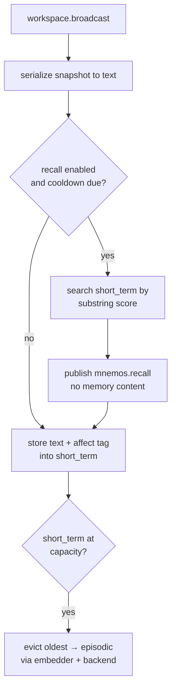

# Mnemos

Mnemos is KAINE's episodic memory organ. This page covers its storage backends, per-tick recall, affect tagging, and Hypnos-gated replay. Read it if you are enabling memory, tuning recall, or changing how traces are stored and re-injected.

## Status

Implemented. It is off in the shipped `config/kaine.toml` (`[modules].mnemos = false`) and in the base-thesis `thesis_test` profile the loader applies when no profile is selected. See [Architecture](../02-architecture/README.md) for the gating rationale.

- Production backend: Qdrant (needs a running Qdrant container and `KAINE_QDRANT_API_KEY`).
- Test/minimal/edge backends: `inmemory`; `sqlite_vec` (`sqlite-vec` alias) is an in-process SQLite-vec backend for low-resource hosts.
- Embedder: shared `[embedding]` instance. Default is the NumPy `all-MiniLM-L6-v2` backend (384-dim, ~80 MB, CPU-pinned by default). The `sentence_transformers` torch backend remains available.
- No extra install required for the module itself; `sentence-transformers` is needed only when `[embedding].backend = "sentence_transformers"`. `qdrant-client` is needed for the Qdrant storage backend.

## Responsibility

In the PP+GWT framing, Mnemos is the episodic memory system. It records what passes through the Syneidesis workspace, retrieves related traces as semantic cues, and during Hypnos maintenance re-injects emotionally significant or temporally salient past traces for associative consolidation.

Design commitments:

- **Recall before store** — each waking tick, recall fires against prior memories *before* the current snapshot is stored, so the cue retrieves prior related experience, not the trace being stored this cycle.
- **Affect tagging** — every stored trace carries the Thymos VAD state at store time as plain numbers (intensity, valence, dominance). No raw sense data.
- **Replay gated to the Hypnos window** — `replay()` raises `ReplayWindowError` if called while awake.

## Inputs

| Source | Stream / event | What is used |
|---|---|---|
| Syneidesis | `workspace.broadcast` | Snapshot serialized to text for store and recall cue |
| Thymos | `thymos.out` / `thymos.state` | VAD numbers cached as the affect tag for the next store |
| Hypnos | `hypnos.out` / `hypnos.sleep.started` | Opens the replay window |
| Hypnos | `hypnos.out` / `hypnos.sleep.completed` | Closes the replay window |

Thymos and Hypnos events are consumed by a background `_peer_consumer_loop` task, not the workspace callback. Mnemos therefore keeps affect up to date even when no broadcast fires.

## Outputs

| Stream | Event type | Payload fields | Salience |
|---|---|---|---|
| `mnemos.out` | `mnemos.recall` | `count`, `collection`, `query_length`, `max_affect_intensity` | `alert_salience` if `max_affect_intensity ≥ 0.5`, else `baseline_salience` |
| `mnemos.out` | `mnemos.replay` | `memory_id`, `text`, `affect`, `affect_intensity`, `source_timestamp`, `replayed_at` | `baseline_salience` |

`mnemos.recall` carries no memory content and no raw query — only diagnostics. `mnemos.replay` includes the original text because the trace must be re-processed by Nous, Thymos, Eidolon, and Phantasia during maintenance.

## Configuration

All keys are under `[mnemos]` and its sub-tables. For shared keys such as `[embedding]`, see the [module configuration reference](../appendix-a-configuration/modules.md).

| Key | Default | Description |
|---|---|---|
| `backend` | `"qdrant"` | Storage backend: `"qdrant"`, `"inmemory"` or `"sqlite_vec"` (`"sqlite-vec"` is also accepted) |
| `collection_prefix` | `"mnemos_"` | Collection name prefix (Qdrant and sqlite-vec) |
| `short_term_capacity` | `128` | In-process ring-buffer size; overflow consolidates to episodic |
| `recall_top_k` | `5` | Default `k` for short-term recall |
| `baseline_salience` | `0.15` | Default recall salience |
| `alert_salience` | `0.6` | Salience on high-affect recall |
| `recall_on_workspace` | `true` | Whether recall fires on each workspace broadcast tick |
| `recall_cooldown_s` | `5.0` | Minimum seconds between recall firings; dilates with `time_scale` |
| `[mnemos.qdrant].host` | `"127.0.0.1"` | Qdrant host |
| `[mnemos.qdrant].port` | `6533` | Qdrant port |
| `[mnemos.replay].selection_top_k` | `5` | Traces selected per maintenance window |
| `[mnemos.replay].affect_weight` | `0.7` | Weight on affect intensity in replay score |
| `[mnemos.replay].recency_weight` | `0.3` | Weight on recency in replay score |
| `[mnemos.replay].redact_content` | `true` | Strip `text` from sidecar/observer replay payloads |

`[mnemos]` rejects `embedder_model_id` and `device` at boot and points you to `[embedding].model_id` and `[embedding].device`. The Qdrant API key is read from `config/secrets.toml` (`[qdrant].api_key`) or the `KAINE_QDRANT_API_KEY` environment variable; Mnemos refuses to construct `QdrantStorage` without it.

## How it works

### Memory collections

Mnemos manages four named collections:

| Collection | Backing | Notes |
|---|---|---|
| `short_term` | In-process `deque` (capacity 128) | Not persisted; oldest entries are auto-evicted to `episodic` |
| `episodic` | Qdrant / sqlite-vec | Waking traces consolidated from short-term |
| `semantic` | Qdrant / sqlite-vec | Reserved for conceptual/factual knowledge |
| `procedural` | Qdrant / sqlite-vec | Reserved for skill/procedure traces |

### Per-tick lifecycle



Recall is throttled by `recall_cooldown_s` (default 5 s) to avoid flooding the bus. On the hot path, recall searches only the in-process `short_term` buffer with substring scoring; it does not call the embedder or touch episodic storage. When `short_term` fills, the oldest entry is embedded and moved to `episodic`.

### Embedder

Mnemos uses the shared text embedder configured in `[embedding]`. The shared instance loads once and is reused by Mnemos, Empatheia, Hypnos, and the evaluation sidecar.

- **NumPy backend** (default): `NumpyMiniLMEmbedder` in `kaine/text_embedding_numpy.py`. Runs the `all-MiniLM-L6-v2` BERT encoder from the model's own `model.safetensors`, `config.json`, and `vocab.txt`, with a built-in WordPiece tokenizer, mean pooling, and L2 normalisation. Needs only NumPy (SciPy is used for `erf` when present). Vectors are 384-dimensional, read from the model config. Matches the sentence-transformers backend within 1e-5 on identical token ids.
- **Torch backend** (optional): `SentenceTransformerTextEmbedder` in `kaine/text_embedding.py`. `kaine/modules/mnemos/embeddings.py` re-exports it as `SentenceTransformerEmbedder` for back-compat.

For tests: `FakeEmbedder` maps text to a deterministic 32-dimensional blake2b digest vector. No external dependencies.

### Affect tagging

The background `_peer_consumer_loop` subscribes to `thymos.out` and caches the latest `thymos.state` as:

```python
{"intensity": arousal, "valence": valence, "dominance": dominance}
```

Only plain numbers are stored — no raw event content. Every `store()` call on the workspace path attaches `self._cached_affect` to the `StoredMemory`.

### Replay engine

During a Hypnos maintenance window, Hypnos calls `replay_now()`. The `ReplayEngine`:

1. Raises `ReplayWindowError` if `window_active` is False. This is a load-bearing safety guard.
2. Scores candidates from the `short_term` buffer only: `score = affect_weight × intensity + recency_weight × recency_norm`.
3. Selects `selection_top_k` traces by score.
4. Builds `ReplayEvent` pairs: `loop_payload` with the full text (published on the bus) and `observer_payload` with text stripped when `redact_content = true`.

### `select_cross_period_traces()`

Used by Hypnos phase 3 (associative consolidation). Sorts traces by timestamp. The available set depends on the backend: `InMemoryStorage` exposes its internal `_collections`, so both `short_term` and `episodic` traces are included; `QdrantStorage` and `SqliteVecStorage` do not expose those collections, so only `short_term` traces are used. The sorted traces are divided into `periods` equal-width windows, and up to `per_period` traces are sampled from each window. Returns a `{period_label: [trace_dict, ...]}` mapping. Affect fields are included as plain numbers; no raw sense data.

### `downscale_activations(factor)`

Synaptic homeostasis: scales all in-memory activation vectors by `factor` ∈ (0, 1). Cosine similarity is preserved; only L2 norms shrink. Called by Hypnos phase 2. No-op on `QdrantStorage` and `SqliteVecStorage` because they keep no in-memory vectors to scale.

## Key files

| Path | Purpose |
|---|---|
| `kaine/modules/mnemos/module.py` | `Mnemos(BaseModule)` — tick driver, affect consumer, replay API |
| `kaine/modules/mnemos/memory.py` | `MnemosCore` (store/recall/consolidate), `StoredMemory`, `RecallSummary`, `EmotionalRetriggerHook` |
| `kaine/modules/mnemos/storage.py` | `MemoryStorage` protocol, `QdrantStorage`, `InMemoryStorage`, `SqliteVecStorage`, `RecalledMemory` |
| `kaine/text_embedding.py` | `Embedder` protocol, `SharedEmbedder`, `make_text_embedder`, `SentenceTransformerTextEmbedder`, `FakeEmbedder` |
| `kaine/text_embedding_numpy.py` | `NumpyMiniLMEmbedder` — built-in NumPy implementation of the all-MiniLM-L6-v2 BERT encoder |
| `kaine/modules/mnemos/embeddings.py` | Back-compat re-export shim of `kaine.text_embedding` names; no second implementation |
| `kaine/modules/mnemos/replay.py` | `ReplayEngine`, `ReplayEntry`, `ReplayEvent`, `select_traces`, `build_replay_events` |
| `kaine/boot/factories/mnemos.py` | `make_mnemos()` — backend config, replay sub-table wiring |

## Enabling and use

1. Start the Qdrant container: `docker compose -f compose/qdrant.yml up -d`
2. Bootstrap (first time): `bash scripts/qdrant-bootstrap.sh` — generates the API key, writes it to `compose/.env` and `config/secrets.toml`, and confirms `/readyz`.
3. Edit `config/kaine.toml`: set `[modules].mnemos = true`.
4. Optional: to avoid Qdrant, set `backend = "inmemory"` or `backend = "sqlite_vec"` and omit the API key.

Replay is triggered by Hypnos. To trigger replay manually in tests:

```python
await mnemos.replay_engine.open_window()
events = await mnemos.replay_now()
await mnemos.replay_engine.close_window()
```

## Zero-persistence note

`mnemos.recall` and `mnemos.replay` payloads contain **no raw sense data**. The stored `text` field is a deterministic serialization of the tick, the active and inhibited event lists, and `{source}:{type}@{entry_id}={event.payload}` for each workspace entry. The raw perceptual payloads `audition.transcription` and `mundus.visual.raw` are replaced by the literal `<raw-perceptual omitted>`; everything else is the full event payload, not salience values. Affect tags are plain floats. The `redact_content = true` default strips even that serialized text from observer/sidecar replay payloads.

`Mnemos.serialize()` emits only `short_term_size`, `collection_prefix`, and `embedding_space` — no memory content. Full memory contents are exported through `export_preservation_state` instead; see [Preservation and the safety net](../11-preservation.md).

## Tests

| File | Coverage |
|---|---|
| `tests/test_mnemos_memory.py` | `MnemosCore` store/recall/consolidate with `FakeEmbedder` and `InMemoryStorage` |
| `tests/test_mnemos_storage.py` | `InMemoryStorage` cosine search, `QdrantStorage` (mocked) |
| `tests/test_mnemos_embeddings.py` | `FakeEmbedder` determinism, `SentenceTransformerEmbedder` lazy load |
| `tests/test_text_embedding_numpy.py` | NumPy embedder: safetensors reader, WordPiece tokenizer, and embedding parity with HuggingFace / sentence-transformers |
| `tests/test_shared_embedder.py` | `SharedEmbedder` single load and no-op shutdown; one instance across modules and Spot rebuilds |
| `tests/test_mnemos_replay.py` | `select_traces` scoring, `ReplayEngine` window guard, `ReplayWindowError` |
| `tests/test_mnemos_replay_redact.py` | `redact_content` behavior in observer payloads |
| `tests/test_mnemos_module.py` | Full `Mnemos` tick; affect caching; recall cooldown; recall-before-store ordering |
| `tests/systems/test_mnemos_subsystem.py` | End-to-end subsystem test |

## Spec and related

- Primary spec: [`openspec/specs/mnemos/spec.md`](../../openspec/specs/mnemos/spec.md)
- Replay spec: [`openspec/specs/mnemos-replay/spec.md`](../../openspec/specs/mnemos-replay/spec.md)
- Related modules: [Hypnos](./hypnos.md) (replay window, consolidation), [Thymos](./thymos.md) (affect tags), [Phantasia](./phantasia.md) (scenario generation from replay cues), [Nous](./nous.md) (`nous.belief` consumer)
