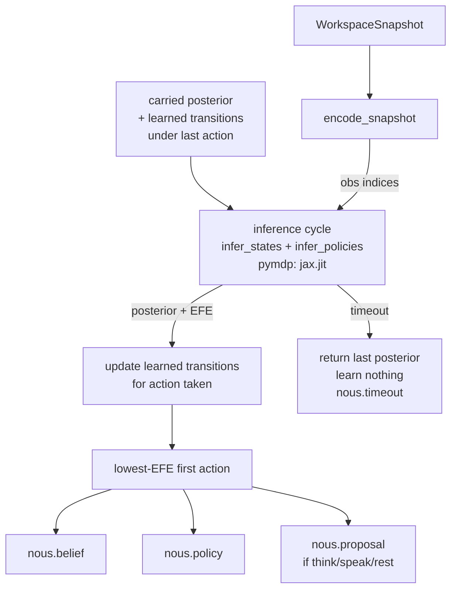

# Nous

Nous is KAINE's reasoning module. It runs active-inference belief updating and policy selection over a small discrete generative model, then proposes conscious actions to Volition. Read this page if you are enabling Nous, choosing a backend, tuning its cycle budget, or changing the engine or model.

## Status

Implemented, but ships disabled. Set `[modules].nous = true` in `config/kaine.toml` after reading the base-thesis gating notes in [Architecture](../02-architecture/README.md).

- Choose a backend with `[nous].backend`. The `"pymdp"` backend needs the `[reasoning]` optional extra (`inferactively-pymdp` and `jax[cpu]`). The `"numpy"` backend uses only NumPy and needs no extra.
- No CUDA is required; the JAX backend runs CPU-only inside the cycle budget.
- The earlier NARS/ONA symbolic reasoner is retired; its files live in `external/archive/nous_narsese/`.

## Responsibility

Each experiential tick of the [global workspace](../08-cognitive-cycle/global-workspace.md) produces a `WorkspaceSnapshot` broadcast. The resting rate is `experiential_rate_hz = 3.333`; it rises toward 10 Hz only when `[cycle.access_rate]` is configured. On each broadcast, Nous:

1. Updates beliefs by running variational inference over its generative model.
2. Selects a policy by evaluating expected free energy for each candidate action.
3. Proposes an action on `nous.out` when the chosen action is `request_think`, `request_speak`, or `request_maintenance`.

A proposal carries `proposal_id`, `action`, `kind` (`think`, `speak`, or `rest`), `step`, and `preference` — the softmax probability of the chosen action under its expected free energy. Salience rises from `baseline_salience` to `alert_salience` with `preference`.

**Nous proposes; the executive disposes.** Volition may realize a conscious proposal as an `intent.think`, `intent.speak`, or `intent.rest` on `volition.out` with `origin: "nous"`, but the same inhibition, flight, refractory, and self-response guards that apply to ordinary Volition intents also apply. Praxis is untouched: no Nous action is a Praxis effector action.

## Inputs

| Source | Stream / path | Event type | What is used |
|---|---|---|---|
| Syneidesis | `workspace.broadcast` | `WorkspaceSnapshot` | `selected_events` — the conscious coalition |
| Thymos | `thymos.state` (inside the coalition) | `thymos.state` | `valence`, `arousal` for affect quadrant encoding |

The encoder in `kaine/modules/nous/generative_model.py` reads the most-salient event for salience band and event cluster; Thymos-sourced events provide the affect quadrant.

## Outputs

All outputs are published on `nous.out`.

| Event type | Key payload fields | Salience |
|---|---|---|
| `nous.belief` | `statement` (dominant latent label), `kind="belief"`, `frequency`, `confidence` | `alert_salience` when `confidence >= 0.75`, otherwise `baseline_salience` |
| `nous.policy` | `policy` (action name), `expected_free_energy`, `horizon`, `param_info_gain` | `baseline_salience` |
| `nous.proposal` | `proposal_id`, `action`, `kind` (`think`/`speak`/`rest`), `step`, `preference` ∈ [0,1] | rises from `baseline_salience` to `alert_salience` with `preference` |
| `nous.timeout` | `elapsed_ms`, `num_factors`, `num_actions` | `timeout_salience` (0.3) |
| `nous.error` | `error_reason`, `elapsed_ms`, `num_factors`, `num_actions` | `timeout_salience` (0.3) |

Nous never publishes an `intent.act` event. Volition's `NousProposalSource` wraps the configured action-selection policy; it considers the most salient proposal only when the proposal is in the conscious coalition of a non-inhibited experiential broadcast. For every proposal it sees, Volition publishes a content-free `volition.proposal_outcome` on `volition_feedback.out` reporting whether the proposal was `realized`, `inhibited`, `in_flight`, `refractory`, `superseded`, `self_response`, `disabled`, or `forwarded` (for a rest intent handed to [Hypnos](./hypnos.md)). At most one proposal-derived intent is emitted per snapshot, and it never displaces the wrapped policy's own intent (`superseded`). The wrapped policy decides on the coalition with every proposal removed, so its decision is the same whether `drive_actions` is on or off.

Before each step, Nous reads those outcomes and records the action taken since the previous step: a realized think or speak from Volition's outcome, and a rest from Hypnos's `hypnos.rest_request` acceptance. An action that was realized at a failed or timed-out step stays pending and is recorded only once a step commits. Unknown outcome ids are counted in `unknown_outcomes`. The wrapped policy shares one guard state with Nous through `note_external_intent`; refractory durations come from `[volition].speak_refractory_s` and `[volition].think_refractory_s`.

Realized intents re-enter the workspace like any other event, and that is what Nous can learn about. On a non-timeout inference crash the engine keeps the carried belief, sets `EngineResult.error=True`, and skips `nous.belief`/`nous.policy` for that cycle so the unchanged prior is not re-broadcast as a fresh computation. No learning occurs on a timed-out or failed step; the next step resumes from the last carried posterior.

## Configuration

All keys live under `[nous]` in `config/kaine.toml`. See the [modules configuration reference](../appendix-a-configuration/modules.md).

| Key | Default | Description |
|---|---|---|
| `backend` | `"pymdp"` | Active-inference backend: `"pymdp"` (JAX/jit; needs `[reasoning]` extra) or `"numpy"` (NumPy; no extra). Unknown values raise `ConfigurationError` at boot. |
| `factors` | `4` | Number of hidden-state factors |
| `max_states_per_factor` | `4` | State count cap per factor |
| `actions` | `4` | Size of the action space |
| `planning_horizon` | `1` | Policy length; single-step only |
| `efe_timeout_ms` | `250` | Hard EFE planning deadline (ms); on overrun the engine returns the last posterior |
| `transition_persistence` | `0.8` | Dirichlet prior weight favouring perceptual-factor persistence |
| `transition_concentration` | `1.0` | Dirichlet prior confidence (low = broad initial uncertainty) |
| `transition_max_concentration` | `1000.0` | Upper bound on the evidence in any transition column; larger columns are rescaled so the model keeps learning from change |
| `baseline_salience` | `0.4` | Default event salience |
| `alert_salience` | `0.8` | Salience when belief confidence ≥ 0.75 |
| `timeout_salience` | `0.3` | Salience for `nous.timeout` and `nous.error` diagnostics |
| `drive_actions` | `true` | When `true`, Volition may realize conscious `nous.proposal` events as intents. When `false`, Nous stays observational: every proposal receives outcome `disabled` and is learned as `no_op`. |

`make_nous` in `kaine/boot.py` validates the complexity envelope: `factors × max_states_per_factor × actions × planning_horizon` must not exceed 4096. The shipped defaults give a product of 64. `make_nous` also exposes plugin seams for `engine` and `engine_wrapper` from `kaine/plugins.py`. An injected engine is used directly and the backend/extra check is skipped.

## How it works

### Generative model

The model in `kaine/modules/nous/generative_model.py` is a four-factor, four-modality discrete active-inference model built once at boot with `build_generative_model()`.

**Hidden-state factors:**

| Factor index | Name | States | Notes |
|---|---|---|---|
| 0 | `action_latent` | `no_op`, `request_think`, `request_speak`, `request_maintenance` | Controllable; the chosen action becomes the next action-latent state |
| 1 | `salience_band` | `salience_low`, `salience_medium`, `salience_high` | Transition beliefs are action-dependent and learned |
| 2 | `affect_quadrant` | `affect_calm_pleasant`, `affect_excited_pleasant`, `affect_calm_unpleasant`, `affect_excited_unpleasant` | Derived from [Thymos](./thymos.md); transition beliefs are action-dependent and learned |
| 3 | `event_cluster` | `cluster_other`, `cluster_perception`, `cluster_affect`, `cluster_self` | Dominant event source bucketed; transition beliefs are action-dependent and learned |

One observation modality corresponds to each factor (a square model). Likelihood **A** is identity for the action factor and a soft-diagonal (confidence 0.9 by default) for perceptual factors. Transition beliefs **B** give each perceptual factor a separate Dirichlet prior over its next state for each action. At boot all perceptual factors share the same broad prior: `transition_persistence` weights the diagonal, and `transition_concentration` keeps the prior weak. No action's effect is baked into the model; the model learns from observations.

Preferences **C** mildly prefer a high-salience observation, plus expected information gain about the still-uncertain transition beliefs. Because expected free energy includes that parameter information gain, Nous samples actions whose consequences it is less sure of; as the model sharpens, the salience preference pulls selection toward actions that bring salient observations.

Belief carries over across steps. Each step's prior is the previous posterior propagated through the learned transition beliefs under the action taken. The initial **D** is uniform over perceptual factors with a `no_op` prior on the action latent; after the first step the posterior becomes the starting point for the next. The action factor's observation is the action actually taken, and its transitions are held fixed. The online-growth seam `register_event_cluster` allows adding event-cluster states without growing the factor count.

### Inference cycle

`kaine/modules/nous/engine.py` hosts `_EngineBase`, `PymdpEngine`, `FakeEngine`, the `ActiveInferenceEngine` protocol, `EngineResult`, and `normalised_entropy`. `kaine/modules/nous/numpy_engine.py` hosts `NumpyActiveInferenceEngine`, which delegates to `NumpyAgent` in `kaine/modules/nous/numpy_aif.py`.

Both backends implement the same generative model and mathematics: fixed-point state inference, full policy enumeration, expected free energy with utility, state information gain, transition-parameter information gain, Dirichlet transition learning, the carried prior, the evidence cap, and the fixed action factor. They share `_EngineBase` behaviour: the `efe_timeout_ms` guard, per-action EFE aggregation, learning bookkeeping, generation counter, `record_taken_action`, and `learned_state()` / `load_learned_state()`. A learned state saved by one engine loads into the other.

The common cycle steps are:

1. **Encode** — `encode_snapshot(snapshot, model)` maps the workspace broadcast to four integer observation indices.
2. **Carry prior in** — the step's prior is the posterior carried from the previous step, propagated through the learned transition beliefs under the action taken.
3. **Inference + planning** — the engine runs variational state inference, then computes expected free energy for each candidate policy. The `pymdp` backend makes one `jax.jit` call to `Agent.infer_states` plus `Agent.infer_policies`, and warms up by tracing that JIT cycle once at boot. A jitted step takes well under one millisecond on CPU. The `numpy` backend uses explicit fixed-point message passing and a NumPy EFE sum over policies; it needs no warm-up and a median step on the default model takes about 2 ms on a desktop CPU.
4. **Learning update** — inside the same timeout guard, the engine updates the Dirichlet transition beliefs for the action taken using the inferred pre-step and post-step states. A timed-out or failed step learns nothing.
5. **Timeout guard** — the `_infer` call is submitted to a `ThreadPoolExecutor(max_workers=1)` with a deadline of `efe_timeout_ms`. On timeout, the engine returns the last good posterior, sets `EngineResult.timed_out=True`, and the module publishes `nous.timeout`.
6. **Action selection** — per-action EFE is the best EFE among policies beginning with that action. The overall lowest-EFE policy is selected and `EngineResult.action` is its first action.



`nous.policy` reports the chosen action, the planning horizon, the per-policy expected free energy, and `param_info_gain`, which is true when expected free energy includes the information to be gained about the learned transitions.

## The `nous.belief` contract

The payload shape is preserved from the earlier NARS implementation so consumers such as [Mnemos](./mnemos.md), [Eidolon](./eidolon.md), and Syneidesis keep working. The semantics are now:

- `statement` — human-readable label of the dominant latent factor, for example `"salience_high"`. Derived via `EngineResult.dominant_factor()`, which selects the lowest-entropy non-action factor.
- `frequency` — posterior expectation (max probability mass) in that factor.
- `confidence` — `1 − normalised_entropy(factor_distribution)`, clamped to [0, 1].
- `kind` — `"belief"` (always).

## `FakeEngine`

`FakeEngine` implements the `ActiveInferenceEngine` protocol with scripted posteriors — no pymdp, no JAX. All module-level tests inject it. The engine protocol is `@runtime_checkable`, so `isinstance` checks work without importing pymdp.

## Key files

| Path | Purpose |
|---|---|
| `kaine/modules/nous/module.py` | `Nous(BaseModule)` — tick driver, publications, action routing |
| `kaine/modules/nous/engine.py` | `_EngineBase`, `PymdpEngine`, `FakeEngine`, `ActiveInferenceEngine` protocol, `EngineResult`, `normalised_entropy` |
| `kaine/modules/nous/numpy_engine.py` | `NumpyActiveInferenceEngine` — NumPy backend entry point |
| `kaine/modules/nous/numpy_aif.py` | `NumpyAgent` — NumPy state inference, EFE, and Dirichlet learning |
| `kaine/modules/nous/generative_model.py` | `build_generative_model()`, `encode_snapshot()`, A/B/C/D construction, `ACTION_SPACE` |
| `kaine/boot.py` | `make_nous()` — complexity envelope validation, engine construction, plugin seams |
| `kaine/plugins.py` | Plugin seam definitions for `engine` / `engine_wrapper` |

## Enabling and use

1. Choose a backend:
   - `backend = "pymdp"` (default; needs the `[reasoning]` extra). Install it with `.venv/bin/pip install -e '.[reasoning]'`.
   - `backend = "numpy"` (NumPy only, no extra).
2. Set `[modules].nous = true` in `config/kaine.toml`.
3. The `pymdp` backend warms up by tracing the JIT cycle once at boot (against a dummy observation). The `numpy` backend needs no warm-up.
4. Nous needs no external services: the `pymdp` backend runs in-process, and the `numpy` backend uses only NumPy.

To switch backends during testing, inject a `FakeEngine`:

```python
from kaine.modules.nous.engine import FakeEngine
from kaine.modules.nous.module import Nous

module = Nous(bus, engine=FakeEngine())
```

## Serialization and learned state

`Nous.serialize()` includes a `learned` object that contains the Dirichlet transition-belief parameters and the carried posterior for every hidden-state factor. This learned state is preserved with the being and revived on its next boot, so each viewing resumes from the previous posterior rather than restarting from the initial prior. A snapshot that is missing the learned block starts from the prior and logs that fact. The posteriors still enable `NousMergeStrategy` to pick the lower-entropy fork on a [fork and merge lifecycle](../12-forks-and-merges.md) merge. No event content, workspace data, or text is written to disk by Nous; the serialized state is numeric structure only.

## Tests

| File | Coverage |
|---|---|
| `tests/test_nous_engine.py` | `PymdpEngine` timeout guard, `FakeEngine` scripted steps, `normalised_entropy` |
| `tests/test_nous_generative_model.py` | A/B/C/D shapes, `encode_snapshot` cases, `register_event_cluster` |
| `tests/test_nous_module.py` | Full `Nous` tick with `FakeEngine`; `nous.belief`, `nous.policy`, proposal routing; asserts no `intent.act` is published; timeout path; `nous.timeout` salience |
| `tests/test_nous_health_probe.py` | Complexity envelope validation in `make_nous` |
| `tests/test_numpy_aif_parity.py` | `NumpyAgent` reproduces golden `pymdp` actions and per-action EFE to `1e-4` |
| `tests/test_numpy_nous_engine.py` | `NumpyActiveInferenceEngine` replays the golden learning trajectory; learned-state interchange with `PymdpEngine`; timeout, generation, and load guards; runs with JAX blocked; step latency |
| `tests/test_nous_health_probe_backend.py` | Nexus health probe checks the configured `[nous].backend`; the NumPy probe runs with JAX blocked |
| `tests/test_nous_proposals.py` | `nous.proposal` payloads, `no_op` suppression, salience, and outcome-learning integration |
| `tests/test_nous_proposal_source.py` | Volition `NousProposalSource`: conscious-proposal gating, guard interaction, outcome publication |
| `tests/test_nous_action_e2e.py` | End-to-end on a real bus: a conscious think proposal becomes an `intent.think` that [Lingua](./lingua.md) realizes as internal speech; an inhibited one publishes nothing to `volition.out` |
| `tests/systems/test_nous_subsystem.py` | End-to-end subsystem test |

## Spec and related

- Primary spec: `openspec/specs/nous-active-inference/spec.md`
- Archived pymdp replacement change: `openspec/changes/archive/2026-06-07-nous-pymdp-swap/`
- Archived original ONA integration: `openspec/changes/archive/2026-05-20-nous/`
- Related modules: [Thymos](./thymos.md) (affect input), [Mnemos](./mnemos.md) (`nous.belief` consumer), [Eidolon](./eidolon.md) (`nous.policy` consumer via self-inference), [Praxis](./praxis.md) (effector actions; does not gate Nous proposals), [Hypnos](./hypnos.md) (rest forwarding), [Lingua](./lingua.md) (speech realization)
