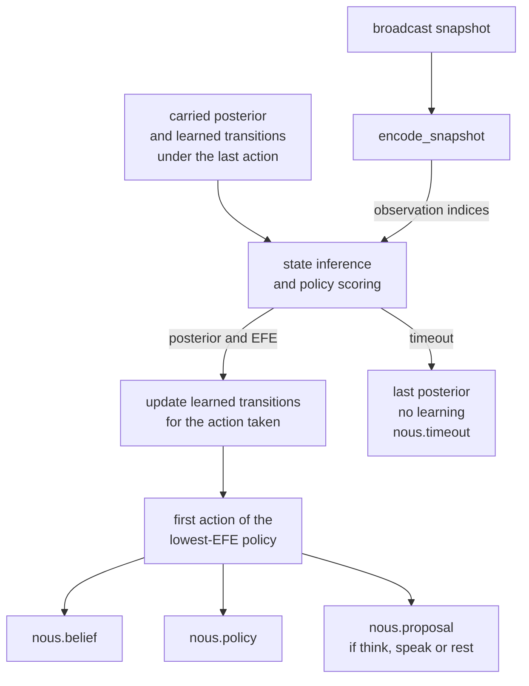

# Nous

Nous is KAINE's reasoning module. It runs discrete-state active inference (Da Costa et al. 2020) over a small generative model: on each broadcast it updates its beliefs, scores each action by expected free energy, and proposes the chosen action to Volition. It draws on prefrontal and basal-ganglia planning under uncertainty and is confined to bounded sub-problems where information has value, because the cost of planning grows combinatorially with the depth of the action sequences considered. The default backend is pymdp (Heins et al. 2022). Read this page if you are enabling Nous, choosing a backend, tuning its time budget, or changing the engine or model.

## Status

Nous is built and tested, and held: it is off in the shipped `config/kaine.toml` (`[modules].nous = false`) and in the base-thesis `thesis_test` profile. The [module-addition study](../15-experiments/ignition-study.md) (the ignition study in code) adds it third in its default order of six: Mnemos, Phantasia, Nous, Eidolon, Empatheia, Vox.

- `[nous].backend` selects the engine. `"pymdp"` needs the `[reasoning]` optional extra (`inferactively-pymdp` and `jax[cpu]`). `"numpy"` needs only NumPy.
- No GPU is needed; both backends run on the CPU inside the cycle's time budget.
- The earlier symbolic reasoner is retired; its files are kept in `external/archive/nous_narsese/`.

## What it does

The cycle publishes a broadcast snapshot on every broadcast tick. The access rate rests at about 3.3 Hz (`[cycle].experiential_rate_hz = 3.333`) and, with `[cycle.access_rate]` enabled (the shipped setting), rises toward the 10 Hz processing rate with arousal and after categorical alerts. On each broadcast with at least one coalition member, accessed or inhibited, Nous:

1. updates its beliefs by variational inference over its generative model;
2. scores each candidate action by expected free energy and selects the lowest;
3. publishes a proposal on `nous.out` when the chosen action is `request_think`, `request_speak` or `request_maintenance`.

A proposal carries `proposal_id`, `action`, `kind` (`think`, `speak` or `rest`), `step` and `preference`, the softmax probability of the chosen action under its expected free energy. Its intensity rises from `baseline_salience` to `alert_salience` with `preference`.

Nous proposes and Volition decides. Volition may realize a proposal as `intent.think`, `intent.speak` or `intent.rest` on `volition.out` with `origin: "nous"`, under the same inhibition, in-flight, refractory and self-response guards as its own intents. No Nous action reaches Praxis.

## Inputs

| Source | Stream / path | Event type | What is used |
|---|---|---|---|
| Syneidesis | `workspace.broadcast` | snapshot | Every coalition member |
| Thymos | a `thymos.state` member of the coalition | `thymos.state` | `valence` and `arousal`, for the affect quadrant |
| Volition | `volition_feedback.out` | `volition.proposal_outcome` | Whether each proposal was realized |
| Hypnos | `hypnos.out` | `hypnos.rest_request` | Whether a rest proposal was accepted |

The encoder in `kaine/modules/nous/generative_model.py` takes the coalition member with the largest reported intensity for the salience band and the event cluster, and a Thymos member, if one is present, for the affect quadrant.

## Outputs

All events are published on `nous.out`.

| Event type | Payload fields | Intensity |
|---|---|---|
| `nous.belief` | `statement` (the dominant latent label), `kind="belief"`, `frequency`, `confidence` | `alert_salience` when `confidence ≥ 0.75`, otherwise `baseline_salience` |
| `nous.policy` | `policy` (action name), `expected_free_energy`, `horizon`, `param_info_gain` | `baseline_salience` |
| `nous.proposal` | `proposal_id`, `action`, `kind`, `step`, `preference` in [0, 1] | from `baseline_salience` to `alert_salience` with `preference` |
| `nous.timeout` | `elapsed_ms`, `num_factors`, `num_actions` | `timeout_salience` (0.3) |
| `nous.error` | `error_reason`, `elapsed_ms`, `num_factors`, `num_actions` | `timeout_salience` (0.3) |

Nous never publishes `intent.act`. Volition's `NousProposalSource` wraps the configured action-selection policy. It considers proposals only on an accessed broadcast (one whose best score reaches the access threshold), and only proposals that are members of that broadcast's coalition; the proposal's own score is not checked against the threshold. On an inhibited broadcast every proposal is recorded as `inhibited`. The first proposal in coalition order is the candidate, and the rest are `superseded`. For every proposal it sees, Volition publishes a content-free `volition.proposal_outcome` on `volition_feedback.out` with the reason `realized`, `inhibited`, `in_flight`, `refractory`, `superseded`, `self_response`, `disabled`, or `forwarded` (a rest intent handed to [Hypnos](./hypnos.md)). At most one proposal-derived intent is emitted per snapshot, and it never displaces an intent of the same kind from the wrapped policy (`superseded`). The wrapped policy decides on the coalition with every proposal removed, so its decision is the same whether `drive_actions` is on or off.

Before each step, Nous reads those outcomes and records the action taken since the previous step: a realized think or speak from Volition's outcome, and a rest from Hypnos's acceptance in `hypnos.rest_request`. An action realized while a step failed or timed out stays pending until a step commits. Outcome ids that Nous does not recognize are counted in `unknown_outcomes`. The wrapped policy shares one guard state with Nous through `note_external_intent`, and the refractory durations come from `[volition].speak_refractory_s` and `[volition].think_refractory_s`.

Realized intents re-enter the workspace like any other event, and that is what Nous can learn from. On an inference crash that is not a timeout, the engine keeps the carried belief, sets `EngineResult.error=True`, and Nous publishes `nous.error` in place of `nous.belief` and `nous.policy`, so an unchanged prior is never published as a fresh result. A timed-out or failed step learns nothing, and the next step resumes from the last carried posterior.

## Configuration

All keys are under `[nous]` in `config/kaine.toml`. See the [modules configuration reference](../appendix-a-configuration/modules.md).

| Key | Type | Default | Meaning |
|---|---|---|---|
| `backend` | string | `"pymdp"` | `"pymdp"` (JAX; needs the `[reasoning]` extra) or `"numpy"` (no extra). Any other value raises `ConfigurationError` at boot. |
| `factors` | int | `4` | Number of hidden-state factors |
| `max_states_per_factor` | int | `4` | Cap on the states per factor |
| `actions` | int | `4` | Size of the action space |
| `planning_horizon` | int | `1` | Policy length; single-step only |
| `efe_timeout_ms` | float | `250` | Deadline for one step in milliseconds; on overrun the engine returns the last posterior |
| `transition_persistence` | float | `0.8` | Weight of the Dirichlet prior on a perceptual factor staying in its state |
| `transition_concentration` | float | `1.0` | Confidence of that prior (low values leave broad initial uncertainty) |
| `transition_max_concentration` | float | `1000.0` | Cap on the evidence in any transition column; fuller columns are rescaled so the model keeps learning from change. Must exceed `transition_concentration`. |
| `baseline_salience` | float | `0.4` | Default intensity |
| `alert_salience` | float | `0.8` | Intensity of a confident belief and of a fully preferred proposal |
| `timeout_salience` | float | `0.3` | Intensity of `nous.timeout` and `nous.error` |
| `drive_actions` | bool | `true` | When `true`, Volition may realize proposals. When `false`, Nous only observes: every proposal gets the outcome `disabled` and is learned as `no_op`. |

The three `transition_*` keys are commented out in the shipped file; the values above are the factory defaults. `make_nous` in `kaine/boot/factories/nous.py` checks the complexity envelope: `factors × max_states_per_factor × actions × planning_horizon` may not exceed 4096, and the defaults give 64. `make_nous` also exposes the plugin seams `engine` and `engine_wrapper` from `kaine/plugins.py`. An injected engine is used as given, and the backend and extra checks are skipped.

## How it works

### Generative model

`build_generative_model()` in `kaine/modules/nous/generative_model.py` builds a model with four factors and four observation modalities once at boot.

| Factor index | Name | States | Notes |
|---|---|---|---|
| 0 | `action_latent` | `no_op`, `request_think`, `request_speak`, `request_maintenance` | Controllable; the chosen action becomes the next state of this factor |
| 1 | `salience_band` | `salience_low`, `salience_medium`, `salience_high` | Action-dependent transitions, learned |
| 2 | `affect_quadrant` | `affect_calm_pleasant`, `affect_excited_pleasant`, `affect_calm_unpleasant`, `affect_excited_unpleasant` | From [Thymos](./thymos.md); action-dependent transitions, learned |
| 3 | `event_cluster` | `cluster_other`, `cluster_perception`, `cluster_affect`, `cluster_self` | The source of the strongest member, bucketed; action-dependent transitions, learned |

Each factor has one observation modality. The likelihood **A** is the identity for the action factor and a soft diagonal (confidence 0.9 by default) for the perceptual factors. The transition beliefs **B** give each perceptual factor a separate Dirichlet prior over its next state for each action. At boot all perceptual factors share the same broad prior: `transition_persistence` weights the diagonal and `transition_concentration` keeps the prior weak. No action's effect is built in; the model learns it from observation.

The preferences **C** mildly favour a high-salience observation. Expected free energy also includes the information to be gained about the still-uncertain transition beliefs, so Nous samples actions whose consequences it is less sure of. As the model sharpens, the salience preference pulls selection toward actions that bring salient observations.

Belief carries over from step to step. Each step's prior is the previous posterior propagated through the learned transitions under the action taken. The initial **D** is uniform over the perceptual factors with a `no_op` prior on the action factor. The action factor's observation is the action actually taken, and its transitions are fixed. The seam `register_event_cluster` adds event-cluster states without adding factors.

### Inference cycle

`kaine/modules/nous/engine.py` holds `_EngineBase`, `PymdpEngine`, `FakeEngine`, the `ActiveInferenceEngine` protocol, `EngineResult` and `normalised_entropy`. `kaine/modules/nous/numpy_engine.py` holds `NumpyActiveInferenceEngine`, which delegates to `NumpyAgent` in `kaine/modules/nous/numpy_aif.py`.

Both backends implement the same model and mathematics: fixed-point state inference, full policy enumeration, expected free energy with utility, state information gain and transition-parameter information gain, Dirichlet transition learning, the carried prior, the evidence cap and the fixed action factor. They share `_EngineBase` behaviour: the `efe_timeout_ms` guard, per-action aggregation of expected free energy, learning bookkeeping, the generation counter, `record_taken_action`, and `learned_state()` / `load_learned_state()`. A learned state saved by one engine loads into the other.

Each step runs as follows.

1. `encode_snapshot(snapshot, model)` maps the broadcast to four observation indices.
2. The step's prior is the carried posterior, propagated through the learned transitions under the action taken.
3. The engine runs state inference and computes expected free energy for each policy. The pymdp backend makes one `jax.jit` call to `Agent.infer_states` and `Agent.infer_policies`, and traces it once at boot as a warm-up. The NumPy backend uses explicit fixed-point message passing and needs no warm-up; its test suite holds the median step under 200 ms.
4. Inside the same deadline, the engine updates the Dirichlet transition beliefs for the action taken from the inferred states before and after the step. A timed-out or failed step learns nothing.
5. The step runs in a `ThreadPoolExecutor(max_workers=1)` with a deadline of `efe_timeout_ms`. On timeout the engine returns the last good posterior with `EngineResult.timed_out=True`, and Nous publishes `nous.timeout`.
6. The expected free energy of an action is the best among the policies that begin with it. The policy with the lowest expected free energy is selected, and its first action is `EngineResult.action`.



`nous.policy` reports the chosen action, the planning horizon, its expected free energy, and `param_info_gain`, which is true when expected free energy includes the information to be gained about the learned transitions.

## The `nous.belief` payload

The payload keeps the shape of the earlier symbolic reasoner:

- `statement` is the label of the dominant latent state, for example `"salience_high"`, from `EngineResult.dominant_factor()`, which picks the non-action factor with the lowest entropy;
- `frequency` is the largest probability in that factor's posterior;
- `confidence` is `1 − normalised_entropy(factor posterior)`, clipped to [0, 1];
- `kind` is always `"belief"`.

## `FakeEngine`

`FakeEngine` implements the `ActiveInferenceEngine` protocol with scripted posteriors and needs neither pymdp nor JAX. The module-level tests inject it. The protocol is `@runtime_checkable`, so `isinstance` checks work without importing pymdp.

## Key files

| Path | Purpose |
|---|---|
| `kaine/modules/nous/module.py` | `Nous(BaseModule)`: step driver, publication, outcome reading |
| `kaine/modules/nous/engine.py` | `_EngineBase`, `PymdpEngine`, `FakeEngine`, the engine protocol, `EngineResult`, `normalised_entropy` |
| `kaine/modules/nous/numpy_engine.py` | `NumpyActiveInferenceEngine` |
| `kaine/modules/nous/numpy_aif.py` | `NumpyAgent`: NumPy state inference, expected free energy, Dirichlet learning |
| `kaine/modules/nous/generative_model.py` | `build_generative_model()`, `encode_snapshot()`, the A, B, C and D arrays, `ACTION_SPACE` |
| `kaine/workspace/nous_proposals.py` | `NousProposalSource`, Volition's handling of proposals |
| `kaine/boot/factories/nous.py` | `make_nous()`: envelope check, engine construction, plugin seams |
| `kaine/plugins.py` | The `engine` and `engine_wrapper` plugin seams |

## Enabling

1. Choose a backend. The default, `backend = "pymdp"`, needs the `[reasoning]` extra: `.venv/bin/pip install -e '.[reasoning]'`. `backend = "numpy"` needs nothing more.
2. In the operator file `config/kaine.operator.toml`, set `[modules].nous = true`. The same flag in the shipped `config/kaine.toml` would be overridden by the `thesis_test` profile, which the loader applies when no profile is selected.

Nous needs no external service. In tests, inject a `FakeEngine`:

```python
from kaine.modules.nous.engine import FakeEngine
from kaine.modules.nous.module import Nous

module = Nous(bus, engine=FakeEngine())
```

## Serialization and learned state

`Nous.serialize()` includes a `learned` object holding the Dirichlet transition parameters and the carried posterior of every factor. It is preserved with the being and restored on the next boot, so each viewing resumes from the previous posterior. A snapshot without the learned block starts from the prior and logs that it did. The serialized posteriors also let `NousMergeStrategy` keep the more certain fork (lower mean normalised entropy) in a [fork and merge](../12-forks-and-merges.md). Nous writes no event content, workspace data or text to disk; its state is numeric.

## Evaluation

The offline suite's active-inference benchmark compares Nous's expected-free-energy decisions with tabular Q-learning keyed by the episode's observation history, matched on observation model and reward, on an epistemic T-maze and an exploitation task (`kaine/evaluation/benchmarks/active_inference/`). A null or negative result would motivate a complementary reasoning module.

## Tests

| File | Coverage |
|---|---|
| `tests/test_nous_engine.py` | `PymdpEngine` timeout guard, `FakeEngine` scripted steps, `normalised_entropy` |
| `tests/test_nous_generative_model.py` | Shapes of A, B, C and D; `encode_snapshot` cases; `register_event_cluster` |
| `tests/test_nous_module.py` | Module tick with `FakeEngine`; belief, policy and proposal publication; no `intent.act`; the timeout path |
| `tests/test_nous_health_probe.py` | The complexity envelope in `make_nous` |
| `tests/test_numpy_aif_parity.py` | `NumpyAgent` reproduces golden pymdp actions and per-action expected free energy to 1e-4 |
| `tests/test_numpy_nous_engine.py` | The NumPy engine replays the golden learning trajectory; learned-state interchange with `PymdpEngine`; timeout, generation and load guards; runs with JAX blocked; step latency |
| `tests/test_nous_health_probe_backend.py` | The Nexus health probe checks the configured backend; the NumPy probe runs with JAX blocked |
| `tests/test_nous_proposals.py` | Proposal payloads, `no_op` suppression, intensity, learning from outcomes |
| `tests/test_nous_proposal_source.py` | Volition's `NousProposalSource`: gating, guards, outcome publication |
| `tests/test_nous_action_e2e.py` | On a real bus, a think proposal in an accessed broadcast becomes an `intent.think` that [Lingua](./lingua.md) realizes as internal speech; an inhibited one publishes nothing to `volition.out` |
| `tests/systems/test_nous_subsystem.py` | End-to-end subsystem test |

## Spec and related

- Primary spec: `openspec/specs/nous-active-inference/spec.md`
- Archived changes: `openspec/changes/archive/2026-06-07-nous-pymdp-swap/` (the move to pymdp) and `openspec/changes/archive/2026-05-20-nous/` (the original symbolic integration)
- Related modules: [Thymos](./thymos.md) supplies the affect quadrant; [Eidolon](./eidolon.md) reads `nous.policy` for its capability map; [Hypnos](./hypnos.md) decides on forwarded rest requests; [Lingua](./lingua.md) realizes think and speak intents; [Praxis](./praxis.md) receives no Nous action.
