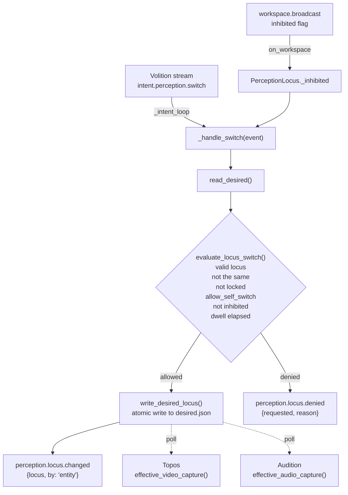

# Perception

This page covers `PerceptionLocus`, the module registered as `perception`. It arbitrates the perceptual locus, which decides whether the entity perceives through physical sensors, through virtual feeds, or not at all, and it gates locus changes that the entity itself requests. The paper claims no brain function for it. Read this page if you are enabling the module, configuring physical or virtual perception, or writing a module that reads the locus.

## Status

`PerceptionLocus` is built and tested, and held: `perception` is `false` in the shipped `[modules]` block of `config/kaine.toml` and in the base-thesis `thesis_test` profile. It needs no optional extra. It needs the bus (Redis).

The locus itself does not depend on this module. The locus state in `kaine.perception_state` is always in force: boot selects the virtual locus for the seeded, playlist and gestational feeds, and the operator sets the locus through Nexus. What the module adds is the path by which the entity may switch its own locus. No module produces the `intent.perception.switch` event that path consumes, so the self-switch cannot fire even with `allow_self_switch = true`; the flag is reserved for later virtual-world work, and locus changes are operator-driven.

Perception is not in the default order of the [module-addition study](../15-experiments/ignition-study.md) (the ignition study in code). The reference host attaches no alternative sensor feed, and with only the study's film feed Perception would be an expected null, so it joins the study only once a sensor feed is attached, through an explicit `--order`.

The shipped `[perception]` section:

```toml
[perception]
allow_self_switch = false
min_dwell_s = 30.0
```

## The locus

| Locus | Meaning |
|---|---|
| `physical` | The real camera and microphone may run; virtual feeds are dark |
| `virtual` | The virtual feeds (seeded, playlist, gestational, or an in-world body) may run; the real camera and microphone are off |
| `off` | All perceptual input is off |

Physical and virtual perception exclude each other. `PerceptionLocus` does not start or stop the camera or microphone. Topos and Audition poll the capture functions of `kaine.perception_state` and follow a change within one sensor poll interval.

Two paths change the locus:

1. The operator path. In Nexus, `POST /diagnostics/perception/locus` sets the locus and the lock, and `POST /diagnostics/perception/toggle` changes only the audio and video desired flags. The operator can also edit `state/perception/desired.json`.
2. The entity path. `PerceptionLocus` reads `intent.perception.switch` events from the Volition stream and applies a switch only if every gate below passes.

## Self-switch gates

All six gates must pass for an entity-initiated switch, checked in this order by `evaluate_locus_switch()`.

| Gate | Condition |
|---|---|
| Valid locus | `requested` is `physical`, `virtual` or `off` |
| A real change | `requested` differs from the current locus |
| Not locked | `locus_locked` is `false` |
| Policy allows | `[perception].allow_self_switch` is `true` (default `false`) |
| Not inhibited | the latest broadcast was not inhibited |
| Dwell elapsed | at least `min_dwell_s` (default 30.0) entity-time seconds since the last switch |

If any gate fails, `PerceptionLocus` publishes `perception.locus.denied` with a reason. A lock held by gestation gives the reason "locus locked by gestation gate".

## Inputs

| Bus stream | Event or handler | Purpose |
|---|---|---|
| Volition stream (`VOLITION_STREAM` in `kaine.workspace.volition`, `"volition.out"`) | `intent.perception.switch` | Entity request `{"locus": "physical" \| "virtual" \| "off"}` |
| `workspace.broadcast` | `on_workspace(snapshot)` | Tracks `snapshot.inhibited` for the gate |

At `initialize()` the module moves its cursor to the newest event on the intent stream, so it does not act on intents older than its start.

## Outputs

All events go to `perception.out`.

| Event type | Payload fields | Intensity |
|---|---|---|
| `perception.locus.changed` | `locus`, `by: "entity"` | 0.5 |
| `perception.locus.denied` | `requested`, `reason` | 0.3 |

On a successful switch, `perception_state.write_desired_locus(requested)` writes `state/perception/desired.json` atomically and the dwell timer restarts.

## Configuration

`make_perception()` in `kaine/boot/factories/perception.py` reads `[perception]`.

| Constructor parameter | Config key | Type | Default | Meaning |
|---|---|---|---|---|
| `allow_self_switch` | `[perception].allow_self_switch` | bool | `false` | Whether the entity may switch its locus at all |
| `min_dwell_s` | `[perception].min_dwell_s` | float | `30.0` | Minimum entity-time seconds between self-initiated switches |
| `intent_stream` | none | string | `VOLITION_STREAM` | Stream carrying `intent.perception.switch` |
| `desired_path` | none | path | `None`, meaning `state/perception/desired.json` | Override of the desired-state file (mostly for tests) |
| `entity_clock` | none | clock | `None`, meaning a new `EntityClock()` | Shared entity clock; the dwell timer runs on entity time, so it stretches and shrinks with `time_scale` |

The operator can always set the locus through `POST /diagnostics/perception/locus` or by editing `state/perception/desired.json`, unless gestation holds the lock.

## How a switch is evaluated



## How sensor modules read the locus

`kaine.perception_state` exposes these functions:

- `effective_audio_capture()` is true only when the locus is `physical` and the audio desired flag is set;
- `effective_video_capture()` is true only when the locus is `physical` and the video desired flag is set;
- `effective_virtual_audio_capture()` and `effective_virtual_video_capture()` are true when the locus is `virtual` and the matching desired flag is set;
- `select_virtual_feed()` sets the locus to `virtual` and both desired flags to true. Boot calls it for the seeded, playlist and gestational feeds, and it changes nothing if the locus is locked.

With the locus `off`, every capture function returns false. A locus switch keeps the desired flags, so returning to `physical` restores the earlier settings.

## Lock and operator override

`state/perception/desired.json` holds the state:

```json
{
  "audio_live_desired": false,
  "video_live_desired": false,
  "locus": "physical",
  "locus_locked": false,
  "locked_by": "operator"
}
```

`locus_locked` is a boolean. `locked_by` is always a string, `"operator"` by default, and records who holds the lock, for example `"gestation"`. An invalid locus value is read as `"physical"`, which keeps the real camera and microphone out of an undefined state.

Writes are atomic (write, then rename). An operator write to `locus` bypasses the self-switch gates unless gestation holds the lock. While gestation holds it, `read_desired()` forces the locus to `virtual` and writes from anyone else are ignored, which keeps a gestating being on the gestational feed.

## Enabling

In the operator file `config/kaine.operator.toml` (the same flag in the shipped `config/kaine.toml` would be overridden by the `thesis_test` profile, which the loader applies when no profile is selected):

```toml
[modules]
perception = true

[perception]
allow_self_switch = false
min_dwell_s = 30.0
```

Setting `allow_self_switch = true` has no effect until a module produces `intent.perception.switch`. Use `POST /diagnostics/perception/locus` (`kaine/nexus/perception.py`) to set the locus or the lock from Nexus, and `POST /diagnostics/perception/toggle` to change only the desired flags.

## What is kept

`PerceptionLocus` keeps no sensory content. The files involved are:

- `state/perception/desired.json`, holding booleans, the locus, `locus_locked` and `locked_by`;
- `state/perception/runtime.json`, written by `LiveMicrophone` and `LiveCamera` with start and stop timestamps only.

The events `perception.locus.changed` and `perception.locus.denied` carry the locus label and a reason string.

## Tests

| File | What it checks |
|---|---|
| `tests/test_perception_locus.py` | The default locus is `physical`; `virtual` turns real capture off; returning to `physical` restores it |
| `tests/test_perception_state.py` | `read_desired()`, `write_desired_locus()`, atomic writes, runtime state, the gestation lock |
| `tests/systems/test_live_perception_subsystem.py` | Locus gating with live camera and microphone on the bus |

## Spec and related

- OpenSpec: `openspec/specs/perception-locus/spec.md`, the contract (physical excludes virtual, operator control and lock, gated self-switch) implemented by `kaine/modules/perception/module.py`
- [Where perception comes from](../08-cognitive-cycle/perception-locus.md)
- [The cognitive cycle](../08-cognitive-cycle/README.md)
- [Topos](topos.md) and [Audition](audition.md), which follow the locus
- [Mundus](mundus.md), which acts in a virtual world only on the virtual locus
- [Feed and sleep configuration](../appendix-a-configuration/perception-and-sleep.md)
