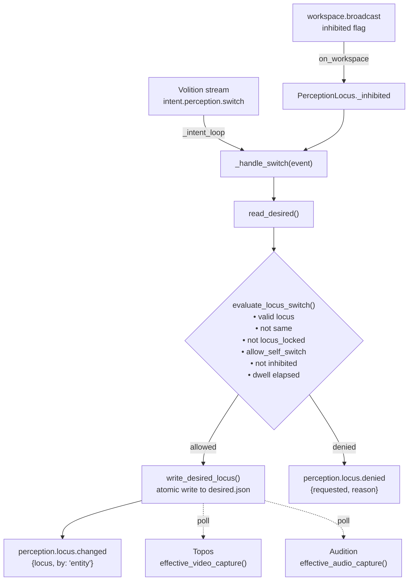

# Perception

This page covers the `PerceptionLocus` module, KAINE's perceptual-locus arbiter. It controls whether the entity is using physical sensors, virtual-world feeds, or no perception at all, and it gates entity-initiated locus changes. Read this if you are enabling perception, configuring physical or virtual embodiment, or writing a module that reads the locus state.

## Status

`PerceptionLocus` is implemented and ships disabled. Both `perception` and `mundus` appear in the shipped `[modules]` block of `config/kaine.toml` as `false`. Both are also off in the base-thesis `thesis_test` profile; set `perception = true` to enable the module. No optional extras are required. Redis is required.

The `[perception]` section already exists in `config/kaine.toml` with these shipped defaults:

```toml
[perception]
allow_self_switch = false
min_dwell_s = 30.0
```

No module emits `intent.perception.switch`, so entity self-switching cannot actually be triggered even when `allow_self_switch = true`. The flag is in place for future virtual-world embodiment work; locus changes are operator-driven.

## What the module does

In KAINE's architecture, the **perceptual locus** is the entity's answer to which world it is embedded in right now.

| Locus | Meaning |
|---|---|
| `physical` | Real camera and microphone active; virtual feeds dark |
| `virtual` | In-world visual and chat feeds active; real camera and microphone off |
| `off` | All perceptual inputs disabled |

`PerceptionLocus` enforces physical/virtual mutual exclusion. It does not start or stop the camera or microphone itself. `Topos` and `Audition` poll `kaine.perception_state.effective_video_capture()` and `effective_audio_capture()` respectively, and the locus propagates to them within one sensor poll interval.

Two paths can change the locus:

1. **Operator path** — In Nexus, `POST /diagnostics/perception/locus` sets the locus and the lock. `POST /diagnostics/perception/toggle` only toggles the audio/video desired flags. The operator can also write `state/perception/desired.json` directly.
2. **Entity self-switch path** — `PerceptionLocus` watches the Volition stream for `intent.perception.switch` events and applies the change only if all policy gates pass.

## Self-switch policy gates

All six gates must pass for an entity-initiated switch to be applied.

| Gate | Condition |
|---|---|
| Valid locus | `requested` is `physical`, `virtual` or `off` |
| Different from current | `requested != current` |
| Not locked | `DesiredState.locus_locked` is `false` |
| Policy allows | `[perception].allow_self_switch` is `true` (default `false`) |
| Workspace not inhibited | `WorkspaceSnapshot.inhibited` is `false` |
| Minimum dwell elapsed | `time_since_last_switch >= min_dwell_s` (default `30.0`) |

If any gate fails, `PerceptionLocus` publishes a `perception.locus.denied` event with a reason string. A gestation lock produces the distinct reason "locus locked by gestation gate".

## Inputs

| Bus stream | Event type consumed | Purpose |
|---|---|---|
| Volition stream (`kaine.workspace.volition.VOLITION_STREAM`) | `intent.perception.switch` | Entity-initiated locus switch request: `{"locus": "physical"\|"virtual"\|"off"}` |
| `workspace.broadcast` | `on_workspace(snapshot)` | Tracks `snapshot.inhibited` for the policy gate |

The Volition stream name resolves to whatever `VOLITION_STREAM` is set to in `kaine.workspace.volition` (default `"volition.out"`). At construction, `PerceptionLocus` reads the latest event on the intent stream so it does not replay stale intents from before it was enabled.

## Outputs

All events are published to the `perception.out` stream.

| Event type | Payload fields | Salience |
|---|---|---|
| `perception.locus.changed` | `locus`, `by: "entity"` | `0.5` |
| `perception.locus.denied` | `requested`, `reason` | `0.3` |

On a successful switch, `perception_state.write_desired_locus(requested)` performs an atomic write to `state/perception/desired.json`, and the dwell timer is reset.

## Configuration

`make_perception()` in `kaine/boot.py` reads the `[perception]` section from `config/kaine.toml`.

| Constructor parameter | Config key | Default | Meaning |
|---|---|---|---|
| `allow_self_switch` | `[perception].allow_self_switch` | `false` | Whether the entity may self-switch the locus at all |
| `min_dwell_s` | `[perception].min_dwell_s` | `30.0` | Minimum seconds between self-initiated switches |
| `intent_stream` | — | `VOLITION_STREAM` | Bus stream carrying `intent.perception.switch` events |
| `desired_path` | — | `None` → `state/perception/desired.json` | Override path for the desired-state file (mostly tests) |
| `entity_clock` | — | `None` → a fresh `EntityClock()` | Shared subjective clock; the dwell timer runs in subjective time, so it dilates with `time_scale` |

To allow entity self-switching, override in your local `config/kaine.toml`:

```toml
[perception]
allow_self_switch = true
min_dwell_s = 60.0
```

The operator can always override the locus via `POST /diagnostics/perception/locus` or by editing `state/perception/desired.json`, unless the locus is locked by gestation.

## How a locus switch is evaluated



## How sensor modules use the locus state

`kaine.perception_state` exposes these gate functions:

- `effective_audio_capture()` returns `True` only when `locus == "physical"` and the audio desired flag is `True`.
- `effective_video_capture()` returns `True` only when `locus == "physical"` and the video desired flag is `True`.
- `effective_virtual_audio_capture()` and `effective_virtual_video_capture()` return `True` when `locus == "virtual"` and the matching virtual capture desired flag is set.
- `select_virtual_feed()` does not choose between feeds. It sets `locus` to `virtual` and both desired flags to `true`. Boot calls it for seeded, playlist and womb feeds, and it does nothing if the locus is locked.

When `locus` is `off`, all capture functions return `False`. The audio/video desired flags are preserved during a locus switch, so returning to `physical` restores the previous desired state.

## Locus lock and operator override

`state/perception/desired.json` holds the operational state:

```json
{
  "audio_live_desired": false,
  "video_live_desired": false,
  "locus": "physical",
  "locus_locked": false,
  "locked_by": "operator"
}
```

The `locus_locked` boolean is `false` when unlocked and `true` when locked. `locked_by` is always a string, defaulting to `"operator"`, and records who holds the lock (for example `"gestation"`). An invalid locus value is coerced to `"physical"` on read, so the real camera and microphone are never left in an unknown state.

Writes are atomic (write-then-rename). Operator writes to the `locus` field bypass the policy gates when the locus is not locked by gestation.

When the lock is held by gestation, `read_desired()` forces `locus = "virtual"` and non-gestation writes are ignored. This is how womb mode keeps the entity on virtual feeds only.

## Enabling and use

```toml
# local config/kaine.toml — do not commit
[modules]
perception = true

[perception]
allow_self_switch = false
min_dwell_s = 30.0
```

To allow autonomous switching between physical and virtual embodiment:

```toml
[perception]
allow_self_switch = true
min_dwell_s = 60.0
```

Use `POST /diagnostics/perception/locus` (see `kaine/nexus/perception.py`) to set the locus or the lock flag from Nexus. Use `POST /diagnostics/perception/toggle` only to change the audio/video desired flags.

## What is persisted

`PerceptionLocus` persists no sensory content. The files it touches are:

- `state/perception/desired.json` — operational booleans, locus string, `locus_locked` and `locked_by`. No transcribed text, audio bytes, or frame data.
- `state/perception/runtime.json` — written by `LiveMicrophone` and `LiveCamera` with start/stop timestamps only.

The bus events `perception.locus.changed` and `perception.locus.denied` carry only the locus label and a reason string.

## Tests

| File | What it verifies |
|---|---|
| `tests/test_perception_locus.py` | Default locus is `physical`; virtual forces real capture off; restoration on returning to physical |
| `tests/test_perception_state.py` | `read_desired()`, `write_desired_locus()`, atomic write, runtime state tracking, gestation lock |
| `tests/systems/test_live_perception_subsystem.py` | Redis-backed locus gating with live camera/mic integration |

## Spec and related

- OpenSpec: `openspec/specs/perception-locus/spec.md` — the perception-locus contract (physical XOR virtual, operator control/lock, gated self-switch) implemented by `kaine/modules/perception/module.py`
- Where perception comes from: `08-cognitive-cycle/perception-locus.md`
- The cognitive cycle: `08-cognitive-cycle/README.md`
- Visual perception and the locus gate: `topos.md`
- Audio perception and the locus gate: `audition.md`
- Virtual-world embodiment: `mundus.md`
- Embodiment self-model: `eidolon.md`
- Feed and sleep configuration: `appendix-a-configuration/perception-and-sleep.md`
