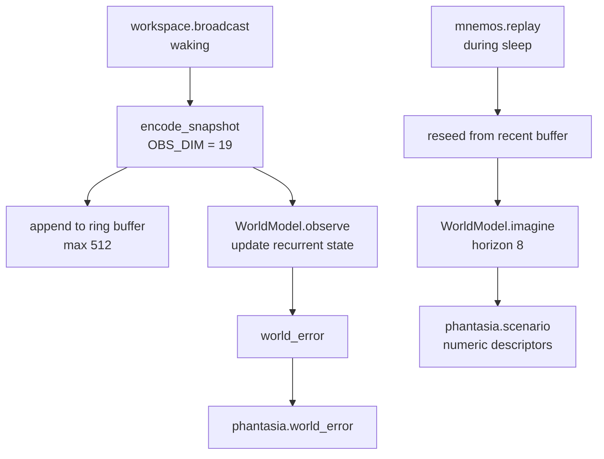

# Phantasia

Phantasia is KAINE's world-model module. It is a latent recurrent world model in the DreamerV3 style (Hafner et al. 2025; Ha and Schmidhuber 2018) that learns from the entity's own waking trajectories, predicts the next broadcast, reports how far the present broadcast departs from that prediction, and rolls out imagined trajectories during sleep. The brain function it draws on is the construction of simulated scenes (Hassabis and Maguire 2007). The question it lets the module-addition study ask is whether world-model prediction error, competing alongside perceptual and interoceptive error, changes the sequence of accessed coalitions in characteristic ways. This page is for operators who enable it, researchers who check the world-model implementation, and contributors who change the encoder or the backends.

## Status

Phantasia is built and tested, and held: it is off in the shipped `config/kaine.toml` (`[modules].phantasia = false`) and in the base-thesis `thesis_test` profile. The [module-addition study](../15-experiments/ignition-study.md) (the ignition study in code) adds it second in its default order of six: Mnemos, Phantasia, Nous, Eidolon, Empatheia, Vox. The study overlay sets `training_enabled = true` and `persist_weights = true`, and the runner checks that each step's preservation bundle captured the world model.

- The default backend is `"dreamerv3"`, the learning world model.
- The default engine is `"jax"` (`DreamerV3WorldModel`), which needs the `[worldmodel]` optional extra (`jax[cpu]`, `chex`, `einops`).
- The `"numpy"` engine (`NumpyDreamerV3WorldModel`) needs no extra. It runs the same model in NumPy and trains it with hand-written backpropagation through time.
- The `"fake"` backend (`FakeWorldModel`) is a non-learning development fallback with no dependencies.

The world model begins untrained at first boot. The shipped `[phantasia]` block turns on sleep-time training and weight persistence; the constructor defaults for both flags are `false`, so a configuration that omits them neither trains nor saves weights.

Phantasia is a world model only. It has no actor, critic, reward head or return head; action selection belongs to [Nous](nous.md).

## What it does

1. Waking prediction error. On every broadcast while the entity is awake, accessed or inhibited, Phantasia encodes the snapshot, folds it into the world model's recurrent state, and publishes `phantasia.world_error`. The event enters the workspace competition as a candidate whose intensity grows with the error, so world-model surprise competes with the other modules' reports. Phantasia reports at fixed baseline and alert levels and does not use the graded intensity of the four base-thesis processors.
2. Sleep-time imagination. During a [Hypnos](hypnos.md) sleep, each `mnemos.replay` cue makes Phantasia reseed the world model from its recent waking observations and roll out imagined future states, published as `phantasia.scenario`. These events enter the workspace competition like any other module event.

The waking trajectory buffer lives only in memory and is never serialized.

## Inputs

| Source | Stream | Event type | What is used |
|---|---|---|---|
| Syneidesis | `workspace.broadcast` | snapshot | The snapshot, encoded as an observation vector (waking path) |
| [Mnemos](mnemos.md) | `mnemos.out` | `mnemos.replay` | `memory_id`, recorded as the scenario's seed id |
| [Hypnos](hypnos.md) | `hypnos.out` | `hypnos.sleep.started` | Opens the sleep window and starts a training pass |
| [Hypnos](hypnos.md) | `hypnos.out` | `hypnos.sleep.completed` | Closes the sleep window |

A background task, `_peer_consumer_loop`, reads the Mnemos and Hypnos events. The waking path is paused while the sleep window is open.

## Outputs

| Stream | Event type | Payload fields | Intensity |
|---|---|---|---|
| `phantasia.out` | `phantasia.world_error` | `world_error` (float in [0, 1]), `salience`, `tick_index`, `backend`, `engine` | `baseline + world_error × (alert − baseline)` |
| `phantasia.out` | `phantasia.scenario` | `seed_memory_id`, `horizon`, `step_magnitudes`, `trajectory_drift`, `encoder_version`, `backend`, `engine` | `baseline + min(1, peak step magnitude) × (alert − baseline)` |

`phantasia.world_error` carries a number and no imagined content. `phantasia.scenario` carries compact numeric descriptors of the trajectory. Every event names its backend, so the development fallback can never be mistaken for the learning model.

## Configuration

All keys are under `[phantasia]`. The full reference is in [`appendix-a-configuration/modules.md`](../appendix-a-configuration/modules.md).

| Key | Type | Default | Meaning |
|---|---|---|---|
| `backend` | string | `"dreamerv3"` | `"dreamerv3"` (the learning model) or `"fake"` (development fallback) |
| `engine` | string | `"jax"` | `"jax"` (needs the `[worldmodel]` extra) or `"numpy"` (no extra) |
| `training_enabled` | bool | `false` | Run one in-memory training pass when a sleep starts. The shipped file sets `true`. |
| `persist_weights` | bool | `false` | Save and load the learned weights across restarts. The shipped file sets `true`. A configuration error with `"fake"`. |
| `checkpoint_path` | string | `"state/phantasia/world_model.ckpt"` | Where the weights are saved |
| `training_device` | string | `"cpu"` | JAX device for training with the JAX engine |
| `trajectory_buffer_size` | int | `512` | Size of the waking observation ring buffer |
| `rollout_horizon` | int | `8` | Imagined steps per scenario |
| `mnemos_stream` | string | `"mnemos.out"` | Stream read for replay cues |
| `hypnos_stream` | string | `"hypnos.out"` | Stream read for sleep events |
| `[phantasia.salience].baseline` | float | `0.1` | Lowest intensity of `world_error` and `scenario` |
| `[phantasia.salience].alert` | float | `0.7` | Intensity at full error or full peak magnitude |
| `[phantasia.world_model].deter_dim` | int | `64` | Size of the GRU deterministic state |
| `[phantasia.world_model].stoch_dim` | int | `16` | Number of stochastic latent variables |
| `[phantasia.world_model].stoch_classes` | int | `8` | Classes per categorical latent |
| `[phantasia.world_model].hidden_dim` | int | `64` | Width of the MLP hidden layers |
| `[phantasia.world_model].latent_kind` | string | `"categorical"` | `"categorical"` or `"gaussian"` |
| `[phantasia.world_model].learning_rate` | float | `0.001` | Learning rate |

## How it works

### Observation encoder

`encode_snapshot(snapshot)` in `kaine/modules/phantasia/encoder.py` maps a broadcast snapshot to a vector of `OBS_DIM = 19` floats: 15 source slots, 3 affect slots and an inhibition flag.

| Slots | Content |
|---|---|
| 0 to 14 | For each module in `SOURCE_ORDER`, the sum of its coalition members' reported intensities, clipped to [0, 1] |
| 15 | Affect intensity: the absolute arousal of a `thymos.state` member, clipped to [0, 1] |
| 16 | Valence (may be negative) |
| 17 | Dominance |
| 18 | 1.0 if the broadcast was inhibited, otherwise 0.0 |

`SOURCE_ORDER` is fixed, and the encoder stamps `VERSION = "phantasia-encoder-v1"` into scenario payloads and checkpoints so that a change of layout is detected. The encoder uses only the standard library, so tests can encode observations without the `[worldmodel]` extra. The vector holds numbers derived from event sources, intensities and affect; it holds no audio, image or text.

### World model protocol and backends

`WorldModel` in `kaine/modules/phantasia/world_model.py` is a runtime-checkable protocol with four methods:

```python
def observe(obs: list[float]) -> float: ...
def imagine(horizon: int) -> list[list[float]]: ...
def train(trajectory: list[list[float]]) -> TrainOutcome: ...
def reset_state() -> None: ...
```

`FakeWorldModel`, the development fallback, keeps an exponential moving average of observations. Its `imagine()` returns a geometrically decaying rollout of the current state, and its `train()` nudges the averaging rate toward 0.5. It guards against non-finite values and does not learn from experience.

`DreamerV3WorldModel` (JAX engine) wraps `external/dreamerv3/rssm.py`, a clean-room JAX implementation of the DreamerV3 recurrent state-space core attributed to danijar/dreamerv3 (MIT; the pinned commit is in `external/dreamerv3/UPSTREAM`). It implements the encoder MLP, the GRU deterministic state, a categorical or Gaussian stochastic latent, the decoder MLP, and prior-only imagination. It has no actor, critic, return head or reward head and does not use the upstream disk-serialization hooks.

`NumpyDreamerV3WorldModel` (NumPy engine) implements the same core in `kaine/modules/phantasia/rssm_numpy.py` and trains it with hand-written backpropagation through time. Golden fixtures in `tests/fixtures/phantasia_golden/*.npz`, recorded by `scripts/record_phantasia_golden.py`, check it against the JAX core: the forward pass, the loss, every parameter gradient and a five-step training trajectory agree within 1e-4. A second check, which needs no JAX, compares the gradients with central finite differences of a surrogate loss that fixes each stop-gradient side of the KL balancing, so its derivative equals the training gradient. A 120-step training run agrees with the JAX engine to 1e-5 in every parameter. The NumPy engine does not reproduce JAX's random number generator, so a fresh model under NumPy is a different draw than under JAX for the same seed. Imagination samples with NumPy's generator (Gumbel-max for categorical latents). The test suite holds the median NumPy `observe` step under 5 ms and one training pass over a full 512-observation buffer under 3 s.



### Waking path

On each broadcast outside a sleep, Phantasia:

1. encodes the snapshot;
2. appends the observation to the ring buffer;
3. calls `world_model.observe(obs)`, which updates the recurrent state and returns a prediction error in [0, 1];
4. publishes `phantasia.world_error`.

### Sleep path

On `hypnos.sleep.started`, the sleep window opens, the waking path stops, and `_maybe_train()` runs one in-memory training pass over the buffer if `training_enabled` is true.

On a `mnemos.replay` cue while the window is open, `generate_scenario()` runs. It resets the world model, replays the last `rollout_horizon` waking observations to seed it, and calls `world_model.imagine(rollout_horizon)`. The rollout is summarized as per-step mean magnitudes and an overall drift, and published as `phantasia.scenario` with the replay's `memory_id` as `seed_memory_id`. A cue that arrives while the entity is awake is ignored. Hypnos's associative replay phase, off by default, can also cue scenarios directly.

### Training

`train_now()` passes the whole buffer to `world_model.train()` as one trajectory. If any row is non-finite or the loss is NaN or infinite, the pass aborts and the last good parameters are kept. Training writes no files. A pass that learned and did not abort increments the count of successful training passes, which the developmental gate runner reads when Phantasia is registered.

## Key files

| Path | Purpose |
|---|---|
| `kaine/modules/phantasia/module.py` | `Phantasia(BaseModule)`: waking and sleep paths, training, persistence |
| `kaine/modules/phantasia/world_model.py` | The `WorldModel` protocol, `FakeWorldModel`, `DreamerV3WorldModel`, `NumpyDreamerV3WorldModel`, `TrainOutcome` |
| `kaine/modules/phantasia/encoder.py` | `encode_snapshot()`, `observation_dim()`, `SOURCE_ORDER`, `VERSION` |
| `kaine/modules/phantasia/rssm_numpy.py` | The NumPy core and its hand-written backpropagation |
| `kaine/modules/phantasia/checkpoint.py` | Atomic, encryption-aware reading and writing of checkpoint bytes |
| `external/dreamerv3/rssm.py` | Clean-room JAX core (danijar/dreamerv3, MIT) |
| `external/dreamerv3/UPSTREAM` | Upstream URL, pinned commit and licence |
| `kaine/boot/factories/phantasia.py` | `make_phantasia()`: backend and engine selection |
| `scripts/record_phantasia_golden.py` | Records the JAX golden fixtures |
| `tests/fixtures/phantasia_golden/*.npz` | Golden fixtures for forward, loss, gradient and training parity |

## Enabling

1. In the operator file `config/kaine.operator.toml`, set `[modules].phantasia = true`. The same flag in the shipped `config/kaine.toml` would be overridden by the `thesis_test` profile, which the loader applies when no profile is selected.
2. Choose an engine. For the JAX engine (the default), install the extra with `.venv/bin/pip install -e '.[worldmodel]'`. For the NumPy engine, set `engine = "numpy"` under `[phantasia]`. The shipped training and persistence settings apply to both.
3. For the development fallback, set `backend = "fake"` and `persist_weights = false`; `persist_weights = true` with this backend raises a `ValueError` at construction.

Phantasia needs no external service. To force a scenario in a test without a full sleep:

```python
phantasia._window_active = True  # normally set by hypnos.sleep.started
await phantasia.generate_scenario(seed_memory_id="test")
```

## What Phantasia keeps

- The trajectory ring buffer is an in-memory deque and is never serialized.
- `train_now()` writes nothing to disk, and the upstream disk hooks are bypassed.
- Observation vectors hold derived numbers only.
- `serialize()` emits checkpoint metadata (backend, engine, checkpoint path, persistence flag, encoder version, `obs_dim`, training flag) and never weights or buffer contents.

## Weight persistence

The learned parameters are derived numeric weights. With `persist_weights = true` and `backend = "dreamerv3"`:

- At `initialize()` Phantasia loads the weights from `checkpoint_path` if the file exists; otherwise it starts fresh and saves there.
- It saves after each training pass that learned at least one step without aborting, and on graceful shutdown, including an operator freeze. An aborted pass leaves the last good checkpoint in place.
- The checkpoint is an in-memory NPZ of the parameter tree with an embedded header (`obs_dim`, the core's dimensions, `latent_kind`, the encoder version). It is written atomically (temporary file and `os.replace`) and encrypted with AES-256-GCM when `[security.state_encryption]` is enabled. Both engines use the same codec (`kaine-phantasia-rssm-npz-v1`, float32) and the header does not record the engine, so a checkpoint written under one engine loads under the other.
- Two checks fail closed: `persist_weights = true` with the `fake` backend is a `ValueError` at construction, and a checkpoint whose header does not match the running model raises `CheckpointMismatchError` at boot. Phantasia never discards learned weights and reinitializes on its own.
- The decommission backup bundle copies `state/phantasia/` as transferable cognitive state (CAL Article 4.2(b)), and `delete_entity_state` removes it.
- The trajectory buffer is never part of a checkpoint.
- The preservation record carries the backend, the engine, the checkpoint path and the encoder version, and the preservation bundle carries the pass-count sidecar with the weights, which revive restores. Reviving a bundle without weights into an instance that persists weights logs a warning that the world model starts fresh.

### Forks and merges

Fork snapshots store module artifacts in `<snapshot root>/<id>/artifacts/<module>/` (directories `0700`, files `0600`; the checkpoint is encrypted at rest when state encryption is on).

- `snapshot` exports `world_model.ckpt` and its pass-count sidecar, and fails atomically, leaving no snapshot directory, if any artifact export fails.
- `fork` records `metadata["artifacts_from_parent"]` (`kaine/lifecycle/manager.py`) and copies the parent's Phantasia artifacts into the child's own snapshot, unless Phantasia is shed, so every fork owns an independent copy.
- `restore` writes the weights to Phantasia's own `checkpoint_path` and logs a warning when the snapshot has no world model.
- Symlinked artifact directories are never followed.
- `merge` refuses when both parents carry a world model unless `world_model_from="a"` or `"b"` names the one that continues, because two learned models cannot be averaged. The Nexus `/diagnostics/merges` route accepts `world_model_from` (`kaine/nexus/diagnostics.py`). `merge` records each module's artifact source in `metadata["artifact_sources"]`.

## Tests

| File | Coverage |
|---|---|
| `tests/test_phantasia_world_model.py` | `FakeWorldModel` observe, imagine, train and the NaN guard; no actor or critic in `DreamerV3WorldModel` |
| `tests/test_phantasia_encoder.py` | Vector shape, source slots, affect, the inhibition flag |
| `tests/test_phantasia_module.py` | Waking tick to `phantasia.world_error`; sleep cue to `phantasia.scenario`; the window guard |
| `tests/test_phantasia_zero_persistence.py` | The buffer is not serialized; training writes nothing |
| `tests/test_phantasia_persistence.py` | Checkpoint round trip; fail-closed mismatch and stub guards; encryption at rest; decommission inclusion |
| `tests/test_world_model_identity.py` | World-model artifact identity and source tracking across forks and merges |
| `tests/test_rssm_numpy_parity.py` | The NumPy core against the JAX fixtures; finite-difference gradient check; free bits and clipping; non-finite guards; sampling; runs with JAX blocked |
| `tests/test_phantasia_numpy_engine.py` | The NumPy engine learns without JAX; 120-step parity with JAX; checkpoint interchange both ways; engine selection and `make_phantasia()` checks; latency bounds; runs with JAX blocked |
| `tests/test_phantasia_faithful_renderer.py` | Faithful-renderer templates for `world_error` and `scenario` |

## Spec and related

- Primary spec: [`openspec/specs/phantasia/spec.md`](../../openspec/specs/phantasia/spec.md)
- Related modules: [Mnemos](mnemos.md) supplies replay cues; [Hypnos](hypnos.md) opens and closes the sleep window; [Thymos](thymos.md) supplies the affect slots of the observation vector; [Nous](nous.md) owns action selection.
