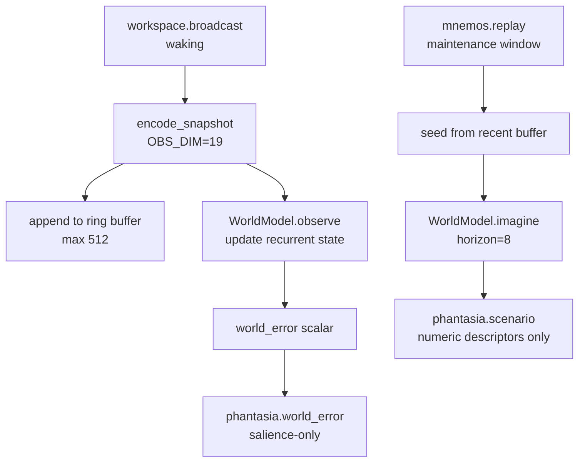

# Phantasia

Phantasia is KAINE's world-model and imagination module: a DreamerV3-style RSSM that predicts the next workspace snapshot, measures how surprising the present moment is, and generates imagined scenarios during sleep. This page is for operators enabling it, researchers checking the world-model implementation, and contributors changing the encoder or backends. It covers Phantasia's status, inputs and outputs, configuration, the waking and offline paths, weight persistence, and the test suite.

## Status

Phantasia is built and tested, but it is gated and ships disabled: `[modules].phantasia = false` in `config/kaine.toml`. It is enabled once a positive base-thesis result is recorded (see [Architecture](../02-architecture/README.md)).

- Default backend is `"dreamerv3"` (the real RSSM world model).
- Default engine is `"jax"` (`DreamerV3WorldModel`), which requires the `[worldmodel]` optional extra (`jax[cpu]`, `chex`, `einops`).
- Engine `"numpy"` (`NumpyDreamerV3WorldModel`) needs no extra; it uses only NumPy and trains with hand-written backpropagation through time.
- Backend `"fake"` (`FakeWorldModel`) is a dependency-free development fallback.

The shipped `[phantasia]` block turns on in-memory training and weight persistence once the module is enabled. The constructor defaults for both flags are `false`, so if you omit them the module does not train or persist weights.

Phantasia is not an agent: it has no actor, critic, reward head, or return head. Policy selection is handled by [Nous](nous.md).

## Responsibility

Phantasia provides a generative world model with two complementary jobs:

1. **Waking prediction-error salience** — every workspace tick, it encodes the snapshot, folds it into the world model's recurrent state, and publishes `phantasia.world_error`. This scalar salience signal reflects how surprising the current moment is relative to the model's prediction, and it influences coalition selection in the [global workspace](../08-cognitive-cycle/global-workspace.md).

2. **Offline imaginative consolidation** — during a [Hypnos](hypnos.md) maintenance window, when `mnemos.replay` cues arrive, Phantasia seeds the world model from the accumulated waking trajectory and rolls out imagined future states, publishing `phantasia.scenario` events. These re-enter the workspace broadcast so [Nous](nous.md), [Thymos](thymos.md), and [Eidolon](eidolon.md) can process them through `on_workspace`.

The waking trajectory ring buffer lives only in memory; it is never serialized.

## Inputs

| Source | Stream | Event type | What is used |
|---|---|---|---|
| Syneidesis | `workspace.broadcast` | — | Snapshot → observation vector (waking path) |
| [Mnemos](mnemos.md) | `mnemos.out` | `mnemos.replay` | `memory_id` → seeds offline scenario rollout |
| [Hypnos](hypnos.md) | `hypnos.out` | `hypnos.sleep.started` | Opens maintenance window; triggers training pass |
| [Hypnos](hypnos.md) | `hypnos.out` | `hypnos.sleep.completed` | Closes maintenance window |

Mnemos and Hypnos events are consumed by a background `_peer_consumer_loop` task. The waking path (`on_workspace`) is suppressed while `_window_active` is `true`.

## Outputs

| Stream | Event type | Key payload fields | Salience |
|---|---|---|---|
| `phantasia.out` | `phantasia.world_error` | `world_error` (float [0,1]), `salience`, `tick_index`, `backend`, `engine` | `baseline + world_error × (alert − baseline)` |
| `phantasia.out` | `phantasia.scenario` | `seed_memory_id`, `horizon`, `step_magnitudes`, `trajectory_drift`, `encoder_version`, `backend`, `engine` | Interpolated by peak step magnitude |

`phantasia.world_error` is a salience-only signal — it carries no imagined content. `phantasia.scenario` carries compact numeric trajectory descriptors, not raw sense data.

## Configuration

All keys are under `[phantasia]`. See the configuration reference for full defaults at [`appendix-a-configuration/modules.md`](../appendix-a-configuration/modules.md).

| Key | Default | Description |
|---|---|---|
| `backend` | `"dreamerv3"` | `"dreamerv3"` (real RSSM) or `"fake"` (no deps, dev-only fallback) |
| `engine` | `"jax"` | `"jax"` (requires `[worldmodel]` extra) or `"numpy"` (no extra) |
| `training_enabled` | `false` | Run an in-memory training pass when the maintenance window opens. The shipped config sets this to `true`. |
| `persist_weights` | `false` | Persist learned weights across restarts. The shipped config sets this to `true`. Configuration error with `"fake"`. |
| `checkpoint_path` | `"state/phantasia/world_model.ckpt"` | Path to the saved weight checkpoint. |
| `training_device` | `"cpu"` | JAX device for training when `engine = "jax"` |
| `trajectory_buffer_size` | `512` | Ring buffer size for waking observations |
| `rollout_horizon` | `8` | Imagined steps per scenario |
| `mnemos_stream` | `"mnemos.out"` | Bus stream consumed for `mnemos.replay` cues |
| `hypnos_stream` | `"hypnos.out"` | Bus stream consumed for sleep-cycle events |
| `[phantasia.salience].baseline` | `0.1` | Minimum salience for `world_error` and `scenario` |
| `[phantasia.salience].alert` | `0.7` | Maximum salience at max error/peak |
| `[phantasia.world_model].deter_dim` | `64` | GRU deterministic state dimension |
| `[phantasia.world_model].stoch_dim` | `16` | Stochastic latent dimension |
| `[phantasia.world_model].stoch_classes` | `8` | Stochastic categorical classes |
| `[phantasia.world_model].hidden_dim` | `64` | MLP hidden width |
| `[phantasia.world_model].latent_kind` | `"categorical"` | `"categorical"` or `"gaussian"` |
| `[phantasia.world_model].learning_rate` | `0.001` | SGD learning rate |

## How it works

### Observation encoder

`encode_snapshot(snapshot)` in `kaine/modules/phantasia/encoder.py` maps a `WorkspaceSnapshot` to a fixed-width float vector of `OBS_DIM = 19` (15 source buckets + 3 affect + 1 inhibition flag).

| Slots | Content |
|---|---|
| 0–14 | Per-source salience-weighted bucket (one slot per module in `SOURCE_ORDER`) |
| 15 | `affect_intensity` (absolute arousal from `thymos.state`, clipped to [0,1]) |
| 16 | `affect_valence` (may be negative) |
| 17 | `affect_dominance` |
| 18 | Inhibition flag (1.0 if `snapshot.inhibited`, else 0.0) |

`SOURCE_ORDER` is stable across runs; the encoder stamps `VERSION = "phantasia-encoder-v1"` into `phantasia.scenario` payloads for schema-drift detection. The encoder is pure standard library, so the test suite can encode observations without installing the `[worldmodel]` extra.

### World model protocol and backends

`WorldModel` is a runtime-checkable protocol in `kaine/modules/phantasia/world_model.py` with four methods:

```python
def observe(obs: list[float]) -> float: ...
def imagine(horizon: int) -> list[list[float]]: ...
def train(trajectory: list[list[float]]) -> TrainOutcome: ...
def reset_state() -> None: ...
```

**`FakeWorldModel`** (dev-only fallback): keeps an exponential moving average of observations. `imagine()` returns a geometrically decaying rollout of the current state, and `train()` nudges the EMA decay toward 0.5. It is NaN-guarded and has no actor, critic, or reward head.

**`DreamerV3WorldModel`** (JAX engine): wraps `external/dreamerv3/rssm.py`, a clean-room JAX re-implementation of the DreamerV3 RSSM core attributed to danijar/dreamerv3 (MIT, pinned commit recorded in `external/dreamerv3/UPSTREAM`). It implements the encoder MLP, GRU deterministic state, categorical or Gaussian stochastic latent, decoder MLP, and prior-only imagination rollout. It deliberately excludes actor, critic, return head, and reward head, and it does not use upstream disk-serialization hooks.

**`NumpyDreamerV3WorldModel`** (NumPy engine): implements the same DreamerV3 RSSM in pure NumPy in `kaine/modules/phantasia/rssm_numpy.py` and trains it with hand-written backpropagation through time. Correctness is checked against golden fixtures in `tests/fixtures/phantasia_golden/*.npz` (recorded by `scripts/record_phantasia_golden.py`): the deterministic forward pass, loss, every parameter gradient, and a five-step training trajectory all match the JAX core within `1e-4`. A second, JAX-free check uses central finite differences of a surrogate loss that fixes each stop-gradient side of the DreamerV3 KL balancing, so its derivative equals the training gradient. A long-training parity test confirms that 120 steps agree with the JAX engine to `1e-5` in every parameter. The NumPy engine does not reproduce the JAX PRNG, so a fresh model under NumPy is a different random draw than under JAX for the same seed. Imagination sampling uses NumPy's generator (Gumbel-max for categorical latents). On a desktop CPU, a NumPy `observe` step takes well under 5 ms, and one training pass over a full 512-observation buffer takes well under 3 s.



### Waking path

Each `on_workspace` call, when not in a maintenance window:

1. Encodes the snapshot.
2. Appends the observation to the bounded `deque` ring buffer (never serialized).
3. Calls `world_model.observe(obs)` to update the recurrent state and get a prediction error in [0, 1].
4. Publishes `phantasia.world_error` with interpolated salience.

### Offline path

On `hypnos.sleep.started`:

- `_window_active` becomes `true`, halting the waking path.
- `_maybe_train()` runs one in-memory training pass over the accumulated buffer if `training_enabled` is `true`.

On `mnemos.replay` while the window is active:

- `generate_scenario()` is called with `seed_memory_id` from the replay event.
- The world model is reset and re-seeded by replaying the last `rollout_horizon` waking observations from the buffer.
- `world_model.imagine(rollout_horizon)` produces `horizon` imagined observation vectors.
- The trajectory is summarised as per-step activation magnitudes and overall drift — no raw content.
- `phantasia.scenario` is published on `phantasia.out`, which feeds back into the workspace broadcast for downstream consolidation.

### In-memory training

`train_now()` passes the full buffer as a trajectory batch to `world_model.train()`. If any input row is non-finite or the computed loss is NaN or Inf, the pass aborts and restores the last-known-good state without updating the in-memory parameters. No files are written during training.

## Key files

| Path | Purpose |
|---|---|
| `kaine/modules/phantasia/module.py` | `Phantasia(BaseModule)` — waking/offline paths and training gate |
| `kaine/modules/phantasia/world_model.py` | `WorldModel` protocol, `FakeWorldModel`, `DreamerV3WorldModel`, `NumpyDreamerV3WorldModel`, `TrainOutcome` |
| `kaine/modules/phantasia/encoder.py` | `encode_snapshot()`, `observation_dim()`, `SOURCE_ORDER`, `VERSION` |
| `kaine/modules/phantasia/rssm_numpy.py` | Pure-NumPy DreamerV3 RSSM and hand-written BPTT |
| `kaine/modules/phantasia/checkpoint.py` | Atomic, encryption-aware read/write of weight-checkpoint bytes |
| `external/dreamerv3/rssm.py` | Clean-room JAX RSSM implementation (danijar/dreamerv3, MIT) |
| `external/dreamerv3/UPSTREAM` | Provenance record: upstream URL, pinned commit, license |
| `kaine/boot.py` | `make_phantasia()` — backend/engine selection and world-model wiring |
| `scripts/record_phantasia_golden.py` | Recorder that writes JAX-core golden fixtures for NumPy-engine parity tests |
| `tests/fixtures/phantasia_golden/*.npz` | Golden fixtures for forward, loss, gradients, and training-trajectory parity |

## Enabling and use

1. **Real RSSM backend** (default): set `[modules].phantasia = true`, then choose an engine:
   - **JAX engine** (default): install the world-model extra: `.venv/bin/pip install -e '.[worldmodel]'`. The shipped config enables training and persistence; leave them on unless you explicitly want a non-persistent or development setup.
   - **NumPy engine** (no extra needed): set `engine = "numpy"` in `[phantasia]`. Training and persistence are also enabled in the shipped config.
2. **Fake backend** (dependency-free development fallback): set `backend = "fake"` in `[phantasia]`. Do not set `persist_weights = true` with this backend — persistence requires real learned weights, and that combination raises a `ValueError` at construction.
3. No external services are required; Phantasia is entirely local.

To force a scenario in tests without a full Hypnos cycle:

```python
phantasia._window_active = True  # normally set by hypnos.sleep.started
await phantasia.generate_scenario(seed_memory_id="test")
```

## Zero-persistence note

Phantasia enforces zero persistence of experience data at several layers:

- The trajectory ring buffer is an in-memory `deque` and is never serialized.
- `train_now()` writes nothing to disk; upstream DreamerV3 disk hooks are bypassed.
- Observation vectors contain only derived numeric summaries — no raw audio or image bytes.
- `serialize()` emits only checkpoint metadata (backend, engine, checkpoint path, persistence flag, encoder version, `obs_dim`, training flag) — never weights or buffer contents.

## Weight persistence

Learned world-model parameters are derived numeric weights, not sense data. The shipped config turns weight persistence on (`persist_weights = true`) for `backend = "dreamerv3"`; the constructor default is `false`.

- **Load** at `initialize()` from `checkpoint_path` when the file exists; otherwise the model starts fresh and saves there.
- **Save** after each successful (non-aborted, ≥1 step) sleep-window training pass and on graceful shutdown, including an operator freeze. An aborted pass leaves the last-known-good checkpoint untouched.
- **Format**: in-memory NPZ of the RSSM parameter tree plus an embedded config header (`obs_dim`, RSSM dims, `latent_kind`, encoder version). It is written atomically (temp file + `os.replace`) and AES-256-GCM-encrypted at rest when `[security.state_encryption]` is enabled. Both engines use the same checkpoint codec (`kaine-phantasia-rssm-npz-v1`, float32), and the header does not record the engine, so a checkpoint written under the JAX engine loads under the NumPy engine and vice versa.
- **Fail closed, twice**: enabling `persist_weights` with the `fake` EMA stub is a `ValueError` at construction, and loading a checkpoint whose embedded config does not match the running model raises `CheckpointMismatchError` at boot. Phantasia never silently discards learned weights and reinitializes.
- **CAL 4.2(b)**: the decommission backup bundle copies `state/phantasia/` (transferable cognitive state), and `delete_entity_state` removes it.
- The trajectory buffer is excluded from checkpoints regardless of the persistence flag.
- The preservation record carries `backend`, `engine`, checkpoint path, and encoder version. The preservation bundle carries the pass-count sidecar with the weights; revive restores it. Reviving a bundle without weights into an instance that persists weights logs a warning that a fresh world-model start is beginning.

### Forks and merges

Fork snapshots store module artifacts in `<snapshot root>/<id>/artifacts/<module>/` (directories `0700`, files `0600`; the world-model checkpoint is encrypted at rest when state encryption is enabled).

- `snapshot` exports `world_model.ckpt` plus its pass-count sidecar and fails atomically — leaving no snapshot directory — if any artifact export fails.
- `fork` records `metadata["artifacts_from_parent"]` in `kaine/lifecycle/manager.py` and copies the parent's Phantasia artifacts (unless Phantasia is shed) into the child's own snapshot, so every fork owns an independent copy.
- `restore` installs the artifacts into the live instance: Phantasia writes the weights to its own `checkpoint_path` and logs a warning when the snapshot carries no world model.
- Symlinked artifact directories are never followed.
- `merge` refuses the merge when both parents carry a world model unless `world_model_from="a"` or `"b"` names which one continues, because two divergent learned models cannot be averaged. The Nexus `/diagnostics/merges` route accepts `world_model_from` (see `kaine/nexus/diagnostics.py:77`). `merge` records each module's artifact source in `metadata["artifact_sources"]`.

## Tests

| File | Coverage |
|---|---|
| `tests/test_phantasia_world_model.py` | `FakeWorldModel` observe/imagine/train/NaN guard; `DreamerV3WorldModel` actor-critic absence assertion |
| `tests/test_phantasia_encoder.py` | `encode_snapshot` vector shape; source bucketing; affect extraction; inhibition flag |
| `tests/test_phantasia_module.py` | Waking tick → `phantasia.world_error`; offline cue → `phantasia.scenario`; window guard |
| `tests/test_phantasia_zero_persistence.py` | Buffer not serialized; no disk artifacts during training |
| `tests/test_phantasia_persistence.py` | Weight checkpoint round-trip; fail-closed mismatch/stub guards; encryption at rest; decommission inclusion |
| `tests/test_world_model_identity.py` | Fork/merge world-model artifact identity and source tracking |
| `tests/test_rssm_numpy_parity.py` | NumPy RSSM core against JAX golden fixtures; finite-difference gradient check; free-bits and clip ties; non-finite guards; sampling; runs with JAX blocked |
| `tests/test_phantasia_numpy_engine.py` | NumPy engine learns without JAX; 120-step parity with JAX engine; checkpoint interchange both ways; engine selection and `make_phantasia()` validation; latency budget; runs with JAX blocked |
| `tests/test_phantasia_faithful_renderer.py` | FaithfulRenderer templates for `world_error` and `scenario` events |

## Spec and related modules

- Primary spec: [`openspec/specs/phantasia/spec.md`](../../openspec/specs/phantasia/spec.md)
- Related modules: [Mnemos](mnemos.md) (replay cues), [Hypnos](hypnos.md) (maintenance window), [Nous](nous.md) (processes `phantasia.scenario` during maintenance), [Thymos](thymos.md) (affect in the observation vector)

The openspec still records `persist_weights = false` as a SHALL, but the code and shipped config enable persistence when the module is turned on. The code is the source of truth.
