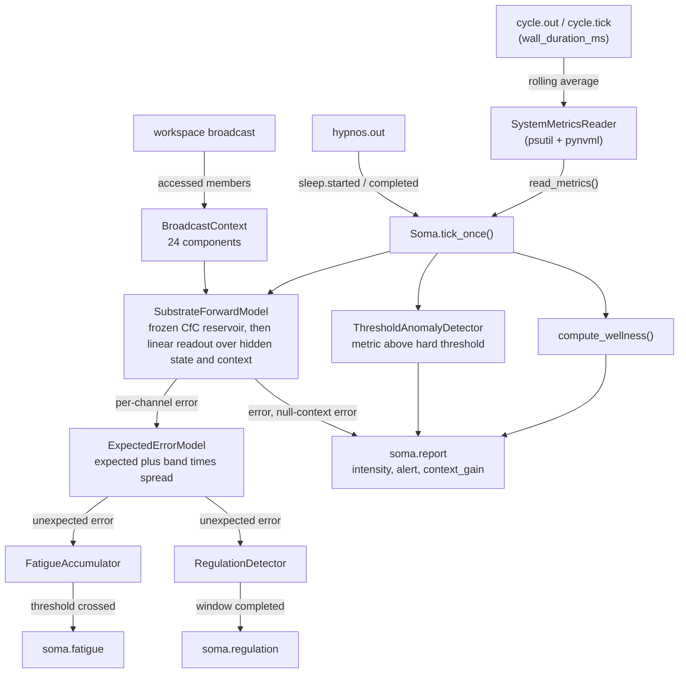

# Soma

Soma is KAINE's interoception. The compute host stands in for the body: Soma reads its CPU, memory, GPU, and cycle-latency metrics, predicts the next reading from a frozen reservoir and the broadcast context, and reports the prediction error to the workspace. It also reports wellness, accumulates fatigue (the sleep pressure that triggers Hypnos), and issues regulation advisories. This page covers the forward model, the intensity and alert rule, the events, sleep, persistence, configuration, and the self-rhythm. Read it if you are deciding whether to enable Soma or debugging its predictions.

## Status

Implemented. The shipped `config/kaine.toml` sets `[modules].soma = false`, and the `thesis_test` profile (`config/profiles/thesis_test.toml`) enables it.

The base module needs no optional extras. GPU metrics use `pynvml` on hosts with an NVIDIA GPU and are simply absent when it is unavailable. The forward model's continuous-time reservoir runs on the backend chosen by `[soma].cfc_backend`: `"numpy"` (default; needs neither `torch` nor `ncps`) or `"torch"` (needs the `core` extra). The self-rhythm needs the `oscillator` extra.

## What Soma does

Soma is the architecture's analog of interoception, the sense of the body's physiological condition, and of the allostatic-interoceptive network that anticipates and regulates the body's needs. On each reading, every `read_interval_s` entity seconds, Soma:

1. Reads the host metrics and computes wellness and the set of metrics strictly above their hard thresholds (`[soma.thresholds]`).
2. Builds an 8-component feature vector, steps the forward model, and measures the prediction error.
3. Computes the unexpected error, the part of each channel's error beyond what that channel usually shows, which drives fatigue and regulation.
4. Publishes `soma.report`, and `soma.fatigue` or `soma.regulation` when they fire.

## Forward model

`SubstrateForwardModel` (`kaine/modules/soma/forward.py`) is a reservoir with an online readout, run on the CPU:

```text
feature vector → CfC reservoir (frozen, seeded, forward_model_units hidden units) → hidden state h
[h ‖ broadcast context] → linear readout (online) → predicted next feature vector
```

The reservoir is a closed-form continuous-time network (Hasani et al. 2022), the same pattern Chronos uses (`kaine/modules/chronos/network.py`). Its weights are generated in NumPy from a reservoir seed, identically for both backends, and never trained; the two backends compute the same step and agree to 1e-5. Only the linear readout learns, from the hidden state and the 24-component broadcast context together with a bias. The readout's context weights start at zero.

At each reading Soma:

1. Scores the prediction made at the previous reading against the current feature vector. The error is the L2 distance, 0 on the first reading.
2. Takes one stochastic-gradient step (learning rate 1e-3) on the readout, from the same hidden state and context the prediction was made from, unless sleep has suspended adaptation or the loss or a gradient is not finite.
3. Advances the reservoir on the current vector and predicts the next one from the new hidden state and the context Soma holds now.

Each step passes the reservoir the time that actually elapsed: the timespan is the entity seconds since the previous reading divided by `read_interval_s`, clipped to `[0, 10]`, and 1.0 on the first reading. At a steady cadence it stays at 1.0; a delayed reading lengthens it, and the cell's time gates integrate over the longer interval. A non-finite feature vector skips the whole step, so one bad sensor read cannot corrupt the hidden state.

The feature vector holds `cpu_percent/100`, `ram_percent/100`, `cycle_latency/(2·target)`, and the hottest GPU's `gpu_*_temp_c/100` (0.0 with no GPU telemetry) in slots 0 to 3. With the self-rhythm running, slots 4 to 6 carry `0.5 + 0.5·sin(phase)`, `0.5 + 0.5·cos(phase)`, and `min(1, 2·amplitude)`; otherwise they are 0.0. Slot 7 carries the busiest GPU's `gpu_*_vram_percent/100` (feature layout 2). Every value is clamped to `[0, 1]`.

A plugin can replace the forward model through the `forward_model` seam in `kaine/boot/factories/soma.py`. A replacement receives a timespan only if it declares `accepts_timespan = True`, and receives the context only if it reports a `context_dim` above zero.

### Broadcast context

Soma reads the workspace broadcast stream (`on_workspace`). When a broadcast arrives that is not inhibited, Soma keeps the coalition members whose scores reach the access threshold recorded in the broadcast's metadata (`access_threshold`); if at least one does, they become its new context, timestamped on the entity clock. An inhibited broadcast, or one in which no member reaches the threshold, leaves the context unchanged, and before the first accessed broadcast the readout receives zeros in the context slots. The context is the 24-component featurization of the accessed members weighted by their reported intensities (`kaine/modules/context.py`; [Topos](topos.md#broadcast-context) lists the components). It records which modules' reports gained access and how strongly, and carries no payloads.

### Cross-module information gain

Alongside each prediction, the readout also predicts from a null context. Soma's null context keeps two shares of the per-source and per-type components, Soma's own and the language organ's, and replaces every other source's share, and the count and intensity statistics, with their means over the contexts Soma has adopted since boot. The language organ's share is kept because its load on the host would otherwise let that share predict Soma's input. Each `soma.report` carries

```text
context_gain = (null-context error − error) / running mean error
```

over the last `prediction_error_window` errors. It is `null` when the scored prediction had no context or the running mean is zero. The null prediction never enters learning or the competition, and its running means restart with each boot. The matched-selection and pooled arms of the planned test, and its positive control, are not built yet.

## Intensity and the alert flag

A `soma.report` is an alert when at least one host metric is strictly above its hard threshold in `[soma.thresholds]`. An alert is reported at `alert_salience`. Any other report is graded by the error ratio, the error over the mean of the last `prediction_error_window` errors (the current one included):

```text
baseline_salience + (alert_salience − baseline_salience) × min(1, ratio / 2)
```

The payload's `alert` is true exactly on an alert, and `alerts` lists the metrics that crossed. `soma.fatigue` and `soma.regulation` are published at `alert_salience` and carry no `alert` flag, so they do not raise the access rate, whose phasic input counts only events marked `alert`. Thymos reads alert reports directly from `soma.out` and raises arousal by a fixed step on each one.

## Unexpected error, fatigue, and regulation

Soma learns, per channel, the expected absolute prediction error and its spread as exponential averages with time constant `expected_error_tau_s` entity seconds. The unexpected error is the L2 norm of each channel's absolute error beyond `expected + expected_error_band × spread`, with the band taken before this reading's update. The unexpected error drives fatigue and regulation; it does not enter the intensity.

`FatigueAccumulator` integrates the unexpected error over entity time with continuous decay:

```text
F(t+dt) = max(0, F(t) + e·dt − decay·dt)
```

During a hard-threshold breach the raw prediction error is the input `e` instead. When `F` crosses `fatigue_maintenance_threshold`, Soma publishes `soma.fatigue`, which Hypnos watches. It fires once per crossing and re-arms when fatigue falls below the threshold.

`RegulationDetector` tracks how long the same error (unexpected error, or raw error during a breach) stays at or above `regulation_threshold`. Each completed `regulation_sustain_window_s` emits one escalating `soma.regulation` advisory: `reduce_rate` (severity 1), then `shed_module` (severity 2), then `request_maintenance` (severity 3). The episode resets as soon as the error falls below the threshold. Soma never acts on its own advisories; the cognitive cycle and Hypnos decide what to do.

## Developmental warm-up

A newly booted or forked readout has not yet learned the host's baseline, so its early errors would otherwise trigger false advisories and inflate fatigue. While `warmup_active` is true, Soma withholds `soma.regulation` advisories (publishing `soma.regulation.withheld` instead) and reduces fatigue's input by the warming baseline, the mean of the accumulator's own recent inputs before this reading. A spike above the recent level still builds fatigue. The raw prediction error in `soma.report`, its intensity, and any hard-threshold breach are never gated; a breach overrides the warm-up on the action path.

Warm-up ends once the readout has taken `regulation_warmup_min_samples` learning steps and `regulation_warmup_min_seconds` of entity time have passed since Soma's first reading. If `regulation_warmup_require_error_stabilized` is true, the variance of recent prediction errors must also fall below `regulation_warmup_stable_variance`. Once ended, warm-up does not return. Its state is per boot and per fork and is not serialized.

## Inputs

| Source | Mechanism | Purpose |
|---|---|---|
| Host | `SystemMetricsReader` (`psutil`, optional `pynvml`) on Soma's own timer | The metrics |
| `cycle.out` | `cycle.tick` | Reads `wall_duration_ms` for a rolling cycle-latency average, scaled to entity time |
| Workspace broadcast | `on_workspace(snapshot)` | Adopts accessed broadcasts as the readout's context |
| `hypnos.out` | `hypnos.sleep.started` | Suspends readout learning and expected-error learning; fatigue decays three times faster |
| `hypnos.out` | `hypnos.sleep.completed` | Resumes learning; resets the fatigue accumulator and the regulation detector |

## Outputs

All events are published to the `soma.out` stream.

| Event type | Payload fields | Intensity |
|---|---|---|
| `soma.report` | `metrics`, `wellness`, `alerts`, `alert`, `prediction_error`, `context_gain`, `context_age_s`, `unexpected_error`, `fatigue_value`, `fatigue_threshold`, `warmup_active` | `alert_salience` on an alert, otherwise graded by the error ratio |
| `soma.fatigue` | `value`, `threshold`, `crossed: true` | `alert_salience` |
| `soma.regulation` | `action`, `reason`, `severity` | `alert_salience` |
| `soma.warmup.started` | `min_samples`, `min_seconds`, `samples_seen`, `lived_seconds` | `baseline_salience` |
| `soma.warmup.completed` | `samples_seen`, `lived_seconds` | `baseline_salience` |
| `soma.regulation.withheld` | `would_be_action`, `prediction_error`, `sustain_elapsed_s`, `severity`, `reason: "warmup"` | `baseline_salience` |

`context_age_s` is the entity seconds since Soma received the broadcast it holds as context, or `null` before the first accessed broadcast. `lived_seconds` is the entity time since Soma's first reading in this boot. The cognitive cycle consumes only `soma.regulation`; `soma.regulation.withheld` is a record and changes nothing.

### Wellness

`compute_wellness()` maps each present metric to `[0, 1]`, with 1 healthy (for example `1 - cpu_percent/100`), and takes a weighted mean with the `[soma.weights]` weights. A metric that fails to read is omitted and the weights are spread over those present. Thymos shifts valence by the wellness Soma reports.

## Sleep

Soma keeps reading and reporting during sleep. From `hypnos.sleep.started` to `hypnos.sleep.completed` the readout takes no learning steps, the expected-error statistics do not update, and the fatigue accumulator decays three times faster. `hypnos.sleep.completed` resets fatigue to zero and clears the regulation detector.

## Persistence

`serialize()` writes:

- `forward_model`, the readout's weights and biases (context columns included);
- `reservoir_seed`, from which the frozen reservoir is rebuilt;
- `feature_layout`;
- `fatigue`, the accumulator's value (its timestamp restarts on revival);
- `expected_error`, the per-channel expected error and spread;
- `cycle_cursor` and `read_interval_s`;
- `self_rhythm`, when the self-rhythm runs.

On restore, Soma rebuilds the reservoir from `reservoir_seed`, so a preserved being keeps its reservoir. A snapshot without a seed starts a new reservoir and logs that it is new. A readout saved before the context input existed (its weight matrix as wide as the hidden state) is accepted and padded with zero context weights, so it predicts exactly as before until those weights learn. Any other shape mismatch is rejected with a warning and Soma keeps a fresh readout. A snapshot without `feature_layout` restores as layout 1, in which slot 7 stays 0.0, so a preserved being keeps the input its readout learned on.

The reservoir's hidden state, the held context, and the running statistics behind the null context are runtime state: they start empty after revival and are never persisted. Metric values are never written to disk.

## Configuration

Section `[soma]` in `config/kaine.toml`. See [Module configuration](../appendix-a-configuration/modules.md) for the complete reference and [Configuration](../appendix-a-configuration/README.md) for conventions.

| Key | Type | Default | Meaning |
|---|---|---|---|
| `read_interval_s` | float | `1.0` | Entity seconds between readings |
| `cycle_latency_target_ms` | float | `300.0` | Healthy cycle latency; latency above it lowers wellness and scales feature slot 2 |
| `cycle_latency_window` | integer | `64` | Samples in the rolling cycle-latency average |
| `baseline_salience` | float | `0.1` | Baseline intensity of the graded range |
| `alert_salience` | float | `0.7` | Alert intensity, the top of the graded range |
| `cfc_backend` | string | `"numpy"` | Reservoir backend: `"numpy"` or `"torch"` (needs the `core` extra) |
| `forward_model_units` | integer | `32` | Hidden units of the reservoir |
| `prediction_error_window` | integer | `32` | Readings in the running mean of the error |
| `fatigue_decay_per_s` | float | `0.01` | Decay rate of the fatigue accumulator per entity second; tripled during sleep |
| `fatigue_maintenance_threshold` | float | `100.0` | Fatigue at which `soma.fatigue` fires |
| `regulation_sustain_window_s` | float | `30.0` | Entity seconds of sustained error per advisory step |
| `regulation_threshold` | float | `0.5` | Error level that starts a regulation episode |
| `expected_error_tau_s` | float | `600.0` | Time constant, in entity seconds, of each channel's expected error and spread |
| `expected_error_band` | float | `2.0` | Spreads above the expected error that count as unsurprising |
| `regulation_warmup_enabled` | boolean | `true` | Enable the developmental warm-up |
| `regulation_warmup_min_samples` | integer | `1000` | Readout learning steps before warm-up can end |
| `regulation_warmup_min_seconds` | float | `1200.0` | Entity seconds since the first reading before warm-up can end |
| `regulation_warmup_require_error_stabilized` | boolean | `false` | Also require the recent error variance to fall below `regulation_warmup_stable_variance` |
| `regulation_warmup_stable_window` | integer | `32` | Readings in that variance |
| `regulation_warmup_stable_variance` | float | `0.02` | Variance below which the error counts as stabilized |
| `self_rhythm_enabled` | boolean | `false` | Run the self-rhythm; requires the `oscillator` extra |
| `self_rhythm_step_hz` | float | `20.0` | Steps per entity second of the self-rhythm |
| `self_rhythm_eta` | float | `0.0025` shipped; `0.0` when absent | Adaptation rate of the self-rhythm's period (`0` disables adaptation) |

`[soma.thresholds]` holds the hard threshold per metric. Defaults: `cpu_percent = 90.0`, `ram_percent = 90.0`, `gpu_*_temp_c = 83.0`, `gpu_*_vram_percent = 92.0`, `cycle_latency_avg_ms = 600.0`. A `gpu_*` key matches every GPU.

`[soma.weights]` holds the wellness weight per metric. Defaults: `cpu_percent = 1.0`, `ram_percent = 1.0`, `cycle_latency_avg_ms = 1.0`. Only metrics with a normalization curve and a positive weight contribute.

## How it works



### Metric collection

`SystemMetricsReader` calls `psutil.cpu_percent()`, `psutil.virtual_memory()`, and the disk I/O counters, and, when `pynvml` initializes, reads each GPU's temperature and memory use. Blocking calls run in a thread through `asyncio.to_thread()`. A metric that fails to read is omitted. The cycle-latency average is scaled by the entity clock's `scale`, so latency is measured in entity time.

## Self-rhythm

With `self_rhythm_enabled = true`, a fourth loop steps an oscillator at `self_rhythm_step_hz`, and its phase and amplitude fill feature slots 4 to 6.

The rhythm comes from a mean-field population with excitatory recurrence and fast, activity-dependent synaptic depression, the mechanism modeled for spontaneous rhythms in developing networks (Tabak et al. 2000), to which the architecture adds adaptive recovery. It runs at about 0.8 to 0.9 Hz, of the same order as human fetal breathing movements (about 44 per minute; Natale et al. 1988). Sixteen leaky integrate-and-fire units are driven by the population activity, and Soma's phase and amplitude come from that activity, band-limited over the last 8 s.

In `womb` perception-feed mode, the simulated maternal heartbeat from `MaternalDriveProvider` enters through a weak, bounded input that cannot capture the rhythm unaided. The rhythm's period adapts slowly to its input at rate `self_rhythm_eta` (as in adaptive-frequency oscillators; Righetti, Buchli and Ijspeert 2006), so any shift toward the beat has to come from exposure. Nothing in the model sets a target frequency. See [Gestation](../06-operation/gestation.md#how-entrainment-is-measured) for how entrainment is measured.

A saved self-rhythm state from an earlier oscillator version, or one whose structural parameters differ, is ignored on restore and the rhythm starts fresh.

## Enabling and use

Add to your local `config/kaine.toml` (do not commit):

```toml
[modules]
soma = true
```

Soma needs no external service. GPU metrics appear when `pynvml` is installed. To change fatigue pressure, lower `fatigue_maintenance_threshold` or raise `fatigue_decay_per_s`.

## Key files

| File | Role |
|---|---|
| `kaine/modules/soma/module.py` | `Soma` class: reading loop, intensity and alert rule, context adoption, warm-up, Hypnos loop, serialization |
| `kaine/modules/soma/forward.py` | `SubstrateForwardModel` with its context input, `metrics_to_feature_vector()` |
| `kaine/modules/context.py` | `BroadcastContext`: context featurization, adoption, null context |
| `kaine/modules/soma/reader.py` | `SystemMetricsReader`: `psutil` and `pynvml` |
| `kaine/modules/soma/wellness.py` | `compute_wellness()` |
| `kaine/modules/soma/detector.py` | `ThresholdAnomalyDetector` and the `AnomalyDetector` protocol |
| `kaine/modules/soma/expected_error.py` | `ExpectedErrorModel`: learned expected error and spread |
| `kaine/modules/soma/fatigue.py` | `FatigueAccumulator` |
| `kaine/modules/soma/regulation.py` | `RegulationDetector`: the advisory ladder |
| `kaine/oscillator/module_oscillator.py` | `SelfRhythmOscillator` |

## Tests

| File | What it verifies |
|---|---|
| `tests/test_soma_module.py` | Reading loop, alert intensity, wellness integration |
| `tests/test_soma_context.py` | Readout restore with zero context weights, null-context error, `context_gain` on reports |
| `tests/test_broadcast_context.py` | Context featurization, adoption of accessed members, inhibited broadcasts, null context |
| `tests/test_graded_intensity.py` | The shared graded-intensity rule |
| `tests/test_soma_forward.py` | `SubstrateForwardModel` step, non-finite guard, serialization |
| `tests/test_soma_expected_error.py` | `ExpectedErrorModel` learning and the unexpected error |
| `tests/test_soma_fatigue.py` | `FatigueAccumulator` dynamics, threshold crossing, reset |
| `tests/test_soma_regulation.py` | `RegulationDetector` escalation and episode reset |
| `tests/test_soma_detector.py` | `ThresholdAnomalyDetector` and wildcard matching |
| `tests/test_soma_wellness.py` | `compute_wellness()` weighting and curves |
| `tests/test_soma_system_reader.py` | `SystemMetricsReader` without `pynvml` |
| `tests/test_soma_hypnos_flag.py` | Sleep flag and suspension of learning |
| `tests/test_soma_warmup.py` | Developmental warm-up |
| `tests/test_soma_self_rhythm.py` | Self-rhythm integration |
| `tests/test_soma_self_rhythm_boot.py` | Boot wiring of the self-rhythm loop |
| `tests/test_cycle_soma_regulation.py` | `CycleEngine.consume_soma_regulation` advisory handling |
| `tests/systems/test_soma_subsystem.py` | Redis-backed subsystem integration |

## Spec and related

- OpenSpec: `openspec/specs/soma/spec.md`
- OpenSpec (predictive): `openspec/specs/soma-predictive/spec.md`
- Related modules: [Hypnos](hypnos.md) (reads fatigue), [Thymos](thymos.md) (wellness and arousal), [Chronos](chronos.md) (the same reservoir pattern)
- Cognitive cycle: [The cognitive cycle](../08-cognitive-cycle/README.md) and [The global workspace](../08-cognitive-cycle/global-workspace.md)
