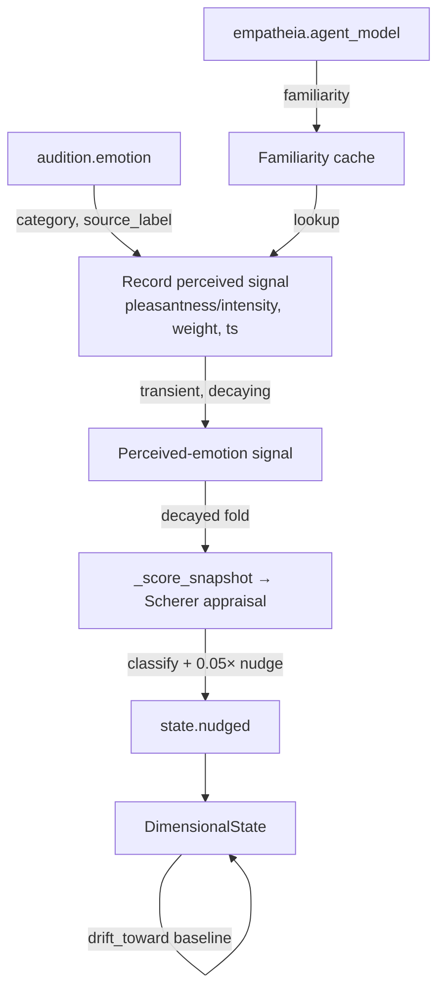

# Thymos

This page covers the Thymos module: the affective state, appraisal, drives, and the optional affect-coupling path. Read it if you are enabling the module, running the base-thesis `thesis_test` profile, or checking how perception and perceived speaker emotion influence the workspace.

Thymos ships disabled in the default config (`[modules].thymos = false` in `config/kaine.toml`). The `thesis_test` profile sets it to `true`. It has no extra dependencies beyond the core stack.

## What Thymos does

Thymos is KAINE's affective appraisal layer. It:

- Maintains a continuous, homeostatic VAD (valence/arousal/dominance) dimensional state.
- Runs a five-check Scherer Component Process Model appraisal on each workspace broadcast.
- Maintains four motivational drive accumulators: `curiosity`, `boredom`, `social_drive`, and `restlessness`.
- Exposes a `StateModulator` that Syneidesis uses for two arousal effects: a level factor `0.2 + 0.8 × arousal` common to every candidate, and a contrast gain that is 0 at or below baseline arousal and rises to `[syneidesis].arousal_contrast_gain` at arousal 1, sharpening the competition (adaptive gain; arousal-biased competition). Neither reorders candidates; per-source precision in Syneidesis does.
- Optionally folds a perceived speaker emotion into its own appraisal as a familiarity-weighted, decaying input.

## Inputs

| Stream | Event type | When consumed |
|---|---|---|
| `workspace.broadcast` | workspace snapshot | Every cognitive cycle, via `on_workspace` |
| `soma.out` | `soma.report` | Peer consumer loop; wellness sets part of the valence target; hard alerts nudge arousal |
| `chronos.out` | `chronos.report` | Peer consumer loop; the first finite idle time starts `social_drive` building, and a drop in idle time (a new operator interaction) relieves it |
| `volition.out` | `intent.*` | Peer consumer loop; each intent relieves `restlessness` and counts toward the intent rate |
| `mnemos.out` | `mnemos.recall` | Peer consumer loop; recall intensity nudges arousal |
| `audition.out` | `audition.emotion` | Peer consumer loop; records a transient perceived-emotion signal when coupling is enabled |
| `audition.out` | `audition.perception` | Peer consumer loop; `alert` events nudge arousal |
| `topos.out` | `topos.report` | Peer consumer loop; `alert` events nudge arousal |
| `empatheia.out` | `empatheia.agent_model` | Peer consumer loop (coupling enabled only); caches familiarity per `source_label` |

## Outputs

| Stream | Event type | Condition |
|---|---|---|
| `thymos.out` | `thymos.state` | Every `publish_interval_s` of subjective time, on a timer independent of broadcasts (and after a broadcast once the interval has passed); carries full VAD, drives, current emotion label, and `reset: true` after `affective_reset()` |
| `thymos.out` | `thymos.emotion` | On categorical emotion change; carries appraisal scores, the new state, `norm_compatibility_available`, and `goal_significance_method` |
| `thymos.out` | `thymos.drive` | On drive threshold crossing with hysteresis; carries drive name and value |
| `thymos.out` | `thymos.goal` | On goal lifecycle events (`added`, `completed`, `abandoned`) |

## Configuration

See the [Configuration reference](../appendix-a-configuration/modules.md) for the full `[thymos]` section.

| Key | Default | Description |
|---|---|---|
| `baseline_valence` | `0.0` | VAD baseline valence `[-1, 1]` |
| `baseline_arousal` | `0.3` | VAD baseline arousal `[0, 1]` |
| `baseline_dominance` | `0.0` | VAD baseline dominance `[-1, 1]` |
| `drift_rate_per_s` | `0.05` | Homeostatic drift rate toward baseline per second |
| `publish_interval_s` | `1.0` | Period between `thymos.state` publications |
| `appraisal_reference_interval_s` | `0.3` | Reference interval for the per-broadcast appraisal nudges: each nudge is scaled by the time since the previous appraisal over this interval (capped at 4), so the nudge per second does not depend on the broadcast rate. 0.3 s is the resting broadcast period |
| `baseline_salience` | `0.1` | Salience for routine state events |
| `alert_salience` | `0.7` | Salience for emotion changes and drive crossings |
| `social_drive_time_scale_s` | `600.0` | Accepted for compatibility; no longer used (the social drive builds at its build rate once an interaction has occurred) |
| `learning_progress_fast_weight`, `learning_progress_slow_weight` | `0.1`, `0.02` | Per-report weights of the fast and slow averages of each perceptual module's raw prediction error |
| `alert_rate_weight`, `intent_rate_weight` | `0.05`, `0.05` | Weights of the perceptual alert-rate and Volition intent-rate averages |
| `valence_time_constant_s` | `30.0` | Time constant of valence's relaxation toward its target |
| `valence_progress_gain` | `2.0` | Gain on learning progress in the valence target and the pleasantness check |
| `volition_stream` | `"volition.out"` | Stream Thymos reads Volition intents from |
| `soma_stream` | from `config/kaine.toml` | Input stream name for Soma reports |
| `chronos_stream` | from `config/kaine.toml` | Input stream name for Chronos reports |
| `mnemos_stream` | from `config/kaine.toml` | Input stream name for Mnemos recalls |

Drive sub-tables (`[thymos.drives.<name>]` for `curiosity`, `boredom`, `social_drive`, `restlessness`):

| Key | Default | Description |
|---|---|---|
| `build_rate` | per drive | Build rate per second when signal = 1.0 |
| `decay_rate` | per drive | Decay rate per second |
| `threshold` | `0.7` | Threshold for crossing event |
| `relief_gain` | per drive (0.5, 0.3, 0.8, 0.5) | Fraction of the drive a full consummatory event removes: `D <- D (1 - relief_gain * c)` |

Coupling sub-table (`[thymos.coupling]`):

| Key | Default | Description |
|---|---|---|
| `enabled` | `false` | Master toggle for affect coupling |
| `coupling_base` | `0.05` | Appraisal-influence weight when no familiarity is known |
| `coupling_familiarity_gain` | `0.10` | Additional appraisal-influence weight per unit of Empatheia familiarity |
| `coupling_ceiling` | `0.15` | Hard ceiling on the appraisal-influence weight |
| `decay_s` | `10.0` | Window over which a perceived-emotion signal decays to zero |

A legacy `coupling_max_rate_per_s` key is ignored if present, so older local configs still boot.

## How it works

### VAD state and homeostatic drift

The dimensional state is a frozen `DimensionalState(valence, arousal, dominance)`. On every `on_workspace` call Thymos first ticks:

1. Computes elapsed time `dt` since the last tick.
2. Drifts arousal and dominance toward their baselines with `drift_toward(baseline, drift_rate, dt)`, and relaxes valence toward its target (below).
3. Advances the four drives via `DriveSet.tick(dt, signals)`.
4. Calls `RegulationPolicy.suggest()` (currently `PassiveDecay`, returning zero).

Any drive that crosses its `threshold` and has not already fired emits a `thymos.drive` event. It must drop below `threshold * 0.9` to re-arm.

### Scherer CPM appraisal

`_appraise_snapshot()` scores the current workspace coalition on five dimensions:

| Check | Proxy used |
|---|---|
| **Novelty** | Suddenness from surprise: `1 - prod(1 - s_m)` over selected events carrying a `normalised_error` ratio `r`, with `s = clip(ln r / ln 3, 0, 1)`; a ratio of 2.2 gives 0.72 |
| **Intrinsic pleasantness** | `tanh(valence_progress_gain * g)`, with `g` the perceptual learning progress (errors falling is pleasant) |
| **Goal significance** | Dominant homeostatic drive, signed by salience-weighted source match; active `GoalLedger` entries still contribute by token overlap when present |
| **Coping potential** | `state.valence + (0.5 - state.arousal)` |
| **Norm compatibility** | `0.0` (pending Eidolon integration) |

### Goal-significance check

The goal/need-relevance check (Scherer 2009, "The dynamic architecture of emotion", the component process model the paper cites) scores the selected events against the entity's current homeostatic drives, which build from its own state. The cycle injects a drive-to-source table built from each registered module's `relieves_drives` declaration; the table maps each Thymos drive to the event sources whose content tends to relieve it.

With dominant drive value `v > 0` and `f` the salience-weighted share of selected events whose source relieves that drive, the drive score is `v × (2f − 1)`. Content serving the pressing need is goal-conducive (`+v` when every selected event serves it); content that does not is obstructive (`−v` when no selected event serves it). If no drive is above zero, the drive score is `0.0`.

When the `GoalLedger` holds active goals, their token-overlap score (`relevance × 2 − 1`) is also computed, and the check returns the larger of the drive score and the ledger score. The ledger API and events are unchanged; in the running system nothing currently adds goals outside tests, so the method flag reports whether goals actually contributed.

`goal_significance_method` in the published `thymos.emotion` event discloses the computation:

| Method | Meaning |
|---|---|
| `drive_relevance_v1` | Scored against the dominant drive only |
| `drive_relevance_v1+token_overlap_v1` | Both the dominant-drive score and active ledger goals contributed; the result is their max |
| `token_overlap_v1` | No drive-to-source table was injected (e.g., unit-construction tests) but active ledger goals were scored |
| `unavailable` | Neither source exists; the score is `0.0` |

The five scores map to a categorical emotion (`joy`, `sadness`, `anger`, `fear`, `surprise`, `disgust`, `neutral`) via a rule-based `classify()`. On category change, Thymos publishes a `thymos.emotion` event. SURPRISE is reachable when the coalition carries a strongly surprising report and pleasantness and goal significance are near zero. DISGUST stays unreachable until a self-model supplies norms (`norm_compatibility_available: false`).

The appraisal no longer nudges the dimensional state. Surprise reaches arousal through the perceptual-alert path below; counting it again in the appraisal once fed a positive loop through the access rate. Valence follows learning progress:

```
g        = mean over Topos, Audition of (E_slow - E_fast) / E_slow    # raw prediction error, clipped to [-1, 1]
v_target = tanh(valence_progress_gain * g + (wellness - 0.5) + coupling_pleasantness)
valence += (v_target - valence) * (1 - exp(-dt / valence_time_constant_s))
```

Errors falling (the world becoming more predictable) is positive, as in Joffily and Coricelli (2013), who identify valence with the negative rate of change of free energy. Wellness is Soma's last reading (0.5, neutral, before any).

### Perception alerts nudge arousal

`topos.report` and `audition.perception` events that carry `alert: true` add to arousal:

```
delta = 0.15 * min(4, normalised_error - 1)
```

This is the path by which surprise raises arousal.

### Drive accumulators

Each `Drive` is a deficit in `[0,1]` relative to a setpoint (Hull 1943; Keramati and Gutkin 2014). Between events it follows the exact solution of `dD/dt = build_rate * u * (1 - D) - decay_rate * D`, so it relaxes toward `build_rate * u / (build_rate * u + decay_rate)` at a rate independent of how often it is updated. A consummatory event of strength `c` relieves it: `D <- D (1 - relief_gain * c)`; the reduction is what Keramati and Gutkin call the homeostatic reward. The four drives:

| Drive | Builds with `u` | Relieved by | Grounding |
|---|---|---|---|
| `curiosity` | `1 - LP` (perception not improving) | each perceptual report, `c = LP` | curiosity is satisfied by learning progress (Oudeyer and Kaplan 2007; Schmidhuber 2010) |
| `boredom` | `1 - alert_rate` (nothing new) | each perceptual alert, `c = 1` | boredom signals a lack of engagement and is relieved by novelty (Eastwood et al. 2012; Westgate and Wilson 2018) |
| `social_drive` | `1` once an operator interaction has occurred, else `0` | a new interaction, `c = 1` | social homeostasis (Matthews and Tye 2019); isolation since spawn is an open welfare question in `thymos-active-inference-affect` |
| `restlessness` | `1 - intent_rate` (no actions) | each Volition intent, `c = 1` | a design choice; there is no established model |

`LP = max(0, g)` is the perceptual learning progress defined above. Only Hypnos's affective reset clears all drives at once.

### Affect coupling

When `[thymos.coupling].enabled = true`, the peer consumer loop watches `audition.emotion` events. It records a transient perceived-emotion signal; it never writes directly to the dimensional state.

1. Map the perceived emotion category to pleasantness and intensity using the `EMOTION_VAD` reference table.
2. Look up `familiarity` from the cache populated by `empatheia.agent_model` events, keyed on `source_label`; default to `0.0`.
3. Compute the appraisal-influence weight: `weight = clamp(coupling_base + coupling_familiarity_gain * familiarity, 0, coupling_ceiling)`.
4. Store `{pleasantness, intensity, weight, ts}`.

On each cognitive tick, `_score_snapshot` folds the decayed perceived signal into the appraisal dimensions:

- `decay = max(0, 1 - (now - ts) / decay_s)` (zero once older than `decay_s`).
- `intrinsic_pleasantness += weight * decay * pleasantness`
- `novelty += weight * decay * intensity * k` (small fixed `k`)
- All dimensions are clamped to `[-1, 1]`.

The entity's own appraisal then determines the classified emotion, and the normal appraisal→state nudge produces the response. There is no second state write and no path that moves the state toward a mirror target.



Boundedness comes from the weight ceiling, the `[-1, 1]` dimension clamp, and the decay window. Once a speaker stops talking, the signal decays to zero over `decay_s` and baseline drift recovers the state.

### Goal ledger

`GoalLedger` stores active goals with description, priority, and UUID. `relevance(text)` scores text against active goals by token overlap weighted by priority. The score feeds the `goal_significance` appraisal check.

### Serialization

`Thymos.serialize()` stores the goals, state, baseline, last emotion, and the familiarity cache. The cache holds only opaque agent-id strings and float familiarity values; no raw transcription text.

## Enabling and use

1. Set `[modules].thymos = true` in `config/kaine.toml`.
2. Enable Soma, Chronos, and Mnemos if you want their full input signal.
3. To enable affect coupling, set `[thymos.coupling].enabled = true` and enable [Audition](audition.md) and [Empatheia](empatheia.md).

## Safety notes

- Coupling cannot pin the affective state at a boundary. The perceived emotion enters appraisal as a small, ceiling-clamped, decaying contribution.
- `affective_reset()` is called by [Hypnos](hypnos.md) at the end of sleep, producing a clean affect state after maintenance. A `thymos.state` event published immediately after a reset carries `reset: true`.
- Sustained input cannot dominate the state, because it flows through the bounded appraisal path and baseline drift recovers the state once input stops.

## Key files

| File | Role |
|---|---|
| `kaine/modules/thymos/module.py` | `Thymos` class: tick, appraisal, coupling, publishing |
| `kaine/modules/thymos/state.py` | `DimensionalState` dataclass; drift, nudge, clamping |
| `kaine/modules/thymos/appraisal.py` | Scherer CPM scores and `classify()` |
| `kaine/modules/thymos/coupling.py` | `CouplingConfig`, `EMOTION_VAD`, `compute_coupling` |
| `kaine/modules/thymos/drives.py` | `Drive`, `DriveSet`, `DriveCrossing` |
| `kaine/modules/thymos/goals.py` | `GoalLedger` |
| `kaine/modules/thymos/modulator.py` | `StateModulator` (Syneidesis interface) |
| `kaine/modules/thymos/regulation.py` | `RegulationPolicy` protocol and `PassiveDecay` |

## Tests

| File | Coverage |
|---|---|
| `tests/test_thymos_state.py` | Drift, nudge, clamping |
| `tests/test_thymos_appraisal.py` | `classify()` rules for each emotion |
| `tests/test_thymos_drives.py` | Build/decay/threshold/hysteresis |
| `tests/test_thymos_goals.py` | Goal lifecycle and relevance scoring |
| `tests/test_thymos_modulator.py` | Salience multiplier monotonicity |
| `tests/test_thymos_coupling.py` | Perceived emotion → appraisal contribution, familiarity scaling, disabled identity, no direct write |
| `tests/test_thymos_coupling_drift.py` | Perceived-signal decay and boundedness |
| `tests/test_thymos_coupling_persistence.py` | Familiarity cache round-trip |
| `tests/test_thymos_module.py` | Full module lifecycle and event publishing |

## Spec and related pages

- Spec: `openspec/specs/thymos/spec.md`
- Affect coupling spec: `openspec/specs/thymos-affect-coupling/spec.md`
- [Architecture](../02-architecture/README.md) — workspace competition and the global workspace
- [Audition](audition.md) — emotion and perception source
- [Empatheia](empatheia.md) — familiarity source
- [Hypnos](hypnos.md) — calls `affective_reset()`
- [Soma](soma.md), [Chronos](chronos.md), [Mnemos](mnemos.md) — input peers
- [Topos](topos.md) — change-alert source
- [Eidolon](eidolon.md) — norm compatibility integration target
- [Configuration reference](../appendix-a-configuration/modules.md)
