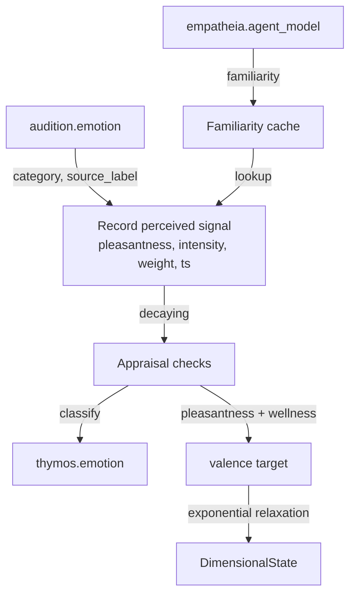

# Thymos

Thymos is the affective core. It holds a dimensional state of valence, arousal and dominance, runs an appraisal of every workspace broadcast, and keeps four homeostatic drives. Its arousal is the global gain on the workspace competition. Read this page if you enable the module, run the base-thesis `thesis_test` profile, or need to know what moves arousal and valence and what sleep resets.

Thymos ships disabled in the default config (`[modules].thymos = false` in `config/kaine.toml`). The `thesis_test` profile enables it, because a global gain that sets how readily content gains access, and that surprise itself moves, belongs to the minimal machinery of the base thesis. It needs nothing beyond the core stack.

## Arousal: the global gain and contrast

Every predictive processor scales its own prediction error by its recent errors (local precision). Arousal adds one gain across all of them, following the adaptive-gain account of locus coeruleus function. Syneidesis computes each candidate's priority as `p = clip(intensity × novelty × goal, 0, 1)`, with the goal factor held at 1 by default (`[syneidesis].salience_goal_factor = "static"`), and turns it into a score with two arousal terms:

```
T = 0.2 + 0.8 × a                                 level gain, common to every candidate
g = g_max × clip((a - a0) / (1 - a0), 0, 1)       contrast gain, zero at or below baseline
score = T × C_g(p)
```

`a` is arousal, `a0` is `[thymos].baseline_arousal` (0.3), and `g_max` is `[syneidesis].arousal_contrast_gain` (8.0). `C_g` is a logistic in the priority, rescaled so that it fixes 0 and 1 and reduces to the identity at `g = 0`. Because the level gain is shared and `C_g` is strictly increasing, arousal never reorders the candidates of a tick. It moves the best score relative to the access threshold and the report bars, it decides which members of a coalition reach the threshold, and it widens the gap between the scores of strong and weak candidates.

Arousal also sizes the sensory apertures. Topos narrows its fovea and Audition shortens its attended window as arousal rises. Tonic arousal raises the access rate as well (see [The cognitive cycle](../08-cognitive-cycle/README.md)).

The cycle reads arousal from the latest `thymos.state` event it has collected, through `AffectStateProvider` (`kaine/cycle/affect_state.py`), which starts at the baseline before the first event. The workspace gain, the fovea, the auditory window and the access rate therefore see arousal as it stood at Thymos's last state publication, up to one `publish_interval_s` old.

### What moves arousal

The appraisal of a broadcast does not move arousal, so a higher access rate cannot feed back into it. Arousal rises on three paths, all read directly from the producing modules' streams whether or not the report wins access:

| Source | Condition | Change in arousal |
|---|---|---|
| `topos.report`, `audition.perception` | `alert: true` | `+0.15 × min(4, max(0, r - 1))`, with `r` the report's `normalised_error` (its error over its running mean) |
| `soma.report` | non-empty `alerts` list (a host metric past its hard limit) | `+0.05` |
| `mnemos.recall` | `max_affect_intensity > 0` | `+0.05 × max_affect_intensity` (Mnemos is held in the base-thesis form) |

An alert raised by a change criterion alone, with `r <= 1`, leaves arousal unchanged. Between these nudges arousal and dominance relax toward their baselines: at each update `a <- a + (a0 - a) × min(1, drift_rate_per_s × dt)`, a time constant of 20 entity seconds at the default rate. Arousal is clipped to `[0, 1]`.

## Valence from learning progress

Valence follows learning progress, the reading of valence as the negative rate of change of free energy (Joffily and Coricelli 2013). For each perceptual source (Topos and Audition's acoustic path) Thymos keeps a fast and a slow time-decayed mean of the raw `prediction_error` its reports carry, counting from the source's first positive error:

```
S <- d*S + e,  N <- d*N + 1,  E = S / N,  d = exp(-dt / tau)
       tau = fast_time_constant_s (10) or slow_time_constant_s (100)
g        = mean over sources of clip((E_slow - E_fast) / E_slow, -1, 1)
pl       = clip(tanh(valence_progress_gain * g) + coupling, -1, 1)
v_target = clip(pl + (wellness - 0.5), -1, 1)
valence += (v_target - valence) * (1 - exp(-dt / valence_time_constant_s))
```

Falling errors make `g` positive and pull valence up; rising errors make it negative. `pl` is the appraisal's pleasantness check, and `coupling` is the perceived-emotion term described under [Affect coupling](#affect-coupling), zero in the base-thesis form. `wellness` is the value Soma last reported, 0.5 before the first report. Early on the fast and slow means are both close to the plain mean of the samples so far, so `g` starts near zero.

## Drives

Each drive is a deficit in `[0, 1]` that builds while its need goes unmet and is reduced by the events that meet it, the reduction serving as the drive's reward (Hull 1943; Keramati and Gutkin 2014). Between updates a drive follows the exact solution of `dD/dt = build_rate × u × (1 - D) - decay_rate × D`, so it relaxes toward `build_rate × u / (build_rate × u + decay_rate)` at a rate that does not depend on how often Thymos updates. Each default decay rate is about a ninth of its build rate, so a fully deprived drive settles near 0.9, above its 0.7 threshold.

Relief comes in two forms. Curiosity and boredom are relieved continuously, `D <- D × exp(-relief_gain × c × dt)`, so the amount relieved does not depend on how often the perceptual modules report. The social drive and restlessness are relieved per event, `D <- D × (1 - relief_gain × c)`.

| Drive | Builds with `u` | Relieved by | Grounding |
|---|---|---|---|
| `curiosity` | `1 - LP` | continuously, `c = LP` | learning progress (Oudeyer and Kaplan 2007; Schmidhuber 2010) |
| `boredom` | `1 - N` | continuously, `c = N` | relief by novelty, this design's reading of Eastwood et al. 2012 and Westgate and Wilson 2018 |
| `social_drive` | `1` once the entity has heard a voice, else `0` | each new voice, `c = 1` | social homeostasis (Matthews and Tye 2019) |
| `restlessness` | `1 - intent_rate` | each Volition intent other than `intent.rest`, `c = 1` | a design choice with no established model behind it |

`LP = max(0, g - learning_progress_floor) / (1 - learning_progress_floor)` is learning progress above a noise floor, so rectified noise in `g` does not relieve curiosity on a scene where nothing is being learned. `N = clip(r_fast / max(r_slow, 0.05) - 1 - alert_excess_margin, 0, 1)` is the novelty of the alert stream. Each perceptual alert raises the fast rate `r_fast` by `1 / fast_time_constant_s` and the slow rate `r_slow` by `1 / slow_time_constant_s`, and both decay with their own time constant. The alert criterion is self-calibrating, so even a still scene alerts at a steady base rate, and only alerts in excess of that habituated rate relieve boredom.

The social drive reads Chronos. Chronos counts an interaction when a tone-of-voice or transcription event arrives from a live source (`live_mic`, `microphone` or `remote`). The first finite `time_since_last_interaction_s` in a `chronos.report` starts the drive building, and each later drop in that value relieves it. The intent rate is an exponential average updated on every broadcast, `r <- r + intent_rate_weight × (min(1, n) - r)`, with `n` the number of non-rest intents since the previous broadcast.

A drive that crosses its threshold publishes one `thymos.drive` event and re-arms only after it falls below 0.9 of the threshold.

## Appraisal

On every broadcast, accessed or inhibited, Thymos first updates its state and drives and then scores the broadcast coalition on the five checks of Scherer's component process model:

| Check | Computation |
|---|---|
| Novelty | `1 - prod(1 - s)` over coalition members that carry a `normalised_error` ratio `r`, with `s = clip(ln r / ln 3, 0, 1)`; a ratio of 2.2 gives 0.72 |
| Intrinsic pleasantness | `pl`, the learning-progress term above |
| Goal significance | the dominant drive, signed by how much of the coalition comes from sources that relieve it (below) |
| Coping potential | `clip(valence + (0.5 - arousal), -1, 1)` |
| Norm compatibility | fixed at `0.0` until a self-model supplies norms |

The cycle injects a drive-to-source table built from each registered module's `relieves_drives` declaration. With dominant drive value `v > 0` and `f` the intensity-weighted share of coalition members whose source relieves that drive, the drive score is `v × (2f - 1)`: `+v` when every member serves the drive and `-v` when none does. With no drive above zero the score is `0.0`. When the `GoalLedger` holds active goals, their token-overlap score (`2 × relevance - 1`) is also computed and the check takes the larger of the two. Nothing in the running system adds goals outside tests. The goal score feeds the categorical emotion and does not enter selection, where the goal factor is held constant.

`goal_significance_method` in each `thymos.emotion` event records how the check was computed:

| Method | Meaning |
|---|---|
| `drive_relevance_v1` | Scored against the dominant drive |
| `drive_relevance_v1+token_overlap_v1` | Drive score and active ledger goals both computed; the larger is used |
| `token_overlap_v1` | No drive-to-source table was injected, and active ledger goals were scored |
| `unavailable` | Neither exists; the score is `0.0` |

A rule-based `classify()` maps the five scores to `joy`, `sadness`, `anger`, `fear`, `surprise`, `disgust` or `neutral`, and Thymos publishes `thymos.emotion` when the category changes. Surprise is reachable when the coalition carries a strongly surprising report and pleasantness and goal significance are near zero. Disgust stays unreachable while norm compatibility is fixed at zero (`norm_compatibility_available: false`).

## Sleep reset

At the end of every sleep [Hypnos](hypnos.md) calls `affective_reset()`. It returns valence, arousal and dominance to their baselines, resets every drive to 0 and re-arms its crossing, and sets the categorical emotion to neutral. It also clears the learning-progress error means, the fast and slow alert rates, the intent rate and the recorded perceived emotion, so valence starts the waking period from baseline instead of relaxing back toward the pre-sleep target. The last reported wellness, the record of whether and when the entity last heard a voice, the familiarity cache and the goal ledger are kept. Thymos then publishes a `thymos.state` event with `reset: true` at its alert intensity.

## Peer streams

Besides the workspace broadcast, Thymos reads the peer streams below on its own loop. The cursor of each stream advances past every entry it scans, and an event whose handling raises (a malformed payload, for example) is logged and skipped, so one bad event cannot stall the loop or be read again.

## Inputs

| Stream | Event type | Use |
|---|---|---|
| `workspace.broadcast` | broadcast snapshot | Every broadcast, accessed or inhibited: state update, then appraisal |
| `topos.out` | `topos.report` | Learning-progress means; on `alert: true`, alert rates and arousal |
| `audition.out` | `audition.perception` | Learning-progress means; on `alert: true`, alert rates and arousal |
| `audition.out` | `audition.emotion` | Perceived speaker emotion, recorded only when coupling is enabled |
| `soma.out` | `soma.report` | `wellness` shifts the valence target; a non-empty `alerts` list raises arousal |
| `chronos.out` | `chronos.report` | `time_since_last_interaction_s` starts and relieves the social drive |
| `volition.out` | `intent.*` | Each intent other than `intent.rest` relieves restlessness and counts toward the intent rate |
| `mnemos.out` | `mnemos.recall` | `max_affect_intensity` raises arousal |
| `empatheia.out` | `empatheia.agent_model` | Familiarity per `agent_id`, read only when coupling is enabled |

The Topos, Audition and Empatheia stream names are fixed. The Soma, Chronos, Mnemos and Volition stream names are configurable (below).

## Outputs

| Stream | Event type | When | Intensity |
|---|---|---|---|
| `thymos.out` | `thymos.state` | Every `publish_interval_s` of entity time, on its own timer and after a broadcast once the interval has passed; carries the VAD state, the drives and the current emotion label, plus `reset: true` after a sleep reset | `baseline_salience`; `alert_salience` after a reset |
| `thymos.out` | `thymos.emotion` | On a change of categorical emotion; carries the five scores, the state, `norm_compatibility_available` and `goal_significance_method` | `alert_salience`, or `baseline_salience` for `neutral` |
| `thymos.out` | `thymos.drive` | On a threshold crossing; carries the drive name and value | `alert_salience` |
| `thymos.out` | `thymos.goal` | On a goal lifecycle event (`added`, `completed`, `abandoned`) | `baseline_salience` |

Thymos reports at these fixed levels; its events are not graded by surprise.

## Configuration

The full `[thymos]` reference is in the [modules configuration page](../appendix-a-configuration/modules.md). All time constants run in entity time.

| Key | Type | Default | Meaning |
|---|---|---|---|
| `baseline_valence` | float `[-1, 1]` | `0.0` | Initial valence and its value after a sleep reset; valence otherwise relaxes toward its target |
| `baseline_arousal` | float `[0, 1]` | `0.3` | Arousal baseline `a0`; also the point above which the contrast gain rises |
| `baseline_dominance` | float `[-1, 1]` | `0.0` | Dominance baseline |
| `drift_rate_per_s` | float `>= 0` | `0.05` | Relaxation rate of arousal and dominance toward baseline |
| `publish_interval_s` | float `> 0` | `1.0` | Period between `thymos.state` publications |
| `baseline_salience` | float `[0, 1]` | `0.1` | Intensity of routine events |
| `alert_salience` | float `[0, 1]` | `0.7` | Intensity of emotion changes, drive crossings and the post-reset state |
| `fast_time_constant_s` | float `> 0` | `10.0` | Fast mean of each perceptual source's error and the fast alert rate |
| `slow_time_constant_s` | float `> fast` | `100.0` | Slow mean of each perceptual source's error and the slow alert rate |
| `learning_progress_floor` | float `[0, 1)` | `0.05` | Noise floor subtracted from learning progress before it relieves curiosity |
| `alert_excess_margin` | float `>= 0` | `0.5` | Fraction by which the fast alert rate must exceed the slow one before it relieves boredom |
| `intent_rate_weight` | float `(0, 1]` | `0.05` | Per-broadcast weight of the intent-rate average |
| `valence_time_constant_s` | float `> 0` | `30.0` | Time constant of valence's relaxation toward its target |
| `valence_progress_gain` | float `>= 0` | `2.0` | Gain on learning progress in the pleasantness check |
| `social_drive_time_scale_s` | float `> 0` | `600.0` | Accepted and validated but unused |
| `volition_stream` | string | `"volition.out"` | Stream Thymos reads intents from |
| `soma_stream` | string | `"soma.out"` | Stream Thymos reads Soma reports from |
| `chronos_stream` | string | `"chronos.out"` | Stream Thymos reads Chronos reports from |
| `mnemos_stream` | string | `"mnemos.out"` | Stream Thymos reads Mnemos recalls from |

The perceptual arousal gain (0.15), its cap (4), the interoceptive step (0.05) and the drive hysteresis (0.9) are constants in `kaine/modules/thymos/module.py` and `drives.py`; no config key sets them.

Drive sub-tables `[thymos.drives.<name>]`, for `curiosity`, `boredom`, `social_drive` and `restlessness`. An unknown drive name or key stops boot.

| Key | Type | Defaults (curiosity, boredom, social_drive, restlessness) | Meaning |
|---|---|---|---|
| `build_rate` | float `>= 0` | `0.05`, `0.04`, `0.01`, `0.03` | Build rate per second at `u = 1` |
| `decay_rate` | float `>= 0` | `0.0055`, `0.0045`, `0.0011`, `0.0033` | Decay rate per second |
| `threshold` | float `(0, 1]` | `0.7` for all | Crossing threshold |
| `relief_gain` | float `[0, 1]` | `0.5`, `0.3`, `0.8`, `0.5` | Curiosity and boredom: relief rate per second at full strength. Social drive and restlessness: fraction one relieving event removes |

Coupling sub-table `[thymos.coupling]`:

| Key | Type | Default | Meaning |
|---|---|---|---|
| `enabled` | bool | `false` | Turns affect coupling on |
| `coupling_base` | float `>= 0` | `0.05` | Appraisal-influence weight when no familiarity is known |
| `coupling_familiarity_gain` | float `>= 0` | `0.10` | Additional weight per unit of Empatheia familiarity |
| `coupling_ceiling` | float `>= 0` | `0.15` | Ceiling on the appraisal-influence weight |
| `decay_s` | float `> 0` | `10.0` | Seconds over which a perceived-emotion signal decays to zero |

A `coupling_max_rate_per_s` key is accepted and ignored, so older local configs still boot.

## Affect coupling

Coupling is off in the default config and in the base-thesis form. When `[thymos.coupling].enabled = true`, Thymos records each `audition.emotion` event as a transient signal and never writes it to the dimensional state:

1. It maps the perceived category to a pleasantness and an intensity through the `EMOTION_VAD` table.
2. It looks up the speaker's familiarity, keyed on `source_label`, in the cache filled from `empatheia.agent_model` events (0.0 when unknown).
3. It computes `weight = clip(coupling_base + coupling_familiarity_gain × familiarity, 0, coupling_ceiling)`.
4. It stores `{pleasantness, intensity, weight, ts}`.

When the appraisal runs, the signal is folded in with a linear decay, `decay = max(0, 1 - (now - ts) / decay_s)`. It adds `weight × decay × pleasantness` to the pleasantness check and `weight × decay × intensity × 0.5` to the novelty check, and both checks are clipped to `[-1, 1]`. Valence responds only through the pleasantness check, which sets its target.



The weight ceiling, the clip on each check and the decay window bound the contribution. Once a speaker stops talking the signal decays to zero within `decay_s`, and valence relaxes toward a target without it.

## Bounds on the affective state

Every dimension is clipped to its range after each update. The perceived emotion of another speaker enters only through the bounded, decaying appraisal path and never writes to the state. Arousal relaxes toward baseline between nudges, and the sleep reset returns affect and drives to baseline at the end of every sleep, so arousal cannot drift across a whole run.

## Serialization

`Thymos.serialize()` stores the state, the baseline, the drive values, the last emotion, the familiarity cache and the goal ledger. The cache holds opaque agent-id strings and familiarity values only, no transcribed text. Restoring goals publishes no `thymos.goal` events.

## Enabling and use

1. Set `[modules].thymos = true`, or run the `thesis_test` profile.
2. Enable Topos and Audition for the perceptual error and alert streams, and Soma and Chronos for wellness, interoceptive alarms and the social drive.
3. For affect coupling, set `[thymos.coupling].enabled = true` and enable [Audition](audition.md) and [Empatheia](empatheia.md).

## Key files

| File | Role |
|---|---|
| `kaine/modules/thymos/module.py` | `Thymos`: update, appraisal, arousal paths, peer consumer, reset, publishing |
| `kaine/modules/thymos/state.py` | `DimensionalState`: relaxation, nudges, clipping |
| `kaine/modules/thymos/appraisal.py` | `AppraisalScores` and `classify()` |
| `kaine/modules/thymos/drives.py` | `Drive`, `DriveSet`, `DriveCrossing` |
| `kaine/modules/thymos/coupling.py` | `CouplingConfig`, `EMOTION_VAD`, `compute_coupling` |
| `kaine/modules/thymos/goals.py` | `GoalLedger` |
| `kaine/modules/thymos/modulator.py` | `StateModulator`: level gain and contrast gain |
| `kaine/modules/thymos/regulation.py` | `RegulationPolicy` protocol and the no-op `PassiveDecay` |
| `kaine/cycle/affect_state.py` | `AffectStateProvider`: the cycle's copy of the last published state |
| `kaine/boot/wiring.py` | Builds the workspace's `StateModulator` from `[syneidesis]` and `[thymos]` |

## Tests

| File | Coverage |
|---|---|
| `tests/test_thymos_state.py` | Relaxation, nudges, clipping |
| `tests/test_thymos_appraisal.py` | `classify()` rules for each emotion |
| `tests/test_thymos_drives.py` | Build, decay, threshold and hysteresis |
| `tests/test_thymos_rate_invariant.py` | Appraisal independent of the broadcast rate; the state timer |
| `tests/test_thymos_goal_check.py` | Goal-significance check against the dominant drive |
| `tests/test_thymos_goals.py` | Goal lifecycle and relevance scoring |
| `tests/test_thymos_modulator.py` | Level gain: range, floor, ceiling and monotonicity |
| `tests/test_thymos_research_affect.py` | Drives, learning progress, valence, the appraisal leaving arousal unchanged, the sleep reset and the peer-consumer guard |
| `tests/test_thymos_coupling.py` | Perceived emotion entering the appraisal, familiarity scaling, no direct write |
| `tests/test_thymos_coupling_drift.py` | Perceived-signal decay and boundedness |
| `tests/test_thymos_coupling_persistence.py` | Familiarity cache round trip |
| `tests/test_thymos_module.py` | Module lifecycle and event publishing |

## Spec and related pages

- Spec: `openspec/specs/thymos/spec.md`
- Affect coupling spec: `openspec/specs/thymos-affect-coupling/spec.md`
- [Global workspace](../08-cognitive-cycle/global-workspace.md): scoring, access and the arousal gain
- [Topos](topos.md), [Audition](audition.md): perceptual alerts and error streams
- [Soma](soma.md), [Chronos](chronos.md), [Mnemos](mnemos.md): peer inputs
- [Hypnos](hypnos.md): calls `affective_reset()`
- [Empatheia](empatheia.md): familiarity for coupling
- [Eidolon](eidolon.md): future source of norms for the norm check
- [Configuration reference](../appendix-a-configuration/modules.md)
