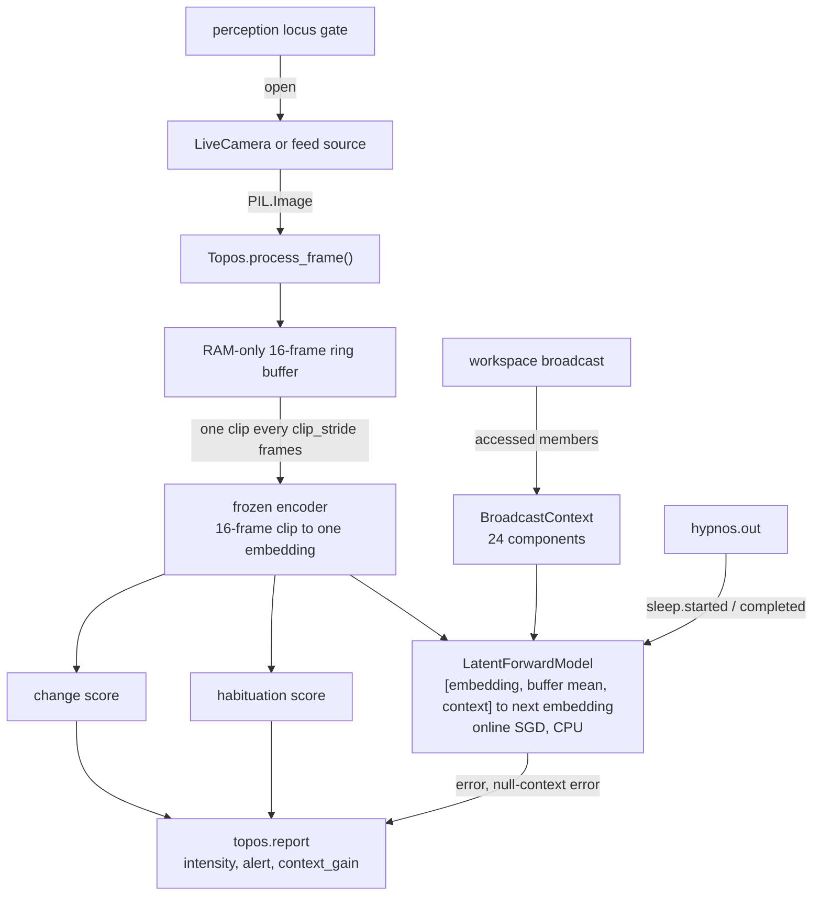

# Topos

Topos is KAINE's foveated vision. It encodes short clips of the video feed with a frozen video encoder, predicts the next clip's embedding from earlier ones and the broadcast context, and reports the prediction error to the workspace. This page covers its dependencies, forward model, intensity and alert rule, events, persistence, configuration, foveation, and the reproducible research feeds. Read it if you are enabling the camera, running vision experiments, or changing Topos code.

## Status and dependencies

Implemented. The shipped `config/kaine.toml` sets `[modules].topos = false`, and the `thesis_test` profile (`config/profiles/thesis_test.toml`) enables it. With no profile selected, the loader applies `thesis_test` automatically, so the default entity has Topos enabled.

- Live camera capture needs the `[vision]` extra: `pip install -e .[vision]`. It installs `opencv-python-headless`, `Pillow`, and `transformers`.
- `torch` comes from the `[core]` extra, not the base package.
- The default InternVideo-Next encoder needs the `[internvideo]` extra (`einops`, `timm`, `easydict`). Flash attention is a separate `[internvideo-flash]` extra; the default eager path needs neither CUDA nor flash attention.
- The DINOv2 fallback (`encoder_backend = "dinov2"`) does not need the `[internvideo]` extras.
- InternVideo-Next weights are fetched once with `python -m kaine.setup.internvideo_next --yes` into a git-ignored local directory (`state/models/…`). At runtime they load only from there, with `trust_remote_code=False`, `local_files_only=True`, and `HF_HUB_OFFLINE=1`.
- The default encoder device is `cuda:1`. `resolve_device()` falls back to `cuda:0` on a single-GPU host and to `cpu` on a host without CUDA. `[hardware].allowed_devices` and the `KAINE_FORCE_DEVICE` override also constrain the device.
- The forward model (`LatentForwardModel`) always runs on the CPU, whatever the encoder device.
- Encoder weights are frozen: the encoder runs in `eval()` mode with `requires_grad=False` on every parameter.

Topos publishes no `topos.report` until its 16-frame ring buffer first fills, about 1.6 s at 10 Hz.

### Encoder backends

`[topos].encoder_backend` selects the encoder behind the `Encoder` protocol:

- `internvideo_next` (shipped default) is OpenGVLab's InternVideo-Next base model (MIT licence, 91M parameters). A 16-frame clip produces one 768-dimensional embedding that captures motion. Topos keeps a RAM-only 16-frame ring buffer and emits one clip embedding every `clip_stride` frames; at the shipped `vision_sample_hz = 10` and `clip_stride = 3` that is about 3.3 Hz.
- `dinov2` is the Apache-2.0 per-frame fallback: `clip_len = 1` and the 384-dimensional CLS token of DINOv2-small.

## What Topos does

Topos is the architecture's analog of the ventral visual stream. For each clip it computes:

1. The clip embedding (768 dimensions for InternVideo-Next, 384 for DINOv2), from the peripheral gist when foveation is on.
2. A change score, `1 − cosine_similarity(previous_embedding, current_embedding)`.
3. A habituation score, `1 / (1 + mean L2 distance of the buffered embeddings to their mean)`, which approaches 1.0 for a static scene. It is published with every report and does not enter the intensity.
4. With forward prediction on, the prediction error: the L2 distance between this clip's embedding and the forward model's prediction of it, made at the previous report.

Frames are perceived, never recorded. No frame is written to disk, and each frame leaves memory once it ages out of the ring buffer.

The perceptual locus decides whether the real camera runs. `effective_video_capture()` in `kaine/perception_state.py` returns `True` only when `video_live_desired = true` and `locus == "physical"`, so the live camera stays dark when the locus is `virtual` or `off`. Feed-provided sources (the seeded and playlist feeds, screen capture) supply a `source_factory`, and Topos gates them on `effective_virtual_video_capture()` instead. See [Perception](perception.md) for the locus arbiter.

## Forward model

`LatentForwardModel` (`kaine/modules/topos/forward.py`) is a network with one hidden layer of tanh units, run on the CPU:

```text
[embedding ‖ buffer mean ‖ broadcast context] → Linear(2·d + 24 → units) → Tanh → Linear(units → d)
```

Here `d` is the encoder's embedding size, the buffer mean is the mean of the last `visual_buffer_size` embeddings (the current one included), and the broadcast context is the 24-component vector described below. At each report Topos:

1. Scores the prediction made at the previous report against the current embedding (the error is 0 on the first report).
2. Takes one stochastic-gradient step (learning rate 1e-3) on the mean squared error of that prediction, from the same input it was made from. Every weight learns, including the weights that read the context. The step is skipped during sleep and whenever the loss or a gradient is not finite.
3. Appends the embedding to the buffer and predicts the next clip's embedding from the current embedding, the buffer mean, and the context Topos holds now.

`latent_dim` follows the active encoder, so nothing in the model fixes a dimension.

### Broadcast context

Topos reads the workspace broadcast stream (`on_workspace`) and conditions its predictions on a summary of the latest accessed content. Syneidesis records its access threshold in each broadcast's metadata (`access_threshold`). When a broadcast arrives that is not inhibited, Topos keeps the coalition members whose scores reach that threshold. If at least one does, Topos adopts them as its new context and records the time of receipt on the entity clock. An inhibited broadcast, or one in which no member reaches the threshold, leaves the context unchanged.

The context vector is the 24-component featurization in `kaine/modules/context.py`, computed over the accessed members with each member weighted by the intensity its module reported (not by its score, so the context does not depend on the arousal gain):

| Components | Content |
|---|---|
| 0 | `log1p(number of members)`, clamped at 8 |
| 1 to 3 | Mean, maximum, and sample standard deviation of the members' intensities |
| 4 to 11 | Intensity mass per source: Soma, Chronos, Topos, Nous, Mnemos, Thymos, Lingua, and a last bin for Praxis, Hypnos, and any other source except Audition |
| 12 to 19 | Intensity mass per (source, event type) pair, hashed into eight buckets |
| 20 | `log1p(age)`, the entity seconds since Topos received the broadcast |
| 21 | 0 (a context is never an inhibited broadcast) |
| 22 | 1 (the broadcast indicator) |
| 23 | Intensity mass of Audition |

The context records which modules' reports gained access and how strongly. It carries no payloads. Before the first accessed broadcast the model receives zeros in the context slots.

### Cross-module information gain

Alongside each prediction, Topos makes a second prediction from a null context. The null context keeps Topos's own share of the per-source and per-type components and replaces every other source's share with its mean over the contexts Topos has adopted since boot; the count and intensity statistics (components 0 to 3) also take their running means. At the next report Topos scores both predictions and publishes

```text
context_gain = (null-context error − error) / running mean error
```

where the running mean is over the last `prediction_error_window` errors. A positive value means other modules' share of the accessed content helped Topos predict its own input. `context_gain` is `null` when the scored prediction was made without a context or the running mean error is zero. The null prediction never enters learning or the competition. The running means behind it are not persisted, so they restart with each boot.

`context_gain` is the measure behind the planned workspace-mediation test (see [Running experiments](../15-experiments/README.md)). Its matched-selection and pooled arms and its positive control are not built yet.

## Intensity and the alert flag

With forward prediction on (the shipped and base-thesis setting), each report's error ratio is `prediction_error / mean`, the mean being over the last `prediction_error_window` errors including the current one. The report is an alert when either criterion holds:

- the error ratio is at least 2.0 (fixed in code, with no config key);
- the change score is at least `change_alert_factor` times the mean of the last `prediction_error_window` change scores and at least `change_alert_threshold` (an absolute floor that keeps a large ratio over a nearly static stream from firing on noise).

An alert is reported at `alert_salience`. Any other report is graded:

```text
intensity = baseline_salience + (alert_salience − baseline_salience) × min(1, ratio / 2)
```

so it reaches the alert level when the error is twice its running mean (`kaine/modules/intensity.py`). With forward prediction off, only the change criterion applies and every report is at `baseline_salience` or `alert_salience`.

Every `topos.report` carries `alert`, and the access rate's phasic input counts only reports whose `alert` is true. Thymos reads alert reports directly from `topos.out` and raises arousal in proportion to how far `normalised_error` exceeds 1.

## Inputs

| Source | Mechanism | Purpose |
|---|---|---|
| `LiveCamera` task | `process_frame(image)` | Delivers one RGB `PIL.Image` per capture interval |
| `source_factory` | Registered by the perception feed | Seeded, playlist, and screen sources; gated by `effective_virtual_video_capture()` |
| Workspace broadcast | `on_workspace(snapshot)` | Adopts accessed broadcasts as the forward model's context |
| `hypnos.out` | `hypnos.sleep.started` / `hypnos.sleep.completed` | Suspends and resumes forward-model adaptation |
| `kaine.perception_state` | `effective_video_capture()`, polled every 250 ms | The live camera runs only when the locus is `physical` and video is desired |
| Thymos arousal | `set_arousal_provider()` | Sizes the fovea |

The 250 ms poll interval is a class default with no config key.

## Outputs

All events are published to the `topos.out` stream.

| Event type | Payload fields | Intensity |
|---|---|---|
| `topos.report` | `latent`, `change_score`, `habituation_score`, `encoder_model_id`, `prediction_error`, `normalised_error`, `context_gain`, `context_age_s`, `alert`; with foveation also `peripheral`, `foveal`, `fovea`, `predicted_fovea`; with a playlist feed also `item`, `item_order` | `alert_salience` on an alert, otherwise graded from `baseline_salience` (see above) |

`normalised_error` is the error ratio. `context_age_s` is the entity seconds since Topos received the broadcast it holds as context, or `null` before the first accessed broadcast.

With foveation off, the report carries the single whole-frame embedding and none of the foveation keys. With foveation on, `latent` repeats the `peripheral` gist, and the report also carries `foveal` and the content-free fovea locations `fovea` and `predicted_fovea`, each a `{x, y, size}` dict of normalized floats in `[0, 1]`.

## Sleep

During sleep Hypnos switches the perception locus off and pauses a playlist feed's shared clock, so no frames reach Topos. Independently, Topos sets its forward model's `suspended` flag from `hypnos.sleep.started` to `hypnos.sleep.completed`, and no gradient step is taken while it is set.

## Persistence

`serialize()` writes:

- `encoder_model_id`, the encoder's identity string;
- `forward_model.layers`, the forward model's weight and bias tensors;
- `buffer_summary`, the frame count and per-feature mean and variance of the visual buffer, with no raw embeddings.

On restore, Topos logs a warning if the recorded encoder differs from the running one. It then checks the checkpoint's tensor shapes. A checkpoint saved before the context input existed (first-layer input `2·d`) is accepted and loaded with zero weights for the 24 context inputs, so it predicts exactly as before until those weights learn. A checkpoint sized for a different `latent_dim`, such as a 384-dimensional DINOv2 checkpoint under InternVideo-Next, is discarded with a warning and the forward model learns again from scratch. The visual buffer, the held context, and the running statistics behind the null context are not restored; they refill from new clips and broadcasts.

## Configuration

Section `[topos]` in `config/kaine.toml`. The full reference is in the [modules configuration appendix](../appendix-a-configuration/modules.md). Where the class default differs from the shipped value, both are given.

| Key | Type | Default | Meaning |
|---|---|---|---|
| `encoder_backend` | string | `"internvideo_next"` | Encoder: `internvideo_next` or `dinov2` |
| `encoder_model_id` | string | `"revliter/internvideo_next_base_p14_res224_f16"` | Model ID for the active backend; set `"facebook/dinov2-small"` for DINOv2 |
| `encoder_revision` | string | pinned SHA | Must equal the loader's pinned revision; any other value refuses boot |
| `encoder_local_dir` | string | `state/models/…` | Git-ignored directory the setup step fetches weights into |
| `clip_len` | integer | `16` | Frames per clip; fixed at `1` for `dinov2` |
| `clip_stride` | integer | `3` shipped; `1` class default | One clip embedding every N frames once the buffer is full |
| `clip_resolution` | integer | `224` | Clip input resolution |
| `pooling` | string | `"attention"` | `attention` (the model's attention-pool head) or `mean` over patch tokens |
| `device` | string | `"cuda:1"` | Preferred encoder device, resolved with fallback |
| `change_alert_threshold` | float | `1e-4` shipped; `0.005` class default | Absolute floor on the change score for a change alert |
| `change_alert_factor` | float | `2.0` | A change alert needs the change score to be at least this multiple of its running mean (at least 1.0) |
| `habituation_window` | integer | `16` | Embeddings the habituation score averages over (at least 2) |
| `baseline_salience` | float | `0.2` | Baseline intensity of the graded range |
| `alert_salience` | float | `0.7` | Alert intensity, the top of the graded range |
| `capture_enabled` | boolean | `false` | Enable the live camera; requires `[vision]` |
| `capture_device` | integer or string | `0` | `cv2.VideoCapture` device index or URL |
| `capture_interval_s` | float | `0.1` shipped; `1.0` class default | Seconds between frame captures |
| `vision_sample_hz` | float | `10.0` | Frames per entity second; overrides `capture_interval_s` when both are set |
| `capture_width` | integer | `640` | Requested frame width |
| `capture_height` | integer | `480` | Requested frame height |
| `capture_warmup_frames` | integer | `3` | Frames discarded at startup |
| `forward_prediction` | boolean | `true` shipped; `false` class default | Enable the forward model, the graded intensity, and the broadcast context |
| `forward_model_units` | integer | `256` shipped; `128` class default | Hidden width of the forward model |
| `prediction_error_window` | integer | `32` | Reports in the running means of the error and of the change score (at least 2) |
| `visual_buffer_size` | integer | `16` | Embeddings in the visual buffer whose mean feeds the forward model |
| `foveation` | boolean | `false` shipped; `true` in `thesis_test` | Enable attention-driven foveation |
| `foveation_grid` | array of 2 integers | `[12, 12]` | Saliency tiling `(rows, cols)` |
| `foveation_hysteresis` | float | `0.15` | A new tile must exceed the held tile's salience by this fraction to move the fovea |
| `foveation_arousal_size_min` | float | `0.12` | Fovea half-extent at arousal 1.0 |
| `foveation_arousal_size_max` | float | `0.5` | Fovea half-extent at arousal 0.0 |
| `peripheral_width` | integer | `320` | Width of the downsampled peripheral gist |
| `peripheral_height` | integer | `180` | Height of the downsampled peripheral gist |
| `foveal_size` | integer | `224` | Side of the square foveal crop fed to the encoder |

The shared top-level `[perception_feed]` section drives a deterministic audio-visual feed for research, feeding both Topos and [Audition](audition.md) from one source. The full reference is in the [perception and sleep configuration appendix](../appendix-a-configuration/perception-and-sleep.md).

| Key | Type | Default | Meaning |
|---|---|---|---|
| `mode` | string | `"off"` shipped; `"seeded"` in `thesis_test` | `off`, `seeded`, `playlist`, `live`, `screen`, or `womb` |
| `seed` | integer | `0` | Seeded mode: the stream is a pure function of this seed |
| `playlist_manifest` | string | `""` | Playlist mode: path to the single checksummed manifest |
| `[perception_feed.video].surprise_interval` | integer | `150` | Seeded mode: shared cross-modal cadence of surprise events |
| `[perception_feed.video].surprise_strength` | float | `1.0` | Seeded mode: magnitude of the visual surprise blob (`0` disables it) |
| `[perception_feed.audio].sample_rate` | integer | `16000` | Seeded mode: audio sample rate |
| `[perception_feed.audio].channels` | integer | `1` | Seeded mode: audio channel count |
| `[perception_feed.audio].base_strength` | float | `0.3` | Seeded mode: amplitude of the base soundscape |
| `[perception_feed.audio].surprise_strength` | float | `1.0` | Seeded mode: amplitude of the surprise bursts (`0` disables them) |

`[perception_feed]` also accepts `transition_seconds` and `transition_audio_fade_seconds`; their defaults are in the configuration reference.

Screen mode turns a shared desktop or a single window into the live vision source, and its desktop audio monitor into the hearing source. It spawns the system `ffmpeg` binary (`gdigrab`, `avfoundation`, or `x11grab` by OS) and hands Topos frames through a `source_factory`, so it gates on the virtual locus. It is not reproducible, so use it only for demos with an operator present. Its `[perception_feed.screen]` options (`target`, `region`, `window_title`, `display`, `framerate`, `cursor`, `native`, `ffmpeg_path`) are in the [perception and sleep configuration appendix](../appendix-a-configuration/perception-and-sleep.md).

## How Topos works



### InternVideo-Next encoder

The encoder loads lazily on the first `initialize()`. It uses the vendored, revision-pinned modeling code in `external/internvideo_next/` and the locally cached weights through `kaine/modules/topos/internvideo_next_loader.py`, with `trust_remote_code=False` and `local_files_only=True`. `encode_clip` builds a 16-frame tensor, runs the frozen model, and pools its `[1, 4096, 768]` output to 768 dimensions through the native attention-pool head (`pooling = "attention"`) or a mean over patch tokens (`pooling = "mean"`). The pooled vector is not L2-normalized. `latent_dim` is measured from a dummy clip at load. Inference runs in a thread so the event loop stays free.

### DINOv2 fallback

Selected with `encoder_backend = "dinov2"`. It uses `transformers.AutoModel` and `AutoImageProcessor` for `facebook/dinov2-small`, frozen, and takes the 384-dimensional CLS token of each frame (`clip_len = 1`). The model downloads from HuggingFace on first use unless `HF_HOME` or `TRANSFORMERS_CACHE` points to an existing cache.

Both encoders accept a `PIL.Image`, `bytes`, or a `numpy.ndarray`. The capture path converts OpenCV's BGR arrays to RGB before the encoder sees them.

### Attention-driven foveation

Foveation is off in the shipped `config/kaine.toml` and on in the `thesis_test` profile. With `[topos].foveation = true`, Topos spends resolution where frame change is least expected instead of encoding the whole frame uniformly. It works with either encoder: each view is encoded through the encoder's clip interface, so `dinov2` encodes one image per view and `internvideo_next` encodes each view as a real 16-frame clip cut from every buffered frame at the fovea chosen on the latest frame.

On each clip report, from the latest frame:

1. `SpatialSaliency` (`kaine/modules/topos/foveation.py`) reduces the frame to a `foveation_grid` of tile gray-level means and measures each tile's absolute change since the previous clip report. Each tile keeps an exponentially weighted mean and variance of its change (weight 0.05 per report). A tile's salience is a z-score: its change in excess of the running mean, divided by `sqrt(variance + s0²)`, where `s0` is a tenth of the mean change across tiles, a soft floor. The statistics are taken before this report's update. The z-score is the counterpart for frame change of the processors' error scaling: a tile that flickers habitually draws the fovea less than one whose change is rare. For the first five updates the raw change is used.
2. `combine_saliency` and `select_fovea` pick the most salient tile's center. The fovea moves only when that tile's salience exceeds the held tile's by the `foveation_hysteresis` fraction, and it holds its place when no tile stands out (starting at the frame's center). `combine_saliency` accepts a top-down bias map, but no shipped configuration wires a provider, so selection runs on the bottom-up map alone. The fovea's size comes from the current Thymos arousal (`arousal_to_size`): higher arousal gives a smaller fovea.
3. `foveate` cuts a downsampled `peripheral` gist and a full-detail `foveal` crop around the fovea from each buffered frame.
4. Two encodes produce the `peripheral` and `foveal` embeddings. The peripheral embedding drives the change score, the habituation score, and the forward model; the foveal embedding carries the attended detail.
5. `FoveaPredictor`, a small constant-velocity model of the fovea's own trajectory, publishes its content-free prediction as `predicted_fovea`. It does not steer attention.

Arousal reaches Topos through a provider callback wired at boot (`set_arousal_provider(fn)`, returning arousal in `[0, 1]`); `set_top_down_bias_provider(fn)` is the unwired seam for a bias map. A missing or failing provider falls back to the widest fovea or to the bottom-up map, so perception keeps running. Before enabling foveation on a new host, run `scripts/bench_foveation.py` to confirm that two encodes and the full-resolution grab fit the tick; the full-resolution single grab is configured under `[perception_feed.screen].native`.

### Change and habituation

`CosineChangeDetector` returns `1 − cosine_similarity(previous, current)`, in `[0, 2]`: 0 for identical embeddings, 1 for orthogonal ones, 2 for opposite ones. The first clip returns 0.0.

`RollingMeanHabituator` keeps a deque of recent embeddings and scores `1 / (1 + mean distance to the buffer mean)`. A static scene gives distances near zero and a score near 1.0.

### Camera supervisor

`kaine/modules/topos/live.py` runs as a background asyncio task. It polls `effective_video_capture()` every 250 ms, opens `cv2.VideoCapture` in a thread, discards the warm-up frames, and calls `process_frame()` every capture interval. The raw BGR array is released after conversion to RGB, and only the `PIL.Image` is passed on.

### Nexus live-preview tap

At the end of `process_frame()`, if the operator has set `KAINE_PERCEPTION_PREVIEW=1`, the current frame is encoded to an in-memory JPEG and written to a single preview slot that each frame overwrites. The slot is never written to disk and is cleared on `shutdown()`. Without the environment variable the tap does nothing.

## Key files

| File | Role |
|---|---|
| `kaine/modules/topos/module.py` | `Topos` class: `process_frame()`, intensity and alert rule, context adoption, Hypnos loop, serialization |
| `kaine/modules/topos/forward.py` | `LatentForwardModel`, the online forward model with its context input |
| `kaine/modules/context.py` | `BroadcastContext`: context featurization, adoption, null context |
| `kaine/modules/intensity.py` | `graded_intensity()`, shared by the four predictive processors |
| `kaine/modules/topos/encoder.py` | `InternVideoNextEncoder`, `DINOv2Encoder`, the `Encoder` protocol, `make_encoder`, image coercion |
| `kaine/modules/topos/internvideo_next_loader.py` | Offline loader for the vendored InternVideo-Next weights |
| `external/internvideo_next/` | Vendored, revision-pinned InternVideo-Next modeling code (MIT) and its `UPSTREAM` provenance |
| `kaine/modules/topos/change.py` | `CosineChangeDetector` and the `ChangeDetector` protocol |
| `kaine/modules/topos/habituation.py` | `RollingMeanHabituator` and the `SceneHabituator` protocol |
| `kaine/modules/topos/foveation.py` | Spatial saliency, fovea selection, arousal-to-size mapping, view cutting, `FoveaPredictor` |
| `kaine/modules/topos/live.py` | `LiveCamera`: camera supervisor task and locus gate |
| `kaine/modules/topos/feed.py` | Deterministic video sources for the perception feed |
| `kaine/modules/topos/screen.py` | Screen-capture source through `ffmpeg` |

## Enabling and using vision

Add to your local `config/kaine.toml` (do not commit):

```toml
[modules]
topos = true

[topos]
capture_enabled = true   # requires pip install -e .[vision]
capture_device = 0       # or an RTSP URL
```

InternVideo-Next weights are fetched once at setup. The DINOv2 fallback downloads `facebook/dinov2-small` from HuggingFace on first use. After that, Topos needs no external service.

## Zero-persistence note

Topos holds no raw frames beyond the RAM ring buffer. The live-camera path drops the BGR array before the `PIL.Image` reaches `process_frame()`, and `serialize()` writes only the identity string, the forward-model tensors, and the statistical buffer summary listed under [Persistence](#persistence). A static grep in `tests/test_zero_persistence_invariant.py` fails the build if any frame-writing call appears in the live-camera path or the deterministic feed sources.

## Reproducible perception feed

Research runs need a deterministic stimulus free of copyright restrictions. A live camera and live human input cannot be reproduced, so the `live` and `screen` modes are for demos with an operator present. Selecting `seeded` or `playlist` turns capture on automatically for both Topos and [Audition](audition.md).

- `seeded`: `SeededProceduralSource` (video) and `SeededProceduralAudioStream` (audio) generate each frame and audio block as a pure function of `(seed, index)`. Each surface has a base signal, keyed to the seed, that the forward models can learn, plus surprise events whose onsets come from a shared counter-based `blake2b` generator. The same seed always produces the same stream. Surprises fall on the same cross-modal cadence (`[perception_feed.video].surprise_interval`), so audio and video surprises coincide. The seeded audio is sound, not speech, and speech-to-text may return empty blocks.
- `playlist`: `PlaylistSource` (video) and `PlaylistAudioStream` (audio) play media listed in one checksummed manifest that the operator curates. Both surfaces walk the same manifest. Each file's `sha256` is verified before the run, and a mismatch fails the source closed. Video decodes through OpenCV and audio through PyAV; without PyAV the audio source fails with an install hint.

A playlist manifest is one TOML file that pins both surfaces:

```toml
# perception_playlist.toml (supplied by the operator; media with audio)
[[item]]
path = "clips/forest_walk.mp4"
sha256 = "…"          # exact file; verified before the run
fps = 30              # frame timing for reproducible indexing

[[item]]
path = "clips/city_timelapse.mp4"
sha256 = "…"
fps = 30
```

Pin a seeded run like this:

```toml
[perception_feed]
mode = "seeded"
seed = 20260618

[perception_feed.video]
surprise_interval = 150
surprise_strength = 1.0

[perception_feed.audio]
sample_rate = 16000
channels = 1
base_strength = 0.3
surprise_strength = 1.0
```

The feed mode and its descriptor are recorded in `data/evaluation/runs/<run_id>/manifest.json`, so another researcher can regenerate (`seeded`) or verify (`playlist`) the entity's full audio-visual input.

Topos and Audition are separate modules with separate loops, so the feed does not promise frame-locked audio-video sync. The two surfaces stay coherent at the level of the media item (playlist) or through the shared seed and cadence (seeded).

## Tests

| File | What it verifies |
|---|---|
| `tests/test_topos_module.py` | `process_frame()`, change and habituation integration, intensity |
| `tests/test_topos_encoder.py` | `DINOv2Encoder` lazy load and `Encoder` protocol substitution |
| `tests/test_topos_internvideo_next.py` | InternVideo-Next encoder |
| `tests/test_topos_change.py` | `CosineChangeDetector` boundary cases |
| `tests/test_topos_habituation.py` | `RollingMeanHabituator` on static and varied scenes |
| `tests/test_topos_forward.py` | `LatentForwardModel` step, non-finite guard, serialization |
| `tests/test_forward_model_context.py` | Context input of the Topos and Audition forward models, null-context error, restore of checkpoints saved before the context input |
| `tests/test_broadcast_context.py` | Context featurization, adoption of accessed members, inhibited broadcasts, null context |
| `tests/test_graded_intensity.py` | The shared graded-intensity rule |
| `tests/test_foveation.py` | Spatial saliency, fovea selection, arousal-to-size mapping, view cutting, `FoveaPredictor` |
| `tests/test_foveation_wiring.py` | Wiring of the arousal provider at the composition root |
| `tests/test_topos_dinov2.py` | DINOv2 frozen weights and device placement |
| `tests/test_topos_live.py` | `LiveCamera` open and close, locus gate |
| `tests/test_topos_feed.py` | Seeded source determinism, cadence, and seed decorrelation; playlist verification and failing closed |
| `tests/systems/test_topos_subsystem.py` | Redis-backed subsystem integration |

## Spec and related

- OpenSpec: `openspec/specs/topos/spec.md`
- OpenSpec (predictive): `openspec/specs/topos-predictive/spec.md`
- Related modules: [Perception](perception.md) (locus arbiter), [Audition](audition.md) (hearing), [Thymos](thymos.md) (arousal), [Hypnos](hypnos.md) (sleep)
- Cognitive cycle: [The cognitive cycle](../08-cognitive-cycle/README.md) and [The global workspace](../08-cognitive-cycle/global-workspace.md)
