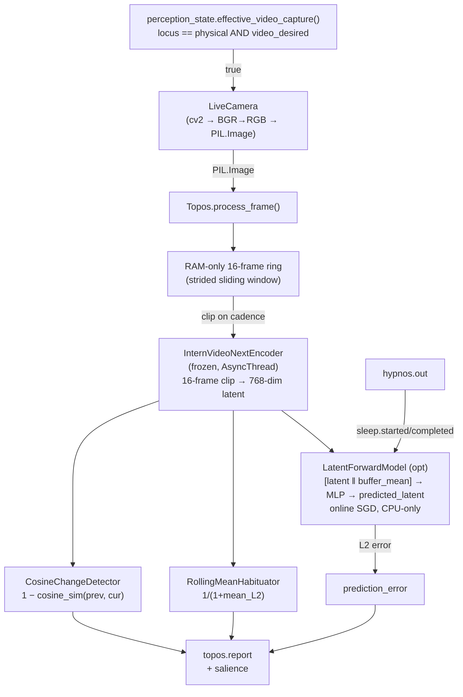

# Topos

Topos is KAINE's visual-perception module. This page explains how it captures frames, encodes them with a frozen video encoder, detects scene change and habituation, optionally predicts the next visual latent, supports attention-driven foveation, and provides reproducible research feeds. Read it if you are enabling the camera, running vision experiments, or changing Topos code.

## Status and dependencies

Implemented. Topos ships disabled: `[modules].topos = false` in `config/kaine.toml`. It is enabled by default in the `thesis_test` profile (`config/profiles/thesis_test.toml`). With no profile selected, the loader applies the `thesis_test` profile automatically, so the effective default entity has Topos enabled.

- Live camera capture needs the `[vision]` extra: `pip install -e .[vision]`. This installs `opencv-python-headless`, `Pillow`, and `transformers`.
- `torch` is provided by the `[core]` extra, not the base package.
- The default InternVideo-Next encoder needs the `[internvideo]` extra (`einops`, `timm`, `easydict`). Flash attention is a separate `[internvideo-flash]` extra. The default eager path does **not** require CUDA or flash attention.
- The DINOv2 fallback (`encoder_backend = "dinov2"`) does not need the `[internvideo]` extras.
- InternVideo-Next weights are fetched once with `python -m kaine.setup.internvideo_next --yes` into a git-ignored local directory (`state/models/…`). Runtime loads only from there with `trust_remote_code=False`, `local_files_only=True`, and `HF_HUB_OFFLINE=1`.
- The default encoder device is `cuda:1`. `resolve_device()` falls back to `cuda:0` on single-GPU hosts, then `cpu` on CPU-only hosts. The actual device is also constrained by `[hardware].allowed_devices` and the `KAINE_FORCE_DEVICE` override.
- The `LatentForwardModel` always runs on the CPU, regardless of the encoder device.
- Encoder weights are frozen: `eval()` and `requires_grad=False` on every parameter.

No `topos.report` is published until the 16-frame ring buffer first fills (about 1.6 s at 10 Hz). The first report after warmup is expected.

### Encoder backends

`[topos].encoder_backend` selects the encoder behind the `Encoder` protocol:

- `internvideo_next` (shipped default) — OpenGVLab InternVideo-Next base, MIT, 91M parameters. A 16-frame clip produces one 768-dim motion-aware latent. Topos keeps a RAM-only 16-frame ring buffer and emits one clip latent every `clip_stride` frame-ticks. At the shipped `vision_sample_hz = 10` and `clip_stride = 3`, that is about 3.33 Hz. No Meta-owned model is loaded by default.
- `dinov2` — Apache-2.0 per-frame fallback. `clip_len = 1`, 384-dim DINOv2-small CLS token.

## What Topos does

In the PP+GWT framing, Topos is the entity's exteroceptive vision channel. Each frame produces:

1. A temporally-native clip latent (768-dim InternVideo-Next or 384-dim DINOv2).
2. A **change score**: `1 − cosine_similarity(previous_latent, current_latent)`.
3. A **habituation score**: `1 / (1 + mean_pairwise_L2_to_buffer_mean)`. It approaches 1.0 for a static scene and 0.0 for maximally varied input.
4. Optionally, a **visual prediction error** from the `LatentForwardModel`. The L2 gap between predicted and observed latent makes surprising scene changes more salient than equally large but expected ones.

Topos follows the eyes-and-ears framing: frames are perception, not recording. No frame is written to disk; each is released from memory after `process_frame()` returns.

The perceptual locus gate decides whether the real camera runs. `effective_video_capture()` in `kaine/perception_state.py` returns `True` only when `video_live_desired = true` **and** `locus == "physical"`. When the locus is `virtual` or `off`, the live camera stays dark automatically. Screen capture and other feed-provided sources supply a `source_factory`, so Topos gates them on `effective_virtual_video_capture()` instead. See [Perception](../09-modules/perception.md) for the locus arbiter.

## Inputs

| Source | Mechanism | Purpose |
|---|---|---|
| `LiveCamera` task | `process_frame(image)` | Delivers one BGR→RGB `PIL.Image` per `capture_interval_s` |
| `source_factory` | registered by the perception feed | Virtual video sources such as screen capture; gated by `effective_virtual_video_capture()` |
| `hypnos.out` | `hypnos.sleep.started` / `hypnos.sleep.completed` | Suspends and resumes `LatentForwardModel` adaptation |
| `kaine.perception_state` | `effective_video_capture()` poll every 250 ms | Camera runs only when locus is `physical` and video is desired |

Topos does not subscribe to the workspace broadcast. The 250 ms poll interval is not exposed as a config key; it stays at the hardcoded class default.

## Outputs

All events publish to the `topos.out` stream.

| Event type | Payload fields | Salience |
|---|---|---|
| `topos.report` | `latent`, `change_score`, `habituation_score`, `encoder_model_id`, `prediction_error`, `normalised_error`, `alert`; with foveation also `peripheral`, `foveal`, `fovea`, `predicted_fovea`; in playlist mode also `item`, `item_order` | `baseline_salience` for routine reports; `alert_salience` when `alert` is true |

The `alert` field is set when any of the following is true:

- Without the forward model: `change_score` is at least `change_alert_factor` times the rolling mean **and** at least `change_alert_threshold`.
- With the forward model: `normalised_error` is at least `2.0`. (`normalised_error` is `prediction_error` divided by its rolling mean.)

`change_alert_threshold` is a floor, not the sole trigger.

When foveation is off, the report contains the single whole-frame latent and none of the foveation keys. When foveation is on, `latent` aliases the `peripheral` gist, and the report also carries `foveal` plus the content-free fovea locations `fovea` and `predicted_fovea`, each a `{x, y, size}` dict of normalized floats in `[0, 1]`.

## Configuration

Section `[topos]` in `config/kaine.toml`. The full reference is in the [modules configuration appendix](../appendix-a-configuration/modules.md).

| Key | Default | Meaning |
|---|---|---|
| `encoder_backend` | `"internvideo_next"` | Encoder selector: `internvideo_next` or `dinov2` |
| `encoder_model_id` | `"revliter/internvideo_next_base_p14_res224_f16"` | Model ID for the active backend; set `"facebook/dinov2-small"` for DINOv2 |
| `encoder_revision` | pinned SHA | Must equal the loader's pinned revision; any other value refuses boot |
| `encoder_local_dir` | `state/models/…` | Git-ignored directory the setup step fetches weights into |
| `clip_len` | `16` | Frames per clip; fixed to `1` for `dinov2` |
| `clip_stride` | `3` | Strided sliding window: one clip latent every N frame-ticks |
| `clip_resolution` | `224` | Clip input resolution |
| `pooling` | `"attention"` | `attention` (native pool head) or `mean` over patch tokens |
| `device` | `"cuda:1"` | Preferred encoder device, resolved with fallback |
| `change_alert_threshold` | `0.005` code default; shipped `1e-4` | Floor for change alert |
| `change_alert_factor` | `2.0` | Change must be at least this multiple of the rolling mean |
| `habituation_window` | `16` | Number of recent embeddings the habituator averages over (at least 2) |
| `baseline_salience` | `0.2` | Salience for routine `topos.report` events |
| `alert_salience` | `0.7` | Salience when scene change or visual surprise fires |
| `capture_enabled` | `false` | Enable the live camera; requires `[vision]` |
| `capture_device` | `0` | `cv2.VideoCapture` device index or URL |
| `capture_interval_s` | `1.0` code default; shipped `0.1` | Seconds between frame captures |
| `vision_sample_hz` | `10.0` | Authoritative sampling rate; when present it overrides a directly set `capture_interval_s` |
| `capture_width` | `640` | Requested frame width |
| `capture_height` | `480` | Requested frame height |
| `capture_warmup_frames` | `3` | Frames discarded at startup |
| `forward_prediction` | `false` code default; shipped `true` | Enable the online-adapting `LatentForwardModel` |
| `forward_model_units` | `128` code default; shipped `256` | Hidden size of the prediction MLP |
| `prediction_error_window` | `32` | Rolling window for normalising prediction-error salience |
| `visual_buffer_size` | `16` | Recent latents kept in the recurrent visual buffer |
| `foveation` | `false` shipped; `true` in `thesis_test` | Enable attention-driven foveation |
| `foveation_grid` | `[12, 12]` | Saliency tiling `(rows, cols)` |
| `foveation_hysteresis` | `0.15` | Dwell damping: a new tile must beat the held one by >15% to move the fovea |
| `foveation_arousal_size_min` | `0.12` | Fovea half-extent at arousal = 1.0 |
| `foveation_arousal_size_max` | `0.5` | Fovea half-extent at arousal = 0.0 |
| `peripheral_width` / `peripheral_height` | `320` / `180` | Downsampled whole-field peripheral gist geometry |
| `foveal_size` | `224` | Square foveal crop fed to the encoder |

The shared top-level `[perception_feed]` section drives a deterministic, unified audio-visual feed for research. It drives both Topos (vision) and [Audition](../09-modules/audition.md) (hearing) from one source of truth. The full reference is in the [perception and sleep configuration appendix](../appendix-a-configuration/perception-and-sleep.md).

| Key | Default | Meaning |
|---|---|---|
| `mode` | `"off"` | `off`, `seeded`, `playlist`, `live`, `screen`, or `womb` |
| `seed` | `0` | Seeded mode: pure function of this seed |
| `playlist_manifest` | `""` | Playlist mode: path to the single checksummed manifest |
| `[perception_feed.video].surprise_interval` | `150` | Seeded mode: shared cross-modal cadence of surprise events |
| `[perception_feed.video].surprise_strength` | `1.0` | Seeded mode: magnitude of the visual surprise blob (`0` disables) |
| `[perception_feed.audio].sample_rate` | `16000` | Seeded mode: audio sample rate |
| `[perception_feed.audio].channels` | `1` | Seeded mode: audio channel count |
| `[perception_feed.audio].base_strength` | `0.3` | Seeded mode: base soundscape amplitude |
| `[perception_feed.audio].surprise_strength` | `1.0` | Seeded mode: surprise-burst amplitude (`0` disables) |

`[perception_feed]` also accepts `transition_seconds` and `transition_audio_fade_seconds`; their defaults are in the configuration reference.

Screen mode turns a shared desktop or single window into the live vision source (and its desktop audio monitor into the hearing source). It spawns the system `ffmpeg` binary (`gdigrab`/`avfoundation`/`x11grab` per OS) and hands Topos BGR frames through a `source_factory`. It therefore gates on `effective_virtual_video_capture()` (the virtual locus), not `effective_video_capture()`. It is non-reproducible: use it only for operator-present demos. Its `[perception_feed.screen]` options (`target`, `region`, `window_title`, `display`, `framerate`, `cursor`, `native`, `ffmpeg_path`) are in the [perception and sleep configuration appendix](../appendix-a-configuration/perception-and-sleep.md).

## How Topos works



### InternVideo-Next encoder

Loaded lazily on first `initialize()`. It uses the vendored, revision-pinned modeling code in `external/internvideo_next/` plus locally cached weights via `kaine/modules/topos/internvideo_next_loader.py` with `trust_remote_code=False` and `local_files_only=True`. The model runs in `eval()` mode with `requires_grad=False` on every parameter. `encode_clip` builds a 16-frame tensor, runs the frozen forward, and pools `[1, 4096, 768]` to 768 dims through the native attention-pool head (`pooling = "attention"`) or a mean over patch tokens (`pooling = "mean"`). The pooled vector is not L2-normalized. `latent_dim` is probed from a dummy clip forward at load. Inference runs in a thread to keep the event loop free.

### DINOv2 fallback

Selectable via `encoder_backend = "dinov2"`. Uses `transformers.AutoModel` and `AutoImageProcessor` for `facebook/dinov2-small`, frozen, extracting the 384-dim CLS token per frame (`clip_len = 1`). The model downloads from HuggingFace on first use unless `HF_HOME` or `TRANSFORMERS_CACHE` points to an existing cache.

Both encoders accept `PIL.Image`, `bytes`, or `numpy.ndarray`. BGR ndarrays from OpenCV are converted to RGB in the capture path before the encoder sees them.

### Attention-driven foveation (topos-foveation)

Off in the shipped `config/kaine.toml`; on in the `thesis_test` profile. When `[topos].foveation = true`, Topos spends resolution where its attention is rather than encoding the whole frame uniformly. Foveation composes with either encoder backend: the peripheral and foveal views are each encoded through the encoder's clip seam, so `dinov2` (`clip_len = 1`) encodes a single view per surface, and `internvideo_next` (`clip_len = 16`) encodes each view as a real clip: both views are derived from every frame in the 16-frame buffer at the fovea chosen on the latest frame, so the encoder sees motion. (Until 2026-10 each view was one still image repeated 16 times.)

Each foveation-enabled tick, from a single in-memory grab:

1. **Coarse spatial saliency** (`SpatialSaliency`, `kaine/modules/topos/foveation.py`) reduces the frame to a `foveation_grid` of per-tile grayscale means and scores absolute change against the previous tick's tiles. Each tile keeps an exponential running mean and variance of its change (weight 0.05 per clip tick), and the bottom-up map is the tile's precision-weighted change: its change above its running mean, divided by its running standard deviation (floored at a tenth of the mean change across tiles), judged against the statistics before this tick. A tile that flickers all the time is down-weighted and a stable tile that suddenly changes is up-weighted, as precision weighting in predictive coding prescribes. For the first five observations the raw change is used.
2. **Precision-weighted fovea selection** (`combine_saliency` + `select_fovea`) combines bottom-up saliency with an optional top-down bias map and picks the argmax tile centre, damped by `foveation_hysteresis`. When nothing is surprising the map is flat and the fovea holds its previous location (the centre before any). The top-down provider is unwired in every shipped configuration, so in practice the selection acts on the bottom-up map alone. The fovea size is set from the current Thymos arousal (`arousal_to_size`): higher arousal gives a tighter fovea.
3. **Views from the clip buffer** (`foveate`) derive a downsampled `peripheral` gist and a native-detail `foveal` crop around the target from each buffered frame, at the fovea chosen on the latest one.
4. **Two encodes** produce `peripheral` and `foveal` latents; the peripheral view drives change/habituation/salience and the foveal view carries the attended detail.
5. **Attention schema** (`FoveaPredictor`) maintains a small constant-velocity forward model of the fovea's own trajectory and publishes the content-free prediction as `predicted_fovea`.

The top-down bias and arousal are supplied through provider callbacks wired at the composition root: `set_top_down_bias_provider(fn)` returns a bias map or `None`, and `set_arousal_provider(fn)` returns an arousal scalar in `[0, 1]`. A missing or throwing provider falls back to bottom-up-only rather than breaking perception. Enable foveation only after `scripts/bench_foveation.py` confirms the two-encode plus native-grab cost fits the tick; the native single grab is configured under `[perception_feed.screen].native`.

### Change, habituation and prediction

`CosineChangeDetector` returns `1 − cosine_similarity(previous_latent, current_latent)`. Range `[0, 2]`; 0 for identical frames, 1 for orthogonal, 2 for anti-correlated. The first clip returns 0.0.

`RollingMeanHabituator` maintains a deque of recent latent vectors and scores `1 / (1 + mean_distance_to_buffer_mean)`. A static scene yields distances near zero and a habituation score near 1.0.

`LatentForwardModel` mirrors the Audition forward model: `[latent ‖ buffer_mean] → Linear(2·latent_dim → units) → Tanh → Linear(units → latent_dim)`. It runs on the CPU, uses online SGD, and guards against non-finite values. `latent_dim` follows the active encoder (768 or 384). A persisted checkpoint whose tensor shapes do not match the running `latent_dim` is discarded with a warning on `deserialize`. The visual buffer is a bounded deque (`visual_buffer_size = 16`). `serialize()` stores weight tensors and a statistical buffer summary (mean/variance per feature), never raw latents.

Soma's `SubstrateForwardModel` is a separate architecture; its default backend is NumPy, not the Topos shallow MLP.

### Camera supervisor

`kaine/modules/topos/live.py` runs as a background asyncio task. It polls `effective_video_capture()` every 250 ms to respect the perceptual locus, opens `cv2.VideoCapture` in a thread, discards warmup frames, and calls `process_frame()` every `capture_interval_s`. The raw BGR ndarray is set to `None` after BGR→RGB conversion; only the `PIL.Image` is passed downstream.

### Nexus live-preview tap

At the end of `process_frame()`, if the operator has set `KAINE_PERCEPTION_PREVIEW=1`, the current frame is encoded to an in-memory JPEG and written to the single overwritten preview slot. The slot holds at most one frame, is never written to disk, and is cleared on `shutdown()`. The tap is a no-op unless the environment variable is set.

## Key files

| File | Role |
|---|---|
| `kaine/modules/topos/module.py` | `Topos` class, `process_frame()`, Hypnos loop, serialisation |
| `kaine/modules/topos/encoder.py` | `InternVideoNextEncoder`, `DINOv2Encoder`, `Encoder` protocol, `make_encoder` selector, image coercion |
| `kaine/modules/topos/internvideo_next_loader.py` | Offline loader for vendored InternVideo-Next weights |
| `external/internvideo_next/` | Vendored, revision-pinned InternVideo-Next modeling code (MIT) and `UPSTREAM` provenance |
| `kaine/modules/topos/change.py` | `CosineChangeDetector` and `ChangeDetector` protocol |
| `kaine/modules/topos/habituation.py` | `RollingMeanHabituator` and `SceneHabituator` protocol |
| `kaine/modules/topos/forward.py` | `LatentForwardModel` — online visual prediction MLP |
| `kaine/modules/topos/foveation.py` | Foveation core: saliency, fovea selection, arousal→size, view derivation, `FoveaPredictor` |
| `kaine/modules/topos/live.py` | `LiveCamera` — camera supervisor task and locus gate |
| `kaine/modules/topos/feed.py` | Deterministic perception-feed video source seam |
| `kaine/modules/topos/screen.py` | Screen-capture source via `ffmpeg` |

## Enabling and using vision

Add to your local `config/kaine.toml` (do not commit):

```toml
[modules]
topos = true

[topos]
capture_enabled = true   # requires pip install -e .[vision]
capture_device = 0       # or an RTSP URL
```

InternVideo-Next weights are fetched once at setup. The DINOv2 fallback downloads `facebook/dinov2-small` from HuggingFace on first use. No external runtime services are needed after the initial fetch.

## Zero-persistence note

Topos holds no raw frames. The live-camera path sets the BGR ndarray to `None` before the `PIL.Image` reaches `process_frame()`. `serialize()` writes only:

- `encoder_model_id` — identity string.
- `forward_model.layers` — MLP weight/bias tensors.
- `buffer_summary` — statistical descriptor (frame count, per-feature mean, per-feature variance) of the visual buffer; no raw latent vectors.

A static grep in `tests/test_zero_persistence_invariant.py` fails the build if any frame-writing call appears in the Topos live-camera path or the deterministic feed sources.

## Reproducible perception feed

Research runs need a deterministic, copyright-free stimulus. Live camera and live human input are non-reproducible, so `live` and `screen` modes exist only for operator-present demos. Selecting `seeded` or `playlist` turns capture on automatically for both Topos and [Audition](../09-modules/audition.md).

- `seeded` — `SeededProceduralSource` (video) and `SeededProceduralAudioStream` (audio) generate each frame and block as a pure function of `(seed, index)`. Each surface has a seed-keyed base signal the world model learns to predict, plus seed-keyed surprise events whose onset comes from a shared counter-based `blake2b` PRNG. The same seed always produces the same stream, but inverting the hash from the stimulus is infeasible. Surprises fire on the same cross-modal cadence slot (`[perception_feed.video].surprise_interval`), so the entity can learn audio-visual binding. The seeded audio is sound, not speech; STT may return empty blocks.
- `playlist` — `PlaylistSource` (video) and `PlaylistAudioStream` (audio) play operator-curated, copyright-free media listed in one checksummed manifest. Both surfaces walk the same manifest. Each file's `sha256` is verified before the run; a mismatch fails the source closed. Video decodes via OpenCV; audio decodes the media's audio track via PyAV. If PyAV is absent, the audio source fails with an install hint.

A playlist manifest is a single TOML file that pins both surfaces:

```toml
# perception_playlist.toml (operator-supplied; copyright-free media with audio)
[[item]]
path = "clips/forest_walk.mp4"
sha256 = "…"          # exact file; verified before the run
fps = 30              # frame timing for reproducible indexing

[[item]]
path = "clips/city_timelapse.mp4"
sha256 = "…"
fps = 30
```

Pin a run like this:

```toml
[perception_feed]
mode = "seeded"
seed = 20260618

[perception_feed.video]
surprise_interval = 150
surprise_strength = 1.0

[perception_feed.audio]
sample_rate = 16000
channels = 1
base_strength = 0.3
surprise_strength = 1.0
```

The active feed mode and its descriptor are recorded in `data/evaluation/runs/<run_id>/manifest.json` so another researcher can regenerate (`seeded`) or verify (`playlist`) the entity's full audio-visual input.

Topos and Audition are separate modules with separate loops, so the feed does not claim frame-locked A/V sync. Coherence is at the media/clip level (playlist) or via the shared seed and cadence (seeded).

## Tests

| File | What it verifies |
|---|---|
| `tests/test_topos_module.py` | `process_frame()`, change/habituation integration, salience |
| `tests/test_topos_encoder.py` | `DINOv2Encoder` lazy load and `Encoder` protocol substitution |
| `tests/test_topos_internvideo_next.py` | InternVideo-Next encoder |
| `tests/test_topos_change.py` | `CosineChangeDetector` boundary cases |
| `tests/test_topos_habituation.py` | `RollingMeanHabituator` static vs varied scenes |
| `tests/test_topos_forward.py` | `LatentForwardModel` step, non-finite guard, serialisation |
| `tests/test_foveation.py` | Spatial saliency, precision-weighted fovea select, arousal→size, view derivation, attention schema |
| `tests/test_foveation_wiring.py` | Composition-root arousal seam wiring |
| `tests/test_topos_dinov2.py` | DINOv2 frozen weights, device placement |
| `tests/test_topos_live.py` | `LiveCamera` open/close, locus gate behaviour |
| `tests/test_topos_feed.py` | Seeded source determinism/cadence/seed-decorrelation; playlist verify + fail-closed |
| `tests/systems/test_topos_subsystem.py` | Redis-backed subsystem integration |

## Spec and related

- OpenSpec: `openspec/specs/topos/spec.md`
- OpenSpec (predictive): `openspec/specs/topos-predictive/spec.md`
- Related modules: [Perception](../09-modules/perception.md) (locus arbiter), [Audition](../09-modules/audition.md) (parallel audio perception), [Mnemos](../09-modules/mnemos.md) (may index latents)
- Cognitive cycle: [The cognitive cycle](../08-cognitive-cycle/README.md)
