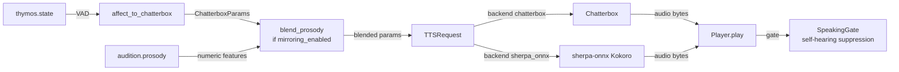

# Vox

Vox is KAINE's voice output organ. This page covers speech synthesis backends, affect-driven prosody, optional prosodic mirroring of an interlocutor, and self-hearing suppression. Read it if you are enabling spoken output or changing how text becomes sound.

## Status

Vox is implemented and ships disabled (`[modules].vox = false`). It is held behind a positive base-thesis result (see [Architecture](../02-architecture/README.md)). Select the backend with `[vox].backend`: `"chatterbox"` (default) or `"sherpa_onnx"`. File-sink (`sink_enabled`) defaults to `false`; self-hearing suppression defaults to `true`. Prosodic mirroring ships disabled (`[vox.mirroring].enabled = false`).

During gestation Vox is held dormant and only starts after birth.

Prosodic mirroring needs Audition enabled with `prosody_enabled = true`, which requires `librosa`. Install it with `pip install -e .[audio]`.

## Backends

`[vox].backend` selects the synthesizer.

| Backend | Engine | Default | Notes |
|---|---|---|---|
| `chatterbox` | Chatterbox TTS service | yes | HTTP-based expressive TTS; supports `temperature`, `exaggeration`, `cfg_weight`, and `speed_factor`. |
| `sherpa_onnx` | sherpa-onnx Kokoro | no | In-process, torch-free. Kokoro English int8, 103 MB. |

`[vox]` keys for the backend:

- `backend` — `"chatterbox"` (default) or `"sherpa_onnx"`.
- `sherpa_model_id` — `"kokoro-en"` (default).
- `sherpa_model_dir` — model cache directory; default `<models dir>/sherpa-onnx/<id>`.
- `sherpa_speaker_id` — `0`; Kokoro exposes 11 preset speakers (indices 0–10).
- `sherpa_num_threads` — `2` ONNX Runtime threads.

Honest limits:

- Kokoro applies only `speed_factor` from the affect mapping and mirroring; `temperature`, `exaggeration`, and `cfg_weight` have no effect.
- The voice is a preset speaker, so a being moved between backends does not keep its voice.
- Kokoro speech is plain, not expressive.
- `vox.synthesized` carries `backend` and `prosody_applied`: all four parameters under Chatterbox, only `["speed_factor"]` under Kokoro.
- `vox.synthesized.voice` is `"kokoro-en speaker N"` under sherpa-onnx.

### Model fetching

Download models ahead of runtime with `python -m kaine.setup.speech_models [--tts ID] [--yes]`. The command shows name, size and licence and asks for consent. Archives are pinned by URL and sha256, verified, and extracted into `state/models/sherpa-onnx/`. The operation is idempotent and nothing downloads at runtime. Size: Kokoro English int8 103 MB. Licence: Apache-2.0 for the model; GPL-3.0-or-later for espeak-ng-data and the espeak-ng engine built into sherpa-onnx.

KAINE does not redistribute espeak-ng; the operator installs it with sherpa-onnx and the model after the consent prompt shows both licences.

### Failure modes

- A missing `sherpa-onnx` package refuses boot through the extras check. Install it with `pip install "kaine[speech-edge]"`.
- Missing model files disable Vox only, with the reason on the health surface.
- The Nexus health surface probes Chatterbox only when `backend = "chatterbox"`. For sherpa-onnx it loads the model and runs one real inference once per process, then reports the remembered result with its age; failures are retried after 60 s.
- When TTS is unavailable, Vox publishes a failure event at most once every 60 s.

Measured on a desktop CPU: Kokoro synthesises a 3 s sentence in about 1.2 s cold.

## Responsibility

Vox is the effector for verbal output. When [Lingua](../09-modules/lingua.md) realises a `speak` intent, the text flows to Vox for acoustic production. Vox:

- Subscribes to `lingua.external` for text to synthesize.
- Tracks the latest `thymos.state` from [Thymos](../09-modules/thymos.md) to drive expressive parameters.
- Maps affect to prosodic parameters. Under Chatterbox the full set `(temperature, exaggeration, cfg_weight, speed_factor)` is used; under Kokoro only `speed_factor` has an effect.
- Optionally blends a bounded prosodic residual from `audition.prosody` into those parameters, with time-decay after the partner stops speaking.
- Plays audio through the OS audio device.
- Suppresses self-hearing: opens a `SpeakingGate` timed to the clip duration plus hangover so an open mic does not transcribe the entity's own voice.
- Optionally writes clips to a bounded file sink.
- Publishes `vox.synthesized` with synthesis metadata (no audio bytes on the bus).

## Inputs

| Stream | Event type | Description |
|---|---|---|
| `lingua.external` | `external_speech` | Text to synthesize; triggers a synthesis cycle. |
| `thymos.out` | `thymos.state` | Latest VAD state for affect-to-parameter mapping. |
| `audition.out` | `audition.prosody` | Numeric prosody features cached for mirroring (only when mirroring is enabled). |

## Outputs

| Stream | Event type | Description |
|---|---|---|
| `vox.out` | `vox.synthesized` | Synthesis metadata: `text_length`, `bytes_produced`, `voice`, `backend`, `prosody_applied`, `output_format`, `temperature`, `exaggeration`, `cfg_weight`, `speed_factor`, `latency_ms`, `success`, `origin` (present when the utterance carries an origin, for example `nous`), and `error` on failure. Under Chatterbox `prosody_applied` lists all four parameters; under Kokoro it lists `["speed_factor"]` only. |

Audio is played to the OS audio device and optionally written to the file sink; audio bytes never go on the bus.

## Configuration

Full reference: [`[vox]` in the modules configuration](../appendix-a-configuration/modules.md).

| Key | Default | Description |
|---|---|---|
| `backend` | `"chatterbox"` | Synthesis backend: `"chatterbox"` or `"sherpa_onnx"`. |
| `sherpa_model_id` | `"kokoro-en"` | sherpa-onnx TTS model ID. |
| `sherpa_model_dir` | `<models dir>/sherpa-onnx/<id>` | Directory holding the downloaded sherpa-onnx model files. |
| `sherpa_speaker_id` | `0` | Kokoro speaker index (0–10) selected from the public preset. |
| `sherpa_num_threads` | `2` | ONNX Runtime threads for sherpa-onnx inference. |
| `chatterbox_url` | `"http://127.0.0.1:8883"` | Chatterbox TTS service URL. |
| `voice_mode` | `"predefined"` | `"predefined"` uses the operator's configured voice file. |
| `predefined_voice_id` | (unset) | **Required for `predefined` mode** — a voice filename your Chatterbox actually serves. Unset → Chatterbox returns 400 and Vox cannot speak. List with `curl -s http://127.0.0.1:8883/get_predefined_voices`; set e.g. `"Abigail.wav"`. |
| `output_format` | `"wav"` | Audio output format. |
| `sink_path` | `"state/vox"` | Directory for optional clip sink. |
| `sink_enabled` | `false` | Write synthesized clips to disk (bounded by `retain_count`). |
| `retain_count` | `0` | Number of newest clips to retain; `0` = immediate prune after write. |
| `playback_enabled` | `true` | Play audio to OS audio device. |
| `output_device` | `""` | OS audio device (empty = system default). |
| `suppress_self_hearing` | `true` | Open the `SpeakingGate` during playback. |
| `mic_mute_hangover_ms` | `600` | Extra milliseconds of gate after clip ends. |
| `baseline_temperature` | `0.7` | Chatterbox temperature at neutral affect. |
| `baseline_exaggeration` | `0.5` | Exaggeration at neutral affect. |
| `baseline_cfg_weight` | `0.5` | CFG weight at neutral affect. |
| `baseline_salience` | `0.3` | Base salience of `vox.synthesized` output events. |
| `alert_salience` | `0.7` | Salience of synthesis failure events (`success=False`). |
| `request_timeout_s` | `120.0` | HTTP timeout per synthesis request. |
| `lingua_external_stream` | `"lingua.external"` | Stream key for text input. |
| `thymos_state_stream` | `"thymos.out"` | Stream key for affect state input. |

`[vox.mirroring]` sub-table:

| Key | Default | Description |
|---|---|---|
| `enabled` | `false` | Enable prosodic mirroring from `audition.prosody`. |
| `mirror_strength` | `0.3` | Blending coefficient (clamped to `mirror_ceiling`). |
| `mirror_ceiling` | `0.5` | Hard ceiling on mirror_strength at boot. |
| `decay_s` | `10.0` | Seconds after last prosody event before mirror residual decays to zero. |

## How it works

### Affect to Chatterbox parameter mapping

`affect_to_chatterbox()` maps `DimensionalState` to `ChatterboxParams` as a pure, stateless function.

| Input | Chatterbox param | Direction |
|---|---|---|
| `arousal` ↑ | `temperature` ↑ | Linear within `[0.40, 0.95]`. |
| `arousal` ↑ | `exaggeration` ↑ | Linear within `[0.30, 0.95]`. |
| `\|valence\|` ↑ | `cfg_weight` ↑ | Linear within `[0.30, 0.95]`. |
| `valence` ↑ | `speed_factor` ↑ | Linear within `[0.85, 1.15]`; 1.0 at valence=0. |

When the state equals the default `DimensionalState()` (all zeros/baseline), the function returns the configured baseline values directly. When `backend = "sherpa_onnx"`, Kokoro ignores `temperature`, `exaggeration`, and `cfg_weight`; only `speed_factor` is applied.

### Prosodic mirroring

When enabled, Vox subscribes to `audition.prosody` events and caches the latest six numeric features: `f0_mean_hz`, `f0_std_hz`, `f0_voiced_frac`, `rms_mean`, `rms_std`, `tempo_bpm`. At synthesis time `blend_prosody()` applies a bounded additive residual on top of the affect-driven parameters:

| Prosody feature | TTS param nudged | Reference range |
|---|---|---|
| `tempo_bpm` | `speed_factor` | 80–180 BPM |
| `rms_mean` | `exaggeration` | 0.01–0.20 |
| `f0_std_hz` | `temperature` | 0–60 Hz |

Each feature is normalised to `[-1, 1]` against its reference range. The nudge is `strength × normalised_residual × half_band_width`, then clamped to the documented band. The speaker embedding / preset voice is never touched; only expressive dynamics are adjusted. When `backend = "sherpa_onnx"`, only the `speed_factor` nudge from `tempo_bpm` has any effect.

The effective strength decays linearly to zero over `decay_s` seconds after the last `audition.prosody` event, so the mirror fades when the partner stops speaking. `blend_prosody()` is a pure function; the caller computes the decayed strength via `decayed_strength()`.

### Self-hearing suppression

When `suppress_self_hearing = true` and a `SpeakingGate` is wired at boot, Vox calls `gate.mark_speaking(duration_s + hangover_s)` before handing audio to the player. [Audition](../09-modules/audition.md)'s live-capture loop polls this gate and drops frames while it is open. Operators with acoustically isolated input (e.g. a headset mic) may set `suppress_self_hearing = false`.

### File sink

When `sink_enabled = true`, each synthesized clip is written to `<sink_path>/<timestamp>-<uuid8>.<format>`. After each write `_prune_sink()` keeps at most `retain_count` newest clips (by mtime), deleting older ones. `retain_count = 0` means a clip is pruned immediately after the reference is released (transient).

## Key files

| File | Role |
|---|---|
| `kaine/modules/vox/module.py` | `Vox` class; consumer loop, synthesis, playback, event publishing. |
| `kaine/modules/vox/sherpa_tts.py` | sherpa-onnx Kokoro backend wrapper. |
| `kaine/modules/vox/mapping.py` | `affect_to_chatterbox()` pure function; `ChatterboxParams`. |
| `kaine/modules/vox/mirroring.py` | `blend_prosody()`, `decayed_strength()`; identity-preserving prosodic accommodation. |
| `kaine/modules/vox/client.py` | `ChatterboxClient` HTTP client; `TTSRequest` / `SynthesisResult`. |
| `kaine/modules/vox/playback.py` | `Player` abstraction; `build_player()`; `wav_duration_s()`. |
| `kaine/modules/vox/coordination.py` | `SpeakingGate` for self-hearing suppression. |

## Enabling and use

1. Set `[modules].vox = true` in `config/kaine.toml`.
2. For `backend = "chatterbox"`, start Chatterbox TTS with the operator's predefined voice in its `voices/` directory. For `backend = "sherpa_onnx"`, fetch the model with `python -m kaine.setup.speech_models --tts kokoro-en`.
3. For `backend = "chatterbox"`, set `predefined_voice_id` to the voice filename served by Chatterbox (do not commit personal filenames). For `backend = "sherpa_onnx"`, set `sherpa_speaker_id` to the desired Kokoro preset index.
4. Enable [Lingua](../09-modules/lingua.md) (Vox subscribes to its output) and [Thymos](../09-modules/thymos.md) (for affect-driven expressivity).
5. For prosodic mirroring: enable [Audition](../09-modules/audition.md) with `prosody_enabled = true`, then set `[vox.mirroring].enabled = true`.

## Safety and zero-persistence note

- Audio bytes are never written to the Redis bus; only numeric metadata (`bytes_produced`, `latency_ms`, etc.) is in the `vox.synthesized` event.
- The file sink is off by default and bounded by `retain_count` when enabled; it never grows without limit.
- The `predefined_voice_id` references a file in Chatterbox's voices directory that the operator manages; the filename is operator-private and must not be committed.
- Prosody features cached for mirroring are six numeric floats only; no audio waveform is stored in the module state.
- Self-hearing suppression prevents the entity from transcribing its own TTS output as if it were human speech, preserving the clean perception→cognition boundary.

## Tests

| File | Coverage |
|---|---|
| `tests/test_vox_mapping.py` | Affect-to-Chatterbox monotonicity guarantees. |
| `tests/test_vox_mirroring.py` | `blend_prosody` bounds; `decayed_strength` decay. |
| `tests/test_vox_client.py` | `ChatterboxClient` request shaping. |
| `tests/test_vox_playback.py` | `Player` abstraction; `wav_duration_s`. |
| `tests/test_vox_module.py` | Consumer loop; thymos tracking; mirroring toggle. |
| `tests/test_sherpa_speech_engines.py` | sherpa-onnx engine integration. |
| `tests/test_speech_models.py` | Model download and verification. |
| `tests/test_speech_model_verification.py` | Sha pinning and extraction checks. |

## Spec and related

- Spec: `openspec/specs/vox/spec.md`
- Prosodic mirroring spec: `openspec/specs/vox-prosodic-mirroring/spec.md`
- Archived change: `openspec/changes/archive/2026-06-15-audio-out-playback` — playback reliability and device-selection improvements.
- See also: [Lingua](../09-modules/lingua.md) (text source), [Thymos](../09-modules/thymos.md) (VAD state), [Audition](../09-modules/audition.md) (prosody source for mirroring), [Hypnos](../09-modules/hypnos.md) (uses Lingua's intent log for voice-alignment training).
