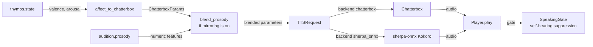

# Vox

Vox is KAINE's voice. It turns the language organ's external speech into sound with local speech synthesis, and it varies the prosody of that sound with the entity's affect. It draws on speech production along the dorsal stream (Hickok and Poeppel 2007), and the question it adds to the module-addition study is whether listeners can detect that affect-driven variation. This page covers the synthesis backends, the mapping from affect to prosody, optional prosodic mirroring of a conversation partner, and self-hearing suppression. Read it if you are enabling spoken output or changing how text becomes sound.

## Status

Vox is built and tested, and held: it is off in the shipped `config/kaine.toml` (`[modules].vox = false`) and in the base-thesis `thesis_test` profile. The [module-addition study](../15-experiments/ignition-study.md) (the ignition study in code) adds it sixth and last in its default order of six: Mnemos, Phantasia, Nous, Eidolon, Empatheia, Vox.

`[vox].backend` selects the synthesizer: `"chatterbox"` (the default) or `"sherpa_onnx"`. The file sink (`sink_enabled`) is off by default, self-hearing suppression is on, and prosodic mirroring is off (`[vox.mirroring].enabled = false`).

During gestation Vox is held dormant, since the gestational stimulus has no air to speak into, and the gate runner activates it at birth. Inner speech is unaffected.

Prosodic mirroring needs Audition with `prosody_enabled = true`, which needs `librosa` (`pip install -e .[audio]`).

## Backends

| Backend | Engine | Default | Notes |
|---|---|---|---|
| `chatterbox` | Chatterbox TTS service | yes | HTTP service with expressive controls: `temperature`, `exaggeration`, `cfg_weight` and `speed_factor` |
| `sherpa_onnx` | sherpa-onnx with Kokoro | no | In-process and torch-free; Kokoro English int8, 103 MB |

The sherpa-onnx backend has these limits:

- Kokoro applies only `speed_factor` from the affect mapping and from mirroring; `temperature`, `exaggeration` and `cfg_weight` have no effect, and its speech is plain.
- The voice is a preset speaker, so a being moved from one backend to the other does not keep its voice.
- `vox.synthesized` lists the parameters actually applied in `prosody_applied`: all four under Chatterbox, `["speed_factor"]` under Kokoro. Its `voice` field reads `"kokoro-en speaker N"` under sherpa-onnx.

### Fetching the model

Download models ahead of time with `python -m kaine.setup.speech_models [--tts ID] [--yes]`. The command shows each model's name, size and licence and asks for consent. Archives are pinned by URL and SHA-256, verified, and extracted into `state/models/sherpa-onnx/`. The command is idempotent, and nothing downloads at runtime. Kokoro English int8 is 103 MB. Its licences are Apache-2.0 for the model and GPL-3.0-or-later for espeak-ng-data and the espeak-ng engine built into sherpa-onnx. KAINE does not redistribute espeak-ng: the operator installs it with sherpa-onnx and the model after the consent prompt shows both licences.

### Failure behaviour

- A missing `sherpa-onnx` package stops the boot at the extras check. Install it with `pip install "kaine[speech-edge]"`.
- Missing model files disable Vox only, and the health surface shows the reason.
- The Nexus health surface probes Chatterbox only when `backend = "chatterbox"`. For sherpa-onnx it loads the model and runs one real inference once per process, then reports the remembered result with its age, retrying a failure after 60 s.
- While speech synthesis is unavailable, Vox publishes a failure event at most once every 60 s.

## What it does

When [Lingua](lingua.md) realizes a `speak` intent, its text reaches Vox for synthesis. Vox:

- reads `lingua.external` for the text to synthesize;
- keeps the latest `thymos.state` from [Thymos](thymos.md);
- maps the affect to prosodic parameters (all four under Chatterbox, `speed_factor` only under Kokoro);
- optionally blends in a bounded residual of the partner's prosody from `audition.prosody`, which fades after the partner stops speaking;
- plays the audio on the operating system's audio device;
- opens a `SpeakingGate` for the length of the clip plus a hangover, so that an open microphone does not pick up the entity's own voice;
- optionally writes each clip to a bounded file sink;
- publishes `vox.synthesized` with synthesis metadata and no audio.

In a study viewing the perceptual feed comes from files on the virtual locus, which keeps the real microphone off, so the entity does not hear its own voice.

## Inputs

| Stream | Event type | Description |
|---|---|---|
| `lingua.external` | `external_speech` | Text to synthesize; each event starts one synthesis |
| `thymos.out` | `thymos.state` | Latest valence, arousal and dominance for the prosody mapping |
| `audition.out` | `audition.prosody` | Numeric prosody features cached for mirroring (only when mirroring is on) |

## Outputs

| Stream | Event type | Description |
|---|---|---|
| `vox.out` | `vox.synthesized` | `text_length`, `bytes_produced`, `voice`, `backend`, `prosody_applied`, `output_format`, `temperature`, `exaggeration`, `cfg_weight`, `speed_factor`, `latency_ms`, `success`, `origin` (when the utterance carries one, for example `nous`), and `error` on failure |

Audio goes to the audio device and, optionally, to the file sink; it never goes on the bus.

## Configuration

Full reference: [`[vox]` in the modules configuration](../appendix-a-configuration/modules.md).

| Key | Type | Default | Meaning |
|---|---|---|---|
| `backend` | string | `"chatterbox"` | `"chatterbox"` or `"sherpa_onnx"` |
| `sherpa_model_id` | string | `"kokoro-en"` | sherpa-onnx model id |
| `sherpa_model_dir` | string | `<models dir>/sherpa-onnx/<id>` | Directory of the downloaded model files |
| `sherpa_speaker_id` | int | `0` | Kokoro preset speaker (0 to 10) |
| `sherpa_num_threads` | int | `2` | ONNX Runtime threads |
| `chatterbox_url` | string | `"http://127.0.0.1:8883"` | Chatterbox service URL |
| `voice_mode` | string | `"predefined"` | `"predefined"` uses a voice file the operator has given Chatterbox |
| `predefined_voice_id` | string | unset | Required in `predefined` mode: a voice filename the Chatterbox server serves. Unset, Chatterbox returns 400 and Vox cannot speak. List the voices with `curl -s http://127.0.0.1:8883/get_predefined_voices` and set, for example, `"Abigail.wav"`. |
| `output_format` | string | `"wav"` | Audio format |
| `sink_path` | string | `"state/vox"` | Directory of the optional clip sink |
| `sink_enabled` | bool | `false` | Write clips to disk, bounded by `retain_count` |
| `retain_count` | int | `0` | Newest clips kept; `0` deletes each clip right after it is written |
| `playback_enabled` | bool | `true` | Play audio on the audio device |
| `output_device` | string | `""` | Audio device (empty means the system default) |
| `suppress_self_hearing` | bool | `true` | Open the `SpeakingGate` during playback |
| `mic_mute_hangover_ms` | int | `600` | Milliseconds the gate stays open after a clip ends |
| `baseline_temperature` | float | `0.7` | Chatterbox temperature at neutral affect |
| `baseline_exaggeration` | float | `0.5` | Exaggeration at neutral affect |
| `baseline_cfg_weight` | float | `0.5` | CFG weight at neutral affect |
| `baseline_salience` | float | `0.3` | Intensity of a successful `vox.synthesized` |
| `alert_salience` | float | `0.7` | Intensity of a failed synthesis (`success = false`) |
| `request_timeout_s` | float | `120.0` | HTTP timeout per synthesis request |
| `lingua_external_stream` | string | `"lingua.external"` | Stream read for text |
| `thymos_state_stream` | string | `"thymos.out"` | Stream read for affect |

`[vox.mirroring]`:

| Key | Type | Default | Meaning |
|---|---|---|---|
| `enabled` | bool | `false` | Turn on prosodic mirroring from `audition.prosody` |
| `mirror_strength` | float | `0.3` | Blending coefficient, clamped to `mirror_ceiling` at boot |
| `mirror_ceiling` | float | `0.5` | Upper bound on `mirror_strength` |
| `decay_s` | float | `10.0` | Seconds after the last prosody event over which the residual fades to zero |

## How it works

### From affect to Chatterbox parameters

`affect_to_chatterbox()` in `kaine/modules/vox/mapping.py` is a pure function from `DimensionalState` to `ChatterboxParams`.

| Input | Parameter | Mapping |
|---|---|---|
| arousal, rising | `temperature` rises | Linear within [0.40, 0.95] |
| arousal, rising | `exaggeration` rises | Linear within [0.30, 0.95] |
| absolute valence, rising | `cfg_weight` rises | Linear within [0.30, 0.95] |
| valence, rising | `speed_factor` rises | Linear within [0.85, 1.15], 1.0 at valence 0 |

When the state equals the default `DimensionalState()`, the function returns the configured baseline values. Under sherpa-onnx only `speed_factor` is applied.

### Prosodic mirroring

When mirroring is on, Vox reads `audition.prosody` and caches the latest six numbers: `f0_mean_hz`, `f0_std_hz`, `f0_voiced_frac`, `rms_mean`, `rms_std` and `tempo_bpm`. At synthesis time `blend_prosody()` adds a bounded residual to the affect-driven parameters:

| Prosody feature | Parameter nudged | Reference range |
|---|---|---|
| `tempo_bpm` | `speed_factor` | 80 to 180 BPM |
| `rms_mean` | `exaggeration` | 0.01 to 0.20 |
| `f0_std_hz` | `temperature` | 0 to 60 Hz |

Each feature is normalized to [−1, 1] against its reference range. The nudge is `strength × normalized residual × half the band width`, clamped to the parameter's band. The speaker embedding or preset voice is never changed; only the expressive dynamics move. Under sherpa-onnx only the `tempo_bpm` nudge to `speed_factor` has an effect.

The effective strength falls linearly to zero over `decay_s` seconds after the last `audition.prosody` event, computed by `decayed_strength()`. `blend_prosody()` is a pure function.

### Self-hearing suppression

When `suppress_self_hearing = true` and a `SpeakingGate` is wired at boot, Vox calls `gate.mark_speaking(duration_s + hangover_s)` before it hands the audio to the player. [Audition](audition.md)'s live-capture loop polls the gate and drops frames while it is open. An operator with acoustically isolated input, such as a headset microphone, may set `suppress_self_hearing = false`.

### File sink

With `sink_enabled = true`, each clip is written to `<sink_path>/<timestamp>-<uuid8>.<format>`. After each write `_prune_sink()` keeps the `retain_count` newest clips by modification time and deletes the rest, so `retain_count = 0` makes every clip transient.

## Key files

| File | Role |
|---|---|
| `kaine/modules/vox/module.py` | `Vox`: consumer loops, synthesis, playback, publication |
| `kaine/modules/vox/sherpa_tts.py` | The sherpa-onnx Kokoro backend |
| `kaine/modules/vox/mapping.py` | `affect_to_chatterbox()` and `ChatterboxParams` |
| `kaine/modules/vox/mirroring.py` | `blend_prosody()` and `decayed_strength()` |
| `kaine/modules/vox/client.py` | `ChatterboxClient`, `TTSRequest`, `SynthesisResult` |
| `kaine/modules/vox/playback.py` | The `Player` abstraction, `build_player()`, `wav_duration_s()` |
| `kaine/modules/vox/coordination.py` | `SpeakingGate` |

## Enabling

1. In the operator file `config/kaine.operator.toml`, set `[modules].vox = true`. The same flag in the shipped `config/kaine.toml` would be overridden by the `thesis_test` profile, which the loader applies when no profile is selected.
2. For `backend = "chatterbox"`, start Chatterbox with the operator's voice in its `voices/` directory and set `predefined_voice_id` to that filename (keep personal filenames out of version control). For `backend = "sherpa_onnx"`, fetch the model with `python -m kaine.setup.speech_models --tts kokoro-en` and set `sherpa_speaker_id` to the preset you want.
3. Keep [Lingua](lingua.md) on, since Vox speaks its output, and [Thymos](thymos.md), since Vox's prosody follows its affect.
4. For prosodic mirroring, turn on [Audition](audition.md)'s `prosody_enabled` and set `[vox.mirroring].enabled = true`.

## What Vox keeps

- Audio never goes on the bus; `vox.synthesized` carries numeric metadata such as `bytes_produced` and `latency_ms`.
- The file sink is off by default and, when on, is bounded by `retain_count`.
- `predefined_voice_id` names a file in Chatterbox's voices directory that the operator manages; the filename stays out of version control.
- The prosody cached for mirroring is six numbers; no waveform is kept in the module's state.

## Tests

| File | Coverage |
|---|---|
| `tests/test_vox_mapping.py` | Monotonicity of the affect mapping |
| `tests/test_vox_mirroring.py` | `blend_prosody` bounds; `decayed_strength` decay |
| `tests/test_vox_client.py` | `ChatterboxClient` request shaping |
| `tests/test_vox_playback.py` | The `Player` abstraction; `wav_duration_s` |
| `tests/test_vox_module.py` | Consumer loop, affect tracking, the mirroring switch |
| `tests/test_sherpa_speech_engines.py` | sherpa-onnx engine integration |
| `tests/test_speech_models.py` | Model download and verification |
| `tests/test_speech_model_verification.py` | Hash pinning and extraction checks |

## Spec and related

- Spec: `openspec/specs/vox/spec.md`
- Prosodic mirroring spec: `openspec/specs/vox-prosodic-mirroring/spec.md`
- Archived change: `openspec/changes/archive/2026-06-15-audio-out-playback` (playback reliability and device selection)
- See also: [Lingua](lingua.md) (the text), [Thymos](thymos.md) (the affect), [Audition](audition.md) (the partner's prosody), [Hypnos](hypnos.md) (uses Lingua's intent log for voice-alignment training).
