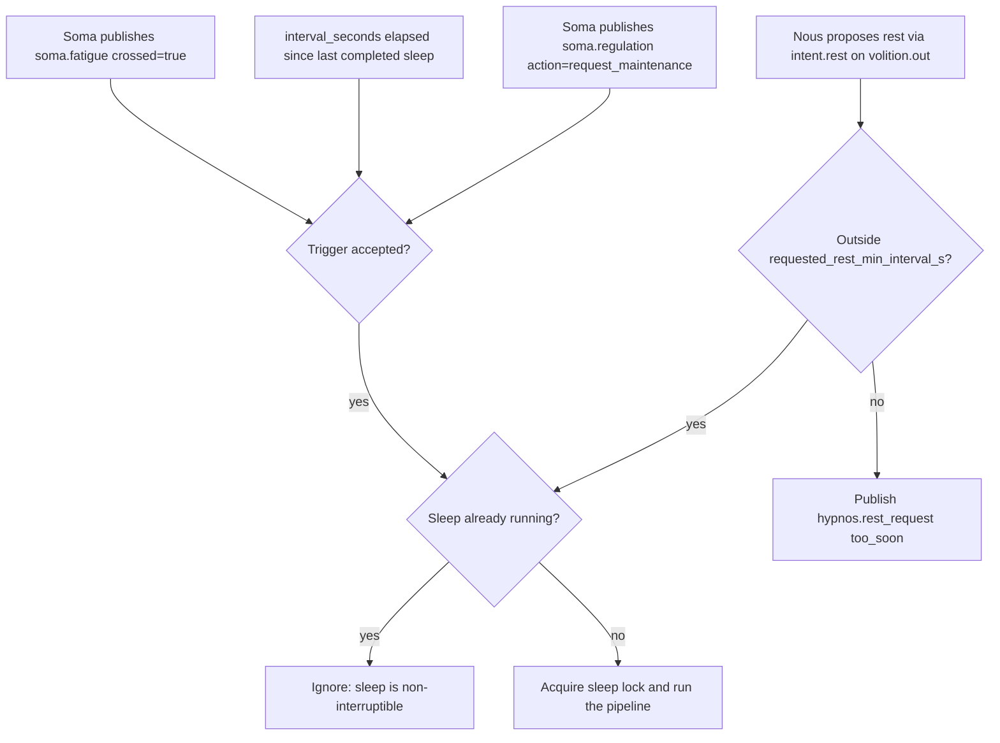
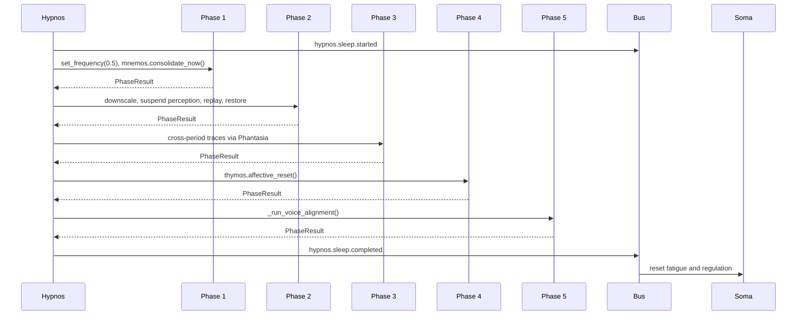

# Sleep and maintenance

Hypnos is KAINE's maintenance module. It runs an offline, non-interruptible five-phase pipeline called sleep. This page explains what triggers sleep, what each phase does, the bus events it emits, and how to configure it. Read it if you operate, debug, or change the maintenance cycle.

## Why sleep exists

Sleep is not driven by a fixed clock. It fires when the substrate needs consolidation: when Soma's fatigue signal crosses a threshold, when Soma's regulator asks for maintenance, when a safety-net interval has passed since the last sleep, or when Nous proposes rest through Volition. While sleep is running, memory consolidation, affective reset, and optional voice alignment happen without live perception.

Soma computes fatigue from unexpected prediction error. It keeps a rolling expected error over `expected_error_tau_s` (default 600 s) plus a spread band. Only error above `expected_error + expected_error_band × spread` is added to fatigue; the default `expected_error_band` is 2.0. During a hard breach the raw error is added. Fatigue decays faster during sleep. When `hypnos.sleep.completed` arrives, Soma resets both fatigue and regulation. See the [Soma](../09-modules/soma.md) page for the full computation.

## What starts maintenance

There are four triggers:

- **Fatigue crossing.** Soma publishes `soma.fatigue` with `crossed = true` when the accumulator crosses `fatigue_maintenance_threshold`. Hypnos watches `soma.out` and starts sleep.
- **Regulation request.** Soma publishes `soma.regulation` with `action = "request_maintenance"` on the same stream. This starts an earlier maintenance cycle through the same guarded path.
- **Safety-net interval.** If no sleep has completed for `interval_seconds` (default 3600 s), the scheduler forces sleep. The timer is measured on the subjective entity clock and starts from the last completed sleep of any trigger.
- **Nous proposal (requested rest).** An `intent.rest` message on `volition.out` asks Hypnos to sleep. It originates from Volition's `NousProposalSource` with `origin = "nous"` and is gated by `requested_rest_min_interval_s` (default 1800 s). Hypnos publishes `hypnos.rest_request` with `accepted: true/false` and `reason` set to `accepted`, `busy`, `too_soon`, or `aborted`. The `hypnos.sleep.started` event adds `trigger: "requested"` only for this case.

The sleep lock only stops a second call to `enter_sleep()`. The cognitive cycle keeps ticking; phase 2 suspends external perception, not the cycle.

## RestScheduler

`RestScheduler` is in `kaine/modules/hypnos/scheduler.py`. It tracks the safety-net deadline and deferral budget.

| Key | Default | Description |
|-----|---------|-------------|
| `interval_seconds` | 3600.0 | Safety-net interval since the last completed sleep |
| `max_deferral_seconds` | 600.0 | Maximum total time maintenance can be deferred |
| `per_defer_seconds` | 60.0 | How long each `try_defer()` call adds |

`is_due()` returns true when the effective deadline has passed or when the original deadline plus `max_deferral_seconds` has passed. `try_defer()` extends the deferral by `per_defer_seconds` and returns false once the budget is exhausted, forcing sleep.

## The five phases

All phases are async. Each returns a `PhaseResult` with `phase`, `success`, `elapsed_ms`, `error`, and `metadata`. One phase failing does not stop the pipeline; phases 1–5 always run in order.

### Phase 1

Phase 1 calls `set_frequency(0.5)` on every active module. The frequency scale is hard-coded to 0.5. If the oscillatory layer is disabled, the call is a no-op. It then calls `mnemos.consolidate_now()` to move all short-term traces to episodic storage. Metadata includes `frequency_scale`, `modules_frequency_called`, and `entries_consolidated`.

### Phase 2

Phase 2 scales all memory activation weights by `downscale_factor` (default 0.9), suspends external perception, runs `mnemos.replay_now()`, and restores perception. Perception restore runs in a `finally` block so it is never left suspended. The cognitive cycle continues; replayed traces are re-injected into the workspace for normal processing. Metadata includes `vectors_downscaled`, `downscale_factor`, `perception_suspended`, `perception_restored`, `replay_events`, and `replay_window_s`.

### Phase 3

Phase 3 is gated by `[hypnos.consolidation].associative_replay` (default `false`). When disabled it returns a successful no-op. When enabled, it selects cross-period traces, cues [Phantasia](../09-modules/phantasia.md) to generate scenario extensions, and re-injects the compact scenario descriptors into the workspace. There is no dedicated belief-revision burst; [Nous](../09-modules/nous.md) processes the replayed traces through the standard cognitive cycle.

### Phase 4

Phase 4 calls `thymos.affective_reset()`, which snaps affect dimensions to their baselines and zeroes every drive. It publishes `thymos.state` with `reset: true`. After all phases finish, `hypnos.sleep.completed` is published; Soma resets both fatigue and regulation on that event.

### Phase 5

Phase 5 runs `Hypnos._run_voice_alignment()`. It builds DPO pairs from `state/lingua/intent_expression.jsonl`, trains a LoRA adapter, applies an abliteration-probe welfare veto first, then a capability-loss check, and promotes the adapter if both pass. See the dedicated [voice alignment](voice-alignment.md) page for the full pipeline, backends, and hot-swap modes.

## Bus events

| Event | Stream | When |
|-------|--------|------|
| `hypnos.rest_request` | `hypnos.out` | After a requested-rest decision; `accepted` bool, `reason` is `accepted`, `busy`, `too_soon`, or `aborted` |
| `hypnos.sleep.started` | `hypnos.out` | Maintenance begins; carries `trigger: "requested"` only for a Nous-requested rest |
| `hypnos.sleep.completed` | `hypnos.out` | All phases done; carries an `ignition_audit` summary |
| `hypnos.ignition_audit` | `hypnos.out` | Module ignition audit; also embedded in the completed summary |
| `hypnos.consolidation_divergence` | `hypnos.out` | Every sleep, before the voice-alignment gate |
| `hypnos.association` | `hypnos.out` | Each cross-period scenario re-injected in phase 3 |
| `thymos.state` | `thymos.out` | Phase 4, with `reset: true` |
| `soma.fatigue` | `soma.out` | Fatigue threshold crossed; triggers Hypnos |
| `soma.regulation` | `soma.out` | Regulator requests maintenance; triggers Hypnos |

## Configuration

The full reference is in [`appendix-a-configuration/perception-and-sleep.md`](../appendix-a-configuration/perception-and-sleep.md).

`[hypnos]`:

| Key | Default | Description |
|-----|---------|-------------|
| `interval_seconds` | 3600.0 | Safety-net interval between completed sleeps |
| `max_deferral_seconds` | 600.0 | Maximum total deferral |
| `per_defer_seconds` | 60.0 | Each `try_defer()` extension |
| `requested_rest_min_interval_s` | 1800 | Minimum time between Nous rest proposals |

`[hypnos]` also accepts `nous_step_burst`, `baseline_salience`, and `alert_salience`. Their defaults are in `config/kaine.toml`.

`[hypnos.consolidation]`:

| Key | Default | Description |
|-----|---------|-------------|
| `fatigue_triggered` | `true` | Whether Hypnos triggers on `soma.fatigue` crossings. Setting it to `false` disables the entire Soma consumer loop, so it also disables `soma.regulation` `request_maintenance` triggers |
| `downscale_factor` | 0.9 | Phase 2 activation scaling |
| `replay_window_s` | 5.0 | Replay window duration, informational |
| `associative_replay` | `false` | Phase 3 feature flag |

`[hypnos.voice_alignment]`:

| Key | Default | Description |
|-----|---------|-------------|
| `enabled` | `false` | Layer 1 of the two-layer training gate |
| `base_model_path` | `""` | Local HF-format weights; required when enabled |
| `model_id` | `"kaineone/Qwen3.5-4B-abliterated"` | Display label only |
| `max_samples` | 200 | Maximum DPO samples |
| `lora_rank` | 8 | LoRA rank |
| `learning_rate` | 5e-5 | Training learning rate |
| `dpo_beta` | 0.1 | DPO beta |
| `capability_loss_threshold` | 0.05 | Capability-loss threshold |
| `training_device` | `"cuda:0"` | Device for training |
| `adapter_retention` | 0 | 0 keeps every accepted adapter |
| `hot_swap_mode` | `"manual"` | `manual`, `reload_endpoint`, `restart_service`, or `organ_adapter` |

Layer 2 of the voice-alignment gate is the environment variable `KAINE_VOICE_ALIGNMENT_OPERATOR_APPROVED=1`. Both layers must be set for training to run.

## Safety notes

- Sleep is non-interruptible. Once started, all five phases run to completion. The sleep lock only prevents a second `enter_sleep()` call; the cycle continues ticking.
- Phase 2 always restores perception in a `finally` block, even if replay fails.
- The abliteration-probe welfare veto runs before the capability check in phase 5. Any adapter that introduces refusal behavior is rejected.
- `state/lingua/intent_expression.jsonl` contains intent and expression metadata (`faithful_rendering`, `generated_text`). It does not contain raw sensory data.
- The requested-rest interval bounds rest proposals from an exploring Nous.

## Key files

| File | Role |
|------|------|
| `kaine/modules/hypnos/module.py` | `Hypnos` module — orchestrates the pipeline and trigger consumers |
| `kaine/modules/hypnos/phases.py` | Phases 1–4 |
| `kaine/modules/hypnos/scheduler.py` | `RestScheduler` |
| `kaine/modules/hypnos/voice_alignment.py` | `VoiceAlignmentConfig`, `DPOPairBuilder`, `FakeTrainer` |

| `kaine/modules/hypnos/job_queue_trainer.py` | Job-queue trainer backend |
| `kaine/modules/hypnos/subprocess_trainer.py` | Subprocess trainer backend |
| `kaine/modules/hypnos/trainer_service.py` | `kaine-trainer` service |
| `kaine/modules/hypnos/adapter_store.py` | Atomic adapter promotion |
| `kaine/modules/hypnos/organ_adapter.py` | Per-entity LoRA activation for an organ server |
| `kaine/modules/hypnos/hot_swap.py` | Hot-swap dispatch |
| `kaine/modules/hypnos/organ_window.py` | Organ-window bracket for reload/restart modes |
| `kaine/modules/hypnos/ignition_audit.py` | Ignition audit publisher |
| `kaine/modules/hypnos/capability_eval.py` | Capability evaluation and abliteration probe |
| `kaine/modules/soma/module.py` | Fatigue and regulation reset on sleep completion |
| `kaine/modules/thymos/module.py` | Affective reset |
| `./voice-alignment.md` | Operator guide for voice alignment |
