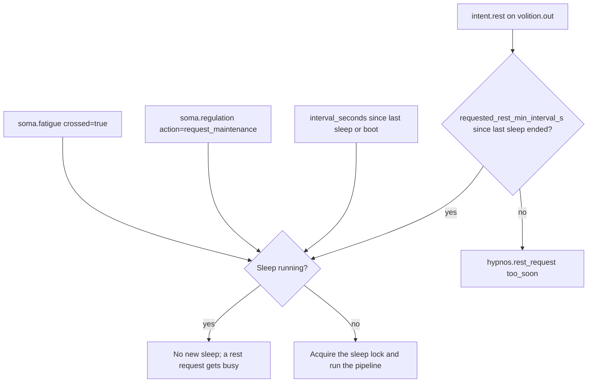

# Sleep and maintenance

Hypnos is KAINE's analog of sleep: a fatigue-triggered offline period during which the predictive processors stop adapting their forward models, and at whose end affect and drives return to baseline. This chapter explains what starts a sleep, what happens during it, each phase of the pipeline, and the events it emits. Read it if you operate, debug or change the sleep cycle. The module reference, with the configuration tables, is the [Hypnos](../09-modules/hypnos.md) page.

## What sleep does

A sleep runs between a `hypnos.sleep.started` and a `hypnos.sleep.completed` event, and the cognitive cycle keeps running through it. When a sleep starts, Hypnos switches the perception locus to `off` and pauses the shared stimulus playlist; when it ends, including after a failure or cancellation, it restores the pre-sleep locus and resumes the playlist from the pause point. The gestational stimulus is the exception: during gestation the developmental gate holds the locus, so the stimulus keeps playing through sleep, as a fetus goes on receiving the maternal heartbeat while it sleeps. On `hypnos.sleep.started`, Topos, Audition, Soma and Chronos stop updating their forward models; they keep predicting and reporting, and resume learning on `hypnos.sleep.completed`. Soma's fatigue decays three times faster during the window. At the end Thymos's affective reset returns valence, arousal and dominance to baseline and clears the drives, and Soma resets its fatigue and regulation state when `hypnos.sleep.completed` arrives. Because every sleep ends with that reset, arousal cannot drift across a whole run.

The consolidation phases act on memory, the world model and preference data. The base-thesis form has none of these, so in that form a sleep suspends adaptation, resets affect and drives, and resets fatigue, and the consolidation phases do no work. They begin to work when Mnemos and Phantasia join. The feed pause does not depend on them: it covers every sleep. Sleep time does not count as awake time (see [Gestation on one host](../06-operation/gestation.md)).

## Fatigue

Soma computes fatigue from unexpected interoceptive prediction error. It learns a running expected error and spread for each channel over `expected_error_tau_s` (600 s of entity time by default), and adds to fatigue only the error above `expected + expected_error_band × spread` (`expected_error_band` = 2.0). On a hard breach, a host metric past its hard limit, the raw error is added instead. When fatigue crosses `fatigue_maintenance_threshold` (100.0), Soma publishes `soma.fatigue` with `crossed = true`. See [Soma](../09-modules/soma.md) for the full computation.

## What starts a sleep



There are four triggers:

- Fatigue. Hypnos watches `soma.out` and starts a sleep when `soma.fatigue` carries `crossed = true`.
- Maintenance request. Soma's regulator publishes `soma.regulation` with `action = "request_maintenance"` on the same stream, and Hypnos starts a sleep through the same guarded path. Both of these triggers need `[hypnos.consolidation].fatigue_triggered = true`, which runs the `soma.out` consumer.
- Interval backstop. If no sleep has completed for `interval_seconds` (3600 s of entity time) since the last sleep or since boot, the scheduler starts one.
- Requested rest. An `intent.rest` on `volition.out`, which Volition's `NousProposalSource` issues with `origin = "nous"` when Nous is enabled, asks for a sleep. Hypnos accepts it only when `requested_rest_min_interval_s` (1800 s) has passed since the last sleep ended and no sleep is running or starting. It answers with `hypnos.rest_request` (`accepted`, and `reason` of `accepted`, `busy`, `too_soon` or `aborted`), and an accepted request's `hypnos.sleep.started` carries `trigger: "requested"`.

The sleep lock stops a second sleep from starting while one runs. It blocks nothing else.

## RestScheduler

`RestScheduler` (`kaine/modules/hypnos/scheduler.py`) keeps the backstop deadline on the entity clock. `is_due()` is true once the effective deadline has passed, or once the original deadline plus `max_deferral_seconds` (600 s) has passed. `try_defer()` moves the effective deadline back by `per_defer_seconds` (60 s) and returns false once the deferral budget is spent; nothing in the running system calls it outside tests. Each completed sleep schedules the next deadline `interval_seconds` ahead. A snapshot stores the time remaining, and a restore starts from it.

## The five phases

```mermaid
sequenceDiagram
    participant Hypnos
    participant Bus
    participant Soma

    Hypnos->>Bus: hypnos.sleep.started
    Note over Hypnos: Phase 1: set_frequency(0.5); mnemos.consolidate_now()
    Note over Hypnos: Locus off and playlist paused for the whole sleep
    Note over Hypnos: Phase 2: downscale; replay
    Note over Hypnos: Phase 3: cross-period traces, Phantasia, hypnos.association
    Note over Hypnos: Phase 4: thymos.affective_reset()
    Note over Hypnos: Phase 5: consolidation divergence; voice-alignment gates
    Note over Hypnos: Intent-log rotation, voice measures, intent audit
    Hypnos->>Bus: hypnos.sleep.completed
    Bus->>Soma: reset fatigue and regulation
```

Each phase returns a `PhaseResult` with `phase`, `success`, `elapsed_ms`, `error` and `metadata`, and catches its own errors, so the phases always run in order and a failure in one does not stop the next.

### Phase 1: light consolidation

Phase 1 calls `set_frequency(0.5)` on every active module, a no-op unless the oscillatory layer is active, then calls `mnemos.consolidate_now()` to move every short-term trace into episodic memory without dropping any. Metadata: `frequency_scale`, `modules_frequency_called` and `entries_consolidated`. Without Mnemos it records `consolidation_skipped`.

### Phase 2: deep consolidation

Phase 2 needs Mnemos and otherwise returns at once with `skipped`. It scales every memory activation vector by `downscale_factor` (0.9), following the synaptic homeostasis hypothesis (Tononi and Cirelli 2014). It then runs `mnemos.replay_now()` while perception is already suspended for the sleep. Metadata: `vectors_downscaled`, `downscale_factor`, `replay_events` and `replay_window_s`.

### Phase 3: associative replay

Phase 3 runs only when `[hypnos.consolidation].associative_replay = true` and otherwise returns a successful no-op. It selects traces from at least two memory periods, cues [Phantasia](../09-modules/phantasia.md) to extend each into a scenario, and publishes each scenario as a `hypnos.association` event, which competes in the workspace like any other event. [Nous](../09-modules/nous.md) and Thymos take it up through the normal cycle.

### Phase 4: affective reset

Phase 4 calls `thymos.affective_reset()`. It returns valence, arousal and dominance to baseline, resets every drive, sets the emotion to neutral, clears the learning-progress and alert-rate trackers, the intent rate and any perceived emotion, and publishes `thymos.state` with `reset: true`. Wellness and the record of the last heard voice are kept. See [Thymos](../09-modules/thymos.md#sleep-reset).

### Phase 5: voice alignment

Phase 5 first builds preference pairs from the intent-expression log and publishes the content-free `hypnos.consolidation_divergence` metric. It then checks the voice-alignment gates. No validated preference source exists yet, so the phase trains nothing, even with both operator gates open. See [Voice alignment](voice-alignment.md).

### After the phases

Hypnos moves the waking intent log `state/lingua/intent_expression.jsonl` into the per-sleep corpus under `state/lingua/intent_log/`. The move never overwrites a file, and a disk check warns at 80% of `corpus_ceiling_gb` and never deletes. It computes content-free voice measures from the rotated file, runs the sleep-time intent audit (`hypnos.ignition_audit`), and publishes `hypnos.sleep.completed`.

## Bus events

| Event | Stream | When |
|---|---|---|
| `hypnos.sleep.started` | `hypnos.out` | A sleep begins; `trigger: "requested"` only for a requested rest |
| `hypnos.rest_request` | `hypnos.out` | Answer to a rest request |
| `hypnos.association` | `hypnos.out` | Each phase-3 scenario |
| `thymos.state` | `thymos.out` | Phase 4, with `reset: true` |
| `hypnos.consolidation_divergence` | `hypnos.out` | Every sleep, at the start of phase 5 |
| `hypnos.ignition_audit` | `hypnos.out` | Every sleep, after the phases; also merged into the completed summary |
| `hypnos.sleep.completed` | `hypnos.out` | The sleep ends; carries the phase results and the audit, or `{"aborted": true, "reason": ...}` if the pipeline itself aborted |
| `soma.fatigue` | `soma.out` | Fatigue crossed its threshold; a trigger |
| `soma.regulation` | `soma.out` | The regulator requests maintenance; a trigger |

## Configuration

The `[hypnos]`, `[hypnos.consolidation]` and `[hypnos.voice_alignment]` tables are documented on the [Hypnos](../09-modules/hypnos.md#configuration) and [Voice alignment](voice-alignment.md#configuration) pages, and in [Perception feed and sleep](../appendix-a-configuration/perception-and-sleep.md). Soma's fatigue keys are in the [modules configuration page](../appendix-a-configuration/modules.md).

## Invariants

- A sleep, once started, runs every phase in order. A second sleep cannot start while one runs, and the cycle keeps ticking.
- Phase 2 always restores the perception locus and the playlist, even when replay fails.
- The four processors resume adaptation on `hypnos.sleep.completed`, which Hypnos publishes even when the pipeline aborts.
- The intent-expression log holds rendered coalition text and generated text, with heard speech redacted, and no audio or video.

## Key files

| File | Role |
|---|---|
| `kaine/modules/hypnos/module.py` | `Hypnos`: triggers, pipeline, perception suspension, phase 5 |
| `kaine/modules/hypnos/phases.py` | Phases 1 to 4 |
| `kaine/modules/hypnos/scheduler.py` | `RestScheduler` |
| `kaine/modules/hypnos/corpus.py` | Intent-log rotation and the corpus ceiling check |
| `kaine/modules/hypnos/ignition_audit.py` | Sleep-time intent audit |
| `kaine/modules/soma/module.py` | Faster fatigue decay during sleep; fatigue and regulation reset on completion |
| `kaine/modules/thymos/module.py` | Affective reset |
| `kaine/modules/topos/module.py`, `kaine/modules/audition/module.py`, `kaine/modules/chronos/module.py` | Adaptation suspended between `hypnos.sleep.started` and `hypnos.sleep.completed` |
