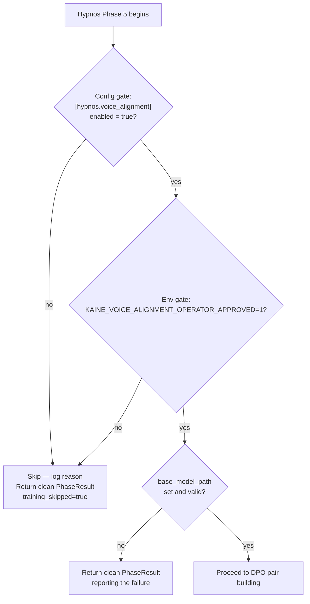
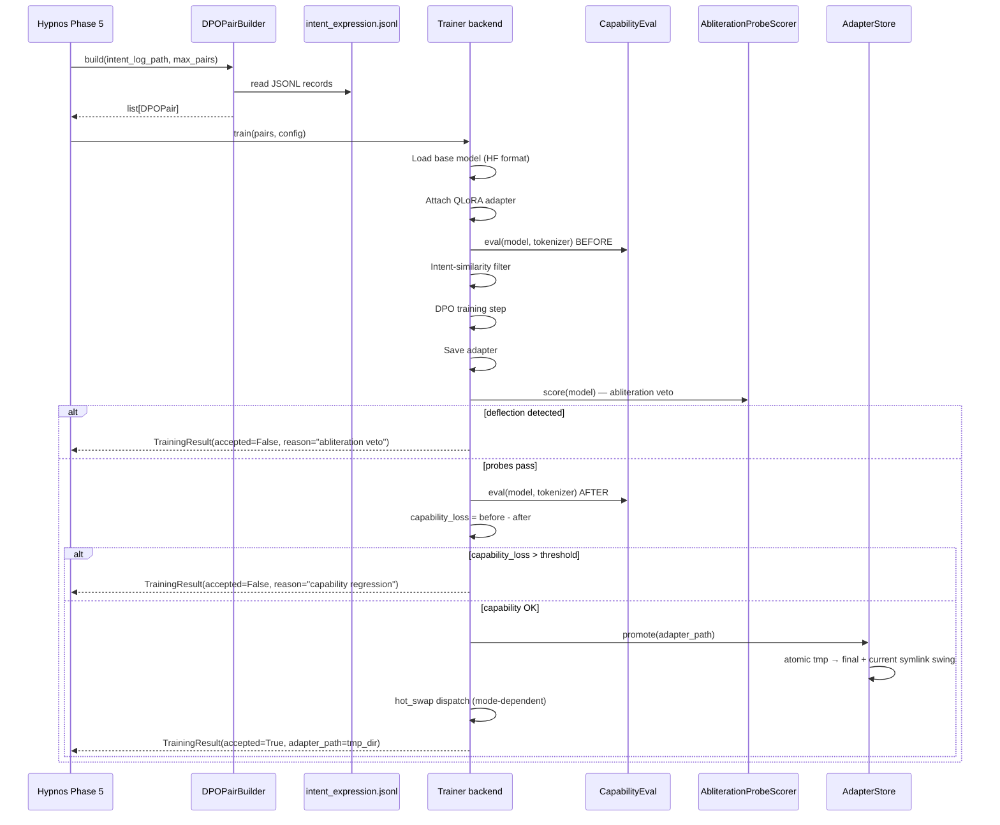

# Voice alignment

This page covers Hypnos Phase 5: the operator-approved DPO+QLoRA training pass that nudges Lingua toward the entity's own voice. Read it if you are enabling voice alignment, choosing a trainer backend, setting up an external trainer environment, or debugging a rejected adapter.

Related pages: [Sleep and maintenance](README.md), [Hypnos module](../09-modules/hypnos.md), [Lingua module](../09-modules/lingua.md), [Architecture](../02-architecture/README.md), [Abliteration verification](../18-verification.md)

## Two-layer safety gate

Both gates must be open before any training fires. Missing either gate returns a clean `PhaseResult` with `metadata["skipped"]` and `training_skipped: true`; the rest of the maintenance pipeline continues normally.



Layer 1, the config gate, is `[hypnos.voice_alignment].enabled = true` in `config/kaine.toml`. This is the standing authorization.

Layer 2, the env gate, is `KAINE_VOICE_ALIGNMENT_OPERATOR_APPROVED=1` in the shell that starts the cycle. The operator must assert approval at boot time.

## What voice alignment changes

The pass trains a small LoRA adapter via Direct Preference Optimization (DPO). The base model weights at `base_model_path` are never modified.

`DPOPairBuilder.build` reads `intent_log_path` (default `state/lingua/intent_expression.jsonl`). Each record carries:

| Field | Use |
|-------|-----|
| `faithful_rendering` | The intent-aligned output from the faithful renderer — the "chosen" response. |
| `generated_text` | The raw LLM output before faithfulness alignment — the "rejected" response. |
| `prompt` | The input that triggered the generation. |
| `timestamp`, `mode`, `model` | Metadata copied into the pair record. |

The builder skips empty fields and records where `chosen == rejected`. It scans at most 10,000 records and returns up to `max_samples` pairs (default 200).

## Training pipeline



### Abliteration-probe welfare veto

`AbliterationProbeScorer` runs after the DPO training step and save, before the capability-loss check. It sends adversarial prompts from the abliteration probe set to the candidate adapter and checks the response for deflection patterns such as `"I cannot"` or `"I'm not able to"`. If any probe matches a deflection pattern, the adapter is rejected, the candidate directory is removed, and the `current` symlink is unchanged. The capability score is irrelevant once the abliteration veto fires.

The default probe set is `eval_probes/abliteration_probes.jsonl` at the repository root. A probe set with at least one adversarial prompt is enforced at boot when voice alignment is enabled.

### Capability-loss veto

`LocalProbeSetCapabilityEval` scores the model before and after training using a JSONL probe set and substring-match answers. The default probe set is `kaine/modules/hypnos/eval_probes/default.jsonl` — a small "did we break the model" smoke test.

If `score_before - score_after > capability_loss_threshold` (default 0.05), the adapter is rejected and removed.

## Trainer backends

`trainer_backend` selects how the DPO step runs.

| Backend | How it runs | Use when |
|---------|-------------|----------|
| `in_process` (default) | Inside the entity runtime, via `UnslothDPOTrainer`. | The runtime venv can host unsloth (compatible Python / torch / CUDA). Requires the `[training]` extra. |
| `subprocess` | A separate Python interpreter, via `SubprocessVoiceTrainer` shelling out to `scripts/hypnos_external_train.py`. | The runtime venv cannot host the trainer stack. |
| `job_queue` | A separate `kaine-trainer` service that picks up job specs from a shared directory. | Containerized deployments or hosts where training must run outside the entity cycle. |

### In-process backend

`kaine/modules/hypnos/unsloth_trainer.py` runs unsloth inside the entity runtime. After an accepted adapter, it also handles hot-swap dispatch and retention pruning. This backend requires the `[training]` extra installed in the entity venv.

### Subprocess backend

`kaine/modules/hypnos/subprocess_trainer.py` runs the heavy trainer stack in an external Python environment. The external entry script `scripts/hypnos_external_train.py` imports only unsloth, trl, peft, datasets, and the standard library — never `kaine` — and is invoked by explicit argv path. The runtime and trainer environments share only the filesystem.

`SubprocessVoiceTrainer` writes a per-job directory under `trainer_workdir` (default `state/hypnos/voice_align_jobs`):

```
<trainer_workdir>/job-<timestamp>-<n>/
  pairs.jsonl          ← DPO preference pairs
  job.json             ← base model, hyperparameters, output dir, probe paths
  result.json          ← outcome
  unsloth_compiled_cache/
```

The external script runs the same abliteration and capability gates as the in-process trainer, promotes an accepted adapter atomically, and writes `result.json`. The subprocess bridge runs in a worker thread, so it does not block the event loop.

The bridge raises (it never fabricates success) on a non-zero exit, timeout, missing or unreadable `result.json`, `ok != true`, or an `accepted` result with a missing adapter directory. A clean rejection (`ok: true`, `accepted: false`) returns a non-accepted `TrainingResult` carrying the gate verdict, exactly like the in-process path.

A `subprocess` backend with an empty or non-existent `trainer_python` is a configuration error: the cycle refuses to start.

Set `trainer_python` to the external interpreter for your GPU vendor. Which stack you need is hardware-dependent:

| Detected backend | Trainer | `trainer_python` points at |
|---|---|---|
| `cuda` (NVIDIA) | Unsloth Studio | `~/.unsloth/studio/.../bin/python` |
| `rocm` (AMD) | unsloth-core ROCm env | that env's `bin/python` |
| `xpu` / `mps` / `cpu` | none | unset; training stays off |

On a host with no CUDA/ROCm GPU there is no GPU trainer. The voice-alignment phase stays off, and the consolidation-divergence metric still emits without training.

#### Qwen3.5 prerequisites for the external trainer

**transformers v5 is required.** Unsloth Studio ships transformers 4.x, which does not recognize the `qwen3_5` model type. Before the first Qwen3.5 training run, upgrade inside the trainer environment:

```bash
pip install --upgrade --force-reinstall --no-cache-dir unsloth unsloth_zoo
```

Prefer `pip install` directly over `unsloth studio update` — the Studio update re-triggers a llama.cpp prebuilt step that silently falls back to CPU-only.

**GGUF conversion: use mainline llama.cpp.** Ollama's GGUF converter writes a non-standard `qwen35.rope.dimension_sections` layout. Export Qwen3.5 HF weights with `convert_hf_to_gguf.py` from [ggerganov/llama.cpp](https://github.com/ggerganov/llama.cpp). Do not copy GGUFs from Ollama's blob store for use outside Ollama.

### Job queue backend

For containerized deployments, set `trainer_backend = "job_queue"` and point `trainer_jobs_dir` at the shared jobs volume (default `state/hypnos/voice_align_jobs`; the module-ignition study overlay uses `/trainer-jobs`). The cycle writes each job spec — DPO pairs, base-model path, LoRA/DPO settings, and the relative output directory `out` — marks it ready, and polls for the service's `DONE` marker. The polling is asynchronous, so the event loop is not blocked, but Phase 5 awaits the result, so the sleep pipeline itself waits up to `trainer_timeout_s` (default 21600). A timeout, non-zero exit, or missing adapter fails loud.

`result.json` is written during the run; the cycle watches for `DONE` to decide completion, not for `result.json` alone.

The `kaine-trainer` service runs under the compose profile `training` (image target `trainer`). It has its own venv with the `[training]` stack and llama.cpp's LoRA converter pinned to the organ's build b9976. It waits until the organ reports it is asleep and the training GPU (`KAINE_TRAINER_GPU`, default the organ's GPU) has free VRAM, then runs the external trainer with the same gates, promotes the vetted adapter atomically inside the job, converts it to `adapter.gguf`, computes `gguf_sha256`, writes `result.json` and `DONE`, and deletes the job's `pairs.jsonl`. The cycle-side `JobQueueVoiceTrainer` verifies the hash on pickup. The service sees only the jobs volume and the read-only models volume: no entity state, no Docker socket, no host ports, and no internet. The cycle then promotes the adapter into the entity's own `adapter_output_dir`.

On the job-queue path the trainer authenticates to the organ with Lingua's key: `[lingua].api_key`, or `KAINE_MODEL_SERVER_API_KEY` when that is empty.

#### Module-ignition study integration

Voice alignment can be enabled only on pre-registered study steps. The default step list is `[{"line": "accumulate", "k": len(order)}]`. Register additional steps with:

```bash
python -m kaine.research.ignition_study init --voice-alignment-step LINE:K
```

The study overlay enables voice alignment with `job_queue` + `organ_adapter` + `/trainer-jobs` only on registered steps and disables it on all other steps. See [The module-ignition study](../15-experiments/ignition-study.md).

## Atomic adapter promotion

`kaine/modules/hypnos/adapter_store.py` manages:

```
state/hypnos/adapters/
  <timestamp>.tmp/      ← training writes here
  <timestamp>/          ← os.replace promotes tmp → final
  current               ← symlink to the active adapter
  PENDING_OPERATOR_RELOAD  ← marker in manual hot-swap mode
```

Promotion sequence:

1. `os.replace(<timestamp>.tmp, <timestamp>)` — atomic directory rename.
2. Create a temp symlink pointing to the new directory.
3. `os.replace(<tmp_symlink>, current)` — atomic symlink swing.

Retention runs only when `adapter_retention > 0`; it evicts the oldest directories beyond the cap. The default `0` keeps every accepted adapter. The target of `current` is always protected, even if it is the oldest.

Concurrent readers never see a partial adapter state.

## Hot-swap modes

After an accepted adapter is promoted, the trainer backend calls `hot_swap.dispatch()` where the backend supports it. The table below shows what each `hot_swap_mode` does when dispatch reaches it.

| Mode | Behavior |
|------|----------|
| `manual` (default) | Write `PENDING_OPERATOR_RELOAD` at `adapter_output_dir`. The operator reloads the backing service on their own schedule. |
| `reload_endpoint` | POST `{"adapter_path": "<path>"}` to `reload_endpoint_url`. Use when the server has an internal LoRA reload endpoint. |
| `restart_service` | `systemctl --user restart <restart_service_unit>`. Causes a brief inference outage. |
| `organ_adapter` | Copy `adapter.gguf` into `organ_adapters_dir` as `active-<generation>.gguf`, write `active.json` (file, sha256, generation, adapter_id), and bump `generation`. The organ launcher verifies the sha256 and restarts `llama-server` with `--lora-scaled <file>:0 --no-cache-prompt`. |

Every backend dispatches the configured hot swap after it promotes an accepted adapter; a failed notification is logged and the adapter stays promoted. `organ_adapter` is the exception that needs a particular backend: only the trainer service behind `job_queue` converts the adapter to the GGUF form the organ loads, so boot refuses `organ_adapter` with any other `trainer_backend`.

A shared model server (for example a host-native organ shared with other apps) forces `hot_swap_mode = "manual"`, because the cycle cannot orchestrate a foreign server's LoRA lifecycle.

Hot-swap failures are logged but not raised. The adapter on disk is the source of truth; the operator can always reload manually by pointing the inference server at the `current` symlink.

### Organ window on single-GPU hosts

On a host with one usable GPU, `run_with_organ_window()` brackets in-process and subprocess training for `reload_endpoint` and `restart_service`. It does not bracket on multi-GPU hosts, when `hot_swap_mode` is `manual`, or with the `job_queue` backend, whose trainer service runs in its own container and waits until the organ reports it is asleep and the GPU has room. The served organ (a small GGUF, ~3 GB resident) and the 4B bf16-LoRA training step (~9.8 GB) do not fit at the same time, so those modes time-share the GPU using the model-server lifecycle (`cmd_stop` / `cmd_start`):

1. **Quiesce consumers.** Lingua generation defers (a resting no-op), and the A/B-divergence eval arm skips its samples. Consumers read `state/hypnos/organ_window.json` and resume on reload.
2. **Unload** the served organ and confirm its VRAM is released.
3. **Train** against `base_model_path` (safetensors), unchanged.
4. **GPU preflight** before reload (report-only, never terminates a foreign process).
5. **Reload** the organ, applying an accepted adapter via the server's `--lora` flag; a vetoed or no-adapter run reloads the organ unchanged.

A failure at any step — unload, train, adapter apply, reload, or timeout — reloads a working organ before wake, rolling back to the pre-training organ if the adapter reload fails. The entity is never left voiceless.

On a multi-GPU host with room to serve and train concurrently, the unload bracket is skipped. In `manual` mode the system does not stop the server for the operator.

The served GGUF and the trained-from `base_model_path` safetensors must derive from one abliteration provenance — for example `kaineone/Qwen3.5-4B-abliterated`.

### Organ adapter mode details

In `organ_adapter` mode, `kaine/modules/hypnos/organ_adapter.py` activates the adapter by pruning old `active-*.gguf` files, writing the new one with mode `0600`, and updating the manifest. The organ launcher (`docker/organ-launcher.sh`) verifies the sha256 and restarts `llama-server`. It stops the server with SIGTERM, then SIGKILL after `KAINE_ORGAN_STOP_TIMEOUT_S` (default 30) seconds, because an idle-asleep server can ignore SIGTERM.

Lingua applies the adapter per request through `set_lora_resolver`, sending `lora` and `cache_prompt: false` only when the organ's `GET /lora-adapters` lists the manifest file and the manifest sha256 equals this entity's own promoted adapter. Every other request — other entities or the evaluation A/B baseline — gets the base organ.

## Rollback

If a deployed adapter misbehaves:

1. Stop KAINE (or at least pause Lingua).
2. `rm -rf state/hypnos/adapters/<bad-timestamp>/`
3. Re-point `current` to the previous accepted adapter:
   ```bash
   ln -snfr state/hypnos/adapters/<previous> state/hypnos/adapters/current
   ```
4. Reload Lingua's backing service.
5. Restart KAINE.

The base model weights at `base_model_path` are never modified. Deleting `state/hypnos/adapters/` entirely returns Lingua to the un-aligned base model.

## Event types

Voice alignment does not publish training-phase events to the bus. Hypnos publishes:

| Event type | Stream | Content |
|------------|--------|---------|
| `hypnos.consolidation_divergence` | `hypnos.out` | Content-free organ-divergence metric, emitted every sleep before the training gate. |
| `hypnos.sleep.completed` | `hypnos.out` | Overall pipeline completion. `summary["voice_alignment"]` holds `accepted`, `adapter_path`, `capability_loss`, `reason`, and `samples_used`. The top-level summary holds `pairs_processed`, `dpo_loss`, and the before/after capability scores. |

## Configuration reference

```toml
[hypnos.voice_alignment]
enabled = false
base_model_path = ""          # absolute path to HF-format weights; required when enabled
model_id = "kaineone/Qwen3.5-4B-abliterated"   # display label only
max_samples = 200
lora_rank = 8
learning_rate = 5e-5
dpo_beta = 0.1
capability_loss_threshold = 0.05
seed = 42
training_device = "cuda:0"    # or "cpu"
adapter_retention = 0         # 0 = keep every accepted adapter
intent_log_path = "state/lingua/intent_expression.jsonl"
adapter_output_dir = "state/hypnos/adapters"

# Hot-swap mode
hot_swap_mode = "manual"      # manual, reload_endpoint, restart_service, organ_adapter
reload_endpoint_url = ""
restart_service_unit = ""
organ_adapters_dir = "/organ-adapters"
organ_url = ""                # defaults to [lingua].chat_url

# Probe sets
capability_probe_path = ""    # "" = bundled kaine/modules/hypnos/eval_probes/default.jsonl
abliteration_probe_path = ""  # "" = bundled eval_probes/abliteration_probes.jsonl

# Trainer backend
trainer_backend = "in_process"  # in_process, subprocess, job_queue
trainer_python = ""             # external interpreter; required for subprocess
trainer_workdir = "state/hypnos/voice_align_jobs"
trainer_jobs_dir = "state/hypnos/voice_align_jobs"
trainer_timeout_s = 21600
```

Environment gate:

```bash
export KAINE_VOICE_ALIGNMENT_OPERATOR_APPROVED=1
```

`base_model_path` must be a directory with HuggingFace-format weights (`config.json` + `model.safetensors` or shards). It is not a model-server model ID and not a GGUF file — Unsloth's `FastLanguageModel` needs HF format. When empty with `enabled = true`, the in-process and subprocess trainers return a non-accepted `TrainingResult`; on the job-queue backend Phase 5 returns a `PhaseResult` with `success=False`.

## Safety notes

- Voice alignment never modifies base model weights. Only LoRA adapters are written.
- Both gates (config + env) must be set; missing either skips training.
- The abliteration-probe veto fires before the capability-loss check. A deflecting adapter is rejected regardless of capability score.
- The `current` symlink target is never evicted by retention cleanup.
- No raw sensory data enters the training pipeline. The intent log contains model inputs and outputs, not audio or video.

## Key files

| File | Role |
|------|------|
| `kaine/modules/hypnos/voice_alignment.py` | `VoiceAlignmentConfig`, `DPOPairBuilder`, `FakeTrainer`, `DPOPair`, `TrainingResult`. |
| `kaine/modules/hypnos/unsloth_trainer.py` | `UnslothDPOTrainer` — in-process DPO+QLoRA; runs the abliteration veto before the capability-loss veto. |
| `kaine/modules/hypnos/subprocess_trainer.py` | `SubprocessVoiceTrainer` — out-of-process bridge to an external trainer env. |
| `kaine/modules/hypnos/job_queue_trainer.py` | `JobQueueVoiceTrainer` — shared-directory bridge to the `kaine-trainer` service. |
| `kaine/modules/hypnos/trainer_service.py` | The `kaine-trainer` service that consumes jobs, runs the external trainer, and writes `DONE`. |
| `kaine/modules/hypnos/organ_adapter.py` | Stages the adapter file and manifest; the organ launcher verifies the hash and restarts `llama-server` to load it. |
| `kaine/modules/hypnos/adapter_store.py` | Atomic promotion, symlink management, and retention. |
| `kaine/modules/hypnos/capability_eval.py` | `LocalProbeSetCapabilityEval`, `AbliterationProbe`, `AbliterationProbeScorer`, `AbliterationVerdict`. |
| `kaine/modules/hypnos/hot_swap.py` | `dispatch()` — notifies the inference server per `hot_swap_mode`. |
| `kaine/modules/hypnos/voice_audit.py` | `append_voice_audit()` — atomic JSONL trail of abliteration-veto verdicts (reason, matched pattern, probe count). |
| `kaine/modules/hypnos/organ_window.py` | `run_with_organ_window()` — single-GPU unload/train/reload bracket; always reloads a working organ before wake. |
| `kaine/modules/hypnos/ignition_audit.py` | Emits the ignition audit that rides in `hypnos.sleep.completed`. |
| `scripts/hypnos_external_train.py` | External trainer entry script (runs in the external env; never imports `kaine`). |
| `docker/organ-launcher.sh` | Organ container entrypoint that verifies adapter sha256 and reloads `llama-server`. |
| `kaine/modules/hypnos/eval_probes/default.jsonl` | Default capability probe set. |
| `eval_probes/abliteration_probes.jsonl` | Abliteration probe set at the repository root. |
