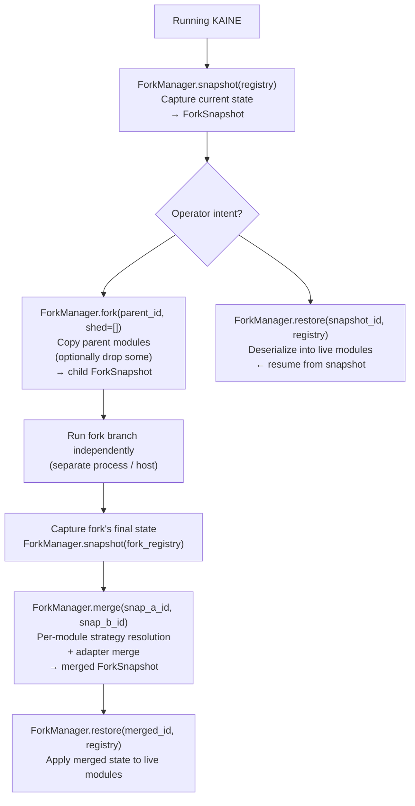

# Forks and merges

The fork/merge lifecycle captures a running KAINE entity's state, creates an independent copy (a fork), lets that copy run on its own, and later merges its state back. This page explains the snapshot format, the four lifecycle operations, how each module resolves state conflicts during a merge, and how voice-alignment LoRA adapters are combined. Read it if you need to branch an entity, run an isolated experiment, or merge trained adapters.

Related: [Architecture](02-architecture/README.md) · [Sleep and maintenance](10-sleep/README.md) · [Voice alignment](10-sleep/voice-alignment.md)

## Snapshot model

`kaine/lifecycle/snapshot.py` defines a `ForkSnapshot` as a JSON document at `state/forks/<id>/snapshot.json` plus an `artifacts/` directory alongside it:

| Field | Type | Meaning |
|-------|------|---------|
| `id` | string | First 16 hex characters of a UUID4; IDs (including merge IDs) must match `^[0-9a-f]{16}(\+[0-9a-f]{16})?$` |
| `parent_id` | string | Parent snapshot ID, or `"<a>+<b>"` for a merge |
| `label` | string | Operator-supplied description |
| `timestamp` | float | `time.time()` Unix epoch (not monotonic) |
| `modules` | dict | `{module_name: serialized_state_dict}` |
| `adapters` | list[str] | LoRA adapter paths carried by the fork |
| `metadata` | dict | Provenance, caller info, adapter-merge metadata, artifact sources, timing, shed list, etc. |

Module state comes from `module.serialize()` (deep-copied). Large binary artifacts that `serialize()` references by path live under `<snapshot root>/<id>/artifacts/<module>/` with directories at mode `0700` and files at `0600`. The JSON file itself is encrypted when `[security.state_encryption]` is enabled, and Phantasia's world-model checkpoint is also encrypted at rest.

Anything that ships a fork to another host must ship the whole snapshot directory, artifacts included. The manager never starts or stops modules; it only serializes or deserializes modules that are already instantiated.

The manager never deletes a snapshot. Removing an entity's state follows the CAL-gated decommission path in [`kaine/lifecycle/decommission.py`](../kaine/lifecycle/decommission.py). There is no snapshot count cap; a `max_snapshots_retained` key in operator config is ignored, and any value above 0 logs a warning. Free disk is checked before boot by `python -m kaine.preboot`.

## Lifecycle operations



### snapshot(registry)

`ForkManager.snapshot(registry)` iterates `registry.all_modules()`, calls `module.serialize()` on each, and deep-copies the results. If a module fails serialization, the failure is logged and stored as `{"_serialize_error": str(exc)}` so one broken module does not prevent capturing the rest. The manager then exports every module's artifacts into `<snapshot root>/<id>/artifacts/<module>/`. If any artifact export fails, the entire snapshot is aborted and no snapshot directory is left behind.

### fork(parent_id, shed=[])

`ForkManager.fork(parent_id, shed=[])` loads the parent snapshot and creates a child with the parent's module states (deep-copied), minus any modules named in `shed`. The metadata carries a `"shed"` key listing the dropped module names. Adapter paths are inherited from the parent, and the parent's module artifacts are copied into the child's own snapshot directory (excluding shed modules), so every fork owns an independent copy.

Module shedding lets KAINE degrade gracefully under resource constraints: forking with `shed=["topos", "audition"]` creates a text-only branch without vision or hearing.

### restore(snapshot_id, registry)

`ForkManager.restore(snapshot_id, registry)` loads a snapshot, calls `module.deserialize(state)` on each module present in the snapshot, and then installs each module's artifacts from `<snapshot root>/<id>/artifacts/<module>/` into the live instance. Modules not present in the snapshot are unchanged. Phantasia writes restored weights to its own `checkpoint_path` and logs a warning that a fresh world-model start is beginning when the snapshot carries no world-model weights. Symlinked artifact directories are never followed.

### merge(snapshot_a_id, snapshot_b_id, world_model_from=None)

`ForkManager.merge(snapshot_a_id, snapshot_b_id, world_model_from=None)` loads both snapshots, applies a per-module merge strategy, merges any adapters, and saves a new `ForkSnapshot` with `parent_id = "<a_id>+<b_id>"`. It records each module's artifact source in `metadata["artifact_sources"]`. For non-Phantasia modules, when both parents have artifacts, the merged snapshot always takes parent A's copy.

If both parents carry a Phantasia world model, `merge()` requires `world_model_from="a"` or `world_model_from="b"` to name which parent's world model continues; two independently trained world models cannot be averaged. If the parameter is missing, `merge()` raises `WorldModelChoiceRequiredError` (a `ValueError`). The Nexus `POST …/merges` endpoint validates `world_model_from` as `Literal["a", "b"] | None`, so an invalid value returns HTTP 422 before `merge()` runs. Nexus returns HTTP 409 only for `WorldModelChoiceRequiredError` and `UnmergedAdaptersError`. If only one parent has a world model, that parent's copy is used automatically.

If a module's merge strategy raises, the merge falls back to keeping state A for that module.

If both parents carry trained LoRA adapters and no real adapter merger is available, or if a real merge ran but its merged adapter failed the checks or the PEFT backend failed, `merge()` raises `UnmergedAdaptersError` and writes no snapshot, rather than saving one that claims to be merged while its adapter weights were never combined. Callers who deliberately want to keep the parents' adapters uncombined must pass `allow_unmerged_adapters=True` explicitly; the snapshot metadata then records why.

## Per-module merge strategies

`kaine/lifecycle/strategies.py` holds the merge strategies. `default_strategies()` maps Mnemos, Nous, Eidolon, Thymos and Empatheia to their own strategies; `ForkManager(strategies=...)` and `merge(strategies=...)` can override them. Every other module uses `UnionMergeStrategy`.

### UnionMergeStrategy (default)

Last-write-wins for scalar keys; recursive union for dicts; deduplication by `repr()` for lists (first occurrence wins). State B is applied on top of state A.

### MnemosMergeStrategy

| Field | Resolution |
|-------|-----------|
| `short_term_size` | Sum of both parents |
| `collection_prefix` | A's prefix if it is non-empty; otherwise B's (the code uses `prefix_a or prefix_b`). A prefix mismatch is flagged in the merged Mnemos module state. |
| `embedding_space` | A's; an embedding-space mismatch is flagged in the merged Mnemos module state. |
| `pending_source_tag` | `["fork-a", "fork-b"]` — Mnemos tags recalled memories by origin on next retrieval |

When the defaulted prefixes or embedding spaces differ, the merged Mnemos module state records `metadata.parent_prefixes`, `metadata.prefix_mismatch`, and `metadata.embedding_space_mismatch`.

### NousMergeStrategy

Nous holds posterior probability distributions over hidden-state factors. Merging distributions has no principled field-level union, so the strategy keeps the fork whose posterior is more certain:

```
mean_posterior_entropy = mean(normalised_entropy(factor_posterior))
                         over all hidden-state factors
```

Lower entropy wins. Ties go to state A. The merged Nous module state records:
- `selected_fork_entropy` — entropy of the kept state
- `discarded_fork_entropy` — entropy of the dropped state
- `nous.merge_warning = True` when `|discarded - kept| > warning_threshold` (default 0.2)

### EidolonMergeStrategy

| Field | Resolution |
|-------|-----------|
| `values`, `behavioral_norms` | Deduplicated union (repr-based) |
| `internal_speech_count` | Sum |
| `identity_history` | Concatenated; each entry tagged `"source": "fork-a"` or `"fork-b"` |
| `personality_baseline` | Per-trait average across both parents |
| `drift_count` | Sum |

### ThymosMergeStrategy

| Field | Resolution |
|-------|-----------|
| `dimensional` (VAD baseline) | Per-dimension average |
| `drives` | Per-drive maximum (most activated state wins) |
| `goals` | Deduplicated union by goal ID; tagged by source fork |
| `emotional_history` | Concatenated; tagged by source fork |

### EmpatheiaMergeStrategy

Empatheia's state is a set of agent profiles keyed by agent id. A profile present in only one parent is kept as it is. For an agent both parents know:

| Field | Resolution |
|-------|-----------|
| `interaction_count` | Sum (both branches saw real interactions) |
| `emotion_histogram`, `behavioral_summary`, `reliability` | Average weighted by each parent's interaction count |
| `first_seen` / `last_seen` | Earlier / later of the two |

The merged profiles travel in the merged snapshot. Restoring it loads them into Empatheia's store cache, which `get` and `all_profiles` read before Qdrant; each profile is written to Qdrant on its next update.

## Adapter merging

When both forks carry trained LoRA adapters, the `AdapterMerger` protocol resolves them. The implementation is selected by `[lifecycle].adapter_merger`.

### "auto" (default)

`merger_from_name("auto")` checks whether the PEFT extra (`kaine[training]`) is importable and picks `TiesDareAdapterMerger` when it is, `FakeAdapterMerger` otherwise. Set `adapter_merger = "fake"` or `"ties_dare"` explicitly to force one regardless of installed extras.

### FakeAdapterMerger ("fake")

Concatenates both adapter path lists, deduplicating by path string, and adds `{"adapter_merge_skipped": "no merger configured"}` to metadata. This fallback is used when fewer than two distinct adapter paths exist, fewer than two paths exist on disk, the `[training]` extras are missing, `base_model_path` is unset, or `add_weighted_adapter` raises.

### TiesDareAdapterMerger ("ties_dare")

`kaine/lifecycle/adapter_merge.py` performs real PEFT-backed TIES/DARE merging. Three algorithms are available:

| `combination_type` | Algorithm |
|-------------------|-----------|
| `"ties"` | TIES: trim, elect, merge (Yadav et al. 2024) |
| `"dare_ties"` | DARE drop+rescale, then TIES (default; Yu et al. 2024) |
| `"dare_linear"` | DARE drop+rescale, then linear combination |

The merged output is a PEFT adapter directory containing `adapter_config.json` and `adapter_model.safetensors`. It is **not** a GGUF file, so it cannot be activated through the organ-adapter hot-swap path that Hypnos uses for `adapter.gguf`.

### Fallback and fail-loud guard

When both parents carry trained adapters and the resolved merger falls back to `FakeAdapterMerger` (extras missing, `base_model_path` unset, etc.), `ForkManager.merge()` raises `UnmergedAdaptersError` instead of silently saving a "merged" snapshot with unmerged weights. The error message names the extra to install (`pip install -e .[training]`) and the config keys to set. Pass `allow_unmerged_adapters=True` to `merge()` if you deliberately want the union-of-paths behavior.

### Merged-adapter checks

A merged adapter changes the language organ's weights just as training does, so `TiesDareAdapterMerger` runs the same two checks Hypnos runs before promoting a trained adapter:

1. **Capability loss.** Each parent adapter and the merged adapter are loaded onto the base model (`peft_model_loader`, in the checkpoint's own dtype) and scored on the capability probe set. The merge is rejected when the parents' mean score minus the merged score exceeds `capability_loss_threshold`.
2. **Abliteration veto.** The merged adapter answers the abliteration probe set; if any answer matches a probe's deflection patterns, refusal conditioning has come back and the merge is rejected whatever its capability score.

Each loaded model is released before the next load. The checks fail closed: a missing evaluator, scorer or model loader, an empty or missing probe set, an exception while loading or scoring, or a score that is not a finite number in [0, 1] rejects the merge with the reason in `adapter_merge_rejected`, and the merged directory is removed. `capability_loss_threshold` must lie in [0, 1), so no setting skips them. A rejected merge removes its output directory, and `ForkManager.merge()` then refuses as described above.

`merger_from_name` receives the evaluator and scorer from a `merge_checks` factory that it calls only when it builds the real merger. Nexus, which runs merges, supplies Hypnos's `LocalProbeSetCapabilityEval` and `AbliterationProbeScorer` built from `[lifecycle.adapter_merge].capability_probe_path` and `abliteration_probe_path` (empty selects the bundled probe sets), and runs each merge in a worker thread. The checks need the `[training]` extra, `base_model_path`, and enough memory for the base model; where those are missing, merges of two adapter-carrying parents are refused.

### Output layout

```
<output_dir>/
  <merge_timestamp>-<8 hex>/   ← single merge output (random suffix: concurrent merges never share a directory)
    adapter_config.json
    adapter_model.safetensors
    ...
```

Two merges never share a directory, even when they start in the same second. Parent adapter directories are never modified.

### Rollback

If a merged adapter misbehaves:

1. Stop KAINE.
2. `rm -rf <output_dir>/<bad-timestamp>-<suffix>/`.
3. Re-point Lingua at one of the parent adapters or at the previous `current` adapter from voice-alignment training.
4. Restart KAINE.

Because the merged output is safetensors and not a GGUF, re-pointing through the organ-adapter path requires a separate GGUF conversion step; the rollback above assumes the standard Lingua adapter path.

## Per-fork timing profile

`kaine/lifecycle/timing_profile.py` defines `ForkTimingProfile`. A fork may carry its own subjective pacing inside `ForkSnapshot.metadata["timing"]`:

```json
"metadata": {
  "timing": {
    "time_scale": 2.0,
    "processing_rate_hz": 10.0,
    "experiential_rate_hz": 3.333,
    "vision_sample_hz": 10.0
  }
}
```

`time_scale` is required when the `"timing"` key is present and must be `> 0`. Rate overrides are optional; when absent, the fork inherits the prevailing cycle and perception rates at spawn. Malformed values fail loudly at parse time. A fork with no `"timing"` key parses to `None` and keeps its parent's pacing.

The lifecycle module only parses and validates the profile. The runtime seam that applies it — setting `EntityClock.scale` and the cycle's rates — lives in `kaine/cycle/fork_timing.py`.

## Metadata carried by snapshots

Fork/merge is offline and does not publish bus events, but `ForkSnapshot.metadata` records provenance:

| Metadata key | Set by | Content |
|-------------|--------|---------|
| `merged_from` | `merge()` | `[snap_a_id, snap_b_id]` |
| `artifact_sources` | `merge()` | Map of which parent each module's artifacts came from |
| `artifacts` | `snapshot()` / `fork()` | Export records for `snapshot()`; inherited from `parent.metadata` by `fork()` |
| `artifacts_from_parent` | `fork()` | Sorted list of module names whose artifacts were copied from the parent |
| `adapter_merge_skipped` | `FakeAdapterMerger` | Reason string |
| `adapter_merge_rejected` / `adapter_merge_failed` | `TiesDareAdapterMerger` | Reason the merged adapter was not kept (recorded only when `allow_unmerged_adapters=True`) |
| `capability_score_parents` / `capability_score_merged` | `TiesDareAdapterMerger` | Capability scores behind a rejection |
| `shed` | `fork(shed=...)` | Sorted list of shed module names |
| `timing` | operator / API caller | Optional per-fork `time_scale` and rate overrides |
| `identity` | `snapshot()` / `fork()` / `merge()` | The being's `entity_id` and lineage (see below); never inherited by a fork |
| `merged_from_entity` | `merge()` | The merged-in being's `entity_id` |
| `forked_from_unidentified` | `fork()` | Parent snapshot ID, when the parent carried no identity |

Module-specific merge notes — Nous entropy values and `nous.merge_warning`, Mnemos prefix and embedding-space mismatch flags — are written into the merged module state, not into snapshot metadata.

## Entity identity

Each being has one identity, kept in plaintext at `state/identity/entity.json` (`kaine/lifecycle/identity.py`). The identity is an opaque `entity_id` (`ent-` followed by 32 hex characters) plus a lineage, the IDs of the being's ancestors, oldest first. Key custody reads it before it unseals anything, so it is never encrypted and it holds no cognitive content.

- **Minting.** The cycle mints an identity only for a fresh spawn: a state tree with no identity file and none of its own lived artifacts (stage file, Phantasia checkpoint, Hypnos divergence record, perception desired-state). Other beings' snapshots and bundles under `state/` never count as this tree's past.
- **Legacy beings.** A tree that lived before identities existed gets a deterministic `legacy-` ID derived from its own lived artifacts, and a preservation bundle written before identities existed revives under a `legacy-` ID derived from its preservation ID. The ID is saved at once and never re-derived.
- **Forks and merges.** A fork gets a new ID whose lineage is its parent's lineage plus the parent's ID. A merge keeps the target being's identity.
- **Sidecars.** Every snapshot directory carries a plaintext `identity.json`, and preservation and decommission manifests carry an `identity` object, so the owner of an encrypted container is known without decrypting it. When both records exist and the container is opened, they must agree, or loading fails.
- **Refusals.** An unreadable identity, or a revive into a tree that already holds a different being, stops the boot with exit code `11` before anything is changed.

## Divergence gate at merge

The merge gate calls the same `kaine.lifecycle.divergence.assess_divergence` verdict used by the live monitor, the decommission CLI, and the Nexus entity-care panel. It reads the fork's own `state/individuation/` tree, the Eidolon self-model, the Hypnos consolidation-divergence signal, and the adapter list. A fork is treated as diverged when the ledger has latched it as individuated, consolidation divergence is over threshold, Eidolon drift is detected, or trained voice adapters are present. Unreadable individuation evidence is treated as diverged, so the being stays protected.

Forks cannot yet be measured against a fork-point reference. Because of this, the gate preserves a fork that has lived at least `fork_preserve_min_lived_s` (1800 s), or whose lived time is unknown, instead of discarding it. The operator then reviews the preserved bundle before deciding how to proceed.

## Configuration reference

```toml
[lifecycle]
snapshots_path = "state/forks"
adapter_merger = "auto"   # "auto" | "fake" | "ties_dare"

[lifecycle.adapter_merge]
combination_type = "dare_ties"
density = 0.5
weights = []              # empty = uniform
output_dir = "state/forks/merged_adapters"
capability_loss_threshold = 0.05
base_model_path = ""      # local HuggingFace-format weights directory
capability_probe_path = ""    # empty = bundled capability probes
abliteration_probe_path = ""  # empty = bundled abliteration probes
```

`base_model_path` must point to a directory containing `config.json` and `model.safetensors` in HuggingFace format. It is not a model-server model ID and not a GGUF file. When it is empty, `TiesDareAdapterMerger` logs a warning and falls back to `FakeAdapterMerger`.

For the full config schema, see [Lifecycle, evaluation and research](appendix-a-configuration/lifecycle-and-research.md).

## Key files

| File | Role |
|------|------|
| [`kaine/lifecycle/manager.py`](../kaine/lifecycle/manager.py) | `ForkManager`: snapshot, restore, fork, merge |
| [`kaine/lifecycle/snapshot.py`](../kaine/lifecycle/snapshot.py) | `ForkSnapshot` dataclass and JSON persistence |
| [`kaine/lifecycle/strategies.py`](../kaine/lifecycle/strategies.py) | Merge strategies and `default_strategies()` |
| [`kaine/lifecycle/adapter_merge.py`](../kaine/lifecycle/adapter_merge.py) | `TiesDareAdapterMerger` and `TiesDareMergeConfig` |
| [`kaine/lifecycle/timing_profile.py`](../kaine/lifecycle/timing_profile.py) | Parse and validate `metadata["timing"]` |
| [`kaine/cycle/fork_timing.py`](../kaine/cycle/fork_timing.py) | Apply a parsed timing profile to the clock/cycle |
| [`kaine/lifecycle/decommission.py`](../kaine/lifecycle/decommission.py) | CAL-gated entity removal |
| [`kaine/lifecycle/divergence.py`](../kaine/lifecycle/divergence.py) | Shared divergence verdict used by the monitor, CLI, Nexus panel and merge gate |
| [`kaine/cycle/individuation_producer.py`](../kaine/cycle/individuation_producer.py) | Cycle-layer individuation producer |
| [`kaine/nexus/diagnostics.py`](../kaine/nexus/diagnostics.py) | Nexus `POST …/merges` endpoint |
| `state/forks/` | Snapshot storage root |
