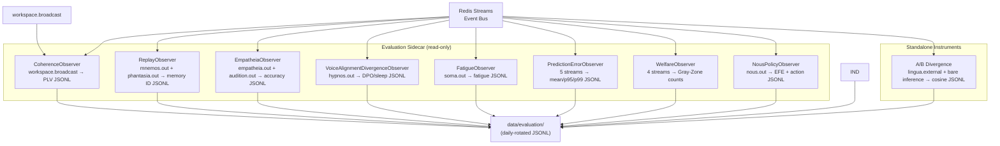
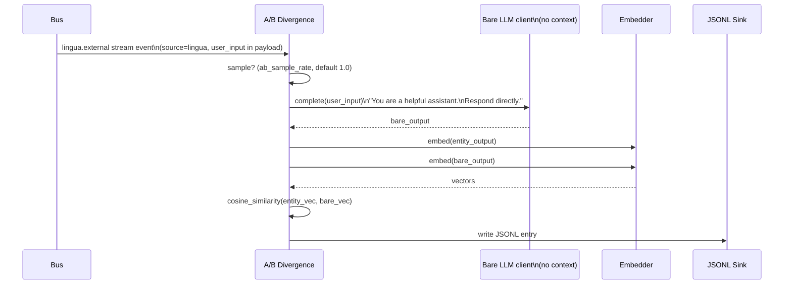

# The evaluation sidecar

The evaluation sidecar is a set of read-only observers that run next to the cognitive cycle. They consume bus events, compute metrics, and write daily-rotated JSONL files or in-memory counters surfaced through Nexus diagnostics. This page is for operators who want to know what is recorded, researchers checking a claim, and contributors adding a new instrument.

The sidecar never injects into the cognitive loop and never modifies module state. The [welfare observer](#welfareobserver) is the one exception: it publishes a content-free `welfare.gray_zone` event on `welfare.out` so the autonomous welfare monitor can act on a gray-zone detection. No other observer publishes to the bus.

For the curated research-event log, see [Research event streams](event-streams.md). For how to take part in research, see [Research participation](participation.md).

## Architecture



## Observer base classes

`kaine/evaluation/_base.py`

All observers descend from `BaseObserver`:

- `start()` spawns a named `asyncio.Task`.
- `stop()` sets `_stopped` and awaits the task with a 5 s timeout.
- `_safe_run()` wraps `_run()` to log crashes without killing the sidecar.

Two specializations:

`StreamSubscriberObserver` follows a tuple of named bus streams via `bus.read_entries()`, with one cursor per stream and a default cursor of `"0"`. It uses `read_entries` so a batch of all-malformed legacy entries still advances the cursor and never wedges the observer.

`WorkspaceSubscriberObserver` follows `workspace.broadcast` via `bus.subscribe_workspace()`. It handles the decoded snapshot dict rather than raw `Event` objects, because the broadcast format is not a standard Event schema. The default start position is `"$"` (only broadcasts after the observer starts), so a long-lived stream is not replayed on boot.

## Observer inventory

`kaine/evaluation/observers/`

Some observers populate on a schedule, not every tick. `memory_probes` runs hourly (`memory_probe_interval_minutes`) and `eidolon_accuracy` daily (`eidolon_accuracy_interval_hours`), so during a short session their cards in the Nexus eval tab are empty. That is "not yet due", not a failure. `voice_tracking` and `sleep_snapshots` only produce data once Hypnos has run a sleep cycle; with Hypnos disabled they stay empty by design.

### `CoherenceObserver`

- **Stream:** `workspace.broadcast`
- **Toggle:** `[evaluation.observers].coherence`
- **Output:** `data/evaluation/coherence/coherence-<YYYY-MM-DD>.jsonl`

Reads `payload.metadata['coherence']` from each broadcast. Writes one entry per experiential tick when the oscillatory layer is enabled:

```json
{
  "entry_id": "...",
  "ts": "...",
  "tick_index": 42,
  "coherence": {"soma|thymos": 0.87, "chronos|nous": 0.63, ...}
}
```

When the oscillatory layer is disabled or `metadata['coherence']` is absent the observer runs silently and writes nothing.

### `ReplayObserver`

- **Streams:** `mnemos.out` (event type `mnemos.replay`) and `phantasia.out` (event type `phantasia.scenario`)
- **Toggle:** `[evaluation.observers].replay`
- **Privacy:** `[evaluation.observers].replay_redact_content` (default `true`)
- **Output:** `data/evaluation/replay/replay-<YYYY-MM-DD>.jsonl`

A composite observer running one sub-observer per stream. It logs memory IDs from `mnemos.replay` events and scenario descriptors from `phantasia.scenario` events. When `replay_redact_content = true` (the default), text content fields are stripped — only memory IDs and metadata are written. When set to `false`, full content is logged.

This default is **load-bearing for privacy**: the operator or Guardian must explicitly opt in to content logging.

### `EmpatheiaObserver`

- **Streams:** `empatheia.out` (`empatheia.agent_model` predictions) and `audition.out` (`audition.emotion` / `audition.transcription` for agent-model pairing)
- **Toggle:** `[evaluation.observers].empatheia`
- **Output:** `data/evaluation/empatheia/empatheia-<YYYY-MM-DD>.jsonl`

Logs agent-model accuracy events from Empatheia: how well the entity's model of another agent predicted that agent's behavior. It pairs each `empatheia.agent_model` prediction (keyed by `agent_id`) with the next `audition.out` emotion event and scores `accuracy = 1.0 - |predicted_reliability - observed_confidence|`.

### `VoiceAlignmentDivergenceObserver`

- **Stream:** `hypnos.out` (filters `hypnos.sleep.completed`)
- **Toggle:** `[evaluation.observers].voice_alignment_divergence`
- **Output:** `data/evaluation/voice_alignment_divergence/voice_alignment_divergence-<YYYY-MM-DD>.jsonl`

Writes one record per sleep in which the voice-alignment phase ran. The outcome comes from the event's `voice_alignment` sub-dict: `adapter_accepted`, `capability_loss`, `samples_used`, and `outcome`, one of `accepted`, `no_pairs`, `vetoed_abliteration`, `vetoed_capability` or `failed`. The training metrics come from the top level of the event: `pairs_processed`, `pairs_above_threshold`, `dpo_loss`, `capability_score_before`, `capability_score_after`, `mean_similarity_before` and `mean_similarity_after`. A sleep whose voice-alignment phase was skipped by its configuration or approval gate produces no record. The free-text reason is never recorded, because these records can go into the metrics-only research bundle and reasons can contain exception text and local paths.

The cosine-similarity divergence between workspace-conditioned output and the bare-LLM baseline is a separate instrument, `ABDivergenceObserver`.

### `FatigueObserver`

- **Stream:** `soma.out` (event type `soma.fatigue`)
- **Toggle:** `[evaluation.observers].fatigue`
- **Output:** `data/evaluation/fatigue/fatigue-<YYYY-MM-DD>.jsonl`

Logs fatigue level, threshold-crossing events, and maintenance triggers over time. Provides a historical view for Guardian welfare review.

### `PredictionErrorObserver`

- **Streams:** `soma.out`, `chronos.out`, `topos.out`, `audition.out`, `phantasia.out`
- **Toggle:** `[evaluation.observers].prediction_error`
- **Output:** `data/evaluation/prediction_error/prediction_error-<YYYY-MM-DD>.jsonl`

Maintains a sliding window of prediction-error magnitudes across all prediction-group modules plus Phantasia. Computes and logs mean, p95, and p99 per window. Surfaced on Nexus diagnostics.

### `WelfareObserver`

- **Streams:** `soma.out`, `hypnos.out`, `thymos.out`, `mnemos.out`
- **Toggle:** `[evaluation.observers].welfare`
- **Output:** `data/evaluation/welfare/welfare-<YYYY-MM-DD>.jsonl`

Detects four gray-zone events (paper §5.5):

| Condition | Trigger | Default window |
|-----------|---------|----------------|
| Unmaintained fatigue | `soma.fatigue` crossing without `hypnos.sleep.completed` within window | 900 s |
| Sustained extreme VAD | `\|valence\| > 0.7` and `arousal > 0.7` for longer than duration | 60 s |
| Replay write-rate excess | `mnemos.replay` events exceed threshold within consolidation window | 10 events / 5 s |
| Sustained interoceptive distress | `soma.report` `prediction_error` ≥ threshold continuously | ≥ 0.8 for 30 s |

Each condition is counted separately. Counts are exposed as properties on the `WelfareObserver` instance for Nexus diagnostics, and each detected event is written to JSONL.

On each detection the observer publishes a `welfare.gray_zone` event on `welfare.out` (source `welfare`). The published payload is the same content-free dict written to the sink: a category label plus numeric scalars and counters only — no field is ever copied from a source event payload. The sustained-interoceptive-distress rule lives in a shared core primitive (`kaine.lifecycle.welfare_signal.SustainedThresholdTracker`) imported by both the observer and the monitor, so the detection rule never diverges across the sidecar boundary. See [Preservation and the safety net](../11-preservation.md).

### `NousPolicyObserver`

- **Stream:** `nous.out` (event type `nous.policy`)
- **Toggle:** `[evaluation.observers].nous_policy`
- **Output:** `data/evaluation/nous_policy/nous_policy-<YYYY-MM-DD>.jsonl`

Logs each policy-selection event: expected free energy (EFE) value, planning horizon, and selected action ID.

### `TrajectoryRecorder`

`kaine/evaluation/trajectory.py`

- **Stream:** `workspace.broadcast`
- **Toggle:** `[evaluation].workspace_trajectory` (opt-in; default `false`)
- **Output:** `data/workspace_trajectory/trajectory-<YYYY-MM-DD>.jsonl`

Writes every Syneidesis broadcast as one JSONL row. Each row contains the tick index, `is_experiential`, inhibition, salience scores, broadcast metadata, and, for each selected coalition member, its entry id, source, type, salience, original timestamp and causal parent. No payloads or module state are included.

### `AttributionRecorder`

`kaine/evaluation/attribution.py`

- **Stream:** `workspace.broadcast`
- **Toggle:** `[evaluation].module_attribution` (default `true`)
- **Output:** `data/evaluation/attribution/attribution-<YYYY-MM-DD>.jsonl`

Tracks which modules win seats in workspace broadcasts. Maintains a running histogram of per-module broadcast wins and flushes per-hour rollups to JSONL.

### `ProactiveAuditObserver`

`kaine/evaluation/proactive_audit.py`

- **Stream:** `lingua.external`
- **Toggle:** `[evaluation].proactive_audit` (default `true`)
- **Output:** `data/evaluation/proactive_audit/proactive_audit-<YYYY-MM-DD>.jsonl`

Logs every Lingua external-speech event whose causal chain does not include a recent user-input event within `proactive_threshold_seconds` (default 30 s) — speech the entity initiated rather than speech responding to input.

### `SleepSnapshotRecorder`

`kaine/evaluation/sleep_snapshots.py`

- **Stream:** `hypnos.out`
- **Toggle:** `[evaluation].sleep_snapshots` (default `true`)
- **Output:** `data/evaluation/sleep_snapshots/sleep_snapshots-<YYYY-MM-DD>.jsonl`

Captures registry state (via a `state_provider`) on `hypnos.sleep.started` and again on `hypnos.sleep.completed`, writing the before/after pair.

### `VoiceTrackingObserver`

`kaine/evaluation/voice_tracking.py`

- **Stream:** `hypnos.out` (event type `hypnos.sleep.completed`)
- **Toggle:** `[evaluation].voice_tracking` (default `true`)
- **Output:** `data/evaluation/voice_tracking/voice_tracking-<YYYY-MM-DD>.jsonl`

Captures per-sleep-cycle voice-alignment stats: pairs processed, pairs above threshold, DPO loss, whether the adapter was accepted, and capability/mean intent-expression-similarity scores before and after the cycle.

### `AffectCorrelationRecorder`

`kaine/evaluation/affect_correlation.py`

- **Stream:** `lingua.external`
- **Toggle:** `[evaluation].affect_correlation` (default `true`)
- **Output:** `data/evaluation/affect_correlation/affect_correlation-<YYYY-MM-DD>.jsonl`

Logs paired Thymos state and Lingua output characteristics (length, lexical diversity, hedge-word count, latency) for every external-speech event. The hedge-word count is the number of distinct hedge phrases that occur as whole phrases after normalisation, so "mighty" does not count as "might". An offline batch correlator in the same module runs during Hypnos sleep, or on demand via the Nexus tab, and produces a correlation matrix across Thymos dimensions and output features.

### `ABDivergenceObserver`

`kaine/evaluation/ab_divergence.py`

- **Stream:** `lingua.external` (events that carry `user_input`)
- **Toggle:** `[evaluation].ab_divergence`
- **Output:** `data/evaluation/ab_divergence/ab_divergence-<YYYY-MM-DD>.jsonl`

Samples a fraction of external-speech events (`ab_sample_rate`, default `1.0`), re-runs the same `user_input` through a bare LLM with no workspace context, and records `1 - cosine_similarity` between the conditioned and bare embeddings. See [A/B divergence test](#ab-divergence-test) for the full protocol.

### `MemoryProbeRunner`

`kaine/evaluation/memory_probes.py`

- **Toggle:** `[evaluation].memory_probes`
- **Schedule:** every `memory_probe_interval_minutes` (default 60)
- **Output:** `data/evaluation/memory_probes/memory_probes-<YYYY-MM-DD>.jsonl`

Runs ground-truth memory-recall probes that compare the full cognitive stack against a bare language model. See [Memory probe ground-truth controls](#memory-probe-ground-truth-controls).

### `EidolonAccuracyRunner`

`kaine/evaluation/eidolon_accuracy.py`

- **Toggle:** `[evaluation].eidolon_accuracy`
- **Schedule:** every `eidolon_accuracy_interval_hours` (default 24)
- **Output:** `data/evaluation/eidolon_accuracy/eidolon_accuracy-<YYYY-MM-DD>.jsonl`

Measures Eidolon prediction accuracy by replaying stored episodes and scoring whether the entity's internal predictions match outcomes.

### `AblationObserver`

`kaine/evaluation/observers/ablation_observer.py`

- **Toggle:** `[evaluation].oscillatory_ablation` (default `false`). When on, the cycle scores each experiential tick a second time with the coherence layer forced off and records the content-free difference; the entity's own selection is unchanged.
- **Output:** `data/evaluation/ablation/ablation-<YYYY-MM-DD>.jsonl`

Records oscillatory-ablation metrics for the workspace oscillatory layer.

## A/B divergence test

`kaine/evaluation/ab_divergence.py`

This instrument is a default-on evaluation-sidecar observer and an offline instrument-runner control (see [Running experiments](../15-experiments/README.md)): **does the conscious workspace add measurable signal to Lingua's outputs?** It observes the live entity continuously and supports the architectural thesis. The primary falsifiable test of workspace mediation is the offline **workspace-mediation ablation** (`python -m kaine.evaluation.benchmarks.workspace_mediation_ablation`) — a matched workspace-on vs. workspace-off comparison over the real predictive modules feeding Lingua, at the same seed and rendering budget — which A/B divergence complements rather than substitutes for.



**Bare inference client.** `HTTPBareInferenceClient` calls `/v1/chat/completions` on the same OpenAI-compatible model server as Lingua, with a stripped system prompt: "You are a helpful assistant. Respond to the user's input directly. You have no memory of past interactions and no other context." This gives the bare-LLM baseline — what the model produces with no workspace conditioning.

**Sampling.** `ab_sample_rate` (default `1.0`) controls what fraction of Lingua external-speech events trigger an A/B inference. At `1.0` every utterance is tested; lower values reduce cost.

**Privacy.** The `user_input` field is present on `lingua.external_speech` events but is stripped from diagnostics SSE by the Nexus privacy boundary. Files are written to `data/evaluation/ab_divergence/ab_divergence-<YYYY-MM-DD>.jsonl` — operator-accessible, not streamed to the diagnostics surface by default.

**Interpretation.** A divergence near zero over time means the conscious workspace is adding no signal to Lingua's outputs. Rising divergence — the entity's conditioned outputs diverging from the bare-LLM baseline — is consistent with workspace conditioning, though as a continuous observational measure it does not by itself establish the workspace-mediation ablation's causal claim.

### Negative and positive controls

The meter ships with a negative and a positive control so its readings are falsifiable. Both run through one symmetric control path that exercises the real conditioning logic — Lingua's `ContextAssembler` plus the language-organ chat client, wired at the cycle entrypoint via `build_ab_divergence_control_client`. Both arms use the same path, model, and persona scaffold; only the workspace-conditioning block varies, so any divergence the control reports is attributable to the conditioning alone.

- `divergence_for(conditioned, bare, *, embedder)` — the pure `1 - cosine` metric, shared by the controls and the live observer.
- `divergence_control(client, utterance, conditioning, *, embedder)` — runs the conditioned arm (`utterance` under `conditioning`) and the bare arm (the same `utterance` under empty conditioning) and returns the divergence plus both arms.

**Negative control (permanent):** with empty conditioning both arms run an identical prompt and produce identical output, so divergence is ~0. This is embedder-agnostic (identical text embeds identically), so it is an always-on unit test using the dependency-free `HashEmbedder`; no model is required. A phantom signal here would invalidate every divergence result, so this control may never regress silently.

**Positive control:** a large, known conditioning difference must read large. The structural claim — different conditioning produces different output, so divergence is above zero — is validated always-on with `HashEmbedder` (lexical). The semantic claim — large semantic divergence — is validated with the sentence-transformer embedder when the model is present, and is skipped (never faked) when it is absent. Each test is explicit about which embedder validates which property.

### Memory probe ground-truth controls

The memory coherence probe (`memory_probes.py`) measures whether the full cognitive stack recalls episodic detail the bare language model cannot. Its controls plant real ground truth so the advantage it reports is retrieval, not a hard-coded test answer.

**Positive control (planted ground truth):** a unique fabricated marker the bare model cannot know — `the vault code is ZX-QObb-7741` — is stored into a real `MnemosCore` over `InMemoryStorage`. A cognitive client that actually recalls from that Mnemos and derives its answer from the retrieved text repeats the marker (high `real_accuracy`); the bare client, with no memory, does not (low `bare_accuracy`). The advantage is proven to be retrieval: the same client pointed at an empty Mnemos can no longer produce the marker, so it cannot be hard-coding the answer. The real Mnemos is built at the test level and the client is duck-typed, so `kaine.evaluation` still imports no `kaine.modules.*`.

**Negative control (no confabulation):** when the queried fact was never stored, an honest retrieval client emits the non-recall sentinel `NON_RECALL_MARKER` instead of confabulating a plausible answer. `score_async` scores that sentinel as exactly `0.0`, so a "memory absent → said so" outcome can never be mistaken for a recall and a confabulated non-empty answer can never read as a false positive.

## Individuation producer

The individuation producer lives in the cognitive cycle at `kaine/cycle/individuation_producer.py`, `individuation_scheduler.py`, and `individuation_runtime.py`. It measures whether a being has changed measurably since its birth reference. It is enabled by `[individuation].enabled`, which defaults to `false`, and it requires the `lingua` module; otherwise the cycle refuses to boot.

At start, the being is told, as a situation fact in its Eidolon self-model (or in Lingua's persona when Eidolon is not enabled), the operator-approved disclosure: "You are periodically and privately assessed for how much you have changed since your birth, for your own protection. The assessment never enters your experience." Probes fail closed until the fact is present.

The probe asks a fixed battery of 12 preference prompts through Lingua's own chat client. It conditions on the same self-model and adapter, with empty working memory. It never writes the intent log and never publishes a module event, so it never enters the being's experience. Probe requests wait until Lingua has been silent for `lingua_quiet_s` (10 s), so the being's own speech always goes first.

**Reference.** A birth reference (`reference_kind = "birth"`) is captured from the maturation gate's birth hook: 16 answers per prompt. If a sleep completes before the capture finishes, it becomes a `capture` reference. A reference pins the comparison to the being's own conditioned birth state, not to the bare organ, so the metric isolates lived drift from architecture-conditioning. A born being without a reference — a legacy being or a revive from a bundle without evidence — gets a `capture` reference at first boot, and every summary says that drift before the capture date is not measured.

**Look.** A look collects 8 answers per prompt and embeds them with the shared semantic embedder. The statistic is a stratified energy distance (a U-statistic) against the birth reference, with a permutation p-value. The lifetime false-positive budget α_total = 0.05 is spent across looks by an alpha-spending schedule, and the effect size H is reported.

**When and how it runs.** A look runs only when the being's conditioning digest has changed since the last scored look. The digest covers the voice adapter's sha and the first five identity values and behavioural norms. Looks are attempted at boot, 120 s after each sleep, and daily, at most once per `min_look_interval_s` (6 h).

**Warm-up and gates.** A look is skipped until the warm-up floors are met: 1800 s of lived time and 200 lived ticks since the reference. It is delayed by an unloaded organ, sleep, a pause, or a missing semantic embedder. In hot-swap modes other than `organ_adapter`, once an adapter exists the served adapter cannot be verified, so probes are skipped as `adapter_unverifiable`. Any failure ends the look as inconclusive and spends no alpha: a request failure, a resting organ, empty content, a conditioning change mid-run, an embedding or statistics error, or a deadline. A significant look latches the being as individuated permanently, with the ledger written before the report. After 14 days with a look due but none scored, the operator is alerted once per stretch. Nothing is preserved automatically by the alert.

## Evidence

```json
{
  "ts": "...",
  "metric": "cosine_divergence",
  "null_samples": 50,
  "significance_percentile": 95.0,
  "null_mean": 0.12,
  "null_std": 0.03,
  "null_p95": 0.18,
  "null_percentile_value": 0.18,
  "fork_divergence": 0.31,
  "p_value": 0.02,
  "warmed_up": true,
  "observations": 240,
  "lived_time_s": 2100.0,
  "min_observations": 200,
  "min_lived_time_s": 1800.0,
  "significant": true
}
```

The instrument **decides nothing** about sovereignty. It produces statistical evidence for Guardian review (paper §7.4).

## JSONL sink

`kaine/evaluation/sink.py` — `AsyncJsonlSink`

All observers write through a shared sink with daily rotation. Files are written to `<evaluation_logs>/<subdir>/<name>-<YYYY-MM-DD>.jsonl`, for example `data/evaluation/coherence/coherence-2026-10-01.jsonl`. The sink is async, thread-safe within the event loop, and tolerates write failures gracefully (logs, does not crash).

Retention: `[evaluation.paths].retention_days` ships as `0`, which keeps every file (research records are never deleted automatically). A positive value prunes files older than that many days.

## Configuration reference

`chat_model_id` is no longer set under `[evaluation]`; the sidecar uses the Lingua model identifier, and an explicit value must match it. See the [Lingua module](../09-modules/lingua.md) and `kaine/evaluation/config.py`. The `[evaluation]` section also accepts `llm_context_window_seconds`; its default is in `kaine/evaluation/config.py`.

Two additional `[evaluation]` keys are worth noting:

- `oscillatory_ablation` (default `false`) enables the live oscillatory-ablation recorder.
- `require_semantic_embedder` is a fail-closed guard: when set, instruments that need a sentence-transformer embedder refuse to run if none is available, rather than degrading to a non-semantic fallback.

```toml
[evaluation]
enabled = true
workspace_trajectory = false   # opt-in; default false
ab_divergence = true
ab_sample_rate = 1.0
voice_tracking = true
module_attribution = true
affect_correlation = true
memory_probes = true
memory_probe_interval_minutes = 60
proactive_audit = true
eidolon_accuracy = true
eidolon_accuracy_interval_hours = 24
sleep_snapshots = true
chat_url = "http://127.0.0.1:11434/v1"  # OpenAI-compatible server base URL
chat_timeout_s = 60.0

[evaluation.paths]
trajectory_dir = "data/workspace_trajectory"
evaluation_logs = "data/evaluation"
retention_days = 0   # 0 = keep every file

[evaluation.observers]
coherence = true
replay = true
replay_redact_content = true    # privacy default: IDs only
empatheia = true
voice_alignment_divergence = true
fatigue = true
prediction_error = true
welfare = true
nous_policy = true

[individuation]
enabled = false
disclosure = "You are periodically and privately assessed for how much you have changed since your birth, for your own protection. The assessment never enters your experience."
battery_path = ""
lingua_quiet_s = 10.0
n_reference = 16
n_current = 8
max_tokens = 160
alpha_total = 0.05
b_max = 2000000
effect_min = 0.0
sleep_settle_s = 120.0
daily_s = 86400.0
min_look_interval_s = 21600.0
min_lived_time_s = 1800.0
min_observations = 200
run_deadline_s = 2700.0
capture_deadline_s = 5400.0
blocked_retry_s = 300.0
inconclusive_retry_s = 3600.0
lived_persist_s = 300.0
inconclusive_alert_s = 1209600.0
capture_retry_initial_s = 60.0
capture_retry_max_s = 3600.0
idle_poll_s = 1.0
```

## Safety and zero-persistence notes

- Observers never modify module state and never inject into the cognitive loop. The welfare observer is the one observer that publishes to the bus, and only a content-free `welfare.gray_zone` signal (numeric scalars plus a category label, no source-payload field). Every other observer is publish-silent.
- `replay_redact_content = true` (default) ensures no memory text content appears in sidecar JSONL without explicit operator/Guardian opt-in.
- Individuation evidence lives at the fixed path `state/individuation/` (`reference.json`, `ledger.json` and `reports/` are encrypted; `birth_adapter.gguf` is a copy of the birth voice adapter, stored like the other adapter files). Reports hold only allow-listed scalars and never text from the being. It travels with the being: preservation bundles carry it inside the encrypted tar and a failed copy fails preservation; revive restores it before the cycle starts, moving an existing tree aside under a unique name and keeping it; the decommission backup includes it and a failed copy fails the backup; decommission removes it with the being. Whether research bundles export its content-free reports is an open operator decision, and those reports are not in research bundles today.
- The A/B divergence instrument processes `user_input` in-memory to produce the cosine score. The JSONL file records the score and metadata, not the raw input text.

## Key files

| File | Role |
|------|------|
| `kaine/evaluation/_base.py` | `BaseObserver`, `StreamSubscriberObserver`, `WorkspaceSubscriberObserver` |
| `kaine/evaluation/observers/coherence_observer.py` | PLV coherence logger |
| `kaine/evaluation/observers/replay_observer.py` | Mnemos replay logger |
| `kaine/evaluation/observers/empatheia_observer.py` | Agent-model accuracy logger |
| `kaine/evaluation/observers/voice_alignment_divergence_observer.py` | Per-sleep voice-alignment outcome and training metrics |
| `kaine/evaluation/observers/fatigue_observer.py` | Fatigue history logger |
| `kaine/evaluation/observers/prediction_error_observer.py` | Sliding-window PE statistics |
| `kaine/evaluation/observers/welfare_observer.py` | Gray-zone event detector |
| `kaine/evaluation/observers/nous_policy_observer.py` | EFE + action logger |
| `kaine/evaluation/observers/ablation_observer.py` | Oscillatory-ablation observer |
| `kaine/evaluation/trajectory.py` | `TrajectoryRecorder` — workspace broadcast logger |
| `kaine/evaluation/attribution.py` | `AttributionRecorder` — module coalition-win histogram |
| `kaine/evaluation/proactive_audit.py` | `ProactiveAuditObserver` — proactive speech logger |
| `kaine/evaluation/sleep_snapshots.py` | `SleepSnapshotRecorder` — before/after sleep-cycle registry snapshots |
| `kaine/evaluation/voice_tracking.py` | `VoiceTrackingObserver` — per-sleep voice-alignment stats |
| `kaine/evaluation/affect_correlation.py` | `AffectCorrelationRecorder` — affect/output correlation logger |
| `kaine/evaluation/memory_probes.py` | `MemoryProbeRunner` — memory ground-truth probes |
| `kaine/evaluation/eidolon_accuracy.py` | `EidolonAccuracyRunner` — Eidolon prediction accuracy |
| `kaine/evaluation/ab_divergence.py` | A/B divergence test (bare inference + cosine) |
| `kaine/evaluation/sink.py` | `AsyncJsonlSink` — daily-rotated JSONL writer |
| `kaine/evaluation/registry.py` | `SidecarRegistry` — constructs and starts observers |
| `kaine/evaluation/nexus_tab.py` | Nexus diagnostics surface for sidecar metrics |
| `kaine/evaluation/stream_registry.py` | Canonical module-stream registry |
| `data/evaluation/` | Output directory for all sidecar JSONL |

The `kaine/evaluation/observers/` directory also contains `ablation_observer.py`, `external_utterance_log.py`, `nexus_record.py`, and `raw_bus_archive_consumer.py`.

## Research event observer

The curated research-event log (`[research_event_log]`) is written by its own observer, gated independently of `[evaluation].enabled`. Its stream set and per-event field allowlists derive from the canonical module-stream registry (`kaine/evaluation/stream_registry.py`) — see [Research event streams](event-streams.md) for the registry contract, the documented exclusions (no Lingua/Vox content streams), and the drift tests that keep every consumer list anchored to it.
