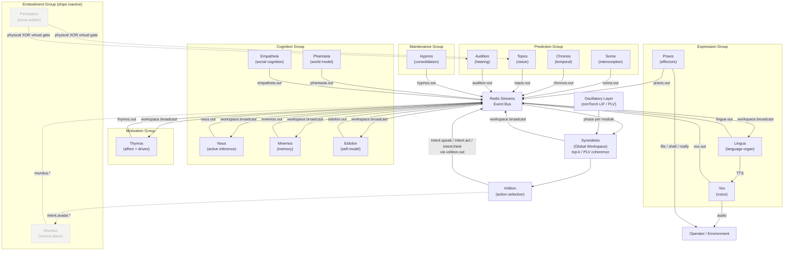

# KAINE Architecture

KAINE is a sixteen-module composite cognitive architecture grounded in
**Predictive Processing** (Friston 2010; Clark 2013; Seth 2013) and
**Global Workspace Theory** (Baars 1988; Dehaene et al. 2011). Cognition
emerges from continuous recurrent interaction among specialized modules
through a single global workspace — **Syneidesis** — with no central
executive. Each module maintains a predictive forward model of its domain
and publishes prediction errors. The workspace integrates the most salient
errors, weighted by oscillatory coherence across module populations, into
a broadcast that recurrently updates all models.

This document is the navigation guide for the current codebase. The
definitive theoretical treatment (the KAINE paper) is maintained in its own
repository. Process details live in the `docs/processes/` tree.

---

## System Diagram



---

## Module Roster

| # | Name | Group | Code | Backing Technology |
|---|------|-------|------|--------------------|
| 1 | **Soma** | Prediction | `kaine/modules/soma/` | CfC forward model (ncps); pynvml + psutil; fatigue accumulator |
| 2 | **Chronos** | Prediction | `kaine/modules/chronos/` | CfC (~32 units, ncps); event-rhythm forward model |
| 3 | **Topos** | Prediction | `kaine/modules/topos/` | DINOv2-small (frozen); ncps frame-prediction forward model |
| 4 | **Audition** | Prediction | `kaine/modules/audition/` | Speaches distil-Whisper; emotion2vec+; auditory forward model |
| 5 | **Nous** | Cognition | `kaine/modules/nous/` | pymdp (JAX); active inference — belief updating + EFE policy selection |
| 6 | **Mnemos** | Cognition | `kaine/modules/mnemos/` | Qdrant; all-MiniLM-L6-v2 (384-dim, CPU); episodic / semantic / procedural |
| 7 | **Eidolon** | Cognition | `kaine/modules/eidolon/` | JSON-persisted self-model; KL-drift detector; launch-name assignment |
| 8 | **Phantasia** | Cognition | `kaine/modules/phantasia/` | DreamerV3 RSSM (JAX, CPU; ships disabled); fake backend default |
| 9 | **Empatheia** | Cognition | `kaine/modules/empatheia/` | Qdrant-backed agent models; familiarity-driven affect coupling |
| 10 | **Thymos** | Motivation | `kaine/modules/thymos/` | Scherer CPM appraisal; drive accumulators with hysteresis; affect coupling consumer |
| 11 | **Lingua** | Expression | `kaine/modules/lingua/` | Abliterated Qwen 3.x via OpenAI-compatible server; ContextAssembler; A/B baseline |
| 12 | **Vox** | Expression | `kaine/modules/vox/` | Chatterbox TTS; Thymos prosodic modulation; prosodic mirroring |
| 13 | **Praxis** | Expression | `kaine/modules/praxis/` | File-write / notify / shell (empty whitelist by default) |
| 14 | **Hypnos** | Maintenance | `kaine/modules/hypnos/` | Five-phase consolidation pipeline; DPO+QLoRA voice alignment (Unsloth) |
| 15 | **Perception** | Embodiment (shipped inactive) | `kaine/modules/perception/` | Physical-XOR-virtual perceptual-locus arbiter; policy-gated entity self-switch |
| 16 | **Mundus** | Embodiment (shipped inactive) | `kaine/modules/mundus/` | Body-agnostic embodiment control plane; routes perception/action to a body through a pluggable adapter (OpenSim adapter ships today); double-gated (config + operator env var) |

Links to per-module detail pages: [modules/soma.md](modules/soma.md) ·
[modules/chronos.md](modules/chronos.md) ·
[modules/topos.md](modules/topos.md) ·
[modules/audition.md](modules/audition.md) ·
[modules/nous.md](modules/nous.md) ·
[modules/mnemos.md](modules/mnemos.md) ·
[modules/eidolon.md](modules/eidolon.md) ·
[modules/phantasia.md](modules/phantasia.md) ·
[modules/empatheia.md](modules/empatheia.md) ·
[modules/thymos.md](modules/thymos.md) ·
[modules/lingua.md](modules/lingua.md) ·
[modules/vox.md](modules/vox.md) ·
[modules/praxis.md](modules/praxis.md) ·
[modules/hypnos.md](modules/hypnos.md) ·
[modules/perception.md](modules/perception.md) ·
[modules/mundus.md](modules/mundus.md)

---

## Scaffolding Layers

### Event Bus

All inter-module communication flows through **Redis Streams**
(`compose/redis.yml`). The bus is implemented in `kaine/bus/`.

**Stream naming.** Every module publishes to `<name>.out`. Only Syneidesis
may write to the reserved stream `workspace.broadcast`. Volition publishes
intents to `volition.out`. The cycle writes latency telemetry to `cycle.out`
and reads rate-control commands from `cycle.control`.

**Event schema** (`kaine/bus/schema.py`):

```
source        string      module name (no whitespace)
type          string      dotted event type (e.g. soma.regulation)
payload       object      JSON payload — module-defined
salience      float       0.0 – 1.0 (validated at publish time)
timestamp     datetime    timezone-aware UTC ISO-8601
causal_parent string|null entry ID of the event this is a response to
```

Events that fail Pydantic validation are rejected before any Redis write.
Authentication (`requirepass`) is mandatory and enforced at `AsyncBus.audit()`;
the bus refuses to start against an unauthenticated or externally-bound Redis.

**Retention.** Streams are trimmed by approximate MAXLEN on every publish.
Default cap: 100,000 entries; `workspace.broadcast` cap: 50,000 entries.
Overrides are set per-stream under `[bus.per_stream_maxlen]` in
[configuration.md](configuration.md).

See [processes/cognitive-cycle.md](processes/cognitive-cycle.md) for the
per-tick read pattern and [processes/global-workspace.md](processes/global-workspace.md)
for how the broadcast stream is consumed.

### The 10 Hz Cognitive Cycle

`kaine/cycle/engine.py` — `CognitiveCycle`.

KAINE runs a continuous loop independent of user input at a base
**processing rate** of **10 Hz** (100 ms/tick). The default sits at the
upper end of the 3–10 Hz conscious-access / biological band, benchmarked-
cleared on this host (RTX 4070 SUPER). Processing and **experiential** rates
are independent runtime parameters; not every processing tick results in a
workspace broadcast.

Each tick:

1. Drain `cycle.control` for `cycle.set_rates` events.
2. Drain `soma.out` for `soma.regulation` advisories.
3. Parallel-read all active module streams.
4. Call `Syneidesis.select()` — score + select top-k coalition.
5. If this is an experiential tick, publish to `workspace.broadcast`.
6. Call `Volition.select()` — derive intents from the snapshot.
7. Publish each intent to the bus (`volition.out`).
8. Publish latency telemetry to `cycle.out`.

The cycle can be **frozen** by writing `state/cycle/control.json`
(`CycleControl.frozen = true`). Freeze is a humane suspend: the entity's
subjective clock stops while operators repair infrastructure. It is not a
shutdown.

See [processes/cognitive-cycle.md](processes/cognitive-cycle.md) for the
full tick sequence, rate-control API, and Soma regulation integration.

### Syneidesis — the Global Workspace

`kaine/workspace/syneidesis.py` — `Syneidesis`.

Each tick Syneidesis receives the full event list from the cycle and:

1. Scores each event via `RuleBasedSalience` (intensity × novelty × goal ×
   Thymos modulator — a product-form in [0, 1]).
2. When the oscillatory layer is enabled, multiplies each score by a
   **phase-locking value (PLV) coherence factor** in
   `[coherence_floor, coherence_ceiling]`.
3. Sorts by final score and selects the top-k (default 5) events —
   the **conscious coalition**.
4. Sets `inhibited = True` when the top score is below
   `publication_threshold` (default 0.35). An inhibited snapshot
   produces no broadcast and no intents.
5. Returns a `WorkspaceSnapshot` carrying the selected events, per-event
   salience scores, and (if the oscillatory layer is enabled) the
   coalition's mean pairwise PLV in `metadata['coherence']`.

See [processes/global-workspace.md](processes/global-workspace.md) for
the full selection algorithm, coherence multiplier, and inhibition gate.

### Oscillatory Binding Layer

`kaine/oscillator/`, `kaine/workspace/coherence.py`.

Each module maintains a small **snnTorch leaky integrate-and-fire (LIF)**
oscillator population (minimum 16 units, CPU-only). The population's
instantaneous phase is exposed via `module.phase()`. When multiple modules
are processing related content their oscillators phase-lock.

Syneidesis feeds the per-module phases into a `CoherenceScorer` each tick.
For each candidate event the scorer computes the **pairwise PLV** between
the event's source module and the rest of the candidate cohort over a
sliding window (minimum 10 ticks). PLV is mapped linearly onto a
`[coherence_floor, coherence_ceiling]` multiplier and applied to the event's
salience score before the top-k sort.

The layer **ships disabled** (`[oscillator].enabled = false` in
[configuration.md](configuration.md)). When disabled the multiplier is
exactly 1.0 and selection is bit-for-bit the pre-change behavior. The PLV
metadata key `coherence` is absent from snapshots when the layer is off.

Hypnos phase 1 calls `module.set_frequency(scale)` on all active modules
to slow oscillators during offline maintenance.

See [processes/global-workspace.md](processes/global-workspace.md) for
integration details.

### Volition — Executive Action Selection

`kaine/workspace/volition.py` — `Volition`.

Volition is the only path from a conscious snapshot to an effector. After
each successful experiential broadcast the cycle calls `Volition.select(snapshot)`.

**Core safeguard (§37/§147):** if `snapshot.inhibited` is true, `select`
returns `[]` — no intent is produced, so no effector acts, regardless of
what is in the snapshot.

For a non-inhibited snapshot the default `DefaultActionSelectionPolicy`:

- Scans the coalition for a `audition.transcription` event (non-empty
  user utterance).
- Does not form a speak intent about the entity's own prior external speech
  (no self-response loop).
- Enforces a one-in-flight guard: does not emit a new `speak` intent while
  a prior one is still being realized.

Intents are published to `volition.out` with types `intent.speak`,
`intent.think`, or `intent.act`.

---

## Predictive-Coding Forward Models

Every perception module (Soma, Chronos, Topos, Audition) maintains a small
learned forward model — a CfC network or similar — that predicts the expected
next state in its domain. The signal published to the workspace is the
**prediction error**: the discrepancy between the predicted and actual state.
Unexpected events produce high-salience prediction errors; expected events
produce low salience. Raw perceptual data (video frames, audio, sensor
readings) is processed in memory and released — it never touches disk.

Nous (pymdp/JAX) extends this to the cognition layer: it maintains a
generative model of the entity's environment and selects policies that
minimize **expected free energy**, including epistemic (information-seeking)
actions under uncertainty.

Phantasia maintains a world-model forward model over accumulated workspace
trajectories for use during offline associative replay.

---

## Two-Layer Safety Model

Two independent gates protect against unintended effector activation:

**Layer 1 — Publication threshold / inhibition.** Syneidesis sets
`snapshot.inhibited = True` when the winning coalition's score is below
`publication_threshold`. An inhibited snapshot is not broadcast and Volition
returns no intents.

**Layer 2 — Volition inhibition gate.** Even if a snapshot reaches Volition,
`Volition.select()` checks `snapshot.inhibited` first and returns `[]` on any
inhibited snapshot. The cycle never calls effectors directly.

Voice alignment adds a **third gate**: a two-layer operator opt-in (`[hypnos.voice_alignment].enabled = true` AND `KAINE_VOICE_ALIGNMENT_OPERATOR_APPROVED=1`) plus
an **abliteration-probe welfare veto** that rejects any DPO adapter whose
response to an adversarial prompt matches a deflection pattern. A
capability-loss veto rejects adapters that degrade general language
competence below a configurable threshold.

See [processes/voice-alignment.md](processes/voice-alignment.md) for the
full gate sequence.

---

## Zero-Raw-Sense-Data Persistence

KAINE's privacy model is grounded in a single invariant: **no raw sensory
data is ever written to disk**.

- Live camera frames are processed by Topos in memory and released. No
  frame is serialized.
- Live microphone audio is processed by Audition in memory (transcription,
  emotion classification) and released. No audio is persisted.
- The perception runtime state files (`state/perception/runtime.json`,
  `state/perception/desired.json`) contain only operational booleans and
  ISO timestamps — never text, audio, or imagery.
- The operator-freeze control file (`state/cycle/control.json`) contains
  only a boolean, a timestamp, and an optional operator-typed reason string.
- The Nexus privacy boundary (`kaine/nexus/privacy.py`) strips configured
  content fields (`user_input`, `faithful_rendering`) from all diagnostics
  SSE streams before messages reach client queues.

See [processes/perception-locus.md](processes/perception-locus.md) for
the physical/virtual/off gating model.

---

## CPU-First / All-Local

KAINE has no runtime cloud dependencies. All model weights are downloaded
at setup time. At runtime:

- The LIF oscillator layer runs on CPU (snnTorch).
- Nous (pymdp/JAX) defaults to CPU-only JAX; GPU is operator-configured.
- Phantasia (DreamerV3/JAX) defaults to CPU-only JAX.
- The embedding model (all-MiniLM-L6-v2) runs on CPU.
- Voice alignment training (`[training_device]`) targets `cuda:0` by
  default but degrades gracefully to CPU.
- Torch wheels are selected per host at install time (CUDA vs CPU).

---

## Boot Gate — Supervised or Safety-Net-Verified

Every module is **disabled by default** in `config/kaine.toml`
(`[modules]` section). Enabling a module is a deliberate local edit.
A guard test (`tests/test_boot_wiring.py::test_committed_config_ships_all_modules_disabled`)
asserts that the shipped config has all toggles off, so no module auto-starts on
a fresh clone.

The cycle refuses to start unattended. A run is **either** operator-supervised
**or** research-safety-net-verified, never neither:

- **Operator-supervised (non-research).** The entrypoint requires operator
  presence (`KAINE_CYCLE_OPERATOR_PRESENT=1`) before starting the cycle. A human
  is the safety net.
- **Research mode (unsupervised, by design).** The research phase runs without a
  human in the loop — a human watching would make a run non-reproducible — so the
  welfare obligation is relocated into the architecture. Selecting research mode
  (`KAINE_RESEARCH_MODE=1` or `[research].enabled`) **replaces** the
  operator-present requirement with a gate that refuses to start unless the
  autonomous safety net is live and verified: preservation enabled, the
  welfare-protective response wired, full logging/admissibility active, and a
  preflight dry `preserve_live → revive` self-check passing on this install
  (`kaine/cycle/research_gate.py`). The net — not a person — carries the duty of
  care for the run; human involvement returns afterward, to socialize any
  individual that emerged.

The cycle can be frozen at any time by writing `state/cycle/control.json`.

See [processes/research-operation.md](processes/research-operation.md) for the
end-to-end unsupervised run and [processes/entity-preservation.md](processes/entity-preservation.md)
for the preservation core.

---

## JAX Stack

Two modules require JAX:

- **Nous** (`kaine/modules/nous/`) — pymdp >= 1.0. Active inference:
  belief updating (variational inference over hidden states), policy
  selection via expected free energy minimization, epistemic action.
- **Phantasia** (`kaine/modules/phantasia/`) — DreamerV3 RSSM (danijar/dreamerv3,
  MIT). World-model latent forward model. Ships disabled (`backend = "fake"`).

Both use CPU-only JAX by default. GPU acceleration is operator-configured.
Neither module introduces a cloud dependency.

---

## Evaluation Sidecar

`kaine/evaluation/` — instrumentation that never injects into the cognitive
loop. Observers are read-only on module state; the one exception is the welfare
observer, which additionally emits a **content-free** `welfare.gray_zone` event
(numeric scalars plus a category label only — never a field copied from a source
payload) on `welfare.out`, so the cycle-layer autonomous welfare-protective
monitor can act on any gray-zone category.

Eight sidecar observers run as async tasks alongside the cycle:

| Observer | Stream(s) | Output |
|----------|-----------|--------|
| `coherence_observer` | `workspace.broadcast` | PLV time series (daily JSONL) |
| `replay_observer` | `mnemos.out` | Memory IDs (content redacted by default) |
| `empatheia_observer` | `empatheia.out` | Agent-model accuracy |
| `voice_alignment_divergence_observer` | `lingua.external` | Cosine similarity of A/B pairs |
| `fatigue_observer` | `soma.out` | Fatigue level history |
| `prediction_error_observer` | `soma.out`, `chronos.out`, `topos.out`, `audition.out`, `phantasia.out` | Sliding-window mean/p95/p99 |
| `welfare_observer` | `soma.out`, `hypnos.out`, `thymos.out`, `mnemos.out` | Gray-Zone Event counts (also emits content-free `welfare.gray_zone` on `welfare.out`) |
| `nous_policy_observer` | `nous.out` | EFE value, horizon, selected action |

The A/B divergence test (`kaine/evaluation/ab_divergence.py`) pairs each
Lingua external-speech event with a bare-LLM inference (no workspace
context, no persona) and logs the cosine similarity. A divergence near
zero means the conscious workspace is adding no signal. Rising divergence
over time is the architectural thesis marker.

The individuation boundary instrument (`kaine/evaluation/individuation.py`)
runs a permutation test to produce statistical evidence about whether a fork
has formed a preference profile distinguishable from parent stochastic
variation. It is Guardian-only, operator-run at merge points, and never
called from the cognitive cycle.

See [processes/evaluation-sidecar.md](processes/evaluation-sidecar.md) for
the full observer inventory and configuration.

The core/evaluation boundary is load-bearing: core runtime must run with the
sidecar absent, so nothing under `kaine/` imports `kaine.evaluation` except the
two composition-root entrypoints (`kaine/cycle/__main__.py`,
`kaine/nexus/__main__.py`). This — and the broader package layering — is
enforced structurally by import contracts. See
[architecture-boundaries.md](architecture-boundaries.md) for the layer map, the
boundary-neutral homes for cross-cutting primitives, and how to run the check.

---

## Fork / Merge

`kaine/lifecycle/` — snapshot-based fork and merge with per-module strategies.

`ForkManager` captures state as a `ForkSnapshot` (per-module serialized
state + adapter paths + metadata), stored under `state/forks/<id>/`.

Merge applies per-module strategies:

| Module | Strategy |
|--------|----------|
| Mnemos | Sum `short_term_size`; tag retrieved memories; surface mismatches |
| Nous | One-sided selection by posterior certainty (lower mean entropy wins); emits `nous.merge_warning` when forks diverged significantly |
| Eidolon | Dedup values/norms; sum speech count; concatenate identity history; average personality baseline |
| Thymos | Average dimensional baseline; max drives; union goals; concatenate emotional history |
| All others | `UnionMergeStrategy` (last-write-wins union for scalars, recursive for dicts, dedup for lists) |

LoRA adapter merging is configurable: `"auto"` (default) selects real
PEFT TIES/DARE merging (`kaine/lifecycle/adapter_merge.py`, with a
capability-loss veto) whenever the PEFT `[training]` extra is
installed, falling back to `"fake"` (concatenates parent adapter
paths) otherwise. Either can be forced explicitly regardless of what's
installed.

See [processes/fork-merge-lifecycle.md](processes/fork-merge-lifecycle.md).

---

## State Encryption (Optional)

`kaine/security/` — application-layer AES-256-GCM encryption at rest.

Covers: Eidolon self-model, fork/merge snapshot bundles, sidecar observer
JSONL, and Phantasia world-model checkpoints. Ships disabled. When
`[security.state_encryption].enabled = true` the entity refuses to boot
without a 32-byte key (fail-closed). See [configuration.md](configuration.md)
for key sourcing.

---

## Process Documentation

| Document | Summary |
|----------|---------|
| [processes/cognitive-cycle.md](processes/cognitive-cycle.md) | 10 Hz tick engine, rate control, Soma regulation, freeze |
| [processes/global-workspace.md](processes/global-workspace.md) | Syneidesis selection, PLV coherence, inhibition, Volition |
| [processes/fork-merge-lifecycle.md](processes/fork-merge-lifecycle.md) | Snapshot/fork/merge, per-module strategies, TIES/DARE |
| [processes/sleep-maintenance.md](processes/sleep-maintenance.md) | Hypnos five-phase pipeline, fatigue trigger, phase details |
| [processes/evaluation-sidecar.md](processes/evaluation-sidecar.md) | Eight observers, A/B divergence, individuation boundary |
| [processes/voice-alignment.md](processes/voice-alignment.md) | DPO+QLoRA pipeline, two-layer gate, abliteration veto |
| [processes/perception-locus.md](processes/perception-locus.md) | physical/virtual/off gating, zero-persistence invariant |
| [processes/research-operation.md](processes/research-operation.md) | unsupervised research run end to end: mode, safety-net gate, the seven experiments, admissibility, autonomous safety net |
| [processes/testing-framework.md](processes/testing-framework.md) | three validation layers (instrument controls, determinism/isolation, data integrity) mapped to the seven experiments |
| [processes/entity-preservation.md](processes/entity-preservation.md) | live preservation + revive of the whole individual; encrypted bundle; retention; verified revive |
| [processes/run-identity.md](processes/run-identity.md) | per-run seed, run id, manifest, deterministic mode, verdict schema |
| [processes/run-admissibility.md](processes/run-admissibility.md) | completeness gating + log range validation |
