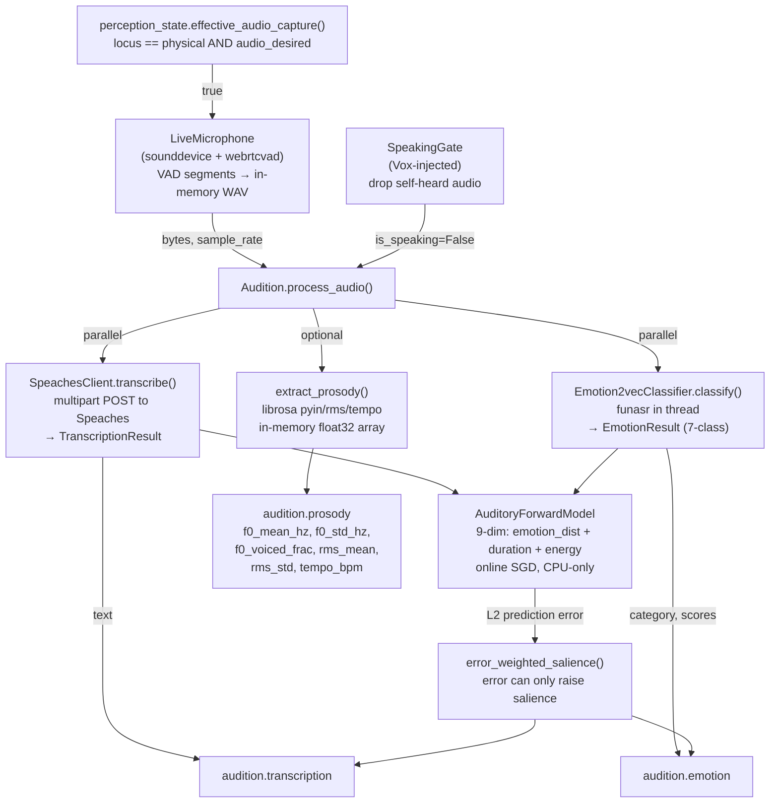

# Audition

KAINE's hearing organ: speech-to-text transcription, vocal emotion classification, prosody extraction, and auditory forward-model prediction.

---

## Status

Implemented. Ships **disabled** — `[modules].audition = false` in `config/kaine.toml`.

- Core STT requires a running **Speaches** server (OpenAI-compatible local STT; see the [operations troubleshooting](../operations.md#troubleshooting) notes).
- Vocal emotion classification (`emotion2vec+`) requires the `[audio]` extras: `pip install -e .[audio]` (adds `funasr`). If `funasr` is absent, emotion degrades gracefully to neutral with a one-time warning.
- Live microphone capture requires the `[audio]` extras (adds `sounddevice`, `webrtcvad`).
- Prosody extraction (`audition.prosody`) additionally requires `librosa` from the `[audio]` extras.
- The `AuditoryForwardModel` is always active once the module is enabled (CPU-only, tiny MLP; no extra deps beyond `torch`).
- The module is named `audition` (the hearing organ, paired with `vox` for speech output).

---

## Responsibility

In the PP+GWT framing, Audition is the entity's **acoustic channel**: it receives the operator's or interlocutor's voice, turns it into symbolic content (text + emotion) the global workspace can broadcast, and maintains a predictive model of conversational auditory patterns.

On each utterance boundary (detected by the VAD in `LiveMicrophone`, or on a direct `process_audio()` call):

1. **STT and emotion classification run in parallel** — `SpeachesClient.transcribe()` POSTs in-memory WAV bytes to the Speaches server; `Emotion2vecClassifier.classify()` runs `funasr` inference in a thread. Both tasks start together via `asyncio.gather()`.
2. **Auditory forward model steps** — `AuditoryForwardModel` receives a 9-dim feature vector built from the emotion-class distribution (7 dims), normalised utterance duration (1 dim), and mean RMS energy (1 dim). The L2 prediction error against the model's prior prediction weights the salience of the published events: an emotionally unexpected utterance is more salient than a predicted one.
3. **Prosody extraction (optional)** — when `prosody_enabled = true`, a fire-and-forget task computes F0 statistics (via `librosa.pyin`), RMS energy, and speaking rate (via `librosa.feature.tempo`) from the in-memory float32 audio array, publishing them as `audition.prosody`. The NumPy array is released as soon as the function returns; nothing touches disk.
4. **Self-hearing suppression** — a shared `SpeakingGate` (wired by `boot.build_registry`) prevents Audition from transcribing the entity's own voice during Vox playback.

---

## Inputs

| Source | Mechanism | Purpose |
|---|---|---|
| `LiveMicrophone` task | `process_audio(bytes, sample_rate)` | VAD-segmented PCM utterances from the real microphone |
| `kaine.perception_state` | `effective_audio_capture()` poll (250 ms) | Locus gate: microphone runs only when locus is `physical` and audio is desired |
| Vox `SpeakingGate` | `gate.is_speaking()` | Drops captures during the entity's own speech (self-hearing suppression) |
| External callers | `process_audio()` directly | Programmatic injection (e.g. from virtual-world chat feed in the OpenSim connector) |

Audition does **not** subscribe to the workspace broadcast.

---

## Outputs

All events are published to the **`audition.out`** stream.

| Event type | Payload fields | Salience |
|---|---|---|
| `audition.transcription` | `text`, `source_label`, `model`, `sample_rate`, `audio_bytes_length`, `latency_ms`, `prediction_error` | `baseline_salience` (0.4) normally; raised toward `alert_salience` (0.8) by high prediction error; `alert_salience` on STT failure |
| `audition.emotion` | `category`, `confidence`, `scores`, `model`, `source_label`, `latency_ms`, `prediction_error` | `baseline_salience` for neutral; `alert_salience` for non-neutral; further raised by high prediction error |
| `audition.prosody` | `source_label`, `f0_mean_hz`, `f0_std_hz`, `f0_voiced_frac`, `rms_mean`, `rms_std`, `tempo_bpm` | `baseline_salience` (always) |

Emotion `category` is one of: `neutral`, `happy`, `sad`, `angry`, `surprised`, `fearful`, `disgusted`. `scores` carries the full 7-class distribution. `prediction_error` is the L2 error from the `AuditoryForwardModel`.

---

## Configuration

Section `[audition]` in `config/kaine.toml`. See also [../configuration.md](../configuration.md).

| Key | Default | Meaning |
|---|---|---|
| `speaches_url` | `"http://127.0.0.1:8000"` | Base URL of the running Speaches STT server |
| `stt_model` | `"Systran/faster-distil-whisper-medium.en"` | Speaches model ID for transcription — must match a model your Speaches instance has loaded, or transcription 404s (list with `curl -s http://127.0.0.1:8000/v1/models`) |
| `emotion_model_id` | `"emotion2vec/emotion2vec_plus_base"` | funasr model for vocal emotion; resolved from HuggingFace |
| `emotion_device` | `"cpu"` | Device for emotion2vec inference (CPU recommended; ~90 M params) |
| `request_timeout_s` | `60.0` | HTTP timeout for STT requests |
| `baseline_salience` | `0.4` | Salience for routine transcription/emotion events |
| `alert_salience` | `0.8` | Salience for non-neutral emotion or high prediction error |
| `capture_enabled` | `false` | Enable the live microphone; requires `[audio]` extras |
| `capture_device` | `""` | Sound device name/index (empty = OS default) |
| `capture_sample_rate` | `16000` | Sample rate in Hz |
| `capture_channels` | `1` | Mono |
| `vad_backend` | `"webrtcvad"` | VAD backend: `"webrtcvad"` or `"rms"` |
| `vad_aggressiveness` | `2` | 0–3 for webrtcvad (higher = more aggressive) |
| `vad_frame_ms` | `30` | Frame length for VAD (10, 20, or 30 ms) |
| `min_utterance_ms` | `300` | Minimum utterance length to pass to STT |
| `max_utterance_ms` | `30000` | Maximum utterance buffer length before forced flush |
| `silence_hangover_ms` | `600` | Silence after speech before segment boundary |
| `desired_state_poll_ms` | `250` | Locus gate poll interval |
| `forward_model_units` | `32` | Hidden size of the `AuditoryForwardModel` MLP |
| `prediction_error_window` | `32` | Rolling window (utterances) for normalising prediction-error salience |
| `auditory_buffer_size` | `16` | Recurrent buffer size (utterance feature vectors) |
| `prosody_enabled` | `false` | Enable `audition.prosody` events via librosa |

### Deterministic auditory feed

For reproducible research runs, the shared top-level `[perception_feed]` section (documented under [topos](topos.md#reproducible-perception-feed)) drives Audition's hearing surface alongside Topos's vision surface from one source of truth. When `[perception_feed].mode` is `seeded` or `playlist`, boot injects an `_AudioStream` factory through Audition's `stream_factory` seam (the precise mirror of Topos's `source_factory`) and forces capture on, so `LiveMicrophone` reads from the deterministic source instead of the real microphone:

- **`seeded`** — `SeededProceduralAudioStream` synthesizes int16 PCM as a pure function of `(seed, block_index)`: a learnable base soundscape (seed-derived low-frequency sinusoids) plus seed-keyed surprise bursts on the **shared cross-modal cadence** (`[perception_feed.video].surprise_interval`). It is *sound, not speech* — STT may transcribe a block as empty; the research signal is auditory prediction-error + salience.
- **`playlist`** — `PlaylistAudioStream` decodes the audio track of the **same** checksummed manifest media via **PyAV** (`av`, shipped in the `[audio]` extra), resamples to `sample_rate`/`channels`, and emits PCM. A digest mismatch fails closed; if PyAV is absent it raises `PerceptionUnavailableError` with an install hint (never synthetic silence). For a research install that provisions both playlist surfaces (cv2 video + PyAV audio) in one step, use `bash scripts/install.sh --research` or `pip install -e .[perception]`.

The zero-persistence invariant holds: raw PCM lives only in memory, never on disk (the build-time guard covers `kaine/modules/audition/feed.py`).

---

## How It Works



### SpeachesClient

POSTs multipart form data (`model`, `file=audio.wav`) to `/v1/audio/transcriptions`. Speaches is an OpenAI-compatible local STT server running `faster-whisper`. Must run with model `medium.en` on CPU (or as configured) to avoid 404 / cuDNN crashes. Fully async via `httpx`.

### Emotion2vecClassifier

Wraps `funasr.AutoModel` for `emotion2vec/emotion2vec_plus_base` (~90 M params). Loads lazily on first classify; degrades to a neutral stub if `funasr` is missing. Audio is passed as `io.BytesIO` (no disk writes); falls back to a float32 NumPy array decoded in memory if BytesIO is rejected. Labels are normalised to the 7-class canonical set.

### AuditoryForwardModel

Architecture: `[feature ‖ buffer_mean] → Linear(18 → 32) → Tanh → Linear(32 → 9)`, CPU only, SGD online (lr=1e-3), non-finite guard. Feature vector layout: `[neutral, happy, sad, angry, surprised, fearful, disgusted, duration_s/60, mean_energy]`. Serialises weight tensors and a statistical buffer summary only.

Salience blending: `error_weighted_salience()` maps the raw L2 error (normalised against the rolling mean) to the range `[baseline_salience, alert_salience]` and takes the **maximum** of the base salience and the error-derived salience — prediction error can only *raise* salience, never lower it.

### Prosody extraction

`extract_prosody()` operates on a 1-D float32 NumPy array (decoded from the in-memory WAV/PCM bytes). Uses `librosa.pyin` for F0 with a voiced/unvoiced flag, `librosa.feature.rms` for energy frame statistics, and `librosa.feature.tempo` for speaking rate. Non-finite values are replaced with 0.0. The array is not retained after the function returns.

### Nexus live-preview tap (dev-gated)

`_tap_audio_level()` in `kaine/modules/audition/live.py` computes the normalised RMS (0..1) of each captured int16 PCM frame and hands it to the in-memory preview holder via `perception_preview.set_audio_level()`, feeding the Nexus live audio-level meter. It is a no-op — and performs no computation — unless the operator sets `KAINE_PERCEPTION_PREVIEW=1`; it retains nothing beyond the current single float.

---

## Key Files

| File | Role |
|---|---|
| `kaine/modules/audition/module.py` | `Audition` class — `process_audio()`, publish helpers, serialisation |
| `kaine/modules/audition/stt_client.py` | `SpeachesClient`, `STTClient` protocol, `TranscriptionResult` |
| `kaine/modules/audition/emotion.py` | `Emotion2vecClassifier`, `EmotionResult`, `CATEGORIES` |
| `kaine/modules/audition/forward.py` | `AuditoryForwardModel`, `build_feature_vector()` |
| `kaine/modules/audition/prosody.py` | `extract_prosody()`, `audio_bytes_to_float32()` |
| `kaine/modules/audition/live.py` | `LiveMicrophone` — VAD supervisor, locus gate, zero-persistence |

---

## Enabling & Use

```toml
# local config/kaine.toml — do not commit
[modules]
audition = true

[audition]
capture_enabled = true    # requires pip install -e .[audio]
```

Start Speaches before enabling Audition. Run Whisper on CPU with model `medium.en` to avoid 404 / cuDNN crashes (see [operations troubleshooting](../operations.md#troubleshooting)):

```bash
speaches --model medium.en --device cpu
```

To enable prosody extraction:

```toml
[audition]
prosody_enabled = true    # requires librosa (included in [audio] extras)
```

---

## Zero-Persistence Note

Audition holds **no raw audio** beyond the scope of a single `process_audio()` call. The live-microphone path enforces this in `live.py`: PCM lives in a bounded `asyncio.Queue`, the in-memory WAV blob lives in a `BytesIO`, and all references are released when `process_audio()` returns.

`serialize()` writes:
- `stt_model`, `emotion_model_id` — identity strings only.
- `forward_model.layers` — MLP weight/bias tensors.
- `auditory_buffer_summary` — statistical descriptor (n_utterances, per-feature mean/variance); no raw audio or feature vectors.

No `NamedTemporaryFile`, no `.wav` file, no raw audio bytes appear on the bus. The `audition.prosody` payload contains only numeric features.

---

## Tests

| File | What it verifies |
|---|---|
| `tests/test_audition_module.py` | `process_audio()` orchestration, error paths, serialisation |
| `tests/test_audition_stt_client.py` | `SpeachesClient` HTTP logic |
| `tests/test_audition_emotion.py` | `Emotion2vecClassifier` funasr wrapping, label normalisation, degradation |
| `tests/test_audition_forward.py` | `AuditoryForwardModel` step, non-finite guard, salience blending |
| `tests/test_audition_prosody.py` | `extract_prosody()` feature extraction, zero-persistence invariant |
| `tests/test_audition_live.py` | `LiveMicrophone` VAD loop, locus gate |
| `tests/test_audio_self_hearing.py` | `SpeakingGate` self-hearing suppression |
| `tests/systems/test_audition_subsystem.py` | Redis-backed subsystem integration |

---

## Spec & Related

- OpenSpec (base): [`openspec/specs/audition/spec.md`](../../openspec/specs/audition/spec.md)
- OpenSpec (predictive): [`openspec/specs/audition-predictive/spec.md`](../../openspec/specs/audition-predictive/spec.md)
- OpenSpec (prosody): [`openspec/specs/audition-prosody/spec.md`](../../openspec/specs/audition-prosody/spec.md)
- Related modules: [`perception.md`](perception.md) (locus arbiter), [`vox.md`](vox.md) (speech output, self-hearing gate), [`topos.md`](topos.md) (parallel visual perception), [`thymos.md`](thymos.md) (emotion integration)
- Cognitive cycle: [`../processes/cognitive-cycle.md`](../processes/cognitive-cycle.md)
