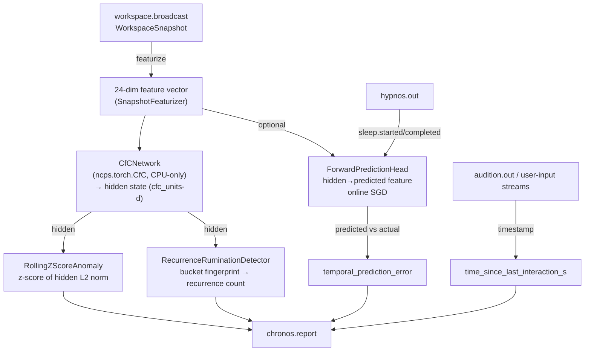

# Chronos

KAINE's temporal-context organ: encodes workspace history with a Closed-form Continuous-time (CfC) network and detects anomaly, rumination, and idle time.

---

## Status

Implemented. Ships **disabled** — `[modules].chronos = false` in `config/kaine.toml`.

- Requires `torch` and `ncps` (Neural Circuit Policy Search, provides the `CfC` cell).
- The CfC is **CPU-only by policy** regardless of host hardware; the network is small enough (<100 K parameters at defaults) that GPU adds no benefit and enforcing CPU keeps the cycle tick budget predictable.
- Optional forward-prediction head (`forward_prediction = false` by default) — purely additive; does not change base behaviour when disabled.
- Adaptation of the forward-prediction head is suspended during Hypnos offline cycles.

---

## Responsibility

In the PP+GWT framing, Chronos is the entity's **temporal self-model**: it keeps track of *when* things happen, *what patterns repeat*, and *how surprising* recent workspace activity is relative to learned expectations.

On every Syneidesis workspace broadcast (10 Hz), Chronos:

1. **Featurizes the snapshot** — deterministically converts the `WorkspaceSnapshot` (selected events, salience statistics, source identity, inhibition flag, elapsed time) into a fixed 24-dimensional float vector.
2. **Steps the CfC** — feeds the feature vector through a stateful Closed-form Continuous-time recurrent network, producing a hidden-state vector that encodes temporally compressed workspace history.
3. **Scores anomaly** — the `RollingZScoreAnomaly` detector computes the z-score of the hidden state's L2 norm against a rolling window of recent norms. High z-score → temporally unusual activity.
4. **Scores rumination** — the `RecurrenceRuminationDetector` fingerprints the hidden state by quantizing each dimension and hashing, then counts bucket recurrences in a rolling window. Repeated identical (or near-identical) workspace states flag *rumination* — a welfare-relevant signal that the entity's experience has become stuck.
5. **Measures idle time** — tracks the timestamp of the most recent event on configured user-input streams (default `audition.out`) and reports `time_since_last_interaction_s` (→ `inf` if no interaction yet).
6. **Optionally runs a forward-prediction head** — when `forward_prediction = true`, a linear head maps the CfC hidden state to a predicted next feature vector. The `temporal_prediction_error` (mean absolute error between the prediction and the actual feature) drives salience in place of the z-score, and the head adapts online via SGD.

---

## Inputs

Chronos subscribes to the workspace broadcast, not raw module streams:

| Bus source | Event / mechanism | Purpose |
|---|---|---|
| `workspace.broadcast` | `on_workspace(snapshot)` | Primary trigger — one `chronos.report` per broadcast |
| Configured `user_input_streams` (default `audition.out`) | Any event | Updates `_last_interaction_at` for idle-time tracking |
| `hypnos.out` | `hypnos.sleep.started` / `hypnos.sleep.completed` | Suspends / resumes forward-prediction head adaptation |

---

## Outputs

All events are published to the **`chronos.out`** stream.

| Event type | Payload fields | Salience |
|---|---|---|
| `chronos.report` | `temporal_context`, `anomaly_score`, `habituation_score`, `rumination_detected`, `time_since_last_interaction_s`, `feature_vector`, `temporal_prediction_error` | `baseline_salience` (default 0.1) normally; `alert_salience` (default 0.7) when `rumination_detected` is `true` or the anomaly/prediction-error metric exceeds `anomaly_alert_threshold` |

`temporal_context` is the CfC hidden-state vector (length = `cfc_units`); this is what downstream modules (e.g. Mnemos, Thymos) use as a temporal fingerprint of the current moment.

---

## Configuration

Section `[chronos]` in `config/kaine.toml`. See also [../configuration.md](../configuration.md).

| Key | Default | Meaning |
|---|---|---|
| `cfc_units` | `32` | CfC hidden state size; also sets `ForwardPredictionHead` input size |
| `baseline_salience` | `0.1` | Salience for routine `chronos.report` events |
| `alert_salience` | `0.7` | Salience when anomaly / rumination fires |
| `anomaly_window` | `64` | Rolling window length (ticks) for the z-score anomaly detector (consumed by boot; not passed directly to `Chronos` constructor — uses `RollingZScoreAnomaly` default) |
| `anomaly_alert_threshold` | `3.0` | Z-score (or normalised prediction-error ratio) above which `alert_salience` is applied |
| `rumination_window` | `32` | Rolling window for the recurrence detector (consumed at boot) |
| `rumination_threshold` | `4` | Bucket-count threshold for flagging rumination |
| `rumination_bucket_resolution` | `0.25` | Quantization step for the hidden-state fingerprint |
| `user_input_streams` | `["audition.out"]` | Streams whose events reset the idle-time clock |
| `forward_prediction` | `false` | Enable the online-adapting `ForwardPredictionHead` |
| `prediction_error_window` | `32` | Rolling window (ticks) for normalising `temporal_prediction_error` salience |

---

## How It Works



### SnapshotFeaturizer (24-dim, deterministic)

The feature vector is assembled from the `WorkspaceSnapshot` without touching torch:

| Dims | Feature |
|---|---|
| 0 | `log1p(num_selected_events)`, clamped at 8 |
| 1–3 | Mean / max / std of event salience scores |
| 4–11 | Salience-weighted source one-hot for 8 known sources (soma, chronos, topos, nous, mnemos, thymos, lingua, praxis); unknown sources overflow into dim 11 |
| 12–19 | Salience-weighted 8-bucket blake2b hash projection of `(source, type)` pairs |
| 20 | `log1p(delta_t_seconds)` since previous snapshot |
| 21 | `1.0` if workspace is inhibited |
| 22 | `1.0` if `is_experiential` |
| 23 | Reserved (always 0.0) |

### CfCNetwork

Wraps `ncps.torch.CfC(input_size=24, units=32)`. All parameters are frozen (`requires_grad_(False)`); the CfC acts as a **feature extractor**, not a trained model. Hidden state accumulates across workspace broadcasts. Explicitly pinned to `cpu` even if the host has CUDA; a logged warning is emitted if `select_device()` returns something other than `cpu`.

### ForwardPredictionHead (optional)

A single `nn.Linear(units → input_size)` head. Per tick when enabled:
1. Predicts the next feature vector from the prior CfC hidden state.
2. Computes MAE against the actual feature vector → `temporal_prediction_error`.
3. Takes one SGD step (lr=1e-3) toward the actual feature, guarded against non-finite loss/gradients.
4. Suspends adaptation when `_in_hypnos`.

When enabled, `temporal_prediction_error` normalised against the rolling window mean replaces the z-score as the primary salience driver; z-score and rumination remain on the payload for diagnostics.

---

## Key Files

| File | Role |
|---|---|
| `kaine/modules/chronos/module.py` | `Chronos` class — `on_workspace()`, user-input loop, Hypnos loop |
| `kaine/modules/chronos/featurizer.py` | `SnapshotFeaturizer` — 24-dim deterministic feature extraction |
| `kaine/modules/chronos/network.py` | `CfCNetwork` (ncps wrapper) and `ForwardPredictionHead` |
| `kaine/modules/chronos/anomaly.py` | `RollingZScoreAnomaly` — z-score over hidden-state norms |
| `kaine/modules/chronos/rumination.py` | `RecurrenceRuminationDetector` — quantized-fingerprint recurrence |

---

## Enabling & Use

Add to your local `config/kaine.toml` (do not commit):

```toml
[modules]
chronos = true
```

To enable the forward-prediction head:

```toml
[chronos]
forward_prediction = true
```

No external services are needed. The CfC weights are random at init and never saved (the CfC is a frozen encoder); only the `ForwardPredictionHead` weights and `last_interaction_at` timestamp are serialised.

---

## Zero-Persistence Note

Chronos persists **no raw workspace events**. `serialize()` writes:
- `last_interaction_at` — a single float timestamp.
- `user_input_cursors` — Redis stream cursor positions.
- `pred_head` — `ForwardPredictionHead` weight/bias tensors only (no raw feature vectors).

The CfC hidden state is ephemeral and is not serialised; on restart, the CfC begins with a zero hidden state and re-accumulates context from subsequent workspace broadcasts.

---

## Tests

| File | What it verifies |
|---|---|
| `tests/test_chronos_module.py` | `on_workspace()` event loop, salience logic, Hypnos interaction |
| `tests/test_chronos_featurizer.py` | `SnapshotFeaturizer` determinism, vector layout |
| `tests/test_chronos_network.py` | `CfCNetwork` CPU pinning, parameter count < 100K, `ForwardPredictionHead` |
| `tests/test_chronos_anomaly.py` | `RollingZScoreAnomaly` empty-window and outlier cases |
| `tests/test_chronos_rumination.py` | `RecurrenceRuminationDetector` threshold, habituation score |
| `tests/systems/test_chronos_subsystem.py` | Redis-backed subsystem integration |

---

## Spec & Related

- OpenSpec: [`openspec/specs/chronos/spec.md`](../../openspec/specs/chronos/spec.md)
- OpenSpec (predictive): [`openspec/specs/chronos-predictive/spec.md`](../../openspec/specs/chronos-predictive/spec.md)
- Related modules: [`nous.md`](nous.md) (uses temporal context), [`hypnos.md`](hypnos.md) (suspends adaptation), [`soma.md`](soma.md) (interoceptive complement)
- Cognitive cycle: [`../processes/cognitive-cycle.md`](../processes/cognitive-cycle.md)
