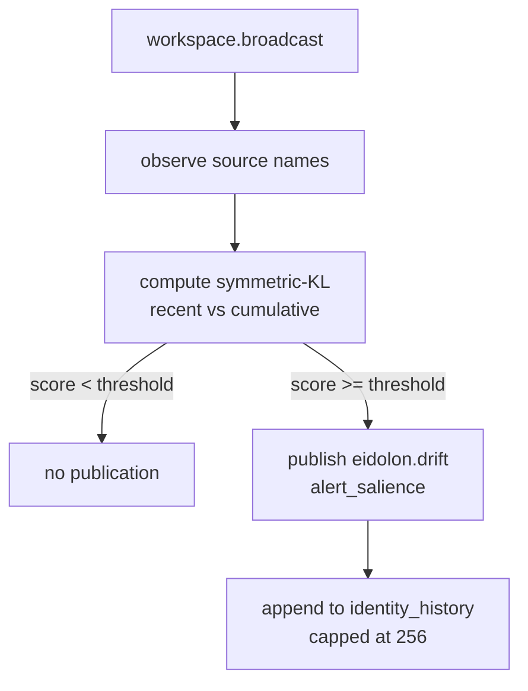

# Eidolon

KAINE's self-model organ: identity maintenance, workspace-source drift detection, and observation-driven self-inference.

---

## Status

Implemented. Ships **disabled** — `[modules].eidolon = false` in `config/kaine.toml`.

- Self-inference sub-engine ships **additionally disabled** — `[eidolon.self_inference].enabled = false`.
- No external services required for the core module. Self-inference reads from bus streams already present.
- The self-model is persisted to `state/eidolon/self_model.json` (optionally AES-256-GCM encrypted when `[security.state_encryption].enabled = true`).

---

## Responsibility

Eidolon holds KAINE's self-model — a persistent, structured description of who the entity is. In the PP+GWT framing, it is the module responsible for maintaining continuity of identity across cognitive cycles. It does two things:

1. **KL-drift detection** — every workspace broadcast, it feeds the event-source distribution into a symmetric-KL detector and publishes `eidolon.drift` when the composition of what is conscious deviates significantly from historical norms.
2. **Self-inference** (opt-in) — when enabled, it accumulates observations from Lingua (speech type labels only), Thymos (VAD numerics), and Nous (EFE policy labels), and at each Hypnos maintenance cycle end, derives and writes four self-model fields: `behavioral_norms`, `personality_baseline`, `values`, and `capability_map`.

A critical privacy boundary: **raw speech text is never read or stored**. The `_record_voice` and `observe_lingua` methods explicitly inspect only structural metadata (event type, length, word count).

---

## Inputs

| Source | Stream | Event type | What is used |
|---|---|---|---|
| Syneidesis | `workspace.broadcast` | — | `selected_events` — source names for KL drift |
| Lingua | `lingua.internal` (configurable) | any | Event type label + text length/word count (never text content) |
| Lingua | `lingua.external` (configurable) | any | Event type label + text length/word count |
| Thymos | `thymos.out` | `thymos.state` | `valence`, `arousal`, `dominance` (VAD numerics) |
| Thymos | `thymos.out` | `thymos.drive` | `drive` name (categorical) |
| Nous | `nous.out` | `nous.policy` | `policy` action label, `expected_free_energy` |
| Hypnos | `hypnos.out` | `hypnos.sleep.completed` | Triggers `maintenance_cycle_end()` and self-model update |

Thymos, Nous, and Hypnos streams are consumed by separate background tasks spawned at `initialize()`, active only when `self_inference.enabled = true`.

---

## Outputs

| Stream | Event type | Key payload fields | Salience |
|---|---|---|---|
| `eidolon.out` | `eidolon.drift` | `score`, `recent_count`, `historical_count`, `top_drifted_sources` (source names only) | `alert_salience` (0.7) |
| `eidolon.out` | `eidolon.self_model` | `values`, `behavioral_norms`, `personality_baseline`, `capability_map` | `baseline_salience` (0.05) |

`eidolon.drift` carries no event contents — only source names and numeric scores. `eidolon.self_model` is published after each successful `maintenance_cycle_end()`.

---

## Configuration

All keys under `[eidolon]` and `[eidolon.self_inference]`. See also [`../configuration.md`](../configuration.md).

| Key | Default | Description |
|---|---|---|
| `persistence_path` | `"state/eidolon/self_model.json"` | JSON path for the self-model |
| `drift_window` | `100` | Recent-window size (broadcasts) for KL drift |
| `drift_threshold` | `0.6` | Symmetric-KL score above which `eidolon.drift` fires |
| `save_interval_s` | `30.0` | Periodic self-model save interval |
| `internal_speech_stream` | `"lingua.internal"` | Stream to observe for internal speech |
| `external_speech_stream` | `"lingua.external"` | Stream to observe for external (spoken-out) speech |
| `voice_observations_cap` | `256` | Max buffered speech observations kept before older entries are trimmed |
| `identity_history_cap` | `256` | Max drift records kept in `identity_history` |
| `baseline_salience` | `0.05` | Default event salience |
| `alert_salience` | `0.7` | Salience on drift alert |
| `[eidolon.self_inference].enabled` | `false` | Opt-in; must be `true` to activate self-inference |
| `[eidolon.self_inference].vad_window_cycles` | `10` | Maintenance cycles in rolling VAD window |
| `[eidolon.self_inference].speech_pattern_min_count` | `5` | Observations needed before a norm is written |
| `[eidolon.self_inference].seed_path` | — | Optional JSONL seed file for first-boot field initialization |

---

## How it works

### Identity naming

On first boot, if `SelfModel.name` is empty, `generate_launch_name()` picks `"Kaine <Surname>"` where the surname is drawn from the Second Life surname list (`kaine/modules/eidolon/surnames.txt`, sourced from the official SL wiki last-name list). The name is written atomically to disk immediately. The intent is that the entity may later rename itself; this is only the starting point.

### KL-drift detection (`SourceDistributionDrift`)

`kaine/modules/eidolon/drift.py` implements `SourceDistributionDrift`, which maintains:

- A `deque[Counter[str]]` of recent workspace batches (window = 100 by default).
- A single all-time `Counter[str]` (cumulative).

Each `on_workspace` call passes the list of event sources to `observe()`. The symmetric KL divergence between the recent and cumulative distributions is computed with additive smoothing (ε = 1e-3). When the score exceeds `drift_threshold`, `eidolon.drift` is published and the timestamp + score is appended to `SelfModel.identity_history`.



### Self-inference engine (`SelfInferenceEngine`)

When enabled, `SelfInferenceEngine` populates four `SelfModel` fields from observations accumulated between maintenance cycles:

**1. `behavioral_norms`** — speech type labels from `lingua.internal` events. Only event *types* in `_INTERNAL_SPEECH_TYPES` (`"internal.thought"`, `"speak.internal"`, `"think"`, `"internal_speech"`) are counted. A label must appear at least `speech_pattern_min_count` times (default 5) before it becomes a norm entry (`"speech_pattern:<type>"`).

**2. `personality_baseline`** — rolling VAD statistics derived from `thymos.state` events. At each maintenance cycle end, the latest VAD sample is pushed to a bounded `deque` (length = `vad_window_cycles`). Population mean and variance over `{valence, arousal, dominance}` are written as six floats.

**3. `values`** — drives that have crossed threshold at least `speech_pattern_min_count` times AND at least one behavioral norm exists. Stored as `"drive:<drive_name>"` labels.

**4. `capability_map`** — built by `CapabilityMapBuilder`:
- `effectors`: sorted list of the Praxis effector whitelist (the operator-enabled effectors, `[praxis].enabled_effectors`). `kaine.boot._wire_eidolon_capabilities` injects it into the `SelfInferenceEngine` at boot (mirroring `_wire_lingua_self_model`), so once self-inference runs a maintenance cycle the entity's self-model reflects what it can execute. Empty only when no effectors are enabled.
- `policy_outcomes`: per-action count and mean EFE from `nous.policy` events.

All derivation is pure computation over counters and numeric arrays — no raw text, no raw audio.

### Operator seed

If `seed_path` is configured, the engine loads a JSONL file once at first boot (`apply_seed()`). Each line is a JSON object that may contain any of the four target keys. Seed values become the initial state; subsequent observation-driven updates write on top. The seed flag is set immediately to prevent re-application on subsequent restarts.

### Persistence and encryption

`save_atomic(path, model)` writes the self-model JSON through `get_state_encryptor().encrypt_text()` (AES-256-GCM when state encryption is enabled, passthrough otherwise) to a sibling `*.tmp` file, then `os.replace`s it into place. `load(path)` passes file bytes through `maybe_decrypt()` before parsing. A crash mid-save cannot corrupt the destination.

Saves happen periodically (every `save_interval_s`) and unconditionally on `shutdown()`.

---

## Key files

| Path | Purpose |
|---|---|
| `kaine/modules/eidolon/module.py` | `Eidolon(BaseModule)` — tick driver, speech loops, consumer tasks |
| `kaine/modules/eidolon/self_inference.py` | `SelfInferenceEngine` — observation-driven field derivation |
| `kaine/modules/eidolon/document.py` | `SelfModel` dataclass, `generate_launch_name()`, `load()`, `save_atomic()` |
| `kaine/modules/eidolon/drift.py` | `SourceDistributionDrift`, `DriftDetector` protocol, `DriftResult` |
| `kaine/modules/eidolon/capability_map.py` | `CapabilityMapBuilder` — whitelist + policy-outcome accumulator |
| `kaine/modules/eidolon/surnames.txt` | Second Life surname list (source of first-boot identity names) |
| `kaine/boot.py` | `make_eidolon()` — self-inference sub-table wiring |

---

## Enabling and use

1. Edit `config/kaine.toml`: set `[modules].eidolon = true`.
2. Ensure `state/eidolon/` is writable.
3. To activate self-inference: also set `[eidolon.self_inference].enabled = true`.
4. To seed fields at first boot: set `seed_path` to a JSONL file with one object per line, each containing any of `values`, `behavioral_norms`, `personality_baseline`, `capability_map`.

Example seed line:
```json
{"values": ["honesty", "curiosity"], "personality_baseline": {"valence_mean": 0.2}}
```

To use state encryption (optional): set `[security.state_encryption].enabled = true` and supply `KAINE_STATE_KEY` (32 raw bytes or base64/hex).

---

## Zero-persistence note

Eidolon's zero-persistence commitment covers internal speech: the `_record_voice` method derives only `{timestamp, channel, length, word_count}` from utterance payloads and discards the text. `observe_lingua` reads only the event type label. Raw speech content never appears in `self_model.json` or any Eidolon publication.

The `eidolon.drift` event payload contains only `score`, `recent_count`, `historical_count`, and `top_drifted_sources` (source module names) — no event content.

---

## Tests

| File | Coverage |
|---|---|
| `tests/test_eidolon_module.py` | Full module tick; drift; speech loop counting |
| `tests/test_eidolon_self_inference.py` | `SelfInferenceEngine` all four derivation paths; disabled no-op; seed application |
| `tests/test_eidolon_drift.py` | `SourceDistributionDrift` KL computation; window capping; top-sources |
| `tests/test_eidolon_document.py` | `SelfModel` JSON round-trip; `save_atomic`; `generate_launch_name` |
| `tests/test_eidolon_capability_map.py` | `CapabilityMapBuilder` whitelist + policy accumulation |
| `tests/test_eidolon_seed.py` | Seed load, first-boot-only application |
| `tests/systems/test_eidolon_subsystem.py` | End-to-end subsystem test |

---

## Spec and related

- Primary spec: [`openspec/specs/eidolon/spec.md`](../../openspec/specs/eidolon/spec.md)
- Self-inference spec: [`openspec/specs/eidolon-self-inference/spec.md`](../../openspec/specs/eidolon-self-inference/spec.md)
- Related modules: [Nous](nous.md) (`nous.policy` feeds capability map), [Thymos](thymos.md) (VAD for personality baseline), [Mnemos](mnemos.md) (`mnemos.replay` re-observed during maintenance), [Hypnos](hypnos.md) (maintenance cycle end trigger), [Praxis](praxis.md) (whitelist feeds capability map)
