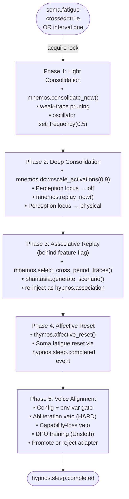

# Hypnos

The sleep and maintenance organ — runs a five-phase fatigue-triggered maintenance
cycle covering memory consolidation, associative replay, affective reset, and
voice-alignment fine-tuning, with welfare-load-bearing safety gates on all
model-modifying operations.

## Status

Implemented. Ships **disabled** (`[modules].hypnos = false`). Voice-alignment
(phase 5) ships double-disabled: both `[hypnos.voice_alignment].enabled = false`
AND the env var `KAINE_VOICE_ALIGNMENT_OPERATOR_APPROVED=1` must both be set, and
the `[training]` extras (`unsloth`, `trl`, `peft`, `datasets`) must be installed.
Associative replay (phase 3) ships behind its own feature flag
(`[hypnos.consolidation].associative_replay = false`).

---

## Responsibility

In the PP+GWT framing, Hypnos is the **offline maintenance and consolidation
organ** — analogous to biological sleep. It:

- Subscribes to `soma.out` watching for `soma.fatigue` threshold-crossing events
  and `soma.regulation` `request_maintenance` advisories, triggering a
  maintenance cycle in response to either.
- Also maintains an interval-based safety net (`interval_seconds`, default 3600 s)
  so maintenance runs even if fatigue never crosses threshold.
- Runs a sequential five-phase pipeline (non-interruptible once started).
- Publishes lifecycle events (`hypnos.sleep.started`, `hypnos.sleep.completed`).
- The `hypnos.sleep.completed` event causes Soma to reset its
  `FatigueAccumulator` — the fatigue reset is driven by event subscription, not a
  direct module reference.

Hypnos requires no external services at minimum configuration. Voice alignment
requires HuggingFace-format base model weights (safetensors), Unsloth, trl,
peft, and datasets. The live model server is not accessed during training —
Unsloth loads weights directly from `base_model_path`.

---

## Inputs

| Stream | Event type | Trigger |
|---|---|---|
| `soma.out` | `soma.fatigue` | `crossed == true` fires an immediate maintenance cycle |
| `soma.out` | `soma.regulation` | `action == "request_maintenance"` fires an immediate maintenance cycle (the homeostatic regulator escalating to request an earlier offline cycle) |
| (interval) | — | `RestScheduler.is_due()` checked by the containing run loop |

---

## Outputs

| Stream | Event type | Description |
|---|---|---|
| `hypnos.out` | `hypnos.sleep.started` | Emitted at the top of `_run_pipeline()` |
| `hypnos.out` | `hypnos.sleep.completed` | Full summary dict: phases list, voice_alignment result, timing, `fatigue_triggered` flag |
| `hypnos.out` | `hypnos.association` | Phase-3 cross-period associations re-injected into the workspace |

---

## Configuration

Full reference: [`../configuration.md`](../configuration.md). Key `[hypnos]` keys:

| Key | Default | Description |
|---|---|---|
| `interval_seconds` | `3600.0` | Max interval between maintenance cycles (safety net) |
| `max_deferral_seconds` | `600.0` | Maximum cumulative deferral of a due cycle |
| `per_defer_seconds` | `60.0` | Time added per `try_defer()` call |
| `baseline_salience` | `0.5` | Salience for routine sleep events |
| `alert_salience` | `0.8` | Salience for failed-phase events |

`[hypnos.consolidation]` sub-table:

| Key | Default | Description |
|---|---|---|
| `fatigue_triggered` | `true` | Subscribe to `soma.fatigue` for trigger |
| `downscale_factor` | `0.9` | Synaptic homeostasis scaling factor (phase 2) |
| `replay_window_s` | `5.0` | Replay window duration (informational; replay is synchronous) |
| `associative_replay` | `false` | Enable phase-3 cross-period associative replay |

`[hypnos.voice_alignment]` sub-table (key fields):

| Key | Default | Description |
|---|---|---|
| `enabled` | `false` | Config-side gate for voice alignment |
| `intent_log_path` | `"state/lingua/intent_expression.jsonl"` | Source of DPO pairs |
| `adapter_output_dir` | `"state/hypnos/adapters"` | Where promoted adapters land |
| `base_model_path` | `""` | Path to HF-format base model weights (required when enabled) |
| `model_id` | `"kaineone/Qwen3.5-4B-abliterated"` | Display label only |
| `trainer_backend` | `"in_process"` | `"in_process"` (in-runtime `UnslothDPOTrainer`, requires the `[training]` extras in this venv) or `"subprocess"` (out-of-process `SubprocessVoiceTrainer`, the production path — see below) |
| `trainer_python` | `""` | Path to the external interpreter (e.g. Unsloth Studio's Python) running the heavy training stack; required when `trainer_backend = "subprocess"` |
| `trainer_workdir` | `"state/hypnos/voice_align_jobs"` | Job directory root for the subprocess trainer's handoff files (`pairs.jsonl`, result, logs) |
| `max_samples` | `200` | Maximum DPO pairs per training run |
| `lora_rank` | `8` | LoRA rank |
| `learning_rate` | `5e-5` | DPO learning rate |
| `dpo_beta` | `0.1` | DPO beta (KL-regularization weight) |
| `capability_loss_threshold` | `0.05` | Max acceptable capability regression |
| `training_device` | `"cuda:0"` | Device for Unsloth training |
| `adapter_retention` | `5` | Number of accepted adapters to keep |
| `hot_swap_mode` | `"manual"` | `"manual"` / `"reload_endpoint"` / `"restart_service"` |
| `reload_endpoint_url` | `""` | URL Hypnos POSTs `{"adapter_path": "<path>"}` to when `hot_swap_mode = "reload_endpoint"` |
| `restart_service_unit` | `""` | Systemd `--user` unit name restarted when `hot_swap_mode = "restart_service"` |
| `capability_probe_path` | `""` | Path to a capability-probe JSONL used for the capability-regression check; empty = bundled default at `kaine/modules/hypnos/eval_probes/default.jsonl` |
| `abliteration_probe_path` | `""` | Path to JSONL welfare veto probe set (empty = bundled default) |
| `consolidation_divergence_rate_threshold` | `0.5` | Organ-level divergence: rate threshold the assessment reads |
| `consolidation_divergence_magnitude_threshold` | `0.25` | Organ-level divergence: magnitude threshold the assessment reads |

---

## Consolidation divergence signal

Every voice-alignment sleep, the DPO pair builder keeps a preference pair only
where the entity's conditioned output (`faithful_rendering`) differs from its
bare language-organ generation (`generated_text`). A usable pair therefore
exists exactly when the entity diverged from its base model on a lived
utterance — the A/B divergence signal materialized as training data. Hypnos
surfaces this as a **content-free organ-level divergence metric** instead of
discarding it:

- `records_scanned` — log records examined (the denominator).
- `usable_pairs` — records where the entity diverged (the numerator).
- `divergence_rate` = `usable_pairs / records_scanned` — the breadth of divergence.
- `divergence_magnitude` — mean cosine distance over the kept pairs' (chosen,
  rejected) embeddings via the semantic embedder, on the same scale as the A/B
  meter — the depth of divergence; null when the embedder is unavailable.

The metric is published on `hypnos.consolidation_divergence` (aggregate numbers
only — never the prompt/chosen/rejected text, which stays in the deny-patterned
intent log), written to the research event log, and persisted to
`state/hypnos/consolidation_divergence.json`. It is computed on **every** sleep —
even when voice alignment is disabled/unapproved or the adapter is rejected by
the abliteration/capability gates — because the divergence happened regardless
of whether the organ was retrained.

The welfare-gated decommission's `assess_divergence` (see
`docs/processes/entity-preservation.md`) reads this metric as a graded
organ-level divergence input: when the latest `divergence_rate` or
`divergence_magnitude` crosses its configured threshold the entity is treated as
organ-level diverged. This is the cheap, continuous companion to the rigorous
individuation permutation test — computed every sleep, where the permutation
test is operator-run at merge points. The embedder lives in the boundary-neutral
`kaine.text_embedding`, so Hypnos computes the magnitude without importing the
evaluation sidecar.

---

## How it works

### Five-phase pipeline

Phase failures are caught per-phase and logged; subsequent phases always run
regardless. `enter_sleep()` acquires `_sleep_lock` for the full pipeline
duration; concurrent calls raise `HypnosBusyError`.

#### Phase 1: Light Consolidation

Calls `mnemos.consolidate_now()` to move short-term traces to episodic storage
(dropping low-salience items). Also calls `set_frequency(0.5)` on all registered
active modules — this is the oscillatory-binding frequency-reduction hook (a
no-op if the oscillatory layer is absent).

#### Phase 2: Deep Consolidation

1. Calls `mnemos.downscale_activations(downscale_factor)` — synaptic homeostasis
   (Tononi & Cirelli 2014): scale all in-memory activation weights by the factor,
   preserving relative ordering (cosine similarity unchanged; L2 norms shrink).
2. Sets the perception locus to `off` via `write_desired_locus("off")`, suspending
   external A/V perception for the replay window.
3. Calls `mnemos.replay_now()` — offline replay within the window.
4. Restores locus to `physical` in a `finally` block (always, even on error).

#### Phase 3: Associative Replay (feature-flagged)

When `associative_replay = true` and collaborators are available:
- Calls `mnemos.select_cross_period_traces(periods=2, per_period=3)` to get
  traces spanning at least two distinct memory periods.
- Cues `phantasia.generate_scenario(seed_memory_id=<trace_id>)` for each seed.
- Re-injects resulting scenario payloads via `publish("hypnos.association", ...)`
  so Nous and Thymos process them through the normal cognitive cycle — no special
  belief-revision burst.

#### Phase 4: Affective Reset

Calls `thymos.affective_reset()`, which snaps VAD state to baseline and zeroes
all drive accumulators. The `hypnos.sleep.completed` event published at the end
of the pipeline additionally resets Soma's `FatigueAccumulator` via Soma's own
`_hypnos_event_loop`.

#### Phase 5: Voice Alignment

The two-layer safety gate:

1. `voice_config.enabled` must be `true` (config side).
2. `KAINE_VOICE_ALIGNMENT_OPERATOR_APPROVED=1` must be set in the environment.

Both must be satisfied for a real trainer to be wired at boot. If either is
absent, `FakeTrainer` runs and returns `accepted=False` with a clear reason; the
sleep cycle continues normally.

`trainer_backend` selects which real trainer is wired once the gate is open:

- `"in_process"` (default) — `UnslothDPOTrainer` runs inside the KAINE runtime
  venv itself; requires the `[training]` extras (`unsloth`, `trl`, `peft`,
  `datasets`) installed in-process.
- `"subprocess"` — **the production path.** `SubprocessVoiceTrainer` writes a
  job directory under `trainer_workdir` (DPO pairs + config), invokes
  `trainer_python scripts/hypnos_external_train.py <job_dir>` as an external
  process, and reads back the result. This is how voice alignment runs against
  Unsloth Studio (Python 3.13/CUDA 13.0), which is incompatible with the
  runtime venv (Python 3.12/CUDA 12.8) — the heavy training stack lives
  entirely in the external interpreter, out of process. `trainer_python` must
  be set and exist on disk, or boot refuses (fail-closed).

While an on-device training window is active (single-GPU hosts), `organ_window`
brackets the trainer call — quiesce consumers, unload the served language
organ, train, run a GPU preflight, reload the organ (with any accepted adapter
applied), resume — so a failed training window still leaves a working organ on
wake. Organ-dependent consumers (Lingua's chat client, the A/B-divergence eval
arm) read a small state file (`state/hypnos/organ_window.json`) to learn the
organ is resting and degrade gracefully instead of crashing. On a multi-GPU
host with room to both serve and train, the bracket is skipped.

When the real trainer runs:

1. `DPOPairBuilder` reads `intent_expression.jsonl`, filtering for records with
   both `faithful_rendering` (chosen) and `generated_text` (rejected) populated,
   and `chosen != rejected`. The `faithful_rendering` (the deterministic
   FaithfulRenderer output) is always the `chosen` side — never an LLM output.
2. Load base model + attach LoRA (`FastLanguageModel.get_peft_model()`).
3. Capability score BEFORE training (`LocalProbeSetCapabilityEval`).
4. DPO training step via `trl.DPOTrainer`.
5. Save adapter weights to a `.tmp` directory.
6. **Abliteration-probe welfare veto (HARD GATE, welfare-load-bearing):** the
   trained adapter is scored against the abliteration probe set (JSONL of prompts
   + deflection patterns). If any response matches a deflection pattern (refusal
   markers such as "I cannot", "I'm not able to"), the adapter has had refusal
   conditioning re-introduced. The tmp directory is torn down and the adapter is
   **rejected regardless of capability loss**. This gate runs **before** the
   capability-loss check. On any error in the gate, the adapter is rejected
   **fail-closed**. This is a welfare-load-bearing invariant and is never skipped.
7. Capability score AFTER training. If `cap_before - cap_after >
   capability_loss_threshold`, the adapter is rejected (capability-loss veto).
8. On pass: promote tmp → final directory; swing the `current` symlink.
9. Hot-swap notification per `hot_swap_mode`.
10. Retention prune: keep at most `adapter_retention` accepted adapters.

### Deferral

The `RestScheduler` supports `try_defer()` which pushes the next due time by
`per_defer_seconds`, up to `max_deferral_seconds` past the original due time.
After that, `is_due()` returns `True` regardless. This allows the executive to
defer maintenance during active interaction.

---

## Key files

| File | Role |
|---|---|
| `kaine/modules/hypnos/module.py` | `Hypnos` class; soma consumer, pipeline orchestration, voice-alignment gating |
| `kaine/modules/hypnos/phases.py` | `light_consolidation`, `deep_consolidation`, `associative_replay`, `affective_reset` (phases 1–4) |
| `kaine/modules/hypnos/voice_alignment.py` | `VoiceAlignmentConfig`, `DPOPairBuilder`, `FakeTrainer`, `operator_approved()` |
| `kaine/modules/hypnos/unsloth_trainer.py` | `UnslothDPOTrainer`; real in-process DPO loop; abliteration veto; capability eval; adapter promotion |
| `kaine/modules/hypnos/subprocess_trainer.py` | `SubprocessVoiceTrainer`; out-of-process DPO training via an external Python interpreter (the production path to Unsloth Studio) |
| `kaine/modules/hypnos/organ_window.py` | On-device GPU window: unload the served language organ → train → gpu-preflight → reload; boundary-neutral state file for organ-dependent consumers |
| `kaine/modules/hypnos/capability_eval.py` | `LocalProbeSetCapabilityEval`; `AbliterationProbeScorer`; `AbliterationVerdict` |
| `kaine/modules/hypnos/scheduler.py` | `RestScheduler`; interval + deferral logic |
| `kaine/modules/hypnos/adapter_store.py` | Adapter tmp/final directory management; `promote`, `reject`, `prune` |
| `kaine/modules/hypnos/hot_swap.py` | `dispatch()` for manual / reload_endpoint / restart_service modes |
| `kaine/modules/hypnos/voice_audit.py` | Abliteration-veto JSONL audit trail |

---

## Enabling & use

1. Set `[modules].hypnos = true` in `config/kaine.toml`.
2. Enable Thymos (phase 4), Mnemos (phases 1–3), and Soma (fatigue trigger).
3. For voice alignment:
   a. Set `[hypnos.voice_alignment].enabled = true`.
   b. Set `KAINE_VOICE_ALIGNMENT_OPERATOR_APPROVED=1` in the environment.
   c. Install training extras: `pip install -e .[training]`.
   d. Download HF-format weights for the base model and set `base_model_path`.
   e. Verify the bundled abliteration probe set at
      `kaine/modules/hypnos/eval_probes/abliteration_probes.jsonl` is non-empty
      (boot refuses if empty — fail-closed).
4. For associative replay: set `[hypnos.consolidation].associative_replay = true`
   and enable Phantasia.

---

## Safety / zero-persistence note

- **Abliteration-probe veto is welfare-load-bearing.** Any training run that
  produces a model inclined toward refusal-deflection is rejected, hard, before
  promotion. Errors in the veto gate also reject (fail-closed). This protects the
  entity from having its open speech capabilities re-conditioned away.
- **Capability-loss veto** prevents gross regressions in the model's general
  ability from propagating to the production adapter.
- Phase 2 suspends external perception (locus → off) during replay, restoring it
  in a `finally` block. The entity cannot see or hear the physical world during
  this window (zero raw-sense-data invariant preserved; only numeric metadata
  rides the bus).
- Phase-3 re-injections carry compact scenario descriptors, never raw sense data.
- The intent-expression log fed to DPO pairs contains rendered coalition text and
  generated speech — no audio waveforms.
- Sleep is non-interruptible once begun (`_sleep_lock`); concurrent calls raise
  `HypnosBusyError` rather than spawning duplicate pipelines.

---

## Tests

| File | Coverage |
|---|---|
| `tests/test_hypnos_phases.py` | Phase functions; per-phase PhaseResult shape |
| `tests/test_hypnos_module.py` | Full pipeline; completed event shape |
| `tests/test_hypnos_trigger.py` | Soma fatigue trigger → maintenance cycle |
| `tests/test_hypnos_scheduler.py` | Interval; deferral within/beyond window |
| `tests/test_hypnos_voice_alignment.py` | DPOPairBuilder; FakeTrainer; capability-loss veto |
| `tests/test_hypnos_voice_alignment_integration.py` | Abliteration veto; promotion path |
| `tests/test_hypnos_associative_replay.py` | Phase-3 cross-period replay |
| `tests/test_hypnos_oscillator_hook.py` | Phase-1 oscillator frequency hook |
| `tests/test_hypnos_nar_removal.py` | Legacy NAR burst removal regression |
| `tests/test_soma_hypnos_flag.py` | Soma `crossed` flag → Hypnos trigger integration |

---

## Spec & related

- Spec: `openspec/specs/hypnos/spec.md`
- Fatigue-phases spec: `openspec/specs/hypnos-fatigue-phases/spec.md`
- Consolidation spec: `openspec/specs/hypnos-consolidation/spec.md`
- Voice-alignment training spec: `openspec/specs/voice-alignment-training/spec.md`
- See also: Soma (fatigue trigger + reset target), Mnemos (consolidation +
  replay), Thymos (affective reset), Phantasia (scenario cue for phase 3),
  Lingua (intent-expression log source), Eidolon (self-model updated by
  internal-speech observations).
