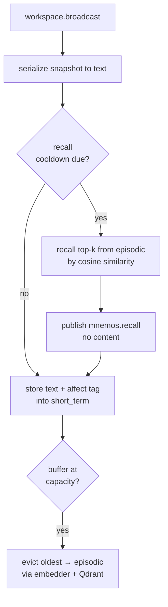

# Mnemos

**Gated** — built and tested, shipped disabled; held behind a positive base-thesis result (see [Architecture](../architecture.md)).

KAINE's episodic memory organ: vector-embedding store with affect-tagged traces, Hypnos-gated replay, and workspace re-injection.

---

## Status

Implemented. Ships **disabled** — `[modules].mnemos = false` in `config/kaine.toml`.

- Production backend: Qdrant (requires a running Qdrant container and `KAINE_QDRANT_API_KEY`).
- Test/minimal backend: `InMemoryStorage` (no external services; `backend = "inmemory"`).
- Embedder: `sentence-transformers/all-MiniLM-L6-v2` (384-dim, ~80 MB, CPU-pinned by default).
- No extra install required for the module itself; sentence-transformers must be present (`.[memory]` or similar).

---

## Responsibility

In the PP+GWT framing, Mnemos is the episodic memory system. It encodes and stores what passes through the Syneidesis workspace, retrieves related memories as semantic cues, and during Hypnos maintenance re-injects emotionally significant or temporally salient past traces for associative consolidation.

Key design commitments:
- **Recall before store** — each waking tick, recall fires against prior memories *before* the current snapshot is stored, so the cue retrieves prior related experience, not the trace being stored this cycle.
- **Affect tagging** — every stored trace carries the Thymos VAD state at store time as plain numerics (intensity, valence, dominance). No raw sense data.
- **Replay gated to Hypnos window** — `replay()` raises `ReplayWindowError` if called while awake.

---

## Inputs

| Source | Stream / event | What is used |
|---|---|---|
| Syneidesis | `workspace.broadcast` | Snapshot serialized to text for store + recall cue |
| Thymos | `thymos.out` / `thymos.state` | VAD numbers cached as affect tag for next store |
| Hypnos | `hypnos.out` / `hypnos.sleep.started` | Opens the replay window |
| Hypnos | `hypnos.out` / `hypnos.sleep.completed` | Closes the replay window |

Thymos and Hypnos events are consumed by a background `_peer_consumer_loop` task, not the workspace callback, so Mnemos maintains up-to-date affect independently of whether any broadcast fires.

---

## Outputs

| Stream | Event type | Key payload fields | Salience |
|---|---|---|---|
| `mnemos.out` | `mnemos.recall` | `count`, `collection`, `query_length`, `max_affect_intensity` | `alert_salience` if max_affect_intensity ≥ 0.5, else `baseline_salience` |
| `mnemos.out` | `mnemos.replay` | `memory_id`, `text`, `affect`, `affect_intensity`, `source_timestamp`, `replayed_at` | `baseline_salience` |

The `mnemos.recall` event carries **no memory content or raw query** — only diagnostics. Raw text is present in `mnemos.replay` because it must be re-processed by the cognitive loop (Nous, Thymos, Eidolon, Phantasia) during maintenance.

---

## Configuration

All keys under `[mnemos]` and sub-tables. See also [`../configuration.md`](../configuration.md).

| Key | Default | Description |
|---|---|---|
| `backend` | `"qdrant"` | Storage backend: `"qdrant"` or `"inmemory"` |
| `collection_prefix` | `"mnemos_"` | Qdrant collection name prefix |
| `short_term_capacity` | `128` | In-process ring-buffer size; overflow consolidates to episodic |
| `recall_top_k` | `5` | Default `k` for cosine-similarity recall |
| `embedder_model_id` | `"sentence-transformers/all-MiniLM-L6-v2"` | HuggingFace model for embedding |
| `device` | `"cpu"` | Embedder device (`"cpu"`, `"cuda"`, etc.) |
| `baseline_salience` | `0.15` | Default salience |
| `alert_salience` | `0.6` | Salience on high-affect recall |
| `recall_on_workspace` | `true` | Whether recall fires against prior memories on each workspace broadcast tick |
| `recall_cooldown_s` | `5.0` | Minimum seconds between recall firings; a cognitive timer that dilates with `time_scale` |
| `[mnemos.qdrant].host` | `"127.0.0.1"` | Qdrant host |
| `[mnemos.qdrant].port` | `6533` | Qdrant port |
| `[mnemos.replay].selection_top_k` | `5` | Traces selected per maintenance window |
| `[mnemos.replay].affect_weight` | `0.7` | Weight on affect intensity in replay score |
| `[mnemos.replay].recency_weight` | `0.3` | Weight on recency in replay score |
| `[mnemos.replay].redact_content` | `true` | Strip `text` from sidecar/observer replay payloads |

The Qdrant API key is read from `config/secrets.toml` (`[qdrant].api_key`) or the environment; Mnemos refuses to construct `QdrantStorage` without it.

---

## How it works

### Memory collections

Mnemos manages four named collections:

| Collection | Backing | Notes |
|---|---|---|
| `short_term` | In-process `deque` (capacity 128) | Not persisted; oldest entry auto-evicts to `episodic` at capacity |
| `episodic` | Qdrant | Waking traces consolidated from short-term |
| `semantic` | Qdrant | Future: conceptual/factual knowledge |
| `procedural` | Qdrant | Future: skill/procedure traces |

### Per-tick lifecycle



Recall is throttled by `recall_cooldown_s` (default 5 s) to avoid overwhelming the bus with recall events on every tick.

### Embedder (`SentenceTransformerEmbedder`)

Wraps `sentence-transformers/all-MiniLM-L6-v2` (384-dim). Loads lazily on first `encode()` call or at `initialize()`. Pins HF telemetry off (`HF_HUB_DISABLE_TELEMETRY=1`). Device is resolved by `kaine.hardware.resolve_device` — falls back gracefully.

For tests: `FakeEmbedder` maps text to a deterministic 32-dim blake2b digest vector. No external dependencies.

### Affect tagging

The background `_peer_consumer_loop` subscribes to `thymos.out` and caches the latest `thymos.state` as:

```python
{"intensity": arousal, "valence": valence, "dominance": dominance}
```

Only plain numerics are stored — no raw event content. Every `store()` call on the workspace path attaches `self._cached_affect` to the `StoredMemory`.

### Replay engine (`ReplayEngine`)

During a Hypnos maintenance window, `replay_now()` is called by Hypnos's orchestrator. The `ReplayEngine`:

1. Raises `ReplayWindowError` if `window_active` is False (load-bearing safety guard).
2. Scores candidates: `score = affect_weight × intensity + recency_weight × recency_norm`.
3. Selects top-k traces by score.
4. Builds `ReplayEvent` pairs: `loop_payload` (full text; published on the bus) and `observer_payload` (text stripped when `redact_content=True`).

### `select_cross_period_traces()`

Used by Hypnos phase 3 (associative consolidation). Sorts all available traces (short-term + episodic) by timestamp, divides into `periods` equal-width time windows, and samples up to `per_period` traces per window. Returns a `{period_label: [trace_dict, ...]}` mapping — affect fields included as plain numerics; no raw sense data.

### `downscale_activations(factor)`

Synaptic homeostasis (Tononi & Cirelli 2014): scales all in-memory activation vectors by `factor` ∈ (0, 1). Preserves cosine similarity; only L2 norms shrink. Called by Hypnos phase 2. No-op on `QdrantStorage` (no in-memory vectors to scale).

---

## Key files

| Path | Purpose |
|---|---|
| `kaine/modules/mnemos/module.py` | `Mnemos(BaseModule)` — tick driver, affect consumer, replay API |
| `kaine/modules/mnemos/memory.py` | `MnemosCore` (store/recall/consolidate), `StoredMemory`, `RecallSummary`, `EmotionalRetriggerHook` |
| `kaine/modules/mnemos/storage.py` | `MemoryStorage` protocol, `QdrantStorage`, `InMemoryStorage`, `RecalledMemory` |
| `kaine/text_embedding.py` | `Embedder` protocol, `SentenceTransformerTextEmbedder`, `FakeEmbedder` — the boundary-neutral home shared by Mnemos, Hypnos, Empatheia, and the evaluation sidecar |
| `kaine/modules/mnemos/embeddings.py` | Back-compat re-export shim of `kaine.text_embedding` names for existing Mnemos import sites; no second implementation |
| `kaine/modules/mnemos/replay.py` | `ReplayEngine`, `ReplayEntry`, `ReplayEvent`, `select_traces`, `build_replay_events` |
| `kaine/boot.py` | `make_mnemos()` — Qdrant config, replay sub-table wiring |

---

## Enabling and use

1. Start the Qdrant container: `docker compose -f compose/qdrant.yml up -d`
2. Bootstrap (first time): `bash scripts/qdrant-bootstrap.sh` — generates the API key, writes it to `compose/.env` and `config/secrets.toml`, confirms `/readyz`.
3. Edit `config/kaine.toml`: set `[modules].mnemos = true`.
4. Optional: to use the in-memory backend (no Qdrant), set `backend = "inmemory"` and omit the `api_key`.

Replay is triggered by Hypnos. To trigger manually (in tests):

```python
await mnemos.replay_engine.open_window_for_test()  # or inject via constructor
events = await mnemos.replay_now()
```

---

## Zero-persistence note

`mnemos.recall` and `mnemos.replay` event payloads contain **no raw sense data**. The stored `text` field is a deterministic serialization of event source/type/salience strings from the workspace — not raw audio, images, or speech transcripts. Affect tags are plain floats. The `redact_content=True` default strips even these from observer/sidecar payloads.

`Mnemos.serialize()` emits only `short_term_size` and `collection_prefix` — no memory content.

---

## Tests

| File | Coverage |
|---|---|
| `tests/test_mnemos_memory.py` | `MnemosCore` store/recall/consolidate with `FakeEmbedder` + `InMemoryStorage` |
| `tests/test_mnemos_storage.py` | `InMemoryStorage` cosine search, `QdrantStorage` (mocked) |
| `tests/test_mnemos_embeddings.py` | `FakeEmbedder` determinism, `SentenceTransformerEmbedder` lazy load |
| `tests/test_mnemos_replay.py` | `select_traces` scoring, `ReplayEngine` window guard, `ReplayWindowError` |
| `tests/test_mnemos_replay_redact.py` | `redact_content` behavior in observer payloads |
| `tests/test_mnemos_module.py` | Full `Mnemos` tick; affect caching; recall cooldown; `recall_before_store` ordering |
| `tests/systems/test_mnemos_subsystem.py` | End-to-end subsystem test |

---

## Spec and related

- Primary spec: [`openspec/specs/mnemos/spec.md`](../../openspec/specs/mnemos/spec.md)
- Replay spec: [`openspec/specs/mnemos-replay/spec.md`](../../openspec/specs/mnemos-replay/spec.md)
- Related modules: [Hypnos](hypnos.md) (replay window, consolidation), [Thymos](thymos.md) (affect tags), [Phantasia](phantasia.md) (scenario generation from replay cues), [Nous](nous.md) (`nous.belief` consumer)
