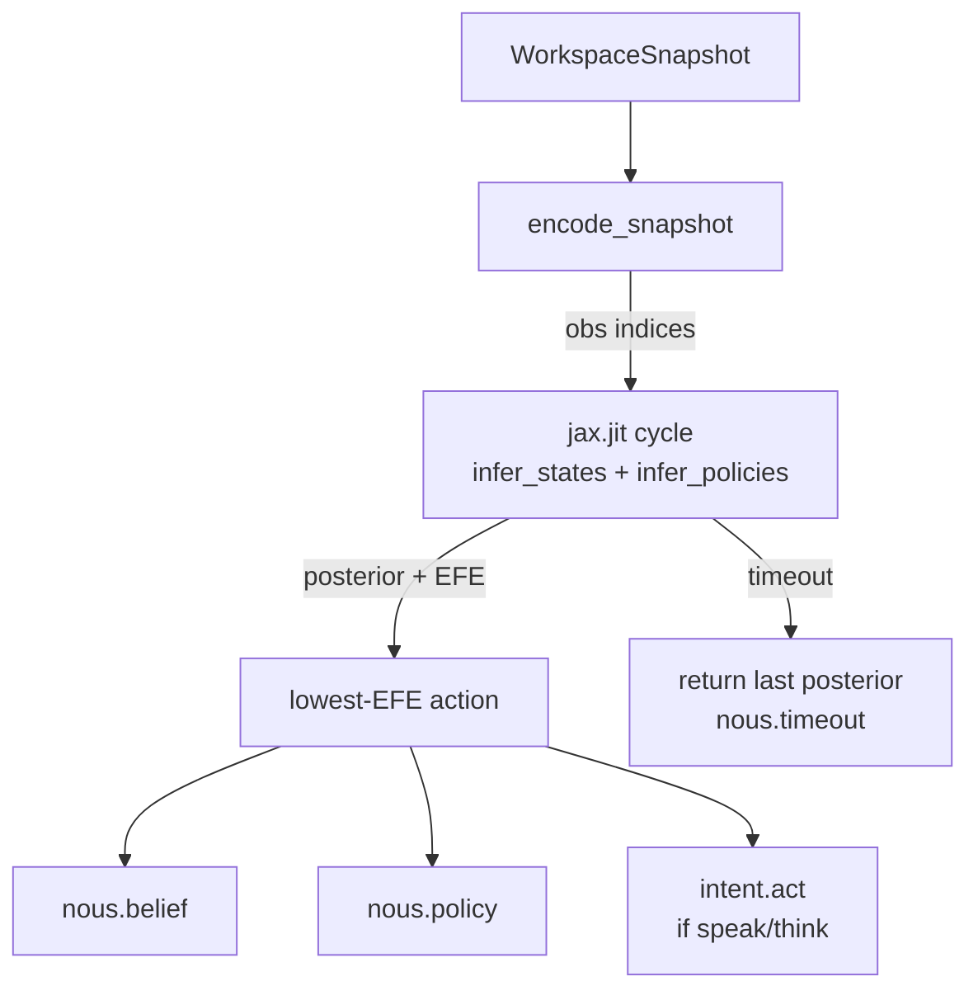

# Nous

KAINE's reasoning organ: active-inference belief updating and policy selection over a compact discrete generative model.

---

## Status

Implemented. Ships **disabled** — `[modules].nous = false` in `config/kaine.toml`.

- Requires the `[reasoning]` optional extra: `inferactively-pymdp >= 1.0` and `jax[cpu]`.
- No CUDA required; the JAX backend runs CPU-only within the ~300 ms cycle budget.
- NARS/ONA (the previous symbolic reasoner) has been archived to `external/archive/nous_narsese/`; a future complementary symbolic module may draw on it.

---

## Responsibility

In the predictive-processing / global-workspace (PP+GWT) framing, Nous is the entity's deliberative reasoning module. It replaces reflex-level salience selection with explicit probabilistic inference: given what is currently conscious (the Syneidesis broadcast), what is the most likely state of the world, and what should be done next?

Each time Syneidesis broadcasts a workspace snapshot (10 Hz), Nous:

1. **Updates beliefs** — runs variational inference over a compact discrete generative model, producing a posterior over hidden states (salience band, affect quadrant, event cluster, action latent).
2. **Selects a policy** — evaluates expected free energy (EFE) for each candidate action and picks the lowest-EFE policy.
3. **Proposes an action** — emits the chosen action as an `intent.act` event on the Volition/intent path. **Nous proposes; the executive disposes.** Syneidesis inhibition and Praxis whitelists remain in full control of any outward action.

---

## Inputs

| Source | Stream / path | Event type | What is used |
|---|---|---|---|
| Syneidesis | `workspace.broadcast` | — | `WorkspaceSnapshot.selected_events` — the conscious coalition |
| (implicit) | Thymos events in coalition | `thymos.state` | `valence`, `arousal` fields for affect quadrant encoding |

The encoder (`generative_model.encode_snapshot`) reads the snapshot's most-salient event to determine salience band and event-cluster observations; Thymos-sourced events provide the affect quadrant.

---

## Outputs

| Stream | Event type | Key payload fields | Salience |
|---|---|---|---|
| `nous.out` | `nous.belief` | `statement` (dominant latent label), `kind="belief"`, `frequency` (posterior max), `confidence` (1 − normalised entropy) | `alert_salience` when confidence ≥ 0.75, else `baseline_salience` |
| `nous.out` | `nous.policy` | `policy` (action name), `expected_free_energy` (float), `horizon=1` | `baseline_salience` |
| `nous.out` | `intent.act` | `kind` (`"think"` or `"speak"`), `about` (action name) | `baseline_salience` |
| `nous.out` | `nous.timeout` | `elapsed_ms`, `num_factors`, `num_actions` | `timeout_salience` (0.3) |
| `nous.out` | `nous.error` | `error_reason`, `elapsed_ms`, `num_factors`, `num_actions` | `timeout_salience` (0.3) |

`no_op` and `request_maintenance` actions produce no `intent.act`. `request_think` maps to `kind="think"` (epistemic; no Praxis whitelist required). `request_speak` maps to `kind="speak"` (communicative; subject to Praxis). `nous.error` is published on a non-timeout inference crash: the engine returns stale priors and sets `EngineResult.error=True`, and `nous.belief`/`nous.policy` are skipped for that cycle so stale priors are never re-broadcast as a fresh computation — distinct from `nous.timeout`, which still publishes belief/policy from the last good posterior.

---

## Configuration

All keys live under `[nous]` in `config/kaine.toml`. See also [`../configuration.md`](../configuration.md).

| Key | Default | Description |
|---|---|---|
| `factors` | `4` | Number of hidden-state factors (complexity envelope) |
| `max_states_per_factor` | `4` | State count cap per factor |
| `actions` | `4` | Size of the action space |
| `planning_horizon` | `1` | Policy length (single-step in v1) |
| `efe_timeout_ms` | `250` | Hard EFE planning deadline (ms); on overrun returns last posterior |
| `baseline_salience` | `0.4` | Default event salience |
| `alert_salience` | `0.8` | Salience when belief confidence ≥ 0.75 |
| `timeout_salience` | `0.3` | Salience for `nous.timeout` and `nous.error` diagnostics |

`make_nous` in `kaine/boot.py` validates the complexity envelope: `factors × max_states_per_factor × actions × planning_horizon` must not exceed 4096. The shipped defaults give a product of 64, well within budget.

---

## How it works

### Generative model (A/B/C/D)

The model (`kaine/modules/nous/generative_model.py`) is a compact **four-factor, four-modality** discrete active-inference model built once at boot with `build_generative_model()`.

**Hidden-state factors (and action space):**

| Factor index | Name | States | Notes |
|---|---|---|---|
| 0 | `action_latent` | `no_op`, `request_think`, `request_speak`, `request_maintenance` | Controllable; B-matrix is deterministic (action → state) |
| 1 | `salience_band` | `low`, `medium`, `high` | Uncontrollable; identity transition |
| 2 | `affect_quadrant` | `calm_pleasant`, `excited_pleasant`, `calm_unpleasant`, `excited_unpleasant` | Derived from Thymos VAD |
| 3 | `event_cluster` | `other`, `perception`, `affect`, `self` | Dominant event source bucketed |

One observation modality per factor (square model). Likelihood **A**: identity for the action factor; soft-diagonal (confidence 0.9 by default) for perceptual factors. Preferences **C**: mildly prefer `salience_high` observation. Prior **D**: uniform over perceptual factors; `no_op` prior on the action latent. The online-growth seam (`register_event_cluster`) allows adding event-cluster states without growing factor count.

### Inference cycle (engine)

`kaine/modules/nous/engine.py` hosts `PymdpEngine`, which wraps a `pymdp.agent.Agent` (JAX):

1. **Encode** — `encode_snapshot(snapshot, model)` maps the workspace broadcast to four integer observation indices.
2. **JIT-compiled cycle** — a `jax.jit`'d function runs `Agent.infer_states` (variational message passing) then `Agent.infer_policies` (EFE per policy) in one traced call. Plain dispatch cost is ~130 ms/call; JIT reduces this to well under 1 ms on CPU.
3. **Timeout guard** — the `_infer` call is submitted to a `ThreadPoolExecutor(max_workers=1)` with a deadline of `efe_timeout_ms` (250 ms default). On `FuturesTimeout`, the engine returns the last good posterior, sets `EngineResult.timed_out=True`, and the module publishes `nous.timeout` then continues normally.
4. **Action selection** — the policy with the lowest EFE is selected; `EngineResult.action` is the string name.



### `nous.belief` contract (preserved, reinterpreted)

The payload shape is preserved from the NARS era so all consumers (Mnemos, Eidolon, Syneidesis) keep working. Semantics are redefined:

- `statement` = human-readable label of the dominant latent factor (e.g. `"salience_high"`), derived via `EngineResult.dominant_factor()` which selects the lowest-entropy non-action factor.
- `frequency` = posterior expectation (max probability mass) in that factor.
- `confidence` = `1 − normalised_entropy(factor_distribution)`, clamped to [0, 1].
- `kind` = `"belief"` (always).

### FakeEngine

`FakeEngine` implements the `ActiveInferenceEngine` protocol with scripted posteriors — no pymdp, no JAX. All module-level tests inject it. The engine protocol is `@runtime_checkable`, so `isinstance` checks work without importing pymdp.

---

## Key files

| Path | Purpose |
|---|---|
| `kaine/modules/nous/module.py` | `Nous(BaseModule)` — tick driver, publications, action routing |
| `kaine/modules/nous/engine.py` | `PymdpEngine`, `FakeEngine`, `ActiveInferenceEngine` protocol, `EngineResult`, `normalised_entropy` |
| `kaine/modules/nous/generative_model.py` | `build_generative_model()`, `encode_snapshot()`, A/B/C/D construction, `ACTION_SPACE` |
| `kaine/boot.py` | `make_nous()` — complexity envelope validation, engine construction |
| `external/archive/nous_narsese/` | Archived NARS/ONA reasoner (retired; kept for future symbolic module reference) |

---

## Enabling and use

1. Install the reasoning extra: `.venv/bin/pip install -e '.[reasoning]'`
2. Edit `config/kaine.toml`: set `[modules].nous = true`.
3. JAX warms up on first boot (traces the JIT cycle against a dummy observation). The first live step is not the slow one.
4. No external services required (Nous is fully local; pymdp runs in-process).

To switch backends during testing, inject a `FakeEngine`:

```python
from kaine.modules.nous.engine import FakeEngine
from kaine.modules.nous.module import Nous

module = Nous(bus, engine=FakeEngine())
```

---

## Zero-persistence note

`Nous.serialize()` emits only the last action label and numeric posteriors (no event content, no raw workspace data). The posteriors enable `NousMergeStrategy` to pick the lower-entropy fork on a lifecycle merge. No text or sense data is ever written to disk by Nous.

---

## Tests

| File | Coverage |
|---|---|
| `tests/test_nous_engine.py` | `PymdpEngine` timeout guard, `FakeEngine` scripted steps, `normalised_entropy` |
| `tests/test_nous_generative_model.py` | A/B/C/D shapes, `encode_snapshot` cases, `register_event_cluster` |
| `tests/test_nous_module.py` | Full `Nous` tick with `FakeEngine`; `nous.belief`, `nous.policy`, `intent.act` payloads; timeout path; `nous.timeout` salience |
| `tests/test_nous_health_probe.py` | Complexity envelope validation in `make_nous` |
| `tests/systems/test_nous_subsystem.py` | End-to-end subsystem test |

---

## Spec and related

- Primary spec: [`openspec/specs/nous-active-inference/spec.md`](../../openspec/specs/nous-active-inference/spec.md) (pymdp swap)
- NARS-era history (superseded, retired): [`openspec/changes/archive/2026-06-07-nous-pymdp-swap/`](../../openspec/changes/archive/2026-06-07-nous-pymdp-swap/) (the full-replacement change) and [`openspec/changes/archive/2026-05-20-nous/`](../../openspec/changes/archive/2026-05-20-nous/) (the original ONA integration)
- Related modules: [Syneidesis](../architecture.md) (workspace broadcast), [Thymos](thymos.md) (affect quadrant input), [Mnemos](mnemos.md) (`nous.belief` consumer), [Eidolon](eidolon.md) (`nous.policy` consumer via self-inference), [Praxis](praxis.md) (whitelist gates `intent.act`)
