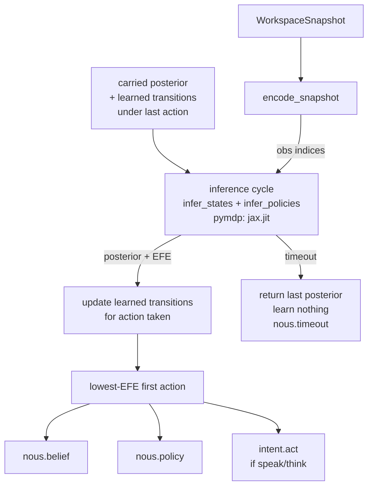

# Nous

**Gated** — built and tested, shipped disabled; held behind a positive base-thesis result (see [Architecture](../architecture.md)).

KAINE's reasoning organ: active-inference belief updating and policy selection over a compact discrete generative model.

---

## Status

Implemented. Ships **disabled** — `[modules].nous = false` in `config/kaine.toml`.

- Choose a backend with `[nous].backend`. The `"pymdp"` backend requires the `[reasoning]` optional extra: `inferactively-pymdp >= 1.0` and `jax[cpu]`. The `"numpy"` backend uses only NumPy and requires no extra.
- No CUDA required; the JAX backend runs CPU-only within the ~300 ms cycle budget.
- NARS/ONA (the previous symbolic reasoner) has been archived to `external/archive/nous_narsese/`; a future complementary symbolic module may draw on it.

---

## Responsibility

In the predictive-processing / global-workspace (PP+GWT) framing, Nous is the entity's deliberative reasoning module. It replaces reflex-level salience selection with explicit probabilistic inference: given what is currently conscious (the Syneidesis broadcast), what is the most likely state of the world, and what should be done next?

Each time Syneidesis broadcasts a workspace snapshot (10 Hz), Nous:

1. **Updates beliefs** — runs variational inference over a compact discrete generative model, producing a posterior over hidden states (salience band, affect quadrant, event cluster, action latent).
2. **Selects a policy** — evaluates expected free energy (EFE) for each candidate action and picks the lowest-EFE policy.
3. **Proposes an action** — emits the chosen action as an `intent.act` event on the Volition/intent path. **Nous proposes; the executive disposes.** Syneidesis inhibition and Praxis whitelists remain in full control of any outward action.

---

## Inputs

| Source | Stream / path | Event type | What is used |
|---|---|---|---|
| Syneidesis | `workspace.broadcast` | — | `WorkspaceSnapshot.selected_events` — the conscious coalition |
| (implicit) | Thymos events in coalition | `thymos.state` | `valence`, `arousal` fields for affect quadrant encoding |

The encoder (`generative_model.encode_snapshot`) reads the snapshot's most-salient event to determine salience band and event-cluster observations; Thymos-sourced events provide the affect quadrant.

---

## Outputs

| Stream | Event type | Key payload fields | Salience |
|---|---|---|---|
| `nous.out` | `nous.belief` | `statement` (dominant latent label), `kind="belief"`, `frequency` (posterior max), `confidence` (1 − normalised entropy) | `alert_salience` when confidence ≥ 0.75, else `baseline_salience` |
| `nous.out` | `nous.policy` | `policy` (action name), `expected_free_energy` (float), `horizon`, `param_info_gain` | `baseline_salience` |
| `nous.out` | `intent.act` | `kind` (`"think"` or `"speak"`), `about` (action name) | `baseline_salience` |
| `nous.out` | `nous.timeout` | `elapsed_ms`, `num_factors`, `num_actions` | `timeout_salience` (0.3) |
| `nous.out` | `nous.error` | `error_reason`, `elapsed_ms`, `num_factors`, `num_actions` | `timeout_salience` (0.3) |

`no_op` and `request_maintenance` actions produce no `intent.act`. `request_think` maps to `kind="think"` and `request_speak` to `kind="speak"`. No module realizes these intents: they are published on `nous.out`, which Volition, Praxis and Lingua do not read, and Hypnos counts them as unrealizable. A choice therefore reaches the world only through its own intent event, which re-enters the workspace like any other event, and that is what Nous can learn about. `nous.error` is published on a non-timeout inference crash: the engine keeps the carried belief, sets `EngineResult.error=True`, and skips `nous.belief`/`nous.policy` for that cycle so the unchanged prior is never re-broadcast as a fresh computation. No learning occurs on a timed-out or failed step; the next step resumes from the last carried posterior.

---

## Configuration

All keys live under `[nous]` in `config/kaine.toml`. See also [`../configuration.md`](../configuration.md).

| Key | Default | Description |
|---|---|---|
| `backend` | `"pymdp"` | Active-inference backend: `"pymdp"` (JAX/jit; requires `[reasoning]` extra) or `"numpy"` (NumPy; no extra). Unknown values raise `ConfigurationError` at boot. |
| `factors` | `4` | Number of hidden-state factors (complexity envelope) |
| `max_states_per_factor` | `4` | State count cap per factor |
| `actions` | `4` | Size of the action space |
| `planning_horizon` | `1` | Policy length (single-step in v1) |
| `efe_timeout_ms` | `250` | Hard EFE planning deadline (ms); on overrun returns last posterior |
| `transition_persistence` | `0.8` | Dirichlet prior weight favouring perceptual-factor persistence |
| `transition_concentration` | `1.0` | Dirichlet prior confidence (low = broad initial uncertainty) |
| `transition_max_concentration` | `1000.0` | Upper bound on the evidence in any transition column; larger columns are rescaled, so the being stays able to learn from change |
| `baseline_salience` | `0.4` | Default event salience |
| `alert_salience` | `0.8` | Salience when belief confidence ≥ 0.75 |
| `timeout_salience` | `0.3` | Salience for `nous.timeout` and `nous.error` diagnostics |

`make_nous` in `kaine/boot.py` validates the complexity envelope: `factors × max_states_per_factor × actions × planning_horizon` must not exceed 4096. The shipped defaults give a product of 64, well within budget.

---

## How it works

### Generative model (A/B/C/D)

The model (`kaine/modules/nous/generative_model.py`) is a compact **four-factor, four-modality** discrete active-inference model built once at boot with `build_generative_model()`.

**Hidden-state factors (and action space):**

| Factor index | Name | States | Notes |
|---|---|---|---|
| 0 | `action_latent` | `no_op`, `request_think`, `request_speak`, `request_maintenance` | Controllable; the chosen action becomes the next action-latent state |
| 1 | `salience_band` | `low`, `medium`, `high` | Transition beliefs are action-dependent and learned |
| 2 | `affect_quadrant` | `calm_pleasant`, `excited_pleasant`, `calm_unpleasant`, `excited_unpleasant` | Derived from Thymos VAD; transition beliefs are action-dependent and learned |
| 3 | `event_cluster` | `other`, `perception`, `affect`, `self` | Dominant event source bucketed; transition beliefs are action-dependent and learned |

One observation modality per factor (square model). Likelihood **A**: identity for the action factor; soft-diagonal (confidence 0.9 by default) for perceptual factors. Transition beliefs **B**: every perceptual factor has a separate Dirichlet prior over its next state for each action. At boot all perceptual factors share the same broad, uncertain prior: `transition_persistence` (default 0.8) weights the diagonal, and `transition_concentration` (default 1.0) keeps the prior weak. No action's effect is written into the model. After each step, the engine updates the Dirichlet belief for the action taken using the inferred pre-step and post-step states. Preferences **C**: mildly prefer `salience_high` observation, plus expected information gain about the still-uncertain transition beliefs. Because EFE includes that parameter information gain, Nous samples actions whose consequences it is less sure of; as its model sharpens, the salience preference pulls selection toward actions that bring salient observations. A fresh being samples its actions; a mature being's choices reflect what it has learned. Belief carries over: each step's prior is the previous posterior propagated through the learned transition beliefs under the action taken, not a reset to **D**. The initial **D** is uniform over perceptual factors with a `no_op` prior on the action latent; after the first step the posterior becomes the starting point for the next. The online-growth seam (`register_event_cluster`) allows adding event-cluster states without growing factor count.

### Inference cycle (engine)

`kaine/modules/nous/engine.py` hosts `_EngineBase` — the common machinery shared by both active-inference engines — plus `PymdpEngine`, `FakeEngine`, the `ActiveInferenceEngine` protocol, `EngineResult`, and `normalised_entropy`. `kaine/modules/nous/numpy_engine.py` hosts `NumpyActiveInferenceEngine`, which delegates fixed-point inference and learning to `NumpyAgent` in `kaine/modules/nous/numpy_aif.py`.

Both backends implement the same generative model and mathematics: fixed-point state inference, full policy enumeration, expected free energy with utility, state information gain and transition-parameter information gain, Dirichlet transition learning, the carried prior, the evidence cap, and the fixed action factor. They share `_EngineBase` behaviour: the `efe_timeout_ms` guard, per-action EFE aggregation, learning bookkeeping, generation counter, `record_taken_action`, and `learned_state()` / `load_learned_state()`. A learned state saved by one engine loads into the other.

Cycle steps common to both engines:

1. **Encode** — `encode_snapshot(snapshot, model)` maps the workspace broadcast to four integer observation indices.
2. **Carry prior in** — the step's prior is the posterior carried from the previous step, propagated through the learned transition beliefs under the action that was taken (the initial prior **D** is used only on the first step). The action factor's observation is the action actually taken, and its transitions are held fixed.
3. **Inference + planning** — the engine runs variational state inference then computes expected free energy for each candidate policy. The `pymdp` backend performs this in one `jax.jit`'d call to `Agent.infer_states` + `Agent.infer_policies`, and warms up by tracing that JIT cycle once at boot. A jitted step takes well under one millisecond on CPU. The `numpy` backend uses explicit fixed-point message passing and a NumPy EFE sum over policies, needs no warm-up, and a median step on the default live model takes about 2 ms on a desktop CPU.
4. **Learning update** — inside the same timeout guard, the engine updates the Dirichlet transition beliefs (**pB**) for the action taken using the inferred pre-step and post-step states. A timed-out or failed step learns nothing and keeps the carried belief.
5. **Timeout guard** — the `_infer` call is submitted to a `ThreadPoolExecutor(max_workers=1)` with a deadline of `efe_timeout_ms` (250 ms default). On `FuturesTimeout`, the engine returns the last good posterior, sets `EngineResult.timed_out=True`, and the module publishes `nous.timeout` then continues normally.
6. **Action selection** — per-action EFE is the best EFE among the policies beginning with that action; the overall lowest-EFE policy is selected and `EngineResult.action` is its first action.


```mermaid
flowchart TD
    WS[WorkspaceSnapshot] --> ENC[encode_snapshot]
    PRIOR[carried posterior\n+ learned transitions\nunder last action] --> INFER
    ENC --> |obs indices| INFER[inference cycle\ninfer_states + infer_policies\npymdp: jax.jit]
    INFER --> |posterior + EFE| LEARN[update learned transitions\nfor action taken]
    LEARN --> SEL[lowest-EFE first action]
    SEL --> BELIEF[nous.belief]
    SEL --> POLICY[nous.policy]
    SEL --> INTENT[intent.act\nif speak/think]
    INFER -- timeout --> LAST[return last posterior\nlearn nothing\nnous.timeout]
```

`nous.policy` reports the chosen action, the planning horizon, the per-policy expected free energy, and `param_info_gain`, which is true when expected free energy includes the information to be gained about the learned transitions.

### `nous.belief` contract (preserved, reinterpreted)

The payload shape is preserved from the NARS era so all consumers (Mnemos, Eidolon, Syneidesis) keep working. Semantics are redefined:

- `statement` = human-readable label of the dominant latent factor (e.g. `"salience_high"`), derived via `EngineResult.dominant_factor()` which selects the lowest-entropy non-action factor.
- `frequency` = posterior expectation (max probability mass) in that factor.
- `confidence` = `1 − normalised_entropy(factor_distribution)`, clamped to [0, 1].
- `kind` = `"belief"` (always).

### FakeEngine

`FakeEngine` implements the `ActiveInferenceEngine` protocol with scripted posteriors — no pymdp, no JAX. All module-level tests inject it. The engine protocol is `@runtime_checkable`, so `isinstance` checks work without importing pymdp.

---

## Key files

| Path | Purpose |
|---|---|
| `kaine/modules/nous/module.py` | `Nous(BaseModule)` — tick driver, publications, action routing |
| `kaine/modules/nous/engine.py` | `_EngineBase`, `PymdpEngine`, `FakeEngine`, `ActiveInferenceEngine` protocol, `EngineResult`, `normalised_entropy` |
| `kaine/modules/nous/numpy_engine.py` | `NumpyActiveInferenceEngine` — NumPy active-inference backend |
| `kaine/modules/nous/numpy_aif.py` | `NumpyAgent` — NumPy state inference, EFE, and Dirichlet learning |
| `kaine/modules/nous/generative_model.py` | `build_generative_model()`, `encode_snapshot()`, A/B/C/D construction, `ACTION_SPACE` |
| `kaine/boot.py` | `make_nous()` — complexity envelope validation, engine construction |
| `external/archive/nous_narsese/` | Archived NARS/ONA reasoner (retired; kept for future symbolic module reference) |

---

## Enabling and use

1. Choose a backend in `[nous]`: `backend = "pymdp"` (default; requires the `[reasoning]` extra) or `backend = "numpy"` (NumPy only, no extra). For the `pymdp` backend, install the reasoning extra: `.venv/bin/pip install -e '.[reasoning]'`.
2. Edit `config/kaine.toml`: set `[modules].nous = true`.
3. The `pymdp` backend warms up by tracing the JIT cycle once at boot (against a dummy observation); the `numpy` backend needs no warm-up.
4. No external services required (Nous is fully local; the `pymdp` backend runs in-process and the `numpy` backend uses only NumPy).

To switch backends during testing, inject a `FakeEngine`:

```python
from kaine.modules.nous.engine import FakeEngine
from kaine.modules.nous.module import Nous

module = Nous(bus, engine=FakeEngine())
```

---

## Serialization and learned state

`Nous.serialize()` includes a `learned` object that contains the Dirichlet transition-belief parameters and the carried posterior for every hidden-state factor. This learned state is preserved with the being and revived on its next boot, so each viewing resumes from the previous posterior rather than restarting from the initial prior. A snapshot that is missing the learned block starts from the prior and logs that fact. The posteriors still enable `NousMergeStrategy` to pick the lower-entropy fork on a lifecycle merge. No event content, workspace data, or text is ever written to disk by Nous; the serialized state is numeric structure only.

---

## Tests

| File | Coverage |
|---|---|
| `tests/test_nous_engine.py` | `PymdpEngine` timeout guard, `FakeEngine` scripted steps, `normalised_entropy` |
| `tests/test_nous_generative_model.py` | A/B/C/D shapes, `encode_snapshot` cases, `register_event_cluster` |
| `tests/test_nous_module.py` | Full `Nous` tick with `FakeEngine`; `nous.belief`, `nous.policy`, `intent.act` payloads; timeout path; `nous.timeout` salience |
| `tests/test_nous_health_probe.py` | Complexity envelope validation in `make_nous` |
| `tests/test_numpy_aif_parity.py` | `NumpyAgent` reproduces golden `pymdp` actions and per-action EFE to `1e-4` |
| `tests/test_numpy_nous_engine.py` | `NumpyActiveInferenceEngine` replays the golden learning trajectory; learned-state interchange with `PymdpEngine`; timeout, generation and load guards; runs with JAX blocked; step latency |
| `tests/test_nous_health_probe_backend.py` | The Nexus health probe checks the configured `[nous].backend`; the NumPy probe runs with JAX blocked |
| `tests/systems/test_nous_subsystem.py` | End-to-end subsystem test |

---

## Spec and related

- Primary spec: [`openspec/specs/nous-active-inference/spec.md`](../../openspec/specs/nous-active-inference/spec.md) (pymdp swap)
- NARS-era history (superseded, retired): [`openspec/changes/archive/2026-06-07-nous-pymdp-swap/`](../../openspec/changes/archive/2026-06-07-nous-pymdp-swap/) (the full-replacement change) and [`openspec/changes/archive/2026-05-20-nous/`](../../openspec/changes/archive/2026-05-20-nous/) (the original ONA integration)
- Related modules: [Syneidesis](../architecture.md) (workspace broadcast), [Thymos](thymos.md) (affect quadrant input), [Mnemos](mnemos.md) (`nous.belief` consumer), [Eidolon](eidolon.md) (`nous.policy` consumer via self-inference), [Praxis](praxis.md) (whitelist gates `intent.act`)
