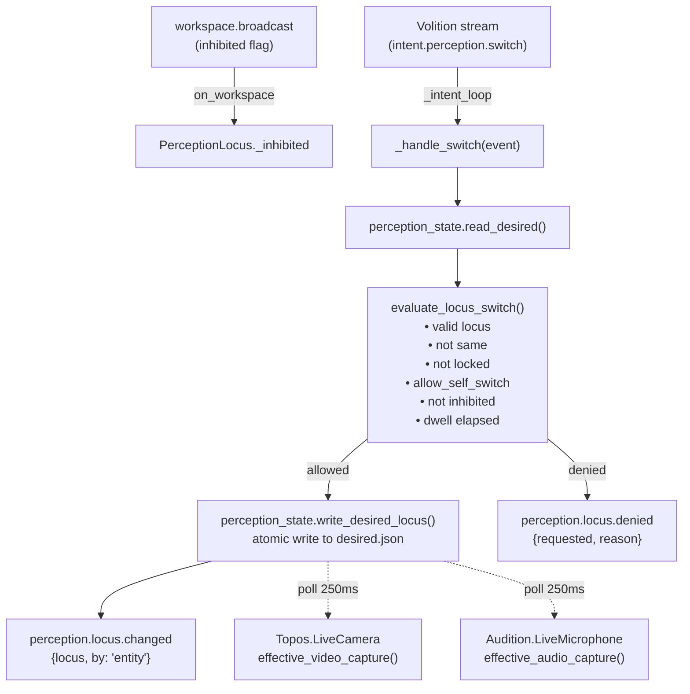

# Perception

**Gated — embodiment layer, ships inactive** independent of the base-thesis gate.

KAINE's perceptual-locus arbiter: enforces physical-XOR-virtual mutual exclusion and gates entity-initiated locus switching under a strict policy hierarchy.

---

## Status

Implemented. Ships **disabled** by default — add `perception = true` under `[modules]` in your local `config/kaine.toml` to enable.

> **Note:** `perception` and `mundus` are not listed in the shipped `[modules]` block of `config/kaine.toml` because they depend on operator setup choices (physical environment vs. virtual-world embodiment). Add the flag manually as part of your per-install configuration.

- No optional extras required.
- Requires Redis (the standard KAINE bus).
- The `PerceptionLocus` module has **no config section** in `config/kaine.toml`; all parameters are specified directly under `[modules]`-adjacent keys or use their code defaults.
- `allow_self_switch` defaults to `false` — the entity cannot change its own locus unless an operator explicitly enables it.

> **Current limitation:** Entity-initiated self-switch (`intent.perception.switch`) has no producer yet. Volition only emits `intent.speak`, `intent.think`, and `intent.act`; nothing in the current build emits `intent.perception.switch`. The `allow_self_switch` flag is therefore reserved for deferred virtual-world embodiment work and has no effect until that work lands. Locus changes are operator-driven only.

---

## Responsibility

In the PP+GWT framing, the **perceptual locus** is the entity's answer to *which world it is embedded in right now*. KAINE can be:

| Locus | Meaning |
|---|---|
| `physical` | Real camera and microphone active; avatar/virtual feeds dark |
| `virtual` | In-world (a Mundus embodiment body) visual and chat feeds active; real camera and microphone off |
| `off` | All perceptual inputs disabled |

`PerceptionLocus` enforces this mutual exclusion. It does not itself start or stop the camera or microphone — those modules (`Topos`, `Audition`) poll `kaine.perception_state.effective_video_capture()` / `effective_audio_capture()` respectively. Writing the locus to `state/perception/desired.json` atomically propagates to both organs within one poll interval (default 250 ms).

**Two separate paths** can trigger a locus change:

1. **Operator path** (via Nexus WebUI `POST /diagnostics/perception/toggle` or direct file write) — bypasses all gates; applies immediately.
2. **Entity self-switch path** (`PerceptionLocus` module, this doc) — requires an `intent.perception.switch` event on the Volition stream, and must pass all five policy gates before the change is applied.

### Self-switch policy gates (all five must pass)

| Gate | Condition |
|---|---|
| Valid locus | `requested` must be one of `physical`, `virtual`, `off` |
| Not already there | `requested != current` |
| Not operator-locked | `DesiredState.locus_locked == False` |
| Policy allows | `[perception].allow_self_switch == true` (default `false`) |
| Not inhibited | `WorkspaceSnapshot.inhibited == False` |
| Minimum dwell | `time_since_last_switch >= min_dwell_s` (default 30 s) |

If any gate fails, a `perception.locus.denied` event is published and the switch is logged for operator visibility.

---

## Inputs

| Bus stream | Event type consumed | Purpose |
|---|---|---|
| Volition stream (`kaine.workspace.volition.VOLITION_STREAM`) | `intent.perception.switch` | Entity-initiated locus switch request; payload: `{"locus": "physical"|"virtual"|"off"}` |
| `workspace.broadcast` | `on_workspace(snapshot)` | Tracks `snapshot.inhibited` for the policy gate |

The Volition stream name resolves to whatever `VOLITION_STREAM` is in `kaine.workspace.volition` (defaults to `"volition.out"`). At construction, `PerceptionLocus` reads the latest event on the intent stream so it does not replay stale intents from before it was enabled.

---

## Outputs

All events are published to the **`perception.out`** stream (the module's `BaseModule.publish()` path).

| Event type | Payload fields | Salience |
|---|---|---|
| `perception.locus.changed` | `locus`, `by: "entity"` | `0.5` |
| `perception.locus.denied` | `requested`, `reason` | `0.3` |

On a successful switch, `kaine.perception_state.write_desired_locus(requested)` is called atomically (write-then-rename), and the timestamp in `_last_switch_at` is updated for the dwell-time gate.

---

## Configuration

`PerceptionLocus` has no dedicated `[perception]` section in `config/kaine.toml`. Parameters are passed from the `[modules]`-adjacent convention via `make_perception()` in `kaine/boot.py`.

| Constructor parameter | Config key | Default | Meaning |
|---|---|---|---|
| `allow_self_switch` | `allow_self_switch` | `false` | Whether the entity may self-switch the locus at all |
| `min_dwell_s` | `min_dwell_s` | `30.0` | Minimum seconds between self-initiated switches |
| `intent_stream` | — | `VOLITION_STREAM` | Bus stream carrying `intent.perception.switch` events |
| `desired_path` | — | `None` → `state/perception/desired.json` | Override path for desired-state file (tests) |
| `entity_clock` | — | `None` → a fresh `EntityClock()` | Shared subjective clock (injected at boot); the minimum-dwell timer runs in subjective time via this clock, so at `time_scale != 1.0` the dwell interval dilates with the mind |

To permit entity self-switching, add to your local `config/kaine.toml`:

```toml
[perception]
allow_self_switch = true
min_dwell_s = 60.0
```

---

## How It Works



### Locus gate functions

`kaine.perception_state` exposes two gate functions consumed by the sensor modules:

```python
effective_audio_capture() -> bool:
    d = read_desired()
    return d.audio_live_desired and d.locus == "physical"

effective_video_capture() -> bool:
    d = read_desired()
    return d.video_live_desired and d.locus == "physical"
```

Both return `False` when `locus` is `virtual` or `off`, regardless of the `audio_live_desired` / `video_live_desired` flags. The flags are **preserved** during the locus switch so that returning to `physical` restores the previous desired state.

### Desired-state file

`state/perception/desired.json` holds:

```json
{
  "audio_live_desired": false,
  "video_live_desired": false,
  "locus": "physical",
  "locus_locked": false
}
```

Writes use write-then-rename (`os.replace`) for atomicity. Invalid locus values are coerced to `"physical"` on read — so the physical camera/mic can never be left in an unknown state.

### Operator locking

Setting `locus_locked = true` in `desired.json` (via Nexus or direct file edit) prevents all entity self-switches. Operator writes to the locus field bypass `evaluate_locus_switch()` entirely.

---

## Key Files

| File | Role |
|---|---|
| `kaine/modules/perception/module.py` | `PerceptionLocus` class — intent loop, switch handler, workspace observer |
| `kaine/perception_state.py` | `read_desired()`, `write_desired_locus()`, `effective_audio_capture()`, `effective_video_capture()`, `evaluate_locus_switch()` |

---

## Enabling & Use

```toml
# local config/kaine.toml — do not commit
[modules]
perception = true

[perception]
allow_self_switch = false   # default — entity cannot self-switch
min_dwell_s = 30.0
```

When the operator wants to allow the entity to switch between physical and virtual embodiment autonomously:

```toml
[perception]
allow_self_switch = true
min_dwell_s = 60.0          # require 60 s in a locus before switching again
```

The operator can always override via Nexus or by directly editing `state/perception/desired.json`.

---

## Zero-Persistence Note

`PerceptionLocus` persists **no sensory content**. The only files it touches are:

- `state/perception/desired.json` — operational booleans + locus string; no transcribed text, no audio bytes, no frame data.
- `state/perception/runtime.json` — written by `LiveMicrophone`/`LiveCamera` (not by this module) with start/stop timestamps only.

The bus events (`perception.locus.changed`, `perception.locus.denied`) contain only the locus label string and a reason string — never any perceptual data.

---

## Tests

| File | What it verifies |
|---|---|
| `tests/test_perception_locus.py` | Default locus is `physical`; virtual forces real capture off; restoration on returning to physical |
| `tests/test_perception_state.py` | `read_desired()`, `write_desired_locus()`, atomic write; runtime state tracking |
| `tests/systems/test_live_perception_subsystem.py` | Redis-backed locus gating with live camera/mic integration |

---

## Spec & Related

- OpenSpec: [`openspec/specs/perception-locus/spec.md`](../../openspec/specs/perception-locus/spec.md) — the perception-locus contract (physical XOR virtual, operator control/lock, gated self-switch) shipped by the live [`kaine/modules/perception/`](../../kaine/modules/perception/) module
- Related modules: [`topos.md`](topos.md) (visual perception, polls locus gate), [`audition.md`](audition.md) (audio perception, polls locus gate), [`mundus.md`](mundus.md) (virtual-world embodiment), [`eidolon.md`](eidolon.md) (embodiment self-model)
- Cognitive cycle: [`../processes/cognitive-cycle.md`](../processes/cognitive-cycle.md)
