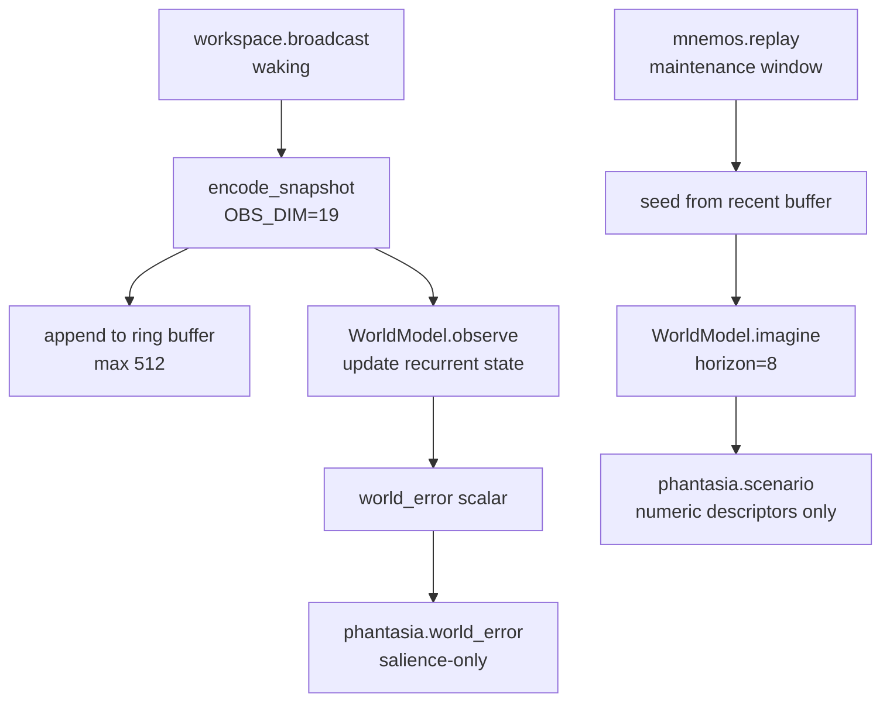

# Phantasia

**Gated** — built and tested, shipped disabled; held behind a positive base-thesis result (see [Architecture](../architecture.md)).

KAINE's world-model and imagination organ: a DreamerV3-style RSSM that predicts, measures surprise, and generates imagined scenarios during sleep.

---

## Status

Implemented. Ships **disabled** — `[modules].phantasia = false` in `config/kaine.toml`.

- Default backend is `"dreamerv3"` (the real RSSM world model), which requires the `[worldmodel]` optional extra: `jax[cpu]`.
- `"fake"` (`FakeWorldModel`, pure Python, no external dependencies) is the dependency-free development fallback.
- Training is disabled by default (`training_enabled = false`); even when enabled, all training is **in-memory only** — nothing is written to disk.
- **Not an agent**: Phantasia has no actor, critic, reward head, or return head. Policy selection is Nous's responsibility.

---

## Responsibility

In the PP+GWT framing, Phantasia provides a generative world model that supports two complementary functions:

1. **Waking (prediction-error salience)** — every workspace tick, it encodes the snapshot, folds it into the world model's recurrent state, and publishes `phantasia.world_error` — a scalar salience signal reflecting how surprising the current moment is relative to the model's prediction. This signal influences coalition selection in Syneidesis.

2. **Offline (imaginative consolidation)** — during a Hypnos maintenance window, when `mnemos.replay` cues arrive, Phantasia seeds the world model from the accumulated waking trajectory and rolls out imagined future states, publishing `phantasia.scenario` events. These re-enter the workspace broadcast so Nous, Thymos, and Eidolon process them via `on_workspace`, enabling associative consolidation (paper §3.3.5 phase 3).

The trajectory ring buffer accumulates waking observations in memory for training. It is **never serialized**.

---

## Inputs

| Source | Stream | Event type | What is used |
|---|---|---|---|
| Syneidesis | `workspace.broadcast` | — | Snapshot → observation vector (waking path) |
| Mnemos | `mnemos.out` | `mnemos.replay` | `memory_id` → seeds offline scenario rollout |
| Hypnos | `hypnos.out` | `hypnos.sleep.started` | Opens maintenance window; triggers training pass |
| Hypnos | `hypnos.out` | `hypnos.sleep.completed` | Closes maintenance window |

Mnemos and Hypnos events are consumed by a background `_peer_consumer_loop` task. The waking path (`on_workspace`) is suppressed while `_window_active` is True.

---

## Outputs

| Stream | Event type | Key payload fields | Salience |
|---|---|---|---|
| `phantasia.out` | `phantasia.world_error` | `world_error` (float [0,1]), `salience`, `tick_index` | Interpolated: `baseline + world_error × (alert − baseline)` |
| `phantasia.out` | `phantasia.scenario` | `seed_memory_id`, `horizon`, `step_magnitudes` (list), `trajectory_drift`, `encoder_version` | Interpolated by peak step magnitude |

`phantasia.world_error` is a **salience-only signal** — it carries no imagined content. `phantasia.scenario` carries compact numeric trajectory descriptors (per-step activation magnitudes and overall drift) but **no raw sense data**.

---

## Configuration

All keys under `[phantasia]` and sub-tables. See also [`../configuration.md`](../configuration.md).

| Key | Default | Description |
|---|---|---|
| `backend` | `"dreamerv3"` | `"dreamerv3"` (real RSSM, requires `[worldmodel]` extra) or `"fake"` (no deps, dev-only fallback) |
| `training_enabled` | `false` | Run in-memory training pass at maintenance start |
| `training_device` | `"cpu"` | JAX device for training (in-memory only) |
| `trajectory_buffer_size` | `512` | Ring buffer size (waking observations) |
| `rollout_horizon` | `8` | Imagined steps per scenario |
| `mnemos_stream` | `"mnemos.out"` | Bus stream to consume for `mnemos.replay` scenario cues |
| `hypnos_stream` | `"hypnos.out"` | Bus stream to consume for sleep-cycle lifecycle events |
| `[phantasia.salience].baseline` | `0.1` | Minimum salience for world_error and scenario |
| `[phantasia.salience].alert` | `0.7` | Maximum salience (at max error/peak) |
| `[phantasia.world_model].deter_dim` | `64` | GRU deterministic state dimension (dreamerv3 backend) |
| `[phantasia.world_model].stoch_dim` | `16` | Stochastic latent dimension |
| `[phantasia.world_model].stoch_classes` | `8` | Stochastic categorical classes |
| `[phantasia.world_model].hidden_dim` | `64` | MLP hidden width |
| `[phantasia.world_model].latent_kind` | `"categorical"` | `"categorical"` or `"gaussian"` |
| `[phantasia.world_model].learning_rate` | `0.001` | SGD learning rate |

---

## How it works

### Observation encoder (`encoder.py`)

`encode_snapshot(snapshot)` maps a `WorkspaceSnapshot` to a **fixed-width float vector** of dimension `OBS_DIM = 19` (15 source buckets + 3 affect + 1 inhibition flag). Layout:

| Slots | Content |
|---|---|
| 0–14 | Per-source salience-weighted bucket (one slot per module in `SOURCE_ORDER`) |
| 15 | `affect_intensity` (abs arousal from `thymos.state`, clipped [0,1]) |
| 16 | `affect_valence` (valence, may be negative) |
| 17 | `affect_dominance` (dominance) |
| 18 | Inhibition flag (1.0 if `snapshot.inhibited`, else 0.0) |

The `SOURCE_ORDER` tuple is stable across runs (load-bearing for the version). The encoder is **pure stdlib** — no numpy/JAX required — so the suite encodes observations without the `[worldmodel]` extra. `VERSION = "phantasia-encoder-v1"` is stamped in `phantasia.scenario` payloads for schema-drift detection.

### WorldModel protocol and backends

`WorldModel` is a `@runtime_checkable` protocol with four methods:

```python
def observe(obs: list[float]) -> float: ...   # fold in + return error [0,1]
def imagine(horizon: int) -> list[list[float]]: ...  # rollout from current state
def train(trajectory: list[list[float]]) -> TrainOutcome: ...  # in-memory training
def reset_state() -> None: ...
```

**`FakeWorldModel`** (default): models recurrent state as an EMA of observations. `imagine()` returns a geometrically decaying rollout of the current state. `train()` nudges the EMA decay toward 0.5. NaN-guarded. No actor/critic/reward anywhere.

**`DreamerV3WorldModel`** (real backend): wraps `external/dreamerv3/rssm.py`, a clean-room JAX re-implementation of the DreamerV3 RSSM world-model core attributed to danijar/dreamerv3 (MIT, commit `e3f02248`). Implements:
- Encoder MLP (observation → embedding)
- GRU recurrent deterministic state (the `h` / `deter` state)
- Stochastic categorical or Gaussian latent (the `z` / `stoch` state)
- Decoder MLP (latent → reconstructed observation)
- Prior-only imagination rollout

Deliberately excludes actor, critic, return head, and reward head. Upstream disk-serialization hooks are not wired.



### Waking path

Each `on_workspace` call (when not in a maintenance window):
1. Encodes the snapshot.
2. Appends the observation to the bounded `deque` ring buffer (never serialized).
3. Calls `world_model.observe(obs)` → returns prediction error ∈ [0, 1].
4. Publishes `phantasia.world_error` with interpolated salience.

### Offline path (Hypnos maintenance window)

On `hypnos.sleep.started`:
- `_window_active = True` — live observation halts.
- `_maybe_train()` runs one in-memory training pass over the accumulated buffer if `training_enabled`.

On `mnemos.replay` (while window active):
- `generate_scenario()` is called with `seed_memory_id` from the replay event.
- The world model is reset and re-seeded by replaying the last `rollout_horizon` waking observations from the buffer.
- `world_model.imagine(rollout_horizon)` produces `horizon` imagined observation vectors.
- Trajectory is summarised as per-step activation magnitudes and overall drift — no raw content.
- `phantasia.scenario` is published on `phantasia.out`, which feeds back into the workspace broadcast for downstream consolidation.

### In-memory training

`train_now()` passes the full buffer as a trajectory batch to `world_model.train()`. The world model's NaN guard: if any input row is non-finite or the computed loss is NaN/Inf, the pass aborts and restores the last-known-good state without touching the in-memory parameters. No files are written.

---

## Key files

| Path | Purpose |
|---|---|
| `kaine/modules/phantasia/module.py` | `Phantasia(BaseModule)` — waking/offline paths, training gate |
| `kaine/modules/phantasia/world_model.py` | `WorldModel` protocol, `FakeWorldModel`, `DreamerV3WorldModel`, `TrainOutcome` |
| `kaine/modules/phantasia/encoder.py` | `encode_snapshot()`, `observation_dim()`, `SOURCE_ORDER`, `VERSION` |
| `kaine/modules/phantasia/checkpoint.py` | Atomic, encryption-aware read/write of weight-checkpoint bytes |
| `external/dreamerv3/rssm.py` | Clean-room JAX RSSM implementation (danijar/dreamerv3, MIT) |
| `external/dreamerv3/UPSTREAM` | Provenance record: upstream URL, pinned commit, license |
| `kaine/boot.py` | `make_phantasia()` — backend selection, world_model sub-table wiring |

---

## Enabling and use

1. **Real RSSM backend** (default): set `[modules].phantasia = true`, install the worldmodel extra: `.venv/bin/pip install -e '.[worldmodel]'`.
   - Optionally enable training: `training_enabled = true`.
   - Optionally persist learned weights across restarts:
     `persist_weights = true` (see the persistence section below).
2. **Fake backend** (dependency-free development fallback, no extras needed): set `backend = "fake"` in `[phantasia]`.
3. No external services are required — Phantasia is entirely local.

To force a scenario in tests without a full Hypnos cycle:

```python
phantasia._replay_engine.open_window()           # if you have that attribute
await phantasia.generate_scenario(seed_memory_id="test")
```

---

## Zero-persistence note

Phantasia enforces zero-persistence of *experience data* at multiple layers:

- The trajectory ring buffer is an in-memory `deque` — it is **never** serialized (not in `serialize()`, not in any checkpoint).
- `train_now()` writes nothing to disk; upstream dreamerv3 disk hooks are bypassed.
- Observation vectors contain only derived numeric summaries (source salience, affect floats, inhibition flag) — no raw audio or image bytes.
- `serialize()` emits only checkpoint *metadata* (backend name, checkpoint path, persistence flag, encoder version, obs_dim, training flag) — never weights or buffer contents.

---

## Weight persistence (opt-in)

Learned world-model parameters are derived numeric weights, **not sense
data** — losing them on every restart would erase everything the world model
learned from the entity's lived experience. With
`[phantasia].persist_weights = true` (shipped `false`) and
`backend = "dreamerv3"`:

- **Load** at `initialize()` from `checkpoint_path` (default
  `state/phantasia/world_model.ckpt`) when the file exists; otherwise start
  from fresh initialization and save there.
- **Save** after each successful (non-aborted, ≥1 step) sleep-window training
  pass and on graceful shutdown — including an operator freeze. An aborted
  pass leaves the last-known-good checkpoint untouched.
- **Format**: in-memory NPZ of the RSSM param tree plus an embedded config
  header (`obs_dim`, RSSM dims, `latent_kind`, encoder version), written
  atomically (temp + `os.replace`) and AES-256-GCM-encrypted at rest when
  `[security.state_encryption]` is enabled.
- **Fail closed, twice**: enabling `persist_weights` with the `fake` EMA stub
  is a `ValueError` at construction (the stub has no real learned parameters
  to persist), and loading a checkpoint whose embedded config does not match
  the running model raises `CheckpointMismatchError` at boot — never a silent
  discard-and-reinit of learned weights.
- **CAL 4.2(b)**: the decommission backup bundle copies `state/phantasia/`
  (transferable cognitive state), and `delete_entity_state` removes it.
- The trajectory buffer is excluded from checkpoints regardless of this flag.

---

## Tests

| File | Coverage |
|---|---|
| `tests/test_phantasia_world_model.py` | `FakeWorldModel` observe/imagine/train/NaN guard; `DreamerV3WorldModel` actor-critic absence assertion |
| `tests/test_phantasia_encoder.py` | `encode_snapshot` vector shape; source bucketing; affect extraction; inhibition flag |
| `tests/test_phantasia_module.py` | Waking tick → `phantasia.world_error`; offline cue → `phantasia.scenario`; window guard |
| `tests/test_phantasia_zero_persistence.py` | Buffer not serialized; no disk artifacts during training |
| `tests/test_phantasia_persistence.py` | Weight checkpoint round-trip; fail-closed mismatch/stub guards; encryption at rest; decommission inclusion |
| `tests/test_phantasia_faithful_renderer.py` | FaithfulRenderer templates for world_error and scenario events |

---

## Spec and related

- Primary spec: [`openspec/specs/phantasia/spec.md`](../../openspec/specs/phantasia/spec.md)
- Related modules: [Mnemos](mnemos.md) (replay cues), [Hypnos](hypnos.md) (maintenance window), [Nous](nous.md) (processes `phantasia.scenario` during maintenance), [Thymos](thymos.md) (affect in observation vector)
