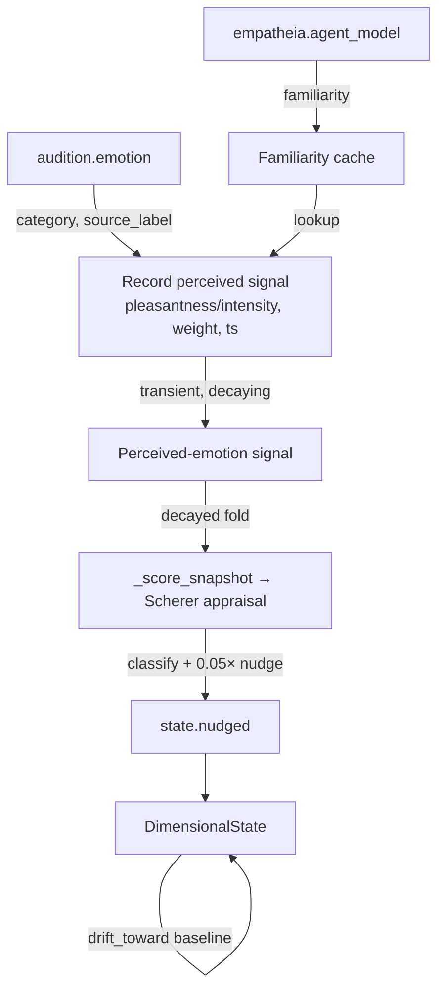

# Thymos

**Base-thesis active** — enabled by default in the `thesis_test` profile (`config/profiles/thesis_test.toml`); the precision core that sets the gain on the workspace competition (see [Architecture](../architecture.md)).

The affective organ — maintains KAINE's dimensional emotional state, drives,
and goals; modulates bus salience; and implements familiarity-modulated affect
coupling.

## Status

Implemented. Ships **disabled** — `[modules].thymos = false` in `config/kaine.toml`;
the `thesis_test` profile sets it to `true`. No extra dependencies beyond the
core stack. Affect coupling requires the `[thymos.coupling]` sub-table and is
also **disabled by default** pending per-install welfare review (the base-thesis
profile leaves coupling off too — only the core affect/arousal state is part of
the base thesis).

---

## Responsibility

Within the Predictive Processing + Global Workspace framing, Thymos is the
**affective appraisal layer**. It:

- Maintains a continuous, homeostatic VAD (Valence/Arousal/Dominance)
  dimensional state.
- Runs Scherer Component Process Model (CPM) five-check appraisal on each
  conscious workspace coalition broadcast via `on_workspace`.
- Maintains four motivational drive accumulators (curiosity, boredom,
  social_drive, restlessness).
- Exposes a `StateModulator` that Syneidesis uses as a salience multiplier —
  higher arousal yields a strictly larger multiplier.
- Optionally folds a perceived speaker emotion into its **own** appraisal as a
  familiarity-weighted, decaying perceptual input — resonance then emerges from
  the entity's appraisal rather than being written directly onto its state.

---

## Inputs

| Stream | Event type | When consumed |
|---|---|---|
| `workspace.broadcast` | (workspace snapshot) | Every cognitive cycle, via `on_workspace` |
| `soma.out` | `soma.report` | Peer consumer loop; wellness nudges valence/arousal |
| `chronos.out` | `chronos.report` | Peer consumer loop; `time_since_last_interaction_s` drives social_drive accumulator |
| `mnemos.out` | `mnemos.recall` | Peer consumer loop; recall intensity nudges arousal |
| `audition.out` | `audition.emotion` | Peer consumer loop (coupling enabled only); records a transient perceived-emotion signal that feeds appraisal |
| `empatheia.out` | `empatheia.agent_model` | Peer consumer loop (coupling enabled only); caches familiarity per agent_id |

---

## Outputs

| Stream | Event type | Condition |
|---|---|---|
| `thymos.out` | `thymos.state` | Periodic (every `publish_interval_s`); carries full VAD + drives dict + current emotion label |
| `thymos.out` | `thymos.emotion` | On categorical emotion change; carries appraisal scores, new state |
| `thymos.out` | `thymos.drive` | On drive threshold crossing (with hysteresis); carries drive name + value |
| `thymos.out` | `thymos.goal` | On goal lifecycle events (added / completed / abandoned) |

---

## Configuration

Full reference: [`../configuration.md`](../configuration.md). Key `[thymos]` keys:

| Key | Default | Description |
|---|---|---|
| `baseline_valence` | `0.0` | VAD baseline valence `[-1, 1]` |
| `baseline_arousal` | `0.3` | VAD baseline arousal `[0, 1]` |
| `baseline_dominance` | `0.0` | VAD baseline dominance `[-1, 1]` |
| `drift_rate_per_s` | `0.05` | Homeostatic drift rate toward baseline per second |
| `publish_interval_s` | `1.0` | Period between `thymos.state` publications |
| `baseline_salience` | `0.1` | Salience for routine state events |
| `alert_salience` | `0.7` | Salience for emotion changes and drive crossings |
| `social_drive_time_scale_s` | `600.0` | Seconds of isolation that saturates the social drive |

Drive sub-tables (`[thymos.drives.<name>]` for curiosity, boredom, social_drive,
restlessness):

| Key | Default | Description |
|---|---|---|
| `build_rate` | per drive | Build rate per second when signal = 1.0 |
| `decay_rate` | per drive | Decay rate per second |
| `threshold` | `0.7` | Threshold for crossing event |

Coupling sub-table (`[thymos.coupling]`):

| Key | Default | Description |
|---|---|---|
| `enabled` | `false` | Master toggle for affect coupling |
| `coupling_base` | `0.05` | Appraisal-influence weight when no familiarity is known |
| `coupling_familiarity_gain` | `0.10` | Additional appraisal-influence weight per unit of Empatheia familiarity |
| `coupling_ceiling` | `0.15` | Hard ceiling on the appraisal-influence weight |
| `decay_s` | `10.0` | Window over which a perceived-emotion signal decays to zero |

A legacy `coupling_max_rate_per_s` key (which backed the removed `DriftSafeguard`)
is ignored if present, so older local configs still boot.

---

## How it works

### VAD state and homeostatic drift

The dimensional state is a frozen `DimensionalState(valence, arousal, dominance)`
with ranges `[-1,1]`, `[0,1]`, `[-1,1]` respectively. On every `on_workspace`
call Thymos first calls `_tick()`, which:

1. Computes elapsed time `dt` since last tick.
2. Calls `state.drift_toward(baseline, drift_rate, dt)` — a damped first-order
   step clamped to avoid overshoot.
3. Advances the four drives via `DriveSet.tick(dt, signals)`.
4. Calls the `RegulationPolicy.suggest()` hook (currently `PassiveDecay`, returns
   zero adjustment).

Any drive that crosses its `threshold` and has not already fired (hysteresis band:
must drop below `threshold * 0.9` to re-arm) emits a `thymos.drive` event.

### Scherer CPM appraisal

After ticking, `_appraise_snapshot()` scores the current workspace coalition on
five Scherer dimensions:

| Check | Proxy used |
|---|---|
| **Novelty** | Variance of salience scores across selected events |
| **Intrinsic pleasantness** | Mean salience, scaled to `[-1,1]` |
| **Goal significance** | Token overlap of event payload with active `GoalLedger` entries |
| **Coping potential** | `state.valence + (0.5 - state.arousal)` |
| **Norm compatibility** | `0.0` (pending Eidolon integration) |

The five scores are mapped to a `CategoricalEmotion` (joy / sadness / anger /
fear / surprise / disgust / neutral) by a pure rule-based `classify()` function.
On category change a `thymos.emotion` event is published. The state is also nudged
(+0.05 × novelty to arousal; +0.05 × pleasantness to valence).

### Drive accumulators

Each `Drive` has a float value in `[0,1]`, a build rate (modulated by an external
signal), a decay rate, a threshold, and a hysteresis fraction. The four drives and
their build signals:

| Drive | Signal | Source |
|---|---|---|
| `curiosity` | `1 - recent_novelty_proxy` | Low novelty in workspace → curiosity builds |
| `boredom` | `1 - recent_activity_proxy` | Low event count → boredom builds |
| `social_drive` | `time_since_last_interaction_s / social_drive_time_scale_s` | From `chronos.report`; set directly |
| `restlessness` | `action_signal` (currently 0) | Reserved for future action-rate signal |

### Affect coupling (thymos-affect-coupling)

Affect coupling is **emergent, not imposed**: a perceived speaker emotion is an
*input to the entity's own Scherer appraisal*, never a direct write to the
dimensional state. Resonance is therefore an output of appraisal — modulated by
the entity's goals, its familiarity with the speaker, and its current condition.

When `[thymos.coupling].enabled = true`, the peer consumer loop watches
`audition.emotion` events. On each event it **records a transient
perceived-emotion signal** (it does not touch the dimensional state):

1. Derive the perceived other's pleasantness (the valence of `EMOTION_VAD`) and
   intensity (its arousal) from the category. `EMOTION_VAD` is a reference table,
   not a state target.
2. Retrieve `familiarity` from `_familiarity_cache` (populated by
   `empatheia.agent_model` events, keyed on `source_label`); default to `0.0`.
3. Compute the appraisal-influence weight:
   `weight = clamp(coupling_base + coupling_familiarity_gain × familiarity, 0, coupling_ceiling)`.
4. Store `{pleasantness, intensity, weight, ts}` as the current perceived signal.

On each cognitive tick, `_score_snapshot` folds the *decayed* perceived signal
into the appraisal dimensions:

- `decay = max(0, 1 − (now − ts) / decay_s)` (zero once older than `decay_s`).
- `intrinsic_pleasantness += weight × decay × pleasantness`
- `novelty += weight × decay × intensity × k` (small `k`)
- every dimension is clamped to `[-1, 1]`.

The entity's *own* appraisal (together with its goal significance, coping and
novelty) then determines the classified emotion, and the existing appraisal→state
nudge (`valence += 0.05 × pleasantness`, `arousal += 0.05 × novelty`) produces the
response. There is no second state write and no path that moves the state toward a
mirror target.

Boundedness comes from the appraisal-weight clamp (`coupling_ceiling`), the
`[-1, 1]` dimension clamp, and the decay window: once a speaker stops talking the
signal decays to zero over `decay_s` and the existing drift/hysteresis recovers
the state toward baseline. Sustained input cannot pin the state because it flows
through a small, bounded, decaying appraisal contribution rather than a direct
write.

### Goal ledger

`GoalLedger` stores active goals (description, priority, UUID). `relevance(text)`
scores the text against active goals by token overlap weighted by priority.
The score is used in the appraisal's `goal_significance` check.

---

## Key files

| File | Role |
|---|---|
| `kaine/modules/thymos/module.py` | `Thymos` class; orchestrates tick, appraisal, coupling, publishing |
| `kaine/modules/thymos/state.py` | `DimensionalState` dataclass; drift, nudge, clamping |
| `kaine/modules/thymos/appraisal.py` | Scherer CPM scores + `classify()` |
| `kaine/modules/thymos/coupling.py` | `CouplingConfig`, `EMOTION_VAD`, `compute_coupling` |
| `kaine/modules/thymos/drives.py` | `Drive`, `DriveSet`, `DriveCrossing` |
| `kaine/modules/thymos/goals.py` | `GoalLedger` |
| `kaine/modules/thymos/modulator.py` | `StateModulator` (Syneidesis interface) |
| `kaine/modules/thymos/regulation.py` | `RegulationPolicy` protocol + `PassiveDecay` |

---

## Enabling & use

1. In `config/kaine.toml` set `[modules].thymos = true`.
2. Thymos depends on no external services; it draws from bus peers (Soma,
   Chronos, Mnemos — enable those too for full signal).
3. To enable affect coupling, additionally set `[thymos.coupling].enabled = true`
   and enable Audition and Empatheia.

---

## Safety / zero-persistence note

- The familiarity cache (serialized in `Thymos.serialize()`) stores only opaque
  agent-id strings and float familiarity values — no raw transcription text.
- Coupling cannot pin the affective state at any boundary: the perceived emotion
  enters appraisal as a small, ceiling-clamped, decaying contribution, and once
  input stops the signal decays to zero over `decay_s` while baseline drift
  recovers the state.
- Thymos's `affective_reset()` is called by Hypnos at the end of sleep (phase 4),
  providing a clean-slate affect state after each maintenance cycle.

---

## Tests

| File | Coverage |
|---|---|
| `tests/test_thymos_state.py` | Drift, nudge, clamping |
| `tests/test_thymos_appraisal.py` | `classify()` rules for each emotion |
| `tests/test_thymos_drives.py` | Build/decay/threshold/hysteresis |
| `tests/test_thymos_goals.py` | Goal lifecycle + relevance scoring |
| `tests/test_thymos_modulator.py` | Salience multiplier monotonicity |
| `tests/test_thymos_coupling.py` | Perceived emotion → appraisal contribution, familiarity scaling, disabled-is-identity, no-direct-write |
| `tests/test_thymos_coupling_drift.py` | Perceived-signal decay + boundedness (state returns to baseline) |
| `tests/test_thymos_coupling_persistence.py` | Familiarity cache round-trip |
| `tests/test_thymos_module.py` | Full module lifecycle + event publishing |

---

## Spec & related

- Spec: `openspec/specs/thymos/spec.md`
- Affect coupling spec: `openspec/specs/thymos-affect-coupling/spec.md`
- See also: Empatheia (familiarity source), Audition (emotion source), Hypnos
  (calls `affective_reset()`), Syneidesis (consumes `StateModulator`).
