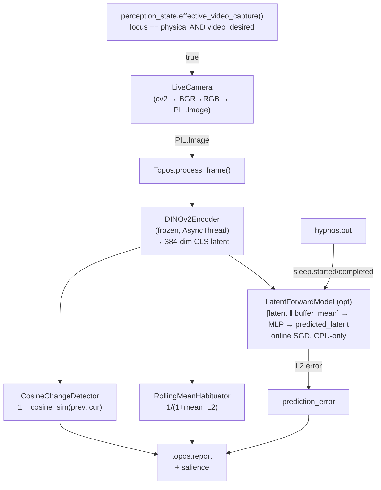

# Topos

KAINE's visual-perception organ: encodes live camera frames with a frozen DINOv2 model, detects scene change and habituation, and optionally predicts the next visual latent.

---

## Status

Implemented. Ships **disabled** — `[modules].topos = false` in `config/kaine.toml`.

- Requires `torch` and `transformers` (for DINOv2). Install these via the standard KAINE dependency set.
- Live camera capture requires the `[vision]` extras: `pip install -e .[vision]` (adds `opencv-python-headless`, `Pillow`).
- The DINOv2 encoder defaults to `cuda:1`; `resolve_device()` falls back with a warning to `cuda:0` on single-GPU hosts, and further to `cpu` on CPU-only hosts.
- The optional `LatentForwardModel` runs **CPU-only** regardless of the DINOv2 device.
- Encoder weights are **frozen** (`eval()`, `requires_grad_(False)`) — Topos never trains the encoder.
- Forward-model adaptation is automatically suspended during Hypnos offline cycles.

---

## Responsibility

In the PP+GWT framing, Topos is the entity's **exteroceptive vision channel**. Each time a frame arrives from the live camera — or is injected programmatically — Topos produces:

1. A **DINOv2 CLS-token latent** (384-dim at `dinov2-small` defaults) encoding the current scene.
2. A **change score** (`1 − cosine_similarity(previous_latent, current_latent)`): how much has the scene changed relative to the immediately preceding frame?
3. A **habituation score** (`1 / (1 + mean_pairwise_L2_to_buffer_mean)`): how repetitive has recent visual experience been? Approaches 1.0 for a static scene; approaches 0.0 for maximally varied input.
4. Optionally, a **visual prediction error** — the `LatentForwardModel` predicts the next latent from the current one and a recurrent visual buffer; the L2 error between prediction and observation drives salience such that a *surprising* scene change is more salient than an equally large but *expected* one.

Topos implements the **eyes-and-ears framing**: frames are perception (live), not recording. No frame is written to disk; each is released from memory after `process_frame()` returns.

The **perceptual locus** gate controls whether the real camera runs: `effective_video_capture()` in `kaine.perception_state` returns `True` only when `video_live_desired = true` **and** `locus == "physical"`. When the locus is `virtual` or `off`, the live camera stays dark automatically, without any Topos-level code change.

---

## Inputs

| Source | Mechanism | Purpose |
|---|---|---|
| `LiveCamera` task | `process_frame(image)` coroutine | Delivers one BGR→RGB PIL.Image per `capture_interval_s` |
| `hypnos.out` | `hypnos.sleep.started` / `hypnos.sleep.completed` | Suspends / resumes `LatentForwardModel` adaptation |
| `kaine.perception_state` | `effective_video_capture()` poll (250 ms default) | Locus gate: camera runs only when locus is `physical` and video is desired |

Topos does **not** subscribe to the workspace broadcast; it has no `on_workspace()` path. Frames arrive on demand from the live-camera supervisor task.

---

## Outputs

All events are published to the **`topos.out`** stream.

| Event type | Payload fields | Salience |
|---|---|---|
| `topos.report` | `latent`, `change_score`, `habituation_score`, `encoder_model_id`, `prediction_error` | `baseline_salience` (default 0.2) when quiet; `alert_salience` (default 0.7) when `change_score >= change_alert_threshold` (0.5) or normalised prediction error ≥ 2.0× rolling mean |

`latent` is the full 384-dim CLS-token vector. Downstream modules (e.g. Mnemos, Empatheia) may store or index these latents. `prediction_error` is 0.0 when `forward_prediction = false` or on the first frame.

---

## Configuration

Section `[topos]` in `config/kaine.toml`. See also [../configuration.md](../configuration.md).

| Key | Default | Meaning |
|---|---|---|
| `encoder_model_id` | `"facebook/dinov2-small"` | HuggingFace model ID for DINOv2; weights downloaded once at first init |
| `device` | `"cuda:1"` | Preferred device for the encoder; resolved via `resolve_device()` with fallback |
| `change_alert_threshold` | `0.5` | `change_score` above which `alert_salience` is applied (absent forward model) |
| `habituation_window` | `16` | Rolling-window size for `RollingMeanHabituator` (consumed at boot) |
| `baseline_salience` | `0.2` | Salience for routine `topos.report` events |
| `alert_salience` | `0.7` | Salience when scene change or visual surprise fires |
| `capture_enabled` | `false` | Enable the live camera; requires `[vision]` extras |
| `capture_device` | `0` | `cv2.VideoCapture` device index or URL |
| `capture_interval_s` | `1.0` (shipped config: `0.1`) | Seconds between frame captures; kept consistent with `vision_sample_hz` for operator reference |
| `vision_sample_hz` | `10.0` | Subjective vision-sampling rate in Hz; the authoritative knob — when present it is converted to `capture_interval_s` and takes precedence over a directly-set `capture_interval_s` |
| `capture_width` | `640` | Requested frame width in pixels |
| `capture_height` | `480` | Requested frame height in pixels |
| `capture_warmup_frames` | `3` | Frames discarded at startup (auto-exposure / white-balance settle) |
| `forward_prediction` | `false` | Enable the online-adapting `LatentForwardModel` |
| `forward_model_units` | `128` | Hidden size of the `LatentForwardModel` MLP |
| `prediction_error_window` | `32` | Rolling window (frames) for normalising visual prediction-error salience |
| `visual_buffer_size` | `16` | Number of recent latents kept in the recurrent visual buffer |

The shared top-level `[perception_feed]` section selects a **deterministic, unified A/V perception feed** for reproducible research runs — it drives **both** Topos (vision) and Audition (hearing) from one source of truth (see the section below):

| Key | Default | Meaning |
|---|---|---|
| `mode` | `"off"` | `off` (no feed; honour each module's `capture_enabled`) / `seeded` / `playlist` / `live` |
| `seed` | `0` | Seeded mode: both surfaces are a pure function of this seed |
| `playlist_manifest` | `""` | Playlist mode: path to the single checksummed media manifest pinning **both** surfaces |
| `[perception_feed.video].surprise_interval` | `150` | Seeded mode: **shared cross-modal** cadence (frames/blocks) of surprise events |
| `[perception_feed.video].surprise_strength` | `1.0` | Seeded mode: magnitude of the visual surprise blob (`0` disables) |
| `[perception_feed.audio].sample_rate` | `16000` | Seeded mode: audio sample rate (match `[audition].capture_sample_rate`) |
| `[perception_feed.audio].channels` | `1` | Seeded mode: audio channel count |
| `[perception_feed.audio].base_strength` | `0.3` | Seeded mode: learnable base soundscape amplitude |
| `[perception_feed.audio].surprise_strength` | `1.0` | Seeded mode: seed-keyed surprise-burst amplitude (`0` disables) |

---

## How It Works



### DINOv2Encoder

Loaded lazily on first `initialize()`. Uses `transformers.AutoModel` + `AutoImageProcessor` for `facebook/dinov2-small`. Model runs in `eval()` mode; all parameters have `requires_grad = False`. Forward pass extracts the CLS token from `last_hidden_state[:, 0, :]`, yielding a 384-dim float list. All inference runs in a thread (`asyncio.to_thread`) to keep the event loop free.

Accepts `PIL.Image`, `bytes`, or `numpy.ndarray`; BGR ndarrays from OpenCV are converted to RGB in the capture path before being handed to the encoder.

### CosineChangeDetector

Returns `1 − cosine_similarity(previous_latent, current_latent)`. Range `[0, 2]`; 0 for identical frames, 1 for orthogonal, 2 for anti-correlated. First frame returns 0.0 (no previous).

### RollingMeanHabituator

Maintains a deque of `window` (default 16) recent latent vectors. Scores `1 / (1 + mean_distance_to_buffer_mean)`. Static scene → all distances near zero → habituation → 1.0.

### LatentForwardModel (optional)

Architecture mirrors `AuditoryForwardModel` (Audition): `[latent ‖ buffer_mean] → Linear(2·384 → units) → Tanh → Linear(units → 384)`, CPU only, SGD online, non-finite guard. Visual buffer is a bounded deque (`visual_buffer_size = 16`). Serialises weight tensors and a statistical buffer summary (mean/variance per feature) — never raw latents. Soma's `SubstrateForwardModel` uses a different architecture — a CfC reservoir via `ncps` (see [`soma.md`](soma.md)) — rather than this shallow-MLP pattern.

Alert condition when forward model is active: normalised error ≥ 2.0 (i.e. current frame error is twice the rolling mean) **or** `change_score >= change_alert_threshold`.

### LiveCamera Supervisor

Runs as a background asyncio task. Polls `effective_video_capture()` every 250 ms to respect the perceptual locus. Opens `cv2.VideoCapture` in a thread, discards warmup frames, then calls `process_frame()` every `capture_interval_s`. The raw BGR ndarray is released immediately after BGR→RGB conversion; only the PIL.Image (RGB) is passed downstream.

### Nexus live-preview tap (dev-gated)

At the end of `process_frame()`, if the operator has set the environment variable `KAINE_PERCEPTION_PREVIEW=1`, the current frame is encoded to an in-memory JPEG via `perception_preview.encode_jpeg_preview()` and written to the single overwritten preview slot via `perception_preview.set_video_jpeg()`. This feeds the Nexus live entity-vision picture-in-picture; the slot holds at most one frame, is never written to disk, and is cleared on `shutdown()`. The tap is a no-op — and adds no computation — unless the env var is set.

---

## Key Files

| File | Role |
|---|---|
| `kaine/modules/topos/module.py` | `Topos` class — `process_frame()`, Hypnos loop, serialisation |
| `kaine/modules/topos/encoder.py` | `DINOv2Encoder`, `Encoder` protocol, image coercion |
| `kaine/modules/topos/change.py` | `CosineChangeDetector` and `ChangeDetector` protocol |
| `kaine/modules/topos/habituation.py` | `RollingMeanHabituator` and `SceneHabituator` protocol |
| `kaine/modules/topos/forward.py` | `LatentForwardModel` — online visual prediction MLP |
| `kaine/modules/topos/live.py` | `LiveCamera` — camera supervisor task, locus gate, zero-persistence |

---

## Enabling & Use

Add to your local `config/kaine.toml` (do not commit):

```toml
[modules]
topos = true

[topos]
capture_enabled = true   # requires pip install -e .[vision]
capture_device = 0       # or a RTSP URL for an IP camera
```

DINOv2 weights are downloaded from HuggingFace on first boot and cached locally. Set `HF_HOME` or `TRANSFORMERS_CACHE` to control the cache location. No external runtime services are needed after the initial download.

---

## Zero-Persistence Note

Topos holds **no raw frames**. The live-camera path enforces the invariant in code: the BGR ndarray is explicitly set to `None` before the PIL.Image is handed to `process_frame()`. `serialize()` writes:

- `encoder_model_id` — identity string only.
- `forward_model.layers` — MLP weight/bias tensors.
- `buffer_summary` — statistical descriptor (n_frames, per-feature mean, per-feature variance) of the visual buffer; no raw latent vectors.

A static grep in `tests/test_zero_persistence_invariant.py` fails the build if any frame-writing call appears in the topos live-camera path. The same guard covers the deterministic perception-feed sources below.

---

## Reproducible perception feed

Research runs require a **deterministic, copyright-free** stimulus: every run must present a bit-identical stream so results replicate. Live camera and live human input are non-reproducible, so they are **excluded from research runs** — the `live` mode (real camera + real microphone) exists only for operator-present demos. The feed is **unified**: a single top-level `[perception_feed]` section drives **both** the Topos vision surface (the `_VideoSource` seam, `kaine/modules/topos/feed.py`) and the Audition hearing surface (the `_AudioStream` `stream_factory` seam, `kaine/modules/audition/feed.py`). Selected by `[perception_feed].mode`:

- **`seeded`** (recommended) — `SeededProceduralSource` generates each frame and `SeededProceduralAudioStream` generates each audio block as a pure function of `(seed, index)`. Each surface has a **seed-keyed structured base signal** the world model learns to predict (drifting visual gradients; a learnable base soundscape of seed-derived low-frequency sinusoids), plus **surprise events** whose onset and content come from a shared counter-based, seed-keyed `blake2b` PRNG. Because the **base world is now seed-keyed** (not only the surprise schedule), two different seeds yield genuinely different — but still bit-identical-per-seed — worlds. The streams are reproducible for the experimenter yet not anticipable to the entity (inverting the keyed hash from the stimulus is infeasible), need no external media, and are restart/seek-safe. Surprises are **cross-modal**: a surprise fires both a visual blob and an audio burst on the *same shared cadence slot* (`[perception_feed.video].surprise_interval`), so the entity can learn audio-visual binding. (Honest note: the seeded audio is *sound*, not speech — STT may transcribe a block as empty; the research signal is auditory prediction-error + salience, not words.)
- **`playlist`** — `PlaylistSource` (video) and `PlaylistAudioStream` (audio) play operator-curated copyright-free media listed in **one** checksummed manifest (per-item `path` + `sha256` + `fps` + order). Both surfaces walk the same manifest, so picture and sound come from the same media. Each verifies **every** `sha256` before the run; any mismatch fails the source closed (a changed file voids reproducibility). Video decodes via OpenCV; audio decodes the media's audio track via **PyAV** (`av`) — if PyAV is absent the audio source fails honestly with an install hint (never synthetic silence). The operator sources the media; the manifest makes a given playlist a reproducible artifact.

A playlist manifest is TOML (one manifest pins **both** surfaces):

```toml
# perception_playlist.toml  (operator-supplied; copyright-free media w/ audio)
[[item]]
path = "clips/forest_walk.mp4"
sha256 = "…"          # pins the exact file; verified before the run
fps = 30              # frame timing → reproducible frame indexing
[[item]]
path = "clips/city_timelapse.mp4"
sha256 = "…"
fps = 30
```

### Pinning a reproducible run

```toml
# local config/kaine.toml — do not commit
[perception_feed]
mode = "seeded"          # or "playlist"
seed = 20260618          # pin this; re-running with the same seed reproduces both surfaces

[perception_feed.video]
surprise_interval = 150  # SHARED cross-modal cadence
surprise_strength = 1.0

[perception_feed.audio]
sample_rate = 16000
channels = 1
base_strength = 0.3
surprise_strength = 1.0

# playlist mode instead:
# [perception_feed]
# mode = "playlist"
# playlist_manifest = "config/perception_playlist.toml"
```

Selecting `seeded` or `playlist` turns capture on automatically for **both** surfaces. The active feed mode and its reproducible descriptor (seed + video schedule + audio schedule for seeded; the one manifest sha256 + item digests for playlist) are recorded in the per-run research manifest (`data/evaluation/runs/<run_id>/manifest.json`, `perception_feed` field) so another researcher can regenerate (seeded) or verify (playlist) the entity's full audio-visual input. The Nexus diagnostics surface shows the active mode + descriptor under `perception_feed`.

**Synchronization (honest guarantee):** Topos and Audition are separate modules with separate loops, so the feed does **not** claim frame-locked A/V sync. Coherence is at the **media/clip level** (playlist: both surfaces walk the same ordered, checksummed manifest) or via the **shared seed and cadence** (seeded: both procedural streams derive from one seed and fire surprises on shared cadence slots) — coherent and cross-modally bound by construction, but not inter-loop frame-locked.

Neither surface persists raw stimulus: the seeded sources store only `(seed, schedule)`; the playlist sources store nothing beyond the manifest they are given. The zero-persistence invariant above holds for both vision and hearing (the build-time guard covers `topos/feed.py` and `audition/feed.py`).

---

## Tests

| File | What it verifies |
|---|---|
| `tests/test_topos_module.py` | `process_frame()`, change/habituation integration, salience |
| `tests/test_topos_encoder.py` | `DINOv2Encoder` lazy load, `Encoder` protocol substitution |
| `tests/test_topos_change.py` | `CosineChangeDetector` boundary cases |
| `tests/test_topos_habituation.py` | `RollingMeanHabituator` static vs varied scenes |
| `tests/test_topos_forward.py` | `LatentForwardModel` step, non-finite guard, serialisation |
| `tests/test_topos_dinov2.py` | DINOv2 frozen weights, device placement |
| `tests/test_topos_live.py` | `LiveCamera` open/close, locus gate behaviour |
| `tests/test_topos_feed.py` | Seeded source determinism/cadence/seed-decorrelation; playlist verify + fail-closed |
| `tests/systems/test_topos_subsystem.py` | Redis-backed subsystem integration |

---

## Spec & Related

- OpenSpec: [`openspec/specs/topos/spec.md`](../../openspec/specs/topos/spec.md)
- OpenSpec (predictive): [`openspec/specs/topos-predictive/spec.md`](../../openspec/specs/topos-predictive/spec.md)
- Related modules: [`perception.md`](perception.md) (locus arbiter), [`audition.md`](audition.md) (parallel audio perception), [`mnemos.md`](mnemos.md) (may index latents)
- Cognitive cycle: [`../processes/cognitive-cycle.md`](../processes/cognitive-cycle.md)
