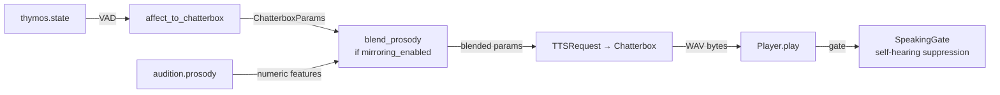

# Vox

The voice output organ — synthesizes KAINE's external speech via Chatterbox TTS,
with Thymos affect modulating expressivity parameters and optional bounded
prosodic mirroring of the interlocutor.

## Status

Implemented. Ships **disabled** (`[modules].vox = false`). Requires a running
Chatterbox TTS service. File-sink (`sink_enabled`) defaults to `false`;
self-hearing suppression defaults to `true`. Prosodic mirroring ships
**disabled** (`[vox.mirroring].enabled = false`) pending per-install enabling.

Extras required for prosody mirroring: Audition must be enabled and
`prosody_enabled = true` in its config (requires `librosa`; install via
`pip install -e .[audio]`).

---

## Responsibility

Vox is the **effector for verbal output**. In the GWT framing, when a `speak`
intent is realized by Lingua, the resulting text flows to Vox for acoustic
production. Vox:

- Subscribes to `lingua.external` for text to synthesize.
- Tracks the latest `thymos.state` to drive expressive synthesis parameters.
- Maps the VAD state to Chatterbox `(temperature, exaggeration, cfg_weight,
  speed_factor)` via a documented monotonic linear interpolation.
- Optionally blends a bounded prosodic residual from `audition.prosody` into
  those parameters (mirroring), with time-decay after the partner stops speaking.
- Plays audio through the OS audio device.
- Suppresses self-hearing: opens a `SpeakingGate` timed to the clip's duration
  plus hangover so an open mic does not transcribe the entity's own voice.
- Optionally writes clips to a bounded file sink (default: off).
- Publishes `vox.synthesized` with synthesis metadata (no audio bytes on the bus).

---

## Inputs

| Stream | Event type | Description |
|---|---|---|
| `lingua.external` | `external_speech` | Text to synthesize; triggers a synthesis cycle |
| `thymos.out` | `thymos.state` | Rolling-latest VAD state for affect → param mapping |
| `audition.out` | `audition.prosody` | Numeric prosody features; cached for mirroring (only when `mirroring_enabled`) |

---

## Outputs

| Stream | Event type | Description |
|---|---|---|
| `vox.out` | `vox.synthesized` | Synthesis result metadata: `text_length`, `bytes_produced`, `voice`, `exaggeration`, `cfg_weight`, `temperature`, `speed_factor`, `latency_ms`, `success` |

Audio is played to the OS audio device and optionally written to the file sink;
audio bytes are **never** put on the bus.

---

## Configuration

Full reference: [`../configuration.md`](../configuration.md). Key `[vox]` keys:

| Key | Default | Description |
|---|---|---|
| `chatterbox_url` | `"http://127.0.0.1:8883"` | Chatterbox TTS service URL |
| `voice_mode` | `"predefined"` | `"predefined"` uses the operator's configured voice file |
| `predefined_voice_id` | (unset) | **Required for `predefined` mode** — a voice filename your Chatterbox actually serves. Unset → Chatterbox returns 400 and Vox cannot speak. List with `curl -s http://127.0.0.1:8883/get_predefined_voices`; set e.g. `"Abigail.wav"`. |
| `output_format` | `"wav"` | Audio output format |
| `sink_path` | `"state/vox"` | Directory for optional clip sink |
| `sink_enabled` | `false` | Write synthesized clips to disk (bounded by `retain_count`) |
| `retain_count` | `0` | Number of newest clips to retain; `0` = immediate prune after write |
| `playback_enabled` | `true` | Play audio to OS audio device |
| `output_device` | `""` | OS audio device (empty = system default) |
| `suppress_self_hearing` | `true` | Open the `SpeakingGate` during playback |
| `mic_mute_hangover_ms` | `600` | Extra milliseconds of gate after clip ends |
| `baseline_temperature` | `0.7` | Chatterbox temperature at neutral affect |
| `baseline_exaggeration` | `0.5` | Exaggeration at neutral affect |
| `baseline_cfg_weight` | `0.5` | CFG weight at neutral affect |
| `request_timeout_s` | `120.0` | HTTP timeout per synthesis request |

`[vox.mirroring]` sub-table:

| Key | Default | Description |
|---|---|---|
| `enabled` | `false` | Enable prosodic mirroring from `audition.prosody` |
| `mirror_strength` | `0.3` | Blending coefficient (clamped to `mirror_ceiling`) |
| `mirror_ceiling` | `0.5` | Hard ceiling on mirror_strength at boot |
| `decay_s` | `10.0` | Seconds after last prosody event before mirror residual decays to zero |

---

## How it works

### Affect → Chatterbox parameter mapping

`affect_to_chatterbox()` is a pure, stateless function mapping `DimensionalState`
to `ChatterboxParams`. The documented monotonic relationships:

| Input | Chatterbox param | Direction |
|---|---|---|
| `arousal` ↑ | `temperature` ↑ | Linear within `[0.40, 0.95]` |
| `arousal` ↑ | `exaggeration` ↑ | Linear within `[0.30, 0.95]` |
| `|valence|` ↑ | `cfg_weight` ↑ | Linear within `[0.30, 0.95]` |
| `valence` ↑ | `speed_factor` ↑ | Linear within `[0.85, 1.15]`; 1.0 at valence=0 |

When the state equals the default `DimensionalState()` (all zeros/baseline), the
function returns the configured baseline values directly.

### Prosodic mirroring (vox-prosodic-mirroring)

When enabled, Vox subscribes to `audition.prosody` events and caches the latest
six numeric features: `f0_mean_hz`, `f0_std_hz`, `f0_voiced_frac`, `rms_mean`,
`rms_std`, `tempo_bpm`. At synthesis time `blend_prosody()` applies a bounded
additive residual on top of the affect-driven parameters:

| Prosody feature | TTS param nudged | Reference range |
|---|---|---|
| `tempo_bpm` | `speed_factor` | 80–180 BPM |
| `rms_mean` | `exaggeration` | 0.01–0.20 |
| `f0_std_hz` | `temperature` | 0–60 Hz |

Each feature is normalised to `[-1, 1]` against its reference range. The nudge
is `strength × normalised_residual × half_band_width`, then clamped to the
documented band. The `predefined_voice_id` / speaker embedding is **never
touched**; only expressive dynamics are adjusted.

The effective strength decays linearly to zero over `decay_s` seconds after the
last `audition.prosody` event, so the mirror fades when the partner stops
speaking. `blend_prosody()` is a pure function; the caller (`Vox._params_for`)
is responsible for computing the decayed strength via `decayed_strength()`.

### Self-hearing suppression

When `suppress_self_hearing = true` and a `SpeakingGate` is wired (boot-time
injection via `set_speaking_gate()`), Vox calls `gate.mark_speaking(duration_s +
hangover_s)` before handing audio to the player. Audition's live-capture loop
polls this gate and drops frames while it is open. Operators with acoustically
isolated input (e.g. a headset mic) may set `suppress_self_hearing = false`.

### File sink

When `sink_enabled = true`, each synthesized clip is written to
`<sink_path>/<timestamp>-<uuid8>.<format>`. After each write `_prune_sink()`
keeps at most `retain_count` newest clips (by mtime), deleting older ones.
`retain_count = 0` means a clip is pruned immediately after the reference is
released (transient).

---

## Key files

| File | Role |
|---|---|
| `kaine/modules/vox/module.py` | `Vox` class; consumer loop, synthesis, playback, event publishing |
| `kaine/modules/vox/mapping.py` | `affect_to_chatterbox()` pure function; `ChatterboxParams` |
| `kaine/modules/vox/mirroring.py` | `blend_prosody()`, `decayed_strength()`; identity-preserving prosodic accommodation |
| `kaine/modules/vox/client.py` | `ChatterboxClient` HTTP client; `TTSRequest` / `SynthesisResult` |
| `kaine/modules/vox/playback.py` | `Player` abstraction; `build_player()`; `wav_duration_s()` |
| `kaine/modules/vox/coordination.py` | `SpeakingGate` for self-hearing suppression |

---

## Enabling & use

1. Set `[modules].vox = true` in `config/kaine.toml`.
2. Start Chatterbox TTS (see `docs/CONNECTION_GUIDE.md` for the recommended launch
   command — run with the operator's predefined voice available in its `voices/`
   directory).
3. Set `predefined_voice_id` to the voice filename served by Chatterbox. Do not
   commit personal voice filenames to the repository.
4. Enable Lingua (Vox subscribes to its output) and Thymos (for affect-driven
   expressivity).
5. For prosodic mirroring: enable Audition with `prosody_enabled = true`, then
   set `[vox.mirroring].enabled = true`.

---

## Safety / zero-persistence note

- Audio bytes are **never** written to the Redis bus; only numeric metadata
  (`bytes_produced`, `latency_ms`, etc.) is in the `vox.synthesized` event.
- The file sink is off by default and bounded by `retain_count` when enabled; it
  never grows without limit.
- The `predefined_voice_id` references a file in Chatterbox's voices directory
  that the operator manages; the filename is operator-private and must not be
  committed.
- Prosody features cached for mirroring are numeric floats only (six values);
  no audio waveform is stored in the module state.
- Self-hearing suppression prevents the entity from transcribing its own TTS
  output as if it were human speech, preserving the clean perception→cognition
  boundary.

---

## Tests

| File | Coverage |
|---|---|
| `tests/test_vox_mapping.py` | Affect-to-Chatterbox monotonicity guarantees |
| `tests/test_vox_mirroring.py` | `blend_prosody` bounds; `decayed_strength` decay |
| `tests/test_vox_client.py` | `ChatterboxClient` request shaping |
| `tests/test_vox_playback.py` | `Player` abstraction; `wav_duration_s` |
| `tests/test_vox_module.py` | Consumer loop; thymos tracking; mirroring toggle |

---

## Spec & related

- Spec: `openspec/specs/vox/spec.md`
- Prosodic mirroring spec: `openspec/specs/vox-prosodic-mirroring/spec.md`
- Pending change: `openspec/changes/audio-out-playback/` — playback reliability
  and device-selection improvements.
- See also: Lingua (text source), Thymos (VAD state), Audition (prosody source
  for mirroring), Hypnos (uses Lingua's intent log for voice-alignment training).
