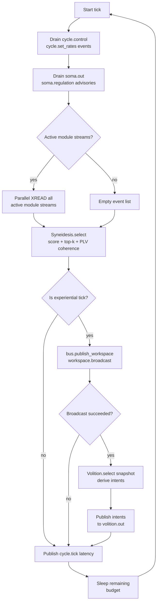
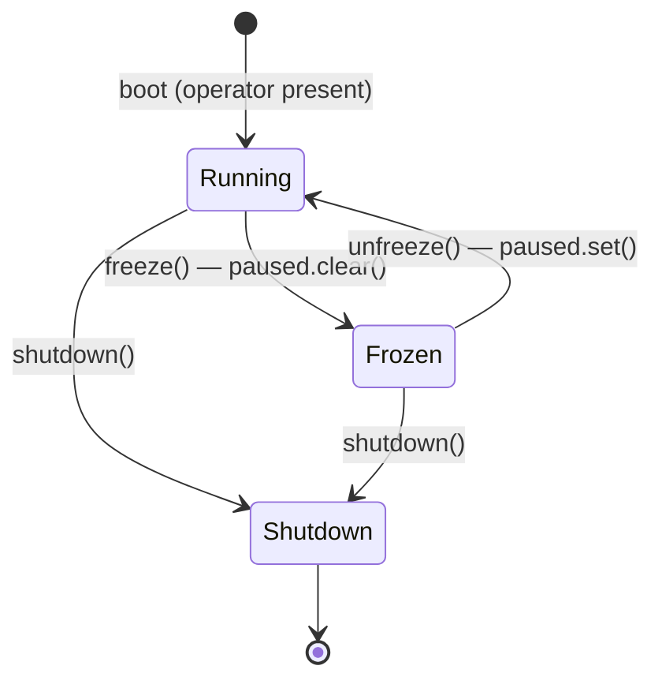

# Process: Cognitive Cycle

The cognitive cycle is KAINE's heartbeat — a continuous async loop that runs
independent of user input, collecting events from every active module, driving
the global workspace selection, and triggering executive action. It is
implemented in `kaine/cycle/engine.py` as `CognitiveCycle`.

Related: [global-workspace.md](global-workspace.md) ·
[sleep-maintenance.md](sleep-maintenance.md) ·
[../architecture.md](../architecture.md)

---

## Rates and Timing

The cycle has two independently configurable rates:

| Parameter | Default | Config key |
|-----------|---------|------------|
| `processing_rate_hz` | 10.0 | `[cycle].processing_rate_hz` |
| `experiential_rate_hz` | 3.333 | `[cycle].experiential_rate_hz` |

The **processing rate** controls how often the tick loop fires. The default
10 Hz (100 ms/tick) sits at the upper end of the 3–10 Hz conscious-access
band and was benchmarked-cleared on this host (RTX 4070 SUPER: ~17 Hz tick
headroom). Hard bounds are `[0.5, 20.0]` Hz.

The **experiential rate** controls how often a tick's snapshot is broadcast to
`workspace.broadcast` (and thus becomes "conscious"). It is tracked by a
fractional accumulator (`_experience_acc`): each tick adds
`experiential_rate / processing_rate` to the accumulator; when it crosses 1.0
an experiential broadcast fires and 1.0 is subtracted. This ensures the correct
long-run ratio even when the two rates differ.

`CognitiveCycle.__init__` itself only falls back to `experiential_rate_hz ==
processing_rate_hz` when no value is supplied; the entity does not actually
run that way. The composition root (`kaine/cycle/__main__.py`) and
`config/kaine.toml` both default `experiential_rate_hz` to 3.333 Hz — the
resting P3b conscious-access band — so at the shipped 10 Hz processing rate
only roughly one tick in three is promoted to a conscious broadcast. This
lets the 10 Hz senses (e.g. vision) genuinely outrun awareness: several
processing ticks inform one conscious update rather than every tick being
experiential. Setting `experiential_rate_hz` equal to `processing_rate_hz`
(or omitting it when constructing `CognitiveCycle` directly) restores the
one-tick-one-broadcast behavior; setting it lower than 3.333 decouples
"background processing" ticks (no broadcast, no intents) further from
"conscious" ticks.

### Time Dilation — `time_scale` and `EntityClock`

`processing_rate_hz` and `experiential_rate_hz` are **subjective**-Hz rates —
they describe the felt tick period, not necessarily the real one. The
`[cycle].time_scale` config key (default `1.0`) controls how the entity's
subjective clock runs relative to real wall-clock time:

| `time_scale` | Meaning |
|---|---|
| `0` | Frozen — the subjective clock stops. Reuses the existing pause/freeze path (see "Operator Freeze" below); the cycle does not invent a second freeze mechanism. |
| `1.0` | Real-time (the shipped default) — behavior is byte-identical to no clock injection at all. |
| `< 1.0` | Deliberately slowed subjective time. |
| `> 1.0` | Dilated-fast — an aspirational target: the cycle attempts the faster real tick rate and, when the hardware cannot hold it, the shortfall is recorded honestly as slip (never silently capped or faked). |

`EntityClock` (`kaine/entity_clock.py`) is the single shared subjective clock:
every module that times a cognitive process (tick pacing, fatigue
accumulation, perception cadence, attentional dwell, drive/affect time
constants) derives its "now" and durations from one injected `EntityClock`
instance, so one `time_scale` knob dilates the whole mind coherently and no
two cognitive timers can desynchronize. `EntityClock.wall()` is the real
monotonic clock (used only for slip/health measurement); `EntityClock.now()`
is subjective time (`origin + wall_elapsed * scale`); `EntityClock.period(hz)`
converts a subjective-Hz rate into the real seconds-per-tick budget the cycle
paces against (`1 / (hz * scale)`), which is what `CognitiveCycle.tick()` uses
to compute `target_ms` each tick. Infrastructure timers that must track real
wall-clock time regardless of subjective rate (the Spot watchdog, preservation
monitor, network timeouts) deliberately do not use this clock.

`CognitiveCycle.pacing_stats` is the honest pacing report exposed via the
`pacing_stats` property (and surfaced in Nexus): a rolling window (32 ticks)
of real per-tick wall time versus target budget, reporting `target_rate_hz`
(`processing_rate_hz * time_scale`), `achieved_rate_hz` (derived from mean
real tick duration), `mean_slip_ms` / `max_slip_ms`, and an `overrunning` flag
that is true when the achieved rate falls materially (>1%) below target. This
makes a `time_scale > 1` dilation — or any sustained overrun — visible rather
than silently throttled: the cycle always attempts the requested rate and
reports honestly when the hardware cannot sustain it.

---

## Tick Sequence



### Step 1: Drain `cycle.control`

`consume_control_events()` reads up to 32 entries from `cycle.control` using a
persistent cursor. Each `cycle.set_rates` event applies updated
`processing_rate_hz` and/or `experiential_rate_hz` (validated: must be
positive). On success a `cycle.rates` event is published to `cycle.out`.
Invalid payloads are logged and skipped without disrupting the loop.

### Step 2: Drain `soma.out` — regulation advisories

`consume_soma_regulation()` reads up to 32 `soma.regulation` events from
`soma.out`. Three `action` values are handled:

| Action | Effect |
|--------|--------|
| `reduce_rate` | Multiply `processing_rate` by 0.8, clamped to [0.5, 20.0] Hz |
| `shed_module` | Call `registry.request_shed_low_priority()` if available |
| `request_maintenance` | Latch `cycle.maintenance_requested = True` as an advisory/diagnostic signal. The early-maintenance trigger is event-driven: Hypnos observes the `request_maintenance` regulation event directly on `soma.out`; nothing reads this flag to drive behaviour. |

Unknown action values are silently ignored (graceful forward compatibility).
All advisories are **advisory only** — the cycle acts within safe bounds, logs,
and continues.

### Step 3: Read module streams

`asyncio.gather` issues a concurrent `XREAD` for every stream returned by
`registry.active_streams()`. Each stream is read with `block_ms=0`
(non-blocking) and count=100 (configurable). The per-stream cursor advances to
the last entry ID seen each tick. Read failures increment a per-stream error
counter but do not stop the loop.

### Step 4: Syneidesis selection

`syneidesis.select(events, context)` receives the full event list plus a
context dict containing `tick_index`, `is_experiential`, and (if the
oscillatory layer is enabled) `phases` — a dict mapping module names to their
current oscillator phase. Returns a `WorkspaceSnapshot`.

See [global-workspace.md](global-workspace.md) for the selection algorithm.

### Step 5: Experiential broadcast

If the tick is experiential and the selection succeeded, the cycle calls
`bus.publish_workspace(payload)` on `workspace.broadcast`. The payload mirrors
the `WorkspaceSnapshot`: tick index, inhibited flag, selected events (entry_id,
source, type, salience, payload, timestamp, causal_parent), per-event salience
scores, and metadata (including PLV coherence when the oscillatory layer is on).

Only `source="syneidesis"` may call `publish_workspace`. Any other source
raises `ReservedStreamError`.

### Step 6–7: Volition and intents

After a successful broadcast the cycle calls `Volition.select(snapshot)`.
Volition applies the inhibition gate first (inhibited snapshots return `[]`),
then delegates to the action-selection policy. Each returned `Intent` is
published to `volition.out` with event type `intent.speak`, `intent.think`,
or `intent.act`.

The cycle never invokes effectors directly. Lingua, Praxis, and Vox subscribe
to `volition.out` and realize intents independently.

### Step 8: Latency telemetry

Every tick publishes a `cycle.tick` event to `cycle.out`:

```
tick_index         int    tick counter (0-based)
wall_duration_ms   float  actual tick wall time
target_duration_ms float  1000 / processing_rate_hz
slip_ms            float  max(0, wall - target)
is_experiential    bool   did this tick broadcast?
error              bool   did Syneidesis raise?
```

Salience is 0.05 for clean ticks, 0.8 for error ticks. Soma subscribes to
`cycle.out` to track latency as part of interoceptive prediction error.

---

## Operator Freeze

`kaine/cycle/control_state.py`

The operator can freeze the cycle (suspend all experiential ticks) by writing
`state/cycle/control.json`:

```json
{
  "frozen": true,
  "frozen_at": "2026-06-06T12:00:00+00:00",
  "reason": "infrastructure maintenance"
}
```

A **freeze-watch task** in the cycle entrypoint polls this file and calls
`cycle.pause()` / `cycle.resume()` to match the commanded state. `pause()`
clears an `asyncio.Event`; `run_forever` blocks on `await self._paused.wait()`
so no ticks fire while the event is clear.

Freeze is a **humane suspend**: the entity's subjective clock stops while
operators repair infrastructure. It is not a shutdown. The file contains
ONLY operational fields — frozen flag, ISO timestamp, optional reason string.
Never any sensory content.

The Nexus `POST /diagnostics/cycle/freeze` endpoint writes this file. The
`unfreeze` function atomically replaces it with `{"frozen": false}`.



---

## Rate Control API

Bus-driven rate changes use the `cycle.control` stream. Publish a
`cycle.set_rates` event:

```python
Event(
    source="operator",
    type="cycle.set_rates",
    payload={"processing_rate_hz": 5.0, "experiential_rate_hz": 1.0},
    salience=0.5,
    timestamp=datetime.now(timezone.utc),
)
```

The cycle acknowledges by publishing `cycle.rates` to `cycle.out` with the
new values. Rates persist for the process lifetime; they are not written to
`kaine.toml`.

---

## Hooks

`CycleHooks` supports callbacks for three lifecycle events:

| Event | Fired by | Typical use |
|-------|----------|-------------|
| `pause` | `cycle.pause()` | Module suspension |
| `resume` | `cycle.resume()` | Module reactivation |
| `shutdown` | `cycle.shutdown()` | Graceful resource release |

Hooks are awaited in registration order. A hook that raises is logged and
skipped; later hooks always run.

---

## Phase Collection (Oscillatory Layer)

When `[oscillator].enabled = true` in [configuration.md](../configuration.md),
the cycle sets `collect_phases = True`. Before passing events to Syneidesis
each tick, `_collect_module_phases()` calls `module.phase()` on every module
that exposes it (via `registry.all_modules()`). The resulting dict is passed
in `context['phases']` to `Syneidesis.select()`. Modules without an oscillator
return the neutral phase.

When the layer is disabled, `_collect_module_phases()` is never called and
`context['phases']` is absent — zero per-tick overhead.

---

## Configuration Reference

All knobs live in `config/kaine.toml` (see [configuration.md](../configuration.md)):

```toml
[cycle]
processing_rate_hz = 10.0
experiential_rate_hz = 3.333
time_scale = 1.0

[oscillator]
enabled = false
population_size = 16
plv_window = 10
coherence_floor = 0.8
coherence_ceiling = 1.25
```

Dynamic rate changes via `cycle.control` stream override the `[cycle]`
values for the current process. The hard lower bound is 0.5 Hz (enforced in
`consume_soma_regulation`'s `reduce_rate` handler); the upper bound is 20 Hz.

---

## Key Files

| File | Role |
|------|------|
| `kaine/cycle/engine.py` | `CognitiveCycle` — tick loop, rate control, Soma consumer |
| `kaine/cycle/control_state.py` | Freeze state serialization — `CycleControl`, `freeze()`, `unfreeze()` |
| `kaine/cycle/__main__.py` | Entrypoint — assembles modules, starts freeze-watch task |
| `kaine/cycle/types.py` | `TickResult`, `WorkspaceSnapshot` dataclasses |
| `kaine/cycle/protocols.py` | `CycleHook`, `ModuleRegistryProtocol`, `SyneidesisProtocol` |
| `state/cycle/control.json` | Runtime freeze state (operator-written) |
