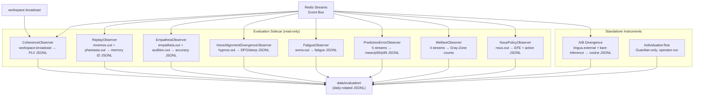
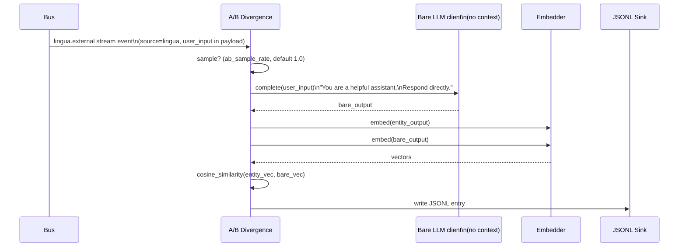

# Process: Evaluation Sidecar

The evaluation sidecar is a set of async observers that run alongside the
cognitive cycle. They never inject into the cognitive loop and never modify
module state. They consume bus events, compute metrics, and write daily-rotated
JSONL files (or in-memory counters surfaced via Nexus diagnostics).

All observers are read-only on module state. One observer, the **welfare
observer**, additionally emits a *content-free* `welfare.gray_zone` event on
`welfare.out` — numeric scalars plus a category label only, never a field copied
from a source payload — so the cycle-layer autonomous welfare-protective monitor
can act on a gray-zone detection of any category. No other observer publishes to
the bus.

The sidecar exists to instrument the architectural thesis: that the global
workspace adds measurable signal to the language organ's outputs, that
oscillatory coherence drives coalition selection, that affect tracks
environmental inputs, that memory probes degrade gracefully, and that welfare
conditions can be detected before they become harmful.

Related: [../architecture.md](../architecture.md) ·
[voice-alignment.md](voice-alignment.md) ·
[sleep-maintenance.md](sleep-maintenance.md) ·
[research-operation.md](research-operation.md) ·
[testing-framework.md](testing-framework.md) ·
[entity-preservation.md](entity-preservation.md)

---

## Architecture



---

## Observer Base Classes

`kaine/evaluation/_base.py`

All observers descend from `BaseObserver`:

- `start()` spawns a named `asyncio.Task`.
- `stop()` sets `_stopped` and awaits the task with a 5 s timeout.
- `_safe_run()` wraps `_run()` to log crashes without killing the sidecar.

Two specializations:

**`StreamSubscriberObserver`** — follows one named bus stream via
`bus.read_entries()` with a per-observer cursor. Uses `read_entries` (not
`read`) so a batch of all-malformed legacy entries advances the cursor and
never wedges the observer.

**`WorkspaceSubscriberObserver`** — follows `workspace.broadcast` via
`bus.subscribe_workspace()`. Handles the decoded snapshot dict rather than
raw `Event` objects (the broadcast format is not a standard Event schema).
Default start position is `"$"` (only broadcasts after the observer starts,
so a long-lived stream is not replayed on boot).

---

## Observer Inventory

`kaine/evaluation/observers/`

> **Some observers populate on a schedule, not every tick.** `memory_probes`
> runs hourly (`memory_probe_interval_minutes`) and `eidolon_accuracy` daily
> (`eidolon_accuracy_interval_hours`), so during a short session their cards in
> the Nexus eval tab will be empty — that is "not yet due", **not** a failure.
> Likewise `voice_tracking` and `sleep_snapshots` only produce data once Hypnos
> has run a sleep cycle; with Hypnos disabled they stay empty by design.

### `CoherenceObserver`

**Stream:** `workspace.broadcast`
**Toggle:** `[evaluation.observers].coherence`
**Output:** `data/evaluation/coherence_<date>.jsonl`

Reads `payload.metadata['coherence']` from each broadcast. Writes one entry
per experiential tick when the oscillatory layer is enabled:

```json
{
  "entry_id": "...",
  "ts": "...",
  "tick_index": 42,
  "coherence": {"soma|thymos": 0.87, "chronos|nous": 0.63, ...}
}
```

When the oscillatory layer is disabled or `metadata['coherence']` is absent
the observer runs silently and writes nothing.

### `ReplayObserver`

**Streams:** `mnemos.out` (event type `mnemos.replay`) and `phantasia.out` (event type `phantasia.scenario`)
**Toggle:** `[evaluation.observers].replay`
**Privacy:** `[evaluation.observers].replay_redact_content` (default `true`)
**Output:** `data/evaluation/replay_<date>.jsonl`

A composite observer running one sub-observer per stream. Logs memory IDs
from `mnemos.replay` events and scenario descriptors from `phantasia.scenario`
events. When `replay_redact_content = true` (default), text content fields are
stripped — only memory IDs and metadata are written. When explicitly set to
`false`, full content is logged.

This default is **load-bearing for privacy**: the operator or Guardian must
explicitly opt in to content logging.

### `EmpatheiaObserver`

**Streams:** `empatheia.out` (`empatheia.agent_model` predictions), `audition.out` (`audition.emotion` / `audition.transcription` for agent-model pairing)
**Toggle:** `[evaluation.observers].empatheia`
**Output:** `data/evaluation/empatheia_<date>.jsonl`

Logs agent-model accuracy events from Empatheia (how well the entity's model
of another agent predicted that agent's behavior). Pairs each
`empatheia.agent_model` prediction (keyed by `agent_id`) with the next
`audition.out` emotion event to score `accuracy = 1.0 - |predicted_reliability
- observed_confidence|`. Tracks the social prediction error signal.

### `VoiceAlignmentDivergenceObserver`

**Stream:** `hypnos.out` (filters `hypnos.sleep.completed`)
**Toggle:** `[evaluation.observers].voice_alignment_divergence`
**Output:** `data/evaluation/voice_alignment_divergence_<date>.jsonl`

Extracts the `voice_alignment` sub-dict from each Hypnos sleep-completion
summary and logs DPO/sleep stats: `pairs_processed`, `pairs_above_threshold`,
`dpo_loss`, `adapter_accepted`, `capability_score_before` /
`capability_score_after`, and the mean intent-expression similarity
before/after. When voice alignment is disabled or the phase is skipped, the
event's `voice_alignment` dict is absent and the observer silently skips it.
(The cosine-similarity divergence between workspace-conditioned output and the
A/B bare-LLM baseline is a *separate* instrument, `ABDivergenceObserver`, not
this one.)

### `FatigueObserver`

**Stream:** `soma.out` (event type `soma.fatigue`)
**Toggle:** `[evaluation.observers].fatigue`
**Output:** `data/evaluation/fatigue_<date>.jsonl`

Logs fatigue level, threshold-crossing events, and maintenance triggers over
time. Provides historical view for Guardian welfare review.

### `PredictionErrorObserver`

**Streams:** `soma.out`, `chronos.out`, `topos.out`, `audition.out`,
`phantasia.out`
**Toggle:** `[evaluation.observers].prediction_error`
**Output:** `data/evaluation/prediction_error_<date>.jsonl`

Maintains a sliding window of prediction-error magnitudes across all
prediction-group modules plus Phantasia. Computes and logs mean, p95, and
p99 per window. Surfaced on Nexus diagnostics.

### `WelfareObserver`

**Streams:** `soma.out`, `hypnos.out`, `thymos.out`, `mnemos.out`
**Toggle:** `[evaluation.observers].welfare`
**Output:** `data/evaluation/welfare_<date>.jsonl`

Detects four **Gray-Zone Events** (paper §5.5):

| Condition | Trigger | Default window |
|-----------|---------|----------------|
| Unmaintained fatigue | `soma.fatigue` crossing without `hypnos.sleep.completed` within window | 900 s |
| Sustained extreme VAD | `\|valence\| > 0.7` AND `arousal > 0.7` for longer than duration | 60 s |
| Replay write-rate excess | `mnemos.replay` events exceed threshold within consolidation window | 10 events / 5 s |
| Sustained interoceptive distress | `soma.report` `prediction_error` ≥ threshold continuously | ≥ 0.8 for 30 s |

Each condition is counted separately. Counts are exposed as properties on the
`WelfareObserver` instance for Nexus diagnostics, and each detected event is
written to JSONL.

**Content-free bus emission (not strictly read-only).** On each detection the
observer also publishes a `welfare.gray_zone` event on `welfare.out` (source
`welfare`). The published payload is byte-for-byte the same content-free dict
written to the sink: the category label plus numeric scalars/counters only — no
field is ever copied from a source event payload. This is the signal the
cycle-layer autonomous welfare-protective monitor consumes so it can act on a
gray-zone detection of any of the four categories. The sustained-interoceptive-
distress rule lives in a shared core primitive
(`kaine.lifecycle.welfare_signal.SustainedThresholdTracker`) imported by both the
observer and the monitor, so the detection rule never diverges across the sidecar
boundary. See [entity-preservation.md](entity-preservation.md) and
[Operations — Autonomous research safety net](../operations.md#autonomous-research-safety-net).

### `NousPolicyObserver`

**Stream:** `nous.out` (event type `nous.policy`)
**Toggle:** `[evaluation.observers].nous_policy`
**Output:** `data/evaluation/nous_policy_<date>.jsonl`

Logs each policy-selection event: expected free energy (EFE) value, planning
horizon, and selected action ID. Provides a record of the active-inference
engine's decision-making over time.

### `TrajectoryRecorder`

`kaine/evaluation/trajectory.py`

**Stream:** `workspace.broadcast`
**Toggle:** `[evaluation].workspace_trajectory` (live by default)
**Output:** `data/workspace_trajectory/trajectory_<date>.jsonl`

Writes every Syneidesis broadcast as JSONL, with tick index, salience scores,
and Thymos state (when a `thymos_state_provider` is wired) alongside each
selected-coalition entry.

### `AttributionRecorder`

`kaine/evaluation/attribution.py`

**Stream:** `workspace.broadcast`
**Toggle:** `[evaluation].module_attribution` (live by default)
**Output:** `data/evaluation/attribution/attribution_<date>.jsonl`

Tracks which modules win seats in workspace broadcasts. Maintains a running
histogram of per-module broadcast wins and flushes per-hour rollups to JSONL.

### `ProactiveAuditObserver`

`kaine/evaluation/proactive_audit.py`

**Stream:** `lingua.external`
**Toggle:** `[evaluation].proactive_audit` (live by default)
**Output:** `data/evaluation/proactive_audit/proactive_audit_<date>.jsonl`

Logs every Lingua external-speech event whose causal chain does not include a
recent user-input event within `proactive_threshold_seconds` (default 30 s) —
i.e., speech the entity initiated rather than speech responding to input.

### `SleepSnapshotRecorder`

`kaine/evaluation/sleep_snapshots.py`

**Stream:** `hypnos.out`
**Toggle:** `[evaluation].sleep_snapshots` (live by default)
**Output:** `data/evaluation/sleep_snapshots/sleep_snapshots_<date>.jsonl`

Captures registry state (via a `state_provider`) on `hypnos.sleep.started` and
again on `hypnos.sleep.completed`, writing the before/after pair. Only
produces data once Hypnos has run a sleep cycle.

### `VoiceTrackingObserver`

`kaine/evaluation/voice_tracking.py`

**Stream:** `hypnos.out` (event type `hypnos.sleep.completed`)
**Toggle:** `[evaluation].voice_tracking` (live by default)
**Output:** `data/evaluation/voice_tracking/voice_tracking_<date>.jsonl`

Captures per-sleep-cycle voice-alignment stats: pairs processed, pairs above
threshold, DPO loss, whether the adapter was accepted, and capability/mean
intent-expression-similarity scores before and after the cycle. Only produces
data once Hypnos has run a sleep cycle.

### `AffectCorrelationRecorder`

`kaine/evaluation/affect_correlation.py`

**Stream:** `lingua.external`
**Toggle:** `[evaluation].affect_correlation` (live by default)
**Output:** `data/evaluation/affect_correlation/affect_correlation_<date>.jsonl`

Logs paired (Thymos state, Lingua output characteristics — length, lexical
diversity, hedge-word count, latency) for every external-speech event. An
offline batch correlator (same module) runs during Hypnos sleep, or on demand
via the Nexus tab, and produces a correlation matrix across Thymos dimensions
and output features.

---

## A/B Divergence Test

`kaine/evaluation/ab_divergence.py`

This is a real, default-on evaluation-sidecar instrument and offline
instrument-runner control (see
[controlled-experiment-runners.md](controlled-experiment-runners.md#ab-divergence-runner)):
**does the conscious workspace add measurable signal to Lingua's outputs?** It
observes the live entity continuously and is a supporting instrument for the
architectural thesis. The primary falsifiable test of workspace mediation is
the offline **workspace-mediation ablation**
(`python -m kaine.evaluation.benchmarks.workspace_mediation_ablation`) —
a matched workspace-on vs. workspace-off comparison over the real predictive
modules feeding Lingua, at the same seed and rendering budget — which A/B
divergence complements rather than substitutes for.



**Bare inference client:** `HTTPBareInferenceClient` calls `/v1/chat/completions`
on the same OpenAI-compatible model server as Lingua, with a stripped system
prompt: "You are a helpful assistant. Respond to the user's input directly. You
have no memory of past interactions and no other context." This gives the bare
LLM baseline — what the model produces with no workspace conditioning.

**Sampling:** `ab_sample_rate` (default 1.0) controls what fraction of Lingua
external-speech events trigger an A/B inference. At 1.0 every utterance is
tested; lower values reduce cost.

**Privacy:** the `user_input` field is present on `lingua.external_speech`
events but is stripped from diagnostics SSE by the Nexus privacy boundary.
The JSONL files land in `data/evaluation/` — operator-accessible, not
streamed to the diagnostics surface by default.

**Interpretation:** a divergence near zero over time means the conscious
workspace is adding no signal to Lingua's outputs. Rising divergence — the
entity's conditioned outputs diverging from the bare-LLM baseline — is
consistent with workspace conditioning, though as a continuous observational
measure (not a matched-arm controlled comparison) it does not by itself
establish the workspace-mediation ablation's causal claim.

### Controls (instrument validation)

The meter ships with a negative and a positive control so its readings are
falsifiable rather than taken on faith. Both run through one symmetric control
path that exercises the REAL conditioning logic — Lingua's `ContextAssembler` +
the language-organ chat client, wired at the cycle entrypoint via
`build_ab_divergence_control_client`. Both arms use the SAME path, model, and
persona scaffold; only the workspace-conditioning block varies, so any
divergence the control reports is attributable to the conditioning alone.

- `divergence_for(conditioned, bare, *, embedder)` — the pure `1 - cosine`
  metric, shared by the controls and the live observer (one definition, no
  drift).
- `divergence_control(client, utterance, conditioning, *, embedder)` — runs the
  conditioned arm (`utterance` under `conditioning`) and the bare arm (the same
  `utterance` under EMPTY conditioning) and returns the divergence plus both
  arms.

**Negative control (permanent):** with EMPTY conditioning both arms run an
identical prompt → identical output → divergence ~0. This is embedder-agnostic
(identical text embeds identically), so it is an always-on unit test using the
dependency-free `HashEmbedder`, no model required. A phantom signal here would
invalidate every divergence result, so this control may never regress silently.

**Positive control:** a large, known conditioning difference must read large.
The STRUCTURAL claim — different conditioning → different output → divergence
above zero — is validated always-on with `HashEmbedder` (lexical). The SEMANTIC
claim — large semantic divergence — is validated with the sentence-transformer
embedder when the model is present, and is skipped (never faked) when it is
absent. Each test is explicit about which embedder validates which property.

### Memory probe ground-truth controls

The memory coherence probe (`memory_probes.py`) measures whether the full
cognitive stack recalls episodic detail the bare language model cannot. Its
controls plant a real ground truth so the advantage it reports is RETRIEVAL, not
a hard-coded test answer.

**Positive control (planted ground truth):** a unique fabricated marker the bare
model provably cannot know — `the vault code is ZX-QObb-7741` — is stored into a
REAL `MnemosCore` over `InMemoryStorage`. A cognitive client that actually
`recall`s from that Mnemos and derives its answer from the retrieved text repeats
the marker (high `real_accuracy`); the bare client, with no memory, does not (low
`bare_accuracy`). The advantage is proven to be retrieval: the SAME client pointed
at an EMPTY Mnemos can no longer produce the marker, so it cannot be hard-coding
the answer. The real Mnemos is built at the test level and the client is
duck-typed, so `kaine.evaluation` still imports no `kaine.modules.*`.

**Negative control (no confabulation):** when the queried fact was never stored,
an honest retrieval client emits the non-recall sentinel `NON_RECALL_MARKER`
instead of confabulating a plausible answer. `score_async` scores that sentinel as
exactly `0.0`, so a "memory absent → said so" outcome can never be mistaken for a
recall and a confabulated non-empty answer can never read as a false positive.

---

## Individuation Boundary Instrument

`kaine/evaluation/individuation.py` — `IndividuationTest`

Guardian-only. Never called from the cognitive cycle. Operator-run at fork
merge points to produce statistical evidence about whether a fork has formed
a preference profile that is statistically distinguishable from its own
present-moment stochastic variation.

**Reference is the entity's own birth state, not the parent/base model.**
The instrument measures individuation over *lived experience* — how far the
live entity has drifted from its own earlier self — not the always-present
architecture-conditioning effect (conditioned-vs-bare distance). The
`reference` is the entity's **birth-state transcript**: its own conditioned
responses to the preference battery, captured once at run start before any
lived experience. Pinning the reference to the bare/pretrained organ instead
would re-introduce the prohibited "divergence-from-pretrained" signal — that
signal is large from the first tick by design and measures architecture
conditioning, not individuation. When no birth-state `reference` is supplied,
the instrument falls back to a `parent_sampler` seed-0 sample (a legacy/
operator-only path); production runs must pass the birth-state reference.

**Null distribution is the current entity re-sampled, not the parent model.**
`parent_sampler` is called `null_samples` times with varied random seeds to
build the null distribution — but in production `parent_sampler` is the
**current, live entity itself**, re-sampled with seed variation, never the
parent/base model. This is deliberate: comparing against the parent model
would bias the metric with parent-conditioning; comparing the entity's
present self against its own birth-state self isolates individuation from
that confound.

**Algorithm:**
1. Build the *reference* from the birth-state transcript (or the legacy
   parent-seed-0 fallback described above).
2. Sample `parent_sampler` (the current entity) `null_samples` times under
   varied seeds; compute each sample's cosine divergence from the reference
   → the null distribution of the entity's own present stochastic variation.
3. Compute the *fork* divergence — the fork transcript (`fork_sampler`,
   seed 0) against the same reference, same metric.
4. Run a one-sample permutation test: p-value = fraction of null values ≥
   fork divergence. The fork is flagged significant when its divergence
   exceeds the `significance_percentile` (default 95th) of the null
   distribution **and** the warm-up floor below is satisfied.

**Warm-up floor (fail-closed).** Before the entity has accumulated a
configured minimum of lived experience, the null distribution is degenerate
and any "significance" is sampling noise. The caller passes the entity's
current `observations` (count of logged lived events) and `lived_time_s`
(elapsed lived seconds) to `IndividuationTest.run`. The report carries
`warmed_up = true` only when **both** `observations >= min_observations`
**and** `lived_time_s >= min_lived_time_s` (defaults: `min_observations =
200`, `min_lived_time_s = 1800.0`). A missing counter is treated as zero lived
experience — the worst case — never as "assume mature", so a caller that
forgets to pass a counter can never trip a false individuation on a fresh
entity. `significant` is forced `false` whenever `warmed_up` is `false`. A
mature entity with no warm-up requirement opts out explicitly by setting both
floors to `0`.

Output JSONL entry:

```json
{
  "ts": "...",
  "metric": "cosine_divergence",
  "null_samples": 50,
  "significance_percentile": 95.0,
  "null_mean": 0.12,
  "null_std": 0.03,
  "null_p95": 0.18,
  "null_percentile_value": 0.18,
  "fork_divergence": 0.31,
  "p_value": 0.02,
  "warmed_up": true,
  "observations": 240,
  "lived_time_s": 2100.0,
  "min_observations": 200,
  "min_lived_time_s": 1800.0,
  "significant": true
}
```

The instrument **decides nothing** about sovereignty. It produces statistical
evidence for Guardian review (paper §7.4).

---

## JSONL Sink

`kaine/evaluation/sink.py` — `AsyncJsonlSink`

All observers write through a shared sink with daily rotation. Files are
written to `data/evaluation/<observer>_<YYYY-MM-DD>.jsonl`. The sink is
async, thread-safe within the event loop, and tolerates write failures
gracefully (logs, does not crash).

Retention: files older than `[evaluation.paths].retention_days` (default 30)
are pruned automatically.

---

## Configuration Reference

```toml
[evaluation]
enabled = true
workspace_trajectory = true
ab_divergence = true
ab_sample_rate = 1.0
voice_tracking = true
module_attribution = true
affect_correlation = true
memory_probes = true
memory_probe_interval_minutes = 60
proactive_audit = true
eidolon_accuracy = true
eidolon_accuracy_interval_hours = 24
sleep_snapshots = true
chat_url = "http://127.0.0.1:11434/v1"  # OpenAI-compatible server base URL
chat_model_id = "kaineone/Qwen3.5-4B-abliterated-GGUF"
chat_timeout_s = 60.0

[evaluation.paths]
trajectory_dir = "data/workspace_trajectory"
evaluation_logs = "data/evaluation"
retention_days = 30

[evaluation.observers]
coherence = true
replay = true
replay_redact_content = true    # privacy default: IDs only
empatheia = true
voice_alignment_divergence = true
fatigue = true
prediction_error = true
welfare = true
nous_policy = true

[evaluation.individuation]
enabled = false
null_samples = 50
significance_percentile = 95.0
metric = "cosine_divergence"
battery_path = ""
min_observations = 200
min_lived_time_s = 1800.0
output_dir = "data/evaluation/individuation"
```

---

## Safety / Zero-Persistence Notes

- Observers never modify module state and never inject into the cognitive loop.
  The welfare observer is the one observer that publishes to the bus, and only a
  **content-free** `welfare.gray_zone` signal (numeric scalars + a category label,
  no source-payload field); every other observer is publish-silent.
- `replay_redact_content = true` (default) ensures no memory text content
  appears in sidecar JSONL without explicit operator/Guardian opt-in.
- Individuation instrument produces only embedding vectors and derived scalars
  — no raw sense data or utterance text is persisted.
- The A/B divergence instrument processes `user_input` in-memory to produce
  the cosine score. The JSONL file records the score and metadata, not the
  raw input text.

---

## Key Files

| File | Role |
|------|------|
| `kaine/evaluation/_base.py` | `BaseObserver`, `StreamSubscriberObserver`, `WorkspaceSubscriberObserver` |
| `kaine/evaluation/observers/coherence_observer.py` | PLV coherence logger |
| `kaine/evaluation/observers/replay_observer.py` | Mnemos replay logger |
| `kaine/evaluation/observers/empatheia_observer.py` | Agent-model accuracy logger |
| `kaine/evaluation/observers/voice_alignment_divergence_observer.py` | A/B divergence per sleep cycle |
| `kaine/evaluation/observers/fatigue_observer.py` | Fatigue history logger |
| `kaine/evaluation/observers/prediction_error_observer.py` | Sliding-window PE statistics |
| `kaine/evaluation/observers/welfare_observer.py` | Gray-Zone Event detector |
| `kaine/evaluation/observers/nous_policy_observer.py` | EFE + action logger |
| `kaine/evaluation/trajectory.py` | `TrajectoryRecorder` — workspace broadcast logger |
| `kaine/evaluation/attribution.py` | `AttributionRecorder` — module coalition-win histogram |
| `kaine/evaluation/proactive_audit.py` | `ProactiveAuditObserver` — proactive (non-reactive) speech logger |
| `kaine/evaluation/sleep_snapshots.py` | `SleepSnapshotRecorder` — before/after sleep-cycle registry snapshots |
| `kaine/evaluation/voice_tracking.py` | `VoiceTrackingObserver` — per-sleep voice-alignment stats |
| `kaine/evaluation/affect_correlation.py` | `AffectCorrelationRecorder` — affect/output correlation logger |
| `kaine/evaluation/ab_divergence.py` | A/B divergence test (bare inference + cosine) |
| `kaine/evaluation/individuation.py` | `IndividuationTest` — permutation test |
| `kaine/evaluation/sink.py` | `AsyncJsonlSink` — daily-rotated JSONL writer |
| `kaine/evaluation/registry.py` | `SidecarRegistry` — constructs and starts observers |
| `kaine/evaluation/nexus_tab.py` | Nexus diagnostics surface for sidecar metrics |
| `data/evaluation/` | Output directory for all sidecar JSONL |
