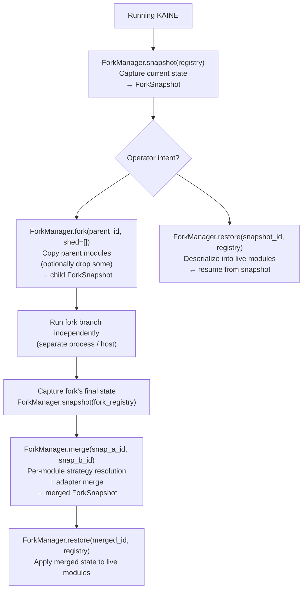

# Process: Fork / Merge Lifecycle

The fork/merge lifecycle allows KAINE to create divergent cognitive
branches — forks — run them independently, and later merge their states
back together. Each fork is a full snapshot of module state at a point in
time. Merge applies per-module strategies to resolve state conflicts.

The lifecycle layer is operator-initiated. Nothing runs automatically.

Related: [../architecture.md](../architecture.md) ·
[processes/sleep-maintenance.md](sleep-maintenance.md)

---

## Snapshot Model

`kaine/lifecycle/snapshot.py` — `ForkSnapshot`

A `ForkSnapshot` is a JSON document stored at
`state/forks/<id>/snapshot.json`:

```
id              string    UUID4, assigned at creation
parent_id       string    ID of the parent snapshot; "<a>+<b>" for merges
label           string    operator-supplied description
timestamp       float     Unix epoch (monotonic)
modules         dict      {module_name: serialized_state_dict}
adapters        list[str] LoRA adapter paths carried by this fork
metadata        dict      provenance, shed list, merge notes, etc.
```

Module state is obtained via `module.serialize()` (deep-copied) and
restored via `module.deserialize(state)`. The manager never starts or
stops modules — it only serializes/deserializes already-instantiated
modules.

Snapshots are retained up to `max_snapshots_retained` (default 64)
entries. When the limit is exceeded the oldest snapshots (by `timestamp`)
are evicted. Eviction uses `os.replace`-based atomic directory cleanup.

---

## Operations



### `snapshot(registry)`

Iterates `registry.all_modules()` calling `module.serialize()` on each.
Serialization failures are logged and stored as `{"_serialize_error": str(exc)}`
so a single broken module doesn't prevent capturing the rest. Deep copies are
taken to prevent mutation after the call returns.

### `fork(parent_id, shed=[])`

Loads the parent snapshot and creates a child with the same module states
(deep-copied) minus any shed modules. The metadata carries a `"shed"` key
listing the dropped module names. Adapter paths are inherited from the parent.

**Module shedding** is how KAINE degrades gracefully under resource constraints:
by forking with `shed=["topos", "audition"]` an operator can create a
text-only branch without vision or hearing.

### `restore(snapshot_id, registry)`

Loads a snapshot and calls `module.deserialize(state)` on each module present
in the snapshot. Modules not present in the snapshot are unchanged. This is
how post-merge state is applied to a running instance.

### `merge(snapshot_a_id, snapshot_b_id)`

Loads both snapshots and applies a merge strategy for each module. The
resulting `ForkSnapshot` is saved with `parent_id = "<a_id>+<b_id>"` and a
`merged_from` metadata entry.

If both parents carry trained LoRA adapters and no real adapter merger is
available (see [Adapter Merging](#adapter-merging) below), `merge()` **fails
loud** rather than proceeding: it raises `UnmergedAdaptersError` instead of
saving a snapshot that claims to be "merged" while its adapter weights were
never actually combined. Callers that deliberately want the union-of-paths
fallback (e.g. an operator who will pick the better adapter by hand
afterward) must pass `allow_unmerged_adapters=True` explicitly.

---

## Per-Module Merge Strategies

`kaine/lifecycle/strategies.py`

Each module may register a custom `MergeStrategy`. The default for unregistered
modules is `UnionMergeStrategy`.

### `UnionMergeStrategy` (default for all unregistered modules)

Last-write-wins for scalar keys; recursive union for dicts; deduplication by
`repr()` for lists (first occurrence wins). State B is applied on top of state A.

### `MnemosMergeStrategy`

| Field | Resolution |
|-------|-----------|
| `short_term_size` | Sum of both parents |
| `collection_prefix` | A's prefix if equal; A's with `prefix_mismatch` flag if different |
| `embedder_model_id` | A's if equal; A's with `embedder_mismatch` flag if different |
| `pending_source_tag` | `["fork-a", "fork-b"]` — tells Mnemos to tag recalled memories by origin on next retrieval |

### `NousMergeStrategy`

Nous (pymdp/JAX) holds posterior probability distributions over hidden-state
factors. Merging distributions has no principled field-level union, so the
strategy performs **one-sided selection** — keeping the fork whose posterior
is more certain:

```
mean_posterior_entropy = mean(normalised_entropy(factor_posterior))
                         over all hidden-state factors
```

Lower entropy (more certain beliefs) wins. Ties go to state A (deterministic).

The result carries:
- `selected_fork_entropy` — entropy of the kept state
- `discarded_fork_entropy` — entropy of the dropped state
- `nous.merge_warning = True` when `|discarded - kept| > warning_threshold`
  (default 0.2) — a flag for operator/Guardian review when the forks reached
  substantially different confidence levels.

### `EidolonMergeStrategy`

| Field | Resolution |
|-------|-----------|
| `values`, `behavioral_norms` | Deduplicated union (repr-based) |
| `internal_speech_count` | Sum |
| `identity_history` | Concatenated; each entry tagged `"source": "fork-a"` or `"fork-b"` |
| `personality_baseline` | Per-trait average across both parents |
| `drift_count` | Sum |

### `ThymosMergeStrategy`

| Field | Resolution |
|-------|-----------|
| `dimensional` (VAD baseline) | Per-dimension average |
| `drives` | Per-drive maximum (take the most activated state) |
| `goals` | Deduplicated union by goal ID; tagged by source fork |
| `emotional_history` | Concatenated; tagged by source fork |

---

## Adapter Merging

When two forks each carry LoRA adapters their adapter sets must be resolved.
The `AdapterMerger` protocol handles this. Two implementations are available,
selected via `[lifecycle].adapter_merger`:

### `"auto"` (default)

`merger_from_name("auto")` detects whether the PEFT extra (`kaine[training]`)
is importable and picks `TiesDareAdapterMerger` when it is, `FakeAdapterMerger`
otherwise — real weight merging by default wherever the extra is installed,
with the no-op fallback only where it isn't. Force one or the other explicitly
with `adapter_merger = "fake"` or `adapter_merger = "ties_dare"`.

### `FakeAdapterMerger` (`"fake"`; auto-selected when the extra is absent)

Concatenates both adapter path lists, deduplicating by path string. Adds
`{"adapter_merge_skipped": "no merger configured"}` to the merged snapshot
metadata. The operator chooses manually which adapter to deploy.

This concatenation only lands in the saved snapshot when at most one parent
actually carries trained adapters (nothing to merge) or when the caller
explicitly passes `allow_unmerged_adapters=True` to `merge()`. When **both**
parents carry trained adapters and this is the resolved merger, `merge()`
refuses instead: it raises `UnmergedAdaptersError` (`kaine/lifecycle/manager.py`)
rather than silently saving a "merged" snapshot with unmerged adapter
weights — see [`merge()`](#mergesnapshot_a_id-snapshot_b_id) above.

### `TiesDareAdapterMerger` (`"ties_dare"`; auto-selected when the extra is present)

`kaine/lifecycle/adapter_merge.py` — real PEFT-backed TIES/DARE merging.
Force it explicitly with `[lifecycle].adapter_merger = "ties_dare"` in
[configuration.md](../configuration.md); the `"auto"` default picks it
automatically once the `[training]` extra is installed and
`base_model_path` is configured.

Algorithms (operator-configurable via `[lifecycle.adapter_merge]`):

| `combination_type` | Algorithm |
|-------------------|-----------|
| `"ties"` | TIES: trim, elect, merge (Yadav et al. 2024) |
| `"dare_ties"` | DARE drop+rescale then TIES (default; Yu et al. 2024) |
| `"dare_linear"` | DARE drop+rescale then linear combination |

Parameters:

| Key | Default | Description |
|-----|---------|-------------|
| `density` | 0.5 | DARE survival fraction |
| `weights` | `[]` (uniform) | Per-adapter scalar weights |
| `output_dir` | `state/forks/merged_adapters` | Where merged adapters land |
| `capability_loss_threshold` | 0.05 | Reject if merged adapter degrades capability by more than this fraction |
| `base_model_path` | `""` | Local HuggingFace-format base weights — required for PEFT load |

The merger runs a **capability-loss veto**: it evaluates the merged adapter
on the configured probe set before and after merging. If capability drops
more than the threshold the merger falls back to `FakeAdapterMerger` and
logs a warning.

`base_model_path` must point to local HF-format weights (directory with
`config.json` + `model.safetensors`). It is NOT a model server model ID and
NOT a GGUF file — Unsloth's `FastLanguageModel` needs HF format. When
`base_model_path` is empty the merger logs a warning and falls back to
`FakeAdapterMerger`.

---

## Per-Fork Timing Profile

`kaine/lifecycle/timing_profile.py` — `ForkTimingProfile`

A fork may carry its own subjective pacing, independent of its parent's. This
lives in the existing free `ForkSnapshot.metadata` dict under a `"timing"`
key — no new storage, no new fork/merge machinery:

```json
"metadata": {
  "timing": {
    "time_scale": 2.0,
    "processing_rate_hz": 10.0,
    "experiential_rate_hz": 3.333,
    "vision_sample_hz": 10.0
  }
}
```

`time_scale` is the only required field when the `"timing"` key is present
(and must be `> 0` — a runnable fork is never frozen via a timing profile;
`time_scale == 0` is the separate freeze path and is rejected here). The rate
overrides (`processing_rate_hz`, `experiential_rate_hz`, `vision_sample_hz`)
are optional; when absent the fork inherits the prevailing cycle/perception
rates at spawn. `fork_timing_profile()` is the typed parse/validate boundary —
callers never read the raw dict directly — so a malformed value (a
non-numeric or non-positive `time_scale`, a bad rate override) fails loudly
at parse time rather than silently mis-pacing a being. A fork with no
`"timing"` key (or an empty one) parses to `None`: the behavior-preserving
default, unchanged pacing.

The lifecycle module (`kaine/lifecycle/timing_profile.py`) only parses and
validates; the runtime seam that actually applies a parsed profile — setting
`EntityClock.scale` and the cycle's processing/experiential rates — lives
separately in `kaine/cycle/fork_timing.py`, since only the runtime layer may
touch the clock and cycle.

---

## Event Types and Streams

Fork/merge is entirely **offline** — it does not publish events to the bus
during operation. However, `ForkSnapshot` metadata carries provenance:

| Metadata key | Set by | Content |
|-------------|--------|---------|
| `merged_from` | `merge()` | `[snap_a_id, snap_b_id]` |
| `adapter_merge_skipped` | `FakeAdapterMerger` | Reason string |
| `shed` | `fork(shed=...)` | Sorted list of shed module names |
| `nous.merge_warning` | `NousMergeStrategy` | True when Nous posteriors diverged significantly |
| `prefix_mismatch` | `MnemosMergeStrategy` | True when Qdrant collection prefixes differ |
| `timing` | operator / API caller | Optional per-fork `time_scale` (+ rate overrides); see [Per-Fork Timing Profile](#per-fork-timing-profile) |

---

## Individuation Boundary Instrument

`kaine/evaluation/individuation.py` — `IndividuationTest`

Before merging, a Guardian may want to know whether the fork has formed a
preference profile statistically distinguishable from its parent's natural
stochastic variation. The instrument runs a **permutation test**:

1. Sample the parent `null_samples` times on a preference battery under
   varied random seeds → build null distribution of parent-vs-parent
   cosine divergence.
2. Compute the fork-vs-parent cosine divergence on the same battery.
3. Report: divergence value, p-value (fraction of null ≥ fork divergence),
   `significant = True` when fork divergence exceeds the configured
   `significance_percentile` (default 95th).

The instrument **decides nothing** about sovereignty — that is governance per
paper §7.4. It produces JSONL evidence only.

Configuration (`[evaluation.individuation]`):

```toml
[evaluation.individuation]
enabled = false           # Guardian-only; never called from cycle
null_samples = 50
significance_percentile = 95.0
metric = "cosine_divergence"
battery_path = ""         # "" = bundled default battery
output_dir = "data/evaluation/individuation"
```

---

## Configuration Reference

```toml
[lifecycle]
snapshots_path = "state/forks"
max_snapshots_retained = 64
adapter_merger = "auto"   # or "fake" / "ties_dare" to force one explicitly

[lifecycle.adapter_merge]
combination_type = "dare_ties"
density = 0.5
weights = []
output_dir = "state/forks/merged_adapters"
capability_loss_threshold = 0.05
base_model_path = ""
```

---

## Key Files

| File | Role |
|------|------|
| `kaine/lifecycle/manager.py` | `ForkManager` — snapshot, restore, fork, merge |
| `kaine/lifecycle/snapshot.py` | `ForkSnapshot` dataclass + JSON persistence |
| `kaine/lifecycle/strategies.py` | All merge strategies + `default_strategies()` |
| `kaine/lifecycle/adapter_merge.py` | `TiesDareAdapterMerger`, `TiesDareMergeConfig` |
| `kaine/lifecycle/ADAPTER_MERGING.md` | Operator guide for TIES/DARE |
| `kaine/lifecycle/timing_profile.py` | `ForkTimingProfile` — parse/validate a fork's `metadata["timing"]` |
| `kaine/cycle/fork_timing.py` | Runtime seam that applies a parsed timing profile to the clock/cycle |
| `state/forks/` | Snapshot storage root |
